# Module 14 --- Gestion de données volumineuses

## Objectifs pédagogiques

À la fin de ce module vous serez capable de :

-   manipuler des **datasets volumineux**
-   utiliser **data.table** pour des opérations rapides
-   utiliser **Arrow** pour lire des données massives
-   travailler avec le format **Parquet**
-   comprendre les enjeux de **performance et mémoire**

------------------------------------------------------------------------

## Contexte

Dans de nombreux projets data, les datasets peuvent atteindre :

-   plusieurs **gigaoctets**
-   plusieurs **millions de lignes**
-   plusieurs **centaines de colonnes**

Les structures classiques comme **data.frame** peuvent devenir lentes.

Des outils spécialisés existent pour améliorer :

-   la vitesse
-   l'utilisation mémoire
-   la gestion des fichiers massifs

------------------------------------------------------------------------

## Concepts fondamentaux

### Performance

La performance correspond à :

-   la **vitesse de calcul**
-   la **rapidité de lecture des données**
-   la **gestion efficace de la mémoire**

------------------------------------------------------------------------

### Gestion mémoire

R charge normalement les données **en mémoire**.

Pour les datasets massifs, cela peut poser problème :

-   RAM saturée
-   calculs lents

Des outils permettent de traiter les données **plus efficacement**.

------------------------------------------------------------------------

### Formats optimisés

  Format    Avantage
  --------- ----------------------
  CSV       simple mais lent
  Parquet   compressé et rapide
  Arrow     accès colonne rapide

------------------------------------------------------------------------

## Architecture conceptuelle

  Composant        Rôle                  Exemple
  ---------------- --------------------- --------------------
  Dataset massif   grande table          millions de lignes
  data.table       manipulation rapide   filtrage rapide
  Arrow            accès colonnes        lecture rapide
  Parquet          stockage optimisé     compression

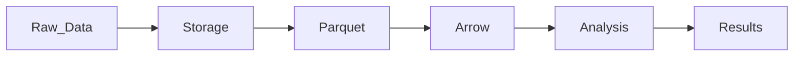

------------------------------------------------------------------------

## Workflow

Workflow typique avec données massives :

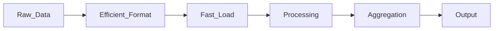

Étapes :

1.  stocker les données dans un format efficace
2.  charger uniquement les colonnes nécessaires
3.  traiter les données
4.  agréger les résultats

------------------------------------------------------------------------

## Mise en pratique

### data.table

Le package **data.table** est conçu pour la performance.

``` r
library(data.table)

dt <- data.table(
  id = 1:5,
  value = c(10,20,30,40,50)
)
```

Filtrage rapide :

``` r
dt[value > 20]
```

------------------------------------------------------------------------

### Lecture rapide

``` r
fread("data.csv")
```

`fread()` est beaucoup plus rapide que `read.csv()`.

------------------------------------------------------------------------

### Arrow

Le package **arrow** permet de manipuler des datasets massifs.

``` r
library(arrow)

data <- read_parquet("data.parquet")
```

------------------------------------------------------------------------

### Parquet

Parquet est un format **colonne compressé**.

Avantages :

-   très rapide
-   efficace pour les gros datasets
-   compatible avec Spark, Python, etc.

------------------------------------------------------------------------

### Écriture parquet

``` r
write_parquet(data, "dataset.parquet")
```

------------------------------------------------------------------------

## Code R expliqué

Exemple :

``` r
dt[value > 20]
```

Analyse :

    dt

table de données.

    [value > 20]

filtre rapide directement dans la structure.

Cette syntaxe est très efficace pour les gros datasets.

------------------------------------------------------------------------

## Cas réel

Supposons un dataset de **100 millions de lignes**.

Stratégie :

1.  stocker en **Parquet**
2.  lire avec **Arrow**
3.  manipuler avec **data.table**

Cela permet de traiter des volumes très importants.

------------------------------------------------------------------------

## Bonnes pratiques

Utiliser **data.table** pour les gros datasets.

Éviter les copies inutiles en mémoire.

Stocker les données dans un format optimisé.

Lire uniquement les colonnes nécessaires.

------------------------------------------------------------------------

## Erreurs fréquentes

Charger un dataset entier inutilement.

Utiliser `read.csv()` sur des fichiers massifs.

Créer des copies de données inutiles.

------------------------------------------------------------------------

## Résumé

Dans ce module nous avons étudié la gestion des **données volumineuses
en R**.

Packages importants :

``` r
data.table
arrow
```

Format clé :

    Parquet

Concepts essentiels :

-   performance
-   gestion mémoire
-   datasets massifs

# Module 15 --- Bases de données

## Objectifs pédagogiques

À la fin de ce module vous serez capable de :

-   connecter R à une **base de données**
-   exécuter des **requêtes SQL**
-   importer des tables dans R
-   écrire des données dans une base
-   utiliser les packages **DBI** et **RPostgres**

------------------------------------------------------------------------

## Contexte

Dans les environnements professionnels, les données sont rarement
stockées dans des fichiers.

Elles sont généralement stockées dans des **bases de données
relationnelles** :

-   PostgreSQL
-   MySQL
-   SQLite
-   SQL Server

Les bases de données permettent :

-   stocker de grandes quantités de données
-   effectuer des requêtes rapides
-   partager les données entre applications

R peut se connecter à ces bases pour :

-   analyser les données
-   récupérer des tables
-   écrire des résultats

------------------------------------------------------------------------

## Concepts fondamentaux

### Base de données relationnelle

Une base relationnelle contient :

  Élément        Description
  -------------- --------------------
  table          ensemble de lignes
  ligne          observation
  colonne        variable
  clé primaire   identifiant unique

------------------------------------------------------------------------

### SQL

SQL signifie :

    Structured Query Language

Il permet de :

-   sélectionner des données
-   filtrer des lignes
-   joindre des tables
-   modifier des données

Exemple :

``` sql
SELECT * FROM customers
```

------------------------------------------------------------------------

## Architecture conceptuelle

  Composant   Rôle                   Exemple
  ----------- ---------------------- ------------
  Database    stockage de données    PostgreSQL
  Driver      connexion R            RPostgres
  Query       récupération données   SELECT
  Result      données dans R         data.frame

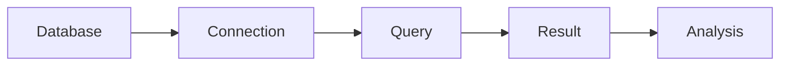

------------------------------------------------------------------------

## Workflow

Workflow classique :

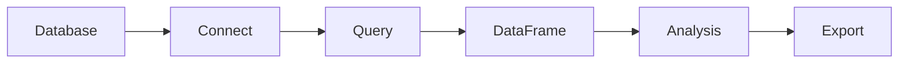

Étapes :

1.  se connecter à la base
2.  exécuter une requête SQL
3.  importer les données dans R
4.  analyser les résultats

------------------------------------------------------------------------

## Mise en pratique

### Installation des packages

``` r
install.packages("DBI")
install.packages("RPostgres")
```

------------------------------------------------------------------------

### Charger les packages

``` r
library(DBI)
library(RPostgres)
```

------------------------------------------------------------------------

### Connexion PostgreSQL

``` r
con <- dbConnect(
  RPostgres::Postgres(),
  dbname = "my_database",
  host = "localhost",
  port = 5432,
  user = "user",
  password = "password"
)
```

------------------------------------------------------------------------

### Lire une table

``` r
data <- dbReadTable(con, "customers")
```

------------------------------------------------------------------------

### Exécuter une requête SQL

``` r
data <- dbGetQuery(con, "SELECT * FROM customers")
```

------------------------------------------------------------------------

### Écrire dans une table

``` r
dbWriteTable(con, "results", data)
```

------------------------------------------------------------------------

### Déconnexion

``` r
dbDisconnect(con)
```

------------------------------------------------------------------------

## SQLite

SQLite est une base **locale** stockée dans un fichier.

Connexion :

``` r
library(RSQLite)

con <- dbConnect(RSQLite::SQLite(), "database.sqlite")
```

------------------------------------------------------------------------

## Code R expliqué

Exemple :

``` r
dbGetQuery(con, "SELECT * FROM customers")
```

Analyse :

    dbGetQuery()

exécute une requête SQL.

    con

connexion à la base.

    SELECT * FROM customers

requête SQL.

Résultat :

un **data.frame dans R**.

------------------------------------------------------------------------

## Cas réel

Supposons une base PostgreSQL contenant les ventes.

``` sql
sales
customers
products
```

R peut récupérer les données :

``` r
sales <- dbGetQuery(con, "SELECT * FROM sales")
```

Puis analyser :

``` r
summary(sales)
```

------------------------------------------------------------------------

## Bonnes pratiques

Filtrer les données directement dans SQL.

Exemple :

``` sql
SELECT * FROM sales WHERE year = 2024
```

Ne pas importer toute la base inutilement.

Utiliser des index dans la base.

------------------------------------------------------------------------

## Erreurs fréquentes

Importer trop de données en mémoire.

Ne pas fermer les connexions.

Écrire des requêtes SQL inefficaces.

------------------------------------------------------------------------

## Résumé

Dans ce module nous avons vu comment connecter R à des bases de données.

Bases supportées :

-   PostgreSQL
-   MySQL
-   SQLite

Packages utilisés :

``` r
DBI
RPostgres
```

Fonctions importantes :

``` r
dbConnect()
dbGetQuery()
dbReadTable()
dbWriteTable()
dbDisconnect()
```

Ces outils permettent d'intégrer R dans des **pipelines data connectés
aux bases SQL**.

# Module 16 --- API et ingestion de données

## Objectifs pédagogiques

À la fin de ce module vous serez capable de :

-   comprendre le fonctionnement des **API REST**
-   récupérer des données via **HTTP**
-   parser des **réponses JSON**
-   automatiser l'ingestion de données dans R
-   construire un premier pipeline d'acquisition de données

------------------------------------------------------------------------

## Contexte

De nombreuses sources de données modernes ne sont pas stockées dans des
fichiers.

Elles sont accessibles via des **API (Application Programming
Interfaces)**.

Les APIs permettent :

-   d'accéder à des services distants
-   d'obtenir des données en temps réel
-   d'automatiser des pipelines de données

Exemples d'API :

-   API météo
-   API financières
-   API sport (NBA, football)
-   API réseaux sociaux

En R, deux packages principaux sont utilisés :

-   **httr** → requêtes HTTP
-   **jsonlite** → parsing JSON

------------------------------------------------------------------------

## Concepts fondamentaux

### API REST

Une API REST fonctionne via des requêtes HTTP.

  Méthode   Usage
  --------- -----------------------
  GET       récupérer des données
  POST      envoyer des données
  PUT       modifier
  DELETE    supprimer

La plupart des APIs renvoient les données en **JSON**.

------------------------------------------------------------------------

### JSON

JSON signifie :

    JavaScript Object Notation

C'est un format structuré très utilisé sur le web.

Exemple :

``` json
{
 "name": "Alice",
 "age": 30
}
```

------------------------------------------------------------------------

## Architecture conceptuelle

  Composant       Rôle                 Exemple
  --------------- -------------------- -----------------
  API             service distant      api.example.com
  HTTP request    appel au service     GET
  JSON response   données retournées   JSON
  Parser          transformation       jsonlite

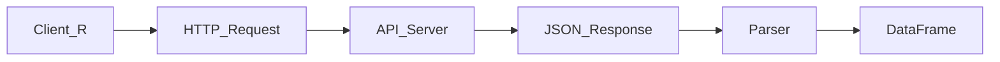

------------------------------------------------------------------------

## Workflow

Workflow typique d'ingestion API :

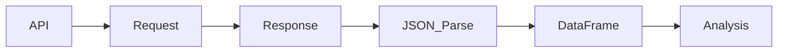

Étapes :

1.  appeler l'API
2.  récupérer la réponse
3.  parser le JSON
4.  transformer en data.frame

------------------------------------------------------------------------

## Mise en pratique

### Installer les packages

``` r
install.packages("httr")
install.packages("jsonlite")
```

------------------------------------------------------------------------

### Charger les packages

``` r
library(httr)
library(jsonlite)
```

------------------------------------------------------------------------

### Requête GET

Exemple :

``` r
GET("https://api.example.com/data")
```

Cette commande envoie une requête HTTP.

------------------------------------------------------------------------

### Récupérer la réponse

``` r
response <- GET("https://api.example.com/data")
```

------------------------------------------------------------------------

### Lire le contenu JSON

``` r
data <- content(response)
```

------------------------------------------------------------------------

### Parser JSON

``` r
data <- fromJSON("data.json")
```

------------------------------------------------------------------------

### Exemple complet

``` r
response <- GET("https://api.example.com/data")

json <- content(response, "text")

data <- fromJSON(json)
```

Résultat :

un **data.frame exploitable dans R**.

------------------------------------------------------------------------

## Code R expliqué

Exemple :

``` r
GET("https://api.example.com/data")
```

Analyse :

    GET()

fonction du package **httr**.

    https://api.example.com/data

URL de l'API.

Résultat :

un **objet response HTTP**.

------------------------------------------------------------------------

## Cas réel

Supposons une API météo.

``` r
url <- "https://api.weather.com/data"

response <- GET(url)

data <- fromJSON(content(response, "text"))
```

On peut ensuite analyser :

``` r
summary(data)
```

------------------------------------------------------------------------

## Bonnes pratiques

Gérer les erreurs HTTP.

``` r
status_code(response)
```

Respecter les limites d'API.

Utiliser la pagination si nécessaire.

Sauvegarder les données localement.

------------------------------------------------------------------------

## Erreurs fréquentes

Ignorer les erreurs HTTP.

Ne pas vérifier le format JSON.

Effectuer trop d'appels API.

------------------------------------------------------------------------

## Résumé

Dans ce module nous avons appris à récupérer des données via des
**API**.

Packages utilisés :

``` r
httr
jsonlite
```

Exemple central :

``` r
GET("https://api.example.com/data")
```

Concepts clés :

-   API REST
-   requêtes HTTP
-   parsing JSON
-   ingestion automatisée

# Module 17 --- Parallélisation

## Objectifs pédagogiques

À la fin de ce module vous serez capable de :

-   comprendre le principe du **calcul parallèle**
-   utiliser plusieurs **cœurs CPU**
-   accélérer des traitements R
-   utiliser les packages :

``` r
future
parallel
```

------------------------------------------------------------------------

## Contexte

Lorsque les datasets deviennent volumineux ou que les calculs sont
lourds, les traitements peuvent devenir très lents.

Une solution consiste à utiliser **plusieurs cœurs du processeur en même
temps**.

C'est le principe de la **parallélisation**.

Au lieu d'exécuter les calculs **séquentiellement**, ils sont exécutés
**en parallèle**.

Cela permet :

-   d'accélérer les calculs
-   de traiter plus de données
-   d'optimiser les pipelines data

------------------------------------------------------------------------

## Concepts fondamentaux

### Calcul séquentiel

Un traitement classique est exécuté **étape par étape**.

Exemple :

    tâche 1 → tâche 2 → tâche 3

------------------------------------------------------------------------

### Calcul parallèle

Le calcul parallèle exécute plusieurs tâches **simultanément**.

    tâche 1
    tâche 2  → exécutées en même temps
    tâche 3

------------------------------------------------------------------------

### Multicore

Les processeurs modernes possèdent plusieurs **cœurs**.

Chaque cœur peut exécuter un calcul indépendant.

Exemple :

  CPU                Cœurs
  ------------------ -------
  Laptop classique   4
  Workstation        8-32
  Serveur            64+

------------------------------------------------------------------------

## Architecture conceptuelle

  Composant   Rôle                  Exemple
  ----------- --------------------- -----------
  CPU cores   exécution parallèle   multicore
  Worker      processus parallèle   tâche
  Scheduler   distribution tâches   future
  Résultat    agrégation            output

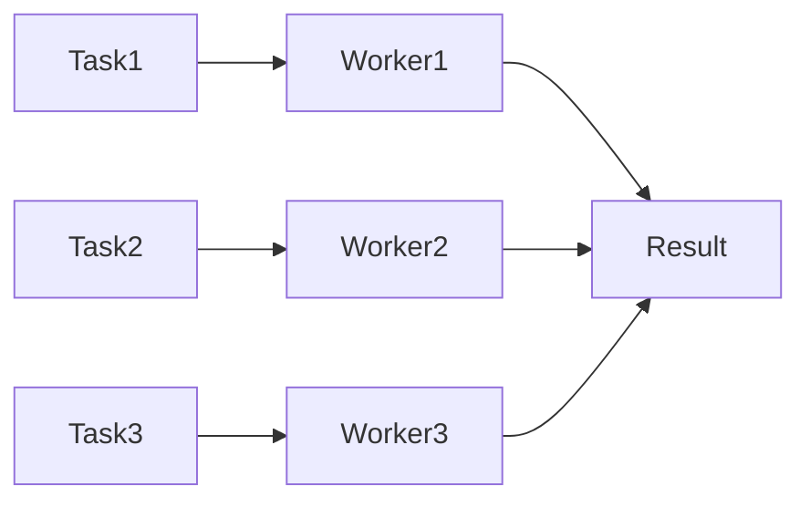

------------------------------------------------------------------------

## Workflow

Workflow classique :

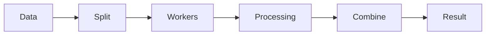

Étapes :

1.  diviser les tâches
2.  exécuter en parallèle
3.  combiner les résultats

------------------------------------------------------------------------

## Mise en pratique

### Package parallel

Le package **parallel** est inclus dans R.

Exemple simple :

``` r
library(parallel)

cores <- detectCores()

cores
```

Cela affiche le nombre de cœurs disponibles.

------------------------------------------------------------------------

### Exemple avec mclapply

``` r
library(parallel)

result <- mclapply(
  1:5,
  function(x) x^2,
  mc.cores = 2
)
```

Cela exécute les calculs sur **2 cœurs**.

------------------------------------------------------------------------

### Package future

Le package **future** simplifie la parallélisation.

``` r
library(future)

plan(multisession)
```

------------------------------------------------------------------------

### Exécution parallèle

``` r
library(future.apply)

result <- future_lapply(
  1:5,
  function(x) x^2
)
```

------------------------------------------------------------------------

## Code R expliqué

Exemple :

``` r
mclapply(1:5, function(x) x^2, mc.cores = 2)
```

Analyse :

    1:5

liste des tâches.

    function(x) x^2

fonction appliquée.

    mc.cores = 2

nombre de cœurs utilisés.

------------------------------------------------------------------------

## Cas réel

Supposons un traitement sur **1 million de lignes**.

Au lieu de traiter séquentiellement :

    1 → 2 → 3 → 4

On peut répartir :

    core1 → lignes 1-250k
    core2 → lignes 250k-500k
    core3 → lignes 500k-750k
    core4 → lignes 750k-1M

Résultat :

temps de calcul fortement réduit.

------------------------------------------------------------------------

## Bonnes pratiques

Utiliser la parallélisation uniquement pour les tâches lourdes.

Éviter de paralléliser des tâches très rapides.

Limiter le nombre de cœurs pour éviter la saturation mémoire.

------------------------------------------------------------------------

## Erreurs fréquentes

Utiliser trop de cœurs.

Ne pas gérer les erreurs dans les workers.

Paralléliser des opérations dépendantes.

------------------------------------------------------------------------

## Résumé

Dans ce module nous avons appris à accélérer les traitements avec la
**parallélisation**.

Packages utilisés :

``` r
parallel
future
```

Fonctions importantes :

``` r
detectCores()
mclapply()
future_lapply()
```

La parallélisation permet d'**optimiser les pipelines data et réduire le
temps de calcul**.

# Module 18 --- Pipelines de données

## Objectifs pédagogiques

À la fin de ce module vous serez capable de :

-   comprendre le fonctionnement d'un **pipeline de données**
-   automatiser des **scripts de traitement**
-   transformer des datasets
-   générer des **datasets propres et exploitables**
-   structurer un workflow reproductible

------------------------------------------------------------------------

## Contexte

Dans les environnements data modernes, les données ne sont pas traitées
manuellement.

Les entreprises utilisent des **pipelines automatisés**.

Un pipeline permet de :

-   récupérer des données
-   les transformer
-   produire des datasets propres
-   alimenter des analyses ou des modèles

Ce processus est souvent appelé **ETL**.

------------------------------------------------------------------------

## Concepts fondamentaux

### ETL

ETL signifie :

    Extract
    Transform
    Load

  Étape       Description
  ----------- -------------------------
  Extract     récupérer les données
  Transform   nettoyer et transformer
  Load        stocker le résultat

------------------------------------------------------------------------

### Pipeline de données

Un pipeline est une **suite d'étapes automatisées**.

Exemple :

    API → nettoyage → transformation → dataset final

Les pipelines permettent :

-   reproductibilité
-   automatisation
-   traçabilité

------------------------------------------------------------------------

## Architecture conceptuelle

  Composant   Rôle                       Exemple
  ----------- -------------------------- -----------------
  Extract     récupération des données   API / CSV
  Transform   nettoyage                  dplyr
  Load        stockage final             base ou fichier
  Pipeline    orchestration des étapes   script

``` mermaid
flowchart LR

Source_Data --> Extract
Extract --> Transform
Transform --> Dataset
Dataset --> Storage
Storage --> Analysis


---

## Workflow

Workflow typique d’un pipeline :

```mermaid
flowchart LR

Raw_Data --> Cleaning
Cleaning --> Transformation
Transformation --> Dataset
Dataset --> Export
```

Étapes :

1.  récupérer les données
2.  nettoyer les données
3.  transformer les variables
4.  générer un dataset final

------------------------------------------------------------------------

## Mise en pratique

### Exemple de pipeline simple

``` r
library(dplyr)

data <- read.csv("raw_data.csv")

clean_data <- data %>%
  filter(!is.na(value)) %>%
  mutate(value_log = log(value))

write.csv(clean_data, "dataset_final.csv")
```

------------------------------------------------------------------------

### Script automatisé

Un pipeline peut être exécuté automatiquement via :

-   cron
-   scheduler
-   orchestrateur

Exemple :

    Rscript pipeline.R

------------------------------------------------------------------------

### Génération de dataset

Un pipeline produit souvent un **dataset propre** pour :

-   analyse
-   machine learning
-   dashboards

Exemple :

``` r
final_dataset <- data %>%
  group_by(category) %>%
  summarise(mean_value = mean(value))
```

------------------------------------------------------------------------

## Code R expliqué

Exemple :

``` r
data %>%
  filter(!is.na(value)) %>%
  mutate(value_log = log(value))
```

Analyse :

    filter()

supprime les valeurs manquantes.

    mutate()

crée une nouvelle variable.

    %>%

enchaîne les transformations.

------------------------------------------------------------------------

## Cas réel

Pipeline d'analyse marketing :

1.  récupérer les ventes depuis une base SQL
2.  nettoyer les données
3.  calculer des indicateurs
4.  générer un dataset final

Exemple :

``` r
sales_clean <- sales %>%
  mutate(revenue = price * quantity) %>%
  group_by(region) %>%
  summarise(total = sum(revenue))
```

------------------------------------------------------------------------

## Bonnes pratiques

Séparer les étapes du pipeline.

Utiliser des scripts reproductibles.

Sauvegarder les datasets intermédiaires.

Documenter les transformations.

------------------------------------------------------------------------

## Erreurs fréquentes

Pipeline trop complexe dans un seul script.

Dépendances non documentées.

Absence de validation des données.

------------------------------------------------------------------------

## Résumé

Dans ce module nous avons vu comment construire des **pipelines de
données**.

Concepts clés :

-   scripts automatisés
-   transformation de données
-   génération de datasets

Les pipelines sont essentiels pour **industrialiser le traitement des
données**.

# Module 19 --- Orchestration

## Objectifs pédagogiques

À la fin de ce module vous serez capable de :

-   comprendre ce qu'est **l'orchestration de pipelines**
-   planifier des tâches avec **cron**
-   comprendre le rôle d'un orchestrateur
-   utiliser des outils comme **Airflow** ou **Dagster**
-   structurer un workflow data automatisé

------------------------------------------------------------------------

## Contexte

Dans un environnement data réel, les pipelines doivent être :

-   **automatisés**
-   **planifiés**
-   **monitorés**
-   **reproductibles**

Un simple script exécuté manuellement ne suffit pas.

Il faut un système qui gère :

-   l'ordre d'exécution
-   les dépendances entre tâches
-   la planification
-   les erreurs

C'est le rôle de **l'orchestration**.

------------------------------------------------------------------------

## Concepts fondamentaux

### Orchestration

L'orchestration consiste à **coordonner plusieurs étapes d'un
pipeline**.

Exemple :

    ingestion → transformation → dataset final → dashboard

Chaque étape dépend de la précédente.

------------------------------------------------------------------------

### Scheduling

Les pipelines sont souvent exécutés :

-   toutes les heures
-   chaque nuit
-   chaque semaine

Cela nécessite un **scheduler**.

------------------------------------------------------------------------

### Dépendances

Les workflows data contiennent souvent des dépendances :

  Tâche            Dépend de
  ---------------- ----------------
  Transformation   ingestion
  Dataset final    transformation
  Dashboard        dataset final

------------------------------------------------------------------------

## Architecture conceptuelle

  Composant       Rôle                   Exemple
  --------------- ---------------------- ------------
  Scheduler       planifie les tâches    cron
  Orchestrateur   coordonne workflows    Airflow
  Pipeline        suite de tâches        ETL
  Logs            suivi des exécutions   monitoring

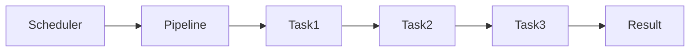

------------------------------------------------------------------------

## Workflow

Workflow typique orchestré :

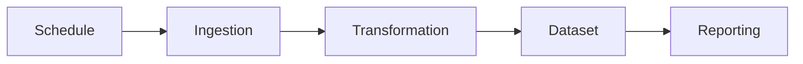

Étapes :

1.  planifier le pipeline
2.  exécuter les tâches
3.  vérifier les résultats
4.  monitorer l'exécution

------------------------------------------------------------------------

## Mise en pratique

### Cron

`cron` est un planificateur Linux.

Exemple :

    0 2 * * * Rscript pipeline.R

Cela exécute le pipeline :

    tous les jours à 02h00

------------------------------------------------------------------------

### Airflow

Airflow est un orchestrateur très utilisé en data engineering.

Les workflows sont définis comme des **DAG (Directed Acyclic Graph)**.

Exemple simplifié :

``` python
task1 >> task2 >> task3
```

Chaque tâche dépend de la précédente.

------------------------------------------------------------------------

### Dagster

Dagster est un orchestrateur moderne orienté data pipelines.

Avantages :

-   gestion des dépendances
-   monitoring
-   gestion des assets data

------------------------------------------------------------------------

## Code R expliqué

Exemple d'appel pipeline :

``` bash
Rscript pipeline.R
```

Analyse :

    Rscript

exécute un script R.

    pipeline.R

script contenant le pipeline data.

Ce script peut être déclenché par :

-   cron
-   Airflow
-   Dagster

------------------------------------------------------------------------

## Cas réel

Pipeline data marketing quotidien :

1.  récupérer données API
2.  nettoyer les données
3.  générer dataset
4.  mettre à jour dashboard

Planification :

    cron → 02:00

------------------------------------------------------------------------

## Bonnes pratiques

Utiliser un orchestrateur pour les pipelines critiques.

Ajouter des logs.

Gérer les erreurs.

Séparer les tâches en étapes indépendantes.

------------------------------------------------------------------------

## Erreurs fréquentes

Pipeline monolithique dans un seul script.

Absence de monitoring.

Absence de retry automatique.

------------------------------------------------------------------------

## Résumé

Dans ce module nous avons étudié l'orchestration des pipelines.

Exemples d'outils :

-   cron
-   Airflow
-   Dagster

L'orchestration permet d'**automatiser, planifier et superviser les
pipelines data**.

# Module 20 --- Production

## Objectifs pédagogiques

À la fin de ce module vous serez capable de :

-   transformer un projet R en **outil de production**
-   automatiser l'exécution de scripts
-   générer des **rapports automatisés**
-   déployer des applications data simples
-   utiliser **R Markdown** et **Shiny**

------------------------------------------------------------------------

## Contexte

Dans un projet professionnel, l'objectif n'est pas seulement d'analyser
les données.

Il faut aussi :

-   automatiser les analyses
-   partager les résultats
-   déployer des outils utilisables par d'autres personnes

C'est ce que l'on appelle la **mise en production**.

Les outils R les plus utilisés pour cela sont :

-   **R Markdown** → génération de rapports automatisés
-   **Shiny** → création d'applications interactives

------------------------------------------------------------------------

## Concepts fondamentaux

### Packaging

Un projet data peut être transformé en **package R**.

Avantages :

-   réutilisation du code
-   organisation du projet
-   partage avec d'autres équipes

------------------------------------------------------------------------

### Automatisation

Les scripts peuvent être exécutés automatiquement via :

-   cron
-   scheduler
-   orchestrateurs de pipelines

Exemple :

``` bash
Rscript analysis.R
```

------------------------------------------------------------------------

### Génération de rapports

Les entreprises génèrent souvent :

-   rapports mensuels
-   dashboards
-   rapports d'analyse

R permet d'automatiser cela avec **R Markdown**.

------------------------------------------------------------------------

## Architecture conceptuelle

  Composant    Rôle                      Exemple
  ------------ ------------------------- ------------
  Script R     traitement des données    analysis.R
  R Markdown   génération de rapports    report.Rmd
  Shiny        application interactive   dashboard
  Scheduler    automatisation            cron

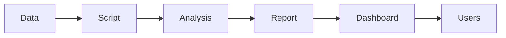

------------------------------------------------------------------------

## Workflow

Workflow typique en production :

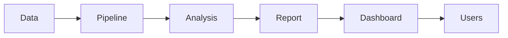

Étapes :

1.  ingestion des données
2.  traitement automatisé
3.  génération de rapports
4.  mise à disposition des résultats

------------------------------------------------------------------------

## Mise en pratique

### Générer un rapport avec R Markdown

Un fichier **R Markdown** contient :

-   texte
-   code R
-   graphiques

Exemple :

``` r
---
title: "Rapport d'analyse"
output: html_document
---

```{r}
summary(data)
```


    ---

    ### Génération du rapport

    ```r
    rmarkdown::render("report.Rmd")

Cela produit un **rapport HTML ou PDF**.

------------------------------------------------------------------------

### Application Shiny

Shiny permet de créer des applications interactives.

Exemple simple :

``` r
library(shiny)

ui <- fluidPage(
  sliderInput("num", "Choisir un nombre", 1, 100, 50),
  plotOutput("hist")
)

server <- function(input, output) {
  output$hist <- renderPlot({
    hist(rnorm(input$num))
  })
}

shinyApp(ui, server)
```

------------------------------------------------------------------------

## Code R expliqué

Exemple :

``` r
rmarkdown::render("report.Rmd")
```

Analyse :

    rmarkdown::render()

fonction qui compile un fichier **R Markdown**.

    report.Rmd

document contenant texte + code.

Résultat :

un rapport **HTML/PDF**.

------------------------------------------------------------------------

## Cas réel

Un pipeline data peut produire chaque jour :

1.  récupération des données
2.  nettoyage et transformation
3.  génération d'un rapport
4.  mise à jour d'un dashboard Shiny

Cela permet aux équipes métier d'accéder aux résultats.

------------------------------------------------------------------------

## Bonnes pratiques

Automatiser les rapports.

Versionner le code avec Git.

Séparer les scripts de traitement et de visualisation.

Documenter les pipelines.

------------------------------------------------------------------------

## Erreurs fréquentes

Produire des analyses non reproductibles.

Mélanger code expérimental et code production.

Ne pas automatiser les rapports.

------------------------------------------------------------------------

## Résumé

Dans ce module nous avons étudié la **mise en production des projets
R**.

Outils importants :

    R Markdown
    Shiny

Concepts clés :

-   packaging
-   automatisation
-   génération de rapports
-   déploiement d'applications data

---
[← Module précédent](R09_Data_Scientist_R.md)
---
