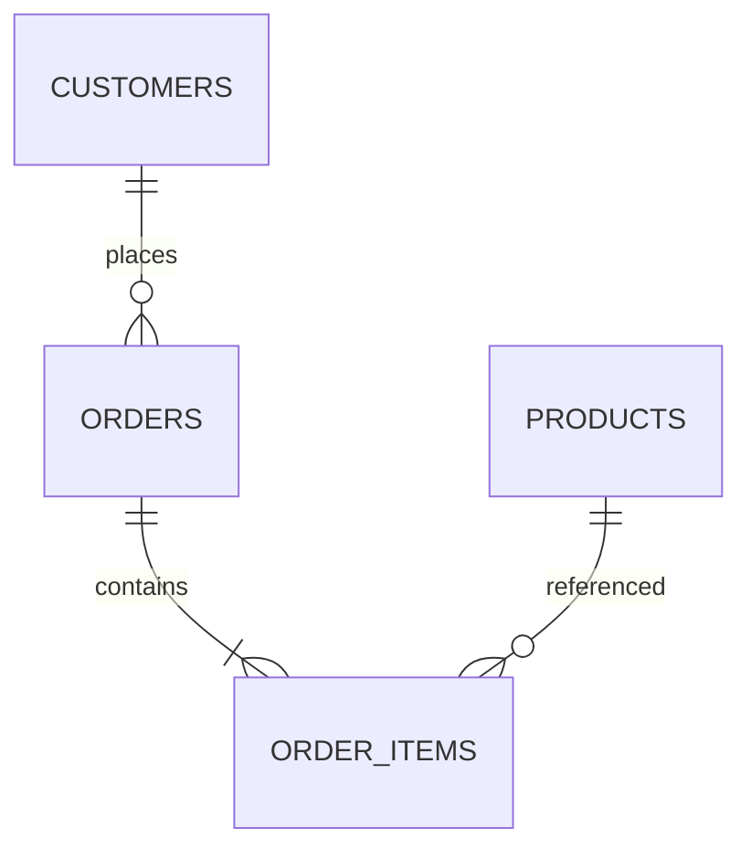

# Chapitre 1 — Introduction aux bases de données

---

## Objectifs pédagogiques

À la fin de ce chapitre vous serez capable de :

- comprendre pourquoi les bases de données existent
- comprendre ce qu’est SQL
- identifier les composants d’un système de base de données
- comprendre comment les applications utilisent les bases de données

---

## 1 — Pourquoi les bases de données existent

Avant les bases de données, les informations étaient souvent stockées dans des **fichiers**.

Exemples :

- fichiers CSV
- fichiers Excel
- fichiers texte

Cette méthode fonctionne au début, mais devient vite problématique lorsque la quantité de données augmente.

| Problème | Explication |
|---|---|
| Duplication de données | La même information est enregistrée plusieurs fois |
| Incohérence | Deux fichiers peuvent contenir des informations différentes |
| Recherche lente | Trouver une information devient difficile |
| Mise à jour complexe | Modifier une donnée nécessite parfois plusieurs modifications |

Les **bases de données** ont été créées pour résoudre ces problèmes.

Une base de données permet de :

- stocker les données de manière structurée
- éviter la duplication d'informations
- rechercher rapidement des informations
- garantir la cohérence des données

---

## 2 — Qu’est-ce qu’une base de données

Une **base de données** est un système permettant de stocker et organiser des informations.

Ces informations sont organisées dans des **tables**.

Chaque table représente un type d'information.

Exemple dans une boutique en ligne :

| Table | Contenu |
|---|---|
| customers | clients |
| products | produits |
| orders | commandes |
| order_items | détail des commandes |

Chaque table contient des **lignes** et des **colonnes**.

---

## 3 — Qu’est-ce que SQL

SQL signifie :

**Structured Query Language**

C’est un langage utilisé pour communiquer avec une base de données.

Avec SQL on peut :

- lire des données
- ajouter des données
- modifier des données
- supprimer des données
- créer des structures de données

Exemple simple de requête SQL :

```sql
SELECT name
FROM customers;
```

Cette requête demande à la base de données :

> "Donne-moi la colonne `name` dans la table `customers`"

---

## 4 — Les moteurs de bases de données

SQL est utilisé avec différents systèmes appelés **SGBD** (Systèmes de Gestion de Base de Données).

| Base de données | Utilisation |
|---|---|
| PostgreSQL | data engineering, backend, analytics |
| MySQL | applications web |
| SQLite | applications locales |
| SQL Server | environnements Microsoft |
| Oracle | grandes entreprises |

Dans cette formation nous utiliserons principalement **PostgreSQL**, car il est très proche du standard SQL.

---

## 5 — Architecture d’un système de base de données

Une application ne parle pas directement aux fichiers de données.

Elle communique avec une **base de données via SQL**.


| Élément | Description |
|---|---|
| Application | site web ou logiciel |
| SQL | langage de requête |
| Database | moteur de base de données |
| Tables | structure qui contient les données |
| Rows | lignes de données |

---

## 6 — Exemple concret

Prenons l'exemple d'une boutique en ligne.

On peut représenter les relations entre les données de cette manière :



Cela signifie :

- un client peut passer plusieurs commandes
- une commande contient plusieurs produits

---

## 7 — Dans la pratique (métiers)

SQL est utilisé dans de nombreux métiers.

| Métier | Utilisation |
|---|---|
| Data analyst | analyser les données |
| Backend developer | récupérer des données pour une API |
| DevOps | analyser des logs |
| Data engineer | construire des pipelines |
| DBA | administrer les bases de données |

---

## 8 — Bonnes pratiques

Quand on travaille avec des bases de données :

- éviter la duplication des informations
- structurer les tables correctement
- utiliser des relations entre tables
- écrire des requêtes lisibles

---

## 9 — Pièges fréquents

Erreurs courantes des débutants :

- utiliser Excel comme base de données
- dupliquer les informations dans plusieurs tables
- ne pas structurer les données
- écrire des requêtes trop complexes

---

## Conclusion

Dans ce chapitre nous avons vu :

- pourquoi les bases de données existent
- ce qu’est SQL
- comment une application interagit avec une base de données

Dans le prochain chapitre nous verrons **le modèle relationnel**, qui est la base théorique du SQL.

---
[Module suivant →](sql_chapitre_02_modele_relationnel.md)
---
