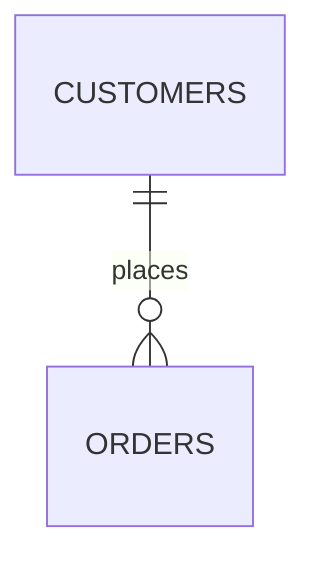
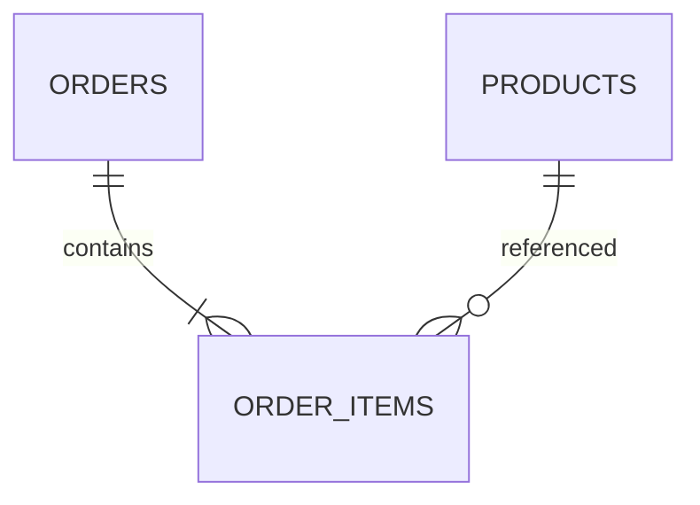
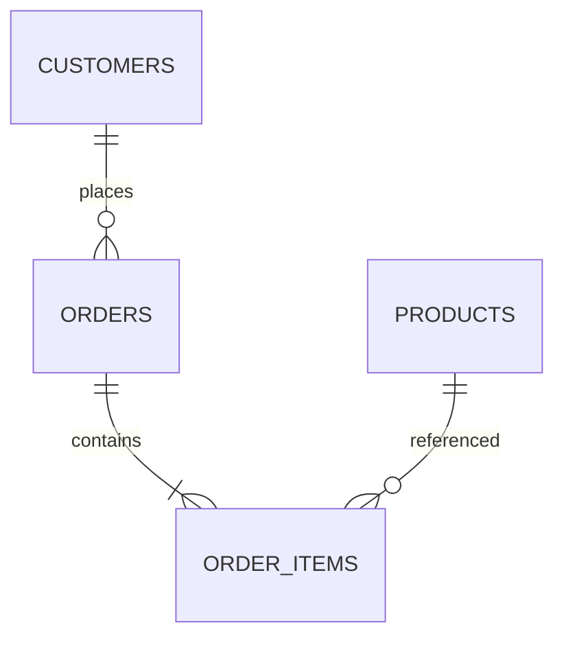

# Chapitre 2 — Le modèle relationnel

---

## Objectifs pédagogiques

À la fin de ce chapitre vous serez capable de :

- comprendre ce qu'est le **modèle relationnel**
- identifier les **tables, lignes et colonnes**
- comprendre les **clés primaires**
- comprendre les **clés étrangères**
- comprendre les **relations entre tables**
- comprendre la **cardinalité**

Le modèle relationnel est la **base théorique du SQL**.  
Si ces concepts sont compris, les requêtes SQL deviennent beaucoup plus faciles à écrire et à comprendre.

---

## 1 — Qu'est-ce que le modèle relationnel

Le **modèle relationnel** est une manière d'organiser les données sous forme de **tables reliées entre elles**.

Chaque table représente **un type d'information**.

Exemple dans une boutique en ligne :

| Table | Contenu |
|---|---|
| customers | clients |
| orders | commandes |
| products | produits |
| order_items | lignes de commandes |

Ces tables sont ensuite **liées entre elles grâce à des relations**.

---

## 2 — Structure d'une table

Une table contient :

| Élément | Description |
|---|---|
| Colonnes | les propriétés des données |
| Lignes | les enregistrements |
| Table | l'ensemble des données |

Exemple :

| id | name | email |
|---|---|---|
| 1 | Alice | alice@email.com |
| 2 | Bob | bob@email.com |

Dans la littérature technique on utilise aussi les termes :

| Terme technique | Signification |
|---|---|
| Relation | table |
| Tuple | ligne |
| Attribut | colonne |

Ces termes viennent de la **théorie mathématique du modèle relationnel**.

---

## 3 — Clé primaire

Une **clé primaire** est une colonne qui permet d'identifier **de manière unique une ligne** dans une table.

Exemple :

| id | name |
|---|---|
| 1 | Alice |
| 2 | Bob |
| 3 | Clara |

La colonne `id` est la **clé primaire**.

Propriétés d'une clé primaire :

- elle doit être **unique**
- elle ne peut pas être **NULL**
- elle doit être **stable dans le temps**

En pratique on utilise souvent :

- un **INTEGER auto-increment**
- un **UUID**

---

## 4 — Clé étrangère

Une **clé étrangère** permet de relier une table à une autre.

Exemple :

### Table customers

| id | name |
|---|---|
| 1 | Alice |
| 2 | Bob |

### Table orders

| id | customer_id | total |
|---|---|---|
| 101 | 1 | 80 |
| 102 | 2 | 120 |

La colonne `customer_id` est une **clé étrangère**.

Elle référence :

```
customers.id
```

Cela permet de savoir **quel client a passé la commande**.

---

## 5 — Types de relations entre tables

Les bases de données utilisent différents types de relations.

| Type | Description |
|---|---|
| 1-1 | une ligne correspond à une seule autre |
| 1-N | une ligne correspond à plusieurs |
| N-N | plusieurs lignes correspondent à plusieurs |

---

### Relation 1-N

Un client peut passer plusieurs commandes.



Cela signifie :

- un client
- plusieurs commandes

---

### Relation N-N

Une commande peut contenir plusieurs produits.  
Un produit peut apparaître dans plusieurs commandes.

On utilise une **table intermédiaire**.



---

## 6 — Pourquoi les relations sont importantes

Sans relations, les données seraient **dupliquées**.

Exemple incorrect :

| order_id | customer_name |
|---|---|
| 1 | Alice |
| 2 | Alice |
| 3 | Alice |

Si Alice change de nom, il faut modifier **toutes les lignes**.

Avec le modèle relationnel :

### customers

| id | name |
|---|---|
| 1 | Alice |

### orders

| id | customer_id |
|---|---|
| 1 | 1 |
| 2 | 1 |
| 3 | 1 |

Une seule modification est nécessaire.

---

## 7 — Schéma complet de la base utilisée dans la formation

Nous utiliserons ce schéma dans les prochains chapitres.



| Table | Description |
|---|---|
| customers | clients |
| orders | commandes |
| products | produits |
| order_items | détail des commandes |

---

## 8 — Dans la pratique (métiers)

| Métier | Utilisation |
|---|---|
| Data analyst | comprendre les relations pour faire des JOIN |
| Backend developer | structurer les données d'une application |
| Data engineer | construire les pipelines de données |
| DBA | garantir l'intégrité des données |

---

## 9 — Bonnes pratiques

Toujours :

- utiliser une **clé primaire**
- créer des **relations entre tables**
- éviter la **duplication des données**
- nommer clairement les colonnes

---

## 10 — Pièges fréquents

Erreurs fréquentes :

- utiliser le nom comme identifiant
- stocker plusieurs informations dans une colonne
- ne pas définir de clé primaire
- dupliquer les informations dans plusieurs tables

---

## Conclusion

Le modèle relationnel repose sur :

- des **tables**
- des **relations**
- des **clés primaires**
- des **clés étrangères**

Ces concepts sont indispensables pour comprendre les **JOIN** et écrire des requêtes SQL efficaces.

Dans le prochain chapitre nous verrons **la première commande SQL : SELECT**, qui permet de lire les données.

<!-- snippet
id: sql_cle_primaire_proprietes
type: concept
tech: sql
level: beginner
importance: high
format: knowledge
tags: sql,cle_primaire,modele_relationnel,integrite
title: Propriétés d'une clé primaire SQL
content: |
  Une clé primaire doit être :
  - **unique** : pas deux lignes avec la même valeur
  - **non NULL** : obligatoirement renseignée
  - **stable** : ne change pas au fil du temps
description: En pratique, on utilise un INTEGER auto-increment ou un UUID comme clé primaire.
-->

<!-- snippet
id: sql_cle_etrangere_relation
type: concept
tech: sql
level: beginner
importance: high
format: knowledge
tags: sql,cle_etrangere,relation,join
title: Clé étrangère = lien entre deux tables
content: Une clé étrangère est une colonne qui référence la clé primaire d'une autre table. Elle permet de relier les données sans les dupliquer.
description: La contrainte FK garantit l'intégrité référentielle : impossible d'insérer une commande avec un `client_id` qui n'existe pas. Sans elle, des enregistrements orphelins peuvent s'accumuler silencieusement.
-->
