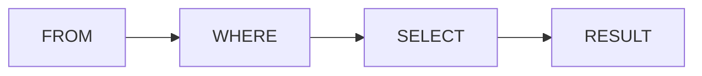

# Chapitre 4 — Filtrer les données avec WHERE

---

## Objectifs pédagogiques

À la fin de ce chapitre vous serez capable de :

- filtrer les lignes d'une table
- utiliser la clause **WHERE**
- utiliser des opérateurs de comparaison
- utiliser des conditions logiques
- récupérer uniquement les données utiles

La clause **WHERE** est l'une des fonctionnalités les plus utilisées en SQL.

---

## 1 — Pourquoi filtrer les données

Dans la pratique, on ne veut presque jamais récupérer **toutes les lignes** d'une table.

Exemple :

Table `orders`

| id | customer_id | total |
|---|---|---|
| 1 | 1 | 50 |
| 2 | 2 | 120 |
| 3 | 1 | 80 |

Si on veut seulement les commandes du **client 1**, on doit filtrer les données.

---

## 2 — Structure de WHERE

La structure est :

```sql
SELECT colonnes
FROM table
WHERE condition;
```

| Partie | Rôle |
|------|------|
| SELECT | colonnes à récupérer |
| FROM | table utilisée |
| WHERE | condition de filtrage |

---

## 3 — Exemple simple

```sql
SELECT *
FROM orders
WHERE customer_id = 1;
```

Résultat :

| id | customer_id | total |
|---|---|---|
| 1 | 1 | 50 |
| 3 | 1 | 80 |

Seules les lignes correspondant à la condition sont retournées.

---

## 4 — Opérateurs de comparaison

SQL possède plusieurs opérateurs pour comparer des valeurs.

| Opérateur | Signification |
|---|---|
| = | égal |
| != | différent |
| <> | différent |
| > | supérieur |
| < | inférieur |
| >= | supérieur ou égal |
| <= | inférieur ou égal |

Exemple :

```sql
SELECT *
FROM orders
WHERE total > 100;
```

---

## 5 — Conditions multiples

On peut combiner plusieurs conditions.

### AND

Toutes les conditions doivent être vraies.

```sql
SELECT *
FROM orders
WHERE customer_id = 1
AND total > 60;
```

---

### OR

Une seule condition doit être vraie.

```sql
SELECT *
FROM orders
WHERE total > 100
OR customer_id = 1;
```

---

### NOT

Inverse une condition.

```sql
SELECT *
FROM orders
WHERE NOT customer_id = 1;
```

---

## 6 — IN

Permet de tester plusieurs valeurs.

```sql
SELECT *
FROM orders
WHERE customer_id IN (1, 2, 3);
```

Equivalent à :

```sql
WHERE customer_id = 1
OR customer_id = 2
OR customer_id = 3
```

---

## 7 — BETWEEN

Permet de tester une plage de valeurs.

```sql
SELECT *
FROM orders
WHERE total BETWEEN 50 AND 100;
```

Cela signifie :

```
total >= 50 AND total <= 100
```

---

## 8 — LIKE

Permet de rechercher du texte.

| Symbole | Signification |
|---|---|
| % | plusieurs caractères |
| _ | un caractère |

Exemple :

```sql
SELECT *
FROM customers
WHERE name LIKE 'A%';
```

Résultat : tous les clients dont le nom commence par **A**.

---

## 9 — Gestion des valeurs NULL

NULL signifie **absence de valeur**.

On ne peut pas écrire :

```sql
WHERE email = NULL
```

Il faut écrire :

```sql
WHERE email IS NULL
```

Ou :

```sql
WHERE email IS NOT NULL
```

---

## 10 — Ordre logique d'exécution

Quand une requête contient WHERE :



Étapes :

1. SQL lit la table
2. SQL filtre les lignes avec WHERE
3. SQL sélectionne les colonnes

---

## 11 — Pattern courant : filtrer un utilisateur

```sql
SELECT id, name, email
FROM customers
WHERE id = 5;
```

Ce pattern est très fréquent dans les **API backend**.

---

## 12 — Bonnes pratiques

- filtrer les données le plus tôt possible
- utiliser des conditions simples
- éviter les requêtes ambiguës
- utiliser des parenthèses avec AND / OR

Exemple :

```sql
SELECT *
FROM orders
WHERE (customer_id = 1 OR customer_id = 2)
AND total > 50;
```

---

## 13 — Pièges fréquents

Erreurs classiques :

- oublier les parenthèses avec AND / OR
- comparer avec NULL incorrectement
- écrire des conditions trop complexes

---

## Conclusion

La clause **WHERE** permet de filtrer les lignes.

Les concepts clés sont :

- opérateurs de comparaison
- AND / OR / NOT
- IN
- BETWEEN
- LIKE
- NULL

Dans le prochain chapitre nous verrons **le tri des résultats avec ORDER BY et la limitation avec LIMIT**.

---
[← Module précédent](sql_chapitre_03_select.md) | [Module suivant →](sql_chapitre_05_order_by_limit.md)
---
