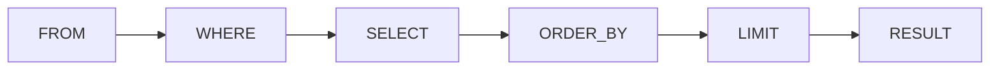

# Chapitre 5 — Trier et limiter les résultats

---

## Objectifs pédagogiques

À la fin de ce chapitre vous serez capable de :

- trier les résultats d'une requête SQL
- utiliser la clause **ORDER BY**
- trier sur une ou plusieurs colonnes
- contrôler le sens du tri (ASC / DESC)
- limiter le nombre de résultats avec **LIMIT**
- comprendre l'intérêt de **OFFSET**

Ces fonctionnalités sont très utilisées pour :

- les interfaces utilisateur
- les tableaux de données
- les rapports
- les API

---

## 1 — Pourquoi trier les données

Lorsque l'on récupère des données avec SQL, l'ordre des lignes **n'est pas garanti**.

Exemple :

```sql
SELECT *
FROM orders;
```

La base de données peut retourner les lignes **dans n'importe quel ordre**.

Si l'on veut un ordre précis, il faut utiliser **ORDER BY**.

---

## 2 — Structure de ORDER BY

Structure d'une requête avec tri :

```sql
SELECT colonnes
FROM table
ORDER BY colonne;
```

| Partie | Rôle |
|------|------|
| SELECT | colonnes à récupérer |
| FROM | table utilisée |
| ORDER BY | colonne utilisée pour le tri |

---

## 3 — Exemple simple

Table `orders` :

| id | customer_id | total |
|---|---|---|
| 1 | 1 | 50 |
| 2 | 2 | 120 |
| 3 | 1 | 80 |

Requête :

```sql
SELECT *
FROM orders
ORDER BY total;
```

Résultat :

| id | customer_id | total |
|---|---|---|
| 1 | 1 | 50 |
| 3 | 1 | 80 |
| 2 | 2 | 120 |

Les lignes sont triées par **total**.

---

## 4 — Sens du tri

SQL permet deux types de tri.

| Mot-clé | Signification |
|---|---|
| ASC | ordre croissant |
| DESC | ordre décroissant |

---

### Tri croissant (ASC)

```sql
SELECT *
FROM orders
ORDER BY total ASC;
```

ASC est **le comportement par défaut**.

---

### Tri décroissant (DESC)

```sql
SELECT *
FROM orders
ORDER BY total DESC;
```

Résultat :

| id | customer_id | total |
|---|---|---|
| 2 | 2 | 120 |
| 3 | 1 | 80 |
| 1 | 1 | 50 |

---

## 5 — Trier sur plusieurs colonnes

On peut utiliser plusieurs colonnes.

```sql
SELECT *
FROM orders
ORDER BY customer_id, total DESC;
```

Logique :

1. SQL trie par **customer_id**
2. puis par **total**

---

## 6 — Limiter le nombre de résultats

Dans beaucoup de cas, on ne veut pas récupérer **toutes les lignes**.

On utilise **LIMIT**.

```sql
SELECT *
FROM orders
LIMIT 5;
```

Cela retourne **les 5 premières lignes**.

---

## 7 — Exemple pratique

Top 3 des commandes les plus élevées :

```sql
SELECT *
FROM orders
ORDER BY total DESC
LIMIT 3;
```

Très utilisé pour :

- les dashboards
- les analyses
- les classements

---

## 8 — OFFSET

OFFSET permet d'ignorer un certain nombre de lignes.

```sql
SELECT *
FROM orders
ORDER BY total DESC
LIMIT 5
OFFSET 5;
```

Logique :

- ignorer les 5 premières lignes
- retourner les 5 suivantes

---

### Cas d'utilisation : pagination

Les sites web utilisent souvent ce mécanisme.

Page 1

```sql
LIMIT 10 OFFSET 0
```

Page 2

```sql
LIMIT 10 OFFSET 10
```

Page 3

```sql
LIMIT 10 OFFSET 20
```

---

## 9 — Compatibilité SQL

| Base de données | Limiter les résultats |
|---|---|
| PostgreSQL | LIMIT |
| MySQL | LIMIT |
| SQLite | LIMIT |
| SQL Server | TOP ou OFFSET FETCH |

Exemple SQL Server :

```sql
SELECT TOP 5 *
FROM orders;
```

---

## 10 — Ordre logique d'exécution

Quand on combine plusieurs clauses :



Étapes :

1. SQL lit la table
2. SQL filtre les lignes (WHERE)
3. SQL sélectionne les colonnes
4. SQL trie les résultats
5. SQL applique LIMIT

---

## 11 — Bonnes pratiques

- toujours préciser le sens du tri
- limiter les résultats si possible
- utiliser ORDER BY avec LIMIT pour des classements

Exemple recommandé :

```sql
SELECT id, total
FROM orders
ORDER BY total DESC
LIMIT 10;
```

---

## 12 — Pièges fréquents

Erreurs courantes :

- oublier ORDER BY avec LIMIT
- trier sur une colonne non pertinente
- oublier DESC pour les classements

---

## Conclusion

Les clauses importantes de ce chapitre :

- **ORDER BY**
- **ASC**
- **DESC**
- **LIMIT**
- **OFFSET**

Elles permettent de contrôler **l'ordre et la quantité de résultats**.

Dans le prochain chapitre nous verrons **les fonctions d'agrégation** :

- COUNT
- SUM
- AVG
- MIN
- MAX
- GROUP BY

---
[← Module précédent](sql_chapitre_04_where.md) | [Module suivant →](sql_chapitre_06_aggregation_groupby.md)
---
