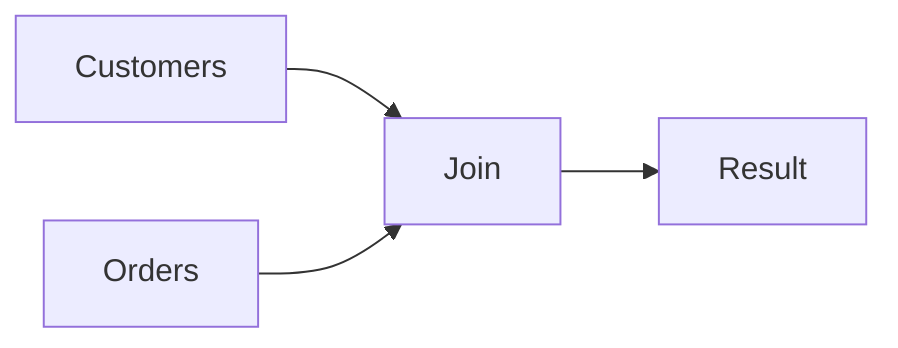

# Chapitre 7 — Les JOIN

---

## Objectifs pédagogiques

À la fin de ce chapitre vous serez capable de :

- comprendre pourquoi les **JOIN** existent
- relier plusieurs tables entre elles
- utiliser **INNER JOIN**
- utiliser **LEFT JOIN**
- comprendre les différences entre les types de JOIN
- éviter les erreurs classiques lors des jointures

Les JOIN sont **une des compétences les plus importantes en SQL**.

---

## 1 — Pourquoi les JOIN existent

Dans une base de données relationnelle, les informations sont réparties dans **plusieurs tables**.

Exemple :

Table `customers`

| id | name |
|---|---|
| 1 | Alice |
| 2 | Bob |

Table `orders`

| id | customer_id | total |
|---|---|---|
| 1 | 1 | 50 |
| 2 | 1 | 80 |
| 3 | 2 | 120 |

Si l'on veut savoir :

> quelles commandes ont été passées par quels clients

Il faut **combiner les tables**.

C'est le rôle des **JOIN**.

---

## 2 — Structure d'une JOIN

Structure générale :

```sql
SELECT colonnes
FROM table1
JOIN table2
ON condition;
```

| Partie | Rôle |
|------|------|
| FROM | table principale |
| JOIN | table à associer |
| ON | condition de liaison |

---

## 3 — INNER JOIN

`INNER JOIN` retourne uniquement les lignes qui correspondent **dans les deux tables**.

```sql
SELECT customers.name, orders.total
FROM customers
INNER JOIN orders
ON customers.id = orders.customer_id;
```

Résultat :

| name | total |
|---|---|
| Alice | 50 |
| Alice | 80 |
| Bob | 120 |

---

## 4 — Diagramme logique



La base combine les lignes **selon la condition ON**.

---

## 5 — Alias dans les JOIN

Dans la pratique on utilise souvent des **alias**.

```sql
SELECT c.name, o.total
FROM customers AS c
JOIN orders AS o
ON c.id = o.customer_id;
```

Avantages :

- requêtes plus courtes
- plus lisible
- indispensable avec plusieurs tables

---

## 6 — LEFT JOIN

`LEFT JOIN` retourne :

- toutes les lignes de la table de gauche
- les correspondances de la table de droite

```sql
SELECT customers.name, orders.total
FROM customers
LEFT JOIN orders
ON customers.id = orders.customer_id;
```

Si un client n'a pas de commande :

| name | total |
|---|---|
| Alice | 50 |
| Alice | 80 |
| Bob | 120 |
| Clara | NULL |

---

## 7 — RIGHT JOIN

`RIGHT JOIN` est l'inverse du LEFT JOIN.

```sql
SELECT customers.name, orders.total
FROM customers
RIGHT JOIN orders
ON customers.id = orders.customer_id;
```

On récupère toutes les lignes de la **table de droite**.

En pratique il est **rarement utilisé** car on peut inverser les tables.

---

## 8 — FULL JOIN

`FULL JOIN` retourne :

- toutes les lignes des deux tables
- même sans correspondance

```sql
SELECT customers.name, orders.total
FROM customers
FULL JOIN orders
ON customers.id = orders.customer_id;
```

---

## 9 — Exemple concret

Liste des commandes avec le nom du client.

```sql
SELECT c.name, o.id, o.total
FROM customers c
JOIN orders o
ON c.id = o.customer_id;
```

Résultat :

| name | id | total |
|---|---|---|
| Alice | 1 | 50 |
| Alice | 2 | 80 |
| Bob | 3 | 120 |

---

## 10 — JOIN sur plusieurs tables

Les JOIN peuvent être enchaînées.

```sql
SELECT c.name, p.name, oi.quantity
FROM customers c
JOIN orders o ON c.id = o.customer_id
JOIN order_items oi ON o.id = oi.order_id
JOIN products p ON oi.product_id = p.id;
```

Cela permet de reconstruire une **information complète**.

---

## 11 — Ordre logique d'exécution


SQL :

1. lit les tables
2. applique les JOIN
3. filtre les résultats
4. sélectionne les colonnes

---

## 12 — Bonnes pratiques

- toujours utiliser des **alias**
- toujours préciser la condition **ON**
- utiliser des noms de colonnes explicites
- tester les JOIN progressivement

---

## 13 — Pièges fréquents

Erreurs classiques :

- oublier la condition `ON`
- créer une **jointure cartésienne**
- confondre LEFT JOIN et INNER JOIN
- utiliser trop de tables dans une seule requête

---

## Conclusion

Les JOIN permettent de **combiner plusieurs tables**.

Types principaux :

- INNER JOIN
- LEFT JOIN
- RIGHT JOIN
- FULL JOIN

C'est un concept essentiel pour exploiter **les bases de données relationnelles**.

Dans le prochain chapitre nous verrons **la manipulation des données : INSERT, UPDATE et DELETE**.

<!-- snippet
id: sql_inner_vs_left_join
tech: sql
level: beginner
importance: high
format: knowledge
tags: sql,join,inner_join,left_join
title: INNER JOIN vs LEFT JOIN
content: |
  - `INNER JOIN` : retourne seulement les lignes avec correspondance dans les deux tables
  - `LEFT JOIN` : retourne toutes les lignes de gauche, NULL pour les non-correspondances
description: Utiliser INNER JOIN quand la correspondance est garantie, LEFT JOIN pour détecter les absences.
-->

<!-- snippet
id: sql_join_sans_on_cartesien
tech: sql
level: beginner
importance: high
format: knowledge
tags: sql,join,on,produit_cartesien,erreur
title: JOIN sans ON produit un produit cartésien
content: Sans clause ON, chaque ligne de A est combinée avec chaque ligne de B. 100 × 100 = 10 000 lignes retournées. Toujours spécifier : `JOIN nom_table ON condition`
description: Le produit cartésien peut saturer la mémoire et retourner des millions de lignes inutiles.
-->
