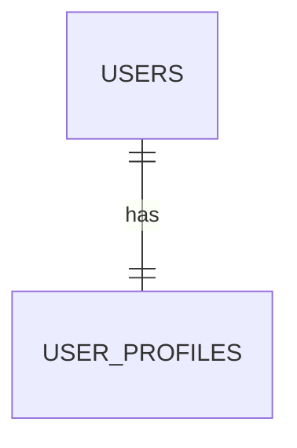
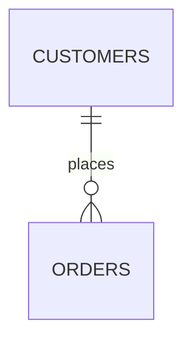
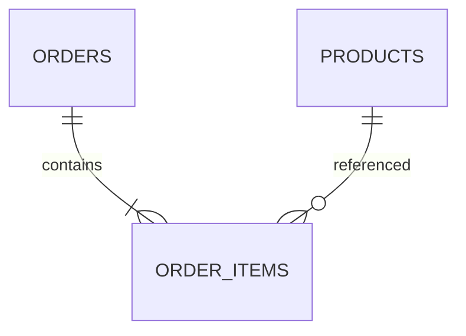
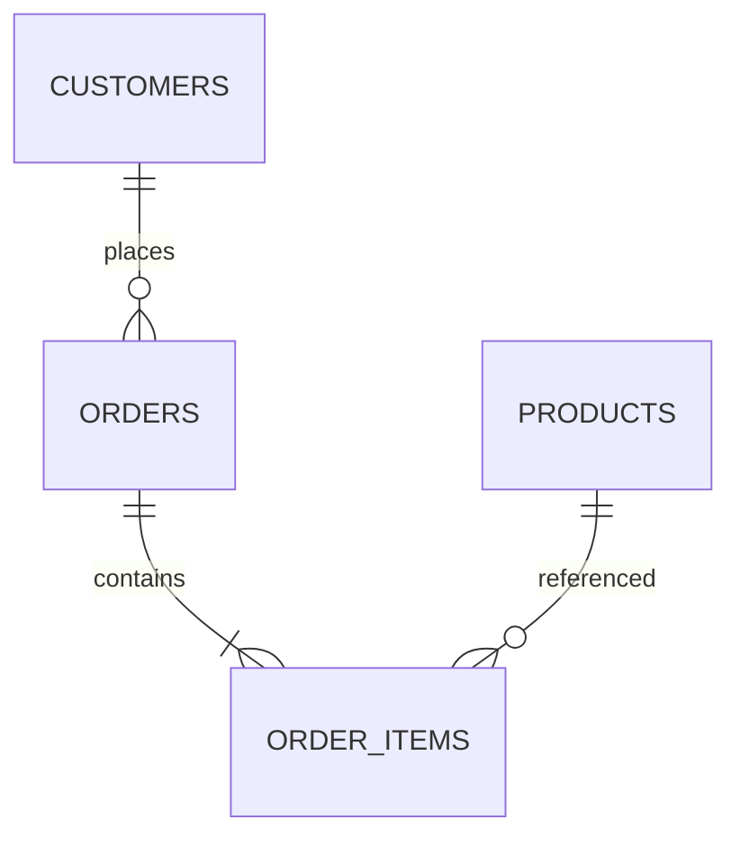

# Chapitre 12 — Relations entre tables et normalisation

---

## Objectifs pédagogiques

À la fin de ce chapitre vous serez capable de :

- comprendre les différents types de **relations entre tables**
- concevoir une base de données sans duplication inutile
- comprendre le principe de **normalisation**
- appliquer les formes normales principales (1NF, 2NF, 3NF)

Ce chapitre explique comment **structurer correctement une base de données relationnelle**.

---

## 1 — Pourquoi structurer les relations

Dans une base de données relationnelle, les informations sont séparées dans plusieurs tables afin de :

- éviter la duplication de données
- faciliter la maintenance
- garantir la cohérence des informations
- améliorer les performances

Exemple :

Au lieu de stocker le nom du client dans chaque commande, on crée une relation entre les tables.

---

## 2 — Relation 1 à 1

Une relation **1-1** signifie qu’une ligne correspond à une seule ligne dans l’autre table.

Exemple :

| Table | Description |
|---|---|
| users | utilisateur |
| user_profiles | profil utilisateur |

Diagramme :

Chaque utilisateur possède **un seul profil**.

---

## 3 — Relation 1 à N

Une relation **1-N** signifie qu’une ligne peut correspondre à plusieurs lignes dans l’autre table.

Exemple :

| Table | Description |
|---|---|
| customers | clients |
| orders | commandes |

Diagramme :

Un client peut passer **plusieurs commandes**.

---

## 4 — Relation N à N

Une relation **N-N** signifie que plusieurs lignes peuvent correspondre à plusieurs autres.

Exemple :

- une commande peut contenir plusieurs produits
- un produit peut apparaître dans plusieurs commandes

Pour résoudre cela, on crée une **table de liaison**.

Diagramme :

La table `order_items` contient :

| order_id | product_id | quantity |
|---|---|---|

---

## 5 — Pourquoi éviter la duplication

Sans normalisation, on pourrait avoir une table comme ceci :

| order_id | customer_name | customer_email |
|---|---|---|
| 1 | Alice | alice@email.com |
| 2 | Alice | alice@email.com |

Problèmes :

- duplication de données
- risque d’incohérence
- maintenance difficile

La normalisation permet de résoudre ces problèmes.

---

## 6 — Première forme normale (1NF)

La **première forme normale** impose :

- une seule valeur par cellule
- aucune colonne répétée
- une clé primaire définie

Exemple incorrect :

| order_id | products |
|---|---|
| 1 | laptop, mouse |

Correct :

| order_id | product |
|---|---|
| 1 | laptop |
| 1 | mouse |

---

## 7 — Deuxième forme normale (2NF)

La **deuxième forme normale** impose :

- être déjà en 1NF
- que chaque colonne dépende **entièrement de la clé primaire**

Exemple :

Si une table utilise une clé composée `(order_id, product_id)`, les autres colonnes doivent dépendre **des deux**.

---

## 8 — Troisième forme normale (3NF)

La **troisième forme normale** impose :

- être en 2NF
- aucune dépendance entre colonnes non clés

Exemple incorrect :

| order_id | customer_id | customer_name |
|---|---|---|

Le nom du client dépend du client, pas de la commande.

La solution :

Créer une table `customers`.

---

## 9 — Exemple de base normalisée

Structure correcte :

Tables :

| Table | Description |
|---|---|
| customers | clients |
| orders | commandes |
| products | produits |
| order_items | détail des commandes |

---

## 10 — Bonnes pratiques

Toujours :

- éviter la duplication des données
- utiliser des relations entre tables
- utiliser des clés étrangères
- appliquer au minimum la **3NF**

---

## 11 — Pièges fréquents

Erreurs classiques :

- stocker plusieurs informations dans une colonne
- dupliquer les données entre tables
- oublier les tables de liaison
- mélanger des informations de nature différente

---

## Conclusion

Les relations et la normalisation permettent de :

- structurer correctement une base
- éviter les incohérences
- faciliter les évolutions du système

Dans le prochain chapitre nous verrons **les index**, qui permettent d’améliorer les performances des requêtes SQL.

---
[← Module précédent](sql_chapitre_11_contraintes.md) | [Module suivant →](sql_chapitre_13_index.md)
---
