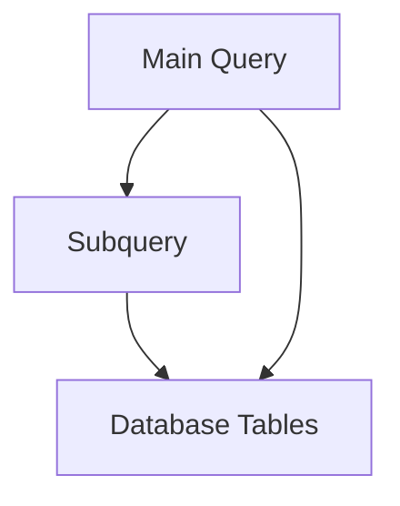

# Chapitre 15 — Les sous‑requêtes

---

## Objectifs pédagogiques

À la fin de ce chapitre vous serez capable de :

- comprendre ce qu’est une **sous‑requête (subquery)**
- imbriquer une requête SQL dans une autre requête
- utiliser les sous‑requêtes dans `WHERE`, `SELECT` et `FROM`
- comprendre les opérateurs `IN`, `EXISTS`, `ANY`, `ALL`
- identifier les **sous‑requêtes corrélées**

Les sous‑requêtes permettent de **décomposer des problèmes complexes en requêtes plus simples**.

---

## 1 — Qu’est‑ce qu’une sous‑requête

Une **sous‑requête** est une requête SQL placée **à l’intérieur d’une autre requête**.

Structure générale :

```sql
SELECT *
FROM table
WHERE column = (
    SELECT something
    FROM another_table
);
```

La requête interne est exécutée **avant la requête principale**.

---

## 2 — Exemple simple

On veut trouver toutes les commandes du client **Alice**.

```sql
SELECT *
FROM orders
WHERE customer_id = (
    SELECT id
    FROM customers
    WHERE name = 'Alice'
);
```

Étapes :

1. la sous‑requête récupère l'id d'Alice
2. la requête principale récupère ses commandes

---

## 3 — Sous‑requête avec IN

`IN` permet de comparer une valeur à **plusieurs résultats**.

```sql
SELECT *
FROM orders
WHERE customer_id IN (
    SELECT id
    FROM customers
    WHERE country = 'France'
);
```

Ici :

- on récupère toutes les commandes des clients français

---

## 4 — Sous‑requête avec EXISTS

`EXISTS` vérifie simplement **si une ligne existe**.

```sql
SELECT *
FROM customers c
WHERE EXISTS (
    SELECT 1
    FROM orders o
    WHERE o.customer_id = c.id
);
```

Résultat :

- tous les clients qui ont **au moins une commande**

---

## 5 — Sous‑requête dans SELECT

Une sous‑requête peut aussi apparaître dans le `SELECT`.

```sql
SELECT
    name,
    (
        SELECT COUNT(*)
        FROM orders
        WHERE orders.customer_id = customers.id
    ) AS order_count
FROM customers;
```

Cela permet d’ajouter une **information calculée**.

---

## 6 — Sous‑requête dans FROM

Une sous‑requête peut aussi servir de **table temporaire**.

```sql
SELECT *
FROM (
    SELECT customer_id, SUM(total) AS total_spent
    FROM orders
    GROUP BY customer_id
) AS spending
WHERE total_spent > 1000;
```

La sous‑requête devient une **table intermédiaire**.

---

## 7 — Sous‑requêtes corrélées

Une sous‑requête est **corrélée** lorsqu’elle dépend de la requête externe.

```sql
SELECT *
FROM customers c
WHERE EXISTS (
    SELECT 1
    FROM orders o
    WHERE o.customer_id = c.id
);
```

La sous‑requête utilise la variable `c.id`.

Cela signifie qu’elle est exécutée **pour chaque ligne**.

---

## 8 — Architecture logique



La sous‑requête sert souvent à **préparer une information** utilisée par la requête principale.

---

## 9 — Bonnes pratiques

Toujours :

- utiliser des sous‑requêtes pour clarifier la logique
- privilégier `EXISTS` pour les tests d'existence
- utiliser `IN` lorsque plusieurs valeurs sont possibles

Dans certains cas, les **JOIN peuvent être plus performants**.

---

## 10 — Pièges fréquents

Erreurs classiques :

- utiliser des sous‑requêtes trop complexes
- oublier que certaines sous‑requêtes sont exécutées plusieurs fois
- ne pas tester l'équivalent avec `JOIN`

---

## Conclusion

Les sous‑requêtes permettent de :

- décomposer des requêtes complexes
- calculer des valeurs intermédiaires
- filtrer des résultats à partir d'autres tables

Dans le prochain chapitre nous verrons **les transactions**, qui permettent de garantir la cohérence des opérations dans une base de données.

<!-- snippet
id: sql_sous_requete_from_table_temp
type: concept
tech: sql
level: intermediate
importance: medium
format: knowledge
tags: sql,sous_requete,from,cte,table_temporaire
title: Sous-requête dans FROM comme table temporaire
content: |
  ```sql
  SELECT * FROM (
    SELECT customer_id, SUM(total) AS total_spent
    FROM orders GROUP BY customer_id
  ) AS spending
  WHERE total_spent > 1000;
  ```
  La sous-requête crée une table intermédiaire utilisable dans la requête principale.
description: Alternative aux CTE (WITH) pour les cas simples d'une seule sous-requête imbriquée.
-->

<!-- snippet
id: sql_exists_vs_in_performance
type: concept
tech: sql
level: intermediate
importance: medium
format: knowledge
tags: sql,exists,in,performance,sous_requete
title: EXISTS est plus efficace que IN pour tester l'existence
content: |
  `EXISTS` s'arrête dès qu'une ligne correspond (court-circuit).
  `IN` récupère toutes les valeurs avant de comparer.
  Préférer `WHERE EXISTS (SELECT 1 FROM ...)` pour les tests d'existence.
description: La différence est significative sur de grandes tables avec beaucoup de valeurs distinctes.
-->
