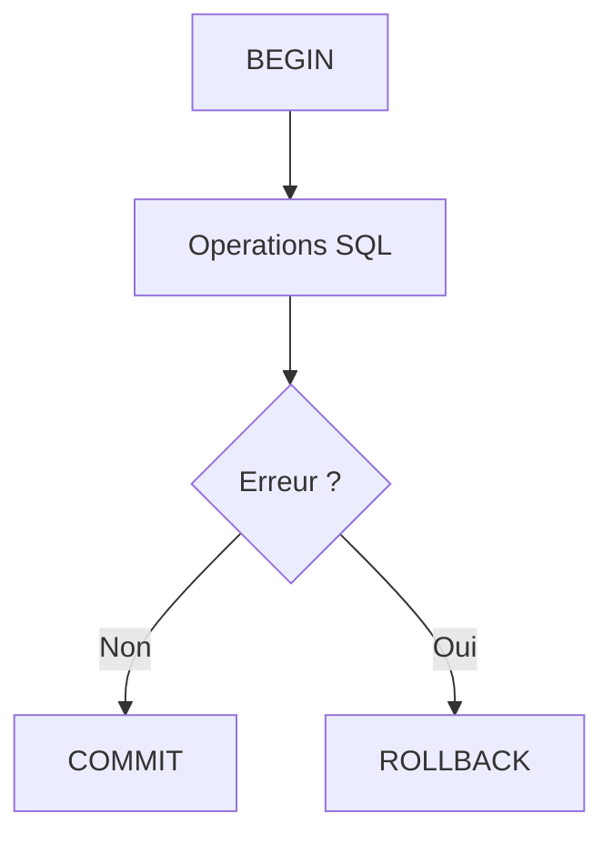

# Chapitre 16 — Les transactions

---

## Objectifs pédagogiques

À la fin de ce chapitre vous serez capable de :

- comprendre ce qu’est une **transaction**
- utiliser `BEGIN`, `COMMIT`, `ROLLBACK`
- comprendre pourquoi les transactions sont nécessaires
- découvrir les propriétés **ACID**
- garantir la cohérence des données lors de plusieurs opérations

Les transactions permettent de **traiter plusieurs opérations SQL comme une seule opération logique**.

---

## 1 — Pourquoi les transactions existent

Dans un système réel, plusieurs opérations doivent souvent être exécutées ensemble.

Exemple : un paiement.

1. retirer l'argent du compte A
2. ajouter l'argent au compte B

Si une seule des deux opérations réussit, la base devient incohérente.

Les transactions permettent de garantir que :

- soit **tout fonctionne**
- soit **rien n'est appliqué**

---

## 2 — Structure d’une transaction

Une transaction SQL possède généralement trois étapes.

```sql
BEGIN;

-- opérations SQL

COMMIT;
```

Si une erreur se produit :

```sql
ROLLBACK;
```

---

## 3 — Exemple concret

Transfert d'argent entre deux comptes.

```sql
BEGIN;

UPDATE accounts
SET balance = balance - 100
WHERE id = 1;

UPDATE accounts
SET balance = balance + 100
WHERE id = 2;

COMMIT;
```

Si une erreur apparaît :

```sql
ROLLBACK;
```

La base revient à l'état initial.

---

## 4 — Schéma de fonctionnement



---

## 5 — COMMIT

`COMMIT` valide définitivement la transaction.

Une fois exécuté :

- les modifications sont enregistrées
- elles deviennent visibles pour les autres utilisateurs

```sql
COMMIT;
```

---

## 6 — ROLLBACK

`ROLLBACK` annule toutes les opérations effectuées depuis `BEGIN`.

```sql
ROLLBACK;
```

La base revient à son état précédent.

---

## 7 — Les propriétés ACID

Les transactions reposent sur quatre principes fondamentaux appelés **ACID**.

| Propriété | Signification |
|---|---|
| Atomicity | tout ou rien |
| Consistency | les règles de la base sont respectées |
| Isolation | les transactions ne se perturbent pas |
| Durability | les données validées sont permanentes |

Ces propriétés garantissent la **fiabilité des bases de données**.

---

## 8 — Transactions automatiques

Dans certaines bases, chaque requête est automatiquement une transaction.

Exemple :

```sql
INSERT INTO users (name)
VALUES ('Alice');
```

La base effectue implicitement :

```
BEGIN
INSERT
COMMIT
```

---

## 9 — Bonnes pratiques

Toujours :

- regrouper les opérations liées dans une transaction
- valider avec `COMMIT` seulement lorsque tout est correct
- utiliser `ROLLBACK` en cas d’erreur

---

## 10 — Pièges fréquents

Erreurs classiques :

- oublier `COMMIT`
- laisser une transaction ouverte trop longtemps
- modifier des données critiques sans transaction

---

## Conclusion

Les transactions permettent de :

- garantir la cohérence des données
- regrouper plusieurs opérations SQL
- protéger la base contre les erreurs

Concepts importants :

- `BEGIN`
- `COMMIT`
- `ROLLBACK`
- propriétés **ACID**

Dans le prochain chapitre nous entrerons dans le niveau avancé avec **l’optimisation des requêtes SQL**.
