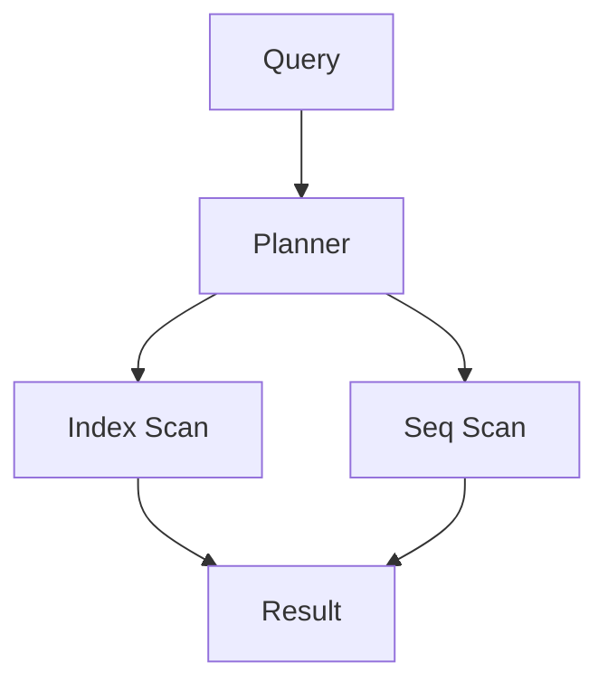

# Chapitre 17 — Optimisation des requêtes

---

## Objectifs pédagogiques

À la fin de ce chapitre vous serez capable de :

- comprendre pourquoi certaines requêtes SQL sont lentes
- analyser un **plan d’exécution**
- utiliser `EXPLAIN`
- identifier les **full table scans**
- optimiser les **JOIN**
- utiliser correctement les **index**

Ce chapitre introduit les bases de la **performance SQL**.

---

## 1 — Pourquoi certaines requêtes sont lentes

Lorsque les tables contiennent **peu de lignes**, presque toutes les requêtes sont rapides.

Mais lorsque les tables contiennent :

- millions de lignes
- dizaines de millions
- centaines de millions

les requêtes mal écrites deviennent **très lentes**.

Les causes fréquentes :

- absence d’index
- JOIN inefficaces
- filtres mal utilisés
- full table scan

---

## 2 — Le full table scan

Un **full table scan** signifie que la base lit **toutes les lignes de la table**.

Exemple :

```sql
SELECT *
FROM users
WHERE email = 'alice@email.com';
```

Si `email` n’est pas indexé :

- la base doit parcourir toute la table.

---

## 3 — EXPLAIN

La commande `EXPLAIN` permet de voir **comment la base exécute une requête**.

PostgreSQL :

```sql
EXPLAIN
SELECT *
FROM users
WHERE email = 'alice@email.com';
```

La base retourne un **plan d’exécution**.

---

## 4 — Plan d’exécution

Le plan d’exécution indique :

- quelles tables sont lues
- quels index sont utilisés
- dans quel ordre les opérations sont exécutées

Schéma simplifié :



Le planner choisit la stratégie la plus efficace.

---

## 5 — Index Scan vs Sequential Scan

| Type | Description |
|-----|-------------|
| Index Scan | utilise un index |
| Seq Scan | lit toute la table |

Un **Seq Scan** n’est pas toujours mauvais.

Mais sur de grandes tables, il devient coûteux.

---

## 6 — Optimiser les filtres

Les colonnes utilisées dans `WHERE` doivent souvent être indexées.

Exemple :

```sql
CREATE INDEX idx_users_email
ON users(email);
```

Requête optimisée :

```sql
SELECT *
FROM users
WHERE email = 'alice@email.com';
```

---

## 7 — Optimiser les JOIN

Les JOIN peuvent devenir coûteux si les colonnes ne sont pas indexées.

Exemple :

```sql
SELECT *
FROM orders
JOIN customers
ON orders.customer_id = customers.id;
```

Bonne pratique :

- indexer les **clés étrangères**

```sql
CREATE INDEX idx_orders_customer_id
ON orders(customer_id);
```

---

## 8 — Limiter les colonnes

Éviter :

```sql
SELECT *
FROM orders;
```

Préférer :

```sql
SELECT id, total
FROM orders;
```

Cela réduit :

- la mémoire utilisée
- le transfert réseau

---

## 9 — Utiliser LIMIT

Lors de l’exploration des données :

```sql
SELECT *
FROM orders
LIMIT 10;
```

Cela évite de charger des millions de lignes inutilement.

---

## 10 — Bonnes pratiques

Toujours :

- analyser les requêtes lentes
- utiliser `EXPLAIN`
- indexer les colonnes utilisées dans JOIN
- éviter `SELECT *`
- limiter les résultats

---

## 11 — Pièges fréquents

Erreurs classiques :

- créer des index inutiles
- oublier les index sur les clés étrangères
- ignorer les plans d’exécution
- charger trop de données

---

## Conclusion

L’optimisation SQL consiste à :

- comprendre comment la base exécute les requêtes
- analyser les plans d’exécution
- utiliser les index correctement

Dans le prochain chapitre nous verrons **les procédures stockées**, qui permettent d'exécuter de la logique directement dans la base de données.

<!-- snippet
id: sql_explain_plan_execution
type: command
tech: sql
level: advanced
importance: high
format: knowledge
tags: sql,explain,plan_execution,performance,postgresql
title: Analyser le plan d'exécution d'une requête
command: EXPLAIN SELECT * FROM <table> WHERE <condition>;
example: EXPLAIN SELECT * FROM commandes WHERE statut = 'en_attente';
description: Affiche comment la base exécute la requête. Chercher Seq Scan sur grandes tables pour identifier les requêtes nécessitant un index.
-->

<!-- snippet
id: sql_seq_scan_vs_index_scan
type: concept
tech: sql
level: advanced
importance: high
format: knowledge
tags: sql,index_scan,seq_scan,explain,performance
title: Seq Scan vs Index Scan dans EXPLAIN
content: |
  - **Seq Scan** : lit toute la table ligne par ligne (lent sur grandes tables)
  - **Index Scan** : utilise un index pour accéder directement aux lignes
  Un Seq Scan sur une table de millions de lignes = requête candidate à l'optimisation.
description: Visible dans la sortie de EXPLAIN. Créer un index sur la colonne du WHERE pour passer en Index Scan.
-->

<!-- snippet
id: sql_indexer_cles_etrangeres
type: concept
tech: sql
level: advanced
importance: high
format: knowledge
tags: sql,index,foreign_key,join,performance
title: Indexer systématiquement les clés étrangères
content: Les colonnes de JOIN (clés étrangères) doivent être indexées. Sans index, chaque JOIN déclenche un Seq Scan sur la table jointe.
description: Réflexe à appliquer lors de chaque CREATE TABLE contenant une FOREIGN KEY.
-->
