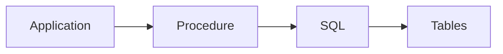

# Chapitre 18 — Procédures stockées et fonctions

---

## Objectifs pédagogiques

À la fin de ce chapitre vous serez capable de :

- comprendre ce qu’est une **procédure stockée**
- comprendre la différence entre **procédure et fonction**
- exécuter de la logique directement dans la base de données
- utiliser des **paramètres**
- comprendre les cas d’usage réels

Les procédures stockées permettent de **déplacer de la logique métier dans la base de données**.

---

## 1 — Pourquoi utiliser des procédures stockées

Dans de nombreuses applications, certaines opérations SQL sont répétées :

- calculs
- mises à jour multiples
- contrôles métier
- transformations de données

Au lieu d’envoyer plusieurs requêtes depuis l’application, on peut créer une **procédure dans la base**.

Avantages :

- centralisation de la logique
- meilleures performances
- sécurité renforcée
- code réutilisable

---

## 2 — Différence entre procédure et fonction

| Type | Description |
|-----|-------------|
| Fonction | retourne une valeur |
| Procédure | exécute des opérations |

Fonctions :

- utilisées dans `SELECT`
- retournent un résultat

Procédures :

- exécutent des actions
- peuvent modifier les données

---

## 3 — Fonction simple (PostgreSQL)

Exemple : calculer la TVA.

```sql
CREATE FUNCTION calculate_vat(price NUMERIC)
RETURNS NUMERIC AS $$
BEGIN
    RETURN price * 0.20;
END;
$$ LANGUAGE plpgsql;
```

Utilisation :

```sql
SELECT calculate_vat(100);
```

Résultat :

```
20
```

---

## 4 — Fonction utilisée dans une requête

```sql
SELECT
    id,
    price,
    calculate_vat(price) AS vat
FROM products;
```

Les fonctions peuvent être utilisées comme **n’importe quelle expression SQL**.

---

## 5 — Procédure stockée

Exemple : augmenter les prix d’une catégorie.

```sql
CREATE PROCEDURE increase_price(category_id INT, percent NUMERIC)
LANGUAGE plpgsql
AS $$
BEGIN
    UPDATE products
    SET price = price * (1 + percent)
    WHERE category = category_id;
END;
$$;
```

---

## 6 — Appeler une procédure

```sql
CALL increase_price(2, 0.10);
```

Cela augmente les prix de **10 %**.

---

## 7 — Architecture logique



Les procédures servent d’interface entre :

- application
- base de données

---

## 8 — Cas d’usage fréquents

Les procédures sont utilisées pour :

- automatiser des opérations
- gérer des workflows métier
- créer des APIs SQL
- appliquer des règles de validation

Exemple :

- clôture comptable
- calcul de facturation
- génération de rapports

---

## 9 — Différences entre moteurs SQL

Certaines syntaxes diffèrent selon les bases.

### PostgreSQL

Langage :

```
plpgsql
```

### MySQL

Utilise :

```
DELIMITER
CREATE PROCEDURE
BEGIN
END
```

### SQL Server

Utilise :

```
CREATE PROCEDURE
AS
BEGIN
END
```

Le concept reste le même mais **la syntaxe varie**.

---

## 10 — Bonnes pratiques

Toujours :

- garder les procédures simples
- documenter la logique
- éviter trop de logique métier dans la base
- tester les performances

Les procédures doivent être utilisées **avec modération**.

---

## 11 — Pièges fréquents

Erreurs classiques :

- déplacer toute la logique applicative dans la base
- créer des procédures trop complexes
- oublier la maintenance

Une base de données doit rester **principalement un moteur de stockage et de requêtes**.

---

## Conclusion

Les procédures stockées permettent :

- d’exécuter de la logique dans la base
- d’automatiser certaines opérations
- de centraliser les règles métier

Dans le prochain chapitre nous verrons **les triggers**, qui permettent d’exécuter du code automatiquement lors d’événements dans la base.

---
[← Module précédent](sql_chapitre_17_optimisation_requetes.md) | [Module suivant →](sql_chapitre_19_triggers.md)
---
