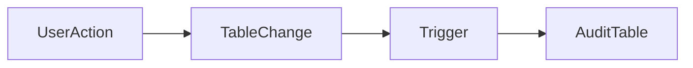

# Chapitre 19 — Les triggers

---

## Objectifs pédagogiques

À la fin de ce chapitre vous serez capable de :

- comprendre ce qu’est un **trigger**
- automatiser des actions dans la base de données
- utiliser `BEFORE` et `AFTER`
- déclencher du code lors d’un `INSERT`, `UPDATE` ou `DELETE`
- comprendre les cas d’usage réels

Les triggers permettent d’**exécuter automatiquement du code lorsqu’un événement se produit dans la base de données**.

---

## 1 — Qu’est-ce qu’un trigger

Un **trigger** est un mécanisme qui exécute automatiquement une fonction lorsqu’un événement se produit sur une table.

Événements possibles :

- `INSERT`
- `UPDATE`
- `DELETE`

Un trigger peut être exécuté :

- **BEFORE** l’opération
- **AFTER** l’opération

---

## 2 — Exemple simple

Supposons une table `orders`.

On veut enregistrer automatiquement chaque modification dans une table d’audit.

Tables :

| Table | Description |
|---|---|
| orders | commandes |
| orders_audit | historique des modifications |

---

## 3 — Architecture logique



Lorsqu’une modification survient :

1. la table change
2. le trigger s’exécute
3. une action automatique est effectuée

---

## 4 — Fonction de trigger (PostgreSQL)

Un trigger appelle généralement une **fonction**.

```sql
CREATE FUNCTION log_order_update()
RETURNS TRIGGER AS $$
BEGIN

INSERT INTO orders_audit(order_id, updated_at)
VALUES (NEW.id, NOW());

RETURN NEW;

END;
$$ LANGUAGE plpgsql;
```

---

## 5 — Création du trigger

```sql
CREATE TRIGGER trigger_order_update

AFTER UPDATE ON orders

FOR EACH ROW

EXECUTE FUNCTION log_order_update();
```

Chaque modification d’une commande sera enregistrée.

---

## 6 — BEFORE vs AFTER

| Type | Moment d’exécution |
|----|----|
| BEFORE | avant l’opération |
| AFTER | après l’opération |

Exemple :

**BEFORE INSERT**

- vérifier les données

**AFTER INSERT**

- enregistrer un log

---

## 7 — Variables NEW et OLD

Dans les triggers, deux variables sont importantes.

| Variable | Description |
|---|---|
| NEW | nouvelle valeur |
| OLD | ancienne valeur |

Exemple :

```sql
NEW.price
OLD.price
```

Permet de comparer les modifications.

---

## 8 — Cas d’usage fréquents

Les triggers sont utilisés pour :

- audit des données
- historisation
- validation automatique
- synchronisation entre tables
- mise à jour automatique de champs

Exemple :

mettre à jour automatiquement un champ `updated_at`.

---

## 9 — Exemple concret

```sql
CREATE FUNCTION update_timestamp()
RETURNS TRIGGER AS $$
BEGIN

NEW.updated_at = NOW();

RETURN NEW;

END;
$$ LANGUAGE plpgsql;
```

Trigger :

```sql
CREATE TRIGGER update_product_timestamp

BEFORE UPDATE ON products

FOR EACH ROW

EXECUTE FUNCTION update_timestamp();
```

---

## 10 — Bonnes pratiques

Toujours :

- garder les triggers simples
- documenter leur comportement
- éviter trop de logique cachée
- surveiller l’impact sur les performances

---

## 11 — Pièges fréquents

Erreurs classiques :

- créer trop de triggers
- créer des triggers invisibles pour l’application
- provoquer des boucles infinies
- rendre les opérations difficiles à comprendre

Les triggers doivent être utilisés **avec parcimonie**.

---

## Conclusion

Les triggers permettent d’automatiser certaines actions dans la base.

Concepts importants :

- `CREATE TRIGGER`
- `BEFORE`
- `AFTER`
- `NEW` et `OLD`

Dans le prochain chapitre nous verrons **la gestion de la concurrence**, qui explique comment les bases gèrent plusieurs utilisateurs simultanément.

<!-- snippet
id: sql_trigger_new_old
type: concept
tech: sql
level: advanced
importance: high
format: knowledge
tags: sql,trigger,new,old,postgresql,plpgsql
title: Variables NEW et OLD dans un trigger
content: |
  - `NEW` : valeur après l'opération (INSERT, UPDATE)
  - `OLD` : valeur avant l'opération (UPDATE, DELETE)
  `NEW.price` et `OLD.price` permettent de comparer avant/après dans la fonction du trigger.
description: OLD est NULL sur un INSERT, NEW est NULL sur un DELETE.
-->

<!-- snippet
id: sql_trigger_logique_cachee
type: concept
tech: sql
level: advanced
importance: high
format: knowledge
tags: sql,trigger,maintenance,debug,bonne_pratique
title: Les triggers cachent des comportements invisibles
content: Un trigger s'exécute silencieusement. Un INSERT peut déclencher des UPDATE, des logs, des synchronisations — sans que l'application le sache. Difficile à déboguer et à tester.
description: Documenter tous les triggers existants. Éviter de chaîner des triggers entre eux pour ne pas provoquer de boucles infinies.
-->
