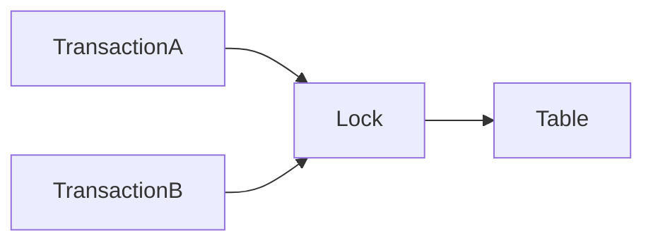
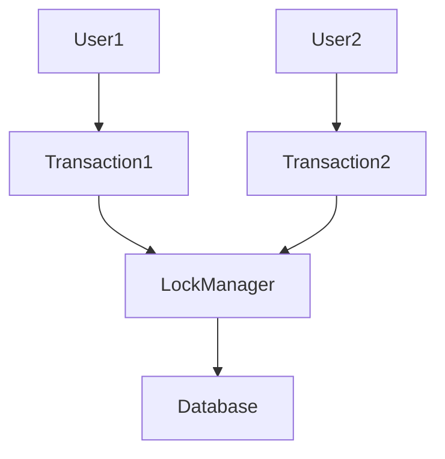

# Chapitre 20 — Gestion de la concurrence

---

## Objectifs pédagogiques

À la fin de ce chapitre vous serez capable de :

- comprendre ce qu’est la **concurrence** dans une base de données
- comprendre comment plusieurs utilisateurs accèdent aux mêmes données
- connaître le rôle des **verrous (locks)**
- comprendre les **niveaux d’isolation**
- identifier les problèmes comme les **dirty reads** ou **lost updates**

La gestion de la concurrence est essentielle pour garantir la **fiabilité des données dans un environnement multi‑utilisateur**.

---

## 1 — Qu’est-ce que la concurrence

Dans une base de données réelle :

- plusieurs utilisateurs exécutent des requêtes
- plusieurs applications accèdent aux données
- plusieurs transactions sont exécutées simultanément

Exemple :

- un utilisateur modifie une commande
- un autre consulte la même commande
- un troisième modifie le client

La base doit garantir que les données restent **cohérentes**.

---

## 2 — Le problème des accès simultanés

Sans mécanisme de contrôle, plusieurs transactions pourraient modifier les mêmes données.

Exemple :

| Transaction A | Transaction B |
|---|---|
| lit balance = 100 | lit balance = 100 |
| retire 50 | retire 30 |
| écrit 50 | écrit 70 |

Résultat final incorrect : **70 au lieu de 20**.

Ce problème s’appelle un **lost update**.

---

## 3 — Les verrous (Locks)

Les bases de données utilisent des **verrous** pour protéger les données.

Types principaux :

| Type | Description |
|---|---|
| Shared Lock | lecture |
| Exclusive Lock | écriture |

Principe :

- plusieurs lectures possibles
- une seule écriture possible

---

## 4 — Fonctionnement simplifié



Lorsqu’une transaction modifie une ligne :

- elle verrouille cette ligne
- les autres transactions doivent attendre

---

## 5 — Problèmes de concurrence

Plusieurs anomalies peuvent apparaître.

### Dirty Read

Lire des données **non validées**.

Exemple :

- transaction A modifie une ligne
- transaction B lit cette ligne
- transaction A annule la modification

Transaction B a lu une donnée **qui n’existe plus**.

---

### Non-repeatable Read

Une même requête retourne **deux résultats différents** dans la même transaction.

---

### Phantom Read

Une requête retourne **des lignes supplémentaires** entre deux lectures.

---

## 6 — Niveaux d’isolation

Les bases de données proposent plusieurs niveaux d’isolation.

| Niveau | Description |
|---|---|
| Read Uncommitted | lecture non validée |
| Read Committed | lecture validée |
| Repeatable Read | lignes stables |
| Serializable | isolation maximale |

Plus l’isolation est forte :

- plus la cohérence est garantie
- mais les performances peuvent diminuer

---

## 7 — Exemple PostgreSQL

Définir le niveau d’isolation :

```sql
SET TRANSACTION ISOLATION LEVEL REPEATABLE READ;
```

---

## 8 — Architecture simplifiée



Le **lock manager** contrôle l’accès aux données.

---

## 9 — Bonnes pratiques

Toujours :

- garder les transactions courtes
- éviter de verrouiller trop de données
- choisir le bon niveau d’isolation
- analyser les blocages

---

## 10 — Pièges fréquents

Erreurs classiques :

- transactions trop longues
- verrouillage inutile de tables entières
- mauvais niveau d’isolation
- blocages entre transactions

Ces situations peuvent provoquer des **deadlocks**.

---

## Conclusion

La gestion de la concurrence permet de :

- garantir la cohérence des données
- permettre plusieurs utilisateurs simultanément
- éviter les anomalies de lecture et d’écriture

Concepts importants :

- verrous
- niveaux d’isolation
- transactions concurrentes

Dans le prochain chapitre nous verrons **la sécurité des bases de données**, notamment la gestion des utilisateurs et des permissions.

<!-- snippet
id: sql_niveaux_isolation
type: concept
tech: sql
level: advanced
importance: high
format: knowledge
tags: sql,isolation,transaction,concurrence,dirty_read
title: Les 4 niveaux d'isolation des transactions
content: |
  - **Read Committed** : lit seulement les données validées (défaut PostgreSQL)
  - **Repeatable Read** : les lignes lues restent stables pendant la transaction
  - **Serializable** : isolation totale, transactions comme si séquentielles
description: Plus le niveau est fort, plus la cohérence est garantie, mais les performances peuvent baisser.
-->

<!-- snippet
id: sql_deadlock_transaction_longue
type: warning
tech: sql
level: advanced
importance: high
format: knowledge
tags: sql,deadlock,lock,concurrence,transaction
title: Les transactions longues provoquent des deadlocks
content: |
  Deux transactions qui attendent chacune que l'autre libère un verrou → deadlock.
  - Garder les transactions courtes
  - Verrouiller les ressources dans le même ordre
  - Éviter le verrouillage de tables entières
description: PostgreSQL détecte les deadlocks automatiquement et annule une des transactions, mais c'est une erreur à éviter.
-->
