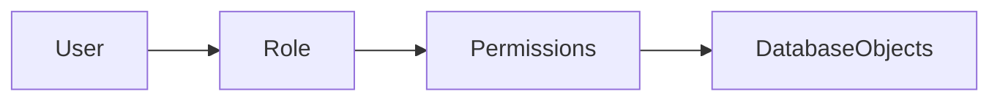

# Chapitre 21 — Sécurité des bases de données

---

## Objectifs pédagogiques

À la fin de ce chapitre vous serez capable de :

- comprendre pourquoi la **sécurité des bases de données** est essentielle
- gérer les **utilisateurs**
- utiliser les **rôles**
- attribuer des permissions avec `GRANT`
- retirer des permissions avec `REVOKE`
- comprendre les bonnes pratiques de sécurité SQL

La sécurité d’une base de données consiste à **contrôler qui peut accéder aux données et ce qu’il peut faire avec**.

---

## 1 — Pourquoi la sécurité est importante

Les bases de données contiennent souvent des informations sensibles :

- données clients
- données financières
- données personnelles
- données stratégiques d’entreprise

Il est donc essentiel de contrôler :

- qui peut lire les données
- qui peut modifier les données
- qui peut administrer la base

---

## 2 — Les utilisateurs (users)

Un **utilisateur SQL** représente une identité qui peut se connecter à la base de données.

Exemple PostgreSQL :

```sql
CREATE USER analyst
WITH PASSWORD 'secure_password';
```

Cet utilisateur peut maintenant se connecter à la base.

---

## 3 — Les rôles (roles)

Un **rôle** est un groupe de permissions.

Au lieu de gérer les droits utilisateur par utilisateur, on attribue les droits à un rôle.

Exemple :

| Rôle | Description |
|-----|-------------|
| analyst | lecture des données |
| developer | lecture + écriture |
| admin | administration complète |

---

### Création d’un rôle

```sql
CREATE ROLE analyst;
```

---

## 4 — Attribution des permissions

Les permissions sont attribuées avec la commande `GRANT`.

Exemple :

```sql
GRANT SELECT
ON customers
TO analyst;
```

L’utilisateur peut maintenant lire la table `customers`.

---

## 5 — Retirer une permission

La commande `REVOKE` permet de retirer un droit.

```sql
REVOKE SELECT
ON customers
FROM analyst;
```

---

## 6 — Permissions possibles

Les principales permissions SQL :

| Permission | Description |
|---|---|
| SELECT | lire les données |
| INSERT | ajouter des données |
| UPDATE | modifier les données |
| DELETE | supprimer des données |
| CREATE | créer des objets |
| ALTER | modifier des tables |
| DROP | supprimer des objets |

---

## 7 — Donner un rôle à un utilisateur

```sql
GRANT analyst TO john;
```

L’utilisateur `john` hérite des permissions du rôle.

---

## 8 — Architecture de sécurité



Les rôles servent d’intermédiaire entre :

- utilisateurs
- permissions

---

## 9 — Bonnes pratiques

Toujours :

- appliquer le principe du **moindre privilège**
- utiliser des rôles plutôt que des permissions individuelles
- séparer les comptes **administration / application**
- auditer régulièrement les accès

Principe du moindre privilège :

> Un utilisateur ne doit avoir **que les droits nécessaires à son travail**.

---

## 10 — Pièges fréquents

Erreurs classiques :

- donner trop de droits
- utiliser le compte administrateur pour les applications
- ne pas auditer les accès
- partager des comptes utilisateurs

Ces pratiques peuvent entraîner des **fuites de données**.

---

## Conclusion

La sécurité SQL repose sur :

- les utilisateurs
- les rôles
- les permissions

Commandes clés :

- `CREATE USER`
- `CREATE ROLE`
- `GRANT`
- `REVOKE`

Dans le prochain chapitre nous verrons **l’administration des bases de données**, notamment :

- sauvegardes
- restauration
- réplication
- partitionnement
- maintenance des bases.

<!-- snippet
id: sql_grant_revoke
type: command
tech: sql
level: advanced
importance: high
format: knowledge
tags: sql,grant,revoke,permissions,securite
title: Attribuer ou retirer une permission SQL
command: GRANT SELECT ON <table> TO <role>; -- REVOKE SELECT ON <table> FROM <role>;
description: GRANT attribue le droit, REVOKE le retire. Les permissions s’appliquent par table et par rôle.
-->

<!-- snippet
id: sql_moindre_privilege
type: concept
tech: sql
level: advanced
importance: high
format: knowledge
tags: sql,securite,permissions,role,bonne_pratique
title: Principe du moindre privilège pour les utilisateurs SQL
content: |
  Un compte applicatif n’a besoin que de SELECT/INSERT/UPDATE/DELETE sur ses tables.
  Ne jamais utiliser le compte admin (`postgres`, `root`) pour l’application.
  Créer un rôle dédié avec uniquement les permissions nécessaires.
description: Si le compte applicatif est compromis, l’attaquant ne peut pas DROP TABLE ou accéder aux autres bases.
-->
