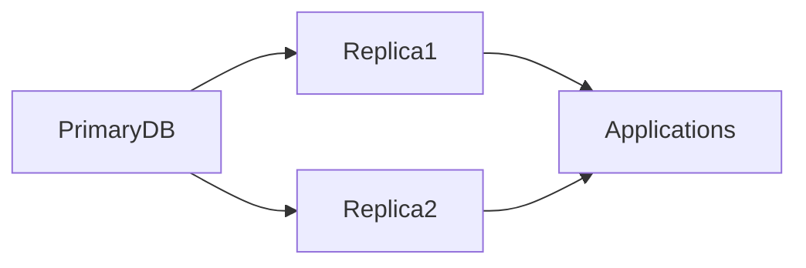
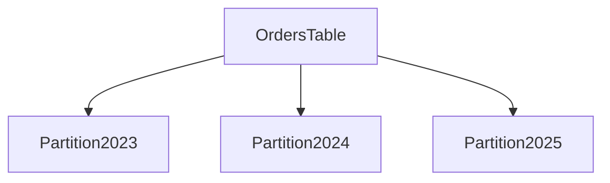

# Chapitre 22 — Administration des bases de données

---

## Objectifs pédagogiques

À la fin de ce chapitre vous serez capable de :

- comprendre les tâches principales d’un **administrateur de base de données (DBA)**
- comprendre l’importance des **sauvegardes**
- restaurer une base de données
- comprendre les principes de **réplication**
- comprendre le **partitionnement**
- connaître les opérations de **maintenance** d’une base

L’administration des bases de données consiste à **garantir la disponibilité, la sécurité et la performance des données**.

---

## 1 — Le rôle d’un administrateur de base de données

Un **DBA (Database Administrator)** est responsable de :

- la disponibilité des bases
- la sécurité des données
- les sauvegardes
- les performances
- la maintenance

Dans les organisations modernes, ce rôle peut être partagé avec :

- **DevOps**
- **Data Engineers**
- **SRE (Site Reliability Engineers)**

---

## 2 — Les sauvegardes (Backups)

Une **sauvegarde** est une copie des données permettant de restaurer la base en cas de problème.

Les causes possibles :

- erreur humaine
- panne serveur
- corruption de données
- attaque informatique

Sans sauvegarde, les données peuvent être **perdues définitivement**.

---

## 3 — Types de sauvegardes

| Type | Description |
|-----|-------------|
| Full Backup | copie complète de la base |
| Incremental Backup | sauvegarde des changements |
| Differential Backup | sauvegarde depuis la dernière full backup |

Dans la pratique, les systèmes utilisent souvent :

- sauvegarde complète quotidienne
- sauvegardes incrémentales fréquentes

---

## 4 — Exemple PostgreSQL

Sauvegarder une base :

```bash
pg_dump mydatabase > backup.sql
```

Restaurer une base :

```bash
psql mydatabase < backup.sql
```

Ces commandes permettent de sauvegarder ou restaurer rapidement une base.

---

## 5 — Réplication

La **réplication** consiste à copier les données d’une base vers une autre.

Objectifs :

- haute disponibilité
- tolérance aux pannes
- répartition de charge

Architecture :



La base principale envoie les modifications aux réplicas.

---

## 6 — Réplication lecture seule

Les réplicas sont souvent utilisés pour :

- les requêtes analytiques
- les dashboards
- les APIs de lecture

Cela permet de **soulager la base principale**.

---

## 7 — Partitionnement

Le **partitionnement** consiste à diviser une table en plusieurs parties.

Exemple :

une table `orders` contenant plusieurs années de données.

Partition possible :

- orders_2023
- orders_2024
- orders_2025

Architecture :



Avantages :

- meilleures performances
- gestion plus simple des données volumineuses

---

## 8 — Maintenance des bases

Les bases de données nécessitent des opérations régulières :

- nettoyage des index
- analyse des statistiques
- suppression des données inutiles

PostgreSQL exemple :

```sql
VACUUM;
ANALYZE;
```

Ces commandes permettent d’optimiser les performances.

---

## 9 — Surveillance (Monitoring)

Les bases doivent être surveillées en permanence.

Indicateurs importants :

- temps de réponse des requêtes
- utilisation CPU
- utilisation mémoire
- taille des tables
- nombre de connexions

Outils courants :

- **Prometheus**
- **Grafana**
- **pgAdmin**
- **Datadog**

---

## 10 — Bonnes pratiques

Toujours :

- tester les restaurations
- automatiser les sauvegardes
- surveiller les performances
- documenter l’architecture

Une sauvegarde non testée est **une sauvegarde inutile**.

---

## 11 — Pièges fréquents

Erreurs classiques :

- ne pas tester les restaurations
- stocker les sauvegardes sur le même serveur
- ignorer les alertes de monitoring
- laisser les bases grandir sans partitionnement

---

## Conclusion

L’administration des bases de données garantit :

- la disponibilité
- la sécurité
- la performance
- la récupération des données

Concepts clés :

- sauvegardes
- restauration
- réplication
- partitionnement
- maintenance

Dans le prochain chapitre nous verrons **le SQL avancé**, notamment :

- CTE (`WITH`)
- requêtes récursives
- window functions
- SQL analytique.

<!-- snippet
id: sql_pg_dump_backup
type: command
tech: sql
level: advanced
importance: high
format: knowledge
tags: sql,postgresql,pg_dump,backup,restauration
title: Sauvegarder et restaurer une base PostgreSQL
command: pg_dump <DB> > backup.sql
context: Restauration avec : psql <DB> < backup.sql
description: pg_dump exporte la structure et les données en SQL. psql les réimporte. Tester régulièrement la restauration.
-->

<!-- snippet
id: sql_backup_non_teste_inutile
type: concept
tech: sql
level: advanced
importance: high
format: knowledge
tags: sql,backup,restauration,bonne_pratique,dba
title: Une sauvegarde non testée est une sauvegarde inutile
content: |
  Sauvegarder régulièrement ne suffit pas. Il faut tester la restauration :
  - sur un environnement séparé
  - régulièrement (hebdomadaire ou mensuel)
  - en vérifiant que les données sont cohérentes après restauration.
description: De nombreuses équipes découvrent que leurs backups sont corrompus uniquement en cas d'incident réel.
-->
