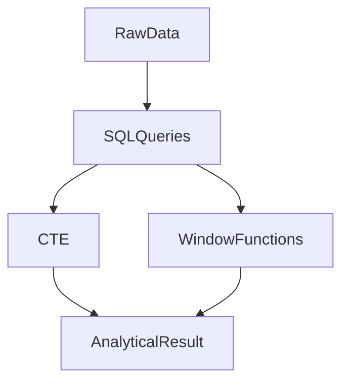

# Chapitre 23 — SQL avancé

---

## Objectifs pédagogiques

À la fin de ce chapitre vous serez capable de :

- utiliser les **CTE (Common Table Expressions)**
- comprendre les **requêtes récursives**
- utiliser les **window functions**
- réaliser des analyses avancées directement en SQL
- comprendre les patterns utilisés en **Data Analytics** et **Data Engineering**

Le SQL avancé permet de transformer SQL en **véritable langage d’analyse de données**.

---

## 1 — Pourquoi le SQL avancé est important

Dans la pratique, les requêtes simples ne suffisent pas toujours.

Les cas réels nécessitent souvent :

- calculs complexes
- analyses temporelles
- hiérarchies
- agrégations avancées

Le SQL avancé permet de réaliser ces opérations **directement dans la base de données**.

---

## 2 — CTE (Common Table Expression)

Une **CTE** permet de créer une requête intermédiaire réutilisable.

Syntaxe :

```sql
WITH sales_per_customer AS (

    SELECT
        customer_id,
        SUM(total) AS total_spent
    FROM orders
    GROUP BY customer_id

)

SELECT *
FROM sales_per_customer
WHERE total_spent > 1000;
```

La CTE agit comme **une table temporaire dans la requête**.

---

## 3 — Pourquoi utiliser les CTE

Les CTE permettent :

- d’améliorer la lisibilité
- de structurer les requêtes complexes
- de réutiliser des sous-requêtes

Sans CTE, certaines requêtes deviennent difficiles à lire.

---

## 4 — Requêtes récursives

Une **CTE récursive** permet de traiter des structures hiérarchiques.

Exemple :

- organisation d’entreprise
- arborescence de dossiers
- catégories de produits

Exemple :

```sql
WITH RECURSIVE employee_tree AS (

    SELECT id, manager_id, name
    FROM employees
    WHERE manager_id IS NULL

    UNION ALL

    SELECT e.id, e.manager_id, e.name
    FROM employees e
    JOIN employee_tree et
    ON e.manager_id = et.id

)

SELECT *
FROM employee_tree;
```

---

## 5 — Window Functions

Les **window functions** permettent de calculer des valeurs sur un groupe de lignes sans les regrouper.

Exemple :

```sql
SELECT
    customer_id,
    total,
    SUM(total) OVER (PARTITION BY customer_id) AS total_customer_sales
FROM orders;
```

Cela permet de calculer un total **par client**, tout en gardant toutes les lignes.

---

## 6 — Fonction OVER

La clause `OVER()` définit la fenêtre d’analyse.

Exemple :

```sql
SUM(total) OVER (
    PARTITION BY customer_id
)
```

Cela signifie :

- calculer la somme par client.

---

## 7 — Classement des résultats

Exemple avec `RANK()` :

```sql
SELECT
    customer_id,
    total,
    RANK() OVER (
        ORDER BY total DESC
    ) AS ranking
FROM orders;
```

Permet de créer un **classement des ventes**.

---

## 8 — Analyse temporelle

Les window functions sont souvent utilisées pour analyser des séries temporelles.

Exemple :

```sql
SELECT
    order_date,
    total,
    SUM(total) OVER (
        ORDER BY order_date
    ) AS cumulative_sales
FROM orders;
```

Cela calcule un **total cumulatif**.

---

## 9 — Architecture analytique



SQL devient un moteur d’analyse de données.

---

## 10 — Cas d’usage réels

Le SQL avancé est utilisé pour :

- dashboards
- data analytics
- ETL pipelines
- reporting
- calculs financiers
- analyses comportementales

---

## 11 — Bonnes pratiques

Toujours :

- privilégier les CTE pour les requêtes complexes
- utiliser les window functions pour les analyses
- documenter les requêtes analytiques

---

## 12 — Pièges fréquents

Erreurs classiques :

- requêtes trop complexes
- mauvaise utilisation des partitions
- confusion entre `GROUP BY` et `WINDOW FUNCTIONS`

---

## Conclusion

Le SQL avancé permet de réaliser des analyses complexes directement dans la base.

Concepts importants :

- CTE (`WITH`)
- requêtes récursives
- window functions
- analyse analytique

Ces techniques sont largement utilisées dans :

- **Data Engineering**
- **Data Analytics**
- **Business Intelligence**

<!-- snippet
id: sql_cte_with
type: command
tech: sql
level: advanced
importance: high
format: knowledge
tags: sql,cte,with,lisibilite,analytique
title: Créer une table temporaire avec une CTE (WITH)
command: WITH <nom_cte> AS (SELECT ... FROM ... GROUP BY ...) SELECT * FROM <nom_cte> WHERE ...;
example: WITH ventes_region AS (SELECT region, SUM(montant) AS total FROM ventes GROUP BY region) SELECT * FROM ventes_region WHERE total > 10000;
description: La CTE agit comme une table temporaire dans la requête. Améliore la lisibilité et évite les sous-requêtes imbriquées profondes.
-->

<!-- snippet
id: sql_window_function_over
type: concept
tech: sql
level: advanced
importance: high
format: knowledge
tags: sql,window_function,over,partition_by,analytique
title: Window function OVER : calculer sans GROUP BY
content: |
  `SUM(total) OVER (PARTITION BY customer_id)` calcule le total par client pour chaque ligne, sans supprimer les autres colonnes.
  Contrairement à GROUP BY, toutes les lignes restent visibles.
description: Indispensable pour les analyses où on veut comparer chaque ligne avec son groupe (ratio, rang, cumul).
-->

<!-- snippet
id: sql_rank_classement
type: concept
tech: sql
level: advanced
importance: medium
format: knowledge
tags: sql,rank,window_function,classement,analytique
title: Classer des résultats avec RANK()
content: `RANK() OVER (ORDER BY total DESC)` attribue un rang à chaque ligne selon le tri. Deux lignes égales reçoivent le même rang, la suivante est décalée (1,1,3).
description: Utiliser DENSE_RANK() si on préfère une numérotation continue sans saut (1,1,2).
-->
