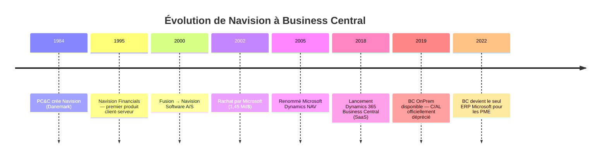
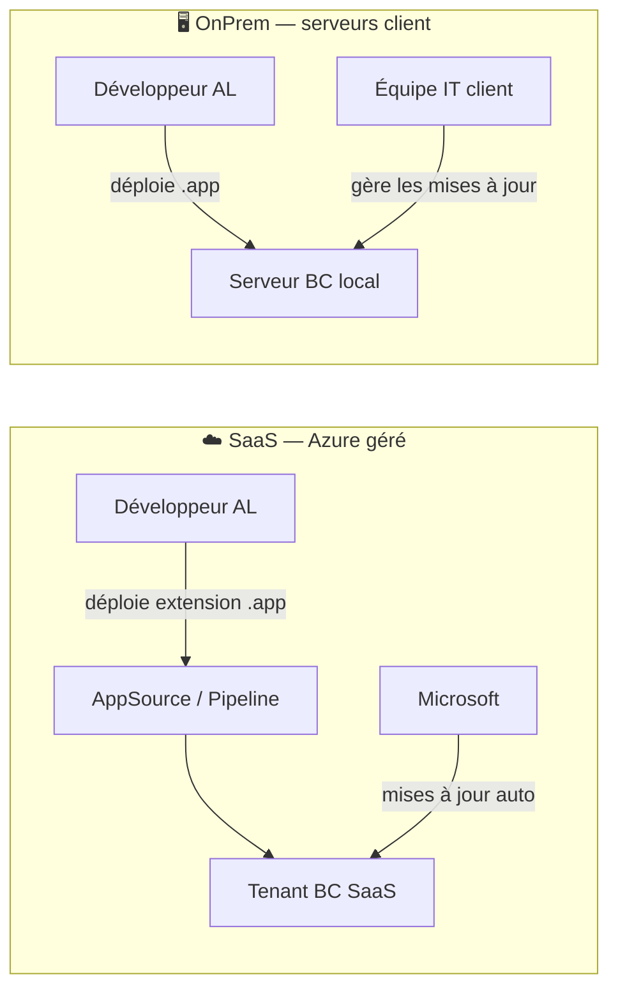
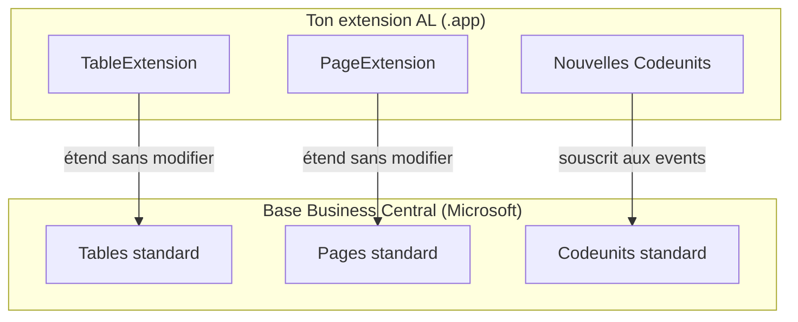

# Comprendre l'écosystème ERP Microsoft Business Central

## Objectifs pédagogiques

À la fin de ce module, tu seras capable de :

1. Retracer l'évolution historique de Navision jusqu'à Business Central et expliquer pourquoi cet héritage impacte encore les projets aujourd'hui
2. Choisir entre SaaS et OnPrem sur la base de critères mesurables : souveraineté des données, coût de maintenance, capacité IT du client
3. Distinguer extensions AL et customisations C/AL, et expliquer ce que ce changement de paradigme signifie concrètement pour le développeur
4. Identifier les implications du modèle multi-tenant sur tes pratiques de développement et de déploiement
5. Positionner ton rôle selon le contexte — intégrateur ou ISV — et en déduire le niveau de rigueur attendu sur ton code

---

## Mise en situation

Tu rejoins une équipe projet pour moderniser le système de gestion d'une PME industrielle de 200 personnes. L'entreprise tourne depuis 15 ans sur un Dynamics NAV fortement customisé : des centaines de modifications directes dans le code source, une gestion des stocks sur-mesure, des états Crystal Reports bricolés à l'époque.

Le projet : migrer vers Business Central SaaS. Le directeur technique te demande d'évaluer les customisations existantes, d'identifier ce qui peut être porté en extension AL, et de lui expliquer ce que "SaaS" change concrètement dans la façon de développer et de maintenir le système.

Tu n'as pas encore écrit une ligne d'AL. Mais avant de coder quoi que ce soit, tu dois répondre à trois questions : Qu'est-ce qui peut partir en extension ? Quel mode de déploiement choisir ? Quel niveau d'effort représente la migration ? Sans comprendre l'écosystème, tu vas prendre de mauvaises décisions dès le départ — et c'est exactement ce que ce module t'évite.

---

## De Navision à Business Central : 30 ans d'ERP en accéléré

Tout commence au Danemark, en 1984. Une petite société appelée **PC&C** développe un logiciel de comptabilité baptisé **Navision**. L'idée est simple mais puissante pour l'époque : un ERP conçu dès le départ pour les petites et moyennes entreprises, pas une usine à gaz dégraissée pour les PME.

En 2000, la société fusionne pour devenir **Navision Software**, puis est rachetée par **Microsoft en 2002** pour environ 1,45 milliard de dollars. Le produit devient **Microsoft Dynamics NAV** — surnommé affectueusement "NAV" par tous les praticiens.

Pendant les années 2000 et 2010, NAV s'impose comme une référence ERP PME en Europe. Son langage de développement interne, le **C/AL** (C-like Application Language), permet des customisations profondes directement dans les objets de base. C'est à la fois sa force (flexibilité totale) et son poison : quand Microsoft sortait une mise à jour, il fallait merger manuellement des centaines d'objets modifiés. Des clients se retrouvaient bloqués sur NAV 2009 en 2020 parce que la migration coûtait trop cher.

En **2018**, Microsoft franchit un cap majeur avec le lancement de **Dynamics 365 Business Central** — d'abord en SaaS sur Azure, puis en OnPrem. C'est une refonte du modèle de développement, construite autour d'un nouveau paradigme : les **extensions AL**, qui remplacent définitivement les modifications directes du code source.



🧠 **Concept clé** — Quand tu arrives sur un projet BC aujourd'hui, il y a de fortes chances que le client ait une histoire NAV. Des années de customisations, de données, de processus métier construits sur cet héritage. Comprendre d'où vient BC, c'est comprendre pourquoi les projets de migration sont complexes — et pourquoi les mauvaises pratiques de l'ancien monde restent tentantes.

---

## Où se positionne Business Central dans le marché ERP ?

Le marché ERP se découpe grossièrement en deux : les ERP "enterprise" (SAP S/4HANA, Oracle ERP Cloud) pour les grandes entreprises, et les ERP "mid-market" pour les PME et ETI. Business Central joue clairement dans cette deuxième catégorie, mais avec des ambitions sérieuses. Ses concurrents directs sont SAP Business One, Sage X3, Cegid en France, ou encore Odoo dans le monde open-source.

Ce qui différencie BC sur ce marché :

- **L'intégration native Microsoft** : Teams, Excel, Power BI, Power Automate, Outlook — tout s'intègre nativement, argument massif dans des entreprises déjà sur Microsoft 365.
- **Le modèle SaaS géré** : Microsoft prend en charge les mises à jour, l'infrastructure, la sécurité. Pour une PME sans DSI étoffée, c'est décisif.
- **L'écosystème partenaire** : des milliers d'intégrateurs certifiés et d'éditeurs ISV dans le monde, avec un marketplace (AppSource) structuré.
- **La couverture fonctionnelle** : finance, logistique, achats, ventes, production légère, gestion de projets — suffisant pour 80% des PME industrielles ou de services.

⚠️ **Erreur fréquente** — BC n'est pas SAP. Il ne gère pas les processus de très grandes entreprises (manufacturing complexe, multi-législations exotiques, volumétries extrêmes) sans extensions significatives. Le positionner comme "la solution pour tout" est une erreur de vente courante chez les intégrateurs débutants.

---

## SaaS vs OnPrem : une décision à prendre avec des critères, pas au feeling

C'est probablement la distinction la plus importante à comprendre pour un développeur AL. Elle change ce que tu peux faire, comment tu déploies, et comment tu maintiendras le code dans la durée.

### SaaS — le modèle cloud géré

En mode **SaaS**, Business Central tourne sur l'infrastructure Azure de Microsoft. Tu ne touches pas aux serveurs, tu n'installes rien. Ce que Microsoft gère pour toi : les mises à jour (deux vagues majeures par an, en avril et octobre), la sécurité, les backups, la disponibilité.

La contrainte fondamentale du SaaS : **tu ne peux pas modifier le code standard de Microsoft**. Jamais. Tout ce que tu veux ajouter ou changer passe obligatoirement par une extension AL déployée par-dessus la base standard. C'est non-négociable — et c'est précisément ce qui rend BC SaaS maintenable sur la durée.

### OnPrem — le modèle auto-hébergé

En mode **OnPrem**, le client installe Business Central sur ses propres serveurs. Les extensions AL fonctionnent aussi en OnPrem, mais les contraintes sont moins strictes : il est encore possible (pas recommandé) de modifier certains éléments du standard. Et surtout, le cycle de mise à jour est sous la responsabilité du client — ce qui peut conduire à des environnements figés sur des versions vieilles de plusieurs années.



### Choisir avec des critères mesurables

La question "SaaS ou OnPrem ?" revient sur tous les projets. Voici comment la trancher rapidement :

| Critère | → SaaS | → OnPrem |
|---|---|---|
| Souveraineté des données | Pas de contrainte réglementaire | Données ne peuvent pas quitter le territoire |
| Capacité IT du client | Pas d'équipe IT dédiée | Équipe IT capable de gérer les mises à jour |
| Fréquence souhaitée des mises à jour | Toujours à jour (2x/an automatique) | Mises à jour maîtrisées par le client |
| Connexions réseau industrielles | Accès internet suffisant | Connexions réseau locales complexes |
| Coût sur 5 ans | Abonnement mensuel prévisible | Licence + infrastructure + maintenance IT |
| Tendance marché | Fortement favorisée par Microsoft | En déclin progressif |

💡 **Astuce** — Si aucune contrainte réglementaire ou technique forte n'oriente vers l'OnPrem, pousse systématiquement vers le SaaS. Sur 5 ans, le coût de maintenance d'une instance OnPrem (mises à jour, infrastructure, incidents serveur) dépasse souvent largement l'abonnement SaaS équivalent.

---

## Multi-tenant, sandboxes et environnements

Un point qui surprend souvent les développeurs qui arrivent du monde web : Business Central a un modèle d'environnements précis qu'il faut comprendre avant de toucher quoi que ce soit.

### Tenants et multi-tenancy

En SaaS, Business Central est **multi-tenant** : l'infrastructure Microsoft héberge des centaines de milliers d'entreprises sur une plateforme partagée, mais chaque tenant est complètement isolé. Tes données ne se mélangent pas avec celles du voisin. En tant que développeur, ton unité de travail, c'est **le tenant** de ton client — et chaque tenant peut avoir plusieurs **environnements**.

### Environnements : production et sandbox

Pour chaque tenant, BC permet de créer plusieurs environnements indépendants :

- L'environnement de **production** : là où le client travaille au quotidien. On n'y touche pas sans processus de déploiement validé.
- Les **sandboxes** : environnements de test et de développement. Tu peux en créer plusieurs, les supprimer, les restaurer depuis un backup de prod.

🧠 **Concept clé** — Une sandbox BC SaaS peut être créée en copie de production en quelques clics depuis le portail d'administration (`admin.businesscentral.dynamics.com`). C'est ton terrain de jeu principal : développer et valider une extension en sandbox avant de la déployer en production n'est pas une bonne pratique optionnelle, c'est la seule façon sérieuse de travailler.

**Ce que ça change concrètement** : si tu déploies une extension bugguée directement en production, elle peut bloquer les utilisateurs en plein travail — et le rollback en SaaS n'est pas instantané. Quelques minutes passées à tester en sandbox t'évitent un incident de production.

---

## Extensions AL vs customisations C/AL : pourquoi ça change tout

C'est le cœur du changement de paradigme que représente Business Central.

### L'ancien monde C/AL

Sous Dynamics NAV, le modèle dominant était la **modification directe**. Tu prenais un objet standard (une table, une page, un rapport), tu l'ouvrais dans le développement NAV, et tu modifiais directement le code source. C'était simple, rapide — et massivement utilisé.

Le problème : quand Microsoft sortait une mise à jour, il fallait **merger** tes modifications avec les nouvelles versions des objets. Sur un NAV très customisé (certains l'étaient à 40-50% des objets), une mise à jour majeure pouvait représenter des mois de travail. Résultat : des clients bloqués sur NAV 2009 en 2020 parce que la migration coûtait trop cher.

### Le nouveau monde : les extensions AL

Une **extension AL** est un paquet de code (fichier `.app`) qui se déploie *par-dessus* le standard BC sans le modifier. Le standard reste intact. Ton code s'accroche au standard via des mécanismes définis : événements, surcharges de pages, ajout de champs via `TableExtension`.

Voici à quoi ça ressemble concrètement — même très simplement :

```al
// TableExtension : ajouter un champ sur la table Customer standard
tableextension 50100 "My Customer Ext" extends Customer
{
    fields
    {
        field(50100; "Segment Client"; Code[10])
        {
            DataClassification = CustomerContent;
            Caption = 'Segment Client';
        }
    }
}

// PageExtension : afficher ce champ sur la fiche client standard
pageextension 50101 "My Customer Card Ext" extends "Customer Card"
{
    layout
    {
        addafter(Name)
        {
            field("Segment Client"; Rec."Segment Client") { }
        }
    }
}
```

La table `Customer` standard n'a pas été touchée. Microsoft peut la mettre à jour — ton extension continuera de fonctionner tant que le champ `Name` (ton point d'ancrage) n'a pas changé de place.



💡 **Astuce** — Pense à une extension AL comme à un calque posé sur une carte. La carte (le standard BC) reste intacte. Ton calque ajoute des informations par-dessus. Si Microsoft réimprime la carte avec des corrections, tu poses ton calque à nouveau sans problème — sauf si tu avais tracé par-dessus un élément que Microsoft a déplacé.

---

## Cas d'école : évaluer une migration NAV → BC

Retour sur ton client industriel de 200 personnes avec 15 ans de NAV. Comment estimes-tu l'effort de migration avant de proposer quoi que ce soit ?

La première chose à demander n'est pas "quelle version de NAV ?" mais **"combien d'objets dans la plage custom 50 000–99 999 ?"**. C'est là que vivent toutes les modifications NAV propriétaires.

| Ce que tu trouves | Ce que ça signifie | Ce que tu fais |
|---|---|---|
| < 50 objets modifiés, NAV 2018+ | Migration légère, portage en extensions rapide | Propose SaaS, budget modéré |
| 100–300 objets modifiés, NAV 2013–2016 | Migration significative, analyse objet par objet | Phase d'audit obligatoire avant chiffrage |
| > 400 objets modifiés, NAV 2009 | Migration lourde, risque élevé, dette technique massive | Envisage migration par phases ou nettoyage avant portage |
| C/AL modifié dans la plage standard (1–49 999) | Cas le plus dangereux : Microsoft a pu modifier ces objets | Effort de merge imprévisible, budget risqué |

Un client sur NAV 2013 avec 400 objets customisés représente un effort de portage 5 à 10 fois supérieur à un client sur NAV 2018 avec 50 extensions propres. Cette évaluation conditionne le budget entier du projet.

⚠️ **Ce qu'on abandonne plutôt qu'on ne porte** — Tous les états Crystal Reports, les exports Excel bricolés, les écrans de saisie surchargés : dans BC, ces besoins sont couverts nativement (Excel Layout, API Pages, Word Layout). Proposer de les reconstruire en AL serait une perte de temps.

---

## AppSource : le marketplace des extensions

**AppSource** est le marketplace officiel Microsoft où les éditeurs (ISV) publient leurs extensions BC. Un client peut y trouver des solutions pour la gestion du temps, la conformité fiscale locale, l'e-commerce, l'EDI, le WMS avancé, etc.

Pour toi en tant que développeur, AppSource a deux implications :

1. **Si tu travailles pour un ISV**, ton objectif final est souvent de publier une app sur AppSource. Ça implique un processus de certification Microsoft strict (tests automatiques, validation fonctionnelle, conformité technique, affixes obligatoires sur tous les objets).
2. **Si tu travailles chez un intégrateur**, tu vas régulièrement évaluer des apps AppSource pour un client, les combiner entre elles, et développer des extensions spécifiques par-dessus.

---

## Intégrateur vs ISV : deux cultures, deux niveaux d'exigence

C'est une distinction que les développeurs juniors sous-estiment souvent. Elle impacte pourtant la façon dont tu codes au quotidien.

### L'intégrateur — coder pour un client

Un **intégrateur** déploie BC chez des clients finaux. Il paramètre, forme, adapte, et développe des extensions spécifiques pour chaque client. Le critère de succès : ça marche pour ce client, dans les délais, dans le budget.

### L'ISV — coder pour N clients

Un **ISV** développe un produit destiné à être vendu à des dizaines ou centaines de clients. Il peut publier sur AppSource ou vendre en direct. Le critère de succès : l'app fonctionne sur tous les tenants BC de ses clients, elle survit aux mises à jour biannuelles, et elle est maintenable sur 5 ans.

### Tableau décisionnel

| Si tu es dans ce contexte... | → Tu es plutôt... | Ce que ça implique pour ton code |
|---|---|---|
| PME, 1 client final, projet ciblé | Intégrateur | Livraison rapide prioritaire, tests manuels acceptables |
| Cabinet de conseil, 10+ clients BC | Intégrateur maturé | Tests automatisés recommandés, gestion des versions |
| Produit vertical (ex : gestion hôtelière BC) | ISV | Tests automatisés obligatoires, CI/CD, versioning strict |
| App publiée sur AppSource | ISV | Certification Microsoft, affixes obligatoires, zero SUPER permission |
| App avec plusieurs tiers de licence | ISV avancé | Entitlements AL, Responsible AI si Copilot, breaking changes policy |

🧠 **Concept clé** — Un développeur AL ISV écrit du code qui doit fonctionner sur des configurations BC qu'il ne contrôle pas. Il peut y avoir d'autres extensions installées qui entrent en conflit. Il doit anticiper les mises à jour BC sans savoir quand le client va les appliquer. C'est un niveau de rigueur supplémentaire par rapport au développement projet — ni meilleur ni pire, juste différent.

⚠️ **Erreur fréquente** — Appliquer les pratiques ISV à un projet intégrateur (sur-ingénierie, retards), ou appliquer les pratiques intégrateur à une app AppSource (rejet en certification). Le contexte détermine le niveau d'exigence attendu.

---

## Le rôle du développeur AL dans un projet réel

Un développeur AL n'est pas juste quelqu'un qui écrit du code. Tu interviens dans un écosystème fonctionnel dense, où les décisions techniques ont des conséquences directes sur des processus métier critiques — facturation, stocks, clôtures comptables.

**Avant de coder ta première extension**, voici les questions à poser systématiquement au client ou au consultant fonctionnel :

| Question | Pourquoi tu la poses | Ce que la réponse change |
|---|---|---|
| Version NAV actuelle ? | Détermine l'effort de migration | NAV 2009 vs 2018 = x5 à x10 sur le budget |
| Mode de déploiement prévu (SaaS / OnPrem) ? | Détermine ce que tu peux faire | SaaS = extensions uniquement, OnPrem = plus de latitude |
| Nombre d'objets dans la plage 50000–99999 ? | Mesure la dette technique NAV | Conditionne le chiffrage entier |
| Intégrations tierces actives (WMS, CRM, e-commerce) ? | Identifie les flux à reconstruire | APIs REST, XMLports, web services |
| Contraintes de souveraineté des données ? | Oriente SaaS ou OnPrem | Secteur banque, défense, santé → souvent OnPrem ou cloud privé |
| Budget maintenance annuel actuel sur NAV ? | Argument décisionnel SaaS | Si > coût abonnement SaaS → argument fort pour migrer |

⚠️ **Erreur fréquente** — Croire qu'AL est "juste un langage de script" pour faire des petites adaptations. AL est un langage typé, événementiel, avec une bibliothèque standard couvrant finance, logistique, production, APIs REST, gestion des erreurs transactionnelles et intégration Azure. La syntaxe s'apprend en quelques jours — maîtriser l'écosystème (outils, événements, déploiement, architecture BC) prend des mois.

---

## Résumé

Business Central est l'ERP Microsoft pour les PME et ETI, héritier direct de Navision (1984) et Dynamics NAV. Son histoire longue explique pourquoi les projets d'aujourd'hui coexistent souvent avec un héritage technique lourd. Le grand tournant de 2018, c'est le passage au modèle d'**extensions AL** : le code standard n'est plus modifiable, tout passe par des paquets `.app` déployés par-dessus la base, via `TableExtension`, `PageExtension` et événements. Deux modes de déploiement coexistent — SaaS (recommandé, mis à jour automatiquement 2x/an) et OnPrem (en déclin) — avec des implications très différentes pour le développeur. Le choix entre les deux se fait sur des critères mesurables : souveraineté des données, capacité IT, coût de maintenance sur 5 ans. L'écosystème s'organise autour de tenants isolés, d'environnements production/sandbox, et d'un marketplace (AppSource) où les ISV publient leurs solutions. Que tu travailles chez un intégrateur ou un ISV, la première étape d'un projet n'est pas d'ouvrir VS Code — c'est de comprendre le contexte : version NAV, objets customisés, mode de déploiement, intégrations tierces. Ces réponses conditionnent toutes tes décisions techniques à venir.

---

<!-- snippet
id: bc_erp_saas_vs_onprem
type: concept
tech: business-central
level: beginner
importance: high
format: knowledge
tags: saas, onprem, deploiement, business-central, architecture
title: SaaS vs OnPrem — ce qui change pour le développeur AL
content: En SaaS, tu ne peux JAMAIS modifier le code standard BC — tout passe par des extensions .app. Microsoft gère les mises à jour 2x/an (avril, octobre) : ton extension doit survivre à chaque vague sans intervention manuelle. En OnPrem, la contrainte est moins stricte techniquement, mais le risque de dette technique est maximal et le coût de maintenance sur 5 ans dépasse souvent l'abonnement SaaS équivalent. 90% des nouveaux projets démarrent en SaaS. Exception principale : contraintes de souveraineté des données (défense, santé, banque) ou connexions réseau industrielles locales incompatibles avec un accès cloud.
description: La distinction SaaS/OnPrem définit ce que tu peux toucher dans BC et comment tu gères les mises à jour — fondamental avant d'écrire la première ligne AL.
-->

<!-- snippet
id: bc_erp_tableextension_basique
type: concept
tech: business-central
level: beginner
importance: high
format: knowledge
tags: tableextension, pageextension, extension, al, standard
title: Une TableExtension AL — ajouter un champ sans toucher au standard
content: tableextension 50100 "My Customer Ext" extends Customer { fields { field(50100; "Segment Client"; Code[10]) { DataClassification = CustomerContent; Caption = 'Segment Client'; } } } — La table Customer standard n'est pas modifiée. Ce champ existe uniquement dans ton extension. Microsoft peut mettre à jour Customer sans casser ton code, tant que la structure de base reste compatible. C'est le principe fondamental du modèle extension AL.
description: Une TableExtension ajoute des champs sur une table standard BC sans la modifier — le standard reste intact et les mises à jour Microsoft n'effacent pas ton travail.
-->

<!-- snippet
id: bc_erp_sandbox_usage
type: tip
tech: business-central
level: beginner
importance: high
format: knowledge
tags: sandbox, environnement, developpement, tenant, bc
title: Toujours développer en sandbox — jamais en production
content: Dans le portail BC (admin.businesscentral.dynamics.com), crée une sandbox depuis "Environments → New" en choisissant "Sandbox" comme type. Tu peux la créer en copie de prod pour travailler sur des données réelles sans risque. Une sandbox peut être supprimée et recréée en minutes. Déployer une extension bugguée directement en production peut bloquer des utilisateurs en plein travail — et le rollback en SaaS n'est pas instantané. La sandbox n'est pas une option : c'est la seule façon sérieuse de travailler.
description: La sandbox BC SaaS se crée en quelques clics depuis le portail admin et peut être copiée depuis la production — à utiliser systématiquement avant tout déploiement.
-->

<!-- snippet
id: bc_erp_integrator_vs_isv
type: concept
tech: business-central
level: beginner
importance: medium
format: knowledge
tags: isv, integrateur, appsource, projet, al
title: Intégrateur vs ISV — quel niveau d'exigence sur ton code AL
content: Intégrateur = tu codes pour 1 client, critère principal = livraison dans les délais. ISV = tu codes pour N clients sur AppSource, critère principal = l'app fonctionne sur tous les tenants BC, survit aux mises à jour biannuelles, et est maintenable sur 5 ans. Conséquences pratiques : l'ISV exige des tests automatisés, un versioning strict, une certification Microsoft, et des affixes obligatoires sur tous les objets AL. Appliquer des pratiques ISV à un projet intégrateur = sur-ingénierie. Appliquer des pratiques intégrateur à une app AppSource = rejet en certification.
description: La distinction intégrateur/ISV détermine directement le niveau de rigueur attendu sur ton code AL et les contraintes de publication AppSource.
-->

<!-- snippet
id: bc_erp_multitenant_model
type: concept
tech: business-central
level: beginner
importance: medium
format: knowledge
tags: tenant, multi-tenant, environnement, saas, isolation
title: Modèle multi-tenant BC — tenant, environnement, isolation
content: En SaaS BC, chaque entreprise cliente = 1 tenant isolé sur l'infrastructure Azure Microsoft. Un tenant peut avoir plusieurs environnements (1 production + N sandboxes). Les données entre tenants sont complètement cloisonnées — tu n'as aucun accès aux données ou au code des autres tenants. Ton unité de déploiement = un environnement précis d'un tenant précis. Implication pour le développeur ISV : ton extension sera déployée sur des centaines de tenants différents, avec des configurations BC potentiellement différentes.
description: Un tenant = une entreprise cliente isolée, avec ses propres environnements production et sandbox — base du modèle d'hébergement BC SaaS à comprendre avant tout déploiement.
-->

<!-- snippet
id: bc_erp_update_waves_breaking
type: warning
tech: business-central
level: beginner
importance: high
format: knowledge
tags: mises-a-jour, saas, waves, compatibilite, breaking-changes, al
title: Les vagues BC SaaS peuvent casser tes extensions — exemples réels
content: Piège : Microsoft pousse des mises à jour majeures en avril et octobre sur tous les tenants SaaS. Exemple concret : en BC 21, la signature de certains événements de posting a changé — les extensions qui utilisaient l'ancienne signature se retrouvaient en erreur de compilation au déploiement post-mise à jour. Correction : environ 2 mois avant chaque vague, Microsoft met à disposition une sandbox "preview" de la nouvelle version. Teste systématiquement ton extension sur cette preview avant la mise en production. Sans cette étape, tu découvres le problème le jour J — quand le client appelle parce que son ERP ne fonctionne plus.
description: Les mises à jour biannuelles BC SaaS (avril/octobre) peuvent invalider des extensions — tester sur la preview de chaque vague dans une sandbox dédiée est non-négociable.
-->

<!-- snippet
id: bc_erp_nav_migration_evaluation
type: tip
tech: business-central
level: beginner
importance: high
format: knowledge
tags:
