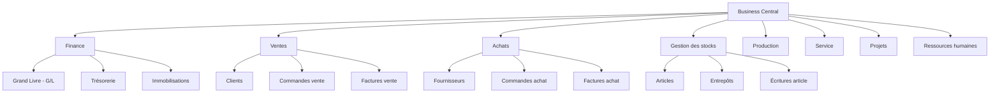
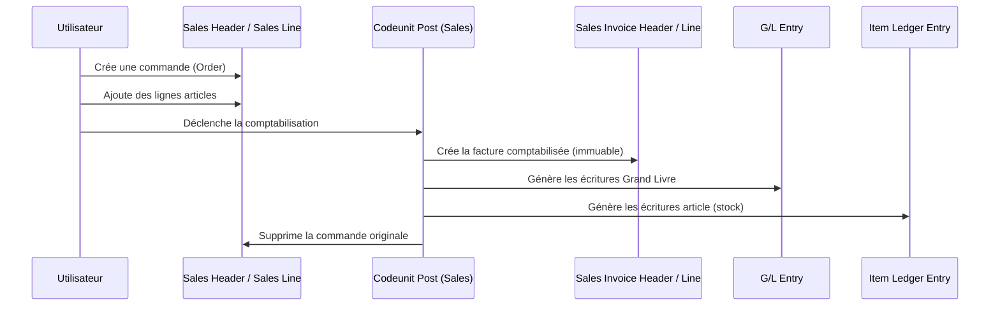

# Architecture fonctionnelle Business Central

## Objectifs pédagogiques

À l'issue de ce module, vous serez capable de :

- Décrire comment Business Central organise ses données en tables et ses interfaces en pages
- Distinguer les grands domaines fonctionnels de BC et expliquer comment ils s'articulent
- Comprendre le rôle des objets AL (Table, Page, Codeunit, Report...) dans l'architecture globale
- Lire un flux de données transactionnel typique (commande → livraison → facturation) en identifiant les tables et les événements impliqués
- Situer votre code d'extension dans l'architecture existante, sans la casser

---

## Mise en situation

Imaginez qu'on vous demande d'ajouter un champ "Référence client interne" sur la commande de vente, puis d'afficher ce champ dans le PDF de facturation. Tâche en apparence simple. Sauf que vous ne savez pas encore où vivent les données d'une commande, comment une commande devient une facture, ni pourquoi il existe deux tables distinctes appelées "Sales Header" et "Sales Invoice Header". Vous risquez d'intervenir au mauvais endroit — et potentiellement de modifier des données qui ne peuvent plus être corrigées.

Ce module répond à une question fondamentale avant d'écrire la moindre ligne de code : **comment Business Central est-il organisé, et où se passe quoi ?**

---

## Ce que c'est — et pourquoi ça a cette forme

Business Central n'est pas une application monolithique avec une base de données opaque. C'est un système structuré autour d'objets nommés, versionnés et extensibles. Chaque élément — une table, un écran, une règle métier — est un objet AL identifié par un numéro et un nom.

Cette organisation n'est pas arbitraire. Elle hérite de trente ans de conception NAV, avec une philosophie constante : **séparer la donnée, la présentation et la logique**. Une table stocke, une page affiche, un codeunit traite. Quand vous comprenez ce découpage, vous savez immédiatement où chercher un comportement, où l'étendre, et où ne pas toucher.

🧠 **Concept clé** — Business Central est construit sur le principe de séparation des responsabilités appliqué à un ERP. Ce n'est pas juste une bonne pratique de développement : c'est le modèle mental qui gouverne toute l'architecture.

---

## Les objets fondamentaux de l'architecture

Avant de parler de flux ou de domaines fonctionnels, il faut avoir en tête les briques de base. BC est littéralement composé de ces objets :

| Objet AL | Rôle | Analogie |
|---|---|---|
| **Table** | Stocke les données | Une table SQL avec comportements |
| **Page** | Affiche et édite les données | Un formulaire ou une liste |
| **Codeunit** | Contient la logique métier | Une classe de services |
| **Report** | Génère des sorties imprimables ou Excel | Un générateur de documents |
| **Query** | Agrège des données multi-tables | Une vue SQL orientée lecture |
| **XMLport** | Importe/exporte des données structurées | Un parseur/sérialiseur de fichiers |
| **Enum** | Définit des valeurs fixes et extensibles | Un enum typé |
| **Interface** | Contrat de comportement entre objets | Une interface OOP |

Retenez particulièrement les quatre premiers — Table, Page, Codeunit, Report — ils représentent l'essentiel de ce que vous écrirez ou étendrez au quotidien.

💡 **Astuce** — Chaque objet a un numéro unique dans une plage réservée. Microsoft occupe les numéros bas (1–49 999). Vos extensions doivent utiliser une plage enregistrée (typiquement 50 000+). Vous n'avez pas à vous en préoccuper maintenant, mais gardez en tête que les collisions de numéros sont une source réelle de conflits en production.

---

## Les domaines fonctionnels — la carte du territoire

Business Central est découpé en domaines métier cohérents. Ce découpage reflète directement l'organisation des tables dans la base de données. Connaître cette carte évite de chercher une table au mauvais endroit.

Chaque domaine a ses propres tables maîtresses, ses tables de transactions, et ses tables d'écritures comptables. Cette séparation est importante : une écriture comptable (G/L Entry) n'est jamais modifiée après sa création. C'est un journal, pas un brouillon.

---

## Le flux transactionnel — comprendre la vie d'une commande

C'est là que l'architecture prend tout son sens. Suivons une commande client du devis à la facture comptabilisée.

Deux points frappent immédiatement :

**1. La commande disparaît.** Quand une commande est entièrement facturée et comptabilisée, la ligne dans `Sales Header` est supprimée. Les données vivent désormais dans `Sales Invoice Header`. Si vous cherchez l'historique des commandes facturées dans la mauvaise table, vous ne trouverez rien.

**2. Les écritures sont immuables.** Une `G/L Entry` ou une `Item Ledger Entry` créée lors de la comptabilisation ne peut pas être modifiée directement. Pour corriger une erreur, on crée une écriture de contrepassation. C'est un choix architectural délibéré pour l'intégrité comptable.

⚠️ **Erreur fréquente** — Beaucoup de développeurs débutants cherchent à modifier une facture comptabilisée directement en base. Ce n'est pas seulement interdit par les contrôles BC : c'est architecturalement impossible de façon propre. Les données comptabilisées sont dans des tables séparées, en lecture seule dans la logique métier.

---

## La logique métier — où elle vit et comment elle s'applique

La logique dans BC ne se trouve pas dans les pages (les écrans). Elle vit principalement dans :

- **Les triggers de tables** — code qui s'exécute sur `OnInsert`, `OnModify`, `OnDelete` d'un enregistrement
- **Les codeunits métier** — des modules spécialisés comme `Sales-Post` (Codeunit 80) ou `Item Jnl.-Post Line` (Codeunit 22)
- **Les événements (Events)** — le mécanisme moderne d'extensibilité, qui permet à votre extension de se brancher sur le flux sans modifier le code standard

Ce dernier point mérite qu'on s'y attarde un instant. Microsoft a progressivement exposé des points d'extension appelés **Publishers d'événements** (`OnBeforePostSalesDoc`, `OnAfterInsertSalesHeader`, etc.). Votre code AL s'abonne à ces événements via des **Subscribers**. Résultat : vous injectez votre logique dans le flux standard sans toucher aux codeunits de base.

🧠 **Concept clé** — Les événements sont le contrat entre le code standard Microsoft et vos extensions. C'est le mécanisme qui rend BC réellement extensible sans forking du code source. Tout le modèle d'extension AL repose là-dessus.

---

## Les tables clés à connaître absolument

Vous ne pouvez pas retenir 3 000 tables d'un coup. Mais il existe un noyau dur que tout développeur BC croise dans 80 % des situations :

| Table | N° | Rôle |
|---|---|---|
| `G/L Account` | 15 | Plan comptable |
| `Customer` | 18 | Fiche client |
| `Vendor` | 23 | Fiche fournisseur |
| `Item` | 27 | Fiche article |
| `Sales Header` | 36 | En-tête commande/devis/retour vente (en cours) |
| `Sales Line` | 37 | Lignes de vente (en cours) |
| `Purchase Header` | 38 | En-tête document achat (en cours) |
| `Purchase Line` | 39 | Lignes achat (en cours) |
| `Sales Invoice Header` | 112 | Facture vente comptabilisée |
| `Sales Invoice Line` | 113 | Lignes facture vente comptabilisée |
| `G/L Entry` | 17 | Écritures Grand Livre |
| `Item Ledger Entry` | 32 | Écritures mouvement de stock |
| `Value Entry` | 5802 | Valorisation des mouvements stock |

💡 **Astuce** — Dans Business Central, le champ `Document Type` dans `Sales Header` distingue les devis (Quote), commandes (Order), factures directes (Invoice) et retours (Return Order). Une seule table gère tous ces documents en cours. Ce n'est pas une table par type de document.

---

## Les pages — ce que voit l'utilisateur

Une Page BC n'est pas juste un écran. C'est un objet AL lié à une source de données (une table, une query), avec un type qui détermine son comportement visuel :

| Type de page | Usage typique |
|---|---|
| `Card` | Fiche d'un enregistrement unique (client, article) |
| `List` | Liste d'enregistrements (liste des clients) |
| `Document` | En-tête + lignes (commande de vente) |
| `Worksheet` | Saisie en grille (journal comptable) |
| `RoleCenter` | Tableau de bord par profil utilisateur |
| `FactBox` | Panneau d'info latéral (chiffres clés d'un client) |

Ce découpage n'est pas cosmétique. Un `Document` gère la relation parent/enfant entre `Sales Header` et `Sales Line`. Un `Card` expose un seul enregistrement avec tous ses champs. Comprendre le type de page, c'est comprendre comment les données y circulent.

---

## Cas réel — déboguer un comportement inattendu sur une commande

Un consultant vous remonte : "Le montant HT affiché sur la commande ne correspond pas à ce qui est facturé." Grâce à l'architecture que vous venez de voir, vous pouvez raisonner méthodiquement :

1. **La commande est-elle encore ouverte ?** → Chercher dans `Sales Header` (table 36), champ `Status`
2. **La facture est-elle comptabilisée ?** → Chercher dans `Sales Invoice Header` (table 112)
3. **Y a-t-il eu un avoir partiel ?** → Regarder `Sales Cr. Memo Header` (table 114)
4. **Les écritures GL correspondent-elles ?** → Filtrer `G/L Entry` sur le numéro de document
5. **Le stock a-t-il bougé correctement ?** → Vérifier `Item Ledger Entry` sur le même document

Sans cette carte mentale, vous cherchez dans le vide. Avec elle, chaque symptôme pointe vers un endroit précis.

---

## Bonnes pratiques — ce qu'il faut garder en tête dès maintenant

**Ne jamais modifier directement des écritures comptabilisées.** Les tables comme `G/L Entry`, `Item Ledger Entry` ou `Sales Invoice Header` sont là pour l'audit et la traçabilité. BC expose des mécanismes de correction (avoirs, contrepassations) — utilisez-les.

**Chercher la logique dans les codeunits, pas dans les pages.** Si un comportement vous semble étrange, la page est rarement responsable. La logique est dans les triggers de table ou dans un codeunit de traitement.

**Apprendre les numéros des tables clés.** Ça semble anecdotique, mais quand vous déboguez un flux en production et que vous cherchez dans les logs ou les metadata, connaître que la table 36 c'est `Sales Header` vous fait gagner un temps réel.

**Ne pas confondre "document en cours" et "document comptabilisé".** C'est la confusion la plus fréquente. `Sales Header` = vivant, modifiable. `Sales Invoice Header` = archivé, immuable. Deux tables distinctes, deux états du cycle de vie.

⚠️ **Erreur fréquente** — Ajouter de la logique métier dans les triggers `OnAfterGetRecord` d'une page. Ces triggers sont conçus pour la présentation, pas pour modifier des données. Les effets de bord sont imprévisibles (exécutions multiples, comportements différents en mode liste vs fiche).

---

## Résumé

Business Central structure son architecture autour de trois séparations fondamentales : les **Tables** stockent, les **Pages** affichent, les **Codeunits** traitent. Les domaines fonctionnels (Finance, Ventes, Achats, Stock...) organisent ces objets en blocs cohérents, chacun avec ses tables de documents en cours et ses tables d'écritures immuables. Le cycle de vie d'un document — de la commande à la facture comptabilisée — implique une transition entre tables distinctes, pas une mise à jour de la même ligne. La logique métier s'étend via un système d'événements (Publishers/Subscribers), ce qui permet d'injecter du comportement custom sans modifier le code standard. Avoir cette carte en tête est le préalable indispensable à tout développement AL sérieux : vous saurez où chercher, où intervenir, et surtout où ne pas toucher.

---

<!-- snippet
id: bc_tables_document_vs_posted
type: concept
tech: business-central
level: beginner
importance: high
format: knowledge
tags: tables, documents, comptabilisation, architecture, sales
title: Documents en cours vs documents comptabilisés en BC
content: BC utilise des tables séparées selon l'état du document. Sales Header (36) contient les commandes en cours — modifiables. Après comptabilisation, les données migrent vers Sales Invoice Header (112) — immuable. La commande source est supprimée. Chercher une facture dans Sales Header ne donnera rien.
description: Deux tables distinctes pour deux états du cycle de vie : modification impossible sur les documents comptabilisés, c'est architectural.
-->

<!-- snippet
id: bc_gleentry_immutable
type: warning
tech: business-central
level: beginner
importance: high
format: knowledge
tags: grand-livre, ecritures, comptabilisation, integrite, tables
title: Les écritures GL ne se modifient pas directement
content: Piège : tenter de modifier G/L Entry (table 17) ou Item Ledger Entry (table 32) directement. Ces tables sont immuables par conception — toute correction passe par une contrepassation ou un avoir. Modifier ces tables en SQL direct casse l'intégrité comptable et les audits BC.
description: G/L Entry et Item Ledger Entry sont des journaux append-only. Toute correction passe par des documents BC, pas par un UPDATE direct.
-->

<!-- snippet
id: bc_objects_roles
type: concept
tech: business-central
level: beginner
importance: high
format: knowledge
tags: objets, table, page, codeunit, architecture
title: Les 4 objets AL fondamentaux et leurs rôles
content: Table = stocke les données (équivalent table SQL avec triggers). Page = affiche et édite (lié à une table ou query). Codeunit = contient la logique métier (équivalent classe de services). Report = génère des sorties imprimables ou Excel. La logique ne doit pas être dans les pages — elle appartient aux codeunits ou triggers de tables.
description: Séparation stricte des responsabilités : ne jamais mettre de logique métier dans les triggers de présentation d'une Page.
-->

<!-- snippet
id: bc_events_publisher_subscriber
type: concept
tech: business-central
level: beginner
importance: high
format: knowledge
tags: evenements, publisher, subscriber, extensibilite, al
title: Mécanisme Publisher / Subscriber pour étendre BC
content: Microsoft expose des points d'extension appelés Event Publishers (ex: OnAfterPostSalesDoc) dans les codeunits standard. Votre extension crée un Event Subscriber qui s'abonne à ces événements. BC appelle automatiquement votre code au bon moment, sans que vous modifiez le codeunit source. C'est le seul moyen propre d'injecter de la logique dans le flux standard.
description: Les événements sont le contrat d'extensibilité BC. Toute logique custom s'y branche — modifier les codeunits standard est interdit en SaaS et dangereux en OnPrem.
-->

<!-- snippet
id: bc_sales_header_document_type
type: tip
tech: business-central
level: beginner
importance: medium
format: knowledge
tags: sales-header, document-type, tables, ventes
title: Sales Header gère plusieurs types de documents via un champ
content: La table Sales Header (36) contient à la fois les devis (Quote), commandes (Order), factures directes (Invoice) et retours (Return Order). Le champ Document Type distingue ces cas. Il n'existe pas une table par type de document. Pour filtrer uniquement les commandes : poser un filtre Document Type = Order sur Sales Header.
description: Ne pas créer de table custom pour "les commandes" — elles sont dans Sales Header avec Document Type = Order.
-->

<!-- snippet
id: bc_page_types_roles
type: concept
tech: business-central
level: beginner
importance: medium
format: knowledge
tags: pages, card, list, document, worksheet, types
title: Types de pages BC et leurs usages respectifs
content: Card = fiche d'un enregistrement unique (client, article). List = liste filtrée d'enregistrements. Document = relation parent/enfant (Sales Header + Sales Lines sur le même écran). Worksheet = saisie en grille (journaux). RoleCenter = tableau de bord par profil. Le type détermine comment les données circulent — un Document gère automatiquement la relation en-tête/lignes.
description: Choisir le mauvais type de page cause des comportements erratiques sur la navigation et la gestion des enregistrements liés.
-->

<!-- snippet
id: bc_logic_not_in_page_triggers
type: warning
tech: business-central
level: beginner
importance: high
format: knowledge
tags: page, trigger, logique-metier, onaftergetrecord, erreur
title: Ne pas mettre de logique métier dans OnAfterGetRecord
content: Piège : ajouter des modifications de données dans le trigger OnAfterGetRecord d'une Page. Ce trigger est conçu pour la présentation — il peut s'exécuter plusieurs fois de façon imprévisible (scroll, refresh, mode liste vs fiche). La logique métier appartient aux codeunits ou aux triggers de tables (OnInsert, OnModify).
description: OnAfterGetRecord = lecture seule pour affichage. Toute écriture ou calcul avec effet de bord doit aller dans un codeunit ou trigger de table.
-->

<!-- snippet
id: bc_core_tables_numbers
type: tip
tech: business-central
level: beginner
importance: medium
format: knowledge
tags: tables, numeros, navigation, debug, references
title: Numéros des tables BC les plus fréquentes
content: Customer=18, Vendor=23, Item=27, Sales Header=36, Sales Line=37, Purchase Header=38, G/L Entry=17, Item Ledger Entry=32, Sales Invoice Header=112, Sales Invoice Line=113. Ces numéros apparaissent dans les logs, les metadata et les erreurs BC. Les connaître accélère le diagnostic en production.
description: Mémoriser les ~12 tables clés évite de chercher dans l'IDE à chaque session de débogage.
-->
