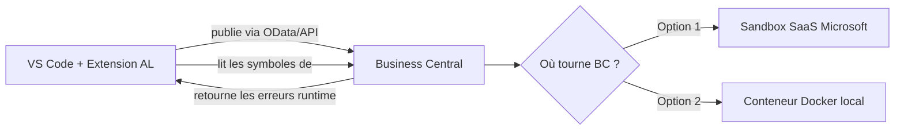
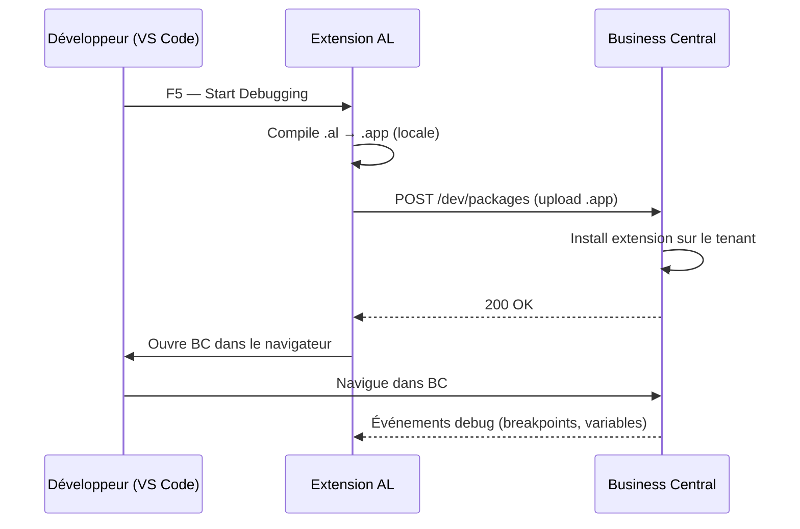

# Installation environnement développeur AL

## Objectifs pédagogiques

À l'issue de ce module, tu seras capable de :

1. **Installer** VS Code et l'extension AL Language en partant de zéro
2. **Configurer** une connexion vers un sandbox Business Central SaaS ou un conteneur Docker local
3. **Générer** un projet AL minimal et le publier sur un environnement de test
4. **Identifier** les erreurs classiques de configuration et les corriger sans tâtonner
5. **Comprendre** pourquoi chaque composant est là — et ce qui se passe réellement quand tu appuies sur F5

---

## Mise en situation

Tu intègres une équipe qui développe des extensions BC pour un client PME dans le secteur logistique. Le projet existe déjà, il y a un dépôt Git, des collègues ont leur environnement qui tourne. On te donne un accès sandbox Microsoft 365 et on te dit "mets-toi en place".

Tu ouvres VS Code, tu installes l'extension AL, tu fais `AL: Go!`… et tu te retrouves bloqué dès la connexion au tenant, sans savoir si le problème vient de ton authentification, de ta version d'AL, ou du `launch.json` mal configuré.

Ce module te donne les bases pour ne pas rester coincé là. On installe tout proprement, on comprend ce qu'on fait, et on publie un "Hello World" qui tourne réellement sur BC — pas juste localement.

---

## Pourquoi cet environnement est un peu particulier

Avant de lancer la moindre commande, voici ce qu'il faut comprendre : le développement AL ne ressemble pas à un projet Python ou Node.js où tu installes un interpréteur et tu exécutes un fichier.

Ici, **ton code n'existe pas seul**. Une extension AL doit toujours s'exécuter dans le contexte d'un Business Central — elle étend un ERP existant. Concrètement, ça veut dire que pour développer et tester, tu as besoin d'un BC qui tourne quelque part : soit un sandbox cloud chez Microsoft (le plus simple pour débuter), soit un conteneur Docker local (plus lourd mais offline).



VS Code avec l'extension AL joue un double rôle : éditeur de code d'un côté, et client de déploiement de l'autre. Quand tu appuies sur F5, il compile ton extension localement, la pousse sur BC, et ouvre BC dans le navigateur en mode debug. **Tout ça passe par des appels réseau** — ce qui explique pourquoi la configuration de connexion est critique.

---

## Ce dont tu as besoin : la liste courte

| Composant | Rôle | Où le récupérer |
|---|---|---|
| **VS Code** | Éditeur principal | code.visualstudio.com |
| **Extension AL Language** | Compilateur, IntelliSense, déploiement | Marketplace VS Code |
| **Sandbox BC** (SaaS) | Environnement d'exécution cloud | admin.dynamics.com |
| **Docker Desktop** *(optionnel)* | Exécution locale de BC en conteneur | docker.com |
| **Compte Microsoft** avec licence BC | Authentification OAuth2 vers le tenant | Via ton employeur ou MSDN |

Pour ce module, on travaille en priorité avec le **sandbox SaaS** — c'est le chemin le plus rapide et celui que tu utiliseras en production de toute façon. Docker est abordé ensuite pour les cas offline ou de CI.

---

## Installation pas à pas

### 1. VS Code

Rien de particulier ici, installe la version stable depuis [code.visualstudio.com](https://code.visualstudio.com). Une seule remarque : **évite les versions Insiders** pour le travail AL — l'extension AL Language est validée sur la version stable, et les comportements divergent parfois.

### 2. L'extension AL Language

Dans VS Code, ouvre l'onglet Extensions (`Ctrl+Shift+X`) et cherche **"AL Language"**. L'éditeur est Microsoft, l'identifiant exact est `ms-dynamics-smb.al`.

⚠️ **Erreur fréquente** — Il existe aussi une extension "AL Language Extension" tierce qui n'est pas la bonne. Vérifie bien l'éditeur : `Microsoft`.

Une fois installée, l'extension va télécharger les symboles AL de base (quelques centaines de Mo). Laisse-la finir avant de continuer.

### 3. Créer ton premier projet AL

Ouvre la palette de commandes (`Ctrl+Shift+P`) et tape :

```
AL: Go!
```

VS Code te pose deux questions :

- **Quelle version d'AL ?** → choisis `Microsoft Cloud` si tu travailles avec un sandbox SaaS, ou une version spécifique si tu connais la version BC de ton client.
- **Où créer le projet ?** → choisis un dossier vide.

Tu obtiens une structure minimale :

```
mon-projet/
├── .al-langid.json
├── app.json          ← métadonnées de l'extension
├── launch.json       ← configuration de connexion BC
└── HelloWorld.al     ← ton premier objet AL
```

### 4. Configurer `launch.json`

C'est ici que la plupart des gens bloquent. Le fichier `launch.json` (dans `.vscode/`) dit à l'extension AL *où* publier ton code.

Voici un exemple de configuration pour un sandbox SaaS :

```json
{
  "version": "0.2.0",
  "configurations": [
    {
      "type": "al",
      "request": "launch",
      "name": "Mon Sandbox BC",
      "environmentType": "Sandbox",
      "environmentName": "sandbox",
      "tenant": "monentreprise.onmicrosoft.com",
      "authentication": "UserPassword"
    }
  ]
}
```

Les champs qui comptent vraiment :

- `environmentType` : `Sandbox` ou `Production`. **Ne jamais pointer sur Production pour développer.**
- `environmentName` : le nom court de ton sandbox tel qu'il apparaît dans admin.dynamics.com (souvent `sandbox` par défaut).
- `tenant` : ton domaine Microsoft 365 (pas une URL complète, juste `entreprise.onmicrosoft.com`).
- `authentication` : `UserPassword` pour les comptes Microsoft standards, `AAD` pour les setups OAuth2 avec App Registration.

💡 **Astuce** — Si tu travailles dans une organisation avec MFA, l'authentification `UserPassword` échouera silencieusement. Utilise `AAD` et configure une App Registration dans Azure AD avec les permissions BC adéquates.

### 5. Télécharger les symboles

Avant de pouvoir compiler quoi que ce soit, AL a besoin de connaître tous les objets BC de base (tables, pages, codeunits…). Ces "symboles" s'obtiennent via :

```
Ctrl+Shift+P → AL: Download Symbols
```

VS Code va se connecter à ton BC, s'authentifier, et télécharger un fichier `.app` de symboles dans ton projet. **C'est la première vraie connexion réseau** — si ça échoue ici, ton `launch.json` ou ton authentification est en cause.

### 6. Premier F5

Le fichier `HelloWorld.al` généré par `AL: Go!` contient déjà un objet simple. Appuie sur **F5** (ou menu Run → Start Debugging) :

1. AL compile ton extension (`.app`)
2. Il la pousse sur ton sandbox BC
3. BC s'ouvre dans le navigateur avec ton extension active

Si tout se passe bien, tu vois BC s'ouvrir. Si tu vois une erreur de compilation, elle apparaît dans le panneau **Problems** de VS Code avec un lien direct vers la ligne concernée.

---

## Alternative : Docker en local

Pour les situations sans accès internet ou pour isoler complètement ton environnement, Microsoft publie des images Docker officielles de BC.

```bash
# Installer le module PowerShell BcContainerHelper (Windows uniquement)
Install-Module BcContainerHelper -Force

# Créer un conteneur BC (exemple avec BC 23)
New-BcContainer `
  -containerName "bc-dev" `
  -imageName "mcr.microsoft.com/businesscentral/sandbox:23.0" `
  -auth NavUserPassword `
  -includeAL
```

⚠️ **Erreur fréquente** — `New-BcContainer` nécessite Docker Desktop configuré avec les conteneurs **Windows** (pas Linux). Si tu es sur Mac ou Linux, les options sont plus limitées et la configuration est significativement plus complexe — le sandbox SaaS reste largement préférable dans ce cas.

Une fois le conteneur lancé, adapte ton `launch.json` :

```json
{
  "type": "al",
  "request": "launch",
  "name": "BC Docker local",
  "environmentType": "OnPrem",
  "server": "http://localhost",
  "serverInstance": "BC",
  "authentication": "UserPassword",
  "tenant": "default"
}
```

---

## Ce qui se passe sous le capot quand tu fais F5

Comprendre ce mécanisme évite beaucoup de confusion au moment où ça ne fonctionne pas.



Deux choses importantes à retenir :
- La **compilation** est locale (CPU de ta machine). Si ton code a une erreur de syntaxe, BC n'est jamais contacté.
- Le **déploiement** est une requête HTTP vers l'API de développement BC. Si tu as un problème réseau ou d'authentification, la compilation réussit mais le déploiement échoue — et les messages d'erreur ne sont pas toujours très clairs.

---

## Diagnostic des erreurs fréquentes

### "Could not download symbols"

**Cause probable** : mauvais `tenant` ou `environmentName` dans `launch.json`, ou session expirée.  
**Correction** : vérifie les valeurs dans admin.dynamics.com, reconnecte-toi (`AL: Clear Credentials Cache`), réessaie.

### "The extension could not be deployed"

**Cause probable** : l'extension a compilé mais BC a refusé le déploiement. Souvent lié à un conflit de version dans `app.json` ou à une dépendance manquante.  
**Correction** : ouvre l'onglet **Output** → **AL Language**, les détails de l'erreur BC s'y trouvent.

### F5 ouvre BC mais l'extension ne semble pas active

**Cause probable** : BC a bien installé l'extension, mais tu regardes le mauvais profil ou rôle utilisateur.  
**Correction** : cherche ta page ou ton action dans "Tell me" (la loupe BC) — si elle apparaît, l'extension est bien là.

### "Assembly ... could not be loaded" (Docker)

**Cause probable** : le conteneur utilise des conteneurs Linux au lieu de Windows.  
**Correction** : dans Docker Desktop → Settings → Gear → Switch to Windows containers.

---

## Cas réel : onboarder en 45 minutes

Voici ce que ça donne concrètement quand tout est en place. Un développeur rejoint l'équipe un lundi matin. Il a VS Code et un accès sandbox BC. Voici la séquence réelle :

1. Installe l'extension AL Language (5 min, téléchargement compris)
2. Clone le dépôt Git du projet
3. Ouvre le dossier dans VS Code
4. Modifie le `launch.json` avec son `tenant` personnel
5. `AL: Download Symbols` → s'authentifie avec son compte Microsoft
6. F5 → BC s'ouvre avec l'extension du projet active

Durée totale : **30 à 45 minutes** si les accès sont déjà provisionnés. Le frein le plus fréquent en réel : l'accès au sandbox qui n'est pas encore accordé, ou la licence BC pas assignée au compte utilisateur.

---

## Bonnes pratiques

**Ne jamais pointer `launch.json` sur un environnement de production.** Même pour "juste tester un truc". BC installe les extensions immédiatement, et les désinstaller peut laisser des traces dans les données.

**Versionne ton `launch.json` dans Git, mais avec des valeurs génériques.** Chaque développeur doit avoir son propre tenant et sandbox. Utilise des variables ou documente clairement ce qui est à adapter.

**Maintiens la version d'AL en phase avec la version BC du client.** L'extension AL Language peut gérer plusieurs versions, mais les symboles téléchargés correspondent à une version BC précise. Un mismatch génère des erreurs subtiles.

**Utilise un sandbox dédié par développeur, pas un sandbox partagé.** Deux développeurs qui publient simultanément sur le même sandbox se marchent dessus — l'un écrase l'extension de l'autre.

💡 **Astuce** — VS Code permet de définir des profils d'extension. Si tu travailles sur plusieurs projets BC avec des versions différentes, crée un profil par version pour éviter les conflits d'extension AL.

⚠️ **Erreur fréquente** — Oublier de relancer `AL: Download Symbols` après avoir changé de sandbox ou après une mise à jour BC. Les symboles en cache peuvent être obsolètes et générer des faux positifs dans IntelliSense.

---

## Résumé

Développer en AL demande un environnement particulier : VS Code avec l'extension AL Language, connecté à un Business Central qui joue le rôle de runtime. Le chemin le plus simple pour démarrer est le **sandbox SaaS Microsoft**, configuré via `launch.json` avec ton tenant et tes credentials. La séquence est toujours la même : installer l'extension → créer le projet → configurer la connexion → télécharger les symboles → F5. Les erreurs les plus courantes touchent l'authentification et la configuration de connexion, pas le code AL lui-même. Docker est une alternative viable pour travailler offline, mais elle est significativement plus complexe à mettre en place, surtout hors Windows. Une fois cet environnement stable, tu peux commencer à explorer l'écosystème d'outils communautaires qui gravitent autour du développement AL — c'est l'objet du prochain module.

---

<!-- snippet
id: al_vscode_extension_install
type: tip
tech: al
level: beginner
importance: high
format: knowledge
tags: al, vscode, extension, installation
title: Identifier la bonne extension AL Language dans VS Code
content: Cherche "AL Language" dans le marketplace VS Code et vérifie que l'éditeur est "Microsoft" (id: ms-dynamics-smb.al). Il existe des extensions tierces au nom similaire — seule la version Microsoft contient le compilateur officiel et l'intégration debug BC.
description: L'extension tierce ne fournit pas le compilateur AL ni l'intégration F5 vers BC — toujours vérifier l'éditeur avant d'installer.
-->

<!-- snippet
id: al_launch_json_tenant
type: concept
tech: al
level: beginner
importance: high
format: knowledge
tags: al, launch.json, configuration, sandbox, tenant
title: Les champs critiques du launch.json AL
content: Le fichier launch.json contrôle où VS Code déploie ton extension. Les champs qui déterminent la connexion : `environmentType` (Sandbox/Production/OnPrem), `environmentName` (nom court du sandbox dans admin.dynamics.com), `tenant` (domaine onmicrosoft.com sans https://). Un mauvais `tenant` ou `environmentName` provoque un échec silencieux au Download Symbols.
description: Un launch.json mal configuré fait échouer le déploiement même si le code AL compile parfaitement — les deux étapes sont indépendantes.
-->

<!-- snippet
id: al_download_symbols
type: command
tech: al
level: beginner
importance: high
format: knowledge
tags: al, symboles, vscode, intellisense
title: Télécharger les symboles BC avant de compiler
command: Ctrl+Shift+P → AL: Download Symbols
description: Charge les définitions de tous les objets BC natifs (tables, pages, codeunits) depuis le sandbox connecté. Sans cette étape, IntelliSense est vide et la compilation échoue.
-->

<!-- snippet
id: al_f5_pipeline
type: concept
tech: al
level: beginner
importance: high
format: knowledge
tags: al, debug, déploiement, compilation, f5
title: Ce que fait réellement F5 en développement AL
content: F5 déclenche deux étapes distinctes : 1) Compilation locale .al → .app (sur ta machine, sans réseau). 2) Déploiement HTTP POST vers l'API /dev/packages de BC. Si la compilation réussit mais le déploiement échoue, l'erreur n'est pas dans ton code AL — elle est dans la connexion ou les droits BC. Consulter Output → AL Language pour les détails BC.
description: Compilation et déploiement sont deux étapes séparées — une erreur après la compilation réussie est toujours une erreur réseau ou de droits BC.
-->

<!-- snippet
id: al_sandbox_production_warning
type: warning
tech: al
level: beginner
importance: high
format: knowledge
tags: al, sandbox, production, sécurité
title: Ne jamais pointer launch.json sur un environnement production
content: Piège : modifier environmentType en "Production" pour "tester rapidement". Conséquence : BC installe l'extension immédiatement sur les données réelles, les utilisateurs voient les changements en direct, la désinstallation peut laisser des traces irréversibles en base. Correction : toujours utiliser un sandbox dédié par développeur, jamais le tenant de production.
description: BC installe les extensions immédiatement sans confirmation — un F5 accidentel sur Production affecte les utilisateurs réels en temps réel.
-->

<!-- snippet
id: al_symbols_cache_outdated
type: warning
tech: al
level: beginner
importance: medium
format: knowledge
tags: al, symboles, cache, intellisense, mise-à-jour
title: Relancer Download Symbols après un changement de sandbox ou une MàJ BC
content: Piège : les symboles téléchargés sont liés à une version BC précise. Après une mise à jour BC ou un changement de sandbox, les symboles en cache deviennent obsolètes. Conséquence : IntelliSense affiche des faux positifs (erreurs sur des objets qui existent, ou inversement). Correction : Ctrl+Shift+P → AL: Download Symbols pour forcer le rechargement depuis le BC actif.
description: Les symboles AL obsolètes génèrent des erreurs de compilation fantômes — à relancer systématiquement après tout changement d'environnement.
-->

<!-- snippet
id: al_docker_windows_containers
type: warning
tech: al
level: beginner
importance: medium
format: knowledge
tags: al, docker, conteneurs, windows, bcontainerhelper
title: BC Docker nécessite des conteneurs Windows, pas Linux
content: Piège : Docker Desktop démarre par défaut en mode conteneurs Linux. Les images BC officielles (mcr.microsoft.com/businesscentral) sont des images Windows Server — elles refusent de démarrer en mode Linux avec une erreur "assembly could not be loaded". Correction : Docker Desktop → icône barre des tâches → "Switch to Windows containers". Non disponible nativement sur Mac/Linux.
description: Les images Docker BC sont Windows-only — Docker Desktop doit être explicitement basculé en mode Windows containers avant New-BcContainer.
-->

<!-- snippet
id: al_mfa_authentication_aad
type: tip
tech: al
level: beginner
importance: medium
format: knowledge
tags: al, authentification, mfa, aad, oauth2
title: Utiliser AAD au lieu de UserPassword quand le MFA est activé
content: Avec l'authentification UserPassword dans launch.json, VS Code saisit les credentials en clair — le MFA bloque silencieusement la connexion sans message d'erreur explicite. Solution : passer authentication à "AAD" et configurer une App Registration Azure AD avec les permissions Dynamics 365 Business Central → user_impersonation. Le token OAuth2 gère le MFA nativement.
description: UserPassword échoue silencieusement avec MFA activé — passer à AAD avec une App Registration Azure AD résout le problème.
-->

<!-- snippet
id: al_sandbox_par_developpeur
type: tip
tech: al
level: beginner
importance: medium
format: knowledge
tags: al, sandbox, équipe, workflow, isolation
title: Un sandbox dédié par développeur, pas un sandbox partagé
content: Sur un sandbox partagé, deux développeurs qui font F5 simultanément s'écrasent mutuellement : chaque déploiement remplace la version précédente de l'extension. Solution : provisionner un sandbox distinct par développeur dans admin.dynamics.com (gratuit pour les licences développeur), chacun avec son propre launch.json pointant sur son sandbox personnel.
description: Le déploiement AL remplace l'extension en place sans merge — un sandbox partagé entre devs génère des écrasements mutuels imprévisibles.
-->
