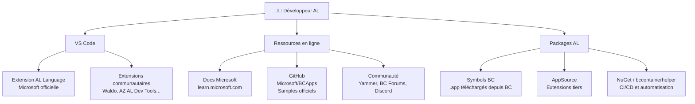
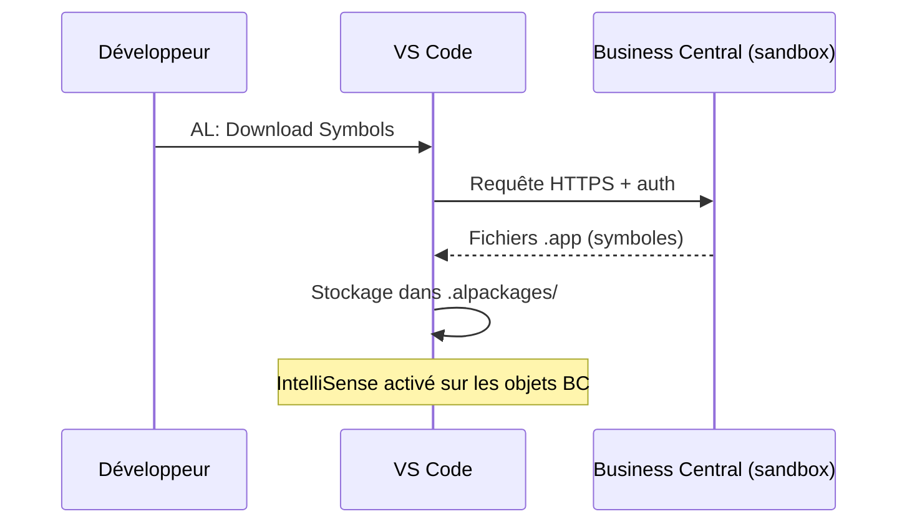

# Tooling communautaire & écosystème développeur AL

## Objectifs pédagogiques

À l'issue de ce module, tu seras capable de :

1. **Identifier** les outils incontournables de l'écosystème AL et leur rôle respectif
2. **Naviguer** dans les ressources communautaires pour trouver une réponse technique rapidement
3. **Distinguer** les sources officielles Microsoft des contributions communautaires
4. **Choisir** les extensions VS Code pertinentes pour un setup AL efficace
5. **Repérer** où chercher un package AL, un snippet ou un exemple de code en situation réelle

---

## Mise en situation

Tu viens d'installer ton environnement AL. VS Code s'ouvre, le fichier `app.json` est là, tu regardes le curseur clignoter dans un fichier `.al` vide — et tu réalises que tu ne sais pas exactement *par où commencer*.

C'est le moment où beaucoup de juniors font l'erreur classique : ils partent directement dans la documentation officielle Microsoft, se perdent dans 400 pages de référence, et abandonnent au bout de deux heures.

Ce module ne t'apprend pas à coder en AL. Il t'apprend à **orienter ton radar** : quels outils existent, qui les maintient, où la communauté vit, comment les développeurs AL expérimentés travaillent vraiment. En clair — le lay of the land avant d'entrer dans le code.

---

## L'écosystème en un coup d'œil

Avant d'aller dans le détail, voici comment les différentes couches s'articulent :



Ce schéma n'est pas exhaustif, mais il reflète la réalité quotidienne : Microsoft fournit le socle, la communauté enrichit, et toi tu assembles.

---

## VS Code comme point central

Tu as déjà VS Code installé avec l'extension AL Language de Microsoft. Ce que tu ne sais peut-être pas encore, c'est que cette extension seule est le **minimum viable** — pas le setup d'un développeur AL expérimenté.

### Ce que fait l'extension AL Language officielle

Elle est maintenue par Microsoft et c'est elle qui donne à VS Code la compréhension du langage : coloration syntaxique, IntelliSense, compilation, déploiement vers BC. Sans elle, rien ne fonctionne. C'est le fondement — pas discutable.

Mais elle reste volontairement sobre. Microsoft ne livre pas un IDE complet. C'est là qu'intervient la communauté.

### Les extensions communautaires qui font vraiment la différence

La communauté AL a produit des extensions VS Code qui comblent des lacunes réelles. Voici les plus utilisées en production :

| Extension | Auteur | Ce qu'elle apporte concrètement |
|---|---|---|
| **AZ AL Dev Tools / AL Object Designer** | Andreas Zwernemann | Visualisation des objets, refactoring, snippets avancés |
| **Waldo's CRS AL Language Extension** | Waldo (Eric Wauters) | Renommage automatique des fichiers selon convention, snippets, outils de productivité |
| **AL Variable Helper** | Nikola Kukrika | Aide à la déclaration de variables : auto-complétion du type depuis l'usage |
| **AL CodeActions** | Équipe communautaire | Corrections rapides : extract variable, fix casing, ajouter `begin/end`... |
| **XLIFF Sync** | Communauté | Synchronisation des fichiers de traduction AL (`.xlf`) |
| **Git Lens** | GitKraken | Pas spécifique AL mais utilisé partout pour l'historique Git en inline |

💡 **Astuce** — Waldo's extension en particulier est quasi-universelle dans les équipes AL. Elle impose une convention de nommage des fichiers (ex : `Codeunit 50100 MyCodeunit.al`) qui évite les conflits dans les projets multi-développeurs. On en reparlera quand on abordera les conventions de code.

⚠️ **Erreur fréquente** — Installer 15 extensions d'un coup "au cas où". Chaque extension active ralentit VS Code et peut créer des conflits. Commence avec AL Language + Waldo's CRS, puis ajoute au besoin.

---

## Les packages AL et les symboles BC

Un point qui déroute souvent les débutants : quand tu développes une extension AL, ton code *référence* des objets qui existent dans Business Central (tables, pages, codeunits standards). Mais ton VS Code local ne connaît pas ces objets par magie.

Ces références sont résolues grâce aux **symboles** — des fichiers `.app` compilés qui contiennent les métadonnées des objets BC standard. Tu les télécharges depuis ton environnement BC via la commande `AL: Download Symbols` dans VS Code.

> C'est un peu comme les headers en C : tu n'as pas le code source de BC, mais tu as les signatures de tout ce qui est exposé.

Le fichier `app.json` de ton projet déclare les dépendances, et AL Language les résout en cherchant dans le dossier `.alpackages/` à la racine du projet. Si un symbole manque, l'IntelliSense ne fonctionne pas sur les objets concernés.



🧠 **Concept clé** — Les symboles ne sont pas universels : ils correspondent à une **version précise** de BC. Un projet ciblant BC 23 doit avoir les symboles de BC 23. C'est pour ça que les symboles ne sont pas versionnés dans Git (ils se re-téléchargent) et que le `.gitignore` standard AL les exclut.

---

## Les ressources officielles Microsoft

### learn.microsoft.com — la documentation de référence

C'est l'endroit officiel. La documentation AL y est complète, à jour, et souvent bien faite. Mais attention : elle est dense et suppose parfois des connaissances préalables. Pour un débutant, elle est meilleure comme référence que comme tutoriel linéaire.

Les sections les plus utiles au quotidien :

- **AL development** → référence du langage, liste des objets AL, mots-clés
- **Business Central developer docs** → API, intégration, déploiement, gestion des extensions
- **What's new** → sorties de version BC, changements d'API, dépréciations

### GitHub microsoft/BCApps

Microsoft a rendu public le code source des applications BC standard sur GitHub. C'est une mine d'or pour deux raisons :

1. Tu peux lire *comment* Microsoft code ses propres objets — les patterns, les nommages, les patterns d'EventSubscriber, etc.
2. Tu peux ouvrir des issues ou suivre les évolutions du produit.

Le repo s'appelle `microsoft/BCApps` — il remplace l'ancien repo `microsoft/ALAppExtensions` qui contenait les apps additionnelles. Les deux sont utiles.

💡 **Astuce** — Avant d'implémenter quelque chose de complexe (ex : un workflow d'approbation, une intégration API), cherche d'abord si BC standard le fait quelque part. Lire le code officiel t'économise des heures et t'aligne sur les patterns attendus.

---

## La communauté AL : où elle vit

La communauté des développeurs AL est petite mais très active, et elle a ses canaux bien à elle.

### Yammer / Microsoft Tech Community

Le forum officiel Microsoft Dynamics 365 Business Central sur `community.dynamics.com` est l'endroit où poser des questions techniques avec l'espoir d'une réponse de quelqu'un chez Microsoft ou d'un MVP. Le rapport signal/bruit est correct, les archives sont cherchables.

### Blogs de référence

Plusieurs développeurs AL publient régulièrement du contenu de haute qualité :

| Auteur | Handle / Blog | Pourquoi le suivre |
|---|---|---|
| **Waldo** (Eric Wauters) | `waldo.be` / `@waldo1979` | Outils, best practices, évolutions AL |
| **Vjeko Babic** | `vjeko.com` | Architecture, patterns avancés, réflexions métier |
| **Tobias Fenster** | `tobiasfenster.io` | Conteneurs BC, bccontainerhelper, DevOps |
| **Freddy Kristiansen** | GitHub / blogs MS | Créateur de bccontainerhelper, tooling Docker/BC |
| **Stefano Demiliani** | `demiliani.com` | Intégrations, extensions AppSource, cloud |

Ces noms reviennent souvent dans la communauté. Pas besoin de tout lire maintenant, mais retenir que ces ressources existent.

### Discord et Slack

Il existe des serveurs Discord non officiels pour développeurs BC/AL. Ils sont moins formels que les forums, plus réactifs pour les questions rapides. Un search "Business Central developer Discord" te trouvera les plus actifs.

⚠️ **Erreur fréquente** — Prendre les réponses Discord ou Stack Overflow comme vérité absolue sur les questions de comportement BC. Pour tout ce qui touche au comportement des objets standard ou aux limites plateforme, la documentation officielle prime toujours.

---

## bccontainerhelper : l'outil DevOps de la communauté

C'est un module PowerShell open source maintenu par Freddy Kristiansen (Microsoft). Son rôle : faciliter l'orchestration des conteneurs BC pour le développement et les tests automatisés.

Tu n'en as pas besoin tout de suite pour débuter. Mais il faut le connaître parce que :

- Presque tous les pipelines CI/CD AL l'utilisent
- Les scripts de compilation/test des projets professionnels le référencent
- Les tutoriels DevOps AL supposent souvent qu'il est installé

```powershell
# Installation du module (PowerShell)
Install-Module bccontainerhelper -Force
```

Il expose des commandes comme `New-BcContainer`, `Compile-AppInBcContainer`, `Run-TestsInBcContainer`... qui abstraient Docker + BC en une interface cohérente. On l'abordera sérieusement dans les modules DevOps — mais ne sois pas surpris si tu le croises avant.

---

## Ce que les équipes AL utilisent vraiment

En projet réel, un développeur AL travaille typiquement avec :

```
VS Code
  ├── AL Language (Microsoft)
  ├── Waldo's CRS AL Language Extension
  ├── AZ AL Dev Tools
  └── GitLens

Git + GitHub / Azure DevOps
  └── Pour le versioning et les PRs

Pipeline CI/CD (Azure Pipelines ou GitHub Actions)
  └── bccontainerhelper en coulisses

Documentation de référence
  ├── learn.microsoft.com (AL reference)
  └── microsoft/BCApps (code source BC)
```

Ce n'est pas un stack lourd. La force d'AL est d'être simple à démarrer — mais il faut savoir où regarder quand quelque chose ne fonctionne pas.

---

## Cas réel en entreprise

**Contexte** : Une équipe de 3 développeurs AL chez un intégrateur démarre un nouveau projet de développement d'extension pour un client dans le secteur distribution. Le projet dure 6 mois, BC SaaS, pipeline Azure DevOps en place.

**Ce que l'équipe utilise au quotidien** :

- Waldo's extension pour garantir que tous les fichiers respectent la même convention de nommage (évite les conflits Git sur les noms de fichiers)
- `microsoft/BCApps` en référence pour comprendre comment les modules standard Achats/Ventes traitent certains flux — et brancher des EventSubscribers au bon endroit
- `learn.microsoft.com` pour vérifier les signatures exactes des méthodes et les changements de version
- Le blog de Vjeko pour trouver des patterns d'architecture quand une fonctionnalité commence à devenir complexe
- bccontainerhelper dans le pipeline pour compiler et lancer les tests automatiquement à chaque PR

**Ce que ça change concrètement** : Les trois développeurs ont le même setup, la même convention de fichiers, le même comportement d'IntelliSense. Quand l'un pousse du code, le pipeline détecte immédiatement si quelque chose casse — avant que le client ne le voie.

---

## Bonnes pratiques

1. **Synchronise tes symboles après chaque mise à jour BC.** Un environnement sandbox mis à jour sans re-téléchargement des symboles te donnera des faux positifs à la compilation.

2. **Mets `.alpackages/` dans ton `.gitignore`.** Ces fichiers font plusieurs dizaines de mégaoctets et se re-téléchargent en une commande. Les versionner pollue le repo inutilement.

3. **Avant de poser une question sur un forum, cherche d'abord dans `microsoft/BCApps`.** La réponse s'y trouve souvent sous forme de code fonctionnel plutôt que d'explication théorique.

4. **Installe les extensions VS Code en équipe de façon cohérente.** Un fichier `.vscode/extensions.json` dans le repo permet de recommander automatiquement les extensions à l'ouverture du projet — utilise-le.

5. **Distingue "pas documenté" et "non supporté".** Certains comportements BC ne sont pas dans les docs mais sont utilisés par la communauté. Ça ne signifie pas qu'ils sont stables entre versions.

6. **Suis les "What's New" de chaque release BC.** Business Central sort deux fois par an. Les dépréciations AL y sont annoncées et tu as généralement un cycle de grâce — mais seulement si tu les vois à temps.

---

## Résumé

L'écosystème AL repose sur une base Microsoft (extension VS Code, documentation learn.microsoft.com, repo BCApps) enrichie par une communauté active mais concentrée. En pratique, quelques extensions VS Code clés — dont Waldo's CRS en tête — transforment l'expérience de développement quotidienne. Les symboles BC sont le mécanisme qui permet à ton IDE de "voir" les objets standard de Business Central, et ils doivent être resynchronisés régulièrement. Pour le CI/CD, bccontainerhelper est l'outil de facto même si tu n'en as pas encore besoin. Maintenant que tu sais où se trouvent les outils et les ressources, le module suivant plonge dans le langage lui-même : syntaxe, types, structures de base d'AL.

---

<!-- snippet
id: al_symbols_download
type: command
tech: AL
level: beginner
importance: high
tags: al, vscode, symboles, intellisense, businesscentral
title: Télécharger les symboles BC depuis VS Code
context: À exécuter après avoir ouvert un projet AL dans VS Code et configuré le launch.json avec un environnement BC accessible
command: Ctrl+Shift+P → "AL: Download Symbols"
example: Ctrl+Shift+P → AL: Download Symbols → sélectionner l'environnement sandbox → les .app apparaissent dans .alpackages/
description: Télécharge les métadonnées des objets BC standard dans .alpackages/ — sans ça, IntelliSense ne reconnaît pas les tables, pages et codeunits BC
-->

<!-- snippet
id: al_alpackages_gitignore
type: tip
tech: AL
level: beginner
importance: high
tags: al, git, gitignore, alpackages, setup
title: Exclure .alpackages/ du versioning Git
content: Ajoute `.alpackages/` dans ton `.gitignore`. Ces fichiers font 50–200 Mo et se régénèrent avec "AL: Download Symbols". Les versionner surcharge le repo et crée des conflits inutiles entre versions BC.
description: .alpackages/ contient les symboles BC compilés — ils se re-téléchargent en une commande, ne les committe jamais
-->

<!-- snippet
id: al_symbols_version_mismatch
type: warning
tech: AL
level: beginner
importance: high
tags: al, symboles, version, erreur, businesscentral
title: Resynchroniser les symboles après mise à jour BC
content: Piège : BC sandbox mis à jour → tu continues avec les anciens symboles → erreurs de compilation sur des objets qui ont changé ou des méthodes dépréciées. Correction : relance "AL: Download Symbols" à chaque mise à jour de l'environnement BC cible.
description: Les symboles sont liés à une version précise de BC — un environnement mis à jour sans re-download provoque des faux positifs à la compilation
-->

<!-- snippet
id: al_waldo_extension
type: tip
tech: AL
level: beginner
importance: high
tags: al, vscode, extensions, waldo, conventions
title: Waldo's CRS Extension — nommage automatique des fichiers AL
content: Installe "Waldo's CRS AL Language Extension" dans VS Code. Elle renomme automatiquement les fichiers selon la convention `ObjectType ObjectId ObjectName.al` (ex: `Codeunit 50100 MyCodeunit.al`) à la sauvegarde. Indispensable en équipe pour éviter les conflits Git sur les noms de fichiers.
description: Convention de nommage AL automatisée — quasi-universelle dans les équipes AL professionnelles, évite les conflits de merge sur les fichiers
-->

<!-- snippet
id: al_extensions_json_vscode
type: tip
tech: AL
level: beginner
importance: medium
tags: al, vscode, extensions, équipe, setup
title: Partager les extensions VS Code recommandées dans le repo
content: Crée `.vscode/extensions.json` avec la liste des extensions recommandées (AL Language, Waldo's CRS, AZ AL Dev Tools). VS Code proposera automatiquement leur installation à tout nouveau développeur qui ouvre le projet.
description: Un fichier extensions.json dans .vscode/ standardise le setup VS Code de toute l'équipe sans intervention manuelle
-->

<!-- snippet
id: al_bccontainerhelper_install
type: command
tech: AL
level: beginner
importance: medium
tags: al, powershell, bccontainerhelper, devops, ci-cd
title: Installer bccontainerhelper (PowerShell)
command: Install-Module bccontainerhelper -Force
description: Module PowerShell open source pour orchestrer les conteneurs BC — socle de presque tous les pipelines CI/CD AL (compilation, tests automatisés)
-->

<!-- snippet
id: al_bcapps_github
type: tip
tech: AL
level: beginner
importance: medium
tags: al, github, microsoft, code-source, patterns
title: Lire le code source BC standard sur GitHub
content: Repo `microsoft/BCApps` sur GitHub contient le code source des applications BC standard. Avant d'implémenter un workflow complexe (approbation, intégration API...), cherche comment BC le fait nativement — tu trouveras les bons EventSubscribers et les patterns attendus.
description: microsoft/BCApps permet de lire comment Microsoft code BC standard — source de vérité pour les patterns AL et les points d'extension
-->

<!-- snippet
id: al_docs_whatsnew
type: tip
tech: AL
level: beginner
importance: medium
tags: al, documentation, version, dépréciations, businesscentral
title: Consulter les What's New à chaque release BC
content: BC sort 2 mises à jour majeures par an. La section "What's New for developers" sur learn.microsoft.com liste les nouvelles API, les changements de comportement et les dépréciations AL avec leur date de retrait. Consulte-la systématiquement — tu as généralement 1 cycle de grâce pour adapter ton code.
description: Les dépréciations AL sont annoncées dans les What's New BC — les rater expose à des ruptures de compilation lors des mises à jour automatiques SaaS
-->
