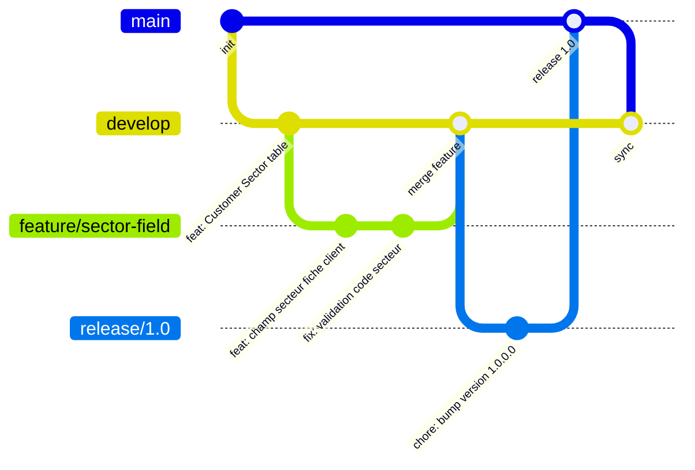

# Git et organisation projet AL

## Objectifs pédagogiques

À l'issue de ce module, vous serez capable de :

- Créer et organiser la structure d'un projet AL depuis zéro dans VS Code
- Comprendre le rôle de chaque fichier de configuration (`app.json`, `.vscode/launch.json`)
- Initialiser un dépôt Git adapté au développement AL et configurer un `.gitignore` pertinent
- Appliquer une stratégie de branches simple mais réaliste pour un projet Business Central
- Travailler en équipe sur une extension sans écraser le travail des autres

---

## Mise en situation

Vous venez de rejoindre une petite équipe de deux développeurs chez un intégrateur BC. Votre mission : ajouter un champ personnalisé sur la fiche client pour suivre un code secteur interne. Simple en apparence.

Sauf que… personne n'a de dépôt Git. Les fichiers sont synchronisés via OneDrive. Il y a un dossier `Projet_AL_FINAL_v2_VRAI.zip` sur le bureau d'un collègue. Et la dernière fois que deux personnes ont travaillé en même temps, une modification a écrasé l'autre.

C'est exactement le genre de situation où une organisation rigoureuse fait la différence entre un projet maîtrisé et un enfer de fichiers. Git, combiné à une structure de projet AL claire, vous sort de là — à condition de le mettre en place dès le début.

---

## Pourquoi Git est différent dans un projet AL

Dans un projet web ou backend classique, Git gère essentiellement du code source. Dans un projet AL, Git gère du code source **plus** des métadonnées qui pilotent le comportement du compilateur et du déploiement. Oublier de versionner `app.json` correctement, ou committer les mauvais fichiers de cache, peut silencieusement casser la compilation d'un collègue.

Un autre point souvent négligé : le compilateur AL (`alc`) génère des artefacts binaires (`.app`) qu'on ne versionne jamais — exactement comme on ne committe pas un `.jar` ou un binaire compilé. Mais les dépendances téléchargées localement (les symboles), elles, peuvent peser plusieurs centaines de Mo. Mal configuré, votre dépôt explose en taille dès le premier `git add .`.

Autrement dit, un bon `.gitignore` dans un projet AL n'est pas une formalité — c'est une nécessité.

---

## La structure d'un projet AL

### Ce que VS Code génère automatiquement

Quand vous créez un nouveau projet AL via la commande `AL: Go!` dans VS Code (avec l'extension AL Language installée), vous obtenez cette structure minimale :

```
MonExtension/
├── .alpackages/          ← symboles téléchargés (dépendances compilées)
├── .vscode/
│   └── launch.json       ← connexion à l'environnement BC cible
├── app.json              ← identité et métadonnées de l'extension
├── HelloWorld.al         ← fichier exemple généré
```

C'est le strict minimum pour compiler. En pratique, un projet réel est organisé en sous-dossiers fonctionnels.

### Structure recommandée pour un projet réel

Il n'existe pas de structure officielle imposée par Microsoft, mais une convention s'est établie dans la communauté AL :

```
MonExtension/
├── .alpackages/
├── .vscode/
│   ├── launch.json
│   └── settings.json
├── src/
│   ├── table/
│   │   └── Tab50100.CustomerSector.al
│   ├── tableextension/
│   │   └── TabExt50100.CustomerExt.al
│   ├── page/
│   │   └── Pag50100.SectorList.al
│   ├── pageextension/
│   │   └── PagExt50100.CustomerCardExt.al
│   ├── codeunit/
│   │   └── Cod50100.SectorMgt.al
│   └── enum/
│       └── Enu50100.SectorType.al
├── test/
│   └── Cod50200.CustomerSectorTest.al
├── translations/
│   └── MonExtension.fr-FR.xlf
├── app.json
├── .gitignore
└── README.md
```

🧠 **Concept clé** — La convention de nommage `Tab`, `PagExt`, `Cod`... devant le numéro d'objet est un standard communautaire. Elle rend immédiatement lisible le type d'objet AL sans ouvrir le fichier.

---

## Le fichier `app.json` — l'identité de votre extension

C'est le fichier le plus important du projet. Il dit au compilateur qui vous êtes, ce dont vous dépendez, et comment vous vous déployez.

```json
{
  "id": "a1b2c3d4-e5f6-7890-abcd-ef1234567890",
  "name": "Customer Sector Extension",
  "publisher": "MonIntegrateur",
  "version": "1.0.0.0",
  "brief": "Ajoute le suivi du secteur client",
  "description": "",
  "privacyStatement": "",
  "EULA": "",
  "help": "",
  "url": "",
  "logo": "",
  "dependencies": [
    {
      "id": "63ca2fa4-4f03-4f2b-a480-172fef340d3f",
      "name": "System Application",
      "publisher": "Microsoft",
      "version": "22.0.0.0"
    }
  ],
  "screenshots": [],
  "platform": "22.0.0.0",
  "application": "22.0.0.0",
  "idRanges": [
    { "from": 50100, "to": 50149 }
  ],
  "runtime": "12.0",
  "features": []
}
```

Quelques champs à bien comprendre :

- **`id`** : GUID unique de votre extension. Il est généré une seule fois à la création du projet — ne le changez jamais après un premier déploiement.
- **`version`** : format `Major.Minor.Build.Revision`. BC s'appuie sur ce numéro pour gérer les mises à jour. Un numéro de version inférieur ou égal à l'extension déjà installée empêche le déploiement.
- **`idRanges`** : la plage d'IDs que vous pouvez utiliser pour vos objets. En SaaS/AppSource, Microsoft alloue des plages officielles. En projet intégrateur, utilisez la plage 50000-99999 (réservée aux personnalisations).
- **`platform` / `application`** : la version minimale de BC requise. Un fichier mal aligné avec votre environnement de dev → erreur de compilation immédiate.

⚠️ **Erreur fréquente** — Committer le `app.json` avec un `id` GUID que vous avez copié d'un autre projet. Deux extensions avec le même GUID ne peuvent pas coexister dans le même tenant BC — elles entrent en conflit lors du déploiement.

---

## Le fichier `launch.json` — se connecter à BC

Ce fichier indique à VS Code où déployer et déboguer votre extension. Il contient les infos de connexion à votre sandbox ou environnement OnPrem.

```json
{
  "version": "0.2.0",
  "configurations": [
    {
      "type": "al",
      "request": "launch",
      "name": "Sandbox - DEV",
      "environmentType": "Sandbox",
      "environmentName": "Sandbox-Dev",
      "tenant": "votre-tenant-id.onmicrosoft.com",
      "authentication": "UserPassword",
      "startupObjectId": 22,
      "startupObjectType": "Page",
      "breakOnError": "All",
      "launchBrowser": true
    }
  ]
}
```

💡 **Astuce** — Vous pouvez définir plusieurs configurations dans le même `launch.json` : une pour votre sandbox de développement, une pour un environnement de test client. Dans VS Code, une liste déroulante vous permet de choisir la cible au moment du déploiement.

**Ce fichier ne doit jamais être commité tel quel.** Il contient potentiellement des identifiants de tenant, des mots de passe, ou des URLs d'environnements propres à chaque développeur. Chaque personne de l'équipe aura son propre `launch.json` local.

---

## Configurer Git pour un projet AL

### Le `.gitignore` indispensable

```gitignore
# Artefacts de compilation
*.app

# Symboles AL téléchargés localement (peuvent peser 200-500 Mo)
.alpackages/

# Configuration locale VS Code (connexion BC personnelle)
.vscode/launch.json

# Cache AL Language Extension
.altestrunner/
.alcache/

# Fichiers système
.DS_Store
Thumbs.db

# Packages de test
*.flf
*.bclicense
```

La logique est simple : on ne commite que ce qui est nécessaire pour qu'un autre développeur puisse **reconstruire** le projet. Les binaires compilés se régénèrent, les symboles se téléchargent, les configurations locales sont personnelles.

🧠 **Concept clé** — `.vscode/settings.json` peut être commité (il contient des préférences partagées par l'équipe comme le formatteur), mais `.vscode/launch.json` ne le doit pas. La distinction est importante.

### Initialiser le dépôt

```bash
# Dans le dossier de votre projet AL
git init
git add .gitignore
git commit -m "chore: initialisation projet AL"

# Ajouter les fichiers du projet (après avoir vérifié le .gitignore)
git add app.json README.md src/ translations/
git commit -m "feat: structure initiale extension Customer Sector"

# Connecter au dépôt distant (Azure DevOps, GitHub...)
git remote add origin <URL_DU_DEPOT>
git push -u origin main
```

---

## Stratégie de branches pour un projet AL

Un projet AL intégrateur standard n'a pas besoin d'une stratégie Git-flow complète. Ce qui suit est pragmatique et fonctionne bien pour une équipe de 2 à 5 développeurs.



| Branche | Rôle | Qui y travaille |
|---|---|---|
| `main` | Code déployé en production, toujours stable | Personne directement |
| `develop` | Intégration en cours, déploiement sandbox | Merge des features |
| `feature/<nom>` | Développement d'une fonctionnalité isolée | Un développeur |
| `release/<version>` | Préparation d'une livraison (bump version, QA finale) | Lead dev / consultant |
| `hotfix/<nom>` | Correctif urgent sur production | Lead dev uniquement |

💡 **Astuce** — Le nom de branche `feature/sector-field` correspond directement à un ticket ou une user story. C'est une habitude simple qui rend le suivi du travail immédiat, sans avoir besoin d'ouvrir le gestionnaire de projet.

---

## Travailler en équipe sans se marcher dessus

La collision la plus fréquente dans un projet AL en équipe ne se passe pas dans le code — elle se passe dans `app.json`. Si deux développeurs modifient la version ou les dépendances en même temps, le merge devient délicat.

Quelques règles qui évitent 80% des conflits :

**1. Un développeur = une feature branch.** Ne jamais travailler à deux sur la même branche sans coordination explicite. Si deux personnes doivent collaborer sur une feature, désigner un "propriétaire" de la branche.

**2. Bumper la version uniquement sur la branche `release/`.** Si chacun incrémente `version` dans `app.json` sur sa feature branch, vous aurez des conflits à chaque merge. La version se gère une seule fois, au moment de la livraison.

**3. Segmenter les plages d'IDs par développeur.** Si votre plage est 50100-50149, le développeur A prend 50100-50124, le B prend 50125-50149. Ça évite les conflits d'IDs d'objets et les erreurs de compilation croisées.

**4. Toujours `git pull --rebase` avant de commencer à coder.** Ça évite les commits de merge inutiles qui polluent l'historique.

⚠️ **Erreur fréquente** — Travailler directement sur `develop` quand on est pressé. Résultat : un code instable bloque tout le monde lors du prochain déploiement sandbox. La feature branch coûte 30 secondes à créer et évite ce problème.

---

## Conventions de commit pour un projet AL

Un historique Git lisible est un outil de diagnostic. Quand vous cherchez quand un bug a été introduit, un `git log` propre vous fait gagner une heure.

La convention [Conventional Commits](https://www.conventionalcommits.org/) est simple et efficace :

```
<type>(<scope>): <description courte>

[corps optionnel]

[footer optionnel : lien ticket, breaking change]
```

| Type | Usage dans un projet AL |
|---|---|
| `feat` | Ajout d'un objet AL ou d'une fonctionnalité |
| `fix` | Correction d'un bug dans le code AL |
| `chore` | Modification de `app.json`, `.gitignore`, outillage |
| `refactor` | Réorganisation du code sans changement de comportement |
| `test` | Ajout ou modification de tests AL |
| `docs` | Documentation, README, commentaires |

Exemples concrets :

```bash
git commit -m "feat(customer): ajout champ Code Secteur sur fiche client"
git commit -m "fix(validation): correction erreur si code secteur vide"
git commit -m "chore: bump version 1.0.1.0 pour release hotfix"
git commit -m "refactor(codeunit): extraction logique validation vers SectorMgt"
```

---

## Cas réel en entreprise

**Contexte** : Un intégrateur BC gère 3 projets clients en parallèle. L'équipe comprend un lead dev et deux développeurs juniors. Chaque client a son tenant BC SaaS avec un environnement sandbox et un environnement de production.

**Avant la mise en place de Git** : Les fichiers `.al` étaient copiés par FTP sur un serveur partagé. Chaque déploiement consistait à reconstruire l'extension manuellement depuis le poste du lead dev. Un junior avait une fois écrasé une semaine de travail.

**Après mise en place** :

1. Un dépôt Azure DevOps par client, accès restreint par équipe
2. Branch `develop` connectée à un pipeline CI/CD basique (AL compiler check automatique)
3. Déploiement sandbox déclenché manuellement depuis `develop`
4. Déploiement production uniquement depuis `main` après validation

**Résultat mesurable** : zéro perte de code depuis 8 mois. Les juniors peuvent coder en autonomie sans risque de casser la production. Le lead dev passe moins de temps à "déboguer les commits" et plus de temps à reviewer le code.

---

## Bonnes pratiques

**Ne jamais commiter `.alpackages/`** — Ces dossiers contiennent les symboles compilés de la plateforme BC, téléchargeables à la demande via `AL: Download Symbols`. Les commiter ferait gonfler le dépôt de plusieurs centaines de Mo pour zéro valeur ajoutée.

**Versionner `app.json` avec attention** — C'est le fichier le plus critique du projet. Un GUID changé = extension incompatible avec l'installation existante. Une version mal incrémentée = déploiement refusé par BC.

**Créer un `README.md` minimal dès le début** — Indiquez la version BC cible, comment télécharger les symboles, comment lancer la première compilation. Votre futur collègue (ou vous dans 6 mois) vous remerciera.

**Un objet AL = un fichier** — Ne jamais mettre plusieurs objets AL dans le même fichier. VS Code et `alc` le tolèrent, mais ça rend la navigation et les diffs Git impossibles à lire.

**Tagger les releases dans Git** — Quand vous deployez une version en production, créer un tag Git : `git tag v1.0.0.0`. Si un bug apparaît trois mois plus tard, vous pouvez comparer le code de production exact avec l'état actuel.

**Protéger la branche `main`** — Sur Azure DevOps ou GitHub, configurer une règle de protection : aucun push direct, pull request obligatoire, au moins une review requise. C'est gratuit à configurer et ça évite les accidents.

---

## Résumé

Organiser un projet AL dans Git, c'est poser les fondations qui vous éviteront des heures de débogage de situation, pas de code. La structure de dossiers `src/` par type d'objet, le `.gitignore` qui exclut les artefacts et symboles, le `launch.json` gardé local, et une stratégie de branches simple (`main` / `develop` / `feature/*`) — ces quatre éléments couvrent 90% des besoins d'une équipe d'intégration BC.

Le fichier `app.json` est le cœur de votre extension : son GUID, sa version et ses dépendances doivent être gérés avec soin et never modifiés à la légère. Les conventions de commit transforment votre historique Git d'un journal de sauvegarde en un vrai outil de traçabilité.

La prochaine étape — l'architecture des extensions BC — s'appuie directement sur cette organisation : quand vous comprendrez comment BC charge et isole les extensions, vous saurez exactement pourquoi la structure de fichiers et la gestion des dépendances dans `app.json` ont autant d'importance.

---

<!-- snippet
id: al_git_gitignore_alpackages
type: warning
tech: git
level: beginner
importance: high
tags: git, al, gitignore, alpackages, symbols
title: Ne jamais commiter .alpackages dans un projet AL
content: Le dossier .alpackages contient les symboles BC téléchargés localement (200-500 Mo). Si absent du .gitignore, un simple `git add .` fait exploser la taille du dépôt. Ces fichiers se régénèrent via `AL: Download Symbols` dans VS Code — ils n'ont aucune valeur à versionner.
description: Piège classique sur le premier projet AL : oublier .alpackages dans le .gitignore et commiter des centaines de Mo de symboles binaires.
-->

<!-- snippet
id: al_git_apijson_guid
type: warning
tech: al
level: beginner
importance: high
tags: al, app.json, guid, extension, deployment
title: Ne jamais copier le GUID d'une autre extension dans app.json
content: Le champ `id` dans app.json est un GUID unique généré à la création du projet. Deux extensions avec le même GUID ne peuvent pas coexister dans un tenant BC — le déploiement échoue ou l'une écrase l'autre. Le GUID est généré une seule fois et ne change jamais ensuite.
description: Copier un app.json existant sans régénérer le GUID provoque des conflits silencieux ou des échecs de déploiement en tenant BC.
-->

<!-- snippet
id: al_git_launch_json_ignore
type: tip
tech: git
level: beginner
importance: high
tags: git, al, launch.json, vscode, gitignore
title: Exclure launch.json du dépôt Git AL
content: Ajouter `.vscode/launch.json` au .gitignore mais pas `.vscode/settings.json`. Le launch.json contient la connexion à votre environnement BC personnel (tenant ID, sandbox). Le settings.json contient les préférences d'équipe (formatteur, linter) et doit être partagé.
description: Distinction critique : settings.json se commite, launch.json ne se commite pas — chaque dev a sa propre connexion BC.
-->

<!-- snippet
id: al_git_version_bump
type: warning
tech: al
level: beginner
importance: high
tags: al, app.json, version, deployment, release
title: Bumper la version app.json uniquement sur la branche release
content: Si chaque développeur incrémente `version` dans app.json sur sa feature branch, chaque merge produit un conflit. Convention : la version ne se modifie qu'une fois, sur la branche `release/<version>`, juste avant la livraison. Règle BC : version déployée ≥ version installée, sinon déploiement refusé.
description: Modifier la version sur une feature branch garantit des conflits de merge. Réserver cette opération à la branche release.
-->

<!-- snippet
id: al_git_object_naming
type: tip
tech: al
level: beginner
importance: medium
tags: al, naming, convention, fichier, objet
title: Convention de nommage des fichiers AL : un objet par fichier
content: Convention communautaire : `Tab50100.CustomerSector.al`, `PagExt50100.CustomerCardExt.al`. Préfixe = type d'objet (Tab, Pag, Cod, TabExt, PagExt, Enu...) + numéro + nom métier. Un seul objet AL par fichier. Les diffs Git deviennent lisibles et la navigation dans le projet est immédiate.
description: Un fichier = un objet AL. Le préfixe de type rend le contenu lisible sans ouvrir le fichier.
-->

<!-- snippet
id: al_git_idrange_conflict
type: tip
tech: al
level: beginner
importance: medium
tags: al, idrange, équipe, conflit, app.json
title: Segmenter les plages d'IDs AL par développeur en équipe
content: Si la plage est 50100-50149, attribuer des sous-plages : dev A → 50100-50124, dev B → 50125-50149. Évite les conflits d'IDs d'objets quand deux développeurs créent de nouveaux objets en parallèle. Se documente dans le README ou le wiki du projet.
description: Deux développeurs créant des objets AL sans coordination peuvent choisir le même ID — erreur de compilation croisée à la prochaine sync.
-->

<!-- snippet
id: al_git_commit_convention
type: tip
tech: git
level: beginner
importance: medium
tags: git, commit, convention, al, historique
title: Conventional Commits pour un projet AL
content: Format : `feat(customer): ajout champ Code Secteur sur fiche client`. Types utiles en AL : feat (nouvel objet/fonctionnalité), fix (correction bug AL), chore (app.json, outillage), refactor (réorg sans changement comportement), test (tests AL). Un historique propre = diagnostic rapide lors d'une régression.
description: Utiliser feat/fix/chore/refactor comme préfixe de commit rend l'historique Git exploitable comme outil de diagnostic.
-->

<!-- snippet
id: al_git_tag_release
type: tip
tech: git
level: beginner
importance: medium
tags: git, tag, release, al, production
title: Tagger chaque déploiement production en projet AL
content: Après chaque déploiement prod : `git tag v1.0.0.0 && git push origin v1.0.0.0`. Permet de comparer le code exact déployé avec l'état actuel via `git diff v1.0.0.0..HEAD`. Indispensable pour isoler l'introduction d'un bug signalé des semaines après la mise en prod.
description: Un tag Git par version déployée en production permet de retrouver l'état exact du code lors d'un bug signalé tardivement.
-->

<!-- snippet
id: al_git_gitignore_app
type: command
tech: git
level: beginner
importance: high
tags: git, al, gitignore, app, artefact
title: Contenu minimal .gitignore pour un projet AL
command: |
  *.app
  .alpackages/
  .vscode/launch.json
  .altestrunner/
  .alcache/
  .DS_Store
  Thumbs.db
description: Les .app sont des binaires compilés, les .alpackages sont des symboles téléchargeables — aucun des deux ne se commite dans un projet AL.
-->
