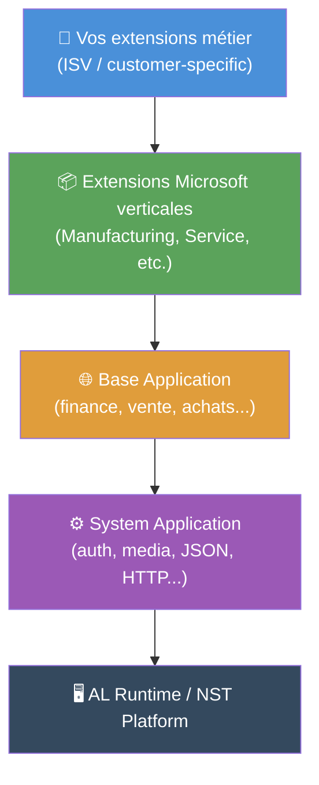
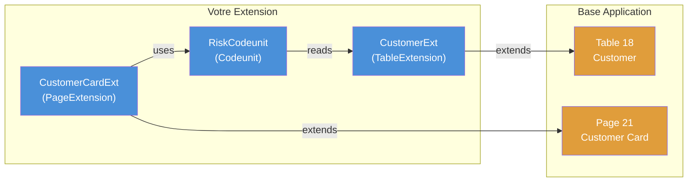
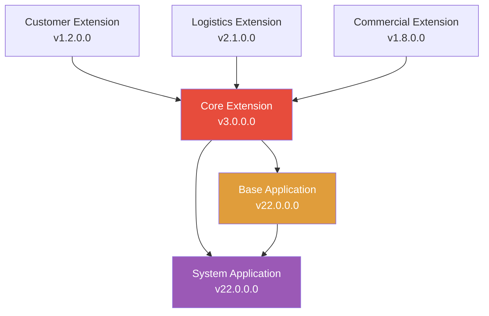

# Architecture des extensions Business Central

## Objectifs pédagogiques

À l'issue de ce module, vous serez capable de :

- Expliquer comment Business Central charge et isole les extensions à l'exécution
- Décrire la chaîne de dépendances entre extensions et identifier ses implications pratiques
- Distinguer les différents types d'objets AL et leur rôle dans l'architecture d'une extension
- Lire et interpréter un fichier `app.json` dans un contexte de projet réel
- Anticiper les contraintes d'architecture qui s'imposent dès la conception d'une extension

---

## Mise en situation

Vous rejoignez une équipe qui maintient un ensemble d'extensions pour un client dans le secteur distribution. Il y a une extension "core" qui centralise les données métier, deux extensions verticales (logistique, commercial), et une extension de reporting. Tout s'est bien passé pendant un an — jusqu'au jour où une mise à jour de l'extension core a cassé silencieusement l'extension logistique en production.

Personne ne comprend vraiment pourquoi. L'extension logistique s'installe sans erreur, mais elle expose un comportement incorrect. En creusant, on découvre que la version publiée de l'extension core a changé une signature interne, et que Business Central a résolu les dépendances avec une version incompatible sans lever d'erreur explicite.

Ce genre d'incident est la conséquence directe d'une mauvaise compréhension de l'architecture des extensions — et c'est précisément ce qu'on va démystifier ici.

---

## Pourquoi l'architecture des extensions n'est pas triviale

Business Central n'est pas un environnement de développement classique où vous déployez du code sur un serveur et c'est réglé. C'est une plateforme multi-tenant où plusieurs extensions coexistent dans le même tenant, parfois issues d'éditeurs différents, et où Microsoft met à jour la plateforme elle-même régulièrement.

Dans ce contexte, l'isolation, le versioning et les dépendances ne sont pas des détails — ce sont des contraintes architecturales fondamentales que votre code doit respecter dès le premier objet que vous créez.

Une extension AL n'est pas un "plugin" au sens classique du terme. C'est un package compilé, versionné, avec une identité unique (un GUID), des dépendances déclarées, et un contrat de compatibilité vis-à-vis de la plateforme. Comprendre ce mécanisme vous permettra d'éviter des pièges qui font perdre des heures en projet.

---

## Comment une extension s'organise sous le capot

### Le modèle de déploiement

Quand vous publiez une extension dans Business Central, elle est compilée en un fichier `.app` — un binaire signé qui contient l'ensemble des objets AL, les traductions, les ressources et les métadonnées. Ce fichier est uploadé dans le NST (Nav Service Tier) ou dans le cloud SaaS selon l'environnement.

À l'exécution, Business Central charge les extensions dans un espace isolé par tenant. Deux tenants distincts peuvent avoir des versions différentes d'une même extension — c'est toute la logique multi-tenant du SaaS.

🧠 **Concept clé** — L'extension ne "remplace" jamais le code standard Microsoft. Elle s'y superpose via un mécanisme d'extension d'objets. La base applicative (base app) reste intacte et versionée indépendamment.

### Les couches de la plateforme

L'architecture de BC repose sur trois couches empilées :



Chaque couche peut étendre la couche du dessous, mais jamais l'inverse. Votre extension métier peut étendre la Base Application — la Base Application ne sait rien de votre extension.

Ce n'est pas qu'une règle formelle : c'est ce qui permet à Microsoft de mettre à jour la plateforme sans casser vos extensions (en théorie — en pratique, c'est plus nuancé, et c'est là que la gestion des breaking changes entre en jeu).

---

## L'identité d'une extension : le fichier `app.json`

Tout part du `app.json`. C'est le manifeste de votre extension — il définit son identité, sa version, ses dépendances et ses compatibilités.

```json
{
  "id": "a3e5f1c2-7d4b-4e9a-b123-000000000001",
  "name": "Contoso Logistics",
  "publisher": "Contoso",
  "version": "2.1.0.0",
  "brief": "Extension logistique Contoso",
  "description": "",
  "privacyStatement": "",
  "EULA": "",
  "help": "",
  "url": "",
  "logo": "",
  "dependencies": [
    {
      "id": "a3e5f1c2-7d4b-4e9a-b123-000000000000",
      "name": "Contoso Core",
      "publisher": "Contoso",
      "version": "1.5.0.0"
    },
    {
      "id": "63ca2fa4-4f03-4f2b-a480-172fef340d3f",
      "name": "System Application",
      "publisher": "Microsoft",
      "version": "20.0.0.0"
    }
  ],
  "application": "22.0.0.0",
  "platform": "22.0.0.0",
  "runtime": "11.0",
  "target": "Cloud"
}
```

Quelques champs méritent une attention particulière :

| Champ | Rôle | Ce que ça change en pratique |
|---|---|---|
| `id` (GUID) | Identité unique de l'extension | Deux extensions avec le même GUID = conflit absolu |
| `version` | Version sémantique `major.minor.build.revision` | Détermine les règles de mise à jour et la compatibilité |
| `dependencies` | Liste des extensions dont dépend la vôtre | Version minimale requise — BC refusera d'installer si non satisfait |
| `application` | Version minimale de la Base App | Votre extension ne tournera pas sur un BC plus ancien |
| `runtime` | Version du compilateur AL attendue | Impacte les fonctionnalités disponibles en AL |
| `target` | `Cloud` ou `OnPrem` | Certaines API ne sont disponibles que dans un des deux modes |

⚠️ **Erreur fréquente** — Modifier le GUID d'une extension déjà déployée en production. Pour BC, c'est une extension complètement différente. Les données liées à l'ancienne extension ne seront plus accessibles via la nouvelle. Le GUID est définitif dès la première publication.

---

## Les types d'objets AL et leur rôle architectural

AL distingue deux grandes familles d'objets : les objets natifs que vous créez de zéro, et les objets d'extension que vous greffez sur des objets existants.

### Objets natifs

Ce sont des entités autonomes que votre extension apporte :

- **Table** — stocke des données en base. Chaque table crée physiquement une table SQL dans le tenant.
- **Page** — interface utilisateur (liste, fiche, FactBox...).
- **Codeunit** — logique métier pure, pas d'interface. C'est l'équivalent d'une classe de service.
- **Report** — génération de documents et exports.
- **Enum** — énumération typée, remplace les anciennes Options AL.
- **Query** — requête structurée sur plusieurs tables, optimisée pour la lecture.
- **XMLport** — import/export de données structurées (XML, CSV).
- **PermissionSet** — ensemble de droits applicatifs liés à votre extension.

### Objets d'extension

C'est là que réside toute la puissance du modèle AL — et l'essentiel de ce que vous ferez au quotidien :

- **TableExtension** — ajoute des champs à une table existante (standard ou tierce).
- **PageExtension** — modifie l'interface d'une page existante : ajouter des champs, des actions, changer la disposition.
- **EnumExtension** — ajoute des valeurs à un Enum existant.
- **ReportExtension** — modifie un report existant sans le réécrire.

🧠 **Concept clé** — Une TableExtension n'est pas une table séparée. Les champs qu'elle ajoute sont physiquement intégrés dans la table originale en base de données, dans une colonne de type `blob` compressé pour les extensions SaaS (table-per-extension ou inline selon la version). Quand vous désinstallez une extension, ces champs sont masqués mais les données restent — c'est important pour les migrations.



---

## La chaîne de dépendances et ses implications

Revenons au scénario d'introduction. Voici ce qui se passe réellement quand vous déclarez une dépendance dans `app.json` :

Business Central vérifie, au moment de l'installation, que la version déclarée est disponible dans le tenant. La version dans `app.json` est une version **minimale** — BC acceptera toute version supérieure ou égale. C'est un comportement en apparence raisonnable, mais qui crée un risque réel.

Si votre extension dépend de `Contoso Core >= 1.5.0.0` et que le client met à jour vers `Contoso Core 2.0.0.0` (qui contient des breaking changes), BC installera votre extension sans erreur. C'est votre code qui plantera à l'exécution, pas l'installation.

### Structure de dépendances typique en projet



L'extension `Core` est ici un point de défaillance unique. Une mise à jour non rétrocompatible de Core casse potentiellement tous ses dépendants.

💡 **Astuce** — En contexte multi-extension, établissez un contrat de stabilité pour les interfaces publiques de votre extension core : les codeunits et procédures exposées à d'autres extensions ne doivent pas changer de signature sans bump de version majeure et période de dépréciation. C'est exactement la même discipline qu'une API REST versionnée.

---

## Numérotation des objets : une contrainte structurante

Chaque objet AL (table, page, codeunit...) porte un identifiant numérique. Ce n'est pas optionnel — BC utilise ces IDs pour résoudre les références à l'exécution.

La plage d'IDs disponible dépend de votre contexte :

| Contexte | Plage recommandée | Note |
|---|---|---|
| Extensions partenaires non AppSource | 50 000 – 99 999 | Plage "libre" standard |
| Extensions AppSource (ISV) | Attribuée par Microsoft | Via le Partner Center, unique par publisher |
| Extensions clients purs (non publiées) | 50 000 – 99 999 | Éviter les collisions inter-extensions |
| Objets test/dev temporaires | 50 000+ | Ne jamais laisser en production |

⚠️ **Erreur fréquente** — Deux extensions installées dans le même tenant avec des IDs d'objets qui se chevauchent. BC lèvera une erreur d'installation. Sur un projet avec plusieurs extensions maison, documentez et réservez les plages d'IDs dès le départ — c'est une décision d'architecture qui ne se corrige pas facilement après coup.

---

## Construction en couches : d'une extension simple à un écosystème

### Version 1 — Une extension autonome

Structure minimale : quelques TableExtension, PageExtension, et un Codeunit de logique. Dépendances : uniquement Base App et System App. C'est le point de départ de 90% des projets.

```
my-extension/
├── app.json
├── src/
│   ├── tables/
│   │   └── CustomerExt.TableExt.al
│   ├── pages/
│   │   └── CustomerCardExt.PageExt.al
│   └── codeunits/
│       └── RiskManagement.Codeunit.al
└── .al-eslint/
```

### Version 2 — Séparation core / verticaux

Quand la logique métier grossit, on sépare : une extension "core" qui porte les tables, les enums et les interfaces stables — des extensions verticales qui s'appuient dessus. Avantage : on peut déployer une verticale sans toucher au core.

### Version 3 — Écosystème multi-extension en production

À ce stade, on gère activement les versions, on maintient un changelog par extension, et on utilise des interfaces AL (disponibles depuis BC 2020) pour découpler les extensions sans dépendance directe de code. On reviendra sur les patterns de communication inter-extension dans les modules sur les events et les interfaces.

---

## Cas réel en entreprise

Une société de négoce en pièces industrielles fait appel à un intégrateur pour migrer de NAV 2018 vers BC SaaS. Le projet démarre sans réflexion d'architecture : tout le code personnalisé est mis dans une seule et unique extension. Tables, pages, codeunits, intégrations API — tout dans le même `.app`.

Après 18 mois, l'extension fait 400+ objets. Chaque modification, même mineure, nécessite de republier l'intégralité. Une mise à jour de Business Central casse trois objets dont deux sont rarement utilisés — mais le client doit quand même valider une recette complète avant de pouvoir redéployer.

Le refactoring en 4 extensions distinctes (core data, finance customs, logistics, API integration) prend deux sprints complets. Après découpage, les mises à jour ne touchent que l'extension concernée. Le temps de recette tombe de 3 jours à quelques heures selon le périmètre impacté.

La leçon : l'architecture d'extension se décide en début de projet, pas après.

---

## Bonnes pratiques

**Figer le GUID dès le premier commit.** Une fois une extension déployée — même en sandbox — changer son GUID est une opération destructrice. Utilisez un UUID v4 généré proprement et commitez-le immédiatement.

**Déclarer les dépendances avec la version minimale réelle.** Ne mettez pas `1.0.0.0` par paresse si votre code utilise une API apparue en `1.3.0.0`. BC ne vous protégera pas — vous aurez une erreur runtime sur l'environnement client.

**Respecter la séparation des responsabilités dès le départ.** Une extension qui mélange gestion des données, logique métier et intégrations externes devient ingérable. Core data / Business logic / UI / Integrations est un découpage qui tient dans le temps.

**Réserver et documenter vos plages d'IDs.** Sur un projet multi-extension, tenez un tableau partagé des plages attribuées. Un conflit d'ID découvert en production coûte cher.

**Utiliser `target: Cloud` sauf besoin explicite OnPrem.** Le mode Cloud impose des restrictions (pas d'accès fichier direct, pas de DotNet interop non contrôlé) qui vous forcent à écrire du code portable. C'est une contrainte saine.

**Versionner en sémantique réelle.** `major.minor.build.revision` où major = breaking change, minor = nouvelle fonctionnalité rétrocompatible, build = correctif. Vos extensions dépendantes doivent pouvoir anticiper vos breaking changes.

**Lire le `app.json` comme un contrat.** Avant d'accepter une dépendance externe, vérifiez que l'extension dépendante est maintenue, versionnée proprement, et que son publisher respecte la compatibilité entre versions.

---

## Résumé

Une extension Business Central est un package compilé avec une identité fixe (GUID), une version sémantique et des dépendances déclarées. Elle s'insère dans une architecture en couches — plateforme → System App → Base App → vos extensions — sans jamais modifier le code standard. Les objets AL se divisent en objets natifs (Table, Page, Codeunit...) et en objets d'extension (TableExtension, PageExtension...) qui se greffent sur des objets existants sans les remplacer. La chaîne de dépendances entre extensions est le principal vecteur de risque en environnement multi-extension : une dépendance mal versionnée peut casser silencieusement à l'exécution. Ces contraintes — GUID, numéros d'objets, déclaration de version, target — ne sont pas des formalités administratives, ce sont les règles du contrat de déploiement que BC fait respecter. Le module suivant entrera dans la mécanique de communication entre extensions via les events et subscribers.

---

<!-- snippet
id: al_appjson_guid_immuable
type: warning
tech: al
level: intermediate
importance: high
tags: al, app-json, guid, extension, déploiement
title: GUID d'extension immuable après premier déploiement
content: Changer le GUID dans app.json d'une extension déjà déployée crée une nouvelle extension aux yeux de BC. L'ancienne reste installée, les données liées ne sont plus accessibles via la nouvelle. Piège → conséquence irréversible en production → correction : générer le GUID une seule fois et le committer immédiatement, même sur une sandbox.
description: Le GUID identifie l'extension de façon permanente — BC ne fait aucun lien entre deux GUIDs différents, même si le nom est identique
-->

<!-- snippet
id: al_dependency_version_minimale
type: warning
tech: al
level: intermediate
importance: high
tags: al, dependencies, app-json, versioning, runtime
title: La version de dépendance dans app.json est un minimum, pas un exact
content: BC accepte toute version >= à celle déclarée dans app.json. Si une dépendance publie une v2.0 avec breaking changes et que vous ciblez >= 1.5, BC installe votre extension sans erreur — mais elle plantera à l'exécution. Correction : suivre les changelogs de vos dépendances et bumper votre version minimale après validation.
description: BC ne détecte pas les incompatibilités de version supérieure — c'est votre responsabilité de valider la compatibilité avec chaque version publiée
-->

<!-- snippet
id: al_tableextension_donnees_persistees
type: concept
tech: al
level: intermediate
importance: high
tags: al, tableextension, base-de-données, désinstallation, données
title: Les champs d'une TableExtension restent en base après désinstallation
content: Une TableExtension intègre ses champs directement dans la table originale au niveau SQL. Quand l'extension est désinstallée, BC masque ces champs mais ne supprime pas les données. Une réinstallation les retrouve intacts. Conséquence : une migration de données doit anticiper ce comportement — les données ne disparaissent pas, elles sont juste inaccessibles via AL.
description: Désinstaller une extension ne détruit pas ses données en base — elles sont masquées et restent récupérables à la réinstallation
-->

<!-- snippet
id: al_plage_ids_objets
type: concept
tech: al
level: intermediate
importance: high
tags: al, numérotation, objets, conflit, architecture
title: Plage d'IDs objets AL : 50000–99999 pour extensions non AppSource
content: Chaque objet AL (Table, Page, Codeunit...) porte un ID numérique unique dans le tenant. La plage 50000–99999 est réservée aux extensions partenaires hors AppSource. Deux extensions dans le même tenant avec des IDs qui se chevauchent provoquent une erreur d'installation. Sur un projet multi-extension, documenter et réserver les plages dès le démarrage — impossible à corriger facilement après déploiement.
description: Les IDs d'objets doivent être uniques dans le tenant — tout chevauchement entre extensions bloque l'installation
-->

<!-- snippet
id: al_architecture_couches
type: concept
tech: al
level: intermediate
importance: high
tags: al, architecture, base-app, system-app, couches
title: Architecture en couches BC : System App → Base App → vos extensions
content: BC empile quatre couches : Runtime → System Application (auth, JSON, HTTP) → Base Application (finance, vente, achats) → vos extensions. Chaque couche peut étendre la couche inférieure, jamais la supérieure. La Base App ne sait rien de votre extension. Conséquence : Microsoft peut mettre à jour la Base App sans casser vos extensions (sauf breaking changes de contrat).
description: Vos extensions s'appuient sur la Base App sans la modifier — c'est ce qui garantit la compatibilité lors des mises à jour de la plateforme
-->

<!-- snippet
id: al_target_cloud_bonne_pratique
type: tip
tech: al
level: intermediate
importance: medium
tags: al, app-json, target, cloud, portabilité
title: Utiliser target Cloud par défaut pour forcer du code portable
content: Le mode target:Cloud dans app.json interdit l'accès fichier direct et les DotNet interop non contrôlés. Contraignant, mais bénéfique : il vous oblige à écrire du code compatible SaaS dès le départ. Concrètement, si votre extension doit un jour passer en SaaS, aucune réécriture d'architecture. Utiliser target:OnPrem uniquement si une API système spécifique l'exige absolument.
description: target:Cloud impose les restrictions SaaS en développement local — c'est le filet de sécurité qui évite les mauvaises surprises lors du déploiement cloud
-->

<!-- snippet
id: al_versioning_semantique_extensions
type: tip
tech: al
level: intermediate
importance: medium
tags: al, versioning, app-json, breaking-change, dépendances
title: Versioning sémantique AL : major = breaking change, minor = ajout rétrocompatible
content: La version AL suit major.minor.build.revision. Règle concrète : bumper major quand vous changez la signature d'une procédure publique, supprimez un champ exposé, ou changez le comportement observable d'un codeunit utilisé par d'autres extensions. Bumper minor pour un ajout de fonctionnalité non cassant. Les extensions dépendantes s'appuient sur cette discipline pour anticiper les mises à jour.
description: Sans discipline de versioning, vos dépendants ne peuvent pas distinguer un correctif anodin d'un breaking change — ils doivent tout revalider à chaque mise à jour
-->

<!-- snippet
id: al_enum_vs_option_typage
type: concept
tech: al
level: intermediate
importance: medium
tags: al, enum, enumextension, typage, extensibilité
title: Enum AL vs ancienne Option : l'Enum est extensible par d'autres extensions
content: L'ancien type Option NAV/AL était fixé dans la table et ne pouvait pas être étendu. Le type Enum AL est un objet de premier rang avec un ID propre. N'importe quelle extension peut y ajouter des valeurs via EnumExtension sans toucher au code original. Conséquence directe : si votre table expose un champ de statut ou de type, utilisez toujours Enum — jamais Option — pour permettre l'extensibilité par des extensions tierces.
description: Un champ Enum peut recevoir de nouvelles valeurs d'autres extensions via EnumExtension — un champ Option est figé définitivement à la compilation
-->
