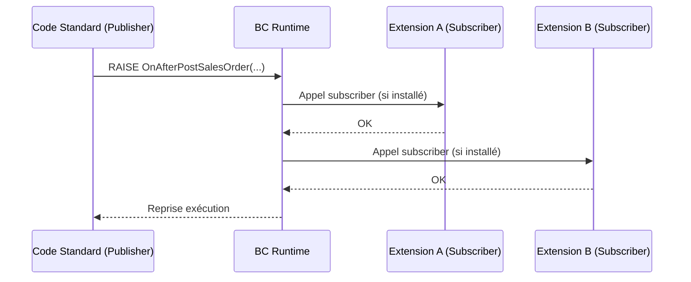

# Events et Subscribers en AL

## Objectifs pédagogiques

À la fin de ce module, tu sauras :

1. **Expliquer** le mécanisme publisher/subscriber et pourquoi il est central dans l'architecture d'extensibilité AL
2. **Déclarer** un event publisher dans un codeunit et le déclencher au bon endroit
3. **Créer** un subscriber qui réagit à un event standard ou personnalisé
4. **Distinguer** les différents types d'events (`BusinessEvent`, `IntegrationEvent`, `InternalEvent`) et choisir lequel utiliser
5. **Éviter** les pièges classiques : dépendances circulaires, subscribers non déclenchés, effets de bord silencieux

---

## Mise en situation

Tu travailles sur une extension pour un client qui distribue des équipements industriels. L'équipe veut qu'à chaque fois qu'une commande vente est validée, un enregistrement soit automatiquement créé dans une table de suivi logistique custom — sans toucher au code standard de validation des commandes.

Modifier le code standard est hors de question : l'extension doit rester compatible avec les futures mises à jour BC. La solution, c'est exactement ce que les events permettent : brancher de la logique custom sur des points d'extension prévus dans le code standard, sans y toucher.

---

## Pourquoi les events existent

Dans NAV classique, personnaliser un traitement standard signifiait modifier directement les objets base. Résultat : chaque mise à jour cassait les customisations, et la moindre coexistence de plusieurs développements sur le même objet devenait un cauchemar de merge.

AL a tranché différemment. Le principe est simple : **le code standard publie des events à des moments stratégiques de son exécution**, et n'importe quelle extension peut s'y abonner pour greffer sa propre logique. L'objet standard ne sait pas qui l'écoute, et les subscribers ne savent pas ce qui s'est passé avant eux. Couplage minimal, extensibilité maximale.

C'est exactement le pattern Observer — si tu l'as déjà utilisé en C# ou en TypeScript, le concept est identique. La différence, c'est que BC l'a intégré au langage lui-même : ce ne sont pas des interfaces à implémenter ou des listes de callbacks à gérer, ce sont des attributs de procédure.

---

## Comment ça fonctionne concrètement

🧠 **Deux rôles, deux codeunits distincts.** Le **publisher** déclare qu'un event peut se produire et le déclenche. Le **subscriber** réagit quand l'event est déclenché. Ces deux rôles peuvent vivre dans la même extension ou dans des extensions différentes — c'est justement ce qui rend le mécanisme puissant.

Voici le flux d'exécution :



Le runtime BC joue le rôle de médiateur : il connaît tous les subscribers installés pour un event donné, les appelle dans un ordre non garanti, et rend la main une fois tous les subscribers exécutés.

⚠️ **L'ordre d'appel des subscribers n'est pas déterministe.** Si tu as deux extensions qui s'abonnent au même event, tu n'as aucune garantie sur laquelle s'exécute en premier. Ne jamais écrire un subscriber qui suppose qu'un autre subscriber a déjà tourné.

---

## Les types d'events

Il en existe trois, et le choix n'est pas anecdotique.

**`BusinessEvent`** — C'est l'event "contrat public". Tu l'utilises quand tu veux exposer un point d'extension que d'autres extensions (y compris des tiers) pourront utiliser. Microsoft s'engage à maintenir sa signature dans le temps. La conséquence directe : tu ne peux pas changer ses paramètres sans briser tes abonnés.

**`IntegrationEvent`** — Même esprit, mais pour les intégrations techniques (appels externes, synchronisations). La différence principale avec `BusinessEvent` : il peut avoir un paramètre par référence (`var`) qui permet aux subscribers de modifier une valeur en retour.

**`InternalEvent`** — Usage interne à une seule extension. Les autres extensions ne peuvent pas s'y abonner. Utile pour découpler des parties de ton propre code sans exposer un contrat public.

💡 Dans la pratique sur des projets intégrateur, tu rencontreras surtout les events standard BC (de type `BusinessEvent` ou `IntegrationEvent`) auxquels tu *t'abonnes*, et tu publieras tes propres events (`InternalEvent` ou `BusinessEvent`) si tu construis quelque chose de réutilisable.

---

## Déclarer et déclencher un event publisher

Voici un codeunit qui gère l'enregistrement d'un équipement. On veut permettre à d'autres extensions de réagir après cet enregistrement.

```al
codeunit 50100 "Equipment Manager"
{
    // Déclaration du publisher — c'est une procédure vide,
    // le corps ne contient rien : AL génère le mécanisme de dispatch automatiquement
    [BusinessEvent(false)]  // false = pas d'abonné obligatoire
    local procedure OnAfterRegisterEquipment(EquipmentCode: Code[20]; Quantity: Integer)
    begin
        // Corps vide intentionnellement — AL s'occupe du reste
    end;

    procedure RegisterEquipment(EquipmentCode: Code[20]; Quantity: Integer)
    var
        EquipmentRec: Record "Equipment";
    begin
        // ... logique d'enregistrement ...
        EquipmentRec."Code" := EquipmentCode;
        EquipmentRec.Quantity := Quantity;
        EquipmentRec.Insert(true);

        // On déclenche l'event APRÈS l'insertion
        // Tous les subscribers installés seront appelés ici
        OnAfterRegisterEquipment(EquipmentCode, Quantity);
    end;
}
```

Quelques points à remarquer : l'attribut `[BusinessEvent(false)]` dit à AL que cette procédure est un publisher. Le paramètre booléen indique si les subscribers sont obligatoires (`true`) ou optionnels (`false`) — dans 99% des cas, tu mettras `false`. La procédure publisher est déclarée `local` car elle n'a pas besoin d'être appelée depuis l'extérieur — seul le codeunit lui-même la déclenche.

---

## Écrire un subscriber

Le subscriber est une procédure normale, dans n'importe quel codeunit, décorée avec `[EventSubscriber(...)]`.

```al
codeunit 50200 "Logistics Tracker"
{
    [EventSubscriber(
        ObjectType::Codeunit,         // Type de l'objet publisher
        Codeunit::"Equipment Manager", // Quel objet publie l'event
        'OnAfterRegisterEquipment',   // Nom exact de la procédure publisher
        '',                           // Champ concerné (vide si non applicable)
        false,                        // SkipOnMissingLicense
        false                         // SkipOnMissingPermission
    )]
    local procedure TrackEquipmentRegistration(EquipmentCode: Code[20]; Quantity: Integer)
    var
        LogEntry: Record "Logistics Log";
    begin
        // Cette procédure est appelée automatiquement après chaque enregistrement d'équipement
        LogEntry.Init();
        LogEntry."Equipment Code" := EquipmentCode;
        LogEntry."Registered Qty" := Quantity;
        LogEntry."Timestamp" := CurrentDateTime;
        LogEntry.Insert(true);
    end;
}
```

La signature du subscriber **doit correspondre exactement** à celle du publisher — mêmes types de paramètres, même ordre. Si tu te trompes, AL te le dira à la compilation. Mais attention : si le publisher est dans une autre extension et que sa signature change, tu ne l'apprendras qu'au moment du déploiement ou de la mise à jour.

---

## S'abonner aux events standard BC

La vraie valeur des events en contexte intégrateur, c'est de se brancher sur les events publiés par Microsoft dans les modules standard. Voici un exemple concret sur la validation des commandes vente — exactement le scénario de la mise en situation.

```al
codeunit 50300 "Sales Order Post Handler"
{
    [EventSubscriber(
        ObjectType::Codeunit,
        Codeunit::"Sales-Post",           // Le codeunit standard qui poste les ventes
        'OnAfterFinalizePosting',         // Event publié après finalisation du posting
        '',
        false,
        false
    )]
    local procedure CreateShipmentTrackingEntry(
        var SalesHeader: Record "Sales Header";  // var = on reçoit l'enregistrement par référence
        var SalesShipmentHeader: Record "Sales Shipment Header"
    )
    var
        ShipmentTracking: Record "Custom Shipment Tracking";
    begin
        // SalesHeader contient la commande d'origine
        // SalesShipmentHeader contient le bon de livraison généré
        if SalesShipmentHeader."No." = '' then
            exit; // Pas de livraison créée (cas facture seule), on ne fait rien

        ShipmentTracking.Init();
        ShipmentTracking."Shipment No." := SalesShipmentHeader."No.";
        ShipmentTracking."Customer No." := SalesHeader."Sell-to Customer No.";
        ShipmentTracking."Posting Date" := SalesShipmentHeader."Posting Date";
        ShipmentTracking.Status := ShipmentTracking.Status::Pending;
        ShipmentTracking.Insert(true);
    end;
}
```

💡 Pour trouver les events disponibles dans le code standard, le plus efficace est d'utiliser **l'event finder** dans VS Code — recherche `[BusinessEvent` ou `[IntegrationEvent` dans les sources AL standard téléchargées, ou de consulter la documentation Microsoft sur les "Published Events" par module.

---

## Construction progressive : du simple au robuste

### Version 1 — Subscriber minimal, cas happy path

C'est ce qu'on a écrit au-dessus. Ça marche, mais il n'y a aucune gestion d'erreur, aucune protection contre les appels redondants.

### Version 2 — Ajout de guards et de validation

```al
local procedure CreateShipmentTrackingEntry(
    var SalesHeader: Record "Sales Header";
    var SalesShipmentHeader: Record "Sales Shipment Header"
)
var
    ShipmentTracking: Record "Custom Shipment Tracking";
begin
    // Guard 1 : s'assurer qu'on a bien une livraison
    if SalesShipmentHeader."No." = '' then
        exit;

    // Guard 2 : éviter les doublons si l'event est déclenché plusieurs fois
    if ShipmentTracking.Get(SalesShipmentHeader."No.") then
        exit; // Entrée déjà créée, on ne réinsère pas

    ShipmentTracking.Init();
    ShipmentTracking."Shipment No." := SalesShipmentHeader."No.";
    ShipmentTracking."Customer No." := SalesHeader."Sell-to Customer No.";
    ShipmentTracking."Posting Date" := SalesShipmentHeader."Posting Date";
    ShipmentTracking.Status := ShipmentTracking.Status::Pending;
    ShipmentTracking.Insert(true);
end;
```

### Version 3 — Gestion des erreurs sans bloquer le flux standard

⚠️ Un subscriber qui lève une erreur non gérée **rollback la transaction entière**. Si tu bloques dans un subscriber branché sur `OnAfterFinalizePosting`, tu annules le posting. C'est parfois voulu, mais rarement sur un traitement de suivi annexe.

```al
local procedure CreateShipmentTrackingEntry(
    var SalesHeader: Record "Sales Header";
    var SalesShipmentHeader: Record "Sales Shipment Header"
)
var
    ShipmentTracking: Record "Custom Shipment Tracking";
    ErrorText: Text;
begin
    if SalesShipmentHeader."No." = '' then
        exit;

    if ShipmentTracking.Get(SalesShipmentHeader."No.") then
        exit;

    // On protège le traitement dans un commit isolé si nécessaire
    // ou on log l'erreur sans la propager
    if not TryCreateTrackingEntry(SalesShipmentHeader."No.", SalesHeader."Sell-to Customer No.", SalesShipmentHeader."Posting Date") then begin
        ErrorText := GetLastErrorText();
        // Log l'erreur dans une table de monitoring sans bloquer le posting
        LogTrackingError(SalesShipmentHeader."No.", ErrorText);
    end;
end;

[TryFunction]
local procedure TryCreateTrackingEntry(ShipmentNo: Code[20]; CustomerNo: Code[20]; PostingDate: Date)
var
    ShipmentTracking: Record "Custom Shipment Tracking";
begin
    ShipmentTracking.Init();
    ShipmentTracking."Shipment No." := ShipmentNo;
    ShipmentTracking."Customer No." := CustomerNo;
    ShipmentTracking."Posting Date" := PostingDate;
    ShipmentTracking.Status := ShipmentTracking.Status::Pending;
    ShipmentTracking.Insert(true);
end;
```

L'attribut `[TryFunction]` est une fonctionnalité AL qui encapsule une fonction pour attraper les erreurs sans les propager. Elle retourne `false` si une erreur se produit, ce qui te permet de décider quoi faire sans crasher le flux appelant.

---

## Erreurs fréquentes

**Subscriber jamais déclenché**
*Symptôme* : tu déploies, tu testes, rien ne se passe.
*Causes possibles* :
- Le nom de l'event dans l'attribut `[EventSubscriber(...)]` est mal orthographié — AL est case-sensitive sur ce point
- Le codeunit subscriber n'est pas instancié (vérifier les permissions d'objet)
- L'extension n'est pas publiée/installée sur le bon environnement
*Correction* : vérifier d'abord le nom exact de la procédure publisher avec AL Explorer ou les sources standard, puis vérifier que l'extension est bien installée avec `Get-NAVAppInfo`.

---

**Subscriber qui rollback involontairement**
*Symptôme* : l'utilisateur reçoit une erreur lors du posting, alors que ton code n'est censé faire qu'un log.
*Cause* : une erreur non interceptée dans ton subscriber annule la transaction entière.
*Correction* : utiliser `[TryFunction]` pour les opérations à risque, ou gérer explicitement les cas d'erreur avant qu'ils remontent.

---

**Paramètre `var` modifié par erreur**
*Symptôme* : des données standard sont corrompues ou des comportements inattendus apparaissent sur des objets que tu ne devais pas toucher.
*Cause* : les paramètres passés par `var` dans un event peuvent être modifiés par le subscriber. Si tu modifies `SalesHeader` dans ton subscriber, tu modifies l'objet en mémoire de l'appelant.
*Correction* : ne jamais modifier un paramètre `var` dans un subscriber sauf si c'est explicitement l'intention. Travailler sur des copies locales si tu as besoin de manipuler les données.

---

## Bonnes pratiques

**Nommer les events de façon prévisible.** La convention standard est `OnBefore<Action>` / `OnAfter<Action>`. Un event qui s'appelle `OnAfterRegisterEquipment` dit exactement quand il est déclenché. Évite les noms vagues comme `OnEquipmentEvent` qui ne disent rien sur le moment d'exécution.

**Un subscriber = une responsabilité.** Si ton subscriber fait 5 choses différentes, c'est 5 subscribers distincts, ou au minimum une délégation vers des procédures nommées clairement. Un subscriber de 80 lignes est un signal d'alarme.

**Ne jamais supposer le contexte d'appel.** Un event peut être déclenché depuis une interface utilisateur, une tâche planifiée, une API, ou un autre codeunit. Ton subscriber doit fonctionner dans tous ces contextes. En particulier : ne jamais appeler `Message(...)` ou `Confirm(...)` dans un subscriber qui pourrait s'exécuter en background.

**Documenter tes publishers.** Si tu publies un `BusinessEvent` destiné à être utilisé par d'autres extensions (ou par un partenaire ISV), documente les paramètres, le moment de déclenchement, et les garanties ou non-garanties sur l'état des données à ce moment-là. Un publisher sans documentation devient rapidement une boîte noire pour celui qui s'y abonne.

---

## Résumé

| Concept | Ce que c'est | À retenir |
|---|---|---|
| Publisher | Procédure avec `[BusinessEvent]` ou `[IntegrationEvent]` | Corps vide, déclenche l'event avec `OnXxx(params)` |
| Subscriber | Procédure avec `[EventSubscriber(...)]` | Signature doit correspondre exactement au publisher |
| BusinessEvent | Event public, contrat stable | Ne pas changer la signature après publication |
| IntegrationEvent | Event technique, supporte `var` en retour | Permet aux subscribers de modifier des valeurs |
| InternalEvent | Event privé à une extension | Non accessible depuis d'autres extensions |
| TryFunction | Encapsulation d'erreur | Retourne `false` au lieu de propager l'erreur |
| Ordre des subscribers | Non garanti | Ne jamais dépendre de l'ordre d'exécution |

Les events sont le cœur de l'extensibilité AL : ils te permettent de greffer de la logique sur n'importe quel moment du standard, sans jamais le modifier. La discipline à avoir, c'est de rester un *observateur propre* — ton subscriber doit faire son travail sans effets de bord sur le flux qui l'a déclenché.

---

<!-- snippet
id: al_event_publisher_declaration
type: concept
tech: AL
level: intermediate
importance: high
format: knowledge
tags: al, events, publisher, businessevent, extensibilite
title: Déclarer un publisher d'event en AL
content: Un publisher est une procédure avec corps vide décorée par [BusinessEvent(false)] ou [IntegrationEvent(false)]. AL génère automatiquement le mécanisme de dispatch. Le booléen "false" signifie que des abonnés sont optionnels. On déclenche l'event en appelant simplement la procédure : OnAfterRegisterEquipment(Code, Qty).
description: Le corps du publisher est intentionnellement vide — c'est AL qui injecte les appels vers les subscribers au moment du build.
-->

<!-- snippet
id: al_event_subscriber_syntax
type: command
tech: AL
level: intermediate
importance: high
format: knowledge
tags: al, events, subscriber, eventsubscriber
title: Syntaxe complète de [EventSubscriber]
command: [EventSubscriber(ObjectType::<TYPE>, <OBJECT>::"<NOM_OBJET>", '<NOM_EVENT>', '', false, false)]
example: [EventSubscriber(ObjectType::Codeunit, Codeunit::"Sales-Post", 'OnAfterFinalizePosting', '', false, false)]
description: Les deux derniers "false" = SkipOnMissingLicense et SkipOnMissingPermission. Le nom d'event est une string exacte, case-sensitive, qui doit correspondre à la procédure publisher.
-->

<!-- snippet
id: al_event_subscriber_not_triggered
type: error
tech: AL
level: intermediate
importance: high
format: knowledge
tags: al, events, subscriber, debug, deployment
title: Subscriber jamais déclenché — causes et corrections
content: Symptôme : l'event est publié mais le subscriber ne s'exécute jamais. Causes : (1) nom de l'event mal orthographié dans [EventSubscriber] — AL est case-sensitive ; (2) extension non publiée/installée sur l'environnement cible ; (3) objet publisher mal référencé (mauvais ID ou nom). Correction : vérifier le nom exact dans les sources AL standard ou avec AL Explorer, puis contrôler l'installation avec Get-NAVAppInfo.
description: Le nom de l'event dans [EventSubscriber] est une string — une faute de frappe silencieuse suffit à désactiver complètement le subscriber.
-->

<!-- snippet
id: al_event_subscriber_rollback
type: warning
tech: AL
level: intermediate
importance: high
format: knowledge
tags: al, events, subscriber, transaction, erreur
title: Une erreur non gérée dans un subscriber annule toute la transaction
content: Piège : une exception non interceptée dans un subscriber rollback la transaction entière, y compris l'opération standard qui a déclenché l'event. Conséquence : si ton subscriber de tracking plante, le posting vente est annulé. Correction : encapsuler les opérations à risque avec [TryFunction] et gérer le retour false sans propager l'erreur.
description: Un subscriber branché sur OnAfterFinalizePosting qui lève une erreur annule le posting. Utiliser [TryFunction] pour isoler les opérations non critiques.
-->

<!-- snippet
id: al_tryfunction_usage
type: concept
tech: AL
level: intermediate
importance: medium
format: knowledge
tags: al, tryfunction, gestion-erreur, subscriber
title: [TryFunction] — encapsuler une erreur sans la propager
content: Une procédure décorée [TryFunction] retourne false si une erreur se produit à l'intérieur, au lieu de la propager à l'appelant. L'appelant teste le résultat et décide quoi faire (log, alerte, ignorer). Contrainte : une TryFunction ne peut pas appeler de code UI (Message, Confirm) et ne peut pas elle-même être appelée depuis une autre TryFunction.
description: [TryFunction] retourne false sur erreur au lieu de propager l'exception — idéal pour isoler un subscriber de tracking du flux transactionnel principal.
-->

<!-- snippet
id: al_event_var_parameter_risk
type: warning
tech: AL
level: intermediate
importance: high
format: knowledge
tags: al, events, subscriber, var, parametres
title: Modifier un paramètre var dans un subscriber corrompt le flux appelant
content: Piège : les paramètres passés par "var" dans un event sont des références vers les objets en mémoire de l'appelant. Modifier SalesHeader dans un subscriber modifie l'objet réel en cours de traitement. Conséquence : comportements imprévisibles, données corrompues. Correction : ne jamais modifier un paramètre var sauf si c'est explicitement l'intention documentée de l'event (ex: event de validation qui attend une réponse).
description: Un paramètre "var" dans un subscriber n'est pas une copie — c'est l'objet original. Le modifier par inadvertance altère le flux standard.
-->

<!-- snippet
id: al_event_types_comparison
type: concept
tech: AL
level: intermediate
importance: medium
format: knowledge
tags: al, businessevent, integrationevent, internalevent, types
title: Différence entre BusinessEvent, IntegrationEvent et InternalEvent
content: BusinessEvent = contrat public stable, accessible par toutes les extensions, signature ne doit pas changer. IntegrationEvent = même portée, mais supporte des paramètres "var" pour que les subscribers retournent des valeurs. InternalEvent = privé à l'extension qui le déclare, les autres extensions ne peuvent pas s'y abonner. En pratique : InternalEvent pour le découplage interne, BusinessEvent pour exposer un point d'extension à des tiers.
description: Le type d'event détermine qui peut s'y abonner et si les subscribers peuvent modifier des valeurs en retour via des paramètres var.
-->

<!-- snippet
id: al_event_subscriber_order
type: warning
tech: AL
level: intermediate
importance: medium
format: knowledge
tags: al, events, subscriber, ordre, non-deterministe
title: L'ordre d'exécution des subscribers n'est pas garanti
content: Piège : si deux extensions s'abonnent au même event, BC n'offre aucune garantie sur l'ordre d'appel. Conséquence : un subscriber qui suppose qu'un autre s'est déjà exécuté (ex: une table déjà remplie par le premier) produira des comportements aléatoires selon l'environnement. Correction : chaque subscriber doit être autonome et ne dépendre d'aucun autre subscriber du même event.
description: Deux subscribers sur le même event peuvent s'exécuter dans n'importe quel ordre selon la version BC ou l'ordre d'installation des extensions.
-->

<!-- snippet
id: al_event_no_ui_in_background
type: tip
tech: AL
level: intermediate
importance: medium
format: knowledge
tags: al, events, subscriber, background, ui
title: Ne jamais appeler Message() ou Confirm() dans un subscriber
content: Un event peut être déclenché depuis une tâche planifiée, un appel API ou une job queue — pas depuis une session utilisateur interactive. Appeler Message() ou Confirm() dans un subscriber plantera silencieusement en background. Action concrète : remplacer tout affichage par un log en table ou un enregistrement d'erreur. Tester explicitement le subscriber depuis une job queue avant de livrer.
description: Message() et Confirm() nécessitent une session interactive. Un subscriber qui les appelle échoue silencieusement quand déclenché depuis une API ou une job queue.
-->

<!-- snippet
id: al_event_naming_convention
type: tip
tech: AL
level: intermediate
importance: medium
format: knowledge
tags: al, events, publisher, nommage, convention
title: Convention de nommage des events publishers en AL
content: Utiliser systématiquement OnBefore<Action> et OnAfter<Action> pour nommer les publishers (ex: OnBeforeRegisterEquipment, OnAfterRegisterEquipment). Cette convention indique précisément le moment de déclenchement et s'aligne sur la convention utilisée par Microsoft dans les modules standard — ce qui facilite la recherche par les abonnés futurs.
description: La convention OnBefore/OnAfter est le standard AL — s'en écarter rend la découverte des events plus difficile pour les développeurs qui s'y abonneront.
-->
