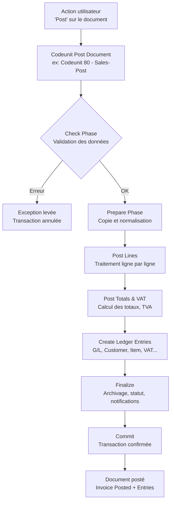
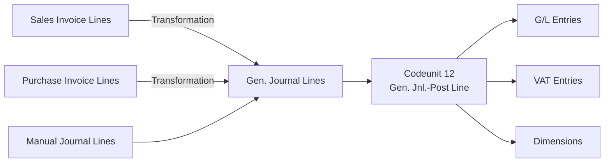
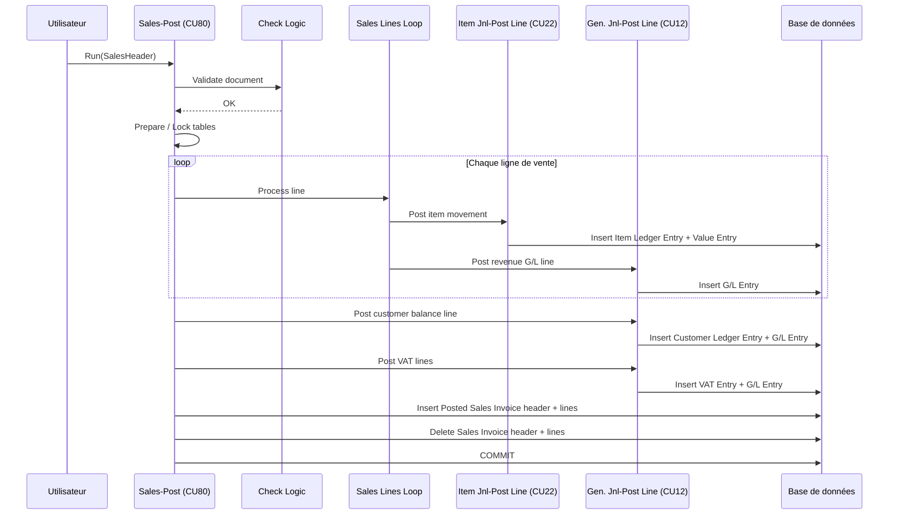

# Posting Pipeline Business Central

## Objectifs pédagogiques

À l'issue de ce module, vous serez capable de :

1. **Décrire** la chaîne d'appels complète qui s'exécute lors d'un posting de document dans Business Central
2. **Identifier** le rôle de chaque codeunit majeur impliqué dans le pipeline (check, post, journal)
3. **Distinguer** les responsabilités séparées entre validation de document, création d'entrées et écriture comptable
4. **Anticiper** où une erreur se produit dans le pipeline à partir d'un message ou d'un comportement observé
5. **Positionner** un point d'intervention dans l'architecture avant de l'implémenter (couvert dans le module suivant)

---

## Mise en situation

Imaginez que vous êtes en charge du support d'une extension en production. Un client vous appelle : "La facture de vente se valide mais le stock n'est pas mis à jour." Vous regardez le code de l'extension — rien d'évident. Vous cherchez où intercepter le flux... mais sans comprendre comment Business Central structure son processus de posting, vous ne savez pas où regarder.

C'est exactement le problème que ce module résout. Le posting dans Business Central n'est pas un simple "enregistrement en base". C'est un pipeline structuré, avec des étapes bien définies, des responsabilités séparées, et une logique qui s'est construite sur 30 ans d'évolution de Navision vers BC. Comprendre cette architecture, c'est comprendre le cœur transactionnel de l'ERP.

---

## Ce que c'est — et pourquoi ça a été conçu ainsi

### Le posting, c'est quoi exactement ?

Dans Business Central, "poster" un document (une facture de vente, une commande d'achat, un ordre de fabrication), c'est le transformer en quelque chose d'**irréversible et comptabilisé**. La commande de vente disparaît, et à sa place apparaissent : une facture vente enregistrée, des écritures comptables (G/L Entries), des écritures clients (Customer Ledger Entries), des écritures stock (Item Ledger Entries), potentiellement des écritures TVA, des entrées valorisation... Une demi-douzaine de tables au minimum.

C'est un **acte de transformation**, pas une sauvegarde. Et cette transformation doit être atomique : soit tout se passe, soit rien. Si la comptabilisation TVA échoue après que le stock a été mis à jour, on aurait une incohérence catastrophique.

### Pourquoi un pipeline aussi structuré ?

La réponse courte : parce que les règles métier d'une comptabilisation sont **complexes, interdépendantes et doivent être extensibles**.

Pensez-y : poster une facture de vente, c'est vérifier des dizaines de conditions (client bloqué ? ligne sans compte G/L ? devise cohérente ?), calculer des montants (remises, TVA, arrondi), écrire dans au moins 6 tables différentes, et déclencher des effets de bord (mise à jour du stock, notification, archivage). Si tout ça était dans un seul codeunit monolithique, aucun intégrateur ne pourrait jamais modifier un comportement sans risquer de tout casser.

Microsoft a donc séparé les responsabilités en plusieurs couches distinctes, chacune avec un rôle précis. C'est ce qu'on appelle le posting pipeline.

---

## Anatomie du pipeline : les grandes couches

Avant de rentrer dans les codeunits spécifiques, posons la structure globale. Le pipeline de posting d'un document de vente (Sales Invoice) suit toujours le même schéma en trois grandes phases :

Ce diagramme est volontairement simplifié — dans la réalité, chaque étape peut elle-même appeler d'autres codeunits. Mais la logique de séquencement reste celle-là.

---

## Les acteurs clés du pipeline

### Le codeunit principal : Sales-Post (Codeunit 80)

C'est le **chef d'orchestre**. Pour une commande ou facture de vente, tout commence ici. Il ne fait pas grand-chose directement — il coordonne. Il appelle le check, prépare les données, délègue la création des écritures à des codeunits spécialisés.

Pour chaque flux document, il existe un équivalent :

| Document | Codeunit principal | Numéro |
|---|---|---|
| Sales Invoice / Order | Sales-Post | 80 |
| Purchase Invoice / Order | Purch.-Post | 90 |
| General Journal | Gen. Jnl.-Post | 11 |
| Item Journal | Item Jnl.-Post | 22 |
| Sales Return Order | Sales-Post | 80 (même CU) |

💡 Sales-Post gère à la fois les commandes, les factures directes et les avoirs — c'est le paramètre `Ship`, `Invoice`, `Receive` passé au codeunit qui détermine ce qui est exécuté.

### La phase Check : Sales-Post (Check)

Avant d'écrire quoi que ce soit, BC valide. Cette logique de validation est maintenant souvent externalisée dans un codeunit dédié (`Sales-Post (Yes/No)` ou des méthodes `CheckXxx`). Elle vérifie par exemple :

- Le client existe et n'est pas bloqué
- Chaque ligne a un numéro de compte G/L valide ou un article actif
- Les dates comptables sont dans une période ouverte
- Les quantités à facturer sont cohérentes

Si une seule condition échoue, une erreur est levée — aucune écriture n'a encore été créée. C'est voulu : **on ne commence à écrire qu'une fois qu'on est sûr que tout est correct**.

⚠️ **Erreur fréquente** : croire que les validations de champs (les triggers `OnValidate`) suffisent à protéger le posting. Non. Les triggers s'exécutent à la saisie, ligne par ligne, en isolation. Le check du posting raisonne sur le document complet, dans son état au moment de la validation, avec toutes les lignes simultanément.

### La Gen. Jnl. Line — la monnaie commune

C'est le concept architectural le plus important à comprendre. Quelle que soit la nature du document posté (vente, achat, stock), **le moteur comptable de BC travaille toujours avec des `Gen. Journal Line`**.

Le pipeline de vente va donc :
1. Lire les lignes de la Sales Invoice
2. Les **convertir en Gen. Journal Lines** (avec compte G/L, montant, dimension, devise)
3. Passer ces lignes au **Gen. Jnl.-Post Line (Codeunit 12)**

Ce codeunit 12 est le cœur absolu du moteur comptable. Il crée les `G/L Entry`, gère l'arrondi de devise, applique les dimensions, vérifie les limites de compte. Il ne connaît pas les factures de vente — il ne connaît que des lignes journal.

🧠 **Concept clé** : La `Gen. Journal Line` est la langue commune de tout le posting dans BC. Tout converge vers elle avant d'atteindre la comptabilité générale. Si vous comprenez comment une ligne de vente devient une Gen. Journal Line, vous comprenez 80% du pipeline.

### Le cas du stock : Item Ledger vs G/L

Le posting d'un article en vente crée deux types d'entrées en parallèle :

- Une **Item Ledger Entry** (mouvement de stock physique : -1 unité vendue)
- Une **Value Entry** (valorisation monétaire de ce mouvement)
- Et, selon la méthode de coût, une **G/L Entry** via le mécanisme d'ajustement de coût

Ces entrées sont créées par **Item Jnl.-Post Line (Codeunit 22)**, appelé depuis le pipeline de vente pour chaque ligne article. Ce codeunit est lui-même indépendant — il peut être appelé directement depuis un Item Journal, ou depuis le pipeline de vente, ou depuis la réception d'achat.

---

## Séquencement complet — facture de vente

Voici ce qui se passe réellement quand un utilisateur clique "Post" sur une Sales Invoice dans Business Central :

Le `COMMIT` n'arrive qu'à la toute fin. Tout ce qui précède est dans la même transaction. Si quoi que ce soit lève une erreur avant le commit, **toutes les insertions sont annulées** — la base revient à son état d'origine.

💡 C'est pour ça que le Lock sur les tables (notamment G/L Entry) arrive tôt dans le pipeline — pour éviter que deux postings concurrents génèrent des numéros d'entrées en conflit.

---

## Ce qui arrive aux tables au moment du posting

Un point souvent mal compris : le posting n'est pas seulement une écriture, c'est aussi une **destruction**. Les tables "work in progress" (Sales Header, Sales Line) sont supprimées. Les tables "posted" (Sales Invoice Header, Sales Invoice Line) sont créées. Ce n'est pas un changement de statut — c'est un changement de table.

| Avant posting | Après posting |
|---|---|
| `Sales Header` (Document Type = Invoice) | `Sales Invoice Header` |
| `Sales Line` | `Sales Invoice Line` |
| Pas d'entrées comptables | G/L Entry, Customer Ledger Entry, VAT Entry |
| Pas d'entrées stock | Item Ledger Entry, Value Entry |

⚠️ Cette suppression est définitive et fait partie de la même transaction. Si votre code subscriber tente de lire `Sales Line` après le posting dans un `OnAfterPost`, vous ne trouverez plus rien — les lignes sont dans `Sales Invoice Line` désormais.

---

## Où et comment les erreurs se manifestent

Comprendre le pipeline aide directement au diagnostic. Voici comment interpréter les erreurs courantes selon leur origine dans le pipeline :

**Erreur en phase Check** — elle arrive immédiatement quand l'utilisateur clique Post, sans aucune écriture créée. Message typique : "Posting Date is not within your range of allowed posting dates."

**Erreur dans la boucle lignes** — elle arrive après quelques secondes (le pipeline a commencé), le message pointe souvent vers un article, un compte G/L, ou une dimension. Aucune écriture n'est conservée (rollback automatique).

**Erreur dans Gen. Jnl.-Post Line** — souvent liée à un compte G/L bloqué, une devise sans taux de change, ou un déséquilibre comptable. Le message vient du CU12 et peut paraître "abstrait" par rapport au document source.

**Erreur après commit (rare)** — si un event `OnAfterPost` lève une erreur, c'est trop tard pour le rollback comptable. Selon la configuration, ça peut laisser le posting "à moitié fait". C'est un cas à éviter absolument — on y reviendra dans le module suivant.

🧠 **Concept clé** : La règle d'or du diagnostic posting BC — si les entrées comptables existent, l'erreur vient d'après le commit. Si elles n'existent pas, l'erreur vient d'avant.

---

## Cas réel : comprendre un bug de valorisation de stock

**Contexte** : une société de distribution utilise BC avec la méthode de coût "Average". Après posting de factures de vente en masse (via un job), les Item Ledger Entries sont créées mais les Value Entries ont des montants à zéro. Le stock comptable ne correspond plus au stock réel.

**Ce qui s'est passé** : le job appelait `Sales-Post` pour chaque facture, mais désactivait le mécanisme d'ajustement de coût (via un flag dans `Inventory Setup`) pour accélérer le traitement. Les Value Entries étaient créées avec le coût estimé à zéro, en attendant que le batch `Adjust Cost - Item Entries` les corrige plus tard. Ce batch n'a jamais été planifié.

**Ce que ça révèle sur l'architecture** : le pipeline de posting stock est **délibérément découplé** de la valorisation finale. Le codeunit 22 crée le mouvement physique, mais la valorisation précise (surtout en Average ou FIFO) peut être différée. `Adjust Cost - Item Entries` est le codeunit qui ferme la boucle. C'est un choix de performance — valoriser en temps réel sur un grand volume serait trop lent.

**La correction** : planifier le batch toutes les nuits, ou — mieux — comprendre que l'option "Expected Cost Posting" dans les paramètres stock change le comportement dès le pipeline.

---

## Bonnes pratiques architecturales

**Ne pas appeler Sales-Post directement depuis une interface utilisateur sans filet.** Le codeunit 80 ne gère pas la confirmation utilisateur, ne valide pas les droits d'approbation, ne vérifie pas les workflows. Ces couches existent dans des codeunits intermédiaires (`Sales-Post (Yes/No)`, `Sales-Post via Job Queue`). Appeler le CU80 directement, c'est court-circuiter ces protections.

**Traiter les erreurs du pipeline comme des erreurs de domaine, pas des erreurs techniques.** Quand le CU12 rejette une ligne, ce n'est pas un bug — c'est la règle métier qui s'applique. Vos logs et vos messages d'erreur doivent refléter ça, pas masquer l'erreur derrière un message générique.

**Respecter le principe de la transaction unique.** Si vous avez besoin de faire des opérations "en dehors" du posting (appel API externe, log dans une table tierce), ne les mettez pas dans le même bloc transactionnel. Un appel API qui échoue ne doit pas rollback une facture correctement comptabilisée.

**Ne pas supposer l'ordre d'exécution des lignes.** Dans la boucle de posting des lignes de vente, BC applique des filtres et trie, mais l'ordre exact peut varier. Si votre logique d'extension dépend du fait que la ligne 1 soit traitée avant la ligne 2 — vous avez un problème architectural.

💡 Pour les extensions qui doivent intervenir dans le pipeline : la question n'est pas "où est-ce que je peux me brancher ?" mais "dans quelle phase est-ce que mon intervention a du sens ?" Check, prepare, post lines, finalize — chaque phase a une sémantique. Respectez-la.

---

## Résumé

Le posting pipeline de Business Central est une architecture en couches construite autour d'un principe simple : **séparer la validation, la transformation et l'écriture**. Le codeunit principal (ex: CU80 pour les ventes) orchestre sans tout faire lui-même — il délègue la comptabilité au CU12 (Gen. Jnl.-Post Line) et les mouvements stock au CU22 (Item Jnl.-Post Line). La Gen. Journal Line est la structure pivot qui unifie tous les flux vers le moteur comptable.

Toute la séquence s'exécute dans une transaction unique, committée seulement si tout réussit. Les tables source (Sales Header, Sales Line) sont supprimées ; les tables posted sont créées. Comprendre ce pipeline, c'est savoir où chercher quand quelque chose ne se passe pas comme prévu — et savoir où intervenir sans casser ce qui fonctionne.

---

<!-- snippet
id: bc_posting_pipeline_overview
type: concept
tech: business-central
level: intermediate
importance: high
format: knowledge
tags: posting, pipeline, architecture, codeunit, transaction
title: Pipeline de posting BC — structure en 3 phases
content: Le posting BC suit toujours 3 phases dans une transaction unique : 1) Check (validation du document entier, aucune écriture créée) 2) Post (boucle ligne par ligne, création des Item/G/L/VAT entries via CU22 et CU12) 3) Finalize (archivage, suppression des tables source, COMMIT). Si une erreur survient avant le COMMIT, tout est rollbacké — aucune écriture partielle n'est conservée.
description: La séquence Check→Post→Finalize est atomique. Le COMMIT n'arrive qu'en toute fin — toute erreur avant annule l'ensemble des écritures.
-->

<!-- snippet
id: bc_posting_cu80_role
type: concept
tech: business-central
level: intermediate
importance: high
format: knowledge
tags: posting, codeunit, sales-post, orchestration
title: Codeunit 80 — orchestrateur, pas exécutant
content: Sales-Post (CU80) ne crée pas directement les écritures comptables. Il coordonne : il appelle la validation, prépare les données, boucle sur les lignes, puis délègue au CU12 (Gen. Jnl.-Post Line) pour la comptabilité et au CU22 (Item Jnl.-Post Line) pour le stock. Appeler CU80 directement court-circuite les workflows d'approbation et les vérifications de droits — utiliser Sales-Post (Yes/No) depuis l'UI.
description: CU80 orchestre sans exécuter directement. Pour l'UI, passer par le codeunit intermédiaire Yes/No qui gère les confirmations et workflows.
-->

<!-- snippet
id: bc_posting_genjnl_line_pivot
type: concept
tech: business-central
level: intermediate
importance: high
format: knowledge
tags: posting, gen-journal-line, codeunit-12, comptabilite
title: Gen. Journal Line — la structure pivot de toute comptabilisation
content: Quelle que soit la source (vente, achat, journal manuel), toute écriture comptable dans BC passe par une Gen. Journal Line avant d'atteindre la G/L Entry. Le pipeline de vente convertit ses Sales Lines en Gen. Journal Lines, puis les envoie au CU12 (Gen. Jnl.-Post Line). Le CU12 ne connaît pas les factures — il ne traite que des lignes journal. C'est ce qui rend le moteur comptable générique et réutilisable.
description: Gen. Journal Line est la langue commune de tout le posting BC. Vente, achat, journal — tout converge ici avant la G/L Entry, via CU12.
-->

<!-- snippet
id: bc_posting_tables_destruction
type: warning
tech: business-central
level: intermediate
importance: high
format: knowledge
tags: posting, tables, sales-header, sales-invoice, architecture
title: Le posting supprime les tables source — pas un changement de statut
content: Piège : après posting d'une Sales Invoice, Sales Header et Sales Line n'existent plus. BC les supprime et crée Sales Invoice Header + Sales Invoice Line dans la même transaction. Un subscriber OnAfterPost qui tente de lire Sales Line ne trouvera rien — les données sont dans Sales Invoice Line. Ce n'est pas un bug, c'est l'architecture.
description: Après posting, Sales Header/Line sont supprimés. Les données sont dans Sales Invoice Header/Line. Lire Sales Line dans OnAfterPost retourne vide.
-->

<!-- snippet
id: bc_posting_check_vs_onvalidate
type: warning
tech: business-central
level: intermediate
importance: high
format: knowledge
tags: posting, validation, check, onvalidate, erreur
title: Check du posting ≠ triggers OnValidate — deux périmètres distincts
content: Piège classique : croire que les triggers OnValidate des champs suffisent à protéger le posting. Ils s'exécutent à la saisie, ligne par ligne, de façon isolée. La phase Check du posting raisonne sur le document complet au moment de la validation (toutes les lignes, état cohérent global, période comptable ouverte, etc.). Des erreurs bloquées par le Check peuvent ne jamais avoir déclenché de OnValidate — et inversement.
description: OnValidate s'exécute à la saisie, champ par champ. Le Check posting valide le document complet. Ce sont deux couches indépendantes.
-->

<!-- snippet
id: bc_posting_error_diagnosis
type: tip
tech: business-central
level: intermediate
importance: medium
format: knowledge
tags: posting, diagnostic, erreur, g/l-entry, rollback
title: Diagnostiquer une erreur posting — la règle des entrées
content: Règle de diagnostic rapide : si des G/L Entries ont été créées → l'erreur vient d'après le COMMIT (event OnAfterPost ou traitement post-posting). Si aucune G/L Entry n'existe → l'erreur vient d'avant le COMMIT (Check, boucle lignes, CU12 ou CU22). Cette distinction oriente immédiatement la recherche vers la bonne phase du pipeline.
description: Présence de G/L Entries = erreur post-commit. Absence = erreur pré-commit. Cette règle simple oriente le diagnostic en 10 secondes.
-->

<!-- snippet
id: bc_posting_cu22_stock_decoupled
type: concept
tech: business-central
level: intermediate
importance: medium
format: knowledge
tags: posting, stock, item-ledger, value-entry, codeunit-22
title: CU22 — mouvement stock découplé de la valorisation finale
content: Item Jnl.-Post Line (CU22) crée l'Item Ledger Entry (mouvement physique) et une Value Entry initiale. En méthode Average ou FIFO, la valorisation précise est différée : le batch "Adjust Cost - Item Entries" ferme la boucle. Si ce batch n'est pas planifié, les Value Entries restent avec un coût estimé. C'est un choix délibéré de performance — valoriser en temps réel sur gros volume serait trop lent.
description: CU22 crée le mouvement stock mais pas la valorisation finale en Average/FIFO. Le batch Adjust Cost - Item Entries doit être planifié pour compléter.
-->

<!-- snippet
id: bc_posting_transaction_externe
type: warning
tech: business-central
level: intermediate
importance: high
format: knowledge
tags: posting, transaction, api, commit, extensibilite
title: Ne jamais mettre un appel externe dans la transaction de posting
content: Piège d'architecture : placer un appel API externe (webhook, service REST, log externe) dans un subscriber qui s'exécute avant le COMMIT du posting. Si l'appel échoue, il rollbacke toute la transaction — la facture correctement calculée est annulée pour une raison réseau. Les effets de bord externes doivent s'exécuter après le COMMIT, dans un event OnAfterPost ou via une job queue.
description: Un appel externe qui échoue avant le COMMIT rollbacke le posting entier. Placer les appels réseau dans OnAfterPost ou une job queue, après le COMMIT.
-->
