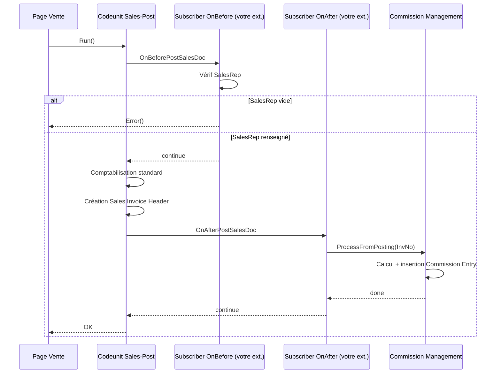

# Posting Extensibility avancée

## Objectifs pédagogiques

À l'issue de ce module, vous serez capable de :

1. **Identifier** les points d'extension pertinents dans le pipeline de comptabilisation BC sans modifier le code standard
2. **Implémenter** des subscribers sur les events critiques du posting pour injecter de la logique métier
3. **Choisir** entre subscriber, interface override et table extension selon le contexte d'extension
4. **Gérer** les dépendances d'ordre entre subscribers quand plusieurs extensions coexistent
5. **Anticiper** les effets de bord d'une extension de posting sur la traçabilité et les écritures générées

---

## Mise en situation

Vous travaillez sur une extension pour un client dans le secteur de la distribution. Leur besoin : lors de la comptabilisation d'une facture vente, calculer et enregistrer automatiquement une provision de commission commerciale dans une table dédiée, et bloquer la comptabilisation si le représentant commercial n'est pas renseigné sur la facture.

Deux contraintes supplémentaires viennent compliquer le tableau : une autre extension ISV déjà en place fait elle aussi des vérifications avant posting, et le client veut que la logique soit testable indépendamment du posting complet.

Ce scénario est typique de ce que vous rencontrerez en mission. Le module précédent vous a montré comment le pipeline se structure — ici, on entre dans les mécanismes qui permettent de s'y connecter proprement.

---

## Pourquoi l'extensibilité du posting est un sujet à part entière

Le pipeline de comptabilisation BC est l'une des zones les plus sensibles de l'ERP. Une erreur ici ne produit pas un bug d'affichage — elle produit des écritures comptables fausses, des stocks incorrects, ou pire, une comptabilisation partielle difficile à corriger en production.

La tentation naturelle serait de copier-coller le codeunit de posting et d'y ajouter sa logique. C'était l'approche C/AL. En AL avec le modèle d'extension, c'est impossible — et c'est une bonne chose, parce que ça force à réfléchir aux bons points d'entrée.

L'enjeu réel n'est pas "comment modifier le posting", c'est "comment injecter de la logique sans casser ce qui existe ni bloquer les autres extensions".

---

## Les trois mécanismes d'extension du posting

### 1. Les events publiés par les codeunits standard

C'est le mécanisme principal. Microsoft a instrumenté les codeunits de posting avec des publishers `IntegrationEvent` et `BusinessEvent` à des endroits stratégiques. Votre extension s'y abonne via des subscribers.

🧠 **Distinction fondamentale** : un `BusinessEvent` documente un fait métier observable (une facture a été comptabilisée). Un `IntegrationEvent` documente un point d'extension technique (on est au milieu du traitement, vous pouvez modifier des données). Les deux sont utiles, mais pour des raisons différentes.

```al
// Subscriber sur un event de validation avant posting
[EventSubscriber(ObjectType::Codeunit, Codeunit::"Sales-Post", 
    'OnBeforePostSalesDoc', '', false, false)]
local procedure CheckSalesRepBeforePost(
    var SalesHeader: Record "Sales Header";
    CommitIsSuppressed: Boolean;
    var IsHandled: Boolean)
begin
    // On ne lève une erreur que si le document est une facture
    // Les commandes et avoirs passent sans vérification
    if SalesHeader."Document Type" <> SalesHeader."Document Type"::Invoice then
        exit;

    if SalesHeader."Salesperson Code" = '' then
        Error('Le représentant commercial est obligatoire avant comptabilisation. Document : %1',
            SalesHeader."No.");
end;
```

Le paramètre `IsHandled` mérite attention : si vous le mettez à `true`, vous signalez que vous avez "pris en charge" le traitement et le code standard peut sauter sa propre logique. À utiliser avec précaution — c'est un contrat fort.

### 2. Les codeunit interfaces et le pattern de substitution

Pour des cas plus avancés, certains flux de posting passent par des interfaces AL. Cela permet de substituer complètement un comportement standard par le vôtre, pas seulement de vous y accrocher.

💡 C'est relativement rare dans le posting standard BC (Microsoft l'utilise davantage dans des zones comme la tarification), mais si vous construisez vous-même un posting extensible pour votre ISV, c'est le pattern à privilégier pour les zones où la logique doit être entièrement remplaçable.

```al
// Définir une interface pour la logique de commission
interface "ICommission Calculator"
{
    procedure Calculate(SalesHeader: Record "Sales Header"): Decimal;
}

// Implémentation par défaut
codeunit 50100 "Default Commission Calc" implements "ICommission Calculator"
{
    procedure Calculate(SalesHeader: Record "Sales Header"): Decimal
    begin
        // Règle standard : 2% du montant HT
        exit(SalesHeader.Amount * 0.02);
    end;
}
```

L'avantage ici : une extension cliente peut fournir sa propre implémentation sans toucher à la vôtre. L'interface devient le contrat, pas l'implémentation.

### 3. L'extension de tables via table extensions

Quand votre logique de posting doit stocker des données supplémentaires sur les documents ou les écritures, vous passez par des table extensions. Mais il y a une subtilité importante : les tables d'écritures (Ledger Entries) ont des contraintes spécifiques.

```al
// Extension de la table Sales Invoice Header pour stocker la provision
tableextension 50101 "Sales Inv. Header Ext" extends "Sales Invoice Header"
{
    fields
    {
        field(50100; "Commission Amount"; Decimal)
        {
            Caption = 'Commission Amount';
            DataClassification = CustomerContent;
            // Pas de validation ici — la valeur est calculée au posting
            // et ne doit pas être modifiable manuellement
            Editable = false;
        }
    }
}
```

⚠️ **Piège classique** : étendre `Sales Invoice Line` ou `G/L Entry` avec des champs calculés au posting nécessite de bien identifier *quel event* déclenche l'écriture définitive. Écrire dans ces champs trop tôt ou trop tard dans le pipeline produit des données vides ou incohérentes.

---

## Construction progressive : de la vérification à l'écriture de provision

Voici comment le scénario de mise en situation se construit en trois étapes.

### V1 — Vérification avant posting

```al
codeunit 50110 "Commission Posting Handler"
{
    [EventSubscriber(ObjectType::Codeunit, Codeunit::"Sales-Post",
        'OnBeforePostSalesDoc', '', false, false)]
    local procedure ValidateSalesRep(
        var SalesHeader: Record "Sales Header";
        CommitIsSuppressed: Boolean;
        var IsHandled: Boolean)
    begin
        if SalesHeader."Document Type" <> SalesHeader."Document Type"::Invoice then
            exit;

        if SalesHeader."Salesperson Code" = '' then
            Error('Salesperson Code requis pour la facture %1.', SalesHeader."No.");
    end;
}
```

Simple, ciblé. On ne fait qu'une vérification, on sort immédiatement si le document n'est pas concerné. C'est volontairement minimal.

### V2 — Calcul et stockage de la provision après posting

```al
// On s'abonne après la comptabilisation, quand la Sales Invoice Header existe
[EventSubscriber(ObjectType::Codeunit, Codeunit::"Sales-Post",
    'OnAfterPostSalesDoc', '', false, false)]
local procedure CreateCommissionEntry(
    var SalesHeader: Record "Sales Header";
    var GenJnlPostLine: Codeunit "Gen. Jnl.-Post Line";
    SalesShptHdrNo: Code[20];
    RetRcpHdrNo: Code[20];
    SalesInvHdrNo: Code[20];
    SalesCrMemoHdrNo: Code[20];
    CommitIsSuppressed: Boolean;
    InvNo: Code[20];
    ShptNo: Code[20];
    CrMemoNo: Code[20])
var
    SalesInvHeader: Record "Sales Invoice Header";
    CommissionEntry: Record "Commission Entry"; // votre table custom
    CommissionCalc: Codeunit "Default Commission Calc";
begin
    // On ne traite que les factures
    if SalesInvHdrNo = '' then
        exit;

    if not SalesInvHeader.Get(SalesInvHdrNo) then
        exit;

    // Calcul de la commission
    CommissionEntry.Init();
    CommissionEntry."Entry No." := GetNextEntryNo();
    CommissionEntry."Invoice No." := SalesInvHdrNo;
    CommissionEntry."Salesperson Code" := SalesInvHeader."Salesperson Code";
    CommissionEntry.Amount := CommissionCalc.Calculate(SalesHeader);
    CommissionEntry."Posting Date" := SalesInvHeader."Posting Date";
    CommissionEntry.Insert(true); // déclenche OnInsert si nécessaire
end;
```

💡 Notez qu'on travaille sur `SalesInvHeader` (la facture comptabilisée) et non sur `SalesHeader` (qui est en cours d'effacement à ce stade). C'est une nuance qui piège souvent : après posting, le `SalesHeader` original n'est plus fiable.

### V3 — Version production : gestion des erreurs et compatibilité multi-extension

```al
codeunit 50110 "Commission Posting Handler"
{
    // Séparation claire des responsabilités
    // La validation et l'écriture sont dans deux subscribers distincts
    
    [EventSubscriber(ObjectType::Codeunit, Codeunit::"Sales-Post",
        'OnBeforePostSalesDoc', '', false, false)]
    local procedure ValidateSalesRep(
        var SalesHeader: Record "Sales Header";
        CommitIsSuppressed: Boolean;
        var IsHandled: Boolean)
    begin
        if not IsApplicable(SalesHeader) then
            exit;

        if SalesHeader."Salesperson Code" = '' then
            Error('Salesperson Code requis — facture %1.', SalesHeader."No.");
    end;

    [EventSubscriber(ObjectType::Codeunit, Codeunit::"Sales-Post",
        'OnAfterPostSalesDoc', '', false, false)]
    local procedure RecordCommission(
        var SalesHeader: Record "Sales Header";
        var GenJnlPostLine: Codeunit "Gen. Jnl.-Post Line";
        SalesShptHdrNo: Code[20];
        RetRcpHdrNo: Code[20];
        SalesInvHdrNo: Code[20];
        SalesCrMemoHdrNo: Code[20];
        CommitIsSuppressed: Boolean;
        InvNo: Code[20];
        ShptNo: Code[20];
        CrMemoNo: Code[20])
    var
        CommissionMgt: Codeunit "Commission Management"; // logique isolée
    begin
        if SalesInvHdrNo = '' then
            exit;

        // On délègue à un codeunit dédié — testable indépendamment
        CommissionMgt.ProcessFromPosting(SalesInvHdrNo);
    end;

    local procedure IsApplicable(SalesHeader: Record "Sales Header"): Boolean
    begin
        exit(SalesHeader."Document Type" = SalesHeader."Document Type"::Invoice);
    end;
}
```

La séparation entre le subscriber (point d'entrée) et `CommissionMgt` (logique métier) est délibérée : ça permet d'écrire des tests unitaires sur la logique de commission sans simuler un posting complet.

---

## Coexistence de plusieurs extensions sur le même event

C'est là que ça devient vraiment intéressant en environnement réel. Quand deux extensions s'abonnent au même event, BC les exécute toutes les deux — mais dans quel ordre ?

🧠 **L'ordre d'exécution des subscribers n'est pas garanti** entre extensions différentes. À l'intérieur d'une même extension, AL respecte l'ordre de déclaration, mais entre deux apps différentes, c'est imprévisible.

Ce que ça signifie concrètement :

- Si votre subscriber `OnBeforePostSalesDoc` lève une erreur, il interrompt la chaîne — les subscribers de l'autre extension ne s'exécutent pas forcément
- Si deux subscribers modifient le même champ de `SalesHeader` avant posting, le dernier à s'exécuter gagne
- Si une extension met `IsHandled := true`, votre subscriber peut être court-circuité selon la logique du publisher

Pour la vérification du `Salesperson Code`, c'est sans risque. Mais si vous modifiez des données dans un subscriber `OnBefore`, vérifiez toujours que vous ne marchez pas sur les pieds d'une autre extension.

⚠️ **Pattern défensif** : ne jamais supposer l'état d'un champ que vous n'avez pas vous-même écrit. Si votre subscriber dépend d'une valeur dans `SalesHeader`, validez-la dans votre subscriber plutôt que d'espérer qu'un autre subscriber l'a déjà positionnée.

---

## Diagramme : flux d'extension dans le posting vente



---

## Bonnes pratiques

**Sortir tôt, toujours.** Chaque subscriber doit commencer par vérifier si le document lui est applicable. Un subscriber qui traite tous les documents sans filtre ralentit tous les postings, y compris ceux qui ne le concernent pas.

**Ne jamais mettre `IsHandled := true` sans raison explicite.** C'est une décision architecturale forte. Si vous le faites, documentez-le dans le code. Une ligne de commentaire expliquant pourquoi vous supprimez le comportement standard évite des heures de debug pour le prochain développeur.

**Séparer point d'entrée et logique métier.** Le subscriber est un câble — il relie l'event à votre code. La logique elle-même vit dans un codeunit dédié. Avantage immédiat : vous pouvez tester la logique de commission sans simuler un posting.

**Tester avec un deuxième tenant ou une app de test.** Pour vérifier la coexistence avec d'autres extensions, installez une app "fantôme" qui s'abonne aux mêmes events et vérifiez que votre logique reste cohérente.

**Eviter les commits manuels dans un subscriber de posting.** Le posting BC gère sa propre transaction. Un `Commit()` dans votre subscriber peut partiellement valider une transaction qui devrait être atomique, avec des conséquences difficiles à défaire.

```al
// ❌ À ne jamais faire dans un subscriber de posting
[EventSubscriber(...)]
local procedure MySubscriber(...)
begin
    // ... votre logique ...
    Commit(); // ← brise l'atomicité du posting
end;

// ✅ Laisser BC gérer la transaction — votre Insert() est dans la même transaction
[EventSubscriber(...)]
local procedure MySubscriber(...)
begin
    CommissionMgt.ProcessFromPosting(SalesInvHdrNo);
    // BC committera tout ensemble à la fin du posting
end;
```

---

## Résumé

| Concept | Ce qu'il fait | À retenir |
|---|---|---|
| `EventSubscriber` sur posting | S'accroche à un point précis du pipeline sans modifier le code standard | Toujours filtrer le type de document en entrée |
| `IsHandled` | Signale que le traitement a été pris en charge, peut court-circuiter le standard | Ne l'utiliser que quand c'est l'intention explicite |
| `BusinessEvent` vs `IntegrationEvent` | Fait métier observable vs point d'extension technique | BusinessEvent = notification, IntegrationEvent = intervention |
| Séparation subscriber / codeunit métier | Rend la logique testable indépendamment du posting | Le subscriber ne fait que déléguer |
| Ordre des subscribers | Non garanti entre extensions différentes | Écrire chaque subscriber comme s'il était le seul |
| `Commit()` dans subscriber | Brise l'atomicité de la transaction de posting | Ne jamais committer manuellement dans un subscriber de posting |

La posting extensibility avancée repose sur un principe simple : vous ne contrôlez pas le pipeline, vous vous y branchez. Ça demande plus de discipline qu'une modification directe, mais ça garantit que votre extension coexiste proprement avec le standard et avec les autres apps du tenant.

---

<!-- snippet
id: al_posting_subscriber_filter
type: tip
tech: AL
level: intermediate
importance: high
format: knowledge
tags: al, posting, subscriber, performance, best-practice
title: Toujours filtrer le type de document au début d'un subscriber posting
content: Dans un subscriber OnBefore/OnAfterPostSalesDoc, ajouter un exit immédiat si le document n'est pas concerné (ex: if SalesHeader."Document Type" <> Invoice then exit). Sans ce filtre, votre logique s'exécute pour TOUS les postings vente (commandes, avoirs, retours) et alourdit inutilement chaque transaction.
description: Un subscriber sans filtre s'exécute sur tous les documents — ajouter un exit précoce sur le type pour limiter l'impact à ce qui est réellement concerné.
-->

<!-- snippet
id: al_posting_ishandled_risk
type: warning
tech: AL
level: intermediate
importance: high
format: knowledge
tags: al, posting, ishandled, extensibility, side-effect
title: IsHandled := true supprime le traitement standard — utiliser avec intention
content: Piège : mettre IsHandled := true dans un subscriber signale que vous prenez en charge le traitement. Conséquence : le code standard du codeunit de posting saute sa propre logique pour cet event. Correction : n'utiliser ce paramètre que quand c'est l'intention explicite et le documenter dans le code. Dans 90% des cas, vous voulez juste ajouter de la logique, pas remplacer.
description: IsHandled := true court-circuite le code standard — à réserver aux cas de substitution explicite, jamais par défaut.
-->

<!-- snippet
id: al_posting_commit_forbidden
type: warning
tech: AL
level: intermediate
importance: high
format: knowledge
tags: al, posting, commit, transaction, atomicity
title: Ne jamais appeler Commit() dans un subscriber de posting BC
content: Piège : appeler Commit() dans un subscriber OnBefore ou OnAfter du posting. Conséquence : valide partiellement la transaction en cours, rendant un rollback impossible si une erreur survient plus tard dans le pipeline. Résultat : écritures partielles en base, quasi-impossibles à corriger. Correction : laisser BC gérer la transaction — vos Insert/Modify sont automatiquement dans la même transaction que le posting.
description: Un Commit() dans un subscriber de posting brise l'atomicité — les écritures partielles qui en résultent sont très difficiles à corriger en production.
-->

<!-- snippet
id: al_posting_after_salesheader_state
type: warning
tech: AL
level: intermediate
importance: high
format: knowledge
tags: al, posting, salesheader, onafter, data-integrity
title: Après posting, SalesHeader est en cours de suppression — utiliser SalesInvoiceHeader
content: Piège : dans un subscriber OnAfterPostSalesDoc, lire des champs depuis le paramètre SalesHeader pour les stocker. À ce stade, BC est en train de supprimer le SalesHeader original. Correction : utiliser le numéro SalesInvHdrNo fourni par l'event pour recharger le SalesInvoiceHeader (Record "Sales Invoice Header".Get(SalesInvHdrNo)) et lire les données depuis la facture comptabilisée.
description: Dans OnAfterPostSalesDoc, SalesHeader n'est plus fiable — toujours recharger depuis Sales Invoice Header via le numéro fourni par l'event.
-->

<!-- snippet
id: al_posting_subscriber_separation
type: tip
tech: AL
level: intermediate
importance: medium
format: knowledge
tags: al, posting, architecture, testability, clean-code
title: Séparer le subscriber (point d'entrée) du codeunit de logique métier
content: Le subscriber ne doit faire que déléguer vers un codeunit dédié : CommissionMgt.ProcessFromPosting(SalesInvHdrNo). La logique métier (calcul, insertion) vit dans ce codeunit séparé. Avantage concret : vous pouvez écrire des tests unitaires sur ProcessFromPosting() sans simuler un posting complet, ce qui réduit drastiquement le coût des tests.
description: Un subscriber qui délègue immédiatement à un codeunit dédié rend la logique métier testable sans déclencher un posting complet.
-->

<!-- snippet
id: al_posting_event_types_distinction
type: concept
tech: AL
level: intermediate
importance: medium
format: knowledge
tags: al, posting, businessevent, integrationevent, events
title: BusinessEvent vs IntegrationEvent dans le contexte posting
content: BusinessEvent publie un fait métier observable et stable (ex: "une facture a été comptabilisée") — il ne passe généralement pas de var records modifiables. IntegrationEvent publie un point d'extension technique au milieu du traitement — il passe souvent des var records que votre subscriber peut modifier. Pour le posting, les events OnBefore/OnAfter de Sales-Post sont des IntegrationEvents : vous pouvez y modifier SalesHeader avant qu'il soit traité.
description: IntegrationEvent = vous pouvez modifier les données en transit. BusinessEvent = notification d'un fait accompli, généralement en lecture seule.
-->

<!-- snippet
id: al_posting_subscriber_order
type: concept
tech: AL
level: intermediate
importance: medium
format: knowledge
tags: al, posting, subscribers, multi-extension, order
title: L'ordre des subscribers entre deux extensions différentes n'est pas garanti
content: BC exécute tous les subscribers abonnés au même event, mais l'ordre entre extensions différentes est imprévisible. À l'intérieur d'une même extension, AL respecte l'ordre de déclaration. Conséquence pratique : ne jamais écrire un subscriber qui dépend d'une valeur qu'une autre extension est censée avoir positionnée avant lui. Chaque subscriber doit valider lui-même les données dont il a besoin.
description: Entre deux extensions distinctes, l'ordre d'exécution des subscribers sur le même event est indéfini — écrire chaque subscriber comme s'il était le seul à s'exécuter.
-->

<!-- snippet
id: al_posting_interface_substitution
type: concept
tech: AL
level: intermediate
importance: medium
format: knowledge
tags: al, posting, interface, extensibility, isr
title: Utiliser une interface AL pour rendre une logique de posting entièrement substituable
content: Quand une partie du calcul au posting doit être entièrement remplaçable (pas juste complétée), définir une interface AL avec une méthode Calculate(). L'implémentation par défaut fournie par votre extension sera utilisée sauf si une autre extension fournit sa propre implémentation. Différence avec un subscriber : le subscriber ajoute de la logique, l'interface permet de remplacer complètement la logique existante.
description: Une interface AL dans le posting permet à une extension cliente de remplacer entièrement votre logique de calcul, là où un subscriber se contente de s'y ajouter.
-->
