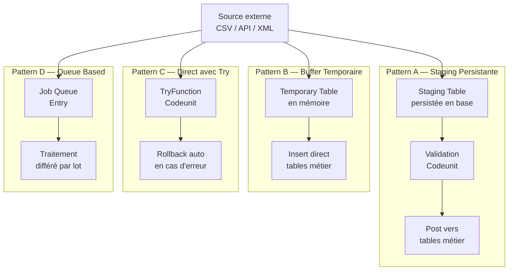
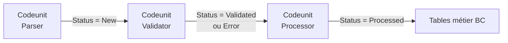

# Staging Tables & Integration Patterns

## Objectifs pédagogiques

À l'issue de ce module, vous serez capable de :

- Concevoir et implémenter une **staging table** pour absorber des données externes avant leur intégration en base métier
- Distinguer les quatre patterns d'intégration AL et choisir celui adapté à votre contexte
- Gérer le cycle de vie complet d'un flux d'import : réception, validation, transformation, posting
- Utiliser les **temporary tables** à bon escient comme zone de travail intermédiaire
- Construire un pipeline d'intégration robuste avec gestion d'erreurs, traçabilité et supervision

---

## Mise en situation

Vous travaillez sur un projet BC pour une PME industrielle. Toutes les semaines, le service achats reçoit un fichier CSV depuis le système de leur fournisseur principal : 800 lignes de commandes avec des codes articles parfois incorrects, des quantités décimales à recalculer selon des règles internes, et des prix à valider contre une table de tarifs BC.

La première version du code charge tout directement dans une Purchase Line. Ça marche — jusqu'au jour où 40 lignes sur 800 ont un article qui n'existe pas. L'import plante à mi-parcours, laisse des en-têtes sans lignes, et personne ne sait ce qui a été créé ou non.

C'est exactement le problème que les staging tables résolvent. L'idée centrale : **séparer la réception des données de leur intégration métier**. On ne touche pas aux vraies tables Business Central tant qu'on n'a pas validé ce qu'on reçoit.

---

## Pourquoi les staging tables existent

Dans un ERP comme BC, les tables métier (Item, Customer, Purchase Header…) ont des contraintes fortes : triggers, flowfields, champs obligatoires, règles de gestion encodées dans des codeunits. Écrire directement dedans depuis un flux externe, c'est naviguer dans un champ de mines.

La staging table est une table **intermédiaire de votre cru**, sans règles métier imposées, qui sert de zone tampon. Vous y écrivez ce que vous recevez — dans la forme brute ou légèrement normalisée — puis vous traitez cette zone séparément, avec vos propres validations, avant de pousser vers les vraies tables BC.

Ça ressemble à la zone de quarantaine dans un aéroport : on ne laisse pas les passagers entrer directement dans la ville, on les fait passer par un contrôle d'abord. Les données, c'est pareil.

---

## Les quatre patterns d'intégration AL

Avant de coder quoi que ce soit, il faut choisir votre architecture. En AL, quatre patterns reviennent régulièrement selon le contexte.



| Pattern | Quand l'utiliser | Avantage principal | Limite |
|---|---|---|---|
| **A — Staging persistée** | Volumes importants, validation humaine requise, traçabilité | Rejeu possible, audit complet | Table supplémentaire à gérer |
| **B — Buffer temporaire** | Transformation légère, données propres à la source | Pas de données résiduelles | Aucune traçabilité si erreur |
| **C — Direct + TryFunction** | Insertions simples, source fiable, petits volumes | Code compact | Pas de validation métier riche |
| **D — Job Queue + Staging** | Imports asynchrones, grandes volumétries, non-bloquant | Non-bloquant pour l'utilisateur | Complexité de setup |

Comment trancher en pratique ? Si votre source est une API externe fiable avec de petits volumes et des données propres, le Pattern C suffit. Si vous importez 5 000 lignes la nuit depuis un fichier EDI avec des codes fournisseurs à résoudre, c'est Pattern A + D (staging persistée pilotée par Job Queue). Le Pattern B s'utilise rarement seul — plutôt comme couche interne à un codeunit qui construit un résultat intermédiaire.

Pour le reste de ce module, le focus est sur le **Pattern A** (staging persistée), le plus polyvalent et le plus demandé en projet réel, avec un détour par les temporary tables là où elles apportent vraiment quelque chose.

---

## Anatomie d'une staging table

Une staging table AL, c'est une table normale avec quelques conventions qui la distinguent d'une table métier. Voici les champs structurants à toujours prévoir :

| Champ | Type | Rôle |
|---|---|---|
| `Entry No.` | Integer (AutoIncrement) | Clé primaire technique |
| `Import Batch ID` | Code[20] | Regroupe les lignes d'un même import |
| `Status` | Option | Machine à états du pipeline |
| `Error Message` | Text[250] | Explication lisible en cas d'erreur |
| Code source externe | Code[50] | Valeur brute reçue de la source |
| Code BC résolu | Code[20] | Valeur après mapping vers BC |

```al
table 50100 "Item Import Staging"
{
    Caption = 'Item Import Staging';
    DataClassification = CustomerContent;

    fields
    {
        field(1; "Entry No."; Integer)
        {
            Caption = 'Entry No.';
            AutoIncrement = true;
        }
        field(2; "Import Batch ID"; Code[20])
        {
            Caption = 'Import Batch ID';
        }
        field(3; "Source Item No."; Code[50])
        {
            Caption = 'Source Item No.';
        }
        field(4; "Description"; Text[100])
        {
            Caption = 'Description';
        }
        field(5; "Unit Price Raw"; Decimal)
        {
            Caption = 'Unit Price Raw';
        }
        field(6; "Status"; Option)
        {
            Caption = 'Status';
            OptionMembers = New,Validated,Error,Processed;
            OptionCaption = 'New,Validated,Error,Processed';
        }
        field(7; "Error Message"; Text[250])
        {
            Caption = 'Error Message';
        }
        field(8; "Has Warning"; Boolean)
        {
            Caption = 'Has Warning';
        }
        field(9; "Warning Message"; Text[250])
        {
            Caption = 'Warning Message';
        }
        field(10; "Processed at"; DateTime)
        {
            Caption = 'Processed at';
        }
        field(11; "BC Item No."; Code[20])
        {
            Caption = 'BC Item No.';
        }
    }

    keys
    {
        key(PK; "Entry No.") { Clustered = true; }
        key(BatchStatus; "Import Batch ID", "Status") { }
    }
}
```

Quelques points à observer :

- **`Import Batch ID`** : on n'importe jamais ligne par ligne en production. On groupe par batch pour pouvoir rejouer ou annuler un import complet.
- **`Status`** : c'est le champ pivot du pipeline. Chaque codeunit filtre strictement sur ce champ avant de travailler.
- **`Error Message` vs `Warning Message`** : distinguer les erreurs bloquantes (la ligne ne sera pas postée) des avertissements tolérables (la ligne passe, mais l'utilisateur est informé).
- **`Source Item No.` vs `BC Item No.`** : la source externe a ses propres codes. La résolution vers les codes BC est une étape de transformation explicite dans le codeunit de validation.

🧠 **Règle d'or** — Ne jamais mettre de triggers `OnValidate` complexes dans une staging table. Elle doit accepter n'importe quoi sans exploser. La validation, c'est le job du codeunit de validation, pas de la table elle-même.

---

## Le pipeline en trois codeunits

Un import propre se décompose en trois responsabilités distinctes, chacune dans son propre codeunit.



Cette séparation n'est pas du luxe : elle permet de rejouer uniquement l'étape qui a échoué, de tester chaque codeunit indépendamment, et d'intercaler une validation humaine entre parse et posting si le métier l'exige.

### Codeunit 1 — Le parseur

```al
codeunit 50100 "Item Import Parser"
{
    procedure ImportFromCSV(CSVContent: Text; BatchID: Code[20])
    var
        StagingRec: Record "Item Import Staging";
        Lines: List of [Text];
        Fields: List of [Text];
        LineText: Text;
        i: Integer;
    begin
        Lines := CSVContent.Split('\n');

        // Ligne 1 = en-tête, on commence à 2
        for i := 2 to Lines.Count do begin
            LineText := Lines.Get(i).Trim();
            if LineText <> '' then begin
                Fields := LineText.Split(';');

                StagingRec.Init();
                StagingRec."Import Batch ID" := BatchID;
                StagingRec."Source Item No." := Fields.Get(1);
                StagingRec."Description" := Fields.Get(2);
                if not Evaluate(StagingRec."Unit Price Raw", Fields.Get(3)) then
                    StagingRec."Unit Price Raw" := 0;
                StagingRec.Status := StagingRec.Status::New;
                StagingRec.Insert(true);
            end;
        end;
    end;
}
```

Le parseur ne valide rien. Il écrit tout ce qu'il reçoit, même les lignes bancales. Si `Evaluate` échoue sur le prix, on met 0 — et c'est le codeunit de validation qui signalera le problème. Cette séparation évite les pertes silencieuses.

### Codeunit 2 — Le validateur

```al
codeunit 50101 "Item Import Validator"
{
    procedure ValidateBatch(BatchID: Code[20])
    var
        StagingRec: Record "Item Import Staging";
        Item: Record Item;
        ErrorMsg: Text;
        WarningMsg: Text;
    begin
        StagingRec.SetRange("Import Batch ID", BatchID);
        StagingRec.SetRange(Status, StagingRec.Status::New);

        if not StagingRec.FindSet(true) then
            exit;

        repeat
            Clear(ErrorMsg);
            Clear(WarningMsg);

            ValidateSingleLine(StagingRec, Item, ErrorMsg, WarningMsg);

            if ErrorMsg = '' then begin
                StagingRec.Status := StagingRec.Status::Validated;
                StagingRec."BC Item No." := Item."No.";
            end else begin
                StagingRec.Status := StagingRec.Status::Error;
                StagingRec."Error Message" := CopyStr(ErrorMsg, 1, 250);
            end;

            if WarningMsg <> '' then begin
                StagingRec."Has Warning" := true;
                StagingRec."Warning Message" := CopyStr(WarningMsg, 1, 250);
            end;

            StagingRec.Modify(true);
        until StagingRec.Next() = 0;
    end;

    local procedure ValidateSingleLine(
        var StagingRec: Record "Item Import Staging";
        var FoundItem: Record Item;
        var ErrorMsg: Text;
        var WarningMsg: Text
    )
    begin
        // Résolution du code article source → code BC
        FoundItem.SetRange("Vendor Item No.", StagingRec."Source Item No.");
        if not FoundItem.FindFirst() then begin
            ErrorMsg := StrSubstNo(
                'Article source %1 introuvable dans BC (batch %2, ligne %3)',
                StagingRec."Source Item No.",
                StagingRec."Import Batch ID",
                StagingRec."Entry No."
            );
            exit;
        end;

        // Prix invalide = erreur bloquante
        if StagingRec."Unit Price Raw" <= 0 then begin
            ErrorMsg := StrSubstNo(
                'Prix invalide (%1) pour la ligne %2 (batch %3)',
                StagingRec."Unit Price Raw",
                StagingRec."Entry No.",
                StagingRec."Import Batch ID"
            );
            exit;
        end;

        // Description tronquée = avertissement non bloquant
        if StrLen(StagingRec."Description") > 50 then
            WarningMsg := StrSubstNo(
                'Description tronquée à 50 caractères pour la ligne %1',
                StagingRec."Entry No."
            );
    end;
}
```

⚠️ **Erreur fréquente** — Mettre la validation et le posting dans le même codeunit "pour aller plus vite". Résultat : impossible de valider sans poster, impossible de corriger les erreurs sans relancer tout le pipeline. La séparation a un coût initial qui se récupère à la première correction en production.

### Codeunit 3 — Le poster

```al
codeunit 50102 "Item Import Processor"
{
    procedure ProcessBatch(BatchID: Code[20])
    var
        StagingRec: Record "Item Import Staging";
        ErrorCount: Integer;
    begin
        StagingRec.SetRange("Import Batch ID", BatchID);
        StagingRec.SetRange(Status, StagingRec.Status::Validated);

        if not StagingRec.FindSet(true) then
            Error('Aucune ligne validée à traiter pour le batch %1', BatchID);

        repeat
            if TryProcessLine(StagingRec) then begin
                StagingRec.Status := StagingRec.Status::Processed;
                StagingRec."Processed at" := CurrentDateTime();
            end else begin
                StagingRec.Status := StagingRec.Status::Error;
                StagingRec."Error Message" := CopyStr(GetLastErrorText(), 1, 250);
                ErrorCount += 1;
            end;
            StagingRec.Modify(true);
        until StagingRec.Next() = 0;

        if ErrorCount > 0 then
            Message('%1 ligne(s) en erreur lors du traitement. Vérifiez la staging table.', ErrorCount);
    end;

    [TryFunction]
    local procedure TryProcessLine(var StagingRec: Record "Item Import Staging")
    var
        Item: Record Item;
    begin
        Item.Get(StagingRec."BC Item No.");
        Item."Unit Price" := StagingRec."Unit Price Raw";
        Item.Modify(true);
    end;
}
```

🧠 **Pourquoi `[TryFunction]` ici** — Sans lui, un `Error()` dans la boucle rollback la transaction entière et stoppe tout. Une erreur sur la ligne 3 sur 800 arrête le traitement des 797 lignes suivantes. Avec `[TryFunction]`, l'erreur est capturée, stockée dans le champ `Error Message` de la ligne, et le traitement continue. On obtient en fin de batch le compte exact des lignes en erreur, sans avoir perdu les lignes valides.

---

## Les temporary tables : quand et comment

Une temporary table AL est déclarée avec `TableType = Temporary`. Elle n'existe que le temps de la session, en mémoire, sans jamais toucher la base de données.

```al
table 50200 "Price Calculation Buffer"
{
    TableType = Temporary;
    Caption = 'Price Calculation Buffer';

    fields
    {
        field(1; "Item No."; Code[20]) { }
        field(2; "Quantity"; Decimal) { }
        field(3; "Base Price"; Decimal) { }
        field(4; "Discount Pct"; Decimal) { }
        field(5; "Net Price"; Decimal) { }
    }
    keys
    {
        key(PK; "Item No.") { Clustered = true; }
    }
}
```

Pour l'utiliser dans un codeunit, la variable doit être marquée `temporary` :

```al
var
    PriceBuffer: Record "Price Calculation Buffer" temporary;
begin
    // Remplissage
    PriceBuffer.Init();
    PriceBuffer."Item No." := 'ART-001';
    PriceBuffer."Base Price" := 100;
    PriceBuffer."Discount Pct" := 15;
    PriceBuffer."Net Price" := 85;
    PriceBuffer.Insert();

    // Lecture
    if PriceBuffer.FindSet() then
        repeat
            // Traitement ligne par ligne
        until PriceBuffer.Next() = 0;
end;
```

💡 **Astuce** — Une temporary table supporte tous les filtres, `FindSet`, `FindFirst`, exactement comme une vraie table. Elle est idéale pour pré-calculer des données complexes, construire un dataset intermédiaire, ou passer des données structurées entre codeunits sans créer de vrais enregistrements.

La différence avec la staging persistée : la temporary table disparaît à la fin de la transaction. Pas de trace, pas d'audit, pas de rejeu possible. C'est un choix délibéré selon le contexte — si vous n'avez pas besoin de traçabilité, la temporary table est plus légère et plus propre.

---

## Construction progressive : du naïf au pipeline production

### V1 — Import direct (l'anti-pattern)

```al
// ❌ Ne pas faire : écriture directe sans staging
procedure ImportDirect(CSVLines: List of [Text])
var
    Item: Record Item;
    Fields: List of [Text];
    LineText: Text;
begin
    foreach LineText in CSVLines do begin
        Fields := LineText.Split(';');
        Item.Init();
        Item."No." := Fields.Get(1);
        Item.Description := Fields.Get(2);
        Item.Insert(true); // Peut exploser à n'importe quelle ligne
    end;
end;
```

Problème immédiat : si la ligne 347 sur 500 plante, vous avez 346 articles créés en base et aucune visibilité sur ce qui reste. Le rollback global est votre seul recours, et il efface aussi les 346 lignes valides.

### V2 — Staging simple

On ajoute la table de staging et les trois codeunits décrits plus haut. Les données entrent dans la staging sans impact sur les tables métier. On valide. On poste uniquement ce qui est propre.

Gain immédiat : les erreurs sont visibles ligne par ligne. On peut corriger et rejouer sans repartir de zéro.

### V3 — Pipeline production avec supervision

On enrichit le V2 avec :

- Un **batch ID basé sur un GUID** pour garantir l'unicité des lots
- Une **page de supervision** sur la staging table, avec filtres par status et batch
- Une **action "Revalider les erreurs"** pour relancer la validation sur les lignes corrigées manuellement
- Un **nettoyage automatique** des lignes `Processed` après X jours via Job Queue

```al
// Génération du Batch ID — à appeler avant le parse
procedure GenerateBatchID(): Code[20]
begin
    exit(CopyStr(Format(CreateGuid()), 2, 18));
end;
```

```al
// Nettoyage périodique — appelable depuis Job Queue
procedure CleanProcessedLines(DaysToKeep: Integer)
var
    StagingRec: Record "Item Import Staging";
    CutoffDate: DateTime;
begin
    CutoffDate := CreateDateTime(CalcDate(StrSubstNo('<-%1D>', DaysToKeep), Today()), 0T);
    StagingRec.SetRange(Status, StagingRec.Status::Processed);
    StagingRec.SetFilter("Processed at", '<%1', CutoffDate);
    StagingRec.DeleteAll(true);
end;
```

La page de supervision est la pièce qui donne de la visibilité à l'utilisateur métier sans qu'il ait à appeler le développeur. Voici une base fonctionnelle :

```al
page 50100 "Item Import Staging List"
{
    PageType = List;
    SourceTable = "Item Import Staging";
    Caption = 'Supervision Import Articles';
    Editable = false;

    layout
    {
        area(Content)
        {
            repeater(Lines)
            {
                field("Import Batch ID"; Rec."Import Batch ID") { }
                field("Source Item No."; Rec."Source Item No.") { }
                field("BC Item No."; Rec."BC Item No.") { }
                field("Unit Price Raw"; Rec."Unit Price Raw") { }
                field(Status; Rec.Status) { StyleExpr = StatusStyle; }
                field("Error Message"; Rec."Error Message") { }
                field("Has Warning"; Rec."Has Warning") { }
                field("Warning Message"; Rec."Warning Message") { }
                field("Processed at"; Rec."Processed at") { }
            }
        }
    }

    actions
    {
        area(Processing)
        {
            action(RevalidateErrors)
            {
                Caption = 'Revalider les erreurs';
                Image = Refresh;
                trigger OnAction()
                var
                    Validator: Codeunit "Item Import Validator";
                begin
                    if Rec."Import Batch ID" <> '' then
                        Validator.ValidateBatch(Rec."Import Batch ID");
                end;
            }
            action(ProcessValidated)
            {
                Caption = 'Traiter les validés';
                Image = Post;
                trigger OnAction()
                var
                    Processor: Codeunit "Item Import Processor";
                begin
                    if Rec."Import Batch ID" <> '' then
                        Processor.ProcessBatch(Rec."Import Batch ID");
                end;
            }
        }
    }

    var
        StatusStyle: Text;

    trigger OnAfterGetRecord()
    begin
        case Rec.Status of
            Rec.Status::Error:
                StatusStyle := 'Unfavorable';
            Rec.Status::Validated:
                StatusStyle := 'Favorable';
            Rec.Status::Processed:
                StatusStyle := 'Strong';
            else
                StatusStyle := 'Standard';
        end;
    end;
}
```

---

## Gestion des erreurs et traçabilité

Un pipeline d'intégration sans traçabilité est un pipeline qu'on ne peut pas maintenir. Quelques règles qui font la différence en projet réel.

**Ne jamais utiliser `Error()` dans la boucle de traitement.** L'appel à `Error()` lève une exception, rollback la transaction et stoppe tout. Dans un import de 1 000 lignes, c'est rarement ce qu'on veut. Préférez le pattern `[TryFunction]` + capture dans le champ `Error Message`.

**Enrichir les messages d'erreur.** "Article introuvable" n'aide pas. "Article source EXT-4521 introuvable dans BC (batch B20240315, ligne 47)" permet d'aller directement à la source du problème.

**Différencier les erreurs bloquantes des avertissements.** Un prix négatif, c'est bloquant. Un champ description légèrement trop long, peut-être pas. Les champs `Has Warning` et `Warning Message` permettent à une ligne d'être `Validated` tout en signalant un point d'attention visible dans la page de supervision.

**Protéger les imports concurrents.** Si le même batch peut être déclenché deux fois en parallèle (par un Job Queue et par un utilisateur manuel), vous aurez des doublons. Un filtre sur batch ID et status `<> New` avant de démarrer le processing suffit à sécuriser l'entrée.

---

## Cas réel en entreprise

**Contexte** : intégrateur BC pour un distributeur alimentaire. Chaque nuit, un fichier EDI de 2 000 à 5 000 lignes arrive d'un grossiste. Il contient des Purchase Lines à créer dans BC avec des codes fournisseur qui ne correspondent pas 1:1 aux Item No. BC.

**Problème initial** : le premier développeur avait fait un import direct. Une fois par semaine en moyenne, un code article inconnu plantait l'import à mi-parcours. Le controller passait ses matinées à chercher ce qui avait été créé ou non.

**Solution mise en place** :

1. Staging table `EDI Import Line` avec batch ID horodaté
2. Codeunit parseur qui lit le fichier via `File Management` et popule la staging
3. Codeunit validateur avec une `Cross Reference` table maison pour la résolution des codes
4. Page de supervision accessible au controller, avec actions "Traiter les validés" et "Revalider les erreurs"
5. Job Queue qui lance le parse + validation automatiquement à 6h00 — le posting reste à la main (décision du controller)

**Résultats** : zéro import partiel en base depuis 8 mois. Les erreurs sont visibles avant que quiconque ait à chercher. Le controller traite les exceptions en 10 minutes au lieu d'une heure.

---

## Bonnes pratiques

**1. Toujours travailler par batch, jamais ligne à ligne.** Un batch ID vous permet d'annuler, rejouer, auditer et diagnostiquer. Une ligne isolée sans contexte est une donnée orpheline.

**2. La staging table ne doit pas avoir de logique métier.** Pas de `OnValidate` complexes, pas de flowfields calculés sur des tables BC. Elle absorbe les données brutes, c'est tout. Dès qu'on ajoute de la logique dans la table, on recrée exactement le problème qu'on cherchait à éviter.

**3. Séparez parsing, validation et posting en codeunits distincts.** Même si ça semble verbeux pour un petit import. La prochaine fois qu'une règle de validation change, vous saurez exactement où aller — sans risquer de casser le reste.

**4. Nettoyez la staging régulièrement.** Les lignes `Processed` s'accumulent vite. Un Job Queue qui purge les lignes de plus de 30 jours évite de se retrouver avec une table de plusieurs millions de lignes en quelques mois.

**5. Rendez les erreurs actionnables.** Le message d'erreur doit permettre à quelqu'un — développeur ou utilisateur averti — de comprendre la cause sans avoir à debugger le code. Incluez la valeur problématique, le contexte (batch, ligne), et si possible la correction attendue.

**6. Protégez les imports concurrents.** Si le même batch peut être déclenché deux fois en parallèle, ajoutez un verrou applicatif ou un filtre de garde en entrée de chaque codeunit.

**7. Documentez les états du Status.** `New → Validated → Processed`, avec dérivation vers `Error`. Qui peut modifier quel état, depuis quelle interface. C'est une machine à états implicite — rendez-la explicite dans votre documentation technique et dans les commentaires du code.

---

## Résumé

Les staging tables répondent à un problème simple : les données externes sont rarement prêtes à entrer directement dans les tables métier BC. En interposant une zone tampon, on découple la réception de l'intégration, ce qui rend les imports tolérables aux erreurs, auditables et reproductibles.

Le pattern à trois codeunits (parser / validator / processor) est la colonne vertébrale d'un pipeline d'intégration AL sérieux. Les temporary tables complètent ce dispositif pour les transformations éphémères qui n'ont pas besoin de traçabilité. La page de supervision transforme ce pipeline technique en outil utilisable par le métier sans intervention développeur.

Le batch ID et le champ Status sont les deux outils de pilotage du pipeline — sans eux, on navigue à l'aveugle. Les erreurs bloquantes et les avertissements distincts permettent d'affiner le comportement selon ce que le métier considère comme acceptable ou non.

Le module suivant entre dans le Data Exchange Framework, le mécanisme natif BC pour structurer ces échanges avec des formats métier standard (XML, CSV, EDI) — une couche au-dessus de ce qu'on vient de construire manuellement.

---

<!-- snippet
id: al_staging_table_complete
type: concept
tech: AL
level: intermediate
importance: high
format: knowledge
tags: al, staging, integration, pattern, business-central
title: Staging table AL complète avec champs structurants
context: Base de toute intégration sérieuse — à adapter selon votre domaine métier
content: |
  table 50100 "Item Import Staging"
  {
      Caption = 'Item
