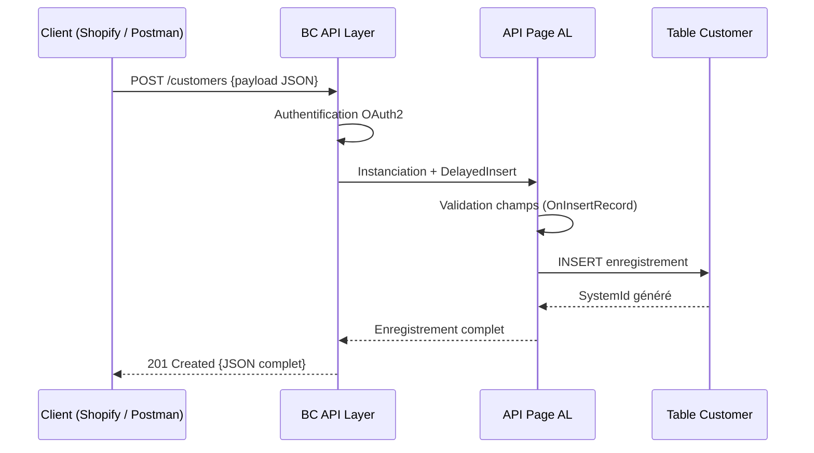
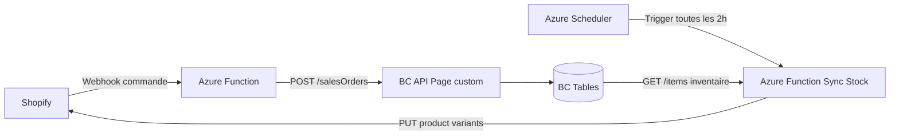

# APIs Business Central et intégration

## Objectifs pédagogiques

À l'issue de ce module, vous serez capable de :

1. **Distinguer** les trois types d'exposition API dans Business Central (OData, SOAP, API Pages) et choisir lequel utiliser selon le contexte
2. **Créer** une API Page complète en AL, avec relations imbriquées et validations métier
3. **Contrôler** les permissions et l'authentification OAuth2 sur les endpoints BC
4. **Diagnostiquer** les erreurs courantes (401, 403, 404, 500) via Postman et les logs BC
5. **Appliquer** les bonnes pratiques de performance et de sécurité propres aux APIs BC

---

## Mise en situation

Votre client gère ses commandes dans Business Central. Son équipe e-commerce vient de déployer une boutique Shopify et veut synchroniser automatiquement les commandes : dès qu'une commande est confirmée côté Shopify, elle doit apparaître dans BC. De l'autre côté, le service financier a besoin d'exposer les données clients à un outil de BI externe.

Deux besoins, deux directions de flux, un seul enjeu : **comment Business Central expose-t-il ses données et comment accepte-t-il des données entrantes ?**

Ce module couvre le côté **serveur** : définir, exposer et sécuriser des données BC accessibles depuis l'extérieur. La consommation d'APIs externes depuis AL (le côté client) est traitée dans le module suivant.

---

## Contexte et problématique

Business Central vit rarement seul. Dans un SI réel, il coexiste avec des outils de BI, des portails client, des plateformes logistiques, des CRM, des marketplaces. L'intégration, c'est le nerf de la guerre.

Historiquement, Dynamics NAV s'intégrait via des web services SOAP — robustes mais verbeux, difficiles à consommer depuis des stacks modernes. Avec le passage à Business Central, Microsoft a introduit OData v4 et surtout les **API Pages**, un modèle pensé pour les intégrations REST modernes.

| Mécanisme | Protocole | Format | Cas d'usage typique |
|-----------|-----------|--------|---------------------|
| **SOAP Web Services** | SOAP/XML | XML | Intégrations legacy, NAV hérité |
| **OData Web Services** | REST/OData v4 | JSON / XML | Lecture de données, Power BI |
| **API Pages (Standard)** | REST | JSON | Intégrations modernes, Microsoft Flow |
| **API Pages (Custom)** | REST | JSON | Expositions métier sur mesure |

🧠 **Concept fondamental** — La différence entre une OData Page et une API Page n'est pas cosmétique. Une OData Page expose *toute* la page BC telle qu'elle est, champs UI inclus. Une API Page est **conçue pour l'intégration** : structure stable, versionnable, sans dépendance à l'affichage. Toute modification de l'interface BC n'affecte pas le contrat d'API.

---

## Les API Pages en AL — le cœur du sujet

### Pourquoi les API Pages sont le bon outil

Imaginez que vous exposiez votre page de saisie commande directement comme API. Elle contient des champs d'affichage calculés, des triggers UI, des champs conditionnels. Toute modification de l'interface casse l'intégration. C'est le piège classique des OData Web Services.

Les API Pages introduisent une séparation nette entre **la représentation métier** (pour l'intégration) et **la représentation UI** (pour l'utilisateur). Elles sont versionnées, stables dans le temps, publiées dans le catalogue `/api/` de BC, et consommables sans configuration manuelle dans l'admin BC.

### API Page minimale — Customer

Voici une API Page complète exposant les clients, avec les triggers de validation indispensables en production :

```al
page 50100 "Customer API"
{
    PageType = API;
    APIPublisher = 'mycompany';
    APIGroup = 'sales';
    APIVersion = 'v1.0';
    EntityName = 'customer';
    EntitySetName = 'customers';
    SourceTable = Customer;
    DelayedInsert = true;
    InsertAllowed = true;
    ModifyAllowed = true;
    DeleteAllowed = false;

    layout
    {
        area(Content)
        {
            field(id; Rec.SystemId)
            {
                Caption = 'id';
                Editable = false;
            }
            field(number; Rec."No.")
            {
                Caption = 'number';
            }
            field(displayName; Rec.Name)
            {
                Caption = 'displayName';
            }
            field(email; Rec."E-Mail")
            {
                Caption = 'email';
            }
            field(city; Rec.City)
            {
                Caption = 'city';
            }
            field(country; Rec."Country/Region Code")
            {
                Caption = 'country';
            }
            field(blocked; Rec.Blocked)
            {
                Caption = 'blocked';
            }
        }
    }

    trigger OnInsertRecord(var BelongsToSet: Boolean): Boolean
    var
        ErrInfo: ErrorInfo;
    begin
        if Rec.Name = '' then begin
            ErrInfo.Message := 'Customer name is required.';
            ErrInfo.DetailedMessage := 'The displayName field cannot be empty when creating a customer via API.';
            Error(ErrInfo);
        end;
        exit(true);
    end;

    trigger OnModifyRecord(): Boolean
    var
        ErrInfo: ErrorInfo;
    begin
        // Protéger le numéro client contre toute modification via API
        if Rec."No." <> xRec."No." then begin
            ErrInfo.Message := 'Customer number cannot be changed via API.';
            ErrInfo.DetailedMessage := StrSubstNo(
                'Attempted to change from %1 to %2. Use a new customer record instead.',
                xRec."No.", Rec."No."
            );
            Error(ErrInfo);
        end;
        exit(true);
    end;
}
```

Quelques points clés dans cette structure :

**`APIPublisher` / `APIGroup` / `APIVersion`** — Ces trois propriétés forment le chemin de l'endpoint. Avec les valeurs ci-dessus, l'URL sera :
```
/api/mycompany/sales/v1.0/companies({id})/customers
```

**`EntityName` / `EntitySetName`** — Le nom de la ressource en singulier et pluriel. BC gère automatiquement le routage REST (GET collection vs GET item).

**`DelayedInsert = true`** — Indispensable pour les POST via API. Sans ça, BC tente d'insérer l'enregistrement dès le premier champ reçu, avant que tous les champs obligatoires soient renseignés. L'erreur résultante parle de champs manquants sans jamais citer `DelayedInsert` — ce qui rend le diagnostic particulièrement difficile.

**`ErrorInfo`** — Préférer `ErrorInfo` à `Error()` simple pour que le client API reçoive un JSON structuré avec `message` et `details`. C'est la différence entre une intégration qui debug en 2 minutes et une qui tourne en rond pendant une journée.

### Les APIs standard Microsoft — ne pas réinventer la roue

Avant de créer votre propre API Page, vérifiez si Microsoft en fournit déjà une. BC embarque un catalogue d'API Pages standard pour les entités principales : customers, vendors, items, salesOrders, purchaseOrders, journals, etc.

Ces APIs vivent sous `/api/v2.0/` et sont documentées sur [learn.microsoft.com](https://learn.microsoft.com/en-us/dynamics365/business-central/dev-itpro/api-reference/v2.0/).

💡 **Point clé** — Les APIs standard sont maintenues par Microsoft et évoluent avec les mises à jour BC. Si votre besoin est couvert, utilisez-les. Elles évitent la maintenance et sont déjà testées en production par des milliers d'intégrateurs.

---

## Structure d'un appel API — de l'URL à la réponse

### Anatomie de l'URL

```
https://{tenant}.api.businesscentral.dynamics.com/v2.0/{tenant_id}/{environment}/api/{publisher}/{group}/{version}/companies({company_id})/customers
```

| Segment | Rôle |
|---------|------|
| `v2.0` | Version de l'API infrastructure BC (pas votre version métier) |
| `{environment}` | Nom de l'environnement BC (production, sandbox…) |
| `api/{publisher}/{group}/{version}` | Chemin vers votre API Page custom |
| `companies({company_id})` | Toujours présent — BC est multi-société |
| `customers` | Votre `EntitySetName` |

⚠️ **Comportement contre-intuitif** — Le `companies({company_id})` n'est pas optionnel même si votre BC n'a qu'une seule société. Tous les appels API passent par ce préfixe. Si vous l'omettez, vous obtenez un 404 sans message d'erreur explicite.

Exemple d'URL invalide vs valide :

```
# ❌ Invalide — manque le préfixe companies
GET /api/mycompany/sales/v1.0/customers

# ✅ Valide
GET /api/mycompany/sales/v1.0/companies(7b09e4a1-a7b3-4b2e-9f0c-3c5d8e1f2a6d)/customers
```

### Verbes HTTP supportés

| Verbe | Action BC | Condition |
|-------|-----------|-----------|
| `GET` | Lecture (liste ou item) | Page en lecture seule ou lecture/écriture |
| `POST` | Création | `InsertAllowed = true` (défaut) |
| `PATCH` | Mise à jour partielle | `ModifyAllowed = true` (défaut) |
| `DELETE` | Suppression | `DeleteAllowed = true` (défaut) |

Le flux d'un appel `POST /customers` ressemble à ça :



---

## Authentification — le point bloquant n°1 en intégration

BC SaaS n'accepte que OAuth 2.0. Pas de Basic Auth, pas d'API Key simple. C'est un choix de sécurité Microsoft assumé, et il impacte toutes vos intégrations.

### Les deux flux OAuth utilisés en pratique

**Authorization Code Flow** — Pour les applications où un utilisateur humain se connecte (Power BI, portails web, apps mobiles). L'utilisateur voit une page de login Microsoft.

**Client Credentials Flow** — Pour les intégrations machine-à-machine (M2M), sans utilisateur humain. C'est le flux utilisé pour Shopify → BC, pour des jobs de synchronisation, etc.

Pour le flux Client Credentials, la configuration se fait en deux étapes distinctes qui doivent toutes les deux être correctes :

```
Étape AAD :
  1. Créer une App Registration dans Azure Active Directory
  2. Générer un Client Secret (ou certificat)
  3. Accorder les permissions API Dynamics 365 Business Central

Étape BC :
  4. Créer un utilisateur de service dans BC
  5. Associer l'App Registration à cet utilisateur (via le champ "Authentication Email" ou la page "AAD Applications")
  6. Assigner un Permission Set BC à cet utilisateur
```

💡 **Point clé** — L'App Registration AAD vous donne un token valide, mais BC vérifie ensuite que l'application a des droits BC. Il faut **les deux** : permissions AAD **et** un utilisateur BC configuré. Un token AAD valide sans utilisateur BC correspondant donne un 401 ou 403 — selon la version BC et la configuration du tenant.

---

## Créer une API Page avec relations imbriquées

Les entités métier sont rarement plates. Une commande a des lignes. En REST, ça se modélise avec des sous-ressources. BC le supporte nativement via les **parts** d'une API Page.

```al
page 50101 "Sales Order API"
{
    PageType = API;
    APIPublisher = 'mycompany';
    APIGroup = 'sales';
    APIVersion = 'v1.0';
    EntityName = 'salesOrder';
    EntitySetName = 'salesOrders';
    SourceTable = "Sales Header";
    DelayedInsert = true;

    layout
    {
        area(Content)
        {
            field(id; Rec.SystemId) { Caption = 'id'; Editable = false; }
            field(number; Rec."No.") { Caption = 'number'; }
            field(customerNumber; Rec."Sell-to Customer No.") { Caption = 'customerNumber'; }
            field(orderDate; Rec."Order Date") { Caption = 'orderDate'; }
            field(status; Rec.Status) { Caption = 'status'; Editable = false; }
            field(amount; Rec.Amount) { Caption = 'amount'; Editable = false; }

            part(salesOrderLines; "Sales Order Lines API")
            {
                Caption = 'salesOrderLines';
                EntityName = 'salesOrderLine';
                EntitySetName = 'salesOrderLines';
                SubPageLink = "Document Type" = FIELD("Document Type"),
                              "Document No." = FIELD("No.");
            }
        }
    }

    trigger OnInsertRecord(var BelongsToSet: Boolean): Boolean
    begin
        if Rec."Sell-to Customer No." = '' then
            Error('customerNumber is required to create a sales order.');
        exit(true);
    end;
}
```

BC génère automatiquement l'URL imbriquée pour les lignes :

```
GET /salesOrders({id})/salesOrderLines
GET /salesOrders?$expand=salesOrderLines
```

🧠 **Concept fondamental** — Les relations imbriquées fonctionnent via des `part`. La page imbriquée doit elle aussi être de `PageType = API`. BC gère le filtrage automatiquement via `SubPageLink` — vous n'écrivez pas de code de filtrage manuel.

---

## Permission Set — qui peut faire quoi

Créer une API Page ne suffit pas. L'utilisateur qui l'appelle doit avoir les permissions nécessaires dans BC. Pour une API Page qui lit et crée des commandes :

```al
permissionset 50100 "Sales Order API Access"
{
    Assignable = true;
    Caption = 'Sales Order API Access';

    Permissions =
        tabledata "Sales Header" = RIMD,
        tabledata "Sales Line" = RIMD,
        tabledata Customer = R,
        tabledata Item = R,
        page "Sales Order API" = X,
        page "Sales Order Lines API" = X;
}
```

🧠 **Concept fondamental** — `tabledata` vs `page` dans un Permission Set : `tabledata` contrôle l'accès aux données brutes (R=Read, I=Insert, M=Modify, D=Delete), `page` contrôle l'accès à l'objet page (X=Execute). Pour une API Page, vous avez besoin **des deux**. Mettre uniquement `page = X` sans `tabledata = R` donne accès à la page mais un refus sur les données — l'erreur n'est pas toujours explicite.

Ce Permission Set est ensuite assigné à l'utilisateur de service BC lié à l'App Registration AAD.

---

## Filtrage OData — ce que le client peut faire sans code supplémentaire

Une fois votre API Page exposée, les clients peuvent filtrer, trier et paginer sans que vous n'écriviez une ligne de code supplémentaire. C'est OData v4 qui gère ça.

```
# Filtrer sur un champ
GET /customers?$filter=city eq 'Paris'

# Filtrer avec opérateurs
GET /items?$filter=unitPrice gt 100 and inventory gt 0

# Sélectionner uniquement certains champs
GET /customers?$select=number,displayName,email

# Trier
GET /customers?$orderby=displayName asc

# Paginer — toujours utiliser $top + $skip ensemble
GET /customers?$top=50&$skip=0
GET /customers?$top=50&$skip=50

# Inclure les relations imbriquées
GET /salesOrders?$expand=salesOrderLines&$top=20
```

⚠️ **Comportement contre-intuitif** — `$expand` sur une relation imbriquée sans `$top` peut générer des requêtes très lourdes. Un appel `GET /salesOrders?$expand=salesOrderLines` sur 500 commandes avec 20 lignes en moyenne ramène 10 000 lignes en une seule réponse. En production avec des volumes réels, ce type d'appel provoque des timeouts et des pics de charge SQL visibles dans les métriques BC.

---

## Pagination robuste pour synchronisations de masse

Pour synchroniser de grands volumes (100k clients, catalogue articles complet), la boucle de pagination doit être explicite, robuste et résistante aux erreurs réseau. Voici un pattern AL pour consommer votre propre API ou une API standard BC depuis un batch interne :

```al
// Pattern de pagination robuste — consommation d'une API paginée depuis AL
// Utile pour les tests de charge ou les synchronisations batch internes
procedure SyncLargeDataset()
var
    HttpClient: HttpClient;
    HttpRequest: HttpRequestMessage;
    HttpResponse: HttpResponseMessage;
    JsonResponse: JsonObject;
    JsonItems: JsonArray;
    JsonToken: JsonToken;
    NextLink: Text;
    BaseUrl: Text;
    PageSize: Integer;
    TotalProcessed: Integer;
    Success: Boolean;
begin
    PageSize := 200; // Recommandé : entre 100 et 500 selon la taille des enregistrements
    TotalProcessed := 0;
    BaseUrl := StrSubstNo(
        'https://api.businesscentral.dynamics.com/v2.0/%1/%2/api/v2.0/companies(%3)/customers?$top=%4&$select=number,displayName,email',
        TenantId, EnvironmentName, CompanyId, PageSize
    );
    NextLink := BaseUrl;

    repeat
        // Construire la requête
        HttpRequest.SetRequestUri(NextLink);
        HttpRequest.Method := 'GET';
        HttpRequest.GetHeaders().Add('Authorization', 'Bearer ' + GetAccessToken());

        // Appel avec gestion d'erreur réseau
        Success := HttpClient.Send(HttpRequest, HttpResponse);
        if not Success then begin
            LogError(StrSubstNo('Network error on page starting at: %1', NextLink));
            exit; // Ou implémenter un retry selon le pattern TryFunction
        end;

        if not HttpResponse.IsSuccessStatusCode() then begin
            LogError(StrSubstNo('HTTP %1 on customers API', HttpResponse.HttpStatusCode()));
            exit;
        end;

        // Parser la réponse
        HttpResponse.Content().ReadAs(JsonToken);
        JsonResponse := JsonToken.AsObject();

        // Traiter les enregistrements de la page courante
        JsonResponse.Get('value', JsonToken);
        JsonItems := JsonToken.AsArray();
        foreach JsonToken in JsonItems do
            ProcessCustomerRecord(JsonToken.AsObject());

        TotalProcessed += JsonItems.Count();

        // Chercher le lien vers la page suivante (OData @odata.nextLink)
        NextLink := '';
        if JsonResponse.Get('@odata.nextLink', JsonToken) then
            NextLink := JsonToken.AsValue().AsText();

    until NextLink = '';

    Message('Sync complete. Total records processed: %1', TotalProcessed);
end;
```

💡 **Point clé** — OData fournit `@odata.nextLink` dans la réponse quand il reste des pages à lire. Tester l'absence de ce champ est la méthode fiable pour détecter la fin de la collection, plus robuste que de compter les enregistrements reçus.

---

## Tester votre API — depuis Postman et diagnostiquer les erreurs

Avant d'intégrer avec un système tiers, testez toujours depuis Postman. Voici la séquence complète, erreurs incluses.

### 1. Obtenir un token OAuth2 (Client Credentials)

Dans Postman, onglet Authorization :
- Type : `OAuth 2.0`
- Grant Type : `Client Credentials`
- Token URL : `https://login.microsoftonline.com/{tenant_id}/oauth2/v2.0/token`
- Client ID : votre App Registration Client ID
- Client Secret : votre secret
- Scope : `https://api.businesscentral.dynamics.com/.default`

### 2. Récupérer l'ID de société

```
GET https://api.businesscentral.dynamics.com/v2.0/{tenant_id}/{environment}/api/v2.0/companies
```

Récupérez le `id` de votre société dans la réponse. Vous en aurez besoin dans toutes les URLs suivantes.

### 3. Tester votre endpoint

```
GET https://api.businesscentral.dynamics.com/v2.0/{tenant_id}/{environment}/api/mycompany/sales/v1.0/companies({company_id})/customers
```

### Diagnostiquer les erreurs courantes

Quand ça ne fonctionne pas, le code HTTP est votre premier indicateur — mais il faut savoir creuser :

**401 Unauthorized** — Le token est absent, expiré, ou invalide.
- Vérifier que le token est bien inclus dans le header `Authorization: Bearer {token}`
- Vérifier la date d'expiration du token (tokens BC = 1h)
- Vérifier que le scope utilisé est bien `https://api.businesscentral.dynamics.com/.default`
- Tester le token sur `https://jwt.ms` pour inspecter les claims

**403 Forbidden** — Le token est valide, mais l'accès est refusé côté BC.
- Étape 1 : Vérifier que l'utilisateur service existe dans BC (page "Users")
- Étape 2 : Vérifier que l'App Registration AAD est associée à cet utilisateur (champ "Authentication Email" ou page "AAD Applications")
- Étape 3 : Vérifier que le Permission Set est bien assigné à l'utilisateur
- Étape 4 : Vérifier que le Permission Set contient à la fois `tabledata = R` et `page = X`
- Étape 5 : Vérifier que l'utilisateur n'est pas bloqué dans BC

**404 Not Found** — L'URL ne correspond à aucun endpoint.
- Vérifier que l'extension est bien déployée sur l'environnement cible
- Vérifier l'orthographe exacte de `APIPublisher`, `APIGroup`, `APIVersion`, `EntitySetName`
- Vérifier que le `companies({id})` est présent dans l'URL
- Tester avec l'URL de l'API standard (`/api/v2.0/companies`) pour valider que l'infra fonctionne

**500 Internal Server Error** — Une erreur AL s'est produite côté BC.
- Vérifier si `DelayedInsert = true` est présent sur la page (cause la plus fréquente)
- Lire le corps de la réponse : BC inclut souvent le message d'erreur AL dans le JSON
- Activer Application Insights sur le tenant pour obtenir la stack trace complète

---

## Cas réel en entreprise — Shopify + Business Central

**Contexte** : une ETI utilise BC pour la gestion des stocks et Shopify pour la vente en ligne. Synchronisation des stocks toutes les 2 heures, création des commandes Shopify dans BC en temps réel via webhooks.

**Architecture retenue** :



**Ce qui a été créé côté BC** :

1. Une API Page `salesOrders` custom qui accepte les POST avec lignes imbriquées, et qui mappe les SKU Shopify sur les `Item No.` BC via une table de correspondance
2. Une API Page `itemInventory` en lecture seule exposant stock + prix, avec `SetLoadFields` pour ne charger que les champs nécessaires
3. Un utilisateur de service BC avec Permission Set minimal (`Sales Order Create` + `Item Read`)
4. L'App Registration AAD associée, avec rotation automatique du secret tous les 6 mois

**Métriques observées en production** :

- Délai moyen de création commande dans BC : **18 secondes** après confirmation Shopify (webhook → Azure Function → POST API BC → réponse 201)
- Pic de latence observé : **4,2 secondes** sur les POST avec lignes imbriquées contenant plus de 15 articles — résolu en ajoutant `DelayedInsert = true` sur la page lignes également (oubli initial)
- Taux de retry sur les appels entrants : **0,3%** — essentiellement des timeouts réseau transitoires gérés côté Azure Function
- Impact du `$expand` découvert tardivement : le premier appel de synchronisation stock utilisait `GET /items?$expand=itemVariants` sans `$top` sur un catalogue de 8 000 articles. Résultat : timeout systématique après 30 secondes. Correction : passage à une pagination `$top=500&$skip=N` avec `$expand` supprimé (les variantes récupérées séparément uniquement quand nécessaire)
- Rotation du secret AAD manquée une fois → 401 en production pendant 47 minutes avant détection. Correction : alerte Azure Monitor sur les erreurs 401 BC avec seuil de 5 erreurs / 10 minutes

---

## Permissions et sécurité

Quelques pratiques non négociables en production :

**Versionnez vos APIs dès le départ.** Même si vous êtes seul sur le projet. Quand un client tiers consomme votre endpoint `v1.0`, vous pourrez faire évoluer vers `v2.0` sans casser l'existant.

**Limitez les champs exposés au strict nécessaire.** Exposer tous les champs d'une table est tentant mais risqué : données sensibles, performances dégradées, couplage fort. Décidez explicitement quels champs font partie du contrat d'API.

**Utilisez `SystemId` comme identifiant de ressource, pas `No.`.** Le `No.` peut changer (renommage, migration). Le `SystemId` est un GUID immuable généré par BC, parfait comme identifiant REST stable.

**Testez avec un utilisateur à permissions minimales dès le début.** Il est tentant de tester avec l'admin BC. Le jour où l'intégration tourne avec l'utilisateur de service à permissions réduites, vous découvrez les 403 en prod. Testez avec le bon utilisateur dès le départ.

**Ne pas exposer des pages standard via OData Web Services pour des intégrations longue durée.** Les OData Web Services dépendent de la structure des pages et peuvent changer avec les mises à jour BC. Les API Pages custom sont votre contrat d'intégration stable.

**Planifiez la rotation des secrets AAD.** Un secret expiré en production = intégration coupée. Mettez en place une alerte sur les erreurs 401 répétées et documentez la procédure de rotation avant que ça arrive en urgence.

---

## Résumé

| Concept | Rôle | Points clés |
|---------|------|-------------|
| **API Page** | Expose des données BC comme endpoint REST | `PageType = API`, versionnée, stable |
| **OData Web Service** | Expose une page BC existante | Rapide à mettre en place, mais couplé à l'UI |
| **Client Credentials** | Auth M2M pour intégrations automatisées | App Registration AAD + utilisateur service BC |
| **DelayedInsert** | Permet les POST multi-champs | Obligatoire sur toute API Page en écriture |
| **Permission Set** | Contrôle d'accès à l'API | `tabledata` + `page` tous les deux nécessaires |
| **SystemId** | Identifiant stable d'une ressource | GUID immuable, à préférer à `No.` |
| **Filtrage OData** | `$filter`, `$select`, `$expand`, `$top`… | Disponible sans code AL supplémentaire |
| **ErrorInfo** | Erreurs structurées côté API | Message + DetailedMessage dans le JSON d'erreur |

La prochaine étape logique est d'inverser la perspective : jusqu'ici, BC est le **serveur** qui expose. Dans le module suivant, vous verrez BC comme **client** — comment AL consomme des APIs externes via les classes `HttpClient`, `JsonObject` et `JsonArray`.

---

<!-- snippet
id: bc_apipage_customer_full
type: concept
tech: business-central
level: intermediate
importance:
