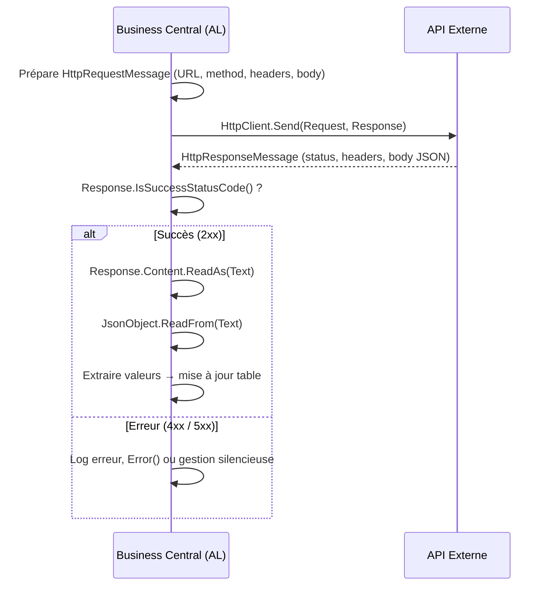

# HTTP, JSON et consommation d'APIs externes depuis AL

## Objectifs pédagogiques

À l'issue de ce module, vous serez capable de :

- Construire une requête HTTP sortante depuis AL avec `HttpClient`, `HttpRequestMessage` et `HttpHeaders`
- Parser et naviguer dans une réponse JSON avec les types `JsonObject`, `JsonArray` et `JsonToken`
- Gérer les erreurs HTTP et les cas limites d'un appel API externe (timeout, code non-200, JSON malformé)
- Sécuriser les clés d'API et tokens en évitant de les hardcoder dans le code AL
- Mettre en œuvre le mécanisme de permission `[NonDebuggable]` et les App Secrets pour les credentials

---

## Mise en situation

Votre client utilise Business Central pour gérer ses achats. Il veut que chaque fournisseur soit automatiquement évalué via un service externe de scoring crédit (une API REST tierce) dès qu'une fiche fournisseur est enregistrée. L'API retourne un score JSON avec quelques champs imbriqués. Le résultat doit être stocké dans un champ personnalisé sur la table Vendor.

Vous devez donc : déclencher un appel HTTP depuis un event subscriber, parser la réponse JSON, extraire les bonnes valeurs, gérer les erreurs proprement, et ne pas exposer la clé API dans le code source.

C'est exactement ce que couvre ce module.

---

## Contexte : pourquoi c'est différent d'un appel API interne

Le module précédent couvrait les APIs Business Central — c'est-à-dire exposer des données BC vers l'extérieur. Ici, on fait l'inverse : BC appelle un service tiers. Ce changement de sens change tout.

Quand BC est le consommateur, vous n'avez pas la main sur la disponibilité du service distant, son format de réponse, ses codes d'erreur ou ses limites de rate. Vous travaillez dans un sandbox HTTP contraint par les règles BC (pas de sockets TCP arbitraires, pas de bibliothèques externes, pas d'accès fichier). Tout passe par les types AL natifs `HttpClient`, `HttpRequestMessage`, `HttpResponseMessage` et la famille `Json*`.

Une autre contrainte souvent sous-estimée : en SaaS BC, chaque appel HTTP sortant doit être déclaré dans le manifest de l'extension (`app.json`) via les `allowedHttpRequests` ou dans les permissions appropriées. Si vous oubliez cette déclaration, l'appel échoue silencieusement ou lève une erreur de permission à l'exécution — pas à la compilation.

---

## Construire une requête HTTP sortante

### Les quatre types à connaître

AL propose un petit ensemble de types pour faire du HTTP. Ils couvrent la majorité des cas REST :

| Type | Rôle |
|------|------|
| `HttpClient` | Objet principal — envoie la requête |
| `HttpRequestMessage` | Encapsule méthode, URL, headers, body |
| `HttpResponseMessage` | Contient le code HTTP, les headers et le body de réponse |
| `HttpHeaders` | Gère les en-têtes (request ou response) |
| `HttpContent` | Représente le body (texte, JSON…) |

L'usage de base ressemble à ceci :

```al
procedure CallCreditScoringAPI(VendorRegistrationNo: Text): Text
var
    Client: HttpClient;
    Request: HttpRequestMessage;
    Response: HttpResponseMessage;
    Content: HttpContent;
    ResponseText: Text;
    Headers: HttpHeaders;
begin
    Request.Method := 'GET';
    Request.SetRequestUri('https://api.creditscore.example/v1/score?reg=' + VendorRegistrationNo);

    // Ajout d'un header d'authentification
    Request.GetHeaders(Headers);
    Headers.Add('Authorization', 'Bearer ' + GetAPIKey());
    Headers.Add('Accept', 'application/json');

    // Envoi synchrone
    if not Client.Send(Request, Response) then
        Error('Impossible de joindre le service de scoring crédit.');

    if not Response.IsSuccessStatusCode() then
        Error('Erreur API : %1 %2', Response.HttpStatusCode(), Response.ReasonPhrase());

    Response.Content().ReadAs(ResponseText);
    exit(ResponseText);
end;
```

💡 `Client.Send()` est **synchrone** en AL. Il bloque l'exécution jusqu'à réception de la réponse ou timeout. Il n'existe pas d'appel asynchrone natif — si vous avez besoin de non-blocant, il faut passer par une Job Queue.

### POST avec un body JSON

Pour envoyer des données, par exemple pour une API qui attend un payload :

```al
var
    RequestBody: Text;
    ContentHeaders: HttpHeaders;
begin
    RequestBody := '{"registrationNo":"' + VendorRegistrationNo + '","country":"FR"}';

    Content.WriteFrom(RequestBody);
    Content.GetHeaders(ContentHeaders);
    // Remplacer l'en-tête Content-Type par défaut
    if ContentHeaders.Contains('Content-Type') then
        ContentHeaders.Remove('Content-Type');
    ContentHeaders.Add('Content-Type', 'application/json');

    Request.Method := 'POST';
    Request.SetRequestUri('https://api.creditscore.example/v1/score');
    Request.Content(Content);
end;
```

⚠️ Le `Content-Type` sur `HttpContent` est un header de **content**, pas de request. Il faut appeler `Content.GetHeaders()`, pas `Request.GetHeaders()`. C'est une source d'erreur fréquente — les deux familles de headers sont séparées en AL.

---

## Parser une réponse JSON

### La hiérarchie des types Json*

Une réponse JSON est rarement un objet plat. Elle contient souvent des objets imbriqués, des tableaux, des valeurs scalaires. AL gère ça avec cinq types :

```
JsonToken      ← type racine générique (tout est un JsonToken)
├── JsonValue  ← string, number, boolean, null
├── JsonObject ← { "clé": valeur, ... }
└── JsonArray  ← [ valeur, valeur, ... ]
```

La logique de parsing est toujours la même : on lit le body en `Text`, on parse en `JsonObject` ou `JsonArray`, puis on navigue avec `Get()` et on extrait les valeurs avec `AsValue()`, `AsObject()`, `AsArray()`.

### Exemple concret

Supposons que l'API retourne :

```json
{
  "vendorId": "V-00123",
  "score": 742,
  "riskLevel": "low",
  "details": {
    "paymentHistory": "good",
    "debtRatio": 0.18
  },
  "flags": ["verified", "eu_registered"]
}
```

Voici comment extraire ces données :

```al
procedure ParseScoringResponse(JsonText: Text; var Score: Integer; var RiskLevel: Text; var DebtRatio: Decimal)
var
    Root: JsonObject;
    Details: JsonObject;
    Flags: JsonArray;
    Token: JsonToken;
    FlagToken: JsonToken;
    i: Integer;
begin
    // Parsage de la racine
    if not Root.ReadFrom(JsonText) then
        Error('Réponse JSON invalide ou inattendue.');

    // Extraction de champs simples
    Root.Get('score', Token);
    Score := Token.AsValue().AsInteger();

    Root.Get('riskLevel', Token);
    RiskLevel := Token.AsValue().AsText();

    // Navigation dans un objet imbriqué
    Root.Get('details', Token);
    Details := Token.AsObject();
    Details.Get('debtRatio', Token);
    DebtRatio := Token.AsValue().AsDecimal();

    // Parcours d'un tableau
    Root.Get('flags', Token);
    Flags := Token.AsArray();
    for i := 0 to Flags.Count() - 1 do begin
        Flags.Get(i, FlagToken);
        // FlagToken.AsValue().AsText() → "verified", "eu_registered"...
    end;
end;
```

🧠 `JsonToken` est le dénominateur commun. Chaque appel à `Get()` retourne un `JsonToken` que vous devez ensuite caster avec `.AsValue()`, `.AsObject()` ou `.AsArray()` selon ce que vous attendez. Si vous castez dans le mauvais type, AL lève une erreur à l'exécution.

### Vérifier l'existence d'un champ avant de lire

Les APIs tierces ne respectent pas toujours leur propre documentation. Un champ peut être absent, null, ou changer de type entre deux versions. Toujours vérifier :

```al
if Root.Contains('riskLevel') then begin
    Root.Get('riskLevel', Token);
    if not Token.AsValue().IsNull() then
        RiskLevel := Token.AsValue().AsText();
end;
```

Construire un objet JSON à envoyer fonctionne en miroir :

```al
var
    Payload: JsonObject;
    Nested: JsonObject;
    Arr: JsonArray;
    PayloadText: Text;
begin
    Nested.Add('country', 'FR');
    Nested.Add('vatRegistered', true);

    Arr.Add('priority');
    Arr.Add('new_vendor');

    Payload.Add('registrationNo', VendorRegistrationNo);
    Payload.Add('metadata', Nested);
    Payload.Add('tags', Arr);

    Payload.WriteTo(PayloadText);
    // PayloadText contient le JSON sérialisé
end;
```

---

## Flux complet d'un appel API en AL

Voici comment les pièces s'assemblent dans un vrai flux :



---

## Gestion des erreurs : ce qu'on voit rarement dans les exemples

Un appel API peut échouer de plusieurs façons qui n'ont rien à voir l'une avec l'autre :

**1. Échec réseau** — `Client.Send()` retourne `false`. L'API est inaccessible, le DNS ne résout pas, le timeout est atteint. Dans ce cas, `Response` est vide.

**2. Erreur HTTP** — `Send()` retourne `true`, mais `Response.HttpStatusCode()` est 400, 401, 404, 429, 503… Le service a répondu, mais avec une erreur. `IsSuccessStatusCode()` retourne `false`.

**3. Réponse inattendue** — Status 200, mais le JSON est malformé, manque de champs, ou le format a changé. `JsonObject.ReadFrom()` retourne `false`, ou un `Get()` échoue.

Gérer ces trois cas séparément donne un code bien plus robuste :

```al
// Cas 1 : échec réseau
if not Client.Send(Request, Response) then begin
    LogIntegrationError('CreditScore', 'Network failure for vendor: ' + VendorNo);
    exit;
end;

// Cas 2 : erreur HTTP
if not Response.IsSuccessStatusCode() then begin
    Response.Content().ReadAs(ErrorBody);
    LogIntegrationError('CreditScore', 
        StrSubstNo('HTTP %1: %2 — %3', Response.HttpStatusCode(), Response.ReasonPhrase(), ErrorBody));
    exit;
end;

// Cas 3 : JSON inattendu
Response.Content().ReadAs(RawJson);
if not Root.ReadFrom(RawJson) then begin
    LogIntegrationError('CreditScore', 'Invalid JSON: ' + CopyStr(RawJson, 1, 200));
    exit;
end;
```

💡 Pour les APIs qui retournent un body d'erreur JSON (c'est courant — beaucoup d'APIs REST retournent `{"error": "invalid_key"}` avec un 401), pensez à lire `Response.Content()` même en cas d'erreur HTTP. Ces informations sont précieuses pour le debug.

---

## Sécuriser les clés d'API

Hardcoder une clé d'API dans le code AL est une faute grave en environnement SaaS. Le code est versionné, potentiellement distribué via AppSource, et la clé se retrouve exposée.

### Isolated Storage — la bonne approche

BC propose `IsolatedStorage` pour stocker des valeurs sensibles par tenant, chiffrées au repos :

```al
// Écriture de la clé (à faire une seule fois, depuis une page de setup par exemple)
IsolatedStorage.Set('CreditScoreAPIKey', 'sk-live-xxxxxxxxxxxxxxxx', DataScope::Module);

// Lecture au moment de l'appel
procedure GetAPIKey(): Text
var
    APIKey: Text;
begin
    if not IsolatedStorage.Get('CreditScoreAPIKey', DataScope::Module, APIKey) then
        Error('Clé API CreditScore non configurée. Vérifiez la page de paramétrage.');
    exit(APIKey);
end;
```

`DataScope::Module` signifie que la valeur est isolée par extension et par tenant — deux tenants différents ont des stockages séparés. C'est exactement ce qu'on veut pour une clé d'API.

### Protéger la clé en debug

La procédure qui lit la clé ne doit pas être inspectable dans le débogueur AL. L'attribut `[NonDebuggable]` empêche un développeur de voir la valeur en session de debug :

```al
[NonDebuggable]
procedure GetAPIKey(): Text
var
    APIKey: Text;
begin
    IsolatedStorage.Get('CreditScoreAPIKey', DataScope::Module, APIKey);
    exit(APIKey);
end;
```

⚠️ `[NonDebuggable]` ne chiffre pas la donnée en mémoire — il masque simplement la valeur dans les outils de debug. Il ne remplace pas un stockage sécurisé, il le complète.

---

## Déclarer les URL autorisées dans app.json

En environnement SaaS, BC applique une liste blanche des URL que votre extension peut appeler. Si vous ne déclarez pas le domaine, l'appel est bloqué à l'exécution.

Dans `app.json` :

```json
{
  "allowedHttpRequests": [
    {
      "url": "https://api.creditscore.example",
      "note": "Credit scoring API externe"
    }
  ]
}
```

La vérification se fait au déploiement pour certaines validations, et à l'exécution pour le blocage effectif. En OnPrem, cette restriction n'existe pas — mais maintenir la déclaration reste une bonne pratique pour la traçabilité.

---

## Cas réel : subscriber sur OnAfterModifyEvent de Vendor

Voici comment assembler tout ce qui précède dans un contexte réel — un event subscriber qui se déclenche à la modification d'une fiche fournisseur :

```al
[EventSubscriber(ObjectType::Table, Database::Vendor, 'OnAfterModifyEvent', '', false, false)]
local procedure OnVendorModified(var Rec: Record Vendor; var xRec: Record Vendor; RunTrigger: Boolean)
var
    Score: Integer;
    RiskLevel: Text;
    DebtRatio: Decimal;
    JsonResponse: Text;
begin
    // On ne déclenche le scoring que si le numéro SIRET a changé
    if Rec."Registration No." = xRec."Registration No." then
        exit;

    if Rec."Registration No." = '' then
        exit;

    JsonResponse := CallCreditScoringAPI(Rec."Registration No.");
    if JsonResponse = '' then
        exit;

    ParseScoringResponse(JsonResponse, Score, RiskLevel, DebtRatio);

    Rec."Credit Score" := Score;
    Rec."Risk Level" := RiskLevel;
    Rec.Modify(false);  // false = sans déclencher les triggers → évite la récursion
end;
```

🧠 Le `Modify(false)` dans un event subscriber est essentiel. Si vous appelez `Modify(true)`, vous redéclenchez `OnAfterModifyEvent`, ce qui relance le scoring, ce qui rappelle `Modify(true)`… boucle infinie. Toujours passer `false` quand vous modifiez le record reçu dans un subscriber.

---

## Bonnes pratiques

**Centraliser les appels HTTP** dans des codeunits dédiés (`CreditScoringIntegration`, `WeatherAPIConnector`…), jamais directement dans des pages ou des tables. Ça facilite les tests, la réutilisation et la maintenance.

**Logger les appels** — au minimum : timestamp, URL appelée, code retour, durée si possible. Sans log, déboguer une intégration en production est une galère. Une table de log d'intégration simple suffit.

**Prévoir un circuit breaker manuel** — une case à cocher dans une page de setup pour désactiver l'appel API sans avoir à déployer une nouvelle version. Indispensable quand le service externe est down et que ça cascade sur les performances BC.

**Ne jamais bloquer un workflow critique sur un appel externe** — si le scoring de crédit échoue, la création du fournisseur ne doit pas échouer. Logguer l'erreur, continuer le flux, relancer via Job Queue si nécessaire.

**Tester avec des mocks** — en développement, pointez vers un serveur mock (RequestBin, Mockoon…) pour ne pas consommer de quota API et tester les cas d'erreur (503, JSON malformé, timeout simulé) de façon reproductible.

---

## Résumé

| Concept | Rôle | Points clés |
|---------|------|-------------|
| `HttpClient` | Envoie la requête HTTP | Appel synchrone — bloque jusqu'à réponse ou timeout |
| `HttpRequestMessage` | Construit la requête | Méthode, URL, headers request |
| `HttpContent` | Body de la requête | Headers content séparés des headers request |
| `HttpResponseMessage` | Réponse reçue | Status code, reason, body à lire avec `ReadAs()` |
| `JsonObject / JsonArray` | Navigation JSON | Parse avec `ReadFrom()`, extrait avec `Get()` + cast |
| `JsonToken` | Type générique JSON | Toujours caster avant utilisation (AsValue/AsObject/AsArray) |
| `IsolatedStorage` | Stockage sécurisé | Par tenant et par module — pour les clés API et secrets |
| `[NonDebuggable]` | Protection debug | Masque les valeurs dans le débogueur AL |
| `allowedHttpRequests` | Whitelist SaaS | À déclarer dans app.json sinon appel bloqué |

Le module suivant couvrira les OData actions et le Read Scale-Out — une autre façon d'interagir avec BC, cette fois depuis l'extérieur, avec des considérations de performance en lecture à grande échelle.

---

<!-- snippet
id: al_httpclient_send_basic
type: concept
tech: AL
level: intermediate
importance: high
format: knowledge
tags: al, http, httpclient, rest, integration
title: HttpClient.Send() est synchrone et bloquant en AL
content: Client.Send(Request, Response) bloque l'exécution AL jusqu'à réception de la réponse ou expiration du timeout. Il n'existe pas d'appel asynchrone natif. Si le service est lent, ça gèle la session. Contournement : passer l'appel dans une Job Queue Entry pour l'exécuter hors session utilisateur.
description: Send() est toujours bloquant en AL — déléguer les appels lents à une Job Queue pour ne pas geler la session utilisateur.
-->

<!-- snippet
id: al_http_content_headers_separation
type: warning
tech: AL
level: intermediate
importance: high
format: knowledge
tags: al, http, headers, content-type, httpcontent
title: Headers request vs headers content — deux familles séparées en AL
content: Piège : définir Content-Type via Request.GetHeaders() n'a aucun effet sur le body. Content-Type appartient aux headers du content, accessibles via Content.GetHeaders(). Si vous le mettez au mauvais endroit, l'API reçoit un body sans Content-Type déclaré → souvent un 415 Unsupported Media Type. Correction : toujours appeler Content.GetHeaders() pour modifier Content-Type.
description: Content-Type se définit sur Content.GetHeaders(), pas sur Request.GetHeaders() — erreur classique qui génère des 415 côté API.
-->

<!-- snippet
id: al_jsontoken_cast_required
type: concept
tech: AL
level: intermediate
importance: high
format: knowledge
tags: al, json, jsontoken, jsonobject, jsonvalue
title: JsonToken doit toujours être casté avant utilisation
content: Chaque appel à JsonObject.Get('key', Token) retourne un JsonToken générique. Pour lire la valeur, il faut caster : Token.AsValue().AsText(), Token.AsObject(), ou Token.AsArray(). Caster dans le mauvais type lève une erreur à l'exécution — pas à la compilation. Toujours vérifier la structure JSON attendue avant de caster.
description: JsonToken est générique — un cast incorrect (ex: AsObject() sur une string) lève une erreur runtime, pas de vérification à la compilation.
-->

<!-- snippet
id: al_json_contains_before_get
type: tip
tech: AL
level: intermediate
importance: high
format: knowledge
tags: al, json, parsing, robustesse, api
title: Vérifier Contains() avant Get() pour les champs optionnels
content: Avant de lire un champ JSON potentiellement absent, tester Root.Contains('fieldName') puis vérifier Token.AsValue().IsNull(). Sans cette vérification, un champ manquant dans la réponse API génère une erreur runtime non gérée. Les APIs tierces suppriment souvent les champs null au lieu de les envoyer explicitement.
description: Root.Get() sur un champ absent lève une erreur runtime — toujours précéder d'un Contains() pour les champs optionnels d'une API tierce.
-->

<!-- snippet
id: al_isolated_storage_api_key
type: tip
tech: AL
level: intermediate
importance: high
format: knowledge
tags: al, isolatedstorage, securite, api-key, saas
title: Stocker les clés API dans IsolatedStorage, jamais dans le code
content: IsolatedStorage.Set('CreditScoreAPIKey', '<VALEUR>', DataScope::Module) stocke la clé chiffrée au repos, isolée par tenant et par extension. Pour lire : IsolatedStorage.Get('CreditScoreAPIKey', DataScope::Module, APIKey). Exposer la clé dans le code source la rend visible dans Git, dans AppSource et lors des déploiements multi-tenants.
description: IsolatedStorage isole les secrets par tenant et extension, chiffrés au repos — le seul endroit acceptable pour une clé API en AL SaaS.
-->

<!-- snippet
id: al_nondebuggable_attribute
type: tip
tech: AL
level: intermediate
importance: medium
format: knowledge
tags: al, securite, debug, nondebuggable, credentials
title: [NonDebuggable] masque les valeurs dans le débogueur AL
content: Décorer une procédure avec [NonDebuggable] empêche l'inspection de ses variables locales dans le débogueur AL. À utiliser sur toute procédure qui lit ou manipule un secret (clé API, token OAuth). Attention : ça masque en debug, ça ne chiffre pas en mémoire — c'est complémentaire à IsolatedStorage, pas un remplacement.
description: [NonDebuggable] masque les variables locales en session debug — à poser sur toute procédure lisant un secret depuis IsolatedStorage.
-->

<!-- snippet
id: al_allowed_http_requests_appjson
type: warning
tech: AL
level: intermediate
importance: high
format: knowledge
tags: al, saas, app-json, whitelist, http
title: Déclarer les domaines appelés dans allowedHttpRequests (app.json)
content: Piège SaaS : en BC cloud, tout appel HTTP vers un domaine non déclaré dans app.json est bloqué à l'exécution. L'erreur n'apparaît pas à la compilation. Ajouter dans app.json : "allowedHttpRequests": [{"url": "https://api.exemple.com", "note": "description"}]. En OnPrem cette restriction n'existe pas, mais la déclaration reste utile pour la traçabilité.
description: En BC SaaS, un domaine HTTP non déclaré dans allowedHttpRequests (app.json) est bloqué runtime — erreur invisible à la compilation.
-->

<!-- snippet
id: al_http_three_error_cases
type: concept
tech: AL
level: intermediate
importance: high
format: knowledge
tags: al, http, gestion-erreurs, api, robustesse
title: Trois types d'échec distincts sur un appel API en AL
content: 1) Échec réseau : Client.Send() retourne false, Response est vide — service inaccessible ou timeout. 2) Erreur HTTP : Send() retourne true mais IsSuccessStatusCode() retourne false (401, 404, 503…) — lire quand même Response.Content() pour le message d'erreur JSON. 3) JSON inattendu : status 200 mais JsonObject.ReadFrom() retourne false ou Get() échoue — format API changé. Chaque cas nécessite une branche de gestion séparée.
description: Un appel API peut échouer de 3 façons orthogonales (réseau, HTTP, JSON) — les gérer avec trois branches distinctes, pas un seul Error() global.
-->

<!-- snippet
id: al_modify_false_in_subscriber
type: warning
tech: AL
level: intermediate
importance: high
format: knowledge
tags: al, event-subscriber, modify, recursion, trigger
title: Toujours Modify(false) quand on modifie le Rec dans un subscriber
content: Piège : dans un EventSubscriber sur OnAfterModifyEvent, appeler Rec.Modify(true) redéclenche l'événement → boucle infinie jusqu'au stack overflow ou timeout. Correction : utiliser Rec.Modify(false) pour écrire les changements sans rejouer les triggers. Règle : dans un subscriber OnAfterModify, si vous devez persister une valeur sur le même record, passez toujours false.
description: Rec.Modify(true) dans OnAfterModifyEvent redéclenche l'événement → boucle infinie. Toujours Modify(false) pour persister sans rejouer les triggers.
-->

<!-- snippet
id: al_http_response_error_body
type: tip
tech: AL
level: intermediate
importance: medium
format: knowledge
tags: al, http, debug, api, error-handling
title: Lire le body même en cas d'erreur HTTP pour le message d'erreur
content: La plupart des APIs REST retournent un body JSON même pour les erreurs (ex: {"error":"invalid_api_key","code":401}). Après avoir détecté !Response.IsSuccessStatusCode(), appeler Response.Content().ReadAs(ErrorBody) pour capturer ce message. Sans ça, le log contient juste "401 Unauthorized" sans contexte — le message d'erreur est dans le body, pas dans le status.
description: En cas d'erreur HTTP, lire Response.Content() pour capturer le message JSON d'erreur — le status seul (401, 403…) n'est pas suffisant pour déboguer.
-->
