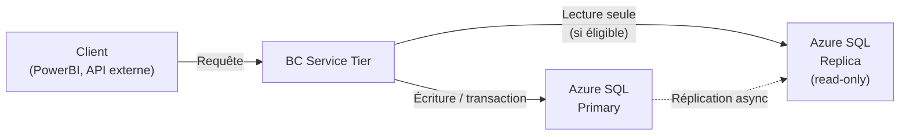

# OData actions et Read Scale-Out en AL

## Objectifs pédagogiques

À la fin de ce module, vous serez capable de :

1. **Exposer** une action OData depuis un Codeunit AL et la rendre invocable par un client externe
2. **Distinguer** les actions bound et unbound et choisir la bonne selon le contexte
3. **Comprendre** le mécanisme de Read Scale-Out et ses conditions d'activation
4. **Identifier** les cas où une requête bascule sur un réplica en lecture et quand elle ne le fait pas
5. **Éviter** les pièges de cohérence de données liés à l'utilisation du Scale-Out en production

---

## Mise en situation

Vous travaillez chez un intégrateur BC. Un client gère 80 000 commandes par mois et son équipe finance utilise un outil PowerBI + plusieurs scripts Python pour extraire des données et déclencher des validations à distance — notamment valider un lot de factures depuis un portail web maison.

Deux problèmes remontent en production :

- Les requêtes GET massives depuis PowerBI ralentissent les utilisateurs qui travaillent en parallèle dans BC
- Le script Python doit "pousser" une action métier (valider une facture) via l'API BC, mais l'équipe ne sait pas comment l'exposer proprement sans contourner la sécurité

Ce module répond exactement à ces deux problèmes.

---

## Contexte et problématique

### Pourquoi les actions OData existent

Quand on consomme une API BC en lecture, tout va bien — un GET sur `/api/v2.0/companies(...)/salesOrders` retourne des données, c'est simple. Mais dès qu'un système externe doit **déclencher un traitement métier** — valider, publier, annuler, recalculer — il faut autre chose qu'un PATCH ou un DELETE.

OData définit pour ça le concept d'**action** : un appel POST vers un endpoint nommé qui exécute une logique côté serveur et peut retourner un résultat. C'est l'équivalent d'un appel de fonction distant, avec les mêmes garanties transactionnelles que si c'était exécuté depuis BC directement.

En AL, vous exposez ces actions via des **Codeunits** décorés avec des attributs spécifiques. Le runtime BC prend en charge le routage OData vers votre code.

### Pourquoi le Read Scale-Out existe

De l'autre côté du problème : la lecture. BC SaaS tourne sur Azure SQL, et par défaut toutes les requêtes — lecture ou écriture — passent par la même base. Quand PowerBI tire des millions de lignes pendant que des utilisateurs valident des commandes, tout le monde souffre.

Microsoft a introduit le **Read Scale-Out** : les requêtes en lecture seule peuvent être automatiquement routées vers un **réplica secondaire** de la base Azure SQL. Ce réplica est en lecture seule, maintenu en quasi-temps réel par la réplication Azure SQL, et totalement invisible pour le code AL — sauf quand ce n'est pas le cas, et là ça devient un piège.

---

## OData Actions : fonctionnement détaillé

### Deux types d'actions : bound et unbound

La distinction est simple mais importante :

| Type | Portée | URL générée | Cas d'usage typique |
|------|--------|-------------|---------------------|
| **Bound** | Liée à une instance d'entité | `POST .../salesInvoices(id)/Microsoft.NAV.post` | Valider UNE facture précise |
| **Unbound** | Indépendante de toute entité | `POST .../Microsoft.NAV.recalculatePrices` | Traitement global, sans contexte d'entité |

Une action bound reçoit automatiquement le contexte de l'entité (son ID, ses champs). Une action unbound ne reçoit que ce que vous lui passez explicitement en paramètres.

### Exposer une action depuis un Codeunit AL

La mécanique repose sur trois attributs :

```al
[ServiceEnabled]
codeunit 50100 "Invoice Actions API"
{
    // Indique que ce codeunit est exposé via OData/API
    Subtype = Normal;

    [ServiceEnabled]
    procedure PostInvoice(var SalesInvoiceHeader: Record "Sales Invoice Header")
    begin
        // Logique de validation
        SalesInvoiceHeader.TestField(Status, SalesInvoiceHeader.Status::Open);
        CODEUNIT.Run(CODEUNIT::"Sales-Post", SalesInvoiceHeader);
    end;
}
```

> ⚠️ `[ServiceEnabled]` doit être posé **à la fois** sur le codeunit ET sur chaque procédure que vous voulez exposer. Oublier l'un ou l'autre et l'action n'apparaît tout simplement pas dans le metadata OData — sans erreur, sans avertissement.

### Ce que produit AL côté metadata OData

Quand vous publiez ce codeunit, BC génère automatiquement une entrée dans le document `$metadata` OData :

```xml
<Action Name="PostInvoice" IsBound="true">
  <Parameter Name="bindingParameter" Type="NAV.SalesInvoiceHeader"/>
  <ReturnType Type="Edm.Boolean"/>
</Action>
```

Le client externe voit cette action et sait comment l'invoquer. C'est OData qui gère la sérialisation des paramètres — vous n'avez pas à écrire de parsing JSON manuel.

### Appeler l'action depuis un client externe

Un appel typique depuis Python ou Postman ressemble à ça :

```http
POST /api/v2.0/companies(company-id)/salesInvoices(invoice-id)/Microsoft.NAV.PostInvoice
Authorization: Bearer <token>
Content-Type: application/json

{}
```

Le corps peut être vide si l'action ne prend pas de paramètres supplémentaires. S'il y en a, ils s'expriment en JSON dans le body :

```json
{
  "postingDate": "2025-01-15",
  "sendEmail": true
}
```

Ces paramètres correspondent exactement aux paramètres AL de votre procédure — BC fait le mapping automatiquement.

### Retourner des données depuis une action

Une action peut retourner une valeur scalaire ou même un enregistrement. En AL :

```al
[ServiceEnabled]
procedure ValidateAndGetResult(var SalesHeader: Record "Sales Header"): Text
var
    ResultMsg: Text;
begin
    if SalesHeader.Status = SalesHeader.Status::Open then begin
        // traitement...
        ResultMsg := 'Validated';
    end else
        ResultMsg := 'Already processed';

    exit(ResultMsg);
end;
```

Le client reçoit alors la valeur de retour dans la réponse HTTP :

```json
{
  "@odata.context": "...",
  "value": "Validated"
}
```

💡 Si votre action ne retourne rien, déclarez-la `procedure` sans type de retour. BC génère alors une action OData sans `ReturnType`, et le client reçoit un HTTP 204 No Content — ce qui est parfaitement valide.

### Gestion des erreurs

Si votre code AL lève une erreur (via `Error(...)` ou une exception non gérée), BC la traduit automatiquement en réponse HTTP 400 ou 500, avec le message d'erreur encapsulé dans le JSON OData standard :

```json
{
  "error": {
    "code": "Internal_ServerError",
    "message": "The invoice cannot be posted because..."
  }
}
```

🧠 C'est un comportement fondamental : **vous n'avez pas à gérer le code HTTP vous-même**. Votre AL se comporte comme du code normal — si ça explose, le runtime BC traduit l'exception en réponse d'erreur propre. En revanche, si vous voulez retourner un message d'erreur métier précis, utilisez `Error()` avec un message explicite — les messages génériques "Unhandled exception" ne donnent aucun contexte au client.

---

## Read Scale-Out : comprendre le routage des requêtes

### Le principe de base



Le réplica est maintenu par Azure SQL via la réplication built-in. Le délai de réplication est typiquement **inférieur à quelques secondes** en conditions normales, mais ce n'est **pas une garantie temps réel stricte**.

### Conditions d'éligibilité au Scale-Out

Votre requête est routée vers le réplica **seulement si toutes ces conditions sont vraies** :

1. L'environnement BC SaaS a le Read Scale-Out activé (activé par défaut en SaaS depuis BC 21, configurable par l'admin)
2. La requête est une lecture pure — aucune écriture dans la même session
3. La session n'est pas dans une **transaction explicite** (`BEGIN TRANSACTION` ou équivalent AL)
4. Vous n'avez pas désactivé le Scale-Out explicitement dans le code

Sur le troisième point : dès qu'un Codeunit ouvre une transaction AL (via `BEGINTRANSACTION` ou implicitement par une écriture), **toutes** les lectures suivantes dans cette transaction repassent sur le primary. Le runtime ne peut pas prendre le risque de lire des données potentiellement obsolètes dans une transaction en cours.

### Désactiver le Scale-Out pour une requête spécifique

Il y a des cas où vous savez que vous avez besoin de données **strictement à jour** — un audit, un contrôle avant validation, une lecture post-écriture. Dans ce cas, vous dites explicitement au runtime de ne pas router vers le réplica :

```al
var
    CriticalRecord: Record "GL Entry";
begin
    CriticalRecord.ReadIsolation := IsolationLevel::ReadCommitted;
    // Ceci force la lecture sur le primary
    // La syntaxe exacte dépend de la version AL
end;
```

La méthode recommandée depuis BC 22+ est d'utiliser `DatabaseInstance.PrimaryOnly()` ou le paramètre `AllowOutOfTransactionRead` selon le contexte. En pratique, dans les Pages et API Pages, vous pouvez aussi utiliser le trigger `OnBeforeGetCurrentRecord` pour forcer un refresh depuis le primary.

> ⚠️ Le piège classique : un développeur active le Read Scale-Out pour gagner de la performance, puis constate que les données lues juste après une écriture semblent "en retard". Le réplica n'est pas encore synchronisé. C'est un bug de cohérence — pas un bug réseau.

### Ce que ça change pour vos API Pages

Les API Pages AL bénéficient du Scale-Out automatiquement pour les requêtes GET. Aucune modification de code nécessaire — c'est transparent. Mais si votre API Page utilise un trigger `OnInsert`, `OnModify` ou `OnDelete`, ces opérations forcent le retour sur le primary pour toute la durée de la requête.

💡 Une API Page en lecture pure (GET seulement, sans triggers d'écriture) bénéficie du Scale-Out sans configuration. C'est le cas le plus courant pour PowerBI et les dashboards — et c'est exactement pour ça que cette feature a été conçue.

---

## Construction progressive : exposer une action et optimiser la lecture

### Étape 1 — Action minimale fonctionnelle

```al
[ServiceEnabled]
codeunit 50101 "Invoice API Actions"
{
    [ServiceEnabled]
    procedure ReleaseInvoice(var SalesHeader: Record "Sales Header")
    begin
        SalesHeader.TestField("Document Type", SalesHeader."Document Type"::Invoice);
        SalesHeader.TestField(Status, SalesHeader.Status::Open);
        CODEUNIT.Run(CODEUNIT::"Release Sales Document", SalesHeader);
    end;
}
```

Testable immédiatement via Postman. Aucun paramètre supplémentaire, logique de validation en deux lignes.

### Étape 2 — Ajout de paramètres et valeur de retour

```al
[ServiceEnabled]
procedure ReleaseInvoice(
    var SalesHeader: Record "Sales Header";
    PostingDate: Date;
    SendConfirmation: Boolean
): Text
var
    OldPostingDate: Date;
begin
    SalesHeader.TestField("Document Type", SalesHeader."Document Type"::Invoice);
    SalesHeader.TestField(Status, SalesHeader.Status::Open);

    if PostingDate <> 0D then begin
        OldPostingDate := SalesHeader."Posting Date";
        SalesHeader."Posting Date" := PostingDate;
        SalesHeader.Modify();
    end;

    CODEUNIT.Run(CODEUNIT::"Release Sales Document", SalesHeader);

    if SendConfirmation then
        // Logique d'envoi email...
        ;

    exit(StrSubstNo('Invoice %1 released on %2', SalesHeader."No.", SalesHeader."Posting Date"));
end;
```

### Étape 3 — Contrôle du Scale-Out pour les lectures critiques

Si votre Codeunit effectue une lecture qui doit être parfaitement fraîche (par exemple, relire la facture juste après l'avoir modifiée pour retourner ses données à jour au client) :

```al
// Après modification, forcer la lecture sur le primary
SalesHeader.SetRecFilter();
SalesHeader.Find('=');
// À ce stade, si Scale-Out est actif et qu'on n'est plus en transaction,
// la lecture pourrait tomber sur le réplica.
// Solution : rester dans la même transaction ou utiliser les mécanismes
// de contrôle d'isolation selon la version BC.
```

La règle pratique : si vous modifiez un enregistrement et le relisez dans la **même requête OData**, vous êtes en transaction implicite, donc vous lisez sur le primary — pas de problème. Le risque apparaît quand deux requêtes séparées sont émises en succession rapide.

---

## Cas réel en entreprise

### Contexte

Un éditeur ISV développe un portail client connecté à BC via API. Les acheteurs peuvent valider leurs bons de commande en ligne. Le flux :

1. Le portail envoie un GET pour récupérer la liste des PO en attente → Scale-Out actif, aucun problème
2. L'acheteur clique "Valider" → le portail envoie un POST sur l'action OData `ApprovePurchaseOrder`
3. BC exécute la logique de validation et retourne le statut mis à jour

**Problème rencontré en production** : après validation, le portail rechargait immédiatement la liste (GET), et certaines commandes apparaissaient encore comme "en attente" pendant 1 à 2 secondes. Les utilisateurs pensaient que leur validation n'avait pas fonctionné et cliquaient à nouveau — double validation.

**Cause** : le GET post-validation tombait sur le réplica qui n'était pas encore synchronisé.

**Solution** : l'action OData a été modifiée pour retourner directement le nouveau statut de la commande dans sa réponse. Le portail utilisait cette valeur de retour pour mettre à jour son UI localement, sans relancer de GET immédiat. Le Scale-Out n'était plus un problème — la source de vérité venait de la réponse de l'action elle-même, exécutée sur le primary.

C'est une approche pattern "command returns result" — commune dans les APIs bien conçues — et elle évite complètement la fenêtre de désynchronisation réplica.

---

## Bonnes pratiques

**Sur les actions OData :**

- Nommez vos actions avec un verbe métier clair — `PostInvoice`, `ApprovePurchaseOrder`, `RecalculatePrices` — pas des noms techniques comme `ExecuteProcess1`
- Validez les préconditions en début d'action et renvoyez des messages d'erreur explicites. Un client externe n'a pas accès aux logs BC — votre message d'erreur est sa seule information
- Préférez les actions **bound** dès que vous travaillez sur une entité précise. L'action unbound, c'est pour les traitements vraiment globaux ou les utilitaires
- Une action OData est une **transaction complète** — soit tout passe, soit tout échoue. Ne fragmentez pas une logique métier atomique en plusieurs appels d'action successifs

**Sur le Read Scale-Out :**

- N'optimisez pas prématurément. En SaaS, le Scale-Out est actif par défaut — vous en bénéficiez sans rien faire pour les GET simples
- Méfiez-vous des lectures "fraîches" juste après écriture dans des flux multi-requêtes. L'action qui retourne son propre résultat est souvent meilleure que le GET qui suit
- Si vous désactivez le Scale-Out pour une session entière (via configuration admin), vous réduisez la charge sur le réplica mais vous aumentez la pression sur le primary — à réserver aux cas où la cohérence stricte est non-négociable
- Documentez les endpoints d'actions pour vos clients intégrateurs. OData génère un `$metadata` exploitable, mais un document humain avec les cas d'usage, les paramètres attendus et les codes retour évite 80% des tickets de support

---

## Résumé

| Concept | Rôle | Points clés |
|---------|------|-------------|
| **OData Action bound** | Déclencher une logique sur une entité spécifique | Liée à un enregistrement, reçoit son contexte automatiquement |
| **OData Action unbound** | Traitement global sans entité cible | Paramètres entièrement explicites, URL sans ID d'entité |
| **`[ServiceEnabled]`** | Exposer codeunit et procédures via OData | Doit être sur le codeunit ET la procédure |
| **Valeur de retour d'action** | Renvoyer un résultat au client sans GET supplémentaire | Évite les problèmes de cohérence post-écriture |
| **Read Scale-Out** | Router les lectures vers un réplica Azure SQL | Actif par défaut en SaaS, transparent pour le code |
| **Éligibilité Scale-Out** | Conditions pour bénéficier du réplica | Lecture pure, hors transaction, pas de désactivation explicite |
| **Délai de réplication** | Fenêtre de désynchronisation réplica | Typiquement <quelques secondes, mais non garanti |

Le prochain module abordera les intégrations ERP réelles — où ces actions OData et cette gestion de la cohérence de lecture s'intègrent dans des flux d'intégration complets avec des systèmes tiers.

---

<!-- snippet
id: al_odata_serviceenabled_double
type: warning
tech: AL
level: intermediate
importance: high
format: knowledge
tags: odata, al, action, serviceenabled, codeunit
title: [ServiceEnabled] requis sur le codeunit ET la procédure
content: Piège : poser [ServiceEnabled] uniquement sur la procédure (ou uniquement sur le codeunit) rend l'action invisible dans le $metadata OData — sans erreur de compilation, sans avertissement runtime. L'action n'est simplement pas exposée. → Toujours décorer les deux.
description: L'absence de [ServiceEnabled] sur l'un des deux provoque une action silencieusement absente du $metadata OData.
-->

<!-- snippet
id: al_odata_action_bound_vs_unbound
type: concept
tech: AL
level: intermediate
importance: high
format: knowledge
tags: odata, action, bound, unbound, api
title: Différence entre action OData bound et unbound
content: Une action bound est attachée à une instance d'entité (ex: salesInvoices(id)/Microsoft.NAV.Post) — elle reçoit automatiquement le contexte de l'enregistrement. Une action unbound est indépendante (ex: /Microsoft.NAV.RecalculatePrices) — tous ses paramètres doivent être passés explicitement dans le body JSON.
description: Bound = liée à un enregistrement précis avec son contexte auto. Unbound = traitement global, tout doit être passé en paramètre.
-->

<!-- snippet
id: al_odata_action_error_handling
type: concept
tech: AL
level: intermediate
importance: medium
format: knowledge
tags: odata, al, erreur, http, exception
title: Gestion automatique des erreurs AL vers HTTP
content: Si votre code AL lève Error() ou une exception non gérée dans une action OData, BC traduit automatiquement en HTTP 400/500 avec le message encapsulé en JSON OData standard. Vous n'écrivez pas de code HTTP — mais utilisez Error() avec un message métier explicite, car le client externe n'a pas accès aux logs BC.
description: Error() en AL → HTTP 400/500 automatique. Le message de l'Error() est la seule info que reçoit le client — le rendre explicite.
-->

<!-- snippet
id: al_odata_action_return_value
type: tip
tech: AL
level: intermediate
importance: high
format: knowledge
tags: odata, action, retour, coherence, scale-out
title: Retourner le résultat dans l'action pour éviter un GET post-écriture
content: Après une action qui modifie un enregistrement, ne pas relancer un GET immédiat pour récupérer le nouvel état — le réplica Read Scale-Out peut ne pas être encore synchronisé (délai <quelques secondes). À la place, retourner directement la valeur mise à jour dans la réponse de l'action (type Text, Boolean ou Record). Le client met à jour son UI à partir de cette réponse.
description: Pattern "command returns result" : évite la fenêtre de désynchronisation réplica après écriture, élimine le double-clic utilisateur.
-->

<!-- snippet
id: al_readscaleout_eligibility
type: concept
tech: AL
level: intermediate
importance: high
format: knowledge
tags: read-scale-out, replica, azure-sql, performance, transaction
title: Conditions d'éligibilité au Read Scale-Out
content: Une requête est routée vers le réplica Azure SQL uniquement si : (1) Scale-Out activé sur l'environnement SaaS, (2) requête en lecture pure sans écriture, (3) pas dans une transaction explicite ou implicite AL. Dès qu'une écriture ouvre une transaction, toutes les lectures suivantes dans cette session repassent sur le primary automatiquement.
description: 3 conditions cumulatives. Toute transaction AL (même implicite via une écriture) force le retour sur le primary pour toute la session.
-->

<!-- snippet
id: al_readscaleout_replica_lag
type: warning
tech: AL
level: intermediate
importance: high
format: knowledge
tags: read-scale-out, replica, coherence, lag, synchronisation
title: Délai de réplication réplica — piège de cohérence post-écriture
content: Piège : écriture sur le primary → GET immédiat → réplica pas encore synchronisé → données "en retard" visibles. Le délai est typiquement inférieur à quelques secondes mais non garanti. Conséquence classique : un utilisateur voit encore l'ancien statut après une action, clique à nouveau, double-traitement. → Solution : retourner l'état mis à jour dans la réponse de l'action, pas via un GET séparé.
description: Le réplica n'est pas synchrone. Un GET juste après une écriture peut retourner des données obsolètes si deux requêtes HTTP séparées sont émises.
-->

<!-- snippet
id: al_odata_action_http_call
type: tip
tech: AL
level: intermediate
importance: medium
format: knowledge
tags: odata, http, postman, action, api
title: Format d'appel HTTP d'une action OData BC
command: POST /api/v2.0/companies(<COMPANY_ID>)/salesInvoices(<INVOICE_ID>)/Microsoft.NAV.<ACTION_NAME>
example: POST /api/v2.0/companies(abc-123)/salesInvoices(def-456)/Microsoft.NAV.PostInvoice
description: Header Content-Type: application/json requis. Body peut être {} si pas de paramètres. Paramètres supplémentaires passés en JSON dans le body, mappés automatiquement sur les paramètres AL de la procédure.
-->

<!-- snippet
id: al_odata_unbound_no_entity
type: tip
tech: AL
level: intermediate
importance: medium
format: knowledge
tags: odata, unbound, action, global
title: URL d'une action OData unbound — sans ID d'entité
command: POST /api/v2.0/companies(<COMPANY_ID>)/Microsoft.NAV.<ACTION_NAME>
example: POST /api/v2.0/companies(abc-123)/Microsoft.NAV.RecalculatePrices
description: Une action unbound n'est pas précédée d'un segment d'entité avec ID. Tous les paramètres doivent être passés explicitement dans le body JSON — aucun contexte d'enregistrement n'est injecté automatiquement.
-->
