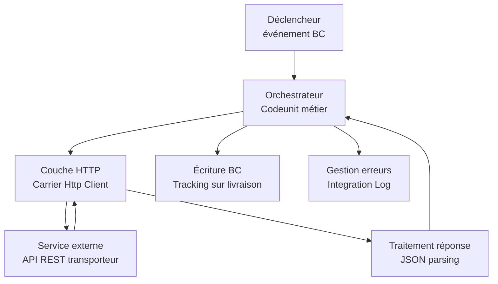

# Intégrations ERP réelles

## Objectifs pédagogiques

À l'issue de ce module, vous serez capable de :

1. **Concevoir** une stratégie d'intégration adaptée à un contexte ERP réel (synchrone vs asynchrone, push vs pull, bloquer vs continuer)
2. **Implémenter** un appel HTTP sortant depuis AL avec gestion complète des erreurs, timeouts et rejeu
3. **Garantir l'idempotence** d'un flux d'intégration pour éviter les doublons en cas de rejeu
4. **Exposer** des données Business Central via API Pages et les consommer depuis un système externe
5. **Diagnostiquer** les pannes d'intégration les plus fréquentes en production, y compris les breaking changes de contrat API

---

## Mise en situation

Vous êtes développeur AL dans une PME industrielle. L'équipe logistique utilise Business Central pour gérer les commandes d'achat, mais le transporteur impose son propre portail web pour créer les expéditions et suivre les colis. Aujourd'hui, les assistants font de la double-saisie : ils copient manuellement les informations BC dans le portail du transporteur, puis ressaisissent les numéros de tracking dans BC.

Votre mission : automatiser ce flux. BC doit envoyer les données d'expédition au transporteur dès qu'une livraison est confirmée, puis récupérer le numéro de tracking et le stocker sur la ligne de commande correspondante. Le transporteur expose une API REST. Vous avez une clé d'API.

Ce qui semble simple en démo devient complexe en production : que se passe-t-il si l'API est en timeout au moment de la validation ? Si le même shipment est envoyé deux fois ? Si le transporteur renomme un champ sans prévenir ? C'est exactement ce que ce module va démêler.

---

## Contexte et problématique

Business Central ne vit jamais seul. Dans tout projet réel, il faut le connecter à au moins une dizaine de systèmes : CRM, WMS, site e-commerce, EDI fournisseurs, plateformes logistiques, outils de BI, services de signature électronique...

La question n'est donc pas *si* vous allez faire des intégrations, mais *comment* les faire sans transformer votre extension en bombe à retardement.

Deux directions de flux coexistent en permanence :

- **Flux sortant** : BC appelle un service externe (API REST, webhook, FTP, messagerie)
- **Flux entrant** : un système externe interroge ou pousse des données dans BC (API Pages, Web Services SOAP, OData)

Ce module couvre les deux, avec une attention particulière sur ce qui se passe *quand ça casse* — parce que ça cassera. Le flux asynchrone via Job Queue sera approfondi dans le module suivant ; on pose ici les fondations.

---

## Anatomie d'une intégration AL

Avant d'écrire la première ligne de code, comprenez les trois couches qui composent toute intégration en AL.



**Déclencheur** : un événement métier (validation d'une livraison) ou un appel manuel depuis une page. C'est ici que l'intégration commence.

**Orchestrateur** : un `Codeunit` qui pilote le flux — prépare les données, appelle la couche HTTP, interprète la réponse, met à jour BC, logue le résultat. Il ne fait pas lui-même les appels HTTP.

**Couche HTTP** : les objets AL `HttpClient`, `HttpRequestMessage`, `HttpResponseMessage`. C'est la seule partie qui parle au réseau, et elle est isolée précisément pour pouvoir être mockée en développement et réutilisée ailleurs.

Cette séparation n'est pas théorique. En production, vous aurez besoin de tester l'orchestrateur sans toucher le réseau, de gérer les timeouts sans bloquer la transaction BC, et de rejouer un appel échoué sans recoder.

---

## Flux sortant : appeler une API externe depuis AL

### HttpClient — les bases et les pièges

AL fournit un `HttpClient` natif. Voici la structure minimale d'un appel POST :

```al
procedure PostShipment(ShipmentNo: Code[20]): Text
var
    Client: HttpClient;
    RequestMessage: HttpRequestMessage;
    ResponseMessage: HttpResponseMessage;
    Content: HttpContent;
    Headers: HttpHeaders;
    Payload: Text;
    ResponseText: Text;
begin
    Payload := BuildShipmentPayload(ShipmentNo);

    Content.WriteFrom(Payload);
    Content.GetHeaders(Headers);
    Headers.Remove('Content-Type');
    Headers.Add('Content-Type', 'application/json');

    RequestMessage.Method('POST');
    RequestMessage.SetRequestUri('https://api.carrier.com/v2/shipments');
    RequestMessage.GetHeaders(Headers);
    Headers.Add('X-Api-Key', GetCarrierApiKey());
    RequestMessage.Content(Content);

    if not Client.Send(RequestMessage, ResponseMessage) then
        Error('Échec de la connexion au service transporteur. Vérifiez la connectivité réseau.');

    ResponseMessage.Content.ReadAs(ResponseText);

    if not ResponseMessage.IsSuccessStatusCode then
        Error('Erreur API transporteur [%1] : %2', ResponseMessage.HttpStatusCode, ResponseText);

    exit(ResponseText);
end;
```

Trois points non intuitifs à retenir immédiatement :

⚠️ **`Content-Type` doit être retiré avant d'être ajouté.** AL initialise `HttpContent` avec un `Content-Type` par défaut. Ajouter directement `application/json` sans `Remove` donne deux valeurs pour ce header — la plupart des APIs rejettent la requête avec un 400 ou 415.

⚠️ **`Client.Send` peut retourner `false` sans exception.** Un faux retour signifie une erreur réseau (timeout, DNS, certificat). Dans ce cas, `ResponseMessage` n'est pas renseigné — y accéder provoque une erreur. Testez toujours le retour booléen.

⚠️ **Authentification Bearer** : si l'API utilise un token OAuth au lieu d'une clé API header, remplacez `Headers.Add('X-Api-Key', ...)` par `Headers.Add('Authorization', 'Bearer ' + GetBearerToken())`. Le pattern est identique — seul le nom du header change.

### Timeout explicite : définir et gérer

Par défaut, `HttpClient` en AL n'a pas de timeout configuré — ce qui signifie qu'un appel peut théoriquement bloquer indéfiniment. En production, une API externe qui met 30 secondes à répondre pendant la validation d'une livraison paralyse l'utilisateur.

La solution : définir un timeout sur le `HttpRequestMessage` via `HttpClient.Timeout()` :

```al
procedure PostShipmentWithTimeout(ShipmentNo: Code[20]): Text
var
    Client: HttpClient;
    RequestMessage: HttpRequestMessage;
    ResponseMessage: HttpResponseMessage;
    Content: HttpContent;
    Headers: HttpHeaders;
    Payload: Text;
    ResponseText: Text;
begin
    // Timeout explicite : 10 secondes maximum
    Client.Timeout := 10000; // millisecondes

    Payload := BuildShipmentPayload(ShipmentNo);

    Content.WriteFrom(Payload);
    Content.GetHeaders(Headers);
    Headers.Remove('Content-Type');
    Headers.Add('Content-Type', 'application/json');

    RequestMessage.Method('POST');
    RequestMessage.SetRequestUri('https://api.carrier.com/v2/shipments');
    RequestMessage.GetHeaders(Headers);
    Headers.Add('X-Api-Key', GetCarrierApiKey());
    RequestMessage.Content(Content);

    // Send retourne false si le timeout est dépassé, aussi bien que sur erreur réseau
    if not Client.Send(RequestMessage, ResponseMessage) then begin
        // Impossible de distinguer timeout d'une erreur réseau pure depuis AL
        // → logger et décider de la suite en dehors de cette couche
        LogIntegrationEvent(ShipmentNo, 'TIMEOUT', 'Appel transporteur timeout ou erreur réseau après 10s');
        exit(''); // chaîne vide = signal d'échec sans bloquer
    end;

    ResponseMessage.Content.ReadAs(ResponseText);

    if not ResponseMessage.IsSuccessStatusCode then
        Error('Erreur API transporteur [%1] : %2', ResponseMessage.HttpStatusCode, ResponseText);

    exit(ResponseText);
end;
```

La couche HTTP retourne une chaîne vide en cas d'échec réseau ou timeout. C'est à l'orchestrateur de décider : bloquer la transaction ? Loguer et laisser passer ? Planifier un rejeu en Job Queue ? Cette décision est métier, pas technique.

### Construire le payload JSON

```al
procedure BuildShipmentPayload(ShipmentNo: Code[20]): Text
var
    ShipmentHeader: Record "Transfer Shipment Header";
    Root: JsonObject;
    Lines: JsonArray;
    Line: JsonObject;
    ShipmentLine: Record "Transfer Shipment Line";
    Result: Text;
begin
    ShipmentHeader.Get(ShipmentNo);

    Root.Add('reference', ShipmentHeader."No.");
    Root.Add('shipDate', Format(ShipmentHeader."Shipment Date", 0, '<Year4>-<Month,2>-<Day,2>'));
    Root.Add('recipientName', ShipmentHeader."Transfer-to Name");
    Root.Add('recipientAddress', ShipmentHeader."Transfer-to Address");
    Root.Add('recipientCity', ShipmentHeader."Transfer-to City");
    Root.Add('recipientZip', ShipmentHeader."Transfer-to Post Code");

    ShipmentLine.SetRange("Document No.", ShipmentNo);
    if ShipmentLine.FindSet() then
        repeat
            Clear(Line);
            Line.Add('itemRef', ShipmentLine."Item No.");
            Line.Add('description', ShipmentLine.Description);
            Line.Add('quantity', ShipmentLine.Quantity);
            Lines.Add(Line);
        until ShipmentLine.Next() = 0;

    Root.Add('lines', Lines);
    Root.WriteTo(Result);
    exit(Result);
end;
```

🧠 **`Format()` avec un masque explicite** est le seul moyen fiable de formater une date pour une API externe. Le format interne BC dépend de la locale de l'utilisateur — envoyer `01/02/2025` quand l'API attend `2025-02-01` provoque des erreurs silencieuses très difficiles à déboguer.

### Parser la réponse

```al
procedure ExtractTrackingNumber(ResponseJson: Text): Code[30]
var
    Root: JsonObject;
    TrackingToken: JsonToken;
begin
    if not Root.ReadFrom(ResponseJson) then
        Error('Réponse API invalide — JSON malformé : %1', ResponseJson);

    if not Root.Get('trackingNumber', TrackingToken) then
        Error('Champ "trackingNumber" absent de la réponse API. Contrat API modifié ?');

    exit(CopyStr(TrackingToken.AsValue().AsText(), 1, 30));
end;
```

⚠️ **Toujours vérifier l'existence du champ avant de le lire.** `Root.Get()` retourne `false` si le champ n'existe pas — il ne lève pas d'exception. Si l'API change de contrat, vous voudrez le détecter ici, pas laisser planter silencieusement.

---

## Idempotence : et si le même shipment est envoyé deux fois ?

C'est le trou noir de beaucoup de premières intégrations en production. Un rejeu de Job Queue, une double validation utilisateur, un retry automatique sur timeout — le même shipment peut arriver deux fois au transporteur.

Sans précaution, vous créez deux expéditions chez le transporteur pour une seule dans BC.

### Côté BC : détecter un doublon avant d'envoyer

```al
procedure HasShipmentBeenSent(ShipmentNo: Code[20]): Boolean
var
    IntLog: Record "Integration Log";
begin
    IntLog.SetRange("Document No.", ShipmentNo);
    IntLog.SetRange(Direction, IntLog.Direction::Outbound);
    IntLog.SetRange(Status, IntLog.Status::Success);
    exit(not IntLog.IsEmpty());
end;
```

Dans l'orchestrateur, avant tout appel :

```al
if HasShipmentBeenSent(ShipmentNo) then begin
    LogIntegrationEvent(ShipmentNo, 'SKIP', 'Expédition déjà envoyée au transporteur — doublon ignoré');
    exit;
end;
```

### Côté API externe : idempotency key

Certaines APIs supportent une `Idempotency-Key` dans les headers — un identifiant unique par opération logique. Si vous renvoyez la même clé, l'API retourne le résultat de l'appel original sans recréer l'objet :

```al
RequestMessage.GetHeaders(Headers);
Headers.Add('Idempotency-Key', ShipmentNo); // le No. de livraison BC est un bon candidat
```

Vérifier si l'API de votre partenaire supporte ce pattern est la première question à poser lors du kick-off d'intégration.

---

## Quand le contrat API change

C'est inévitable. Un jour, le champ `trackingNumber` devient `trackingCode`. Ou l'API passe de `v1` à `v2` en cassant la rétrocompatibilité.

### Détection

Votre fonction `ExtractTrackingNumber` détecte le changement si elle vérifie correctement l'existence du champ. Au lieu de laisser planter, loggez un message explicite :

```al
if not Root.Get('trackingNumber', TrackingToken) then begin
    // Essayer l'ancien et le nouveau nom — période de migration
    if not Root.Get('trackingCode', TrackingToken) then
        Error('Champ tracking introuvable (testé : trackingNumber, trackingCode). Contrat API modifié — contacter le transporteur.');
end;
```

### Migration progressive

La bonne approche quand un breaking change est annoncé par le partenaire :

1. **Tester en sandbox** avec un fichier de réponse statique représentant le nouveau contrat
2. **Déployer un parser compatible les deux versions** pendant la période de transition
3. **Supprimer la compatibilité ascendante** une fois que le partenaire confirme la migration complète

Gardez toujours une copie datée du contrat (collection Postman, fichier OpenAPI) au moment de l'implémentation. Quand un partenaire dit "on a rien changé", vous aurez la preuve.

---

## Stocker les secrets

C'est l'erreur la plus fréquente, et la plus grave. Une clé d'API dans le code source finit inévitablement dans un dépôt Git, dans des traces de déploiement, dans des exports de backup.

La bonne pratique BC : **Isolated Storage** ou une table de configuration avec permissions restreintes.

```al
// Écriture (setup initial, page admin)
procedure SetCarrierApiKey(ApiKey: Text)
begin
    IsolatedStorage.Set('CarrierApiKey', ApiKey, DataScope::Module);
end;

// Lecture (à l'usage)
procedure GetCarrierApiKey(): Text
var
    ApiKey: Text;
begin
    if not IsolatedStorage.Get('CarrierApiKey', DataScope::Module, ApiKey) then
        Error('Clé API transporteur non configurée. Contactez l''administrateur.');
    exit(ApiKey);
end;

// Vérification d'existence
procedure IsCarrierConfigured(): Boolean
begin
    exit(IsolatedStorage.Contains('CarrierApiKey', DataScope::Module));
end;
```

💡 **`DataScope::Module`** isole le secret par extension. `DataScope::Company` étend la portée à la société active — utile quand chaque société d'un tenant multi-sociétés a sa propre clé API. Le choix dépend de votre modèle de déploiement.

---

## Flux entrant : exposer BC vers l'extérieur

Un système externe a besoin de lire ou d'écrire des données dans BC. La solution moderne : les **API Pages**.

```al
page 50200 "Carrier Shipment API"
{
    PageType = API;
    APIPublisher = 'mycompany';
    APIGroup = 'logistics';
    APIVersion = 'v1.0';
    EntityName = 'shipment';
    EntitySetName = 'shipments';
    SourceTable = "Sales Shipment Header";
    ODataKeyFields = SystemId;
    InsertAllowed = false;
    ModifyAllowed = true;
    DeleteAllowed = false;

    layout
    {
        area(Content)
        {
            field(id; Rec.SystemId) { Caption = 'id'; }
            field(number; Rec."No.") { Caption = 'number'; Editable = false; }
            field(customerName; Rec."Sell-to Customer Name") { Caption = 'customerName'; }
            field(shipmentDate; Rec."Shipment Date") { Caption = 'shipmentDate'; }
            field(trackingNumber; Rec."Package Tracking No.") { Caption = 'trackingNumber'; }
            field(status; Rec.Status) { Caption = 'status'; }
        }
    }
}
```

L'URL générée suit le pattern :
```
https://{tenant}.api.businesscentral.dynamics.com/v2.0/{env}/api/mycompany/logistics/v1.0/companies({companyId})/shipments
```

🧠 **`SystemId`** est l'identifiant stable d'un enregistrement BC — un GUID immuable assigné à la création, jamais modifié même si la clé métier change. Pour toute intégration à long terme, c'est lui qui doit servir de référence entre les systèmes. Les numéros de document peuvent être modifiés ou recyclés ; le `SystemId` ne l'est jamais.

Les propriétés `InsertAllowed`, `ModifyAllowed`, `DeleteAllowed` définissent strictement ce que l'API accepte. Une tentative de DELETE sur une page avec `DeleteAllowed = false` retourne un 405 Method Not Allowed — pas besoin de code supplémentaire.

---

## Cas réel : codeunit d'intégration complet

Voici comment les pièces s'assemblent. L'objectif : au moment de la validation d'une livraison, envoyer automatiquement les données au transporteur, stocker le tracking reçu, et loguer chaque étape.

```al
codeunit 50210 "Carrier Integration Mgt."
{
    procedure ProcessShipment(ShipmentNo: Code[20])
    var
        CarrierHttp: Codeunit "Carrier Http Client";
        TrackingNo: Code[30];
        ResponseJson: Text;
        ShipmentHeader: Record "Sales Shipment Header";
    begin
        // Garde 1 : configuration présente ?
        if not IsCarrierConfigured() then begin
            LogIntegrationEvent(ShipmentNo, 'SKIP', 'Intégration transporteur non configurée');
            exit;
        end;

        // Garde 2 : déjà envoyé ? (idempotence)
        if HasShipmentBeenSent(ShipmentNo) then begin
            LogIntegrationEvent(ShipmentNo, 'SKIP', 'Expédition déjà envoyée — doublon ignoré');
            exit;
        end;

        // Appel sortant avec timeout
        ResponseJson := CarrierHttp.PostShipmentWithTimeout(ShipmentNo);

        // Timeout ou erreur réseau → ResponseJson vide
        if ResponseJson = '' then begin
            LogIntegrationEvent(ShipmentNo, 'ERROR', 'Timeout ou erreur réseau — planifier rejeu Job Queue');
            // Ne pas bloquer la transaction BC
            exit;
        end;

        // Extraction tracking
        TrackingNo := ExtractTrackingNumber(ResponseJson);

        // Persistance dans BC
        ShipmentHeader.Get(ShipmentNo);
        ShipmentHeader."Package Tracking No." := TrackingNo;
        ShipmentHeader.Modify(true);

        LogIntegrationEvent(ShipmentNo, 'OK', StrSubstNo('Tracking reçu : %1', TrackingNo));
    end;

    local procedure LogIntegrationEvent(DocNo: Code[20]; Status: Text[10]; Message: Text[250])
    var
        IntLog: Record "Integration Log";
    begin
        IntLog.Init();
        IntLog."Document No." := DocNo;
        IntLog.Direction := IntLog.Direction::Outbound;
        case Status of
            'OK': IntLog.Status := IntLog.Status::Success;
            'SKIP': IntLog.Status := IntLog.Status::Skipped;
            else IntLog.Status := IntLog.Status::Error;
        end;
        IntLog."Timestamp" := CurrentDateTime();
        IntLog."Error Message" := CopyStr(Message, 1, 250);
        IntLog.Insert(true);
    end;
}
```

L'abonnement à l'événement de validation :

```al
[EventSubscriber(ObjectType::Codeunit, Codeunit::"Whse.-Post Shipment", 'OnAfterPostWhseShipment', '', false, false)]
local procedure OnAfterPostShipment(var WarehouseShipmentHeader: Record "Warehouse Shipment Header"; var TempWarehouseShipmentLine: Record "Warehouse Shipment Line" temporary)
var
    CarrierMgt: Codeunit "Carrier Integration Mgt.";
begin
    CarrierMgt.ProcessShipment(WarehouseShipmentHeader."Last Shipment No.");
end;
```

💡 **`OnAfterPost*`** garantit que la transaction BC est commitée avant l'appel externe. Si vous vous abonnez à `OnBefore*`, un rollback BC laisse des données envoyées au transporteur sans contrepartie dans BC — un fantôme d'expédition très difficile à réconcilier.

---

## Gestion des erreurs : ce qui se passe en production

Les APIs tombent. Les timeouts arrivent. Les payloads changent sans prévenir. Une intégration sans stratégie d'erreur devient un ticket de support permanent.

### Table de log intégration

```al
table 50200 "Integration Log"
{
    fields
    {
        field(1; "Entry No."; Integer) { AutoIncrement = true; }
        field(2; "Document No."; Code[20]) { }
        field(3; "Direction"; Option) { OptionMembers = Outbound,Inbound; }
        field(4; "Status"; Option) { OptionMembers = Success,Error,Skipped; }
        field(5; "Timestamp"; DateTime) { }
        field(6; "HTTP Status Code"; Integer) { }
        field(7; "Request Payload"; Blob) { }
        field(8; "Response Payload"; Blob) { }
        field(9; "Error Message"; Text[2048]) { }
    }
}
```

Stocker systématiquement le payload envoyé et la réponse reçue. Quand un transporteur affirme "on n'a jamais reçu cette expédition", vous avez la preuve — et le payload exact pour rejouer manuellement.

### Rejouer une intégration échouée

Une entrée de log en erreur doit pouvoir être rejouée depuis une page d'administration, sans recoder. Le pattern minimal :

```al
// Page admin "Integration Log" — action "Rejouer"
trigger OnAction()
var
    CarrierMgt: Codeunit "Carrier Integration Mgt.";
begin
    // Remettre le flag à vide pour permettre le rejeu
    // (HasShipmentBeenSent vérifie Status = Success, pas Error)
    CarrierMgt.ProcessShipment(Rec."Document No.");
end;
```

Toute la logique de garde (idempotence, configuration) s'applique identiquement — le rejeu passe par exactement le même code que le flux normal.

### Tableau de décision : bloquer ou continuer ?

| Situation | Comportement recommandé |
|-----------|------------------------|
| API down pendant une validation | Loguer, laisser BC valider, planifier rejeu Job Queue |
| Timeout réseau (>10s) | Loguer `ERROR`, ne jamais bloquer la transaction BC |
| Réponse malformée (JSON invalide) | `Error()` uniquement si le tracking est bloquant pour la suite |
| Champ absent dans la réponse | Loguer avec détail du champ manquant, investiguer le contrat |
| Clé API expirée (401) | Notifier l'admin immédiatement, ne pas bloquer |
| Doublon détecté (idempotence) | Loguer `SKIP`, ne rien envoyer |

⚠️ **Une intégration qui bloque toute validation BC parce qu'une API externe est en maintenance** — c'est le cauchemar de tout directeur opérationnel. Par défaut, les erreurs d'appels sortants ne doivent pas bloquer les transactions métier BC.

---

## Bonnes pratiques

**Versionnez vos API Pages dès le premier commit.** `APIVersion = 'v1.0'` n'est pas décoratif. Si vous devez changer le contrat (renommer un champ, changer un type), créez `v2.0` et maintenez `v1.0` pendant la migration. Briser un contrat sans version coupe les clients du jour au lendemain.

**Anticipez le multi-sociétés.** Un tenant BC peut avoir plusieurs sociétés. Vos secrets Isolated Storage doivent en tenir compte : `DataScope::Module` pour une clé globale, `DataScope::Company` pour une clé par société.

**Construisez un mock en développement.** Pendant les tests, ne pas frapper l'API réelle du transporteur à chaque build. Un Codeunit avec une réponse JSON statique, activé via une setup table, fait économiser des dizaines de minutes — et évite de créer des centaines d'expéditions de test chez le partenaire.

**Fixez toujours un timeout explicite.** Un appel sans timeout qui prend 30 secondes dans la validation d'une commande sera remarqué par les utilisateurs avant que vous le soyez par le monitoring. La règle empirique : 10 secondes maximum en synchrone, sinon le flux doit devenir asynchrone.

**Documentez le contrat externe avec une date.** La documentation de l'API de votre partenaire va changer. Exportez la collection Postman ou le fichier OpenAPI au moment de l'implémentation, datez-la, gardez un contact humain chez le partenaire pour être notifié des breaking changes avant qu'ils arrivent en production.

---

## Résumé

| Concept | Rôle | Points clés |
|---------|------|-------------|
| `HttpClient` / `HttpRequestMessage` | Appel HTTP sortant depuis AL | Tester le booléen de `Send()`, fixer un timeout explicite, retirer `Content-Type` avant de l'ajouter |
| Idempotence | Éviter les doublons en cas de rejeu | Vérifier le log avant d'envoyer, utiliser `Idempotency-Key` si l'API le supporte |
| `JsonObject` / `JsonArray` | Construction et parsing JSON | Toujours vérifier l'existence d'un champ avec `.Get()` — il retourne false, pas d'exception |
| `IsolatedStorage` | Stockage sécurisé des secrets | Ne jamais hardcoder — `DataScope::Module` ou `DataScope::Company` selon le contexte |
| API Page | Exposition de BC vers l'extérieur | `SystemId` comme identifiant stable, versionner avec `APIVersion` dès le départ |
| Table de log intégration | Traçabilité et rejeu | Stocker payload envoyé + réponse reçue + code HTTP + timestamp |
| `OnAfterPost*` | Déclenchement post-commit | Éviter `OnBefore*` pour les appels externes — risque de fantôme en cas de rollback BC |
| Contrat API évolutif | Résilience aux breaking changes | Parser défensif, tester les deux noms pendant la transition, documenter avec une date |

La prochaine étape : quand un flux d'intégration est trop lent pour être synchrone, ou doit être rejoué automatiquement en cas d'échec — c'est le territoire de la Job Queue.

---

<!-- snippet
id: al_httpclient_content_type
type: warning
tech: AL
level: intermediate
importance: high
format: knowledge
tags: httpclient,http,headers,integration,al
title: Content-Type doit être retiré avant d'être ajouté
content: AL initialise HttpContent avec un Content-Type par défaut. Si vous faites directement Headers.Add('Content-Type', 'application/json') sans Remove préalable, vous obtenez deux valeurs pour ce header. La plupart des APIs renvoient un 400 ou 415. Correction : toujours appeler Headers.Remove('Content-Type') avant Headers.Add('Content-Type', 'application/json').
description: Ajouter Content-Type sans Remove préalable duplique le header et provoque des erreurs 400/415 côté API externe.
-->

<!-- snippet
id: al_httpclient_send_timeout
type: warning
tech: AL
level: intermediate
