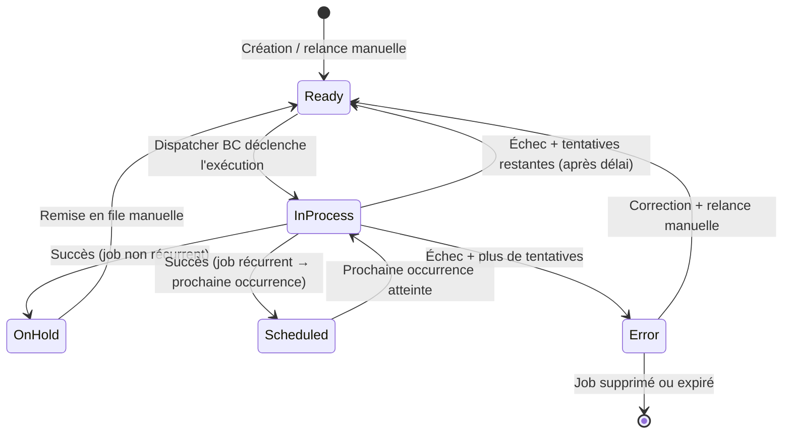

# Job Queue & traitements asynchrones

## Objectifs pédagogiques

À l'issue de ce module, tu seras capable de :

1. **Expliquer** pourquoi la Job Queue existe et dans quels cas elle s'impose face à un traitement synchrone
2. **Créer** une entrée Job Queue qui déclenche un Codeunit AL personnalisé
3. **Implémenter** correctement l'interface `OnRun` d'un Codeunit pour qu'il soit éligible à la Job Queue
4. **Gérer** les erreurs, les relances et la supervision proactive des jobs en production
5. **Appliquer** le pattern Orchestrateur/Métier pour un code découplé, testable et maintenable

---

## Mise en situation

Tu travailles sur une extension BC pour une PME qui importe chaque nuit des commandes depuis une plateforme e-commerce. L'opération charge plusieurs milliers de lignes, appelle une API externe et met à jour des tables de stock. Si tu fais ça en synchrone depuis l'UI, c'est un timeout assuré et une mauvaise expérience utilisateur.

La Job Queue est la réponse naturelle : tu déclenches le traitement en arrière-plan, à heure fixe, sans bloquer aucun utilisateur. Ton rôle est d'écrire le Codeunit qui sera exécuté, de le câbler à une entrée Job Queue, et de t'assurer qu'une erreur en cours d'import ne laisse pas la base dans un état incohérent — ni ne passe inaperçue pendant trois jours.

---

## Contexte — pourquoi la Job Queue existe

Business Central tourne sur un modèle de sessions. Chaque utilisateur ouvre une session, exécute ses actions, et la session se ferme. Si tu veux exécuter du code en dehors d'une session utilisateur — la nuit, toutes les 15 minutes, ou simplement "dès que possible sans bloquer l'UI" — tu n'as pas d'autre choix que de passer par la Job Queue.

Historiquement dans NAV, les tâches planifiées étaient souvent des NAS (NAV Application Server), des scripts batch ou des traitements manuels déclenchés par les utilisateurs. BC a intégré nativement un mécanisme de planification qui gère ça directement dans la plateforme, sans infrastructure extérieure.

La Job Queue est un scheduler interne à BC. Elle maintient une table (`Job Queue Entry`) où chaque ligne représente une tâche. BC surveille cette table en continu et lance les tâches éligibles dans une session de service dédiée, séparée des sessions utilisateurs.

Ce que ça change concrètement : ton code AL tourne dans une session sans UI, sans utilisateur connecté, avec ses propres limites de transaction et son propre contexte de sécurité. Ce n'est pas la même chose que cliquer sur un bouton dans une page — et c'est cette différence qui est à l'origine de la majorité des bugs en production.

💡 En SaaS (BC Online), tu n'as pas accès à un NAS ou un scheduler externe. La Job Queue est le **seul** mécanisme natif pour du code planifié. En OnPrem, tu pourrais théoriquement utiliser des tâches Windows planifiées, mais la Job Queue reste la pratique recommandée.

---

## Principe de fonctionnement

Avant d'écrire une ligne de code, comprendre le cycle de vie complet d'un job — y compris les chemins d'erreur — évite beaucoup de surprises.



Quelques points importants sur ce cycle :

**Une entrée = une exécution potentiellement répétée.** Une entrée Job Queue peut être "one-shot" ou récurrente (toutes les X minutes, à heure fixe, certains jours de la semaine). À chaque déclenchement, BC crée un enregistrement dans `Job Queue Log Entry` qui trace le résultat.

**La transaction est gérée par la session de service.** Si ton Codeunit plante au milieu, BC rollback la transaction courante. Mais si tu as commité plusieurs fois (`Commit()`) avant le crash, seul ce qui n'a pas encore été commité est annulé. C'est un point critique sur lequel on reviendra.

**Le contexte utilisateur est fictif.** La session de service tourne avec un utilisateur système. Si ton code lit `UserId()` ou fait des vérifications de permission basées sur l'utilisateur courant, tu obtiendras des comportements différents de ce qu'un vrai utilisateur verrait.

---

## Pattern Orchestrateur / Logique métier

C'est le premier principe à intégrer avant d'écrire la moindre ligne. Un Codeunit déclenché par la Job Queue ne devrait **pas** contenir la logique métier réelle — il devrait l'appeler.

Pourquoi ? Parce que la logique métier doit être testable sans la Job Queue. Si tout est dans `OnRun`, tu ne peux pas écrire un test unitaire qui appelle juste l'import sans passer par le mécanisme de planification. En production, ça veut dire que tu ne peux pas non plus déclencher manuellement le traitement depuis une page de debug sans créer un faux job.

```al
// ✅ Orchestrateur : mince, délègue tout
codeunit 50100 "Import Orders Background"
{
    trigger OnRun()
    var
        Param: Text;
        ImportOrchestrator: Codeunit "Import Orders Orchestrator";
    begin
        // Lecture du contexte passé par la Job Queue
        Param := Rec."Parameter String";

        // Délégation à la logique métier — testable indépendamment
        ImportOrchestrator.Run(Param);
    end;
}

// ✅ Logique métier : appelable depuis un test, une page, un job
codeunit 50101 "Import Orders Orchestrator"
{
    procedure Run(Param: Text)
    var
        OrderAPI: Codeunit "Order API Client";
        ImportLog: Record "Import Log";
        ImportedCount: Integer;
    begin
        ImportedCount := OrderAPI.FetchAndSaveOrders(Param);

        ImportLog.Init();
        ImportLog."Run Date" := Today();
        ImportLog."Orders Imported" := ImportedCount;
        ImportLog."Source Parameter" := CopyStr(Param, 1, MaxStrLen(ImportLog."Source Parameter"));
        ImportLog.Insert(true);
    end;
}
```

Ce découplage te donne trois avantages immédiats :

1. **Testabilité** : tu peux écrire un Test Codeunit qui appelle directement `Import Orders Orchestrator` sans passer par la Job Queue
2. **Débogage** : depuis une page d'admin custom, tu peux déclencher `Run()` manuellement avec n'importe quel paramètre
3. **Lisibilité** : quand quelqu'un lit `Import Orders Background`, il comprend immédiatement que c'est un point d'entrée, pas de la logique

---

## Créer un Codeunit compatible Job Queue

Le contrat est simple : ton Codeunit doit implémenter le trigger `OnRun`. C'est ce trigger que la Job Queue appellera.

### Lire le Parameter String depuis OnRun

```al
trigger OnRun()
var
    Param: Text;
    ImportOrchestrator: Codeunit "Import Orders Orchestrator";
begin
    // Rec pointe vers la Job Queue Entry qui a déclenché ce Codeunit
    // Ce n'est disponible que dans le contexte d'exécution Job Queue
    Param := Rec."Parameter String";  // ex : "ECOMMERCE|2024-01-01"

    // Si appelé manuellement (test), Rec est vide — protège-toi
    if Param = '' then
        Param := 'DEFAULT';

    ImportOrchestrator.Run(Param);
end;
```

⚠️ `Rec` dans `OnRun` d'un Codeunit déclenché par la Job Queue pointe bien vers l'entrée `Job Queue Entry`. Mais si tu appelles ce Codeunit manuellement (pour tester), `Rec` sera vide. Toujours prévoir ce cas.

---

## Créer une entrée Job Queue en AL

En production, créer les entrées Job Queue depuis le code — par exemple lors de l'installation de ton extension — est infiniment plus fiable qu'une configuration manuelle qui peut être oubliée ou mal reproduite d'un environnement à l'autre.

```al
procedure ScheduleImportJob()
var
    JobQueueEntry: Record "Job Queue Entry";
    JobQueueMgt: Codeunit "Job Queue Management";
begin
    JobQueueEntry.Init();
    JobQueueEntry.ID := CreateGuid();

    // Type d'objet à exécuter : Codeunit
    JobQueueEntry."Object Type to Run" := JobQueueEntry."Object Type to Run"::Codeunit;
    JobQueueEntry."Object ID to Run" := Codeunit::"Import Orders Background";

    // Description lisible dans l'interface de supervision
    // Ce champ est ce que verra l'admin à 23h quand quelque chose plante
    JobQueueEntry.Description := 'Import commandes e-commerce (nuit) — PROD';

    // Planification : du lundi au vendredi à 02h00
    JobQueueEntry."Run on Mondays" := true;
    JobQueueEntry."Run on Tuesdays" := true;
    JobQueueEntry."Run on Wednesdays" := true;
    JobQueueEntry."Run on Thursdays" := true;
    JobQueueEntry."Run on Fridays" := true;
    JobQueueEntry."Starting Time" := 020000T;
    JobQueueEntry."Ending Time" := 060000T;

    // 3 tentatives, 5 minutes entre chaque
    JobQueueEntry."Maximum No. of Attempts to Run" := 3;
    JobQueueEntry."Rerun Delay (sec.)" := 300;

    // Contexte passé au Codeunit
    JobQueueEntry."Parameter String" := 'ECOMMERCE|AUTO';

    JobQueueEntry.Insert(true);
    JobQueueMgt.SetJobQueueEntryStatus(JobQueueEntry, JobQueueEntry.Status::Ready);
end;
```

### Déclencher un job immédiatement (one-shot)

Pour un traitement déclenché à la demande depuis un bouton "Lancer l'import maintenant" :

```al
procedure TriggerImportNow()
var
    JobQueueEntry: Record "Job Queue Entry";
begin
    JobQueueEntry.Init();
    JobQueueEntry.ID := CreateGuid();
    JobQueueEntry."Object Type to Run" := JobQueueEntry."Object Type to Run"::Codeunit;
    JobQueueEntry."Object ID to Run" := Codeunit::"Import Orders Background";
    JobQueueEntry.Description := 'Import manuel — déclenché par utilisateur';
    JobQueueEntry."Recurring Job" := false;
    JobQueueEntry."No. of Minutes between Runs" := 0;

    // Expiration automatique après 1 heure pour éviter l'accumulation
    JobQueueEntry."Expiration Date/Time" := CurrentDateTime() + 3600000;

    JobQueueEntry.Insert(true);
    JobQueueEntry.SetStatus(JobQueueEntry.Status::Ready);
end;
```

💡 Pour les jobs one-shot créés programmatiquement, active toujours `"Expiration Date/Time"`. Sans ça, les entrées terminées s'accumulent en base et finissent par dégrader les performances de la page Job Queue Entries.

---

## Gérer les erreurs et les relances

C'est la partie qui fait la différence entre un job qui fonctionne en démo et un job qui tient en production.

### Ce qui se passe quand le Codeunit lève une erreur

Quand une exception non gérée remonte dans `OnRun`, BC :
1. Rollback la transaction courante (tout ce qui n'a pas été commité)
2. Inscrit l'erreur dans `Job Queue Log Entry` avec le message et la stack trace
3. Décrémente le compteur de tentatives restantes
4. Si des tentatives restent → repasse l'entrée en `Ready` après le délai de relance
5. Si plus de tentative → passe l'entrée en `Error`

🧠 Le rollback automatique est une protection, pas une garantie totale. Si ton code a fait des `Commit()` intermédiaires, ce qui a été commité ne sera pas annulé. En cas d'erreur à mi-parcours, tu peux te retrouver avec un état partiel en base.

### Stratégie de commit dans un job long

Pour un traitement qui importe 10 000 lignes, tu vas souvent vouloir commiter par lots pour éviter de tout perdre en cas d'erreur à la ligne 9 999.

```al
local procedure ImportOrdersBatch(Orders: List of [Text])
var
    Order: Text;
    BatchSize: Integer;
    ProcessedInBatch: Integer;
begin
    BatchSize := 100;
    ProcessedInBatch := 0;

    foreach Order in Orders do begin
        ProcessSingleOrder(Order);
        ProcessedInBatch += 1;

        if ProcessedInBatch >= BatchSize then begin
            Commit();
            ProcessedInBatch := 0;
        end;
    end;

    if ProcessedInBatch > 0 then
        Commit();
end;
```

⚠️ Après un `Commit()`, tu ne peux plus appeler `Error()` pour annuler ce qui a été commité. Si tu détectes un problème après un commit, tu dois gérer la compensation (suppression, marquage, correction) manuellement. C'est pour ça que marquer chaque ligne avec un statut (`Imported`, `Error`) est essentiel : en cas de rejeu du job, tu peux ignorer ce qui a déjà été traité.

### Formuler des erreurs lisibles

Le message d'erreur atterrit dans `Job Queue Log Entry."Error Message"` — c'est ce que verra l'administrateur. Sois précis :

```al
local procedure ProcessSingleOrder(OrderJson: Text)
var
    OrderNo: Text;
begin
    OrderNo := ExtractOrderNo(OrderJson);

    if OrderNo = '' then
        Error(
            'Import échoué : numéro de commande manquant dans le JSON reçu. ' +
            'Vérifier le format du payload API. JSON reçu (500 premiers chars) : %1',
            CopyStr(OrderJson, 1, 500)
        );
end;
```

---

## Superviser les jobs

### Pages BC de supervision

| Page | Ce qu'elle montre |
|------|-------------------|
| **Job Queue Entries** | Toutes les entrées, leur statut, leur prochaine exécution |
| **Job Queue Log Entries** | Historique de chaque exécution avec durée, statut, message d'erreur |
| **My Job Queue** | Raccourci utilisateur sur ses propres jobs |

En SaaS, les administrateurs peuvent aussi consulter les logs depuis le **Business Central Admin Center** → onglet "Scheduled Tasks". Utile pour diagnostiquer un job qui ne se déclenche jamais.

### Supervision proactive depuis AL

La consultation réactive des pages BC ne suffit pas en production. Un job qui échoue à 2h du matin peut passer inaperçu jusqu'à 9h. L'objectif est d'être notifié avant que l'utilisateur ne découvre le problème.

```al
// Vérification programmatique des jobs en erreur
// À appeler depuis un job de supervision "heartbeat" ou un assistant setup
procedure CheckAndNotifyFailedJobs()
var
    JobQueueEntry: Record "Job Queue Entry";
    MailMessage: Codeunit Mail;
    FailedJobsFound: Boolean;
    NotificationBody: Text;
begin
    FailedJobsFound := false;
    NotificationBody := 'Jobs en erreur détectés sur BC :\n\n';

    // Filtrer uniquement les jobs en statut Error
    JobQueueEntry.SetRange(Status, JobQueueEntry.Status::Error);

    if JobQueueEntry.FindSet() then begin
        FailedJobsFound := true;
        repeat
            NotificationBody += StrSubstNo(
                '- %1 (ID: %2) — Dernière erreur : %3\n',
                JobQueueEntry.Description,
                JobQueueEntry.ID,
                JobQueueEntry."Error Message"
            );
        until JobQueueEntry.Next() = 0;
    end;

    if FailedJobsFound then begin
        // Envoi d'une notification mail à l'équipe technique
        // MailMessage.Send(...) — selon votre configuration SMTP/BC mail
        // Alternative : écrire dans une table d'alertes consultable depuis un Role Center
        LogAlert(NotificationBody);
    end;
end;

local procedure LogAlert(AlertText: Text)
var
    AlertLog: Record "BC Alert Log";   // table custom de votre extension
begin
    AlertLog.Init();
    AlertLog."Alert Date-Time" := CurrentDateTime();
    AlertLog."Alert Text" := CopyStr(AlertText, 1, MaxStrLen(AlertLog."Alert Text"));
    AlertLog."Alert Type" := AlertLog."Alert Type"::"Job Queue Error";
    AlertLog.Insert(true);
end;
```

Ce job de supervision lui-même tourne via la Job Queue — typiquement toutes les 30 minutes. C'est le **pattern heartbeat** : un job léger qui surveille l'état du système et alerte avant que l'incident ne devienne visible.

```al
// Accéder aux logs détaillés d'un job spécifique (pour une page de diagnostic custom)
procedure ShowJobLogs(JobId: Guid)
var
    JobQueueLogEntry: Record "Job Queue Log Entry";
begin
    JobQueueLogEntry.SetRange("Job Queue Entry ID", JobId);
    JobQueueLogEntry.SetCurrentKey("End Date-Time");
    JobQueueLogEntry.Ascending(false);  // les plus récents en premier

    if JobQueueLogEntry.FindSet() then
        repeat
            // Alimenter une page custom, envoyer un mail, etc.
        until JobQueueLogEntry.Next() = 0;
end;
```

---

## Cas d'utilisation réels

### 1 — Synchronisation quotidienne avec un ERP externe

Un groupe avec un ERP central et plusieurs filiales BC. Chaque nuit, un job collecte les mouvements de stock de la journée et les pousse vers l'ERP central via son API.

Le Codeunit récupère les transactions créées depuis le dernier run (date stockée dans une table de configuration), appelle l'API par lot de 500 lignes, et met à jour la date de dernière synchronisation après chaque commit de lot. Si l'API est indisponible, l'erreur remonte, le job sera relancé 3 fois à 10 minutes d'intervalle. Si toutes les tentatives échouent, le heartbeat de supervision détecte l'entrée en `Error` et envoie une notification à l'équipe technique — sans attendre que quelqu'un ouvre la page Job Queue le lendemain matin.

### 2 — Génération de rapports planifiés

Un directeur financier veut recevoir chaque lundi à 7h un PDF du bilan de trésorerie de la semaine précédente. Le job génère le rapport via un Report AL, l'exporte en PDF dans un Blob, et l'envoie par mail. Aucune interaction utilisateur requise. La description du job : `"Rapport trésorerie hebdomadaire — envoi DG"` — lisible par n'importe qui dans l'équipe.

### 3 — Nettoyage de données temporaires

Des tables de staging utilisées lors des imports s'accumulent. Un job hebdomadaire supprime les enregistrements de plus de 30 jours. Le traitement est découpé en lots de 1 000 suppressions avec commit intermédiaire pour éviter les locks trop longs sur la table. Sans ce job, la table grossit indéfiniment — dégradation progressive des performances et de la place disque.

---

## Erreurs fréquentes — guide de diagnostic

### "Le job reste en statut 'In Process' indéfiniment"

**Symptôme** : l'entrée Job Queue est en `In Process` depuis des heures alors qu'aucun traitement actif ne tourne.

**Arborescence de diagnostic :**

1. **Vérifier si une session active existe** : Admin Center → Sessions actives → chercher une session "Service" liée à ce job. Si elle est là mais sans activité depuis longtemps → session fantôme.
2. **Session fantôme** → terminer la session depuis l'Admin Center, puis remettre l'entrée en `On Hold` depuis la page Job Queue Entries, puis `Ready`.
3. **Crash serveur** (OnPrem) → vérifier les logs du service BC Server. Le service a redémarré sans avoir mis à jour le statut du job.
4. **Job bloqué sur un lock SQL** → consulter les sessions actives : y a-t-il un lock sur une table utilisée par ce job ? Identifier le codeunit concerné et revoir la stratégie de commit.

**Correction** : Job Queue Entries → action "Set Status to On Hold" → "Set Status to Ready". En OnPrem, vérifier que le service BC Server est démarré.

---

### "Mon Codeunit fonctionne en UI mais plante en Job Queue"

**Symptôme** : erreur de permission, comportement inattendu, ou erreur `You do not have permission to...` uniquement en contexte Job Queue.

**Arborescence de diagnostic :**

1. **Lire le message d'erreur complet** dans Job Queue Log Entries — il contient souvent le nom de la table ou de l'objet concerné.
2. **Identifier l'objet en cause** : c'est presque toujours une table, une page, ou un codeunit auquel l'utilisateur système n'a pas accès.
3. **Vérifier les permission sets** configurés sur l'entrée Job Queue (`User ID to Run As`). L'utilisateur système doit avoir les droits sur tous les objets utilisés.
4. **Chercher un appel `UserId()`** dans le Codeunit ou ses dépendances : si le code prend des décisions basées sur l'utilisateur courant (filtre, permission custom), il se comportera différemment avec l'utilisateur système.
5. **Tester en appelant le Codeunit manuellement** (depuis une page custom) avec l'utilisateur système — si ça plante pareil, le problème est reproductible hors Job Queue.

**Correction** : ajouter les permissions manquantes sur l'utilisateur Job Queue, ou utiliser `InherentPermissions` sur le Codeunit si approprié (voir module 26).

---

### "Le job s'exécute avec succès mais aucune donnée n'a changé"

**Symptôme** : log indique `Status = Success`, durée normale, mais les tables cibles n'ont pas été mises à jour.

**Arborescence de diagnostic :**

1. **Vérifier que `Insert/Modify/Delete` sont bien appelés** et pas seulement des lectures. Ajouter un log temporaire juste avant chaque écriture.
2. **Chercher un `Commit()` manquant** : si le Codeunit fait des écritures mais ne commite jamais, BC commite automatiquement en fin de `OnRun` réussi — mais uniquement si aucune erreur silencieuse n'a forcé un rollback intermédiaire.
3. **Vérifier les tables temporaires** : est-ce que le code écrit dans une `Record` déclarée `temporary` plutôt que dans la table réelle ?
4. **Chercher un filtre qui exclut toutes les lignes** : si `FindSet()` retourne `false`, le traitement ne fait rien — sans erreur.

**Correction** : ajouter du logging explicite (nombre de lignes traitées, résultat de chaque `FindSet`). Sans ces logs, ce type de problème peut prendre des heures à diagnostiquer en production.

---

### "Les jobs s'accumulent et la page Job Queue Entries est lente"

**Symptôme** : des centaines ou milliers d'entrées en statut `Error` ou terminées encombrent la table.

**Arborescence de diagnostic :**

1. **Jobs one-shot sans expiration** : identifier les jobs créés programmatiquement sans `"Expiration Date/Time"` — ils ne se suppriment jamais.
2. **Jobs récurrents en erreur non traités** : si un job échoue et que personne ne le surveille, il peut accumuler des centaines d'entrées de log.
3. **Job Queue Log Entries** : même problème — si les logs ne sont jamais nettoyés, la table grossit indéfiniment.

**Correction** : activer `"Expiration Date/Time"` sur tous les jobs one-shot. Mettre en place le heartbeat de supervision pour détecter les jobs en erreur avant qu'ils s'accumulent. Programmer un job de nettoyage périodique des `Job Queue Log Entry` anciens.

---

## Bonnes pratiques — avec leur justification réelle

**Toujours logguer le contexte, pas juste le résultat.**

Sans logs détaillés, un incident en production devient un jeu de devinettes. Exemple concret : un import qui "a réussi" selon le log Job Queue mais n'a importé que 0 commande — sans log du nombre de lignes traitées, tu ne sauras pas si le problème vient de l'API (qui a retourné un tableau vide), d'un filtre qui exclut tout, ou d'un commit qui n'a pas eu lieu. Deux lignes de log (nombre de lignes traitées, paramètre utilisé) réduisent ce type de diagnostic de 2 heures à 5 minutes.

**Ne jamais appeler l'UI dans un Codeunit Job Queue.**

`Message()`, `Confirm()`, ou ouvrir une page depuis un job : dans le meilleur cas, la session Job Queue ignore l'appel silencieusement et continue. Dans le pire cas, elle génère une erreur qui fait échouer le job sans message clair. Utilise des logs en table, des notifications BC (`Notification`), ou un envoi de mail.

**Découpler l'orchestrateur de la logique métier.**

Un Codeunit Job Queue monolithique n'est pas testable sans créer un vrai job planifié. En pratique, ça veut dire que tu ne peux pas écrire de test AL automatisé pour la logique d'import, et que déboguer requiert de déclencher le job et d'attendre. L'orchestrateur mince + la logique dans un Codeunit dédié te donnent la testabilité immédiatement.

**Utiliser des noms de description significatifs.**

Le champ `Description` est la seule information visible dans la liste des jobs à 23h lors d'un incident. `"Import Orders Background"` ne dit pas à quelle instance, quel client, quel environnement. `"Import commandes e-commerce (nuit) — tenant ACME PROD"` donne immédiatement le contexte.

**Calibrer `Maximum No. of Attempts` selon la nature de l'erreur.**

Pour une API externe qui peut être temporairement indisponible : 3 à 5 tentatives avec délai de quelques minutes. Pour un traitement purement interne qui ne devrait jamais échouer : 1 tentative, alerte immédiate. Relancer automatiquement 5 fois un job qui échoue à cause de données corrompues ne fait que retarder le diagnostic et consommer des ressources inutilement.

**Mettre en place la supervision proactive avant la mise en prod.**

Pas après le premier incident. Un heartbeat job qui vérifie les entrées en `Error` toutes les 30 minutes et notifie l'équipe technique est le minimum. En SaaS avancé, les logs BC peuvent être intégrés à Application Insights pour des alertes sur les échecs répétés — mais même sans ça, le pattern AL décrit dans ce module suffit pour la majorité des projets.

---

## Résumé

| Concept | Ce qu'il fait | À retenir |
|---------|--------------|-----------|
| `Job Queue Entry` | Table qui pilote les tâches planifiées | Chaque ligne = une tâche, avec son planning, ses paramètres, son statut |
| `OnRun` trigger | Point d'entrée appelé par la Job Queue | Aucun paramètre direct — passe par `Parameter String` ou une table de config |
| Pattern Orchestrateur/Métier | Sépare le déclencheur de la logique | Rend la logique testable et déboguable indépendamment du job |
| `Job Queue Log Entry` | Historique de chaque exécution | Contient le message d'erreur complet — consulter en priorité en cas de problème |
| `Commit()` intermédiaire | Sauvegarde partielle dans un job long | Protège contre la perte totale, mais rend la compensation manuelle |
| Session de service | Contexte d'exécution des jobs | Pas d'UI, utilisateur système, permissions à configurer explicitement |
| `Maximum No. of Attempts` | Nombre de relances automatiques | Calibrer selon la nature de l'erreur : transitoire vs logique |
| Heartbeat de supervision | Job léger qui surveille les autres jobs | Détecte les échecs silencieux avant les utilisateurs |

La Job Queue est l'outil incontournable dès que tu sors du traitement synchrone dans Business Central. La clé pour qu'un job soit fiable en production : un contexte d'exécution bien compris, des erreurs lisibles
