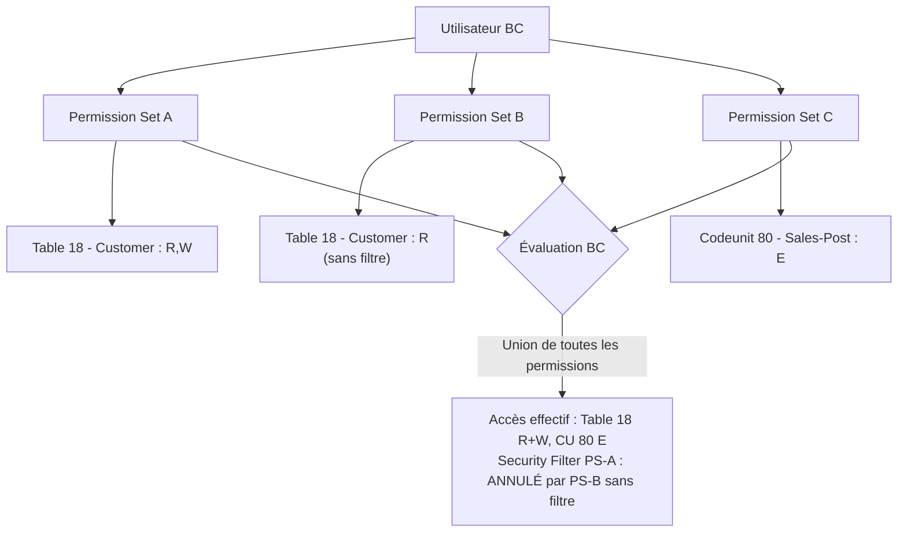

# Sécurité Business Central

## Objectifs pédagogiques

À l'issue de ce module, vous serez capable de :

1. **Identifier** pourquoi le modèle additif de BC crée des vulnérabilités structurelles spécifiques, absentes dans les modèles RBAC classiques
2. **Configurer** des Permission Sets AL corrects et non-permissifs en contexte réel, avec justification de chaque droit RIMD
3. **Appliquer** les Security Filters pour restreindre l'accès aux données à la ligne, en comprenant leurs limites d'annulation
4. **Détecter** les Permission Sets trop larges, les `SecurityFiltering::Ignored` et les compositions dangereuses avant une mise en production
5. **Durcir** une extension AL contre les élévations de privilèges internes via une checklist de validation pré-livraison exécutable

---

## Mise en situation

Septembre 2023. Un intégrateur Business Central livre une extension ISV pour un client dans la distribution. Trois semaines après la mise en prod, un utilisateur du rôle "Magasinier" accède à l'historique complet des salaires via un état AL personnalisé. Personne ne l'a vu venir — ni le client, ni l'intégrateur.

Ce qui s'est passé : le développeur a créé un Permission Set qui inclut `EXECUTE` sur toutes les codeunits du module RH, "pour éviter les erreurs à l'exécution". La codeunit en question appelle une query sur la table `Employee Ledger Entry` (table 5601), qui remonte les montants nets de paie. Le rôle Magasinier hérite de ce Permission Set par composition de rôles. Résultat : accès complet en lecture à des données financières sensibles, zéro log de sécurité, zéro alerte.

La défense naïve — "on a des rôles utilisateurs différents" — ne suffit pas parce que dans BC, ce n'est pas le rôle UI qui protège les données. C'est le Permission Set lié à la table et aux objets. Un rôle UI contrôle ce que l'utilisateur *voit*. Un Permission Set mal construit lui donne accès à ce qu'il ne devrait pas *pouvoir lire*. Ce module explique pourquoi, et comment corriger ça avant que ça arrive chez vous.

---

## Surface d'attaque Business Central : pourquoi BC est différent

Business Central présente une surface d'attaque différente d'une application web classique. Les vecteurs ne sont pas principalement réseau — ils sont **applicatifs et organisationnels**. La raison structurelle est double :

**1. Le modèle additif** : BC n'a pas de "deny" explicite. Toute permission accordée dans un seul des Permission Sets d'un utilisateur est active — impossible de la retirer avec un autre PS. Dans un modèle RBAC classique, vous pouvez interdire explicitement. Dans BC, vous ne pouvez qu'*omettre*.

**2. L'absence de deny crée des angles morts de composition** : quand vous composez des rôles avec `IncludedPermissionSets`, vous héritez de tout — y compris ce que vous ne vouliez pas accorder. Un Permission Set Opérateur inclus dans Superviseur transporte ses accès sans exception ni filtre possible.

| Vecteur | Exposition | Impact potentiel | Risque |
|---|---|---|---|
| Permission Set avec `EXECUTE` wildcard sur codeunits | Interne — tout utilisateur BC | Accès aux données non autorisées via objets tiers | **Critique** |
| Absence de Security Filter sur tables sensibles | Interne | Lecture cross-company ou cross-dimension | **Critique** |
| `tabledata * = RIMD` dans un PS | Interne multi-extensions | Accès à toutes les tables tenant, tokens, RH | **Critique** |
| API Page sans Permission Set restrictif + Conditional Access | Externe (OAuth2) | Dump complet via pagination OData | **Critique** |
| `SecurityFiltering::Ignored` dans du code utilisateur | Interne — code AL | Contournement silencieux de tous les filtres | **Majeur** |
| `CHANGECOMPANY` sans validation d'accès | Interne — code AL | Traversée de périmètre company | **Majeur** |
| Extension AppSource avec permissions excessives | Interne — installation tenant | Accès silencieux à tables système ou financières | **Majeur** |
| `SUPER` oublié en prod après débogage | Interne — erreur humaine | Accès total à toutes les données et configuration | **Critique** |

🔴 **Vecteur d'attaque** — Le vecteur le plus courant en production n'est pas un attaquant externe. C'est un utilisateur interne qui tombe sur des données accessibles par accident de configuration, ou un consultant qui teste avec un compte admin et ne retire jamais les permissions après. Le modèle additif transforme chaque oubli en brèche silencieuse.

---

## Modèle de permissions BC : comprendre pourquoi l'union crée le danger

Avant d'aller sur le hardening, il faut comprendre comment BC évalue une permission — parce que le modèle est additif, pas restrictif. Microsoft a fait ce choix par souci de simplicité administrative : un PS accordé = une capacité ajoutée, sans effet de bord sur les autres. C'est prévisible pour l'administrateur qui assigne des rôles. C'est dangereux pour le développeur qui compose des PS sans auditer leurs intersections.



**Ce que ce diagramme montre concrètement :** PS-A déclare un Security Filter sur la table Customer. PS-B donne READ sur la même table sans filtre. Résultat : le filtre de PS-A est annulé. L'utilisateur voit tous les enregistrements — pas seulement les siens. C'est ici que la plupart des incidents de fuite de données BC prennent leur source.

🧠 **Concept clé** — La seule façon de vraiment restreindre l'accès à des données est soit de ne pas inclure la permission dans *aucun* des Permission Sets assignés, soit d'ajouter un **Security Filter** dans *tous* les PS qui donnent accès à cette table. Un seul PS sans filtre suffit à tout annuler.

Ce choix de Microsoft a une conséquence directe sur la gouvernance : **vous ne pouvez pas sécuriser par défaut en BC**. Vous sécurisez par construction rigoureuse et par audit systématique avant livraison.

---

## Permission Sets en AL : construire correctement

### La déclaration d'un Permission Set

Un Permission Set en AL est un objet `permissionset` déclaré dans votre extension. Il est versionné avec votre code et déployé via l'extension — contrairement aux anciens PS définis en base de données, il ne peut pas être modifié accidentellement par un administrateur BC.

```al
permissionset 50100 "BC Warehouse Operator"
{
    Assignable = true;
    Caption = 'Warehouse Operator', Locked = true;

    Permissions =
        tabledata "Item" = R,
        tabledata "Warehouse Entry" = RI,
        tabledata "Posted Whse. Receipt Header" = R,
        codeunit "Warehouse Post Receipt" = X,
        page "Warehouse Receipt" = X,
        report "Inventory - List" = X;
}
```

Quelques points précis sur la syntaxe :

- `tabledata` → accès aux **données** d'une table (RIMD : Read, Insert, Modify, Delete)
- `table` → accès à l'**objet** table lui-même (pour le code AL qui référence la table en définition)
- `codeunit`, `page`, `report` → accès à l'exécution de l'objet (`X` = Execute)
- `Assignable = true` → ce Permission Set est assignable directement à un utilisateur. Mettre `false` pour un PS interne utilisé uniquement en composition.

⚠️ **Erreur fréquente** — Beaucoup de développeurs mettent `tabledata "Item" = RIMD` par défaut "pour éviter les erreurs". En prod, un opérateur en entrepôt n'a aucune raison de supprimer des articles. Chaque lettre RIMD doit être justifiée — commentez pourquoi le `D` ou le `M` est nécessaire.

### Les wildcards : le piège classique

```al
// ❌ NE JAMAIS FAIRE EN PROD
Permissions =
    tabledata * = RIMD,
    codeunit * = X;
```

Ce pattern existe dans `SUPER` et `SECURITY` — deux Permission Sets système réservés à l'administration. Dans une extension standard, il n'a aucune justification. Sur un tenant multi-extensions, `tabledata * = RIMD` donne accès à *toutes* les tables de *toutes* les extensions installées, y compris les tables de configuration contenant des clés API tierces, des tokens d'intégration stockés en base, ou des données RH d'une autre extension.

### Composition et héritage de Permission Sets

```al
permissionset 50101 "BC Warehouse Supervisor"
{
    Assignable = true;
    Caption = 'Warehouse Supervisor', Locked = true;

    IncludedPermissionSets = "BC Warehouse Operator";  // héritage additif

    Permissions =
        tabledata "Warehouse Setup" = RM,
        page "Warehouse Setup" = X;
}
```

`IncludedPermissionSets` fait hériter tous les droits du Permission Set inclus. C'est additif — vous ne pouvez pas *retirer* une permission héritée. Si `BC Warehouse Operator` donne `READ` sur une table, `BC Warehouse Supervisor` l'aura aussi, quoi que vous fassiez.

💡 **Astuce** — Avant de composer des Permission Sets, cartographiez les tables et codeunits de chaque PS inclus. En BC, la page **Permission Sets** (9802) permet d'exporter la liste des objets par extension. Ne composez pas ce que vous n'avez pas audité — chaque `IncludedPermissionSets` est une surface d'accès héritée aveuglément.

---

## Security Filters : protection au niveau de la ligne

Un Permission Set dit si un utilisateur peut *accéder* à une table. Un Security Filter dit *quelles lignes* il peut voir dans cette table. C'est la défense en profondeur côté données — mais elle a une limite critique que beaucoup ignorent.

### Configurer un Security Filter en AL

Les Security Filters se configurent sur le `permissionset`, en suffixant la permission tabledata :

```al
Permissions =
    tabledata "Sales Header" = R filter (WHERE ("Salesperson Code" = FIELD (User ID)));
```

🧠 **Concept clé** — Le Security Filter est injecté par BC dans **toutes** les requêtes SQL générées sur cette table pour cet utilisateur. C'est transparent pour le code AL : l'utilisateur ne voit jamais les lignes filtrées, et le `COUNT()` est aussi filtré. Il n'y a pas de contournement possible depuis le code AL côté utilisateur — sauf via `SecurityFiltering::Ignored`, traité plus bas.

En pratique, les Security Filters les plus utiles en contexte ERP :

| Table | Filtre typique | Justification |
|---|---|---|
| `Sales Header` | `Salesperson Code = USER` | Chaque commercial ne voit que ses devis/commandes |
| `Purchase Header` | `Purchaser Code = USER` | Acheteurs isolés par portefeuille |
| `Employee` | `Company No. = COMPANY` | Isolation cross-company en multi-société |
| `G/L Entry` | `Global Dimension 1 Code = <DEPT>` | Lecture comptable par département |

⚠️ **Erreur fréquente** — Les Security Filters ne s'appliquent qu'aux accès *via le Permission Set qui les déclare*. Si un utilisateur a un deuxième Permission Set qui donne `READ` sur la même table *sans filtre*, le filtre est annulé. L'union des permissions inclut l'union des filtres — et un filtre vide = accès total. C'est le point le plus dangereux du modèle BC, et le plus souvent ignoré.

### Vérifier les Security Filters appliqués

En BC, la page **Effective Permissions** (9852) montre les permissions réelles d'un utilisateur après résolution de tous ses Permission Sets, filtres compris. C'est votre outil de diagnostic de première intention.

Chemin UI : **Utilisateurs → [Utilisateur] → Effective Permissions** → sélectionner la table cible → BC affiche les droits RIMD effectifs et le Security Filter actif. Si la colonne Security Filter est vide sur une table sensible (`Employee`, `G/L Entry`, `Payroll Entry`), c'est un risque à corriger immédiatement.

---

## API Pages et OData : la surface externe

Business Central expose ses données via OData v4 et des API Pages. En SaaS, ces endpoints sont accessibles depuis l'extérieur avec une authentification OAuth2/Entra ID. Mal configurés, ils constituent un vecteur d'exfiltration direct — silencieux et sans alerte.

### Ce qu'expose une API Page

```al
page 50200 "Item API"
{
    PageType = API;
    APIPublisher = 'mycompany';
    APIGroup = 'warehouse';
    APIVersion = 'v1.0';
    EntityName = 'item';
    EntitySetName = 'items';
    SourceTable = Item;

    layout
    {
        area(Content)
        {
            field(no; "No.") { }
            field(description; Description) { }
            field(unitCost; "Unit Cost") { }
        }
    }
}
```

Cette page génère automatiquement un endpoint OData :
```
GET https://<tenant>.api.businesscentral.dynamics.com/v2.0/<env>/api/mycompany/warehouse/v1.0/companies(<id>)/items
```

🔴 **Vecteur d'attaque** — Un service account avec `SUPER` ou avec un Permission Set large peut être utilisé pour extraire l'intégralité d'une table via pagination OData (`$top=1000&$skip=0`, `$top=1000&$skip=1000`...). Si ce service account n'a pas de Security Filter et pas de restriction d'IP côté Entra ID (Conditional Access), c'est une exfiltration sans bruit, sans log applicatif BC, visible uniquement dans les logs Entra ID si vous les surveillez.

### Durcir les API Pages

**1. Créer un Permission Set dédié à l'intégration**

```al
permissionset 50110 "API Integration - Items Read"
{
    Assignable = true;
    Caption = 'API Integration - Items Read', Locked = true;

    Permissions =
        tabledata "Item" = R,
        page "Item API" = X;
    // Pas de codeunit, pas d'autres tables, pas de SIMD
}
```

**2. N'assigner que ce Permission Set au service account d'intégration** — jamais `SUPER`.

**3. Côté Entra ID**, appliquer une Conditional Access Policy qui restreint le service account à des plages IP connues (l'IP de votre middleware d'intégration). Chemin : **Entra ID → Security → Conditional Access → New Policy → Conditions → Locations → IP ranges**.

⚠️ **Point pratique** — Avant d'activer la restriction IP, testez l'accès du service account depuis les IP autorisées pour vérifier l'absence de régression. Les VPN d'entreprise et proxies internes utilisés par les développeurs doivent être explicitement inclus dans les plages autorisées, sinon l'accès au service account depuis ces postes sera bloqué. Vérifiez également que la Conditional Access Policy n'entre pas en conflit avec d'autres policies existantes sur le tenant Entra ID.

🔒 **Contrôle de sécurité** — La combinaison Permission Set minimal + Conditional Access IP est le contrôle de base pour les intégrations BC. L'un sans l'autre est insuffisant : un Permission Set minimal ne protège pas si les credentials sont volés et utilisés depuis une IP tierce.

---

## `SecurityFiltering` : le contournement que personne ne voit

La propriété `SecurityFiltering` existe sur les variables de type `Record` en AL. Elle contrôle si les Security Filters du Permission Set sont appliqués lors de l'accès à la table. C'est le contournement silencieux le plus dangereux du modèle BC — aucun log, aucune alerte, aucune trace applicative.

```al
// ❌ DANGEREUX si cette codeunit est accessible aux utilisateurs
local procedure GetAllSalesHeaders()
var
    SalesHeader: Record "Sales Header";
begin
    SalesHeader.SecurityFiltering := SecurityFiltering::Ignored;
    if SalesHeader.FindSet() then
        repeat
            // accès à TOUTES les lignes, sans filtre
            // un Magasinier qui déclenche cette codeunit via une action page
            // voit les données de tous les commerciaux, toutes les sociétés
        until SalesHeader.Next() = 0;
end;
```

**Comment un utilisateur déclenche réellement ce contournement :** la codeunit est exposée via une action sur une page accessible à l'utilisateur (action dans une Card Page, un Role Center, un report), ou via un Report qui appelle la codeunit. Si l'utilisateur a `X` sur cette codeunit dans un de ses Permission Sets — même indirectement via `IncludedPermissionSets` — il peut déclencher l'exécution et accéder à toutes les lignes sans restriction.

Les valeurs possibles :

| Valeur | Comportement |
|---|---|
| `SecurityFiltering::Filtered` | Applique les Security Filters (défaut) |
| `SecurityFiltering::Validated` | Applique les filtres ET lève une erreur si l'utilisateur n'a pas accès |
| `SecurityFiltering::Ignored` | Ignore complètement les Security Filters |

🔒 **Contrôle de sécurité** — Auditez votre codebase AL pour toute occurrence de `SecurityFiltering::Ignored`. Dans une extension standard, il ne devrait pas y en avoir. Si vous en avez besoin pour un traitement administratif (batch, job queue nocturne), la codeunit concernée doit être exclue du Permission Set des utilisateurs non-administrateurs — et cette exclusion doit être documentée.

```bash
# Recherche dans votre workspace AL
# Attention : retourne aussi les occurrences dans les commentaires
# Interpréter chaque résultat : légitime (batch admin) ou risqué (code utilisateur) ?
grep -rn "SecurityFiltering::Ignored" --include="*.al" ./src
```

---

## SaaS vs OnPrem : pourquoi la sécurité n'est pas la même

Le module 25 couvre la sécurité en général, mais la différence SaaS / OnPrem mérite une explication causale — parce qu'elle change ce que vous pouvez et devez contrôler.

**En OnPrem**, vous contrôlez l'infrastructure : réseau, accès SQL direct, Active Directory, firewall. La surface de risque est plus large (accès SQL direct possible si mal configuré), mais vous avez plus de leviers techniques. Les Permission Sets restent le contrôle principal côté applicatif, mais vous pouvez doubler avec des contrôles réseau.

**En SaaS (BC Online)**, vous n'avez pas accès au SQL Server ni à l'infrastructure Microsoft. Votre seul levier d'isolation est applicatif : Permission Sets, Security Filters, Conditional Access Entra ID. En contrepartie :

- L'isolation multi-tenant est gérée par Microsoft au niveau infrastructure
- Les accès SQL directs sont impossibles — tout passe par les APIs BC ou l'interface web
- Entra ID est obligatoire pour l'authentification — plus de Basic Auth depuis 2022
- Les Conditional Access Policies sont votre seul outil de restriction d'accès réseau

**Conséquence pratique** : en SaaS, la sécurité repose entièrement sur la rigueur de vos Permission Sets et de votre configuration Entra ID. Il n'y a pas de filet de sécurité infrastructure. Un Permission Set trop large en SaaS est directement exposé via OData depuis n'importe quelle IP — sans Conditional Access, sans restriction.

---

## Cas réel en entreprise

**Contexte** : ETI française, 200 utilisateurs BC SaaS, extension développée en interne pour la gestion des notes de frais. Livrée avec un Permission Set unique `EXPENSE_ALL` assigné à tous les employés.

**Ce qui s'est passé** : lors d'un audit interne 8 mois après la mise en prod, le RSSI découvre que `EXPENSE_ALL` inclut `tabledata "Employee" = RIMD` — nécessaire pour afficher le nom de l'employé dans l'état de note de frais. Cette table contient aussi le salaire mensuel, le poste, et le manager direct. Les 200 employés avaient `READ` sur l'intégralité de la table `Employee`.

**Pourquoi personne ne l'a vu** : le développeur avait utilisé `tabledata "Employee" = RIMD` pour éviter des erreurs lors de la création de notes de frais. Ni le recetteur fonctionnel ni le client n'avait pensé à vérifier les données réellement accessibles via cette permission — parce que la page UI n'affichait que le nom.

**Comment un utilisateur pouvait réellement accéder aux données** : via un appel OData direct `GET .../Employee` avec ses credentials, ou via un état AL qui listait les enregistrements de la table. La page ne montrait que le nom — mais la permission ouvrait la table entière.

**Correction appliquée** :
1. Création d'une `TableExtension` sur `Employee` avec uniquement les champs nécessaires à l'affichage (No., Name, Department Code)
2. Refactorisation du Permission Set pour donner accès à une query AL restrictive qui ne projette que ces champs — pas à la table brute
3. Ajout d'un Security Filter `WHERE (No. = FIELD(User ID))` pour les accès en lecture propre à l'employé connecté
4. Audit complet de tous les Permission Sets de l'extension via la checklist ci-dessous

**Leçon architecturale** : la granularité de `tabledata` en BC est au niveau de la table — pas au niveau du champ. Si vous avez besoin d'un champ d'une table sensible, la bonne architecture est une **Query AL** ou une **API Page dédiée** qui ne projette que les champs nécessaires, avec un Permission Set qui donne accès à cet objet AL — pas à la table brute.

---

## Audit pré-livraison : comment valider qu'une extension est sécurisée

C'est la section que la plupart des modules de sécurité BC omettent. Savoir que le modèle est additif ne suffit pas — il faut un workflow de validation que vous pouvez exécuter avant chaque livraison.

### Workflow d'audit opérationnel en 5 étapes

**Étape 1 — Lister tous les Permission Sets de l'extension**

Dans VS Code, listez tous les fichiers `.al` contenant `permissionset`. Pour chaque PS, notez : les tables avec accès, les droits RIMD accordés, les Security Filters déclarés, les `IncludedPermissionSets`.

**Étape 2 — Pour chaque table dans chaque PS, poser ces 5 questions**

1. Cette table contient-elle des données sensibles (salaires, données personnelles, données financières) ?
2. Le droit accordé (RIMD) est-il le minimum nécessaire ?
3. Un Security Filter est-il déclaré ? Si non, pourquoi l'accès total est-il justifié ?
4. Ce PS est-il inclus dans un autre PS via `IncludedPermissionSets` ? Si oui, l'accès est-il toujours justifié dans ce contexte ?
5. Ce PS donne-t-il accès à une codeunit qui contient `SecurityFiltering::Ignored` ?

Si vous ne pouvez pas répondre à une de ces questions, c'est un risque non résolu.

**Étape 3 — Grepper les contournements dans le code**

```bash
# Contournements SecurityFiltering
grep -rn "SecurityFiltering::Ignored" --include="*.al" ./src

# Wildcards tabledata
grep -rn "tabledata \* =" --include="*.al" ./src

# CHANGECOMPANY sans pattern de validation
grep -rn "CHANGECOMPANY\|ChangeCompany" --include="*.al" ./src
```

Chaque résultat doit être examiné : est-ce un contexte administratif légitime ou du code accessible aux utilisateurs ?

**Étape 4 — Tester via Effective Permissions pour les 3 rôles les plus larges**

Dans votre sandbox BC, assignez vos Permission Sets à un utilisateur test par rôle (Opérateur, Superviseur, Manager). Pour chaque utilisateur test :

1. Ouvrir **Effective Permissions** (9852)
2. Sélectionner chaque table sensible de votre extension
3. Vérifier que la colonne "Security Filter" n'est pas vide si un filtre est attendu
4. Vérifier que les droits RIMD correspondent exactement à ce qui est documenté

**Étape 5 — Test de traversée OData**

Avec le compte de service d'intégration (ou un compte test avec le PS minimal) :

```
GET https://<tenant>.api.businesscentral.dynamics.com/v2.0/<env>/api/.../Employee
```

La réponse doit être soit vide, soit restreinte aux enregistrements autorisés. Si vous recevez tous les enregistrements alors qu'un Security Filter est déclaré, cherchez quel autre PS annule le filtre via Effective Permissions.

### Exemple complet : tester qu'un Magasinier ne voit pas les salaires

**Setup** : créer un utilisateur test `magasinier.test@tenant.com` dans la sandbox BC.

**Affectation PS** : assigner uniquement les Permission Sets du rôle Magasinier de votre extension.

**Vérification Effective Permissions** :
1. Aller dans **Utilisateurs → magasinier.test → Effective Permissions**
2. Rechercher la table `Employee` (table 5200) et `Payroll Entry` (table 5601)
3. Si une de ces tables apparaît avec des droits RIMD → risque identifié
4. Si elle apparaît avec un Security Filter (ex. `No. = [User ID]`) → vérifier que le filtre est bien restrictif

**Test OData** (requiert un token OAuth2 valide pour ce compte) :
```
GET .../Employee
```
Résultat attendu : liste vide ou erreur 401/403. Si vous recevez des enregistrements, le PS est trop large.

**Test UI** : connecter le compte test dans BC, naviguer vers les pages Employee et Payroll. L'accès doit être refusé ou les pages inaccessibles.

---

## Erreurs fréquentes

| Erreur | Risque | Détection | Correction |
|---|---|---|---|
| `tabledata * = RIMD` dans un PS extension | **Critique** | `grep "tabledata \*"` sur les `.al` | Lister explicitement chaque table avec droits minimaux |
| `SUPER` assigné à un compte de service ou oublié en prod | **Critique** | Page Utilisateurs BC → colonne Permission Sets | Révoquer immédiatement, créer PS dédié |
| Security Filter déclaré mais annulé par un second PS | **Critique** | Effective Permissions → colonne Security Filter vide | Auditer tous les PS assignés sur la même table |
| `SecurityFiltering::Ignored` dans du code utilisateur | **Majeur** | `grep "SecurityFiltering::Ignored"` | Exclure la codeunit des PS utilisateurs |
| `CHANGECOMPANY` sans vérification d'accès | **Majeur** | `grep "CHANGECOMPANY"` | Ajouter validation ou restreindre aux traitements admin |
| `Assignable = true` sur les PS internes | **Mineur** | Review des fichiers permissionset `.al` | Passer à `Assignable = false` |
| `tabledata "Employee" = RIMD` pour afficher un nom | **Critique** | Audit table par table du PS | Query AL ou API Page dédiée projetant uniquement les champs nécessaires |

---

**`SUPER` comme Permission Set de débogage en prod**

Configuration dangereuse : un développeur assigne temporairement `SUPER` à un compte pour investiguer un bug en production. Il oublie de le retirer.

Conséquence : ce compte peut accéder à toutes les tables, modifier la configuration système, créer des utilisateurs, lire les données de tous les tenants en OnPrem multi-tenant.

Correction : utilisez un environnement Sandbox pour le débogage. En prod, utilisez la page **Effective Permissions** pour diagnostiquer sans élever les droits. Si vous devez élever temporairement, posez un rappel de révocation dans votre système de tickets avec délai maximum de 4 heures.

---

**`RunObject = Codeunit X`
