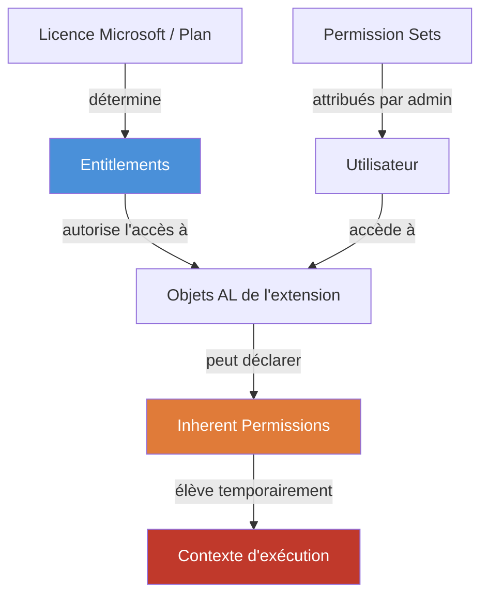
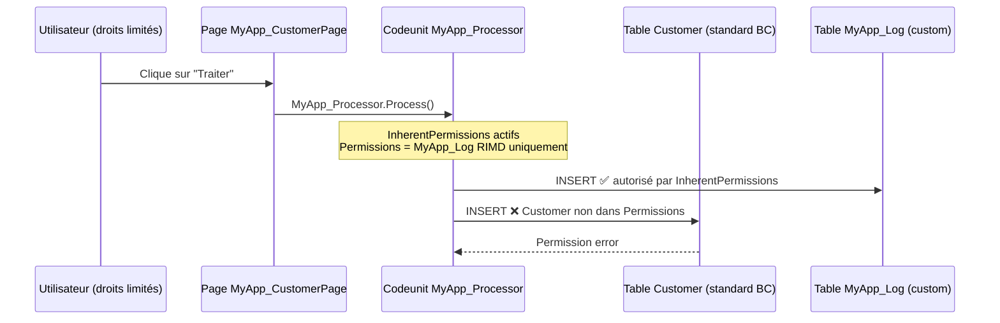

# Entitlements et Inherent Permissions en AL

## Objectifs pédagogiques

À l'issue de ce module, tu seras capable de :

1. **Distinguer** le rôle des Entitlements, des Permission Sets et des Inherent Permissions dans le modèle de sécurité BC
2. **Créer** un objet `Entitlement` AL adapté à un scénario SaaS AppSource ou par abonnement
3. **Configurer** des `InherentPermissions` sur un objet AL en respectant le principe de moindre privilège
4. **Identifier** les configurations qui ouvrent involontairement des vecteurs d'élévation de privilèges
5. **Auditer** les permissions effectives d'une extension AL depuis le code source et l'interface BC

---

## Mise en situation

Un éditeur ISV publie une extension sur AppSource. L'extension expose un `Codeunit` qui accède à des tables financières sensibles — journaux comptables, paramètres de TVA. Pour simplifier le déploiement chez ses clients, le développeur a déclaré `InherentPermissions` avec `RIMD` sur ces tables. Résultat : n'importe quel utilisateur qui déclenche ce codeunit, même un simple commercial sans droit comptable, peut modifier les journaux — parce que les `InherentPermissions` élèvent les droits de l'appelant pour la durée de l'appel, sans validation de son profil de base.

Le client découvre l'anomalie lors d'un audit interne : des entrées de journal ont été créées sous l'identité d'un utilisateur sans aucun Permission Set comptable. Pas d'exploitation malveillante ici — juste une mauvaise compréhension du mécanisme. Mais le vecteur existe : une extension tierce mal conçue peut servir de passerelle d'élévation de privilèges.

Ce module explique comment ce mécanisme fonctionne, pourquoi il est là, et comment l'utiliser sans créer ce type de dérive.

---

## Le modèle en trois couches

Avant d'aller dans le code, il faut avoir le modèle mental correct. Trois mécanismes coexistent et s'évaluent dans un ordre précis.



- **Entitlements** (nœud bleu) : contrôlent *qui peut accéder à quel objet* selon la licence souscrite. C'est la couche "droit d'entrée". BC l'évalue en premier — un objet absent de l'Entitlement est inaccessible, même si un Permission Set le couvre.
- **Permission Sets** : définissent *ce qu'un utilisateur peut faire* sur les données (RIMD par table). Couverts dans le module précédent.
- **Inherent Permissions** (nœud orange → rouge) : droits que *l'objet lui-même s'auto-octroie* pendant son exécution, indépendamment des droits de l'appelant. C'est ici que se concentrent les risques d'élévation de privilèges.

Un Entitlement bloqué empêche d'invoquer l'objet. Les Inherent Permissions ne peuvent pas court-circuiter les Entitlements — elles n'agissent qu'après que l'accès à l'objet est accordé.

---

## Entitlements : contrôle d'accès par licence

### Ce que c'est réellement

Un `Entitlement` est un objet AL qui mappe un plan de licence (ou un rôle Azure AD) à une liste d'objets autorisés avec un niveau d'accès défini. Microsoft l'utilise pour faire respecter les conditions de licence SaaS : tu ne peux pas accéder à une feature réservée au plan Premium si tu as un plan Essentials.

Pour les éditeurs ISV AppSource, c'est le mécanisme qui permet de segmenter l'accès selon l'abonnement souscrit par le client. C'est aussi un prérequis à la certification AppSource — sans Entitlements correctement définis, la soumission sera rejetée.

### Structure d'un objet Entitlement

L'exemple suivant montre deux paliers tarifaires pour la même app ISV. Le plan Essentials donne accès aux fonctions de base ; le plan Premium déverrouille les modules financiers.

```al
entitlement MyISV_PlanEssentials
{
    Type = PerUserOfferPlan;
    OfferType = AddOn;
    ObjectEntitlements =
        codeunit MyISV_CustomerSync = Execute,
        page MyISV_CustomerList = True,
        table MyISV_SyncLog = RIMD,
        report MyISV_CustomerReport = True;
}
```

```al
entitlement MyISV_PlanPremium
{
    Type = PerUserOfferPlan;
    OfferType = AddOn;
    ObjectEntitlements =
        codeunit MyISV_CustomerSync = Execute,
        codeunit MyISV_FinancialSync = Execute,       // accès supplémentaire plan Premium
        page MyISV_CustomerList = True,
        page MyISV_FinancialDashboard = True,
        table MyISV_SyncLog = RIMD,
        table MyISV_FinancialData = RIMD,
        report MyISV_CustomerReport = True,
        report MyISV_FinancialReport = True;
}
```

### Les types d'Entitlements disponibles — quand utiliser lequel

| Type | Usage typique | Contexte |
|------|---------------|---------|
| `PerUserOfferPlan` | Plan par utilisateur dans AppSource | ISV SaaS — le plus courant |
| `ConcurrentUserOfferPlan` | Plans par utilisateurs simultanés | Licences concurrentes |
| `Role` | Map à un rôle Azure AD (groupe AAD) | Usage interne ou partenaire, PTE |
| `Unlicensed` | Objets accessibles sans licence | À utiliser avec extrême parcimonie |

La distinction principale à retenir : `PerUserOfferPlan` est le choix standard pour AppSource. `Role` est adapté aux extensions déployées en interne (PTE) où l'accès est contrôlé via des groupes Azure AD.

**Entitlement pour usage interne (PTE) :**

```al
entitlement MyCompany_FinanceTeam
{
    Type = Role;
    RoleType = Local;
    // Mappe au groupe Azure AD de l'équipe finance
    ObjectEntitlements =
        page MyApp_FinanceDashboard = True,
        codeunit MyApp_FinanceProcessor = Execute,
        table MyApp_FinanceEntry = RIMD;
}
```

⚠️ **Point de vigilance** — Si un groupe Azure AD est mal configuré (trop large, membres non prévus), tous ses membres héritent des Entitlements mappés. L'audit des membres du groupe AAD est aussi critique que l'audit des Permission Sets BC.

**Erreur fréquente :** déclarer des objets helpers techniques (tables intermédiaires, codeunits internes) dans les Entitlements n'est pas nécessaire si ces objets ne sont jamais appelés directement depuis l'UI. En revanche, tout objet accessible depuis un point d'entrée utilisateur doit être déclaré — sinon BC peut bloquer l'exécution selon le contexte de sécurité actif.

---

## Inherent Permissions : l'élévation temporaire de privilèges

### Pourquoi ce mécanisme existe

Un Codeunit qui traite une écriture comptable a besoin d'écrire dans la table `G/L Entry`. L'utilisateur qui appuie sur un bouton n'a pas forcément le droit d'écrire directement dans cette table — et c'est intentionnel. Sans `InherentPermissions`, le développeur devrait soit donner les droits table à tous les utilisateurs concernés (mauvaise idée), soit configurer des Permission Sets additionnels chez chaque client (contrainte déploiement).

`InherentPermissions` résout ça proprement : l'objet AL déclare les permissions dont il a besoin pour fonctionner, et BC les octroie automatiquement pendant l'exécution — uniquement dans ce contexte, uniquement pour les tables explicitement déclarées.

### Syntaxe et portée

```al
codeunit 50100 MyApp_JournalProcessor
{
    // Déclaration des droits nécessaires à cet objet
    Permissions = tabledata "Gen. Journal Line" = RIMD,
                  tabledata "Gen. Journal Batch" = RI;

    // Active l'auto-octroi des droits déclarés ci-dessus pendant l'exécution
    InherentPermissions = X;

    procedure ProcessJournal(JournalBatch: Code[10])
    begin
        // L'appelant bénéficie automatiquement des permissions déclarées
        // même s'il n'a pas RIMD sur Gen. Journal Line dans son Permission Set
    end;
}
```

`X` signifie "tout ce qui est déclaré dans la propriété `Permissions` du même objet". Ce n'est pas un wildcard sur toutes les permissions BC — c'est uniquement la liste explicite que tu as déclarée.

### `InherentEntitlements` : la face Entitlement des Inherent Permissions

Les deux propriétés vont souvent ensemble sur les objets internes :

```al
codeunit 50101 MyApp_DataExporter
{
    Access = Internal;
    InherentEntitlements = X;   // l'objet s'auto-déclare accessible (usage interne)
    InherentPermissions = X;    // l'objet s'auto-octroie les droits listés dans Permissions
    Permissions = tabledata "MyApp_ExportLog" = RIMD,
                  tabledata "MyApp_ExportConfig" = RI;

    procedure ExportData()
    begin
        // Traitement avec élévation strictement limitée aux tables déclarées
    end;
}
```

### Ce que l'élévation couvre et ne couvre pas

C'est le point le plus important du module. L'élévation est strictement limitée aux tables et opérations déclarées — elle ne donne aucun accès global.



La table `Customer` n'est pas dans la déclaration `Permissions` du Codeunit → l'accès est refusé même pendant l'exécution avec `InherentPermissions = X`. L'élévation ne s'étend jamais au-delà de ce qui est explicitement déclaré.

---

## Configuration sécurisée : les bonnes pratiques

### Principe de moindre privilège

Ne déclarer dans `Permissions` que les tables et opérations strictement nécessaires à la fonction de l'objet. Si le Codeunit ne fait que lire pour calculer, ne déclarer que `R`, pas `RIMD`.

```al
// ❌ Trop large — M et D jamais utilisés dans ce Codeunit
codeunit 50102 MyApp_Calculator
{
    Permissions = tabledata "Sales Line" = RIMD,
                  tabledata "Item" = RIMD;
    InherentPermissions = X;

    procedure Calculate(SalesOrderNo: Code[20]): Decimal
    begin
        // lecture seule dans les faits
    end;
}

// ✅ Calibré sur l'usage réel
codeunit 50102 MyApp_Calculator
{
    Permissions = tabledata "Sales Line" = R,
                  tabledata "Item" = R;
    InherentPermissions = X;

    procedure Calculate(SalesOrderNo: Code[20]): Decimal
    begin
        // lecture seule — permissions cohérentes avec l'usage
    end;
}
```

### Séparer les objets publics des objets internes

C'est le pattern architectural qui contient le risque d'élévation. L'objet public (accessible depuis l'UI) ne porte pas d'`InherentPermissions` élevées — il délègue à un Codeunit `Internal` qui, lui, porte l'élévation dans un périmètre encapsulé.

```al
// Objet public — accessible depuis la Page, sans élévation
codeunit 50103 MyApp_PublicFacade
{
    // Pas d'InherentPermissions — l'appelant garde ses droits natifs pour les vérifications
    procedure TriggerProcess(EntryNo: Integer)
    begin
        // Vérification métier avec les droits de l'appelant
        // Si l'appelant n'a pas le droit de voir cette entrée : erreur levée ici
        CheckUserContext(EntryNo);
        // Délégation à l'interne avec élévation encapsulée
        MyApp_InternalProcessor.Execute(EntryNo);
    end;

    local procedure CheckUserContext(EntryNo: Integer)
    begin
        // Logique de validation qui tourne avec les droits natifs de l'appelant
    end;
}

// Objet interne — élévation justifiée et encapsulée
codeunit 50104 MyApp_InternalProcessor
{
    Access = Internal;  // Non appelable depuis une extension tierce
    Permissions = tabledata "MyApp_ProcessedEntry" = RIMD,
                  tabledata "MyApp_AuditLog" = RI;
    InherentPermissions = X;

    procedure Execute(EntryNo: Integer)
    begin
        // Traitement avec droits élevés — périmètre limité et connu
    end;
}
```

`Access = Internal` est la première barrière contre l'exploitation de l'élévation depuis une extension tierce. Sans cette propriété, n'importe quelle extension peut appeler le Codeunit et bénéficier de son élévation.

### Matrice décisionnelle : quand utiliser InherentPermissions

| Situation | InherentPermissions | Justification |
|-----------|---------------------|---------------|
| Codeunit de posting sur tables propriétaires | ✅ Oui | Élévation nécessaire, périmètre maîtrisé |
| Codeunit public déclenché depuis UI | ❌ Non | Garder les droits natifs de l'appelant |
| Helper interne sur tables BC standard (G/L Entry…) | ⚠️ À justifier | Chaque table standard = point d'audit obligatoire |
| Job Queue Codeunit sur tables propriétaires | ✅ Oui | Exécution sans contexte utilisateur — justifié |
| Codeunit de lecture seule (reporting, calcul) | ✅ R uniquement | Jamais RIMD si pas d'écriture |
| Objet appelé par des extensions tierces | ❌ Non | Risque d'exploitation de l'élévation depuis l'extérieur |

---

## Cas réel en entreprise

### Extension de workflow approbation

Un intégrateur développe une extension de workflow pour un client industriel. L'extension automatise l'approbation des commandes d'achat : quand une approbation est validée, un Codeunit crée automatiquement l'entrée comptable associée.

Configuration initiale du développeur :

```al
codeunit 50200 ApprovalWorkflow_PostEntry
{
    Permissions = tabledata "Purchase Header" = RIMD,
                  tabledata "Purch. Rcpt. Header" = RIMD,
                  tabledata "G/L Entry" = RIMD,            // ← problème
                  tabledata "Vendor Ledger Entry" = RIMD;  // ← problème
    InherentPermissions = X;
    InherentEntitlements = X;

    procedure PostApprovedOrder(PurchaseHeaderNo: Code[20])
    begin
        // ...
    end;
}
```

Les approbateurs (utilisateurs métier sans droits comptables) pouvaient déclencher ce Codeunit depuis leur interface. L'élévation leur permettait d'écrire dans `G/L Entry` et `Vendor Ledger Entry` — normalement réservées aux comptables. Un utilisateur a modifié par erreur des entrées en rappelant le workflow sur une commande déjà clôturée.

**Correction appliquée en quatre points :**

1. Le Codeunit est scindé : validation de l'approbation (droits approbateur) séparée de la comptabilisation (droits comptable)
2. La comptabilisation est déléguée à une Job Queue Entry qui tourne sous un compte de service avec les droits appropriés
3. `G/L Entry` et `Vendor Ledger Entry` sont retirés des `Permissions` du Codeunit approbateur
4. `InherentPermissions` est conservé uniquement sur le Codeunit interne, limité aux tables de workflow propriétaires

**Leçon :** l'élévation de privilèges via `InherentPermissions` est un outil de confort de déploiement — pas un mécanisme de contournement du modèle de permissions. Chaque table dans `Permissions` doit être justifiable par la fonction stricte de l'objet.

---

## Auditer les permissions effectives

### Depuis l'interface BC

Chemin : **Administration → Utilisateurs → [Utilisateur] → Permissions effectives**

La vue "Permissions effectives" agrège les Permission Sets directement attribués, les Permission Sets hérités via Security Groups, et les Entitlements actifs selon la licence.

Elle ne montre **pas** les `InherentPermissions` — celles-ci sont invisibles depuis l'UI car elles sont contextuelles à l'exécution d'un objet.

⚠️ **Erreur fréquente** — Se fier uniquement à la vue "Permissions effectives" pour conclure qu'un utilisateur ne peut pas modifier une table. Si un Codeunit avec `InherentPermissions` couvrant cette table est accessible à cet utilisateur, il peut contourner la restriction en passant par ce Codeunit.

### Auditer les Inherent Permissions dans le code source

Il n'existe pas de vue BC qui liste les `InherentPermissions` déclarées dans les extensions. L'audit doit se faire au niveau du code source.

Dans un projet d'audit ou de reprise de code, la procédure est la suivante :

**Étape 1 — Lister tous les objets avec InherentPermissions déclarées :**

```bash
grep -rn "InherentPermissions" ./src/ --include="*.al"
```

Résultat attendu : liste de fichiers `.al` avec le numéro de ligne. Exemple de sortie :

```
./src/Codeunit/50104.MyApp_InternalProcessor.al:5:    InherentPermissions = X;
./src/Codeunit/50200.ApprovalWorkflow_PostEntry.al:4: InherentPermissions = X;
```

**Étape 2 — Lister les accès aux tables standard BC sensibles :**

```bash
grep -rn "tabledata \"G/L Entry\"\|tabledata \"Cust. Ledger Entry\"\|tabledata \"Vendor Ledger Entry\"\|tabledata \"Gen. Journal Line\"" ./src/ --include="*.al"
```

**Étape 3 — Croiser les deux résultats :** tout fichier présent dans les deux listes est un point d'attention prioritaire à auditer manuellement. La question à poser pour chaque occurrence : est-ce que n'importe quel utilisateur peut déclencher cet objet depuis l'UI, et si oui, les opérations déclarées sont-elles justifiées ?

### Pas-à-pas : tester qu'un Entitlement bloque correctement

Ce test permet de vérifier qu'un utilisateur sans la bonne licence ne peut pas accéder aux objets réservés.

1. Créer un utilisateur test dans le tenant BC sandbox
2. Assigner une licence correspondant au plan inférieur de l'extension (ex. Essentials)
3. Ne pas attribuer de Permission Set supplémentaire — uniquement la licence
4. Se connecter en tant que cet utilisateur (ou utiliser la fonction "Visualiser comme")
5. Tenter d'accéder à une Page déclarée uniquement dans l'Entitlement Premium
6. **Résultat attendu :** erreur "You do not have access to this page" ou objet non visible dans le Role Center

Si l'objet reste accessible → l'Entitlement n'est pas correctement déclaré ou la licence n'est pas assignée via le bon plan dans le Partner Center.

### Tester le périmètre des Inherent Permissions

Ce test vérifie que l'élévation ne déborde pas sur des tables non déclarées.

```al
// Codeunit de test — à exécuter en tant qu'utilisateur sans droits G/L Entry
[Test]
procedure TestInherentPermissionsDoNotCoverUndeclaredTables()
var
    InternalProcessor: Codeunit MyApp_InternalProcessor;
    GLEntry: Record "G/L Entry";
    PermissionError: Boolean;
begin
    // Arrange : utilisateur de test sans Permission Set comptable
    // Act : tenter un accès direct à G/L Entry (non dans Permissions du Codeunit)
    PermissionError := false;
    ClearLastError();

    if not GLEntry.FindFirst() then
        PermissionError := GetLastErrorText() <> '';

    // Assert : l'accès direct doit être refusé
    Assert.IsTrue(PermissionError, 'G/L Entry doit être inaccessible sans Permission Set');

    // Act : déclencher le Codeunit avec InherentPermissions sur ses propres tables
    // L'appel doit réussir sur MyApp_ProcessedEntry (déclarée dans Permissions)
    // et échouer sur G/L Entry (non déclarée)
    InternalProcessor.Execute(1);
    // Si on arrive ici sans erreur, les InherentPermissions sont correctement limitées
end;
```

**Comment exécuter ce test :**
1. Déployer l'extension en sandbox avec les deux Codeunits (public + interne)
2. Créer un utilisateur de test avec une licence minimale et aucun Permission Set comptable
3. Lancer le test depuis le Test Runner BC (`CODEUNIT::"Test Runner - Mgt"`) ou depuis VS Code via le debugger en sélectionnant "Run tests"
4. Vérifier dans les résultats du Test Runner que le test passe (vert) — toute erreur inattendue signale une élévation non contrôlée

---

## Erreurs fréquentes

### 1. Mettre `InherentEntitlements = X` sur tous les objets par défaut

Ajouter `InherentEntitlements = X` en copier-coller sur chaque objet pour "éviter les erreurs d'accès" fait que tous les objets s'auto-déclarent accessibles — contournant la logique de segmentation par Entitlement. La segmentation par plan tarifaire (Essentials vs Premium) devient inopérante.

**Correction :** `InherentEntitlements = X` uniquement sur les objets `Access = Internal` appelés par d'autres objets de l'extension et qui ne doivent jamais apparaître dans un Entitlement externe.

### 2. Déclarer RIMD sur des tables standard pour "être tranquille"

```al
// À ne jamais faire
Permissions = tabledata "Customer" = RIMD,
              tabledata "Vendor" = RIMD,
              tabledata "Item" = RIMD;
InherentPermissions = X;
```

Tout utilisateur qui déclenche ce Codeunit peut modifier des clients, fournisseurs et articles — même sans aucun Permission Set correspondant. L'impact est souvent découvert lors d'un audit, pas au moment du développement.

**Correction :** identifier précisément quelles opérations (R, I, M, D) sont nécessaires sur quelles tables, et ne déclarer que ça.

### 3. Confondre `Permissions` (objet) et Permission Set

`Permissions` sur un objet AL = droits auto-octroyés pendant l'exécution de cet objet. Permission Set = collection de droits attribuée à un utilisateur par un administrateur.

Ce sont deux mécanismes orthogonaux. Un développeur qui modifie les `Permissions` d'un Codeunit ne modifie pas les Permission Sets des utilisateurs — mais il modifie ce qu'ils peuvent faire *indirectement* via cet objet. C'est là que réside le risque invisible.

---

## Résumé

Les **Entitlements** définissent le droit d'accès aux objets d'une extension selon la licence ou le plan souscrit — c'est la couche la plus haute, évaluée en premier, et obligatoire pour la certification AppSource. Les **Inherent Permissions** permettent à un objet de s'auto-octroyer des droits temporaires pendant son exécution, indépendamment des permissions de l'appelant. Ce mécanisme est conçu pour simplifier le déploiement — il évite de configurer des Permission Sets complexes chez chaque client. Mais mal utilisé, il crée des passerelles d'élévation de privilèges : un utilisateur sans droits comptables peut modifier des entrées comptables s'il peut déclencher un Codeunit avec les `InherentPermissions` appropriées. La règle centrale est de calibrer strictement `Permissions` sur la fonction réelle de l'objet, de séparer les objets publics (sans élévation, avec validation côté appelant) des objets internes (`Access = Internal`, avec élévation encapsulée), et d'auditer le code source — pas seulement les vues UI — pour avoir une image réelle des permissions effectives. La matrice décisionnelle du module donne le cadre de décision rapide. Le prochain module aborde les tests automatisés AL, où ces mécanismes de sécurité doivent être couverts par des tests explicites d'accès refusé.

---

<!-- snippet
id: al_entitlement_type_peruserplan
type: concept
tech: AL
level: intermediate
importance: high
format: knowledge
tags: entitlements, appsource, licence, al, permissions
title: Entitlement PerUserOfferPlan — segmentation par plan AppSource
content: Un Entitlement de type PerUserOfferPlan mappe un plan d'abonnement AppSource à une liste d'objets AL autorisés. BC évalue cet Entitlement avant les Permission Sets — si l'objet n'est pas listé, l'utilisateur ne peut pas y accéder même avec un Permission Set ad hoc. Un éditeur ISV crée un Entitlement par palier tarifaire (Essentials, Premium…) pour verrouiller l'accès aux features avancées. Type Role pour les PTE avec groupes Azure AD.
description: Entitlements évalués avant Permission Sets — objet absent = accès refusé même avec Permission Set. Mécanisme de segmentation licence AppSource obligatoire.
-->

<!-- snippet
id: al_inherent_permissions_scope
type: concept
tech: AL
level: intermediate
importance: high
format: knowledge
tags: inherent-permissions, elevation, al, security, permissions
title: InherentPermissions — élévation temporaire et périmètre strict
content: InherentPermissions permet à un objet AL de s'auto-octroyer des droits pendant son exécution. L'élévation est strictement limitée aux tables et opérations déclarées dans la propriété Permissions du même objet — X signifie "ce qui est listé dans Permissions", pas un wildcard global. Un utilisateur sans droits sur une table peut y écrire s'il déclenche un Codeunit avec InherentPermissions couvrant cette table. L'élévation s'arrête dès la sortie du contexte d'exécution.
description: InherentPermissions = X couvre uniquement les tables déclarées dans Permissions — pas toutes les tables BC. Vecteur de privilege escalation si mal calibré.
-->

<!-- snippet
id: al_inherent_permissions_rimd_overtrust
type: warning
tech: AL
level: intermediate
importance: high
format: knowledge
tags: inherent-permissions, rimd, security, al, privilege-escalation
title: InherentPermissions RIMD sur tables standard — vecteur d'élévation
content: Déclarer RIMD sur des tables standard BC (Customer, G/L Entry, Vendor…) avec InherentPermissions = X donne à tout utilisateur pouvant déclencher l'objet les droits de modifier ces tables — indépendamment de ses Permission Sets. Correction : déclarer uniquement R ou RI selon l'opération réelle, jamais RIMD par défaut. Chaque table standard dans Permissions est un point d'audit obligatoire.
description: RIMD + InherentPermissions sur tables standard BC = tout déclencheur de l'objet peut modifier ces tables. Auditer systématiquement ces déclarations.
-->

<!-- snippet
id: al_access_internal_isolation
type: tip
tech: AL
level: intermediate
importance: high
format: knowledge
tags: al, access-internal, inherent-permissions, encapsulation, security
title: Access = Internal pour isoler les Codeunits avec InherentPerm
