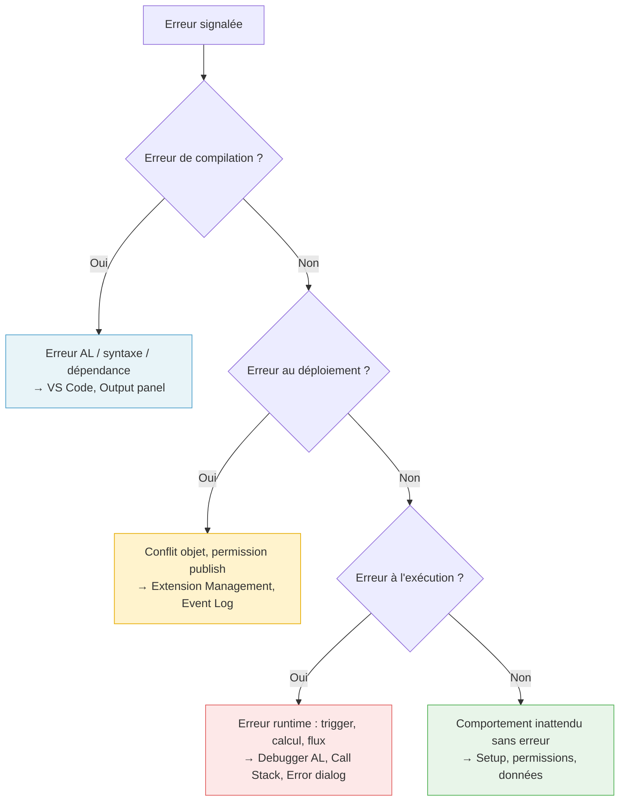

# Debugging et troubleshooting ERP

## Objectifs pédagogiques

À l'issue de ce module, tu seras capable de :

- **Lire et interpréter** un message d'erreur BC pour en identifier l'origine exacte (AL, base, plateforme)
- **Utiliser le debugger AL** dans VS Code pour poser des breakpoints, inspecter les variables et suivre un flux d'exécution
- **Diagnostiquer les erreurs les plus fréquentes** rencontrées en développement d'extensions : erreurs de compilation, erreurs runtime, conflits d'objets
- **Distinguer** ce qui relève d'un bug AL, d'un problème de configuration utilisateur, ou d'un comportement attendu de la plateforme
- **Mettre en place une démarche de diagnostic structurée** avant d'escalader ou de demander de l'aide

---

## Mise en situation

Tu viens de déployer une extension sur l'environnement sandbox du client. L'utilisateur te contacte : *"Ça plante quand je valide la commande."* C'est tout. Pas de copie d'écran, pas de numéro d'erreur, pas de reproduction systématique.

C'est le quotidien du développeur AL en contexte réel. L'erreur n'arrive jamais avec son mode d'emploi. Et dans un ERP comme Business Central, les causes possibles sont nombreuses : un champ mal renseigné, une permission manquante, un trigger qui appelle une fonction obsolète, un conflit entre deux extensions qui modifient la même table.

La tentation, quand on débute, c'est de regarder le dernier bout de code qu'on a touché. Parfois ça suffit. Souvent non. Ce module t'apprend à déboguer méthodiquement — pas en tâtonnant, mais en lisant les bons signaux aux bons endroits.

---

## Contexte et problématique

Business Central est un ERP multi-couches. Entre l'utilisateur qui clique et le code que tu as écrit, il y a la couche service (NST), la base de données, le système de permissions, les événements business, les autres extensions. Quand quelque chose casse, la cause peut venir de n'importe où.

Ce qui complique le diagnostic, c'est que BC masque souvent les détails techniques à l'utilisateur final. L'écran affiche *"Une erreur inattendue s'est produite"* — mais en dessous, il y a un call stack complet, un code d'erreur, parfois un identifiant de corrélation. **Savoir aller chercher ces informations**, c'est ce qui sépare un développeur qui résout les problèmes d'un développeur qui devine.

Autre particularité ERP : les flux métier sont longs et interconnectés. Valider une commande déclenche potentiellement une dizaine de codeunits, des événements publishers/subscribers, des vérifications de stock, des appels de journal. Un breakpoint mal placé ne capturera pas le bon moment. Il faut comprendre où le flux se trouve avant de commencer à poser des sondes.

---

## Les trois niveaux d'erreur à distinguer

Avant d'ouvrir le debugger, il faut savoir à quel niveau se situe le problème. Ce n'est pas la même démarche selon que l'erreur vient du code, de la config ou de la plateforme.



**Erreur de compilation** — BC refuse de construire l'extension. Le problème est dans le code source, visible immédiatement dans VS Code. C'est le niveau le plus simple : le compilateur te dit exactement où chercher.

**Erreur au déploiement** — L'extension se compile mais échoue à s'installer sur l'environnement. Cause typique : conflit de numérotation d'objets, dépendance manquante, signature incorrecte.

**Erreur runtime** — L'extension est installée, tout semble normal, mais ça plante à l'utilisation. C'est là que le debugger devient indispensable.

**Comportement inattendu sans erreur** — Le plus traître. Pas de message, pas de crash. Mais les données sont fausses, un calcul est incorrect, un document ne s'imprime pas. Ces cas demandent une lecture du flux métier plus qu'un debugger.

---

## Lire un message d'erreur BC correctement

Quand BC affiche une erreur à l'utilisateur, il y a plus d'informations que ce qui est visible au premier coup d'œil.

### L'erreur visible

L'utilisateur voit une boîte de dialogue avec un message. Ce message peut venir :
- **Du code AL** via `Error()`, `FieldError()`, `TestField()` — dans ce cas, le texte est souvent lisible et métier
- **De la plateforme BC** — messages plus techniques, parfois en anglais même si l'interface est localisée
- **De SQL Server** — erreurs bas niveau remontées par le NST (deadlock, contrainte de clé, timeout)

### Les détails cachés

⚠️ **Erreur fréquente** : fermer la boîte d'erreur sans lire les détails. BC propose souvent un lien *"Détails"* ou *"Plus d'informations"* qui contient le call stack complet. Ce call stack te dit exactement dans quelle codeunit, quelle fonction, à quelle ligne le problème s'est produit.

Dans l'environnement sandbox, tu peux aussi accéder aux logs depuis **Administration → Troubleshooting → Event Log** ou depuis la page **Extension Management** pour les erreurs de déploiement.

### L'identifiant de corrélation

Depuis BC 2021+, les erreurs runtime incluent un **Correlation ID** — un GUID unique qui identifie la session et la requête. Si tu travailles avec le support Microsoft ou si tu as accès aux logs Azure (on y reviendra dans le module suivant), ce GUID est le point d'entrée pour retrouver la trace complète.

Le Correlation ID apparaît dans le bas de la boîte d'erreur BC, sous les détails techniques, sous la forme d'un GUID formaté comme `xxxxxxxx-xxxx-xxxx-xxxx-xxxxxxxxxxxx`. Quand tu ouvres un ticket auprès du support Microsoft, ce GUID est le premier élément qu'on va te demander — il permet de retrouver immédiatement la trace exacte côté serveur sans avoir à reproduire l'erreur.

💡 **Astuce** : prends systématiquement un screenshot de la boîte d'erreur complète avant de la fermer. Une fois la boîte fermée, le Correlation ID est définitivement perdu côté client.

---

## Le debugger AL dans VS Code

C'est ton outil principal pour les erreurs runtime. Voici comment il fonctionne réellement — pas juste comment le lancer.

### Attacher le debugger à un environnement

Le debugger AL ne s'exécute pas en local : il s'attache à un environnement BC réel (sandbox ou OnPrem). La configuration se fait dans `launch.json`.

```json
{
  "version": "0.2.0",
  "configurations": [
    {
      "name": "Mon Sandbox Client",
      "type": "al",
      "request": "attach",
      "environmentType": "Sandbox",
      "environmentName": "SandboxDev",
      "tenant": "<TENANT_ID>",
      "breakOnError": "All",
      "breakOnRecordWrite": "None",
      "enableSqlInformationDebugger": true,
      "enableLongRunningSqlStatements": true,
      "longRunningSqlStatementsThreshold": 500
    }
  ]
}
```

Le paramètre `breakOnError` mérite attention. Avec la valeur `"All"`, le debugger s'arrête sur toutes les erreurs, y compris celles qui sont catchées dans le code (dans un bloc `if not ... then`). Utile pour voir ce qui se passe vraiment. Avec `"ExcludeBreakOnRecordWrite"`, moins de bruit. À ajuster selon ce que tu cherches.

`enableSqlInformationDebugger: true` active un panneau qui montre les requêtes SQL générées. Très utile pour diagnostiquer des problèmes de performance ou des erreurs de données inattendues. Concrètement, quand le debugger est pausé sur un breakpoint, un onglet supplémentaire apparaît dans le panneau debug — il liste chaque requête SQL exécutée depuis le début de la session, avec sa durée. Tu peux y voir apparaître une requête du type `SELECT * FROM "Customer" WHERE "No_"='C00042'` et sa durée en millisecondes. C'est immédiat pour repérer un `FindSet()` sans filtre qui part sur une table entière.

### Attacher vs Publier+Attacher

```json
"request": "launch"   // Publie l'extension ET démarre le debugger
"request": "attach"   // S'attache sans republier (l'extension doit déjà être installée)
```

En pratique, utilise `attach` quand tu veux déboguer une version déjà déployée sans risquer de modifier le comportement. Utilise `launch` quand tu travailles activement sur le code et veux tester une modification.

### Poser des breakpoints efficacement

Un breakpoint AL, c'est comme marquer une page dans un livre pour dire "arrête-toi ici". Mais dans un ERP, la même fonction peut être appelée des dizaines de fois dans un flux. Un breakpoint trop large va t'arrêter en permanence au mauvais moment.

**Breakpoint conditionnel** — clic droit sur le point rouge → *Edit Breakpoint* → ajouter une condition :

```al
Rec."No." = 'CMD-0042'
```

Avec ça, le debugger s'arrête uniquement quand la commande n°CMD-0042 passe par ce code. Indispensable en contexte multi-enregistrements.

**Logpoint** — alternative au breakpoint classique : au lieu de stopper l'exécution, il écrit un message dans la console de debug. Tu le crées exactement comme un breakpoint conditionnel (clic droit sur la marge), mais en choisissant *Add Logpoint* plutôt que *Add Conditional Breakpoint*. Tu entres un message avec des expressions entre accolades, par exemple :

```
Traitement Work Order {Rec."No."} — Statut : {Rec.Status} — Quantité : {Rec.Quantity}
```

À chaque fois que la ligne s'exécute, ce message s'affiche dans le panneau *Debug Console* sans interrompre l'utilisateur. Très utile pour tracer l'ordre d'exécution dans une boucle ou vérifier qu'un subscriber est bien appelé, sans bloquer le flux en production.

### Ce qu'on inspecte dans le panneau Variables

Quand le debugger s'arrête, tu vois trois zones :

- **Variables locales** — les variables déclarées dans la fonction en cours
- **Globals** — les variables globales de la codeunit
- **Watch** — des expressions que tu as ajoutées manuellement (ex : `Rec.Amount`, `Customer."Credit Limit (LCY)"`)

🧠 **Concept clé** : dans AL, `Rec` représente l'enregistrement courant sur lequel s'exécute le trigger ou la fonction. `xRec` contient les valeurs **avant** la modification. Comparer `Rec` et `xRec` dans un trigger `OnModify` est souvent très révélateur.

### Suivre le call stack

Le panneau *Call Stack* montre la pile d'appels — d'où vient l'exécution, dans quel ordre les fonctions se sont enchaînées. En ERP, c'est crucial parce qu'une erreur dans une codeunit de validation peut avoir été déclenchée depuis un événement lancé par une autre extension.

Si tu vois dans la pile un appel qui vient d'une codeunit que tu ne reconnais pas, vérifie si c'est une codeunit système BC ou une extension tierce. Les noms d'objets en AL incluent l'ID d'application source — tu peux remonter à l'extension concernée.

---

## Erreurs fréquentes et leur diagnostic

### Erreurs de compilation

Ces erreurs sont les plus simples à corriger car le compilateur indique exactement la position. Mais certains messages méritent d'être décodés.

| Message d'erreur | Ce que ça signifie vraiment | Correction |
|---|---|---|
| `The name 'X' does not exist in the current context` | Variable non déclarée ou typo | Vérifier la déclaration `var` |
| `No overload for method 'X' takes N arguments` | Mauvaise signature d'appel de fonction | Vérifier les paramètres attendus |
| `Table 'X' does not contain a field named 'Y'` | Champ inexistant ou extension de table non chargée | Vérifier les dépendances dans `app.json` |
| `Ambiguous reference to 'X'` | Même nom dans deux espaces différents | Qualifier avec le nom complet |
| `The type of 'X' is not compatible with 'Y'` | Mismatch de type (ex : Integer vs Decimal) | Conversion explicite nécessaire |

⚠️ **Erreur fréquente** : quand une table d'une autre extension est introuvable malgré une dépendance correcte dans `app.json`, vérifie que les symboles AL sont bien téléchargés et à jour. Sans ça, le compilateur travaille avec une version périmée du modèle et signale des erreurs fantômes sur des champs qui existent pourtant bien.

### Erreurs runtime classiques

**`The record in table X is not found`**

Cause : tentative d'accès à un enregistrement via `Get()` ou `FindSet()` sur un enregistrement inexistant, sans vérifier le retour booléen.

```al
// ❌ Dangereux
Customer.Get(CustomerNo);
Message(Customer.Name); // Plante si le client n'existe pas

// ✅ Correct
if Customer.Get(CustomerNo) then
    Message(Customer.Name)
else
    Error('Client %1 introuvable', CustomerNo);
```

**`You do not have the following permissions on TableData X: Insert`**

Cause : l'utilisateur ou la session système n'a pas les permissions nécessaires. En développement, on a souvent des droits larges et on découvre le problème en test utilisateur.

Vérification rapide : page **Effective Permissions** dans BC → entrer le nom de l'utilisateur et la table concernée. Tu vois exactement ce qu'il peut faire.

**`Another user has modified the record`**

C'est une erreur de concurrence. BC utilise un mécanisme de lock optimiste — si deux sessions lisent le même enregistrement et que l'une le modifie en premier, la deuxième reçoit cette erreur à la validation. En développement, tu peux la reproduire en ouvrant deux onglets sur le même enregistrement.

En code AL, la gestion correcte passe par `Rec.LockTable()` au bon moment — avant de commencer une série de modifications liées, pas après.

**`Maximum number of open transactions exceeded`**

Ce message apparaît quand des transactions imbriquées dépassent la limite plateforme. Cause typique : une boucle qui appelle `Commit()` à chaque itération, ou une architecture de code qui ouvre des transactions sans les fermer correctement.

🧠 **Concept clé** : dans BC, `Commit()` ferme la transaction en cours et en ouvre une nouvelle implicitement. Appeler `Commit()` dans une boucle sur des milliers d'enregistrements est un anti-pattern courant — non seulement c'est lent, mais ça peut mener à des états incohérents si une erreur arrive à mi-parcours.

### Erreurs de déploiement

**`Extension 'X' is already installed with a higher version`**

Tu essaies de déployer une version inférieure à celle installée. BC refuse le downgrade par défaut. Solution : passer par *Extension Management* → désinstaller la version existante, puis réinstaller. En sandbox seulement — en production, le downgrade n'est pas supporté.

**`Object ID X is already used by extension Y`**

Deux extensions déclarent le même ID d'objet (table, page, codeunit...). Les plages d'ID dans BC SaaS sont allouées par Microsoft — vérifie que ta plage est bien enregistrée et que tu ne débords pas sur les plages système (1-49999 réservées) ou sur celles d'une autre extension installée.

---

## Démarche de diagnostic structurée

Quand un bug arrive sans contexte clair, voilà comment procéder sans perdre de temps.

### 1. Reproduire avant de comprendre

Avant d'analyser quoi que ce soit, assure-toi de pouvoir reproduire le problème de façon déterministe. Si tu ne peux pas le reproduire, tu ne pourras pas vérifier que ta correction fonctionne.

Questions à poser : *"C'est arrivé une fois ou systématiquement ? Sur quel document précisément ? Avec quel utilisateur ?"*

### 2. Isoler la couche

Utilise l'arbre de décision du début de ce module. Est-ce que l'erreur se produit même avec un utilisateur admin (élimine les permissions) ? Est-ce que ça se produit avec les données d'un autre client (élimine une donnée corrompue spécifique) ? Est-ce que ça se produit sans ton extension activée (élimine ton code) ?

Cette technique d'**élimination par couche** est plus efficace que d'aller directement dans le code.

### 3. Lire l'erreur complète

Message complet, call stack, Correlation ID. Ne pas fermer la boîte avant d'avoir tout noté ou pris en screenshot.

### 4. Poser des breakpoints au bon endroit

Pas au début du flux — trop tôt, trop de bruit. Utilise le call stack de l'erreur pour identifier la fonction exacte qui plante, et pose le breakpoint juste avant.

### 5. Inspecter l'état, pas juste le code

Une fois le debugger arrêté, regarde les **données** autant que le code. Quelle est la valeur de `Rec`? Qu'est-ce qui a déclenché ce trigger ? Est-ce que `xRec` contient ce qu'on attend ?

💡 **Astuce** : dans le panneau Watch, ajoute des expressions comme `Rec.TableCaption`, `Rec.RecordId` pour identifier immédiatement sur quel enregistrement exact tu travailles sans avoir à chercher dans les variables locales.

---

## Cas réel en entreprise

### Scénario 1 — Champ renommé après une wave release

**Contexte** : une PME industrielle utilise BC avec une extension développée en interne pour gérer les bons de travail (Work Orders). Après une mise à jour de BC (wave release), la validation des bons de travail plante pour une partie des utilisateurs — pas tous.

**Symptôme initial** : *"Erreur inattendue lors de la validation"* — aucun détail dans le message utilisateur.

**Étape 1 — Reproduction** : le problème n'apparaît qu'avec des bons de travail qui ont au moins une ligne de type "Sous-traitance". Les bons sans sous-traitance passent normalement.

**Étape 2 — Lecture de l'erreur complète** : en cliquant sur "Détails" dans la boîte d'erreur, le call stack montre l'erreur dans `Codeunit 5407 - Prod. Order Status Management`, sous-appelée depuis l'extension personnalisée.

**Étape 3 — Isolation** : en désactivant temporairement l'extension et en testant avec le comportement standard BC, la validation fonctionne. Le problème vient bien du code personnalisé.

**Étape 4 — Debugger** : breakpoint conditionnel sur le trigger `OnBeforePostProductionOrder` de l'extension, avec condition sur le type de ligne. Le debugger révèle que l'extension accède à un champ qui a été **renommé dans la wave release** BC — le champ `"Subcontractor No."` a changé de position dans la table système.

**Résolution** : mise à jour de la référence dans le code de l'extension + re-téléchargement des symboles AL pour avoir le bon modèle. Temps total : 2h, dont 1h30 de reproduction et isolation.

**Ce qui aurait pris une journée sans méthode** : chercher dans tout le code de l'extension, tester des hypothèses au hasard, finir par déployer une version "au cas où" sans comprendre la cause.

---

### Scénario 2 — Conflit entre extensions tierces

**Contexte** : même client, quelques semaines plus tard. Une extension de gestion documentaire ISV a été installée sur le tenant. Depuis, la validation de certaines factures achat échoue — mais seulement pour un sous-ensemble de fournisseurs, et seulement depuis l'installation de l'extension tierce.

**Étape 1 — Isolation par désactivation** : depuis *Extension Management*, désactiver l'extension ISV. Le problème disparaît immédiatement. L'extension tierce est clairement impliquée.

**Étape 2 — Lire le call stack** : avec l'extension réactivée et le debugger attaché, le call stack montre un subscriber dans l'extension ISV qui s'abonne à `OnAfterPostPurchaseDoc`. Ce subscriber tente d'accéder à un champ de table étendu par l'extension interne — mais avec un mapping incorrect sur les fournisseurs de type "EU".

**Étape 3 — Décision** : le bug est dans l'extension tierce, pas dans le code interne. La correction appartient à l'éditeur ISV. En attendant, deux options : désactiver l'extension ISV sur les documents concernés (workaround opérationnel), ou patcher localement le mapping — ce qui crée une dépendance de maintenance à documenter.

Ce second scénario illustre quelque chose d'important : **le debugger sert aussi à prouver que le problème vient d'ailleurs**. Savoir isoler une extension tierce en cause est aussi précieux que trouver un bug dans son propre code.

---

## Bonnes pratiques

**Ne jamais déboguer en production directement.** Le debugger AL peut s'attacher à un environnement de production — c'est techniquement possible. C'est aussi une très mauvaise idée : tu bloques les sessions utilisateur quand un breakpoint est atteint. Toujours reproduire sur sandbox d'abord.

**Documenter les erreurs rencontrées.** Un fichier markdown dans le dépôt Git, même simple, qui liste les erreurs vues, leur cause et la correction. Dans 6 mois, quand le même problème revient (et il reviendra), tu as déjà la réponse.

**Utiliser `Error()` avec des messages actionnables.** Quand tu écris un `Error()` dans ton code, mets un message qui aide l'utilisateur à comprendre *quoi faire*, pas seulement *ce qui s'est passé*. `Error('Quantité insuffisante en stock pour l''article %1. Stock actuel : %2.', ItemNo, QtyOnHand)` — c'est infiniment plus utile que `Error('Erreur de stock')`.

**Exploiter `enableSqlInformationDebugger`** pour détecter les N+1 queries et les requêtes non filtrées. Un `FindSet()` sans filtre sur une table de 500 000 lignes ne causera pas d'erreur — mais ça ralentit tout et ça passe inaperçu sans cet outil.

**Isoler les hypothèses une par une.** Tester deux modifications en même temps, c'est ne pas savoir laquelle a résolu le problème. En debug, on isole.

**Désactiver les autres extensions pour isoler un conflit.** Depuis *Extension Management*, tu peux désactiver une extension temporairement. Si le problème disparaît, tu as trouvé le coupable. Méthode rapide avant de plonger dans le code.

**Vérifier les permissions en contexte utilisateur réel.** Tester avec son propre compte de développeur (souvent admin) ne reproduit pas les problèmes de permissions. Créer un utilisateur de test avec le profil exact de l'utilisateur concerné.

---

## Résumé

Le debugging en contexte ERP, c'est d'abord un problème de méthode avant d'être un problème d'outil. Avant d'ouvrir le debugger, il faut savoir à quel niveau se situe le problème — compilation, déploiement ou runtime — et reproduire le bug de façon fiable.

Le debugger AL dans VS Code s'attache à un environnement BC distant et permet d'inspecter les variables, suivre le call stack et poser des breakpoints conditionnels ou des logpoints non-bloquants. Les paramètres `breakOnError` et `enableSqlInformationDebugger` dans `launch.json` sont souvent sous-utilisés mais très précieux.

Les erreurs les plus fréquentes ont des signatures reconnaissables : `record not found`, problèmes de permissions, conflits de concurrence, champs renommés après une release. Les connaître permet de diagnostiquer en minutes ce qui prendrait des heures à tâtonner. Et quand le problème vient d'une extension tierce, la même méthode d'isolation par désactivation permet de le prouver sans ambiguïté.

La prochaine étape logique — la télémétrie et l'observabilité BC — complète ce tableau en te donnant accès aux traces d'exécution que le debugger interactif ne peut pas capturer : comportements en production, patterns sur la durée, corrélation entre logs.

---

<!-- snippet
id: al_debug_launch_config
type: concept
tech: al
level: intermediate
importance: high
format: knowledge
tags: debugger, launch-json, vscode, sandbox, configuration
title: Configuration debugger AL dans launch.json
content: Le debugger AL s'attache à un environnement BC distant (pas local). Dans launch.json, "request": "attach" s'accroche sans republier l'extension ; "request": "launch" publie puis attache. "breakOnError": "All" arrête sur toutes les erreurs, y compris celles catchées dans le code AL — utile pour voir ce qui se passe vraiment.
description: Deux modes distincts : "attach" pour déboguer une extension déjà déployée, "launch" pour publier+déboguer en même temps.
-->

<!-- snippet
id: al_debug_breakonall_behavior
type: tip
tech: al
level: intermediate
importance: medium
format: knowledge
tags: debugger, breakonerror, vscode, al
title: Utiliser breakOnError All pour déboguer les erreurs catchées
content: Avec "breakOnError": "All" dans launch.json, le debugger s'arrête même sur des erreurs capturées dans un "if not ... then" — ce qui permet de voir exactement pourquoi un Get() ou un FindSet() échoue, même si le code gère le cas sans le signaler visuellement.
description: Valeur "All" indispensable quand une erreur est silencieusement absorbée par le code AL mais produit un mauvais résultat.
-->

<!-- snippet
id: al_debug_rec_xrec
type: concept
tech: al
level: intermediate
importance: high
format: knowledge
tags: al, trigger, rec, xrec, debugger
title: Rec vs xRec dans les triggers AL
content: Dans un trigger OnModify ou OnValidate, "Rec" contient les valeurs après modification, "xRec" contient les valeurs avant. Comparer les deux dans le debugger (panneau Watch) permet de voir exactement quel champ a changé et de quelle valeur à quelle valeur. Fondamental pour diagnostiquer un trigger qui se déclenche de façon inattendue.
description: xRec = état avant modification. Comparer Rec et xRec dans le debugger révèle le delta exact qui a déclenché le trigger.
-->

<!-- snippet
id: al_debug_correlation_id
type: tip
tech: al
level: intermediate
importance: high
format: knowledge
tags: al, erreur, correlation-id, logs, business-central
title: Capturer le Correlation ID avant de fermer une erreur BC
content: Le Correlation ID apparaît dans le bas de la boîte d'erreur BC sous la forme d'un GUID (xxxxxxxx-xxxx-xxxx-xxxx-xxxxxxxxxxxx). C'est le premier élément demandé par le support Microsoft pour retrouver la trace serveur — il permet d'identifier la session et la requête exactes sans avoir à reproduire l'erreur. À communiquer tel quel lors d'un support case ou à rechercher dans Application Insights via une requête KQL sur le champ "correlationId". Une fois la boîte fermée, ce GUID est définitivement perdu côté client.
description: Screenshot la boîte d'erreur entière avant de la fermer — le Correlation ID disparaît et ne peut pas être retrouvé a posteriori sans accès aux
