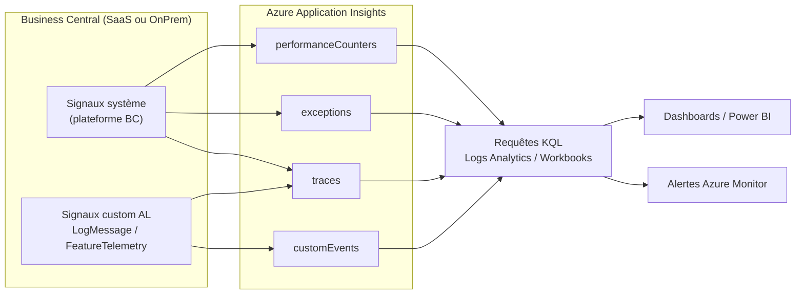

# Télémétrie et observabilité Business Central

## Objectifs pédagogiques

À l'issue de ce module, tu seras capable de :

1. **Connecter** un environnement Business Central à Application Insights et vérifier que les données remontent correctement
2. **Écrire des requêtes KQL** pour interroger les signaux de télémétrie BC — événements, erreurs, performances
3. **Distinguer** les différentes catégories de signaux BC (traces système, traces custom, métriques) et savoir lesquels activer selon ton besoin
4. **Émettre de la télémétrie custom** depuis le code AL avec `LogMessage` et `FeatureTelemetry`
5. **Construire un diagnostic structuré** à partir des traces — corréler une erreur utilisateur avec un log de session, une requête longue, un job en échec

---

## Mise en situation

L'équipe de dev est en prod depuis six mois. Un client appelle : "Mes utilisateurs se plaignent que la validation des commandes est lente depuis ce matin, et hier soir deux lots ont planté sans explication." Côté tech, personne n'était là la nuit. Il n'y a pas de log centralisé. La seule information disponible est un message d'erreur vague dans l'interface Business Central.

Le réflexe classique dans cette situation : fouiller les journaux d'événements Windows, relancer l'environnement, tenter de reproduire le problème. Ça fonctionne sur un OnPrem avec accès serveur. En SaaS Business Central, c'est impossible — tu n'as pas accès aux logs serveur, pas de SSH, pas d'Event Viewer. Si tu n'as pas configuré la télémétrie **avant** que le problème survienne, tu es aveugle.

C'est exactement l'objet de ce module. La télémétrie BC n'est pas un "nice to have" post-déploiement, c'est l'instrument de bord sans lequel tu ne peux pas piloter un ERP en production.

---

## Ce que couvre ce module — et ce qu'il ne couvre pas

On part du postulat que tu sais déjà utiliser les outils de debug AL (breakpoints, event log local, snapshots) — ce contenu est couvert dans le module précédent. Ici, on passe à l'échelle supérieure : **observer ce qui se passe en production**, sur de vraies sessions utilisateurs, sans interrompre le service.

On ne parle pas non plus de pipelines CI/CD ni de déploiement automatisé — ça, c'est le sujet du module suivant. Ce module est centré sur **l'observation et le diagnostic en environnement réel**.

---

## Architecture de la télémétrie BC

### Comment les données circulent

Business Central génère des **signaux de télémétrie** à chaque événement significatif : connexion d'un utilisateur, exécution d'une requête SQL, erreur runtime AL, appel d'une API externe, démarrage d'un job queue... Ces signaux sont envoyés vers **Azure Application Insights**, le service d'observabilité de Microsoft.



Ce qui est important à comprendre : **deux sources d'émission coexistent**. D'un côté, la plateforme BC elle-même émet des centaines de signaux automatiquement. De l'autre, ton code AL peut émettre ses propres signaux — et c'est là que la valeur business devient possible.

### Les tables Application Insights interrogeables

| Table AI | Ce qu'elle contient | Exemples BC |
|---|---|---|
| `traces` | Tous les événements structurés BC | Connexions, appels web services, SQL long, job queue |
| `exceptions` | Erreurs runtime capturées | Erreurs AL non gérées, stack traces |
| `customEvents` | Événements émis par ton code AL | Validation métier, étapes de workflow custom |
| `pageViews` | Navigation utilisateur dans BC | Pages consultées, durée de session |
| `requests` | Requêtes HTTP reçues par BC | Appels API entrants, OData |
| `dependencies` | Appels sortants depuis BC | HTTP vers APIs externes, Azure services |

---

## Connecter BC à Application Insights

### Côté Azure — créer la ressource

Avant tout, il faut une ressource Application Insights dans Azure. Elle peut être partagée entre plusieurs environnements BC, mais c'est déconseillé en pratique : les données se mélangent et les filtres deviennent vite complexes. Préfère **une ressource AI par environnement BC** (prod, sandbox, preprod).

Deux informations sont à récupérer depuis le portail Azure :
- La **Instrumentation Key** (format GUID) — utilisée par les versions BC plus anciennes
- La **Connection String** — format recommandé depuis BC 2022+

### Côté BC — configurer l'environnement

**Pour un environnement SaaS (BC Online) :**

Depuis le **Business Central Admin Center** (`https://admin.businesscentral.dynamics.com`) :

```
Admin Center → Environments → [Sélectionner l'environnement]
→ Application Insights Key → Coller la Connection String → Save
```

Le changement prend effet sans redémarrage. Les premiers événements apparaissent dans Application Insights dans les 5 à 10 minutes.

**Pour un OnPrem :**

Dans le fichier `CustomSettings.config` du service tier :

```xml
<add key="ApplicationInsightsConnectionString"
     value="InstrumentationKey=xxxx;IngestionEndpoint=https://westeurope-5.in.applicationinsights.azure.com/" />
```

Puis redémarrage du service BC Server.

💡 **Vérification rapide** — Dans Application Insights, aller dans *Live Metrics* juste après la configuration. Si un utilisateur se connecte à BC, tu dois voir immédiatement des points apparaître dans les graphiques temps réel. Si rien ne remonte au bout de 15 minutes, vérifier que la Connection String est correcte et que l'environnement BC est bien démarré.

### Télémétrie au niveau extension (ISV)

Si tu développes une extension AppSource ou un add-on réutilisable, tu peux connecter ta propre ressource Application Insights — distincte de celle du tenant client. Ça se configure dans `app.json` :

```json
{
  "applicationInsightsConnectionString": "InstrumentationKey=ton-guid-ici;IngestionEndpoint=https://westeurope-5.in.applicationinsights.azure.com/"
}
```

⚠️ **Attention** : cette clé est intégrée dans le package `.app`. Elle est donc visible. Ne jamais y mettre une clé qui donne des droits d'écriture sur des données sensibles. Application Insights en lecture seule sur ta propre ressource de monitoring est la bonne approche.

---

## Les signaux système BC — ce qui remonte automatiquement

Tu n'as pas à écrire une seule ligne de code pour que BC émette des centaines d'événements. Voici les catégories les plus utiles en contexte diagnostic.

### Événements de session et authentification

Chaque connexion d'un utilisateur produit un signal avec l'identifiant de session, le client type (Web, API, background), l'ID tenant, et le timestamp. En cas de problème "l'utilisateur dit qu'il ne peut pas se connecter", c'est le premier endroit à regarder.

```kql
traces
| where timestamp > ago(1h)
| where customDimensions.eventId == "RT0001"  // Session started
| project timestamp,
          user_Id,
          sessionId = customDimensions.sessionId,
          clientType = customDimensions.clientType
| order by timestamp desc
```

### Erreurs AL runtime

Quand une erreur AL non gérée survient (un `Error()` sans `if not Confirm(...)` qui protège, un `GetLastErrorText` pas traité), BC émet automatiquement un signal dans `exceptions`. C'est l'équivalent d'un stack trace, mais structuré.

```kql
exceptions
| where timestamp > ago(24h)
| where customDimensions.extensionName == "MonExtension"
| project timestamp,
          message,
          errorCode = customDimensions.alErrorCode,
          objectName = customDimensions.alObjectName,
          user_Id
| order by timestamp desc
```

### Performance SQL

Chaque requête SQL dont la durée dépasse un seuil (configurable, 500ms par défaut) est capturée dans `traces` avec l'événement `DT0004`. C'est un signal extrêmement puissant pour diagnostiquer les problèmes de performance sans accéder au serveur SQL.

```kql
traces
| where customDimensions.eventId == "DT0004"  // Long running SQL query
| extend durationMs = todouble(customDimensions.executionTimeInMs)
| where durationMs > 1000
| project timestamp,
          durationMs,
          sqlStatement = customDimensions.sqlStatement,
          objectName = customDimensions.alObjectName
| order by durationMs desc
| take 20
```

🧠 **Concept clé** — L'`eventId` est la clé de voûte du filtrage dans les traces BC. Microsoft maintient une liste complète des event IDs dans sa documentation. Les plus courants à connaître : `RT0001/RT0002` (session start/stop), `DT0004` (SQL long), `AL0000E2I` (job queue entry), `WS0001/WS0005` (web service calls). Mémorise les préfixes : `RT` = Runtime, `DT` = Database, `WS` = Web Services, `AL` = AL runtime.

### Job Queue — les lots nocturnes

Les erreurs de job queue sont parmi les plus difficiles à diagnostiquer sans télémétrie, justement parce qu'elles surviennent quand personne n'est là. BC émet des signaux au démarrage, à la fin et en cas d'échec d'une entrée Job Queue.

```kql
traces
| where customDimensions.eventId startswith "AL0000E2I"
| where customDimensions.result == "Failed"
| project timestamp,
          jobDescription = customDimensions.jobQueueEntryDescription,
          errorMessage = customDimensions.errorMessage,
          scheduledAt = customDimensions.scheduledTaskId
| order by timestamp desc
```

---

## Émettre de la télémétrie depuis AL

Les signaux système BC t'indiquent *ce qui s'est passé* du point de vue plateforme. Mais pour comprendre *ce que faisait l'utilisateur du point de vue métier* au moment d'une erreur, tu dois instrumenter ton code AL.

### LogMessage — l'émission brute

`Session.LogMessage` est la fonction de base. Elle émet un signal dans `traces` avec les dimensions que tu passes. Voici un exemple complet dans le contexte d'une validation de devis :

```al
codeunit 50200 "Quote Validation Telemetry"
{
    procedure LogValidationStart(SalesHeader: Record "Sales Header")
    var
        Dimensions: Dictionary of [Text, Text];
    begin
        Dimensions.Add('quoteNo', SalesHeader."No.");
        Dimensions.Add('customerId', SalesHeader."Sell-to Customer No.");
        Dimensions.Add('currencyCode', SalesHeader."Currency Code");
        Dimensions.Add('lineCount', Format(CountLines(SalesHeader)));

        Session.LogMessage(
            'MYAPP-QV-001',
            'Quote validation started',
            Verbosity::Normal,
            DataClassification::SystemMetadata,
            TelemetryScope::ExtensionPublisher,
            Dimensions
        );
    end;

    procedure LogValidationError(SalesHeader: Record "Sales Header"; ErrorTxt: Text)
    var
        Dimensions: Dictionary of [Text, Text];
    begin
        Dimensions.Add('quoteNo', SalesHeader."No.");
        Dimensions.Add('customerId', SalesHeader."Sell-to Customer No.");
        Dimensions.Add('errorMessage', ErrorTxt);

        Session.LogMessage(
            'MYAPP-QV-002',
            'Quote validation failed',
            Verbosity::Error,
            DataClassification::SystemMetadata,
            TelemetryScope::ExtensionPublisher,
            Dimensions
        );
    end;

    local procedure CountLines(SalesHeader: Record "Sales Header"): Integer
    var
        SalesLine: Record "Sales Line";
    begin
        SalesLine.SetRange("Document Type", SalesHeader."Document Type");
        SalesLine.SetRange("Document No.", SalesHeader."No.");
        exit(SalesLine.Count());
    end;
}
```

Quelques points importants sur les paramètres :

**`DataClassification`** — c'est le paramètre le plus critique. Il contrôle ce qui peut légalement remonter dans AI. `SystemMetadata` pour les IDs techniques, `OrganizationIdentifiableInformation` pour les données liées au tenant, jamais `CustomerContent` pour des données métier brutes (montants, noms de clients...). En cas de doute, utilise `SystemMetadata`.

**`TelemetryScope`** — `ExtensionPublisher` envoie le signal vers la ressource AI configurée dans `app.json`. `All` envoie aussi vers la ressource AI du tenant. Pour une extension ISV, `ExtensionPublisher` uniquement.

**`Verbosity`** — `Normal` pour les événements de flux nominal, `Warning` pour les situations dégradées, `Error` pour les échecs. Ça filtre le volume — en production, on évite de logger en `Normal` dans des boucles très fréquentes.

### FeatureTelemetry — pour un usage structuré

Si tu développes une feature bien délimitée (un workflow d'approbation, un connecteur externe, un module de calcul), `FeatureTelemetry` est la bonne abstraction. Elle émet des signaux standardisés pour le démarrage, l'usage et les erreurs d'une feature.

```al
codeunit 50100 "My Feature Telemetry"
{
    var
        FeatureTelemetry: Codeunit "Feature Telemetry";
        FeatureName: Label 'MyApp - Approval Workflow', Locked = true;

    procedure LogFeatureUsage(ActionName: Text)
    begin
        FeatureTelemetry.LogUsage('MYAPP-FT-001', FeatureName, ActionName);
    end;

    procedure LogFeatureError(ActionName: Text; ErrorMessage: Text)
    begin
        FeatureTelemetry.LogError('MYAPP-FT-002', FeatureName, ActionName, ErrorMessage);
    end;
}
```

L'avantage de `FeatureTelemetry` par rapport à `LogMessage` brut : les signaux émis sont compatibles avec les dashboards Microsoft Telemetry (disponibles sur GitHub), et la structure est standardisée — tu peux mesurer le taux d'usage et d'erreur d'une feature sans construire les requêtes KQL from scratch.

💡 **Astuce** — Utilise un préfixe d'eventId cohérent pour toute ton extension (ex: `MYAPP-` ou les 4 premiers caractères de ton AppId). Ça te permettra de filtrer tous tes signaux d'un coup avec `| where customDimensions.eventId startswith "MYAPP-"`, sans risquer de collision avec les event IDs BC natifs.

---

## Interroger les données — KQL en pratique

KQL (Kusto Query Language) est le langage de requête d'Application Insights. Si tu connais SQL, la transition est rapide — la logique est similaire, la syntaxe un peu différente. L'ordre des opérateurs est : `table | where | extend | project | summarize | order | take`.

### Pattern de base : diagnostic d'une erreur signalée

Un utilisateur signale une erreur à 14h37 hier. Voici la requête de départ :

```kql
exceptions
| where timestamp between (datetime(2024-01-15 14:30) .. datetime(2024-01-15 14:45))
| where user_Id == "user@client.com"
| project timestamp,
          message,
          details,
          sessionId = customDimensions.sessionId,
          extensionName = customDimensions.extensionName
| order by timestamp asc
```

Une fois qu'on a le `sessionId`, on peut reconstruire toute la chronologie de la session :

```kql
let targetSession = "session-id-récupéré";
traces
| where tostring(customDimensions.sessionId) == targetSession
| project timestamp,
          eventId = tostring(customDimensions.eventId),
          message,
          durationMs = customDimensions.executionTimeInMs
| order by timestamp asc
```

C'est l'équivalent d'un replay de session — sans avoir eu besoin d'être présent au moment du problème.

### Pattern de performance : identifier les requêtes lentes récurrentes

```kql
traces
| where customDimensions.eventId == "DT0004"
| where timestamp > ago(7d)
| extend durationMs = todouble(customDimensions.executionTimeInMs)
| summarize
    count(),
    avg(durationMs),
    max(durationMs),
    p95 = percentile(durationMs, 95)
    by tostring(customDimensions.alObjectName), tostring(customDimensions.alObjectType)
| where avg_durationMs > 500
| order by avg_durationMs desc
```

Le `p95` (95e percentile) est plus représentatif que la moyenne pour les problèmes de performance : il te dit "dans 95% des cas, la requête prend moins de X ms" — et donc les 5% restants qui souffrent vraiment.

### Pattern de volume : jobs queue sur 30 jours

```kql
traces
| where customDimensions.eventId startswith "AL0000E2I"
| where timestamp > ago(30d)
| summarize
    total = count(),
    failures = countif(tostring(customDimensions.result) == "Failed"),
    successes = countif(tostring(customDimensions.result) == "Success")
    by bin(timestamp, 1d),
       jobName = tostring(customDimensions.jobQueueEntryDescription)
| extend failureRate = round(100.0 * failures / total, 1)
| order by timestamp desc
```

### Joindre des signaux de sources différentes

Le `sessionId` est la clé de corrélation entre les tables. Il permet de croiser erreurs, traces et requêtes SQL pour une même session.

```kql
let failedSessions =
    exceptions
    | where timestamp > ago(24h)
    | project sessionId = tostring(customDimensions.sessionId),
              errorTime = timestamp,
              errorMsg = message;

traces
| where timestamp > ago(24h)
| where customDimensions.eventId == "DT0004"
| extend sessionId = tostring(customDimensions.sessionId)
| join kind=inner failedSessions on sessionId
| project errorTime,
          errorMsg,
          slowQueryAt = timestamp,
          durationMs = todouble(customDimensions.executionTimeInMs),
          sqlStatement = tostring(customDimensions.sqlStatement)
```

⚠️ **Erreur fréquente** — Les champs `customDimensions` sont de type `dynamic` en KQL. Si tu filtres ou jointures dessus sans `tostring()`, la comparaison peut silencieusement échouer (retourner zéro résultats sans erreur). Toujours caster avec `tostring()` ou `toint()` avant de comparer ou joindre.

---

## Diagnostic / Erreurs fréquentes

### "Aucune donnée dans Application Insights malgré la configuration"

**Symptôme** : Connection String configurée dans l'Admin Center, mais aucun événement visible dans AI après 30 minutes.

| Cause | Vérification | Correction |
|---|---|---|
| Connection String incorrecte | Copier-coller depuis le portail Azure → Overview | Recoller la valeur complète, sans espace |
| Ressource AI dans une région différente | Vérifier la région AI vs région BC | Peu d'impact, mais vérifier les firewalls réseau |
| Aucun utilisateur actif dans l'environnement | Vérifier Live Metrics pendant une connexion | Se connecter à BC et naviguer pendant le test |
| Sandbox non connecté | L'Admin Center gère sandbox et prod séparément | Configurer aussi la sandbox explicitement |

### "Je ne vois que les erreurs, pas les flux nominaux"

Par défaut, le volume de traces peut être échantillonné (sampling) par Application Insights si le débit est élevé. Pour du diagnostic précis, désactiver temporairement le sampling depuis le portail Azure : *Application Insights → Usage and estimated costs → Data sampling → 100%*.

⚠️ En production avec un gros volume, le sampling à 100% peut générer des coûts significatifs. À activer ponctuellement pour un diagnostic, pas de façon permanente.

### "Mes LogMessage AL ne remontent pas"

Trois causes classiques :

1. **`TelemetryScope` mal configuré** : Si tu utilises `TelemetryScope::ExtensionPublisher` mais que la Connection String n'est pas dans `app.json`, les signaux partent dans le vide. Soit ajouter la clé dans `app.json`, soit passer à `TelemetryScope::All` pour envoyer vers la ressource du tenant.

2. **`DataClassification` trop restrictif** : Certaines classifications bloquent l'envoi selon la configuration du tenant. En cas de doute, tester avec `DataClassification::SystemMetadata`.

3. **Extension pas publiée** : Le `LogMessage` ne fonctionne pas depuis un débogueur AL en mode attaché sur une session (les signaux sont filtrés). Il faut publier l'extension et tester en conditions réelles.

### "Les requêtes KQL retournent zéro résultats alors que des erreurs ont eu lieu"

**Piège de fenêtre temporelle** : KQL `ago(1h)` est relatif à l'heure UTC, pas à ton fuseau local. Si tu es à UTC+2 et que tu cherches "les erreurs de ce matin à 9h", utilise `ago(4h)` ou spécifie la plage explicitement avec `datetime()`.

**Piège de granularité** : Les traces BC ont une latence d'ingestion de 2 à 5 minutes. Pour des événements très récents (moins de 5 minutes), attendre avant d'interroger.

---

## Cas réel en entreprise

### Contexte

Une société utilise BC SaaS pour la gestion des ventes. L'extension custom gère un workflow de validation de devis en trois étapes. Le client signale que "depuis lundi, les validations prennent parfois 30 secondes et parfois elles se terminent instantanément". Pas d'erreur visible dans l'interface.

### Investigation

**Étape 1** — Identifier les sessions lentes

```kql
traces
| where timestamp > ago(5d)
| where customDimensions.eventId == "DT0004"
| where tostring(customDimensions.alObjectName) contains "Quote"
| extend ms = todouble(customDimensions.executionTimeInMs)
| summarize p50 = percentile(ms, 50), p95 = percentile(ms, 95), count() by bin(timestamp, 1h)
| order by timestamp desc
```

Résultat : le p95 passe de 200ms à 28 000ms exactement le lundi à 14h. Le p50 reste stable.

**Étape 2** — Corréler avec les événements de la plateforme

En cherchant ce qui se passe lundi à 14h dans les traces BC, on trouve des événements `AL0000E2I` indiquant le démarrage d'un nouveau job queue — un import en masse de données de référence, programmé pour la première fois ce lundi.

**Étape 3** — Confirmer la cause

```kql
traces
| where timestamp between (datetime(2024-01-15 14:00) .. datetime(2024-01-15 16:00))
| where customDimensions.eventId == "DT0004"
| extend ms = todouble(customDimensions.executionTimeInMs)
| extend isSlowQuery = ms > 5000
| project timestamp, ms, isSlowQuery,
          sql = tostring(customDimensions.sqlStatement)
| where isSlowQuery
```

Les requêtes lentes portent toutes sur la même table que l'import en cours. Contention de lock SQL.

**Résultat** : Le job d'import est re-planifié en dehors des heures ouvrées. Le problème disparaît le lendemain. Sans télémétrie, cette investigation aurait nécessité soit une reproduction contrôlée (difficile), soit une escalade Microsoft (plusieurs jours).

---

## Bonnes pratiques

**Instrumenter avant le déploiement, pas après le premier incident.** Une fois qu'un problème de production survient, il est trop tard pour ajouter de la télémétrie — elle ne couvre pas le passé. La règle simple : si une feature va en prod, elle doit avoir au minimum un `LogMessage` au démarrage et un en cas d'erreur.

**Nommer les eventIds de façon systématique.** Adopter une convention dès le début (ex: `MYAPP-001` à `MYAPP-999`) et la documenter dans le repo. Ça semble anecdotique jusqu'au moment où tu dois filtrer 50 types de signaux différents sous stress.

**Ne jamais logger de données client dans la télémétrie.** Les noms, adresses, montants de factures client — rien de tout ça ne doit remonter dans Application Insights. Utilise des identifiants techniques (numéros de document, IDs client) et `DataClassification::SystemMetadata`. La conformité RGPD s'applique aussi aux logs.

**Séparer les ressources AI par environnement.** Une ressource partagée prod/sandbox pollue les données et rend les alertes impossibles à calibrer. Le coût d'Application Insights est faible — justifie toujours une ressource dédiée par environnement.

**Définir des alertes sur les métriques clés dès le go-live.** A minima : taux d'erreur AL > seuil, durée médiane SQL > 1 seconde sur 15 minutes, job queue en échec. Les alertes Azure Monitor sur les requêtes KQL sont natives et gratuites.

**Utiliser les workbooks BC disponibles sur GitHub.** Microsoft publie et maintient une collection de dashboards Application Insights pré-construits pour BC ([github.com/microsoft/BCTech](https://github.com/microsoft/BCTech)). Ils couvrent performance, adoption, erreurs, job queue. Partir de ces templates avant de construire des requêtes from scratch fait gagner plusieurs heures.

**Garder un œil sur les coûts AI.** Application Insights facture à l'ingestion (Go de données). Un `LogMessage` dans une boucle `foreach` sur 100 000 lignes peut générer des dizaines de Mo de traces par exécution. Penser `Verbosity::Verbose` pour les logs haute fréquence, et activer le sampling si nécessaire.

---

## Résumé

La télémétrie Business Central repose sur un pipeline simple : BC émet des signaux structurés (automatiquement pour la plateforme, manuellement via `LogMessage`/`FeatureTelemetry` pour ton code AL), ils remontent dans **Azure Application Insights**, et tu les interroges en **KQL**. L'`eventId` est la clé de filtrage des traces BC ; le `sessionId` est la clé de corrélation entre les tables.

En SaaS, c'est le seul moyen d'observer ce qui se passe en production. Le module a couvert la connexion d'un environnement, les signaux système les plus utiles (sessions, SQL long, job queue, erreurs AL), l'instrumentation du code AL, les patterns KQL essentiels et les pièges classiques (typage `dynamic`, fuseaux horaires, sampling).

Ce socle d'observabilité est également le prérequis technique pour construire des pipelines DevOps solides — la prochaine étape naturelle : automatiser les déploiements AL et intégrer la qualité dans la chaîne CI/CD.

---

<!-- snippet
id: bc_telemetry_ai_connection_string
type: command
tech: business-central
level: intermediate
importance: high
format: knowledge
tags: telemetry,application-insights,saas,configuration,admin-center
title: Connecter BC SaaS à Application Insights
context: Dans le Business Central Admin Center (https://admin.businesscentral.dynamics.com)
command: Environments → <NOM_ENV> → Application Insights Key → Coller Connection String → Save
example: Environments → Production → Application Insights Key → "InstrumentationKey=abc123;IngestionEndpoint=https://westeurope-5.in.applicationinsights.azure.com/" → Save
description: La Connection String (pas l'Instrumentation Key seule) est le format requis depuis BC 2022+. Les premiers événements apparaissent dans AI sous 5 à 10 minutes.
-->

<!-- snippet
id: bc_telemetry_eventid_prefixes
type: tip
tech: business-central
level: intermediate
importance: high
format: knowledge
tags: telemetry,kql,eventid,traces,diagnostic
title:
