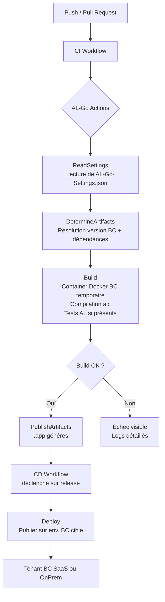
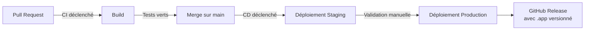

# DevOps ERP et AL-Go

## Objectifs pédagogiques

À l'issue de ce module, tu seras capable de :

1. **Expliquer** pourquoi les pratiques DevOps classiques ne s'appliquent pas directement au développement AL et comment AL-Go comble cet écart
2. **Configurer** un dépôt GitHub avec AL-Go pour automatiser la compilation et les tests d'une extension Business Central
3. **Construire** un pipeline CI/CD complet : build → test → publication d'artefacts `.app`
4. **Gérer** les secrets, les environnements cibles et les versions d'application dans un contexte SaaS multi-tenant
5. **Diagnostiquer** les erreurs les plus fréquentes dans un pipeline AL-Go

---

## Mise en situation

Tu rejoins une équipe de quatre développeurs AL chez un intégrateur. La base de code, c'est une vingtaine d'extensions qui couvrent la logistique et la facturation d'un client industriel. Jusqu'ici, les livraisons se font à la main : quelqu'un compile en local avec VS Code, génère le `.app`, l'envoie par e-mail à l'administrateur BC, qui le publie manuellement sur le tenant de production.

Résultat prévisible : personne ne sait exactement quelle version tourne en prod, les hotfixes partent sans test, et un jour une extension est publiée sur le mauvais environnement. Le client remarque l'anomalie lors de sa clôture mensuelle.

Le problème n'est pas le code — c'est l'absence d'automatisation autour du code. C'est exactement le problème qu'AL-Go résout.

---

## Pourquoi le DevOps ERP est un cas à part

Dans un projet web classique, tu branches ton dépôt Git sur GitHub Actions, tu écris quelques étapes `npm install` / `docker build` / `kubectl apply`, et tu as un pipeline fonctionnel en quelques heures. Avec Business Central, c'est différent, et comprendre pourquoi t'évitera de perdre du temps à essayer de "juste adapter" ce que tu connais déjà.

### Les contraintes propres à BC

**La compilation AL nécessite BC lui-même.** Contrairement à TypeScript ou Go, tu ne peux pas compiler une extension AL avec un simple compilateur en ligne de commande indépendant. Le compilateur `alc` (AL Compiler) a besoin de symboles — les métadonnées de l'ensemble des objets BC (tables, codeunits, pages…). Ces symboles varient d'une version BC à l'autre, d'un pays à l'autre, et selon les applications dépendantes installées.

**Les tests AL s'exécutent dans un container BC.** Les tests unitaires AL ne sont pas des tests autonomes. Ils s'exécutent à l'intérieur d'une instance BC, via des codeunits de test qui appellent des fonctions BC réelles. Pour automatiser ça, il faut une instance BC disponible dans le pipeline.

**Les artefacts sont des fichiers `.app` signés.** En SaaS, Microsoft impose que les extensions publiées sur AppSource soient signées. En tenant client, la signature est optionnelle mais fortement recommandée pour toute livraison sérieuse.

**Les dépendances entre extensions sont complexes.** Une extension peut dépendre d'une autre extension interne, qui elle-même dépend d'une extension tierce (ex : une lib ISV). La résolution de ces dépendances au moment du build est un sujet en soi — et l'ordre de compilation en découle directement, pas de l'ordre alphabétique des dossiers.

🧠 **Concept clé** — `BcContainerHelper` est la brique de base sur laquelle tout repose. C'est un module PowerShell open source maintenu par Microsoft qui abstrait la gestion des containers Docker BC pour les opérations de CI/CD : téléchargement d'artefacts BC, création de container, compilation, publication, tests. AL-Go l'utilise en interne.

---

## AL-Go : ce que c'est vraiment

AL-Go for GitHub est un framework DevOps open source, maintenu par Microsoft, qui transforme un dépôt GitHub en pipeline CI/CD complet pour Business Central. Il ne s'installe pas — il se déploie directement dans ton dépôt sous forme de workflows GitHub Actions.

La distinction importante : AL-Go n'est pas un outil externe que tu invoques. C'est un ensemble de fichiers YAML et de scripts PowerShell que tu copies dans ton dépôt via un template. Une fois en place, chaque push déclenche automatiquement compilation, tests, et génération d'artefacts.

```
ton-depot/
├── .github/
│   ├── workflows/
│   │   ├── CI.yaml           ← déclenché à chaque push/PR
│   │   ├── CD.yaml           ← déclenché sur release ou manuellement
│   │   └── ...
│   └── AL-Go-Settings.json   ← configuration centrale du projet
├── App1/                     ← extension AL 1
│   ├── app.json
│   └── src/
└── App2/                     ← extension AL 2 (peut dépendre de App1)
    ├── app.json
    └── src/
```

Le fichier `AL-Go-Settings.json` est le centre de gravité du système. Il définit la version BC cible, les pays, les artefacts de dépendance, les options de signature, et bien d'autres paramètres. On y revient en détail dans la section suivante.

---

## Architecture d'un pipeline AL-Go



Ce qui se passe concrètement à l'étape **Build** : AL-Go télécharge les artefacts BC correspondant à la version cible (les binaires BC sont stockés sur `bcartifacts.azureedge.net` par Microsoft), crée un container Docker éphémère, compile les extensions AL dans le bon ordre de dépendance, exécute les tests si une extension de test existe, puis extrait les `.app` compilés. Le container est détruit après usage.

| Composant | Rôle | Note |
|---|---|---|
| `AL-Go-Settings.json` | Configuration centrale | Version BC, pays, artefacts, options |
| Workflows GitHub Actions | Orchestration CI/CD | Générés par AL-Go, modifiables |
| BcContainerHelper | Moteur bas niveau | Invoqué par les scripts AL-Go |
| Docker (runner) | Environnement d'exécution BC | Obligatoire sur self-hosted runner |
| GitHub Secrets | Credentials sécurisés | Clés de signature, accès tenant |
| `.app` artifacts | Résultat du build | Publiés dans GitHub Releases |

⚠️ **Erreur fréquente** — Les runners GitHub-hosted (ceux fournis gratuitement par GitHub) ne supportent pas Docker Windows, nécessaire pour les containers BC. Pour un pipeline AL-Go fonctionnel, il faut soit un **self-hosted runner** Windows avec Docker installé, soit utiliser la fonctionnalité "cloud runner" d'AL-Go qui délègue à une VM Azure éphémère.

---

## Mise en place : de zéro à un premier build

### Étape 1 — Créer le dépôt depuis le template AL-Go

AL-Go fournit deux templates GitHub :

- **AL-Go-PTE** : pour les extensions Per-Tenant (usage client interne, sans AppSource)
- **AL-Go-AppSource** : pour les applications publiées sur AppSource (ISV)

Depuis GitHub, crée un nouveau dépôt en utilisant l'un de ces templates :

```
https://github.com/microsoft/AL-Go-PTE
https://github.com/microsoft/AL-Go-AppSource
```

Bouton "Use this template" → "Create a new repository". Tu obtiens un dépôt avec la structure AL-Go préconfigurée et un dossier `HelloWorld` d'exemple.

### Étape 2 — Configurer `AL-Go-Settings.json`

Le fichier se trouve à la racine dans `.github/AL-Go-Settings.json`. Voici la structure complète pour un projet PTE mono-extension, avec chaque champ annoté :

```json
{
  "type": "PTE",
  "country": "fr",
  "artifact": "https://bcartifacts.azureedge.net/sandbox/23.5.14782.15066/fr",
  "appFolders": ["App1"],
  "testFolders": ["App1.Tests"],
  "enableCodeCop": true,
  "enableUICop": false,
  "doNotRunTests": false,
  "versioningStrategy": 0,
  "runs-on": "self-hosted"
}
```

Les champs essentiels :

- **`type`** — `"PTE"` pour Per-Tenant Extension, `"AppSource"` pour une app AppSource. Ce champ conditionne plusieurs comportements (signature obligatoire, analyzers activés, etc.).
- **`country`** — Le code pays de la version BC (ex : `"fr"`, `"w1"` pour la version internationale). Impact sur les objets de base disponibles et les fonctionnalités locales.
- **`artifact`** — URL complète ou tag de version BC. Peut être `"latest"`, `"23.5"`, ou une URL complète pointant vers un artefact précis sur `bcartifacts.azureedge.net`. En production, pointer vers une version fixe évite les surprises lors des mises à jour BC.
- **`appFolders`** — Les dossiers contenant les extensions à compiler. L'ordre n'est pas important : AL-Go détecte automatiquement l'ordre de compilation via les dépendances déclarées dans les `app.json`.
- **`testFolders`** — Les dossiers d'extensions de test. Si vide ou absent, les tests ne s'exécutent pas.
- **`enableCodeCop`** — Active les règles CodeCop (bonnes pratiques AL). Recommandé à `true` dès le départ.
- **`enableUICop`** — Active les règles UICop (accessibilité, UX). Obligatoire pour AppSource.
- **`doNotRunTests`** — Forcer à `false` pour que les tests s'exécutent. Mettre à `true` uniquement pour débloquer temporairement un build.
- **`versioningStrategy`** — `0` = AL-Go incrémente le `Build` number automatiquement. `1` = basé sur le numéro de run GitHub Actions.
- **`runs-on`** — Type de runner : `"self-hosted"` pour un runner local, `"windows-latest"` pour le cloud runner Azure.

Pour un projet **multi-extensions** avec deux apps distinctes, la configuration s'étend naturellement :

```json
{
  "type": "PTE",
  "country": "fr",
  "artifact": "https://bcartifacts.azureedge.net/sandbox/23.5.14782.15066/fr",
  "appFolders": ["App1", "App2"],
  "testFolders": ["App1.Tests", "App2.Tests"],
  "enableCodeCop": true,
  "enableUICop": false,
  "doNotRunTests": false,
  "versioningStrategy": 0,
  "runs-on": "self-hosted",
  "appDependencies": []
}
```

💡 **Astuce** — Tu peux avoir un `AL-Go-Settings.json` différent par extension (dans le dossier de l'extension elle-même). Les paramètres locaux surchargent les paramètres globaux. Utile quand deux extensions ciblent des versions BC différentes.

### Étape 3 — Configurer le runner

**Option A — Self-hosted runner** (recommandé pour les équipes avec infra existante) :

Depuis GitHub → Settings → Actions → Runners → New self-hosted runner. Suivre les instructions pour une machine Windows Server 2022. Ensuite, installer Docker Desktop ou Docker CE pour Windows, et le module PowerShell BcContainerHelper :

```powershell
Install-Module BcContainerHelper -Force
```

**Option B — Cloud runner Azure** (recommandé pour démarrer vite sans infra) :

Dans `AL-Go-Settings.json`, ajouter :

```json
{
  "runs-on": "windows-latest",
  "useArtifactCache": false
}
```

Et configurer le secret `AZURE_CREDENTIALS` dans les secrets GitHub du dépôt avec un Service Principal Azure. AL-Go provisionne alors une VM Windows éphémère dans ton tenant Azure pour chaque build.

Le Service Principal Azure doit être au format JSON suivant, encodé et stocké dans le secret `AZURE_CREDENTIALS` :

```json
{
  "clientId": "00000000-0000-0000-0000-000000000001",
  "clientSecret": "<CLIENT_SECRET>",
  "subscriptionId": "00000000-0000-0000-0000-000000000002",
  "tenantId": "00000000-0000-0000-0000-000000000003"
}
```

### Étape 4 — Déclencher le premier build

Un simple push sur la branche principale suffit. Le workflow `CI.yaml` se déclenche automatiquement. Dans GitHub → Actions, tu vois le pipeline s'exécuter et, au bout de quelques minutes (le temps de télécharger les artefacts BC au premier run), les `.app` compilés apparaissent dans la section "Artifacts" du run.

---

## Gestion des dépendances inter-extensions

C'est souvent le premier vrai obstacle. Imaginons cette situation : `App2` dépend de `App1`, et `App1` est une extension interne que tu développes dans le même dépôt. Le `app.json` de `App2` référence `App1` par son `id` et sa `version`.

AL-Go gère ça nativement dans le cas d'un **mono-dépôt** : il détecte les dépendances via les `app.json` et compile dans le bon ordre. La section `dependencies` dans le `app.json` doit être déclarée avec précision — c'est une source d'erreur fréquente.

```json
{
  "id": "00000000-0000-0000-0000-000000000010",
  "name": "App2",
  "publisher": "MonOrg",
  "version": "1.0.0.0",
  "dependencies": [
    {
      "id": "00000000-0000-0000-0000-000000000009",
      "name": "App1",
      "publisher": "MonOrg",
      "version": "1.0.0.0"
    }
  ]
}
```

Les quatre champs `id`, `name`, `publisher` et `version` doivent correspondre **exactement** (au caractère près) à ce qui est déclaré dans le `app.json` de `App1`. Une différence de casse sur `publisher`, un `id` mal copié, ou une version qui ne correspond pas — et AL-Go ne peut pas résoudre la dépendance, même si l'extension est dans le même dépôt.

Pour les **dépendances externes** (une lib ISV, une autre extension interne dans un dépôt séparé), tu dois fournir les `.app` de ces dépendances via `appDependencies` dans `AL-Go-Settings.json` :

```json
{
  "appDependencies": [
    "https://github.com/mon-org/ma-lib/releases/download/v2.3.1/ma-lib.app"
  ]
}
```

AL-Go télécharge le `.app` au moment du build et l'installe dans le container avant de compiler.

---

## Livraison continue vers Business Central

Le CI c'est bien, le CD c'est mieux. AL-Go fournit un workflow `CD.yaml` qui peut publier directement sur un tenant BC (SaaS ou OnPrem) après un build réussi.

### Configurer un environnement de déploiement

Dans GitHub → Settings → Environments, crée un environnement (ex : `STAGING`, `PRODUCTION`). Chaque environnement peut avoir ses propres secrets et des règles de protection (approbation manuelle obligatoire pour la prod, par exemple).

Pour chaque environnement BC cible, tu as besoin de deux secrets :

| Secret | Contenu |
|---|---|
| `<ENV>_AUTHCONTEXT` | Contexte d'authentification BC encodé en Base64 |
| `<ENV>_ENVIRONMENTNAME` | Nom de l'environnement BC (ex : `Production`, `Staging`) |

Le contexte d'authentification est un objet JSON encodé qui contient les infos pour se connecter à l'Admin API BC :

```json
{
  "TenantId": "<TENANT_ID>",
  "ClientId": "<APP_ID>",
  "ClientSecret": "<SECRET>",
  "CompanyId": "",
  "EnvironmentType": "Sandbox"
}
```

Ce JSON est converti en Base64 et stocké dans le secret GitHub :

```powershell
$authContext = '{"TenantId":"<TENANT_ID>","ClientId":"<APP_ID>","ClientSecret":"<SECRET>","EnvironmentType":"Sandbox"}'
[Convert]::ToBase64String([System.Text.Encoding]::UTF8.GetBytes($authContext))
```

Le `ClientId` correspond à une App Registration Azure AD avec les permissions nécessaires sur l'API Business Central (permission `Dynamics 365 Business Central → App.ReadWrite.All`).

🧠 **Concept clé** — AL-Go utilise l'**API d'administration Business Central** (pas l'API OData métier) pour publier les extensions. Cette API est distincte de l'API utilisée pour manipuler les données. Elle permet de gérer les extensions, les compagnies, les sessions — c'est l'API qu'utilise aussi le portail d'administration BC.

### Déclenchement du CD

Par défaut, le workflow CD se déclenche après un push sur la branche principale **si le CI est vert**. Tu peux aussi le déclencher manuellement ou sur création d'une Release GitHub.

```yaml
# Extrait de CD.yaml — déclenchement sur push main après CI
on:
  workflow_run:
    workflows: ["CI/CD"]
    types: [completed]
    branches: [main]
```

⚠️ **Erreur fréquente** — Publier directement en production sans environnement intermédiaire. Les extensions BC, une fois publiées en prod, ne se désinstallent pas sans désinstaller aussi toutes les données qu'elles ont créées. Un déploiement raté en production est difficile à annuler. Toujours passer par un environnement Sandbox d'abord, avec des règles de protection GitHub sur l'environnement Production.

---

## Gestion des versions

AL-Go s'appuie sur les numéros de version définis dans le `app.json` de chaque extension :

```json
{
  "version": "1.2.0.0"
}
```

Le format est `Major.Minor.Build.Revision`. AL-Go incrémente automatiquement le champ `Build` (ou `Revision` selon la stratégie) à chaque run CI. Les `Major` et `Minor` sont sous contrôle manuel du développeur.

Pour incrémenter `Major` ou `Minor`, AL-Go fournit un workflow dédié **"Increment version number"** disponible dans l'onglet Actions de ton dépôt. Tu choisis le champ à incrémenter, le workflow crée un commit qui met à jour tous les `app.json` concernés.

💡 **Astuce** — Les branches dans AL-Go ne sont pas qu'organisationnelles. Une branche `release/23.0` peut pointer vers une version BC 23.0, tandis que `main` cible BC 24.0. C'est une pratique courante pour les ISV qui doivent maintenir la compatibilité sur plusieurs versions BC simultanément. AL-Go supporte ce modèle nativement via des settings par branche.

---

## Construction progressive : du pipeline de base au pipeline production

### V1 — Build automatique sur push

C'est ce qu'on a configuré jusqu'ici. Chaque push compile et génère des `.app`. Pas de déploiement automatique.

**Ce que ça résout :** tu détectes les erreurs de compilation immédiatement, pas le lendemain matin quand quelqu'un essaie de livrer. Tout le monde voit si la branche est verte ou non.

### V2 — Tests automatiques

AL-Go exécute les codeunits de test AL si `testFolders` est renseigné dans les settings. Les résultats apparaissent directement dans le run GitHub Actions avec le détail des tests passés/échoués.

Pour que les tests s'exécutent, il faut une extension de test dans `testFolders` contenant des codeunits avec des méthodes marquées `[Test]`. La structure minimale d'une codeunit de test AL :

```al
codeunit 50100 "App1 Test - Mon Calcul"
{
    Subtype = Test;

    [Test]
    procedure TestMonCalcul()
    var
        LibraryAssert: Codeunit "Library Assert";
        MaCodeunit: Codeunit "Ma Codeunit Métier";
        Resultat: Decimal;
    begin
        // Arrange + Act
        Resultat := MaCodeunit.CalculerTotal(10, 5);

        // Assert
        LibraryAssert.AreEqual(15, Resultat, 'Le total doit être 15');
    end;
}
```

Et dans les settings :

```json
{
  "testFolders": ["App1.Tests"],
  "doNotRunTests": false
}
```

**Ce que ça résout :** les régressions fonctionnelles ne passent plus en prod silencieusement.

### V3 — Pipeline production complet



À ce stade, le pipeline fait :
- Compilation et tests sur chaque PR (pas seulement sur main)
- Déploiement automatique sur Staging après merge
- Déploiement Production avec approbation manuelle obligatoire (protection d'environnement GitHub)
- Création automatique d'une GitHub Release avec les `.app` en artefacts

**Ce que ça résout :** le problème initial — plus personne ne livre à la main, chaque version est traçable, les erreurs humaines disparaissent.

---

## Diagnostic — Erreurs fréquentes dans AL-Go

### Le build échoue avec "Cannot download artifacts"

**Symptôme :** l'étape `DetermineArtifacts` échoue, le log mentionne une URL inaccessible.

**Cause :** la valeur de `artifact` dans `AL-Go-Settings.json` pointe vers une version BC qui n'existe plus ou une URL expirée. Microsoft retire périodiquement les vieilles versions d'artefacts.

**Correction :** trois variantes possibles selon le contexte :

| Valeur `artifact` | Usage recommandé | Risque |
|---|---|---|
| `"latest"` | Dev local, branches expérimentales | Casse quand BC se met à jour |
| `"23.5"` | CI stable, intégration | Sûr tant que la version existe |
| URL complète `bcartifacts.azureedge.net/...` | Prod, pipelines critiques | Aucun — version exacte verrouillée |

Vérifier la disponibilité d'une version sur `https://bcartifacts.azureedge.net/`. Pour trouver l'URL exacte d'une version :

```powershell
Get-BCArtifactUrl -type Sandbox -country fr -version "23.5" -select Latest
```

---

### Les tests ne s'exécutent pas

**Symptôme :** le build est vert mais aucun test n'apparaît dans les résultats.

**Cause probable 1 :** `testFolders` est vide ou absent dans `AL-Go-Settings.json`.
**Cause probable 2 :** `doNotRunTests: true` quelque part dans la config.
**Cause probable 3 :** l'extension de test n'a pas de méthodes marquées `[Test]` — AL-Go ne trouve rien à exécuter et ne signale pas d'erreur.

**Correction :** vérifier les settings, et s'assurer que chaque méthode de test porte l'attribut `[Test]` et que la codeunit a `Subtype = Test` déclaré.

---

### Le déploiement CD échoue avec "Unauthorized"

**Symptôme :** l'étape `Deploy` échoue avec une erreur 401 ou 403.

**Cause :** le secret `AUTHCONTEXT` est mal formé, expiré, ou l'App Registration Azure AD n'a pas les bonnes permissions.

**Correction :**

1. Décoder le secret pour vérifier son contenu avant de le confier à GitHub :

```powershell
$encoded = "<VALEUR_DU_SECRET_AUTHCONTEXT>"
$decoded = [System.Text.Encoding]::UTF8.GetString([Convert]::FromBase64String($encoded))
Write-Host $decoded
```

2. Tester la connexion à l'Admin API BC directement depuis PowerShell :

```powershell
$body = @{
    grant_type    = "client_credentials"
    client_id     = "<CLIENT_ID>"
    client_secret = "<CLIENT_SECRET>"
    scope         = "https://api.businesscentral.dynamics.com/.default"
}
$token = Invoke-RestMethod -Method Post -Uri "https://login.microsoftonline.com/<TENANT_ID>/oauth2/v2.0/token" -Body $body
Invoke-RestMethod -Method Get -Uri "https://api.businesscentral.dynamics.com/admin/v2.21/applications/businesscentral/environments" -Headers @{ Authorization = "Bearer $($token.access_token)" }
# HTTP 200 = connexion OK, HTTP 401/403 = permissions incorrectes
```

3. Si la connexion échoue : vérifier que l'App Registration a le consentement admin pour `Dynamics 365 Business Central → App.ReadWrite.All`, régénérer le `ClientSecret`, et reconstruire le `AUTHCONTEXT`.

---

### Ordre de compilation incorrect entre extensions

**Symptôme :** une extension échoue à compiler avec "Dependency X not found", alors que X est bien dans le dépôt.

**Cause :** les `id`, `name`, `publisher` ou `version` dans la section `dependencies` du `app.json` ne correspondent pas exactement à ce qui est déclaré dans le `app.json` de l'extension source.

**Correction :** comparer les deux `app.json` côte à côte. Les quatre champs doivent correspondre au caractère près — une majuscule en trop sur `publisher`, un `id` différent d'un seul caractère, ou une version `1.0.0.0` vs `1.0.0.1` suffit à bloquer la résolution.

---

## Bonnes pratiques

**Toujours pointer vers une version BC fixe en CI de production.** `"artifact": "latest"` est pratique en développement, mais un jour BC sort une mise à jour qui casse ta compilation — et tu découvres le problème au pire moment. En production, versionner explicitement (ex : `"23.5"`) et planifier la montée de version BC séparément.

**Séparer les credentials par environnement.** Ne pas réutiliser le même `AUTHCONTEXT` pour Staging et Production. Utiliser des App Registrations distinctes avec des permissions limitées à chaque environnement. Un secret compromis ne doit pas donner accès à la production.

**Activer CodeCop dès le départ.** `"enableCodeCop": true` dans les settings. Les règles CodeCop appliquent les bonnes pratiques AL (nommage, performance, patterns à éviter). C'est beaucoup plus douloureux à activer sur un projet existant que de le mettre en place dès le début.

**Protéger la branche `main`.** Dans GitHub → Settings → Branches, imposer que chaque merge sur `main` passe par une PR avec CI vert obligatoire. Sans ça, quelqu'un peut pusher directement et bypasser tous les contrôles.

**Conserver les artefacts dans les GitHub Releases.** Chaque release taguée = un `.app` versionné archivé. En cas de besoin de rollback, tu as la version N-1 disponible immédiatement sans avoir à reconstruire.

**Ne pas stocker de credentials dans les fichiers AL-Go.** Les fichiers `AL-Go-Settings.json` sont commités dans le dépôt. Tout ce qui est secret (mots de passe, client secrets, clés de signature) doit aller dans les GitHub Secrets, jamais dans les fichiers de configuration.

**Tester le pipeline sur une branche de feature avant de modifier `main`.** AL-Go peut être configuré pour déclencher le CI sur toutes les branches. Profites-en pour valider les changements de configuration sur une branche dédiée.

---

## Cas réel en entreprise

Un éditeur ISV français distribue une solution de gestion des notes de frais sur AppSource, compatible BC
