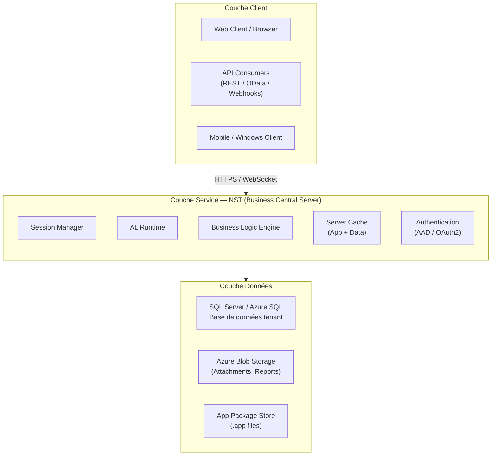
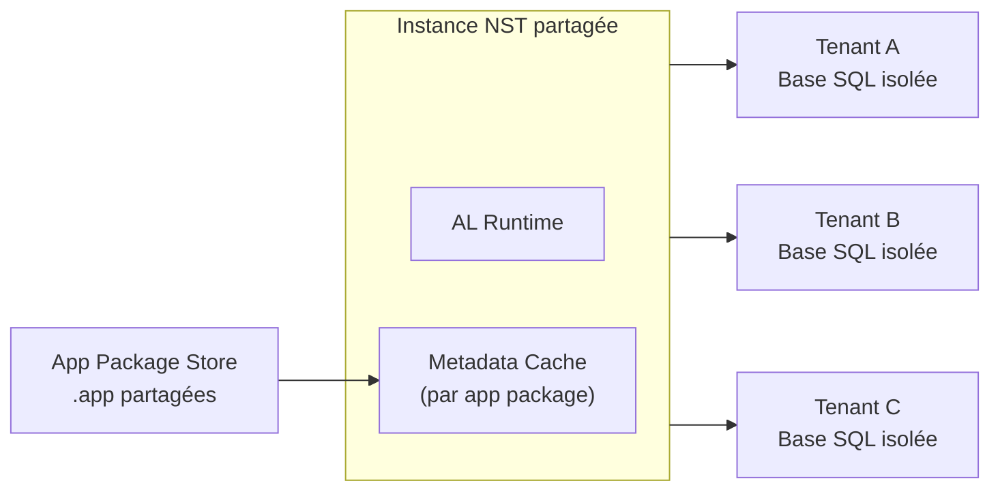
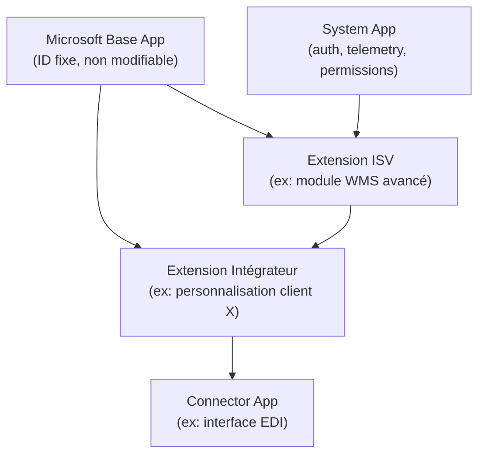
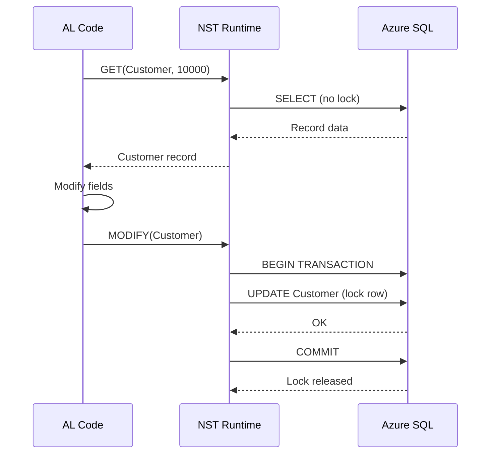
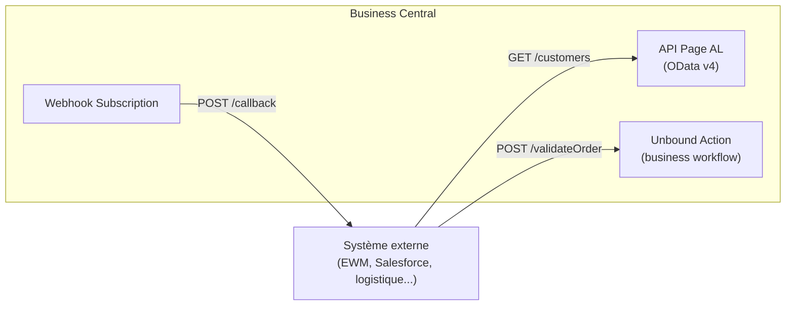
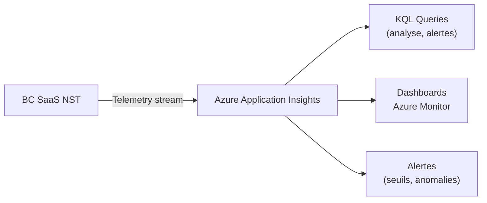

# Architecture ERP avancée Business Central

## Objectifs pédagogiques

- Comprendre la structure interne des couches applicatives Business Central et leurs responsabilités respectives
- Analyser le modèle d'extension AL et ses implications sur la séparation du code base vs customisation
- Raisonner sur les choix d'architecture multi-tenant en contexte SaaS Microsoft et leurs contraintes opérationnelles
- Identifier les goulots d'étranglement architecturaux et savoir où intervenir dans la stack
- Concevoir une topologie BC cohérente pour un déploiement ISV, intégrateur ou client OnPrem, en arbitrant entre complexité et besoin réel

---

## Mise en situation

Tu reprends la responsabilité technique d'un projet BC pour une ETI de distribution qui opère 4 sociétés dans 3 pays. L'équipe précédente a livré un ensemble d'extensions qui fonctionnent — à peu près — mais personne ne sait vraiment pourquoi certaines performances se dégradent à 17h, pourquoi un upgrade mineur a cassé deux intégrations, ou pourquoi le support de Microsoft répond systématiquement "c'est votre code, pas le nôtre".

Le problème n'est pas le code AL. Le problème, c'est que personne n'a jamais modélisé l'architecture dans sa globalité : où tourne quoi, qui appelle qui, quelles sont les frontières entre les couches. Du coup, chaque développeur a fait des choix locaux raisonnables qui, agrégés, forment un système fragilisé.

Ce module existe pour ça : te donner les moyens de lire une architecture BC comme un système — et de prendre les bonnes décisions selon le contexte dans lequel tu opères.

---

## Contexte et problématique

Business Central n'est pas une application monolithique habillée en SaaS. C'est une plateforme multi-couches, avec un modèle de séparation claire entre ce que Microsoft fournit et maintient, et ce que toi — développeur, intégrateur, ISV — tu construis par-dessus.

Cette séparation est fondamentale. En NAV classique, tout était dans la même base de code : les objets Microsoft et tes customisations cohabitaient dans le même espace, le même objet pouvait être modifié par n'importe qui, et chaque upgrade était une opération chirurgicale à haut risque. BC a rompu avec cette logique. L'architecture actuelle repose sur un principe d'**isolation par extension** : tu ne touches jamais le code de base, tu te branches dessus.

Mais cette isolation ne se limite pas au modèle objet AL. Elle traverse toutes les couches de la stack — la couche service, la couche données, le modèle de déploiement SaaS — et chacune de ces couches a ses propres règles du jeu. Ne pas les connaître, c'est naviguer à l'aveugle.

---

## La stack technique BC : trois couches à distinguer

Avant d'entrer dans les détails, voici comment la stack s'organise. Trois couches bien distinctes, chacune avec ses propres responsabilités et ses propres points de défaillance possibles.



**Le client** n'embarque aucune logique métier. C'est un rendu. Toute la logique tourne côté serveur, dans le NST. C'est une rupture importante avec les anciens clients "épais" NAV qui portaient une partie de la logique.

**Le NST (NAS Service Tier)** est le cœur de la machine. C'est là que le runtime AL exécute ton code, que les sessions sont gérées, que les transactions SQL sont orchestrées. En SaaS, tu n'y accèdes pas directement — Microsoft le gère pour toi. En OnPrem, c'est ton serveur applicatif.

**La couche données** est plus riche qu'un simple SQL Server. En SaaS, elle inclut Azure SQL en mode élastique, du Blob Storage pour les documents et les exports, et un registre de packages d'applications.

---

## Architecture multi-tenant : ce que ça change vraiment

Le multi-tenant en BC ne veut pas dire "plusieurs clients sur le même serveur" dans le sens trivial. C'est une architecture où une même instance applicative — le même NST, les mêmes packages d'applications — sert plusieurs tenants qui ont chacun leur propre base de données.



Ce qui est partagé : le runtime, les metadata, les packages applicatifs (.app). Ce qui est isolé : les données, les configurations tenant-level, les licences.

La conséquence directe pour toi, développeur : **une seule version d'une extension tourne pour tous les tenants d'un environnement**. Tu ne peux pas déployer une version 2.1 pour le tenant A et maintenir la version 2.0 pour le tenant B. Si tu déploies une extension v2.1, les tenants A, B et C passent tous en v2.1 simultanément — c'est pourquoi tu dois tester ta migration de données sur une copie représentative avant tout déploiement produit. C'est d'ailleurs l'une des raisons pour lesquelles la gestion des dépendances et la compatibilité descendante ne sont pas juste des bonnes pratiques — elles sont structurellement nécessaires.

🧠 **Concept clé** — En SaaS, Microsoft gère le NST et le SQL. Tu n'as de prise que sur ce qui est dans ton extension : le code AL, les données que tu écris, les APIs que tu exposes. Tout le reste est une boîte noire contrôlée par la plateforme.

---

## Le modèle d'extension : pourquoi c'est une décision d'architecture

On a tendance à parler d'extension comme d'une notion de développement. C'est avant tout une décision d'architecture.

Quand tu écris une extension AL, tu définis un **périmètre de responsabilité**. Ton `.app` a un ID, un éditeur, une version. Elle déclare ses dépendances. Elle s'installe dans un tenant, peut être upgradée indépendamment, peut être retirée sans toucher au reste du système.



Cette hiérarchie a des implications concrètes :

**Les dépendances sont déclarées, pas implicites.** Si ton extension Connector App appelle des fonctions de l'extension ISV, tu le déclares dans `app.json`. Si l'ISV change son interface publique, tu as un signal d'alerte à la compilation — pas une surprise en production.

**Les extensions s'empilent, pas ne se mélangent.** Une extension intégrateur peut étendre une extension ISV qui elle-même étend la Base App. Chaque couche reste identifiable, versionnée, potentiellement remplaçable.

Voici à quoi ressemble une déclaration de dépendances réaliste dans `app.json` pour une architecture en trois couches (core lib → module métier → adaptation client) :

```json
{
  "id": "a1b2c3d4-0001-0001-0001-000000000001",
  "name": "MyISV.Logistics",
  "publisher": "MyISV",
  "version": "2.1.0.0",
  "dependencies": [
    {
      "id": "a1b2c3d4-0000-0000-0000-000000000000",
      "name": "MyISV.CoreLib",
      "publisher": "MyISV",
      "version": "1.5.0.0"
    },
    {
      "id": "63ca2fa4-4f03-4f2b-a480-172fef340d3f",
      "name": "Application",
      "publisher": "Microsoft",
      "version": "24.0.0.0"
    }
  ],
  "application": "24.0.0.0",
  "runtime": "12.0",
  "platform": "24.0.0.0"
}
```

Dans cette structure, `MyISV.CoreLib` contient les fondations partagées (helpers, types communs, permission sets de base). `MyISV.Logistics` est le module métier. Si un client a besoin d'une adaptation spécifique, elle vient dans une troisième extension qui dépend de `MyISV.Logistics` — sans modifier ni copier le code des couches inférieures.

⚠️ **Erreur fréquente** — Créer une seule grosse extension "fourre-tout" pour tout le projet client. C'est tentant parce que ça simplifie les dépendances à court terme. Mais c'est une bombe à retardement : tu ne peux pas déployer partiellement, tu ne peux pas tester un module sans l'ensemble, et le jour où un autre projet client a besoin de 80% du même code, tu te retrouves à copier-coller. La découpe en extensions thématiques est une décision d'architecture, pas du perfectionnisme.

---

## Fonctionnement interne du NST : sessions, transactions, locks

Le NST n'est pas un simple proxy entre le client et SQL. Comprendre comment il gère les sessions explique beaucoup de comportements qui semblent mystérieux en production.

**Chaque session est un thread NST.** Un utilisateur qui ouvre BC, une job queue qui tourne, une API call — chaque interaction crée une session. Le NST maintient un pool de connexions SQL sous-jacentes. En SaaS, Microsoft dimensionne ce pool ; en OnPrem, c'est toi.

**Le modèle transactionnel AL est optimiste par défaut.** Quand tu lis un enregistrement, tu ne poses pas de lock immédiatement. Le lock arrive au moment du `MODIFY`, `INSERT` ou `DELETE`, et il est levé à la fin de la transaction (commit ou rollback). C'est ce qu'on appelle une transaction de type "read-committed" dans SQL Server.



Là où ça devient critique : les **job queues longues** et les **intégrations en batch** qui font des milliers de modifications dans une seule transaction. SQL accumule les locks, d'autres sessions attendent, et tu te retrouves avec les fameuses dégradations de performance à heure fixe — souvent l'heure où le batch de synchronisation tourne.

Le pattern correct en AL pour un traitement en volume — avec `COMMIT` intermédiaire et gestion d'erreur ligne par ligne — ressemble à ceci :

```al
procedure ProcessLargeVolume(var TempBuffer: Record "My Staging Buffer" temporary)
var
    Counter: Integer;
    CommitThreshold: Integer;
begin
    CommitThreshold := 100; // libérer les locks tous les 100 enregistrements
    Counter := 0;

    if TempBuffer.FindSet() then
        repeat
            if not TryProcessSingleRecord(TempBuffer) then begin
                TempBuffer.Status := TempBuffer.Status::Error;
                TempBuffer."Error Message" := GetLastErrorText();
                TempBuffer.Modify();
            end else begin
                TempBuffer.Status := TempBuffer.Status::Processed;
                TempBuffer.Modify();
            end;

            Counter += 1;
            if Counter mod CommitThreshold = 0 then
                Commit(); // libération locks intermédiaire
        until TempBuffer.Next() = 0;

    Commit(); // commit final
end;
```

Ce pattern combine trois bonnes pratiques : isolation des erreurs par ligne (pas de rollback massif), libération régulière des locks SQL, et traçabilité du statut de traitement dans la table de staging.

💡 **Astuce** — Dans une job queue qui traite de gros volumes, les `COMMIT` intermédiaires sont parfois la seule solution pour éviter d'accumuler des locks qui bloquent les sessions utilisateurs concurrentes. C'est contre-intuitif pour quelqu'un venant d'un background SQL pur, mais c'est un pattern AL standard en production.

---

## Topologies de déploiement : SaaS, OnPrem, hybride

En dehors des principes généraux, la vraie question en architecture c'est : **pour ce projet précis, quelle topologie ?** Les trois grandes options ont des profils de contraintes très différents.

| Dimension | SaaS (Cloud BC) | OnPrem | Hybride (SaaS + connecteur) |
|---|---|---|---|
| Contrôle infra | Nul — tout Microsoft | Total | Partiel |
| Mises à jour BC | Automatiques (waves) | Manuelles | SaaS suit les waves |
| Extensions déployées via | Admin Center / CI/CD | PowerShell + Admin Center local | Admin Center côté SaaS |
| Accès SQL direct | Interdit | Possible | Interdit côté SaaS |
| Données dans le périmètre | Azure uniquement | Datacenter propre | Mixte |
| Cas d'usage typique | Nouveau projet greenfield | Héritage NAV lourd, réglementaire | Migration progressive, données sensibles on-site |

Le cas hybride mérite une attention particulière. Il est souvent choisi comme position temporaire ("on migre progressivement vers le SaaS") mais peut devenir permanent quand des contraintes réglementaires imposent que certaines données restent sur site. Dans ce cas, l'architecture doit prévoir explicitement comment la synchronisation se fait, quels flux transitent par où, et où réside la "source de vérité" pour chaque entité.

🧠 **Concept clé** — En SaaS, l'accès SQL direct est interdit par design. Toute interaction avec les données passe par AL (tables, pages, API). C'est une contrainte forte, mais elle garantit aussi que toute la logique métier reste contrôlable et auditable par la plateforme.

---

## Matrice de décision : par contexte de déploiement

Les bonnes pratiques d'architecture ne s'appliquent pas uniformément. Ce qui est indispensable pour un ISV AppSource est sur-ingénierie pour un projet intégrateur client unique. Ce tableau t'aide à calibrer tes choix.

| Décision architecturale | ISV AppSource | Intégrateur client unique | Intégrateur multi-clients | Client OnPrem legacy |
|---|---|---|---|---|
| **Découpe en extensions thématiques** | Obligatoire — modules vendus séparément | Recommandé si >3 domaines fonctionnels | Obligatoire — core lib réutilisable | Optionnel — un monolithe bien structuré suffit souvent |
| **Compatibilité descendante stricte** | Obligatoire — tu ne contrôles pas les mises à jour client | Négociable avec le client | Recommandé — évite les hotfixes en cascade | Pas critique — upgrades maîtrisés |
| **Permission Sets en AL** | Obligatoire AppSource | Recommandé | Obligatoire | Recommandé |
| **Entitlements déclarés** | Obligatoire AppSource | Non nécessaire | Optionnel | Non applicable |
| **Application Insights connecté** | Obligatoire production | Fortement recommandé | Obligatoire | Optionnel selon maturité client |
| **Tests automatisés AL** | Obligatoire pour certification | Bon investissement sur les modules critiques | Obligatoire sur les librairies partagées | Rare en pratique, mais souhaitable |
| **CI/CD pipeline** | Obligatoire | Recommandé | Obligatoire | Optionnel |
| **Interfaces publiques marquées `[Scope]`** | Obligatoire | Utile si >1 développeur | Obligatoire | Optionnel |

La lecture de ce tableau donne une règle simple : **la rigueur architecturale doit être proportionnelle à la surface d'impact**. Un ISV qui touche 500 tenants ne peut pas se permettre une interface publique mal définie. Un intégrateur qui livre un projet client unique peut raisonnablement prioriser la vitesse sur la généricité — à condition de documenter les compromis.

---

## Les APIs comme surface d'architecture

Dans un projet BC réel, les APIs ne sont pas un module complémentaire. Elles sont une dimension architecturale à part entière, parce que BC est rarement seul dans un SI.

BC expose trois types de surfaces API :

**OData v4 (API pages)** — Les pages déclarées comme `APIVersion`, `APIPublisher`, `APIGroup` dans AL deviennent des endpoints REST. Ces endpoints respectent les filtres OData (`$filter`, `$expand`, `$select`), ce qui est puissant mais peut générer des requêtes SQL très coûteuses si mal utilisé.

**Webhooks** — BC peut notifier des systèmes externes quand un enregistrement est créé, modifié ou supprimé. C'est le bon mécanisme pour de l'intégration event-driven, sans polling.

**Bound / Unbound Actions** — Des actions métier exposées directement en REST. Une "Unbound Action" est une fonction AL que tu exposes comme endpoint, indépendante d'un enregistrement. C'est utile pour des workflows complexes ("valider cette commande avec ces paramètres") qui ne se mappent pas naturellement sur un CRUD.



⚠️ **Erreur fréquente** — Utiliser des OData API pages avec des `$expand` profonds (expand sur un expand) pour récupérer des données hiérarchiques en une seule requête. En apparence c'est élégant. En pratique, BC génère des jointures SQL qui peuvent prendre plusieurs secondes sur des volumes réels. Quand les temps de réponse API commencent à dériver, c'est souvent là qu'il faut regarder en premier.

---

## Gestion des permissions et des licences : la couche invisible

Beaucoup de développeurs AL écrivent leur code, testent avec un utilisateur super-admin, et découvrent en formation ou en recette que la moitié des fonctionnalités ne fonctionnent pas pour un utilisateur normal. C'est parce que le modèle de permissions BC est une couche architecturale à part entière, pas un détail de configuration.

**Permission Sets** — Chaque objet AL doit être accessible via un Permission Set défini dans le code. Si tu ne le fais pas, seul un super-admin peut tester.

**Entitlement** — En SaaS, les licences Microsoft déterminent ce à quoi un utilisateur peut accéder. Un utilisateur avec une licence "Team Member" ne peut pas accéder aux mêmes pages qu'un utilisateur "Essentials" ou "Premium". Si ton extension expose des fonctionnalités qui requièrent une licence Premium, les utilisateurs Team Member verront des erreurs d'accès même si les Permission Sets sont corrects.

La séparation est claire : le Permission Set dit **quoi** un utilisateur peut faire sur les objets. L'Entitlement dit **si** l'utilisateur a le droit d'utiliser cette fonctionnalité selon sa licence. Les deux conditions doivent être réunies.

En AL, la vérification d'un Entitlement lors d'un accès à une fonctionnalité protégée s'appuie sur l'objet `Entitlement` déclaré dans ton extension. Le runtime BC évalue automatiquement l'entitlement au moment de l'accès à la page ou à la codeunit concernée — tu n'as pas à coder cette vérification toi-même, mais tu dois avoir déclaré l'entitlement correctement.

---

## Telemetry et observabilité : voir à l'intérieur de la boîte noire

En SaaS, tu n'as pas accès aux logs du serveur. Mais Microsoft expose une quantité importante de télémétrie via **Azure Application Insights**. C'est le seul vrai outil d'observabilité disponible pour un développeur ou consultant technique BC SaaS.

En configurant une clé Application Insights dans l'environnement BC (via Admin Center), tu commences à recevoir :

- Les traces de sessions et durées de requêtes SQL
- Les appels d'APIs entrants et sortants
- Les erreurs AL et les exceptions
- Les événements de job queue (démarrage, échec, durée)
- Les événements de login et d'authentification



Deux requêtes KQL immédiatement opérationnelles pour un premier diagnostic en production :

**Top 10 pages les plus lentes (durée médiane de chargement) :**
```kql
traces
| where customDimensions.eventId == "RT0005"
| extend pageName = tostring(customDimensions.alObjectName)
| extend durationMs = todouble(customDimensions.serverExecutionTime)
| summarize p50=percentile(durationMs, 50), p95=percentile(durationMs, 95), count=count()
  by pageName
| order by p95 desc
| take 10
```

**Erreurs AL des dernières 24h, regroupées par message :**
```kql
traces
| where customDimensions.eventId == "RT0030"
| where timestamp > ago(24h)
| extend errorMsg = tostring(customDimensions.alErrorMessage)
| summarize count() by errorMsg
| order by count_ desc
```

💡 **Astuce** — Le repo open source [BCTech de Microsoft](https://github.com/microsoft/BCTech) contient des dizaines de requêtes KQL prêtes à l'emploi pour analyser la télémétrie BC. Ces deux requêtes ci-dessus sont suffisantes pour un premier triage — mais BCTech te donnera des requêtes dédiées pour les job queues, les APIs, les upgrades et les locks SQL.

---

## Construction progressive d'une architecture BC

Voici comment une architecture BC évolue typiquement d'un projet simple vers un déploiement multi-entités production.

**V1 — Projet client unique, SaaS standard**

Une extension principale, un environnement sandbox + production, connexion Admin Center pour le déploiement. C'est suffisant pour 80% des projets intégrateurs.

**V2 — Multi-sociétés avec intégrations**

Plusieurs extensions thématiques (finance, logistique, EDI), une App de configuration pour isoler les paramètres client, des API pages documentées, Application Insights connecté. Les Permission Sets sont définis dans le code AL, pas dans l'interface.

**V3 — Multi-tenant ISV ou déploiement complexe**

Une architecture de dépendances explicite entre extensions (core lib, modules métier, layer d'adaptation client), gestion des AppSource si publication publique, tests automatisés sur les API, stratégie de dépréciation explicite pour les interfaces publiques, pipelines CI/CD différenciés par couche d'extension.

⚠️ **Erreur fréquente** — Commencer directement en V3 sur un projet intégrateur classique. La complexité architecturale doit être proportionnelle à la complexité réelle du projet. Une extension bien découpée en modules AL internes vaut mieux qu'une orchestration multi-extensions prématurée.

---

## Cas réels en entreprise

Trois situations contrastées, trois problèmes architecturaux distincts. Chacune illustre une classe d'erreur fréquente selon le contexte.

---

### Cas 1 — ISV : extension cassée lors d'un upgrade SaaS automatique

**Contexte** : un éditeur ISV distribue un module RH via AppSource à 80 tenants. Lors d'une wave SaaS Microsoft (mise à jour automatique tous les 6 mois), 12 tenants signalent que leur module ne fonctionne plus.

**Diagnostic** : l'ISV avait utilisé une interface interne non documentée de la Base App — une table `Employee` avec un champ qui existait en BC23 mais a été renommé en BC24. Comme ce champ n'était pas marqué `ObsoleteState: Pending` côté ISV, aucune alerte de compilation n'a été émise. Les 12 tenants qui avaient déjà migré en wave 2 de BC24 sont tombés.

**Ce qui aurait dû être fait** : surveiller le changelog de la Base App à chaque release, activer les analyzers `AppSourceCop` qui détectent les usages d'objets dépréciés, et avoir un pipeline CI/CD qui teste la compilation contre la version BC cible avant chaque wave.

**Enseignement** : en ISV multi-tenant SaaS, tu ne contrôles pas l'heure de la mise à jour. La compatibilité descendante n'est pas optionnelle — c'est une propriété de survie de ton produit.

---

### Cas 2 — Intégrateur : migration hybride progressive d'un legacy NAV

**Contexte** : un intégrateur accompagne un industriel qui tourne sur NAV 2016 avec une customisation de 400 objets C/AL. Le projet consiste à migrer vers BC SaaS sur 18 mois, sans arrêt de production.

**Dilemme architectural** : faut-il migrer tout d'un coup (big bang) ou mettre en place une coexistence NAV + BC le temps de la transition ?

**Choix retenu** : topologie hybride progressive. Les modules Finance et Achats basculent en BC SaaS en phase 1. Le module Production (hautement customisé, encore en NAV) est exposé via des APIs custom vers BC pendant 6 mois, le temps d'être réécrit en AL. Un connecteur de synchronisation (Azure Function + staging tables BC) assure la cohérence des données entre les deux systèmes pendant la coexistence.

**Point de friction** : la "source de vérité" pour le stock était dans NAV. Pendant 6 mois, les acheteurs travaillent dans BC mais voient des niveaux de stock qui viennent de NAV via API, avec un décalage de quelques minutes. Cette latence a dû être documentée et acceptée formellement par le client avant le démarrage.

**Enseignement** : une migration hybride est toujours un compromis explicite entre risque et continuité. Le problème architectural n'est pas technique — c'est de décider et documenter où réside la source de vérité pour chaque entité, et d'assumer les conséquences de la latence de synchronisation.

---

### Cas 3 — ISV : performance API sur volumes réels

**Contexte** : un éditeur développe un module de gestion de tournées livraison pour BC, vendu à une trentaine de clients PME. Les clients font remonter des lenteurs sur la page de planification quand leur volume de livraisons dépasse 500/jour.

**Analyse** : en activant Application Insights et en lançant les requêtes KQL sur les traces SQL, l'équipe découvre que la page de planification déclenche une API OData avec un `$expand` sur les adresses de livraison, lui-même imbriqué dans un `$expand` sur les contacts clients. Pour 500 livraisons, ça génère une jointure SQL sur 3 niveaux.

**Solution** : la page de planification n'utilise plus OData directement mais appelle un Unbound Action AL qui exécute une requête SQL optimisée avec `SetLoadFields` et retourne un payload JSON structuré. Temps de
