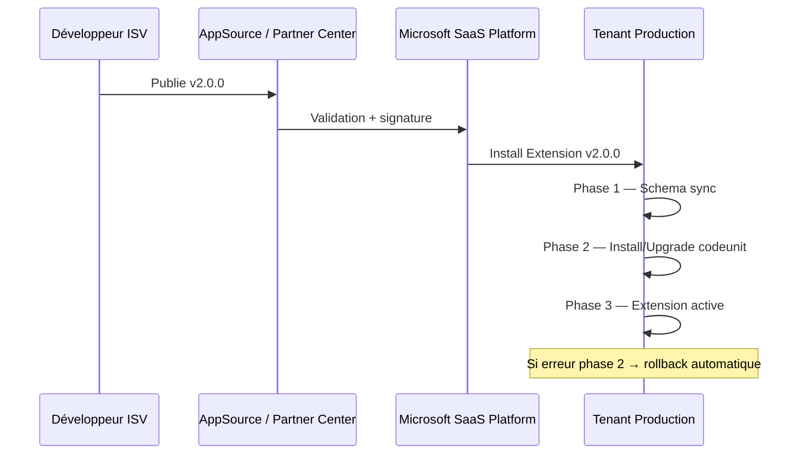
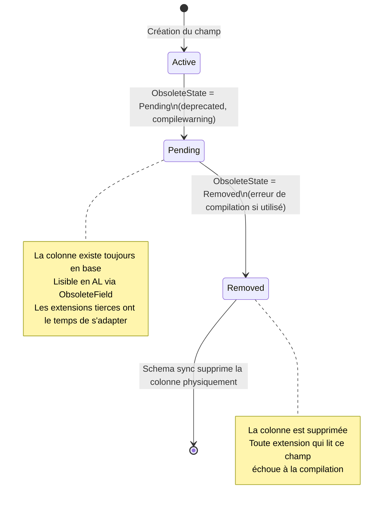

# Upgrade technique SaaS & Data Migration avancée

## Objectifs pédagogiques

À l'issue de ce module, tu seras capable de :

1. **Comprendre** le cycle de vie d'un upgrade SaaS Business Central et ce qui se passe réellement côté tenant lors d'une montée de version
2. **Concevoir** une stratégie de migration de données qui résiste aux upgrades successifs sans nécessiter d'intervention manuelle
3. **Implémenter** les codeunits d'installation et d'upgrade AL avec une gestion correcte des états et des dépendances entre extensions
4. **Diagnostiquer** les échecs d'upgrade à partir des telemetry Application Insights et des erreurs de schéma
5. **Anticiper** les breaking changes entre versions d'une extension et les gérer sans casser les données existantes

---

## Mise en situation

Tu arrives sur un projet chez un éditeur ISV qui commercialise une extension BC sur AppSource — gestion de flotte pour des entreprises de transport. L'extension est déployée chez 40 tenants SaaS en production.

La prochaine release intègre une refonte de la table principale `Fleet Vehicle` : un champ `Vehicle Type` (Option) est remplacé par une relation vers une nouvelle table de référence `Fleet Vehicle Type`. Autrement dit : tu supprimes un champ, tu en ajoutes un autre, et tu dois migrer les données existantes pour que les 40 clients n'aient pas de données corrompues après l'upgrade.

La solution naïve — "on change la table et on envoie un script SQL aux clients" — ne fonctionne pas en SaaS. Tu n'as pas accès à la base de données. Tout doit passer par AL. Et si ton upgrade codeunit plante chez un tenant, Microsoft va rollback l'extension automatiquement. Tu dois donc concevoir quelque chose de robuste, idempotent, et observable.

C'est exactement ce qu'on va construire ici.

---

## Le cycle d'upgrade SaaS — ce qui se passe réellement

Avant d'écrire une seule ligne de code, il faut comprendre ce que Microsoft fait sous le capot quand un tenant reçoit une nouvelle version de ton extension.

### Les trois phases d'un déploiement d'extension



**Phase 1 — Schema sync** : BC compare le schéma des tables de ta v2 avec celui de la v1 en place. Il applique les modifications de structure (nouveaux champs, nouvelles tables). À ce stade, les *anciennes* colonnes ne sont pas supprimées si tu as des `ObsoleteState` — mais tout champ marqué `ObsoleteState = Removed` sera physiquement supprimé ici. C'est irréversible.

**Phase 2 — Upgrade codeunit** : c'est ton code qui tourne. Tu as la main pour migrer les données. Si une exception non gérée remonte, tout s'arrête et la plateforme rollback.

**Phase 3** : l'extension est déclarée active sur le tenant. Les utilisateurs peuvent se reconnecter.

> 💡 La distinction schema sync / upgrade codeunit est fondamentale. Le schéma évolue *avant* ton code. Si tu essaies de lire un champ que tu as supprimé dans ton AL, il n'existe plus pendant l'upgrade codeunit. Plan en conséquence.

### Ce que tu ne contrôles pas en SaaS

En SaaS, tu ne choisis pas *quand* le tenant reçoit l'upgrade. Microsoft peut appliquer les mises à jour en dehors des heures ouvrées, tenant par tenant, selon des règles de déploiement progressif. Tes upgrade codeunits doivent donc :

- Être idempotentes — si elles tournent deux fois (reprise après incident), le résultat doit être identique
- Ne pas supposer un état spécifique des données — certains tenants peuvent être vides, d'autres avoir 10 ans d'historique
- Ne jamais bloquer en attente d'une interaction utilisateur

---

## Architecture d'une extension upgradable

### Les codeunits spéciaux

AL propose trois types de codeunits qui participent à la gestion du cycle de vie d'une extension. Ils ne sont pas interchangeables.

| Codeunit | Subtype | Quand il s'exécute | Usage typique |
|---|---|---|---|
| `Install Codeunit` | `Install` | Premier install sur un tenant vierge | Données initiales, config par défaut |
| `Upgrade Codeunit` | `Upgrade` | Mise à jour v(n) → v(n+1) | Migration de données, transformation de schéma |
| `Install Codeunit` (réutilisé) | `Install` | Réinstallation après désinstallation | Réinitialisation propre |

> ⚠️ Un `Install Codeunit` ne s'exécute PAS lors d'un upgrade — et inversement. C'est une erreur classique de croire que l'Install tourne à chaque déploiement. Si tu initialises des données uniquement dans l'Install, les tenants existants qui passent par l'Upgrade ne verront jamais ce code.

### Structure d'un Upgrade Codeunit

```al
codeunit 50200 "Fleet Upgrade Mgt"
{
    Subtype = Upgrade;

    trigger OnUpgradePerDatabase()
    begin
        // Code exécuté une seule fois par base de données (multi-tenant : une fois pour la DB partagée)
        // Rare — réservé aux données vraiment globales
    end;

    trigger OnUpgradePerCompany()
    begin
        // Code exécuté pour CHAQUE company du tenant
        // C'est ici que tu migres les données métier
        UpgradeVehicleTypes();
    end;

    local procedure UpgradeVehicleTypes()
    var
        UpgradeTag: Codeunit "Upgrade Tag";
    begin
        // Protection idempotence — on vérifie si cet upgrade a déjà tourné
        if UpgradeTag.HasUpgradeTag(GetVehicleTypeUpgradeTag()) then
            exit;

        MigrateVehicleTypeData();

        UpgradeTag.SetUpgradeTag(GetVehicleTypeUpgradeTag());
    end;

    local procedure GetVehicleTypeUpgradeTag(): Code[250]
    begin
        exit('FLEET-VEHICLETYPE-MIGRATION-20240115');
    end;
}
```

Le mécanisme d'**Upgrade Tag** est la clé de l'idempotence. La table `Upgrade Tags` (table système BC) enregistre les tags déjà appliqués. Si l'upgrade tourne deux fois — crash et reprise, ou bug de déploiement — ta procédure de migration ne s'exécutera pas une seconde fois.

> 🧠 Un Upgrade Tag est simplement un `Code[250]` stocké dans une table système. Par convention, utilise un format qui inclut le nom de l'extension, l'action, et une date. Ça évite les collisions si plusieurs extensions tournent en parallèle.

---

## Migration de données — du cas simple au cas réel

### Cas 1 — Ajout d'un champ avec valeur par défaut

Le cas le plus fréquent. Tu ajoutes un champ `IsElectric : Boolean` à ta table `Fleet Vehicle` et tu veux que les véhicules existants aient `false` par défaut — ce que BC fait automatiquement pour les Boolean. Aucune migration nécessaire.

Mais si tu ajoutes un champ `Code[20]` avec une valeur métier par défaut non vide, BC initialise à vide. Tu dois migrer :

```al
local procedure SetDefaultVehicleClass()
var
    Vehicle: Record "Fleet Vehicle";
begin
    Vehicle.SetRange("Vehicle Class", '');
    if Vehicle.FindSet(true) then
        repeat
            Vehicle."Vehicle Class" := 'STANDARD';
            Vehicle.Modify(false); // false = pas de trigger (performance)
        until Vehicle.Next() = 0;
end;
```

> 💡 `Modify(false)` désactive les triggers `OnModify` de la table. En migration, c'est quasi toujours ce que tu veux — tu ne veux pas déclencher de logique métier sur des données en cours de transformation.

### Cas 2 — Transformation de structure (le scénario réel)

Retour à notre situation de départ : `Vehicle Type` (Option) → relation vers `Fleet Vehicle Type` (table). Le champ Option ne peut pas être directement converti. Il faut :

1. Garder l'ancien champ en `ObsoleteState = Pending` pendant une version de transition
2. Créer le nouveau champ et la nouvelle table
3. En upgrade, lire l'ancien champ, créer les entrées dans la nouvelle table si nécessaire, remplir le nouveau champ
4. En version suivante, passer l'ancien champ en `ObsoleteState = Removed`

```al
// Dans ta table Fleet Vehicle — version de transition
field(5; "Vehicle Type Option"; Option)
{
    OptionMembers = "Standard","Refrigerated","Tank","Flatbed";
    ObsoleteState = Pending;
    ObsoleteReason = 'Replaced by Vehicle Type Code. Use field 6 instead.';
    ObsoleteTag = '2.0';
}

field(6; "Vehicle Type Code"; Code[20])
{
    TableRelation = "Fleet Vehicle Type";
}
```

Et la migration AL :

```al
local procedure MigrateVehicleTypeData()
var
    Vehicle: Record "Fleet Vehicle";
    VehicleType: Record "Fleet Vehicle Type";
    OldOptionValue: Integer;
    TypeMapping: array[4] of Code[20];
begin
    // Définir le mapping Option → Code
    TypeMapping[1] := 'STANDARD';
    TypeMapping[2] := 'REFRIG';
    TypeMapping[3] := 'TANK';
    TypeMapping[4] := 'FLATBED';

    // Créer les types de référence s'ils n'existent pas
    EnsureVehicleTypeExists('STANDARD', 'Standard');
    EnsureVehicleTypeExists('REFRIG', 'Refrigerated');
    EnsureVehicleTypeExists('TANK', 'Tank');
    EnsureVehicleTypeExists('FLATBED', 'Flatbed');

    // Migrer les véhicules
    if Vehicle.FindSet(true) then
        repeat
            OldOptionValue := Vehicle."Vehicle Type Option".AsInteger() + 1;
            if (OldOptionValue >= 1) and (OldOptionValue <= 4) then
                Vehicle."Vehicle Type Code" := TypeMapping[OldOptionValue];
            Vehicle.Modify(false);
        until Vehicle.Next() = 0;
end;

local procedure EnsureVehicleTypeExists(TypeCode: Code[20]; TypeDescription: Text[100])
var
    VehicleType: Record "Fleet Vehicle Type";
begin
    if not VehicleType.Get(TypeCode) then begin
        VehicleType.Init();
        VehicleType.Code := TypeCode;
        VehicleType.Description := TypeDescription;
        VehicleType.Insert(false);
    end;
end;
```

> ⚠️ Ne jamais faire un `DeleteAll()` sur les données existantes avant d'être certain que la migration a réussi. En cas d'erreur partielle, tu te retrouves avec des données vides et un rollback qui repart de zéro. Transforme, ne supprime pas.

### Cas 3 — Migration volumétrique (10 000+ enregistrements)

En SaaS, les upgrade codeunits s'exécutent dans une transaction avec un timeout. Si tu as 500 000 lignes à migrer et que tu fais un `FindSet` / `Modify` dans une boucle naïve, tu vas timeout.

La solution : traiter par batchs avec commit intermédiaire, combiné à un upgrade tag plus granulaire.

```al
local procedure MigrateVehicleTypeDataBatched()
var
    Vehicle: Record "Fleet Vehicle";
    BatchSize: Integer;
    ProcessedCount: Integer;
begin
    BatchSize := 1000;
    ProcessedCount := 0;

    Vehicle.SetRange("Vehicle Type Code", ''); // Uniquement ceux pas encore migrés
    Vehicle.SetLoadFields("No.", "Vehicle Type Option", "Vehicle Type Code");

    if Vehicle.FindSet(true) then
        repeat
            Vehicle."Vehicle Type Code" := MapOptionToCode(Vehicle."Vehicle Type Option");
            Vehicle.Modify(false);
            ProcessedCount += 1;

            if ProcessedCount mod BatchSize = 0 then
                Commit(); // Libère les locks, reset le timeout

        until Vehicle.Next() = 0;
end;
```

Le filtre `SetRange("Vehicle Type Code", '')` rend la procédure naturellement idempotente — les enregistrements déjà migrés sont ignorés. C'est plus élégant que de compter sur un upgrade tag seul quand on traite par batchs.

> 🧠 `Commit()` en plein milieu d'une procédure d'upgrade n'est pas un problème ici — contrairement à la logique métier normale où un commit prématuré peut laisser des données dans un état incohérent. En migration, chaque enregistrement modifié est une unité de travail atomique.

---

## Gestion des ObsoleteState — le cycle de vie d'un champ

Le système d'obsolescence AL est ta seule façon de supprimer proprement un champ en SaaS sans casser les tenants qui sont encore sur l'ancienne version.



En pratique, le cycle sur deux versions majeures :

- **v2.0** : passer en `Pending`, lancer la migration de données dans l'upgrade codeunit
- **v3.0** : passer en `Removed`, supprimer le champ de tout le code AL

> ⚠️ Si tu passes directement de `Active` à `Removed`, la schema sync supprime la colonne sans que tu aies eu le temps de migrer les données. Résultat : perte de données irréversible. Toujours passer par `Pending`.

---

## Observabilité — savoir ce qui s'est passé chez chaque tenant

En SaaS, tu ne peux pas ouvrir une session de debug sur le tenant d'un client en production. Ta seule fenêtre sur ce qui s'est passé, c'est Application Insights.

### Connecter ton extension à Application Insights

Dans le manifest `app.json`, tu n'as rien à faire — la télémétrie d'upgrade est émise automatiquement par la plateforme BC. En revanche, tu peux émettre tes propres traces depuis tes upgrade codeunits :

```al
local procedure MigrateVehicleTypeData()
var
    Telemetry: Codeunit Telemetry;
    CustomDimensions: Dictionary of [Text, Text];
    VehicleCount: Integer;
begin
    VehicleCount := CountVehiclesToMigrate();
    
    CustomDimensions.Add('VehicleCount', Format(VehicleCount));
    CustomDimensions.Add('CompanyName', CompanyName());
    Telemetry.LogMessage(
        '0000FLEET001',
        StrSubstNo('Starting vehicle type migration for %1 records', VehicleCount),
        Verbosity::Normal,
        DataClassification::OrganizationIdentifiableInformation,
        TelemetryScope::ExtensionPublisher,
        CustomDimensions
    );

    // ... migration ...

    Telemetry.LogMessage(
        '0000FLEET002',
        'Vehicle type migration completed successfully',
        Verbosity::Normal,
        DataClassification::OrganizationIdentifiableInformation,
        TelemetryScope::ExtensionPublisher,
        CustomDimensions
    );
end;
```

> 💡 `TelemetryScope::ExtensionPublisher` envoie la trace vers ton Application Insights à toi (configuré dans Partner Center), pas vers l'Application Insights du client. C'est ce que tu veux pour monitorer tes upgrades en masse.

### Requêtes KQL utiles pour suivre les upgrades

Une fois dans Application Insights, tu peux corréler les events de plateforme avec tes traces custom :

```kql
// Voir tous les upgrades de ton extension sur les dernières 24h
traces
| where timestamp > ago(24h)
| where customDimensions["extensionId"] == "ton-extension-id"
| where message has "upgrade"
| project timestamp, 
          tenantId = customDimensions["aadTenantId"],
          company = customDimensions["CompanyName"],
          message,
          severityLevel
| order by timestamp desc
```

```kql
// Détecter les upgrades en échec
traces
| where customDimensions["eventId"] == "LC0028" // Upgrade failed
| project timestamp,
          tenantId = customDimensions["aadTenantId"],
          error = customDimensions["failureReason"]
| order by timestamp desc
```

L'event `LC0028` est émis automatiquement par BC quand un upgrade codeunit lève une exception non gérée. C'est ton premier point d'investigation quand un tenant signale un problème.

---

## Diagnostic — les échecs d'upgrade les plus fréquents

### Symptôme : l'extension rollback automatiquement chez certains tenants

**Cause la plus fréquente** : une exception non catchée dans `OnUpgradePerCompany`. Souvent un `Get()` qui fait un `RecordNotFound` parce que le tenant concerné a une configuration atypique.

**Correction** : ne jamais utiliser `Get()` dans un upgrade codeunit sans vérifier le retour. Systématiquement utiliser le pattern :

```al
// ❌ Dangereux en upgrade
SetupRecord.Get('DEFAULTCODE');

// ✅ Robuste en upgrade
if not SetupRecord.Get('DEFAULTCODE') then begin
    // Gérer le cas où l'enregistrement n'existe pas
    // (tenant vierge, config différente, etc.)
    CreateDefaultSetup();
end;
```

### Symptôme : les données sont correctes chez certains tenants, absentes chez d'autres

**Cause** : l'upgrade tag a été posé avant la fin de la migration (crash partiel), ou le `Commit()` intermédiaire a été posé après le tag.

**Correction** : toujours poser le tag *après* que la migration soit terminée avec succès. Et s'assurer que le filtre de ta migration est assez discriminant pour reprendre proprement si elle s'arrête en cours de route.

### Symptôme : erreur de compilation à la publication de la nouvelle version

```
Error: Field 'Vehicle Type Option' is Removed and can no longer be used.
```

**Cause** : tu as passé un champ en `Removed` mais ton propre code AL (ou un upgrade codeunit d'une version antérieure) référence encore ce champ.

**Correction** : avant de passer en `Removed`, faire un grep complet sur le codebase pour toute référence au champ. Inclure les codeunits d'upgrade des versions précédentes — elles restent dans le code même si elles ne s'exécutent plus.

> ⚠️ Les upgrade codeunits des versions passées sont compilées à chaque build. Un champ `Removed` référencé dans un ancien upgrade codeunit bloque la compilation même si ce codeunit ne tournera jamais sur un tenant actuel.

---

## Construction progressive — de l'extension simple à l'extension upgradable en production

### v1 — Extension initiale sans gestion d'upgrade

Typiquement, une première extension livrée sans upgrade codeunit. Ça fonctionne tant qu'il n'y a pas de changement structurel.

### v2 — Introduction du premier upgrade codeunit

La v2 change la structure d'une table. C'est ici qu'on ajoute l'upgrade codeunit, les upgrade tags, et les ObsoleteState `Pending` sur les anciens champs. La migration doit être pensée pour des tenants avec 0 données comme pour des tenants avec des années d'historique.

**Ce que tu dois valider avant de publier une v2 :**

- [ ] L'upgrade codeunit est idempotente (peut tourner deux fois sans effet de bord)
- [ ] Tous les `Get()` et `FindFirst()` ont une gestion du cas non trouvé
- [ ] Les champs supprimés sont en `Pending` et non en `Removed`
- [ ] Les upgrade tags sont uniques et ne collisionnent pas avec d'autres extensions
- [ ] La télémétrie est en place pour suivre l'avancement chez chaque tenant
- [ ] Les tests AL couvrent le scénario tenant vierge ET tenant avec données existantes

### v3 — Finalisation et nettoyage

La v3 peut passer les champs `Pending` en `Removed`, retirer le code de migration de la v2 (qui ne tournera plus jamais si tous les tenants ont migré), et alléger le codebase. C'est aussi le bon moment pour vérifier via les telemetry qu'il ne reste aucun tenant en v1 avant de supprimer les chemins de migration v1→v2.

---

## Cas réel en entreprise

Un ISV gérant 60 tenants SaaS pour une solution de gestion de contrats a dû migrer sa table `Contract Line` : le champ `Unit Price` (Decimal, stocké en devise locale) devait être remplacé par deux champs séparés (`Unit Price LCY` et `Unit Price FCY`) pour gérer correctement le multi-devises.

**La migration naïve** (copier le montant dans `Unit Price LCY` pour tous) aurait faussé les données chez 12 tenants qui travaillaient en devise étrangère — leur `Unit Price` était déjà en EUR alors que leur currency était USD.

**La migration correcte** a lu le champ `Currency Code` du contrat parent pour chaque ligne, appliqué la logique de conversion appropriée, et émis une trace par tenant avec le nombre de lignes migrées et le nombre de cas d'erreur de conversion.

Résultat : 58 tenants migrés automatiquement sans intervention. 2 tenants avaient des configurations de devise corrompues datant de 3 ans — identifiés par la télémétrie, traités manuellement avec le support de chaque client. Zéro perte de données, zéro rollback.

La clé : la migration ne supposait rien sur l'état des données. Elle les lisait, les analysait, et traçait chaque anomalie au lieu de lever une exception.

---

## Bonnes pratiques

**1. Un upgrade tag par transformation logique, pas par version**
Un tag de type `FLEET-VEHICLETYPE-MIGRATION-20240115` est bien plus précis qu'un tag `FLEET-UPGRADE-V2`. Si tu fais trois migrations différentes en v2, crée trois tags distincts. Ça permet des reprises granulaires.

**2. Les upgrade codeunits s'accumulent — ne pas les supprimer trop tôt**
Une extension en production depuis 3 ans a probablement des tenants encore en v1.5 (upgrade automatique BC, pas encore passé). Supprimer un upgrade codeunit v1→v2 parce que "tout le monde est en v3" est une erreur si un tenant reçoit sa mise à jour en retard.

**3. Tester avec des snapshots de données réelles anonymisées**
Les bugs d'upgrade se cachent dans les cas limites que tu n'imagines pas en développement : un champ laissé vide il y a 5 ans, un code qui contenait des caractères spéciaux, une quantité négative laissée par un bug corrigé depuis. Teste avec des dumps anonymisés de tenants réels.

**4. Ne jamais supposer qu'une table de référence est peuplée**
Dans `EnsureVehicleTypeExists()` — c'est exactement ce pattern. En SaaS, certains tenants peuvent avoir vidé les tables de configuration manuellement. Ton upgrade doit fonctionner même dans ce cas.

**5. Séparer `OnUpgradePerDatabase` et `OnUpgradePerCompany` consciemment**
`OnUpgradePerDatabase` ne tourne qu'une fois par upgrade, quelle que soit le nombre de companies. Si tu migres des données métier dans `PerDatabase`, les companies 2 et 3 ne seront pas traitées. Cette erreur est subtile et difficile à diagnostiquer.

**6. Documenter les upgrade tags dans un fichier de changelog technique**
Maintenir un fichier `UPGRADE_HISTORY.md` dans le repo avec la liste des tags, leur version, et leur description. Indispensable quand une nouvelle personne arrive sur le projet et doit comprendre pourquoi telle migration a été nécessaire.

**7. Valider avec `al test` sur un environnement Sandbox BC avant toute publication AppSource**
Microsoft exige que les extensions publiées passent une validation technique. Mais leur validation ne teste pas tes upgrade codeunits contre des données réelles. C'est ton boulot.

---

## Résumé

Un upgrade SaaS Business Central n'est pas un déploiement classique : tu n'as pas accès à la base, pas de contrôle sur le timing, et un rollback automatique si quelque chose plante. La fiabilité repose sur trois piliers — des upgrade codeunits idempotentes protégées par des Upgrade Tags, un cycle d'obsolescence en deux phases (Pending → Removed) pour les suppressions de champs, et une télémétrie applicative suffisante pour diagnostiquer ce qui s'est passé chez chaque tenant sans avoir à ouvrir une session de debug.

La migration de données en AL, c'est fondamentalement de la programmation défensive : ne suppose rien sur l'état des données, gère tous les cas limites, et trace tout ce qui sort de l'ordinaire. Les tenants SaaS sont hétérogènes par nature — certains sont vierges, d'autres ont des années d'historique et des configurations que tu n'avais pas prévues.

Le module suivant abordera la migration depuis NAV on-premise vers Business Central SaaS — un contexte différent où tu dois en plus gérer la conversion du C/AL historique et des données en dehors du périmètre AppSource.

---

<!-- snippet
id: bc_upgrade_tag_idempotence
type: concept
tech: business central
level: advanced
importance: high
format: knowledge
tags: upgrade, al, saas, idempotence, migration
title: Upgrade Tag — mécanisme d'idempotence des migrations BC
content: Un Upgrade Tag est un Code[250] stocké dans la table système "Upgrade Tags". Avant d'exécuter une migration, on appelle UpgradeTag.HasUpgradeTag(tag) — si true, on sort immédiatement. À la fin de la migration réussie, on appelle UpgradeTag.SetUpgradeTag(tag). Si le déploiement crash et repart, la migration ne double pas. Nommer les tags avec le format EXTENSION-ACTION-DATE pour éviter les collisions entre extensions.
description: Protège les migrations contre les doubles exécutions. Le tag est posé après succès — jamais avant.
-->

<!-- snippet
id: bc_upgrade_subtype_difference
type: warning
tech: business central
level: advanced
importance: high
format: knowledge
tags: upgrade, install, subtype, al, saas
title: Install Codeunit vs Upgrade Codeunit — ne pas confondre
content: Piège : un codeunit Subtype=Install ne s'exécute PAS lors d'un upgrade — seulement au premier install sur un tenant vierge. Conséquence : des données initialisées uniquement dans l'Install n'existent jamais chez les tenants existants qui passent par l'Upgrade. Correction : dupliquer la logique d'initialisation dans l'Upgrade Codeunit, ou extraire dans une procédure commune appelée depuis les deux.
description: L'Install et l'Upgrade sont des chemins d'exécution séparés — une donnée initialisée dans l'un n'existe pas dans l'autre.
-->

<!-- snippet
id: bc_upgrade_obsolete_cycle
type: concept
tech: business central
level: advanced
importance: high
format: knowledge
tags: obsolete, champ, schema, migration, saas
title: Cycle de vie d'un champ supprimé — Pending → Removed
content: Supprimer un champ en AL se fait en deux versions : v(n) passer en ObsoleteState=Pending (avertissement, colonne toujours présente, lisible), migrer les données dans l'upgrade codeunit. v(n+1) passer en ObsoleteState=Removed — BC supprime physiquement la colonne à la schema sync suivante. Passer directement en Removed sans Pending détruit les données sans migration possible.
description: Toujours passer par Pending avant Removed. La colonne existe encore en Pending — elle disparaît définitivement en Removed.
-->

<!-- snippet
id: bc_upgrade_modify_no_trigger
type: tip
tech: business central
level: advanced
importance: medium
format: knowledge
tags: modify, trigger,
