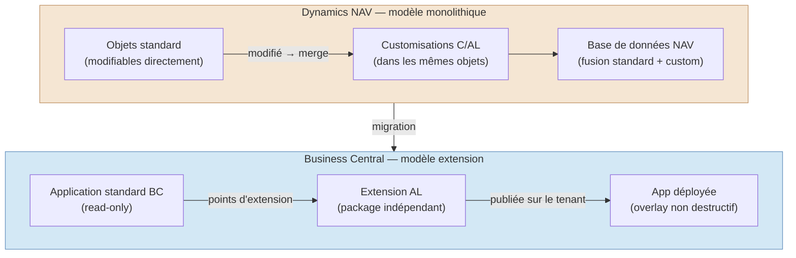
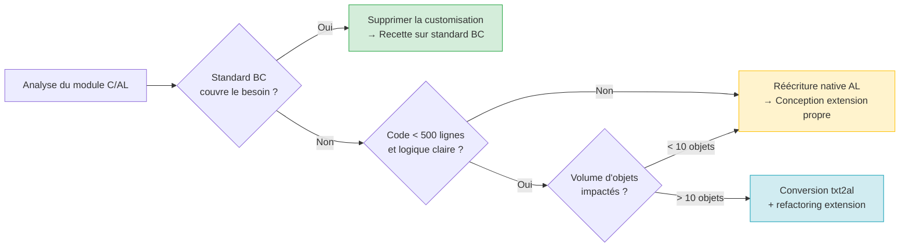

# Migration NAV vers Business Central

## Objectifs pédagogiques

À l'issue de ce module, vous serez capable de :

1. **Distinguer** les différences architecturales fondamentales entre Dynamics NAV (C/AL) et Business Central (AL Extensions) pour arbitrer une stratégie de migration
2. **Évaluer** le coût et la complexité réels d'une migration selon le niveau de customisation C/AL existant
3. **Choisir** entre réécriture native AL, refactoring assisté et migration outillée selon le contexte client
4. **Identifier** les patterns C/AL qui ne se transposent pas directement en AL et les alternatives à mettre en œuvre
5. **Cadrer** techniquement un projet de migration dans ses grandes étapes, sans piège de sous-estimation

---

## Mise en situation

Imaginons une entreprise industrielle, 300 utilisateurs, qui tourne sur Dynamics NAV 2016 depuis 8 ans. L'ERP a été profondément personnalisé au fil du temps : une quinzaine d'objets modifiés directement dans la base applicative (tables core, pages, codeunits de flux logistique), quelques intégrations développées en C/AL vers des partenaires EDI, et une gestion des rappels clients entièrement réécrite.

Le DSI veut migrer vers Business Central SaaS pour des raisons simples : réduire les coûts d'infrastructure, bénéficier des mises à jour automatiques, et aligner l'ERP sur la stack Microsoft 365 déjà en place.

Le consultant technique chargé du projet reçoit les sources NAV exportées, ouvre VS Code, installe l'extension AL, et commence à lire le code. Premier constat : rien n'est directement portable. Le C/AL est compilé différemment, les objets modifiés sont des forks de l'applicatif standard, et certaines pratiques (modification directe de tables système, triggers globaux) n'ont tout simplement pas d'équivalent en AL moderne.

La question n'est pas "comment convertir" — elle est "qu'est-ce qu'on réécrit, qu'est-ce qu'on adapte, et qu'est-ce qu'on abandonne".

---

## Contexte et problématique

### D'où vient le fossé ?

Dynamics NAV a existé sous de nombreuses formes depuis les années 1990. Le modèle de développement était centré sur la **modification directe des objets applicatifs** : on ouvrait un objet standard (une table, une codeunit), on ajoutait ses champs ou sa logique, et on livrait le tout dans une base de données monolithique. Le langage utilisé — C/AL (Client/Application Language) — était propriétaire, compilé dans la base NAV, et ne ressemblait à rien d'autre dans l'écosystème.

Business Central rompt avec ce modèle à partir de 2018. Le principe est radicalement différent : **on n'a plus accès au code standard**, on ne peut que l'étendre via des extensions AL. Les extensions sont des packages indépendants, versionnés, déployables séparément, qui s'appuient sur des points d'extension définis par Microsoft. On passe d'un modèle fork à un modèle overlay.

Ce changement n'est pas cosmétique. Il implique une rethink complète de la manière dont on développe sur BC.



### Pourquoi c'est plus difficile qu'un upgrade classique

Un upgrade de version NAV (disons NAV 2013 → NAV 2018) était un effort connu : merger les objets customisés avec la nouvelle version standard, régler les conflits, retester. C'était laborieux mais outillé — Microsoft fournissait des outils de merge, et la logique restait C/AL dans les deux sens.

La migration NAV → BC est différente en nature, pas juste en degré. On change de paradigme de développement, d'environnement de compilation, de modèle de déploiement, et souvent de modèle d'hébergement (OnPrem → SaaS). Les trois dimensions bougent simultanément.

---

## C/AL vs AL — Ce qui change vraiment

Commençons par dissiper une confusion fréquente : AL n'est pas "C/AL en mieux". C'est un langage différent, avec une philosophie différente. La syntaxe superficielle peut se ressembler sur certains points, mais les implications architecturales sont profondes.

### La syntaxe en regard

Voici un exemple simple — une procédure qui calcule le montant TTC — dans les deux langages :

**C/AL (NAV)**
```cal
PROCEDURE CalculateTTC@1(Amount@1000 : Decimal;VATRate@1001 : Decimal) : Decimal;
BEGIN
  EXIT(Amount * (1 + VATRate / 100));
END;
```

**AL (Business Central)**
```al
procedure CalculateTTC(Amount: Decimal; VATRate: Decimal): Decimal
begin
    exit(Amount * (1 + VATRate / 100));
end;
```

La logique est identique. La syntaxe est proche. Mais c'est ici que s'arrête la ressemblance confortable.

La vraie différence ne se lit pas dans une procédure isolée. Elle apparaît dès qu'on veut greffer cette logique sur un objet existant. En C/AL, on ouvrait l'objet et on ajoutait. En AL, on ne peut qu'écouter les events que Microsoft a décidé de publier — ou créer ses propres points d'extension dans ses propres objets.

### Les différences qui font mal en migration

| Dimension | C/AL NAV | AL Business Central |
|-----------|----------|---------------------|
| **Accès au code standard** | Modification directe des objets | Extensions uniquement — le standard est une boîte noire |
| **Ajout de champs** | Champ ajouté directement dans la table standard | TableExtension avec nouveau champ |
| **Modification de page** | Modification directe de la page | PageExtension avec ajout/déplacement de contrôles |
| **Logique globale** | Triggers dans les objets standard modifiés | EventSubscribers sur les events publiés |
| **Compilation** | Compilateur NAV intégré à l'IDE NAV | Compilateur AL (OmniSharp) dans VS Code |
| **Déploiement** | Objects exportés/importés dans la base | Extension packagée en `.app`, publiée via PowerShell ou Admin Center |
| **Dépendances** | Implicites (tout dans la même base) | Déclarées explicitement dans `app.json` |
| **ID d'objets** | Range libre dans la base | Range allouée par Microsoft (pour AppSource) ou par accord partenaire |

Le même EventSubscriber qui remplace un trigger C/AL se déclare ainsi en AL — et cette différence d'écriture cache une différence d'accès bien plus profonde :

```al
// C/AL : on modifiait directement le trigger OnAfterPostSalesOrder dans Codeunit 80
// AL : on s'abonne à l'event publié par Microsoft — uniquement s'il existe

[EventSubscriber(ObjectType::Codeunit, Codeunit::"Sales-Post", 'OnAfterPostSalesOrder', '', false, false)]
local procedure OnAfterPostSalesOrder_MyLogic(var SalesHeader: Record "Sales Header"; var GenJnlPostLine: Codeunit "Gen. Jnl.-Post Line")
begin
    // votre logique post-posting ici
    // si cet event n'était pas publié par Microsoft, ce code n'existerait pas
end;
```

🧠 **Concept clé** — La "surface d'extensibilité" : en C/AL, vous modifiiez directement le trigger `OnAfterPostSalesOrder`. En AL, vous créez un EventSubscriber qui écoute cet event publié par la codeunit standard. Si l'event n'est pas publié par Microsoft, vous ne pouvez pas y accéder — c'est l'une des limitations structurelles du modèle.

### Le cas des modifications C/AL qui n'ont pas d'équivalent direct

Certaines pratiques NAV sont structurellement incompatibles avec le modèle AL :

**1. Codeunit 1 et OnCompanyInitialize**
En NAV, l'initialisation d'entreprise se gérait via le trigger `OnCompanyInitialize` dans la Codeunit 1 (Application Management). En BC, la Codeunit 1 n'existe plus. Le remplacement est un EventSubscriber sur l'event `OnCompanyInitialize` publié par le système — mais le comportement n'est pas strictement identique selon ce que le code faisait, notamment pour les données initialisées lors de la création d'une société.

```al
// Remplacement de Codeunit 1 OnCompanyInitialize en AL
codeunit 50100 "My Company Init Handler"
{
    [EventSubscriber(ObjectType::Codeunit, Codeunit::"Company-Initialize", 'OnCompanyInitialize', '', false, false)]
    local procedure OnCompanyInitialize()
    begin
        // Initialiser ici les données de setup de votre extension
        // Ne pas reproduire la logique BC standard — elle est gérée par Microsoft
        InitMyExtensionSetup();
    end;

    local procedure InitMyExtensionSetup()
    var
        MySetup: Record "My Extension Setup";
    begin
        if not MySetup.Get() then begin
            MySetup.Init();
            MySetup.Insert(true);
        end;
    end;
}
```

**2. Les modifications de tables système**
Ajouter un champ à la table `Customer` (table 18) en NAV était courant. En BC, on crée une `tableextension` qui étend la table Customer. Le champ existe mais il est dans l'extension — les implications sur les rapports, les intégrations et les exports de données changent.

**3. Les reports RDLC et Word**
Les rapports NAV utilisent des layouts RDLC. BC supporte RDLC et Word layouts, mais les datasets et les propriétés de report ont évolué. La migration automatique est partielle — les rapports complexes (bandes imbriquées, groupements personnalisés) nécessitent souvent une réécriture.

**4. Les XMLPort**
Les XMLPorts NAV ont une syntaxe proche en AL, mais les propriétés et les triggers ont évolué. Le portage est généralement faisable mais demande une revue systématique.

⚠️ **Erreur fréquente** — Supposer que parce que la syntaxe AL ressemble à C/AL, le code se convertit mécaniquement. Microsoft a fourni un outil de conversion C/AL → AL (`txt2al`), mais il produit du code compilable dans peu de cas sans retouche manuelle. Il est utile comme point de départ sur du code simple, pas comme solution de migration.

---

## Les trois stratégies de migration

Face à un patrimoine C/AL à migrer, trois grandes approches existent. Elles ne s'excluent pas — un projet réel mixe souvent les trois selon les modules concernés.

### Stratégie 1 — Réécriture native AL

On repart du besoin métier, on conçoit une extension AL propre, et on jette le code C/AL. La migration de données est traitée séparément.

**Quand c'est la bonne option :**
- Code NAV ancien, mal structuré, mal documenté — le coût de comprendre avant de porter est supérieur au coût de réécrire
- Fonctionnalités métier qui ont évolué depuis la version NAV — autant coder la nouvelle version directement
- Volumes de code limités (quelques codeunits, une ou deux pages)
- L'équipe maîtrise AL et a le temps de bien faire

**Risque principal :** sous-estimer le scope. "Réécrire proprement" prend toujours plus de temps qu'attendu, et le risque de régression fonctionnelle est réel si les tests de recette ne sont pas exhaustifs.

### Stratégie 2 — Conversion assistée + refactoring

On utilise `txt2al` comme point de départ, on corrige les erreurs de compilation, et on refactorise progressivement pour se conformer au modèle extension.

**Le workflow concret :**

```bash
# Export des objets NAV en format texte (depuis NAV Development Environment)
# Résultat : fichiers .txt par objet

# Conversion vers syntaxe AL
txt2al --source <DOSSIER_TXT> --target <DOSSIER_AL>

# Vérification de la compilation (VS Code + extension AL)
# → erreurs attendues : accès à des objets non exportables, triggers inexistants, etc.
```

Ce processus produit du code syntaxiquement proche de l'AL mais qui ne respecte pas le modèle extension : il génère des "objets complets" (table 18 Customer entière) plutôt que des extensions. La transformation en `tableextension` / `pageextension` / `codeunitextension` est manuelle.

Une checklist de refactoring post-`txt2al` évite d'oublier les points systématiques :

- [ ] Transformer chaque table complète en `tableextension` (ne garder que les champs ajoutés)
- [ ] Transformer chaque page complète en `pageextension` (ne garder que les contrôles ajoutés)
- [ ] Remplacer les triggers directs par des `EventSubscriber` sur les events publiés
- [ ] Vérifier que les `GlobalTextConstant` ont été déplacés vers des labels AL (`Label` syntax)
- [ ] Remplacer les accès `Codeunit 1` par les events `Company-Initialize`
- [ ] Vérifier les `XMLPort` : propriétés renommées, triggers à adapter
- [ ] Vérifier les `Report` : datasets restructurés, RDLC à revalider
- [ ] Contrôler les ranges d'ID dans `app.json` avant le premier commit

💡 **Astuce** — Avant de lancer `txt2al` sur l'ensemble du patrimoine, faites-le sur un objet de chaque type (table, page, codeunit, report) pour évaluer le taux d'erreur moyen. Ça donne une estimation réaliste du volume de correction manuelle à prévoir.

**Quand c'est la bonne option :**
- Code NAV bien structuré, bien commenté, logique métier claire
- Volume important (50+ objets) — la réécriture from scratch serait trop longue
- L'équipe connaît bien l'ancienne version et peut valider la cohérence du code converti

### Stratégie 3 — Migration par remplacement fonctionnel (via AppSource ou partenaire)

Plutôt que de migrer le code customisé, on cherche si une application AppSource ou une fonctionnalité standard BC ne couvre pas déjà le besoin.

BC 2024 couvre nativement des fonctionnalités qui nécessitaient des développements spécifiques en NAV 2016 : workflows d'approbation, gestion des prix avancée, traçabilité articles, dimensions analytiques améliorées. Avant de migrer du code, la question à poser est : **ce code existe-t-il encore comme besoin, ou BC le couvre-t-il maintenant ?**

**Quand c'est la bonne option :**
- Customisations historiques qui compensaient des manques du NAV de l'époque
- Le métier est prêt à accepter le "standard BC" sur ce sujet
- L'équipe IT n'a pas la bande passante pour maintenir des extensions sur le long terme

⚠️ **Erreur fréquente** — Migrer fidèlement du code NAV qui compense une limitation NAV qui n'existe plus dans BC. Résultat : une extension qui crée des conflits avec le standard BC tout en reproduisant un comportement désormais inutile.

---

## Prise de décision — Quel chemin selon le contexte ?

La vraie difficulté d'un projet de migration n'est pas technique — c'est de choisir le bon niveau d'effort pour chaque périmètre. Voici un cadre de décision pratique.

### Matrice d'évaluation par module customisé

Pour chaque groupe de customisations NAV, évaluer sur trois axes :



### Tableau comparatif des trois stratégies

| Critère | Réécriture native | Conversion assistée | Remplacement fonctionnel |
|---------|-----------------|-------------------|------------------------|
| **Qualité du code résultant** | Excellente | Moyenne (dépend du refactoring) | N/A (code standard) |
| **Coût initial** | Élevé | Moyen | Faible à moyen |
| **Risque de régression** | Élevé si tests insuffisants | Moyen | Faible |
| **Maintenabilité long terme** | Excellente | Variable | Excellente (Microsoft maintient) |
| **Adapté si volume élevé** | Non | Oui | Selon couverture AppSource |
| **Adapté si besoin métier a évolué** | Oui | Non | Oui |
| **Dépendance à la connaissance NAV** | Faible | Élevée | Faible |

### Les limites à anticiper

Le modèle extension AL impose des contraintes que certaines customisations NAV dépassent structurellement :

- **Pas d'accès aux events non publiés** : si la logique NAV se greffait dans un trigger interne d'une codeunit que BC n'a pas rendue observable, il faut trouver un autre point d'accroche — ou accepter que la customisation n'est pas portable telle quelle
- **Pas de modification de contraintes de base de données** : en NAV, on pouvait supprimer des clés, changer des types. En BC SaaS, la structure des tables standard est figée — on peut seulement ajouter via TableExtension
- **Isolation des extensions** : deux extensions ne peuvent pas se modifier mutuellement directement. Si le patrimoine NAV avait des objets qui s'inter-dépendaient de manière complexe, la séparation en extensions distinctes nécessite une refonte architecturale

🧠 **Concept clé** — La surface d'extensibilité de BC s'élargit à chaque wave. Microsoft publie régulièrement de nouveaux events et interfaces d'extension pour répondre aux besoins des partenaires. Si un event manque aujourd'hui, il est parfois judicieux d'attendre la prochaine wave ou de soumettre une demande sur le portail ideas.dynamics.com plutôt que de contourner avec une solution fragile.

---

## Cas réel en entreprise

**Contexte :** entreprise de distribution, NAV 2013 R2, 80 objets customisés (tables, pages, codeunits, reports). Deux développeurs NAV côté intégrateur, un consultant BC junior. Go-live imposé par la fin de support infrastructure, délai de 14 mois.

**Phase 1 — Inventaire et classification (6 semaines)**

Tous les objets customisés ont été exportés et classés :

- **Catégorie A** (32 objets) : fonctionnalités désormais couvertes par BC standard (gestion des prix, workflows de validation, rapports financiers de base) → décision d'abandon
- **Catégorie B** (28 objets) : logique métier spécifique, code lisible → conversion assistée
- **Catégorie C** (20 objets) : code ancien, logique opaque, fort couplage avec des tables système → réécriture obligatoire

**Phase 2 — Migration catégorie B par `txt2al` + refactoring (12 semaines)**

Ratio observé : environ 40% du code converti nécessitait des corrections non triviales (event manquant, accès à des propriétés obsolètes, reports à restructurer).

**Phase 3 — Réécriture catégorie C (16 semaines)**

Les 20 objets ont été réécrits en partant du besoin métier, avec des sessions de validation fonctionnelle bi-hebdomadaires avec les key users.

**Résultats :**
- 80 objets NAV → 3 extensions AL distinctes (gestion commerciale, logistique, reporting)
- Délai respecté avec 3 semaines de marge
- Volume de code final : ~60% du volume C/AL initial (élimination du code mort et des compensations de limitations NAV)
- 2 events manquants identifiés → solutions de contournement via Job Queue pour le run différé
- 4 à 6 semaines de support renforcé post go-live nécessaires malgré la qualité technique — les utilisateurs ont eu besoin d'accompagnement sur les changements d'interface

**Ce que ce projet enseigne :** les 6 semaines d'inventaire ont évité de migrer 32 objets inutiles, soit environ 8 semaines de travail économisées en aval. Et le dérapage post go-live n'était pas technique — c'était le change management, insuffisamment budgété.

---

## Bonnes pratiques

**Ne jamais estimer sans inventaire préalable**
Le volume d'objets customisés est trompeur. Deux objets de 10 lignes ne coûtent pas le même effort de migration qu'un objet de 500 lignes avec 3 niveaux de dépendances. L'inventaire doit classer par complexité, pas par volume.

**Traiter la migration de données séparément**
La migration de code et la migration de données sont deux chantiers avec des risques indépendants. L'erreur fréquente est de les mélanger dans le même planning — les bloquages de l'un retardent l'autre sans raison. Les champs ajoutés via TableExtension ne migrent pas automatiquement : un script ou un outil ETL doit être planifié explicitement.

**Tester les event subscribers sur des volumes représentatifs**
Un event subscriber qui fonctionne sur les données de recette peut créer des problèmes de performance sur les 8 ans d'historique d'une base NAV en production. Les tests de charge sur les events sont souvent négligés.

**Versionner les extensions dès le premier commit**
La tentation est de commencer à développer "provisoirement" sans structure Git correcte. En migration, on itère beaucoup — sans historique propre, le retour arrière sur une mauvaise décision de refactoring est douloureux.

**Documenter les décisions d'abandon**
Quand on décide de ne pas migrer une customisation, le documenter formellement avec la validation métier. Sans trace, ces décisions seront remises en question lors de la recette par des utilisateurs qui se souviennent de l'ancienne fonctionnalité.

**Budgéter le change management**
Les projets de migration NAV → BC échouent rarement sur la partie technique. Ils échouent sur l'accompagnement utilisateur : changements d'interface, de workflow, de terminologie. Planifier 4 à 6 semaines de support renforcé après la mise en production, et prévoir des sessions de formation avant le go-live — pas après.

**Gouverner les ranges d'ID dès le jour 1**
Si plusieurs consultants travaillent en parallèle sur des extensions distinctes, définir et distribuer les ranges avant le premier commit. Les conflits détectés à la publication coûtent une refactorisation complète des ID concernés.

---

## Résumé

La migration de Dynamics NAV vers Business Central n'est pas une migration de version — c'est un changement de paradigme de développement. Le modèle C/AL monolithique (modification directe des objets standard) cède la place au modèle AL par extension (overlay non destructif via événements et points d'extension). Cette rupture rend la conversion automatique du code très partielle : `txt2al` est un accélérateur, pas une solution.

La clé d'un projet réussi est l'inventaire initial, qui permet de répartir le patrimoine customisé entre trois stratégies — réécriture native, conversion assistée avec refactoring, et remplacement par le standard BC ou AppSource. Les customisations qui compensaient des limitations du NAV de l'époque sont souvent les meilleures candidates à l'abandon, et elles représentent typiquement 30 à 40% du volume total.

Les limites structurelles du modèle AL (events non publiés, isolation des extensions, contraintes sur les tables standard) doivent être identifiées tôt — idéalement lors de l'inventaire, pas en cours de développement. La surface d'extensibilité de BC s'élargit à chaque wave : ce qui n'est pas possible aujourd'hui peut le devenir dans 6 mois.

Et au-delà de la technique : le change management utilisateur est systématiquement sous-estimé. Le go-live n'est pas la fin du projet — c'est le début de la phase la plus visible.

La suite (Multi-environnements et lifecycle ERP) abordera la gestion de ces extensions dans la durée : comment structurer les environnements de développement, test et production, et comment piloter le cycle de vie d'une extension en SaaS dans un contexte de mises à jour automatiques Microsoft.

---

<!-- snippet
id: nav_bc_txt2al_conversion
type: command
tech: AL
level: advanced
importance: high
format: knowledge
tags: migration, txt2al, cal, conversion, nav
title: Convertir des objets C/AL en syntaxe AL avec txt2al
context: Exécuté sur les fichiers .txt exportés depuis NAV Development Environment
command: txt2al --source <DOSSIER_TXT> --target <DOSSIER_AL>
example: txt2al --source ./nav-exports --target ./al-converted
description: Produit des fichiers .al syntaxiquement proches mais non conformes au modèle extension — chaque objet converti reste un objet complet, pas une extension. Refactoring manuel obligatoire ensuite.
-->

<!-- snippet
id: nav_bc_model_difference
type: concept
tech: AL
level: advanced
importance: high
format: knowledge
tags: cal, al, extension, migration, paradigme
title: NAV vs BC — le fossé architectural fondamental
content: En NAV (C/AL), on modifie directement les objets standard (table 18, page 22, codeunit 80). En BC (AL), ces objets sont en lecture seule — on crée des TableExtension, PageExtension, EventSubscriber qui s'y greffent sans les toucher. Une extension AL peut être retirée sans toucher au standard, là où une customisation NAV était irréversiblement fusionnée dans la base.
description: Le passage C/AL → AL n'est pas syntaxique mais architectural : le modèle fork devient un modèle overlay, ce qui change tout dans la manière de migrer.
-->

<!-- snippet
id: nav_bc_eventsubscriber_vs_cal
type: concept
tech: AL
level: advanced
importance: high
format: knowledge
tags: eventsubscriber, cal, trigger, migration, events
title: EventSubscriber AL vs trigger C/AL — ce qui change en pratique
content: En C/AL, on modifiait directement le trigger OnAfterPostSalesOrder dans Codeunit 80 — accès garanti, sans condition. En AL, on déclare un EventSubscriber sur l'event publié par la codeunit standard. Si Microsoft n'a pas publié cet event, le point d'accroche n'existe pas. La déclaration AL est : [EventSubscriber(ObjectType::Codeunit, Codeunit::"Sales-Post", 'OnAfterPostSalesOrder', '', false, false)]. La logique reste la même, mais l'accès dépend de la surface d'extensibilité publiée par Microsoft — pas du code lui-même.
description: L'EventSubscriber AL remplace le trigger C/AL, mais uniquement si l'event est publié. C'est la contrainte structurelle à vérifier en premier lors de l'inventaire.
-->

<!-- snippet
id: nav_bc_codeunit1_remplacement
type: concept
tech: AL
level: advanced
importance: medium
format: knowledge
tags: codeunit1, company-initialize, migration, setup, al
title: Remplacer Codeunit 1 OnCompanyInitialize en AL
content: En NAV, l'initialisation des données d'entreprise se gérait dans le trigger OnCompanyInitialize de la Codeunit 1 (Application
