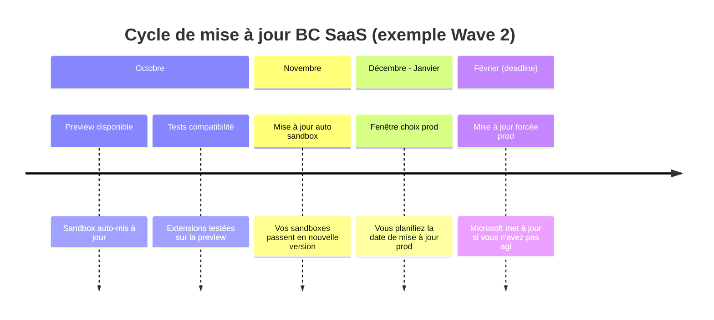
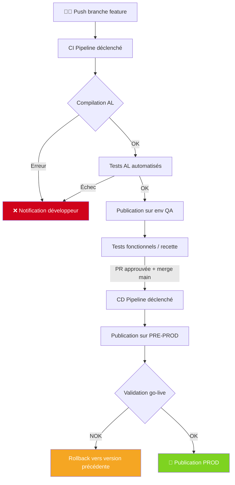

# Multi-environnements et lifecycle ERP

## Objectifs pédagogiques

À l'issue de ce module, vous serez capable de :

1. **Concevoir** une stratégie d'environnements cohérente pour un projet Business Central SaaS ou OnPrem
2. **Gérer** le cycle de vie d'une extension AL à travers ses différentes étapes (développement → test → production)
3. **Automatiser** le déploiement d'extensions via des pipelines CI/CD adaptés à BC
4. **Anticiper** les conflits de version et les ruptures de dépendances entre environnements
5. **Diagnostiquer** les problèmes courants liés aux déploiements multi-environnements

---

## Mise en situation

Vous rejoignez une équipe technique chez un intégrateur BC. Leur client, une ETI industrielle de 300 personnes, tourne sur Business Central SaaS depuis 18 mois. L'extension maison — une gestion de traçabilité lot spécifique à leur métier — a été développée en urgence sur l'environnement de production "pour gagner du temps". Résultat : personne n'ose toucher quoi que ce soit, les mises à jour Microsoft sont bloquées depuis deux cycles, et la moindre modification implique une réunion de crise avec la direction.

C'est le cas d'école parfait. Pas d'environnement de test structuré, pas de pipeline, pas de gestion de version. Et pourtant, la solution n'est pas complexe — elle demande juste d'être pensée dès le départ avec la bonne architecture.

Ce module vous donne les clés pour ne jamais vous retrouver dans cette situation.

---

## Contexte et problématique

Business Central n'est pas un logiciel qu'on installe une fois et qu'on oublie. C'est un système vivant : Microsoft publie deux vagues de mises à jour majeures par an (Wave 1 en avril, Wave 2 en octobre), plus des correctifs mensuels continus. Vos extensions doivent coexister avec ce rythme, sans casser ni bloquer.

La question n'est pas *si* vous allez avoir plusieurs environnements — vous en aurez forcément. La vraie question, c'est comment vous organisez leur relation, qui peut déployer quoi, et dans quel ordre.

### Ce que "lifecycle d'une extension" signifie concrètement

Le cycle de vie d'une extension AL couvre quatre grandes phases :

- **Développement** : écriture du code, compilation, tests unitaires locaux
- **Validation** : tests fonctionnels, recette client, compatibilité avec les dépendances
- **Déploiement** : publication vers les environnements cibles, gestion des upgrades
- **Maintenance** : hotfixes, évolutions, adaptation aux mises à jour Microsoft

Chaque phase a ses propres exigences en termes d'environnements et d'outils. Les confondre — c'est exactement ce qui s'est passé chez le client de la mise en situation.

---

## Architecture des environnements Business Central

### Topologie standard recommandée

La plupart des projets BC sérieux s'appuient sur au moins trois environnements distincts, avec des rôles bien définis.


| Environnement | Type BC | Rôle | Qui y accède |
|---|---|---|---|
| DEV | Sandbox | Développement quotidien, tests rapides | Développeurs uniquement |
| QA / UAT | Sandbox | Tests fonctionnels, recette client | Dev + Consultants + Key users |
| PRE-PROD | Sandbox (ou Production mirror) | Validation finale, tests de charge, compatibilité MS updates | Équipe projet + Direction IT |
| PRODUCTION | Production | Opérations réelles de l'entreprise | Utilisateurs finaux |

💡 **Astuce** — En SaaS BC, un environnement de type "Production" et un "Sandbox" ne sont pas juste des noms. Ils ont des comportements différents : les sandboxes peuvent être restaurés depuis une sauvegarde de production, mais l'inverse n'est pas possible. Le type d'environnement conditionne aussi certaines API et les limites de ressources.

### Cas SaaS vs OnPrem : ce qui change dans la pratique

En **SaaS (Business Central Online)**, les environnements sont gérés depuis le portail admin Microsoft (`businesscentral.dynamics.com/admin`). Vous ne touchez pas à l'infrastructure. En revanche, vous êtes soumis au calendrier de mise à jour Microsoft, et vos extensions doivent passer la validation AppSource ou être signées correctement.

En **OnPrem**, vous gérez l'infrastructure vous-même — ce qui donne plus de contrôle sur le timing des mises à jour, mais alourdit la charge opérationnelle. La gestion des environnements se fait via le BC Administration Shell (PowerShell) ou le BC Admin Center pour les déploiements hybrides.

⚠️ **Erreur fréquente** — Beaucoup d'équipes OnPrem maintiennent un seul serveur avec plusieurs tenants pour "faire des économies". Le problème : une mise à jour du serveur BC impacte tous les tenants simultanément, sans possibilité d'isoler un environnement.

---

## Gestion du cycle de vie dans le portail Admin

### Créer et configurer un environnement

Le portail Admin BC (`https://businesscentral.dynamics.com/<TENANT_ID>/admin`) est votre point de contrôle central pour le SaaS. La création d'un environnement s'y fait en quelques clics, mais les paramètres choisis à cet instant ont des conséquences durables.

**Chemin de création :**
`Admin Center → Environments → New → [Type: Sandbox ou Production] → [Version BC cible] → [Pays/Région]`

Les points critiques à ne pas négliger à la création :

- **La version BC** : vous pouvez créer un sandbox sur une version antérieure pour tester la compatibilité avant une montée de version
- **La région** : détermine le datacenter et impacte la latence et la conformité RGPD
- **Le nom** : une fois créé, un environnement ne peut pas être renommé (au moment de la rédaction)

### Cycle de mise à jour Microsoft

Microsoft impose ses mises à jour, mais vous avez une fenêtre de contrôle. Comprendre ce mécanisme est fondamental pour éviter les mauvaises surprises.



🧠 **Concept clé** — La "Update window" est la plage horaire hebdomadaire pendant laquelle Microsoft peut appliquer les mises à jour sur votre environnement production. Configurez-la sur une période creuse (nuit du dimanche au lundi, par exemple). Chemin : `Admin Center → Environments → [env] → Update Settings`.

---

## Déploiement d'extensions : du local à la production

### Le flux de publication d'une extension

Une extension AL publiée à la main depuis VS Code peut suffire pour du développement, mais en environnement réel, ce n'est jamais acceptable en production. Voici pourquoi — et comment structurer ça correctement.

La publication d'une extension AL passe par ces étapes :

1. **Compilation** : `al.exe` compile les sources AL en un fichier `.app`
2. **Signature** (obligatoire pour SaaS) : le `.app` est signé avec un certificat
3. **Upload** : publication vers l'environnement BC cible via API ou pipeline
4. **Synchronisation du schéma** : BC met à jour la base de données (gestion des migrations)
5. **Upgrade** : exécution des codeunits d'upgrade si la version change

⚠️ **Erreur fréquente** — La synchronisation du schéma et l'upgrade sont deux opérations distinctes. Si vous oubliez de gérer vos codeunits d'upgrade quand vous modifiez une structure de données, vous obtenez une erreur silencieuse en production — les données de l'ancienne structure restent, les nouvelles tables sont vides.

### Publication manuelle vs API vs pipeline

| Mode | Quand l'utiliser | Limite |
|---|---|---|
| VS Code (F5 / Ctrl+F5) | DEV local uniquement | Pas de signature, pas traçable |
| `Publish-NAVApp` (PowerShell) | OnPrem, scripts ponctuels | Manuel, pas scalable |
| API Admin BC | SaaS, automatisation custom | Nécessite gestion de token |
| Pipeline CI/CD (AL-Go, Azure DevOps) | Tout environnement ≥ QA | Meilleure pratique standard |

---

## Construction d'un pipeline CI/CD pour BC

### Pourquoi un pipeline change tout

Un pipeline n'est pas un luxe DevOps — c'est ce qui transforme le déploiement d'une opération stressante en quelque chose de reproductible et documenté. Pour BC en particulier, ça résout un problème concret : garantir que ce qui tourne en production est exactement ce qui a été testé en QA, ni plus ni moins.

### AL-Go for GitHub : le choix de référence

Microsoft maintient **AL-Go for GitHub**, un framework de pipelines préconfiguré pour BC. C'est le point de départ recommandé pour tout projet sérieux.

**Structure d'un repository AL-Go :**

```
monprojet-bc/
├── .github/
│   └── workflows/
│       ├── CI.yml          ← Build + tests à chaque PR
│       ├── CD.yml          ← Déploiement automatique
│       └── PublishToEnv.yml
├── .AL-Go/
│   └── settings.json       ← Config centrale AL-Go
├── app/
│   └── [sources AL]
└── test/
    └── [tests AL]
```

Le fichier `settings.json` est le cerveau de la configuration :

```json
{
  "type": "PTE",
  "country": "FR",
  "artifact": "https://bcartifacts.azureedge.net/onprem/23.0.12034.12841/fr",
  "environments": [
    {
      "name": "QA",
      "environmentName": "mon-env-qa",
      "projects": "*"
    },
    {
      "name": "PROD",
      "environmentName": "mon-env-prod",
      "projects": "*",
      "branch": "main"
    }
  ]
}
```

💡 **Astuce** — Le champ `"type"` distingue `"PTE"` (Per Tenant Extension, pour les développements spécifiques client) et `"AppSource"` (pour les extensions publiées sur le marketplace). Ce choix conditionne les contraintes de validation applicables par le pipeline.

### Flux CI/CD complet



### Gestion des secrets et des credentials

Le pipeline a besoin d'accéder à vos environnements BC. En SaaS, ça passe par un **Service Principal Azure AD** (app registration) avec les permissions API BC.

Configuration côté Azure AD :
`Azure Portal → App Registrations → New Registration → API Permissions → Dynamics 365 Business Central → App.ReadWrite.All`

Configuration côté AL-Go (GitHub Secrets) :

| Secret | Valeur |
|---|---|
| `ADMIN_CENTER_API_CREDENTIALS` | JSON `{"tenantId":"...","clientId":"...","clientSecret":"..."}` |
| `<ENV_NAME>_AUTHCONTEXT` | Credentials spécifiques à l'environnement cible |

⚠️ **Erreur fréquente** — Ne jamais stocker les credentials BC dans le code source ou les fichiers de configuration versionnés. Même dans un repository privé. Un secret dans l'historique Git reste accessible même après suppression du fichier.

---

## Gestion des dépendances entre environnements

### Le problème des dépendances de version

Vos extensions AL ont presque toujours des dépendances : sur les applications Microsoft de base, sur des extensions tierces, ou sur d'autres extensions maison. Ces dépendances sont déclarées dans `app.json` :

```json
{
  "dependencies": [
    {
      "id": "63ca2fa4-4f03-4f2b-a480-172fef340d3f",
      "name": "System Application",
      "publisher": "Microsoft",
      "version": "23.0.0.0"
    }
  ]
}
```

Le piège classique : votre DEV est compilé avec la version 23.x de BC, mais votre PRE-PROD tourne encore en 22.x pour des raisons opérationnelles. La compilation réussit, le déploiement échoue.

🧠 **Concept clé** — BC utilise un système de compatibilité ascendante pour les extensions Microsoft (une extension compilée pour BC 22 tourne sur BC 23). Mais ce n'est pas garanti dans l'autre sens. Et ça ne s'applique pas à vos dépendances tierces, qui doivent être explicitement compatibles avec la version cible.

### Artifacts BC : épingler une version exacte

Pour garantir que tous vos environnements compilent avec la même base, utilisez les **BC artifacts** — des images versionées de BC disponibles publiquement.

```
https://bcartifacts.azureedge.net/sandbox/23.5.16502.17200/fr
```

Format : `[type]/[version complète]/[pays]`

L'outil `BcContainerHelper` (module PowerShell) permet de travailler localement avec ces artifacts :

```powershell
# Créer un container BC local avec une version exacte
New-BcContainer `
  -accept_eula `
  -containerName "bc-dev-23-5" `
  -artifactUrl (Get-BcArtifactUrl -type Sandbox -version "23.5" -country "fr") `
  -auth NavUserPassword `
  -credential (New-Object PSCredential "admin", (ConvertTo-SecureString "P@ssw0rd!" -AsPlainText -Force))
```

💡 **Astuce** — En CI/CD, épinglez toujours la version d'artifact dans `settings.json` au lieu d'utiliser `"latest"`. Ça évite qu'un pipeline qui passait hier échoue aujourd'hui à cause d'une mise à jour BC que vous n'aviez pas anticipée.

---

## Bonnes pratiques

**1. Un environnement = un rôle unique**
Ne réutilisez jamais un environnement QA pour de la recette production urgente "juste cette fois". La contamination des données et la confusion des validations sont garanties.

**2. Versionnez tout, y compris la configuration des environnements**
Les fichiers `settings.json`, les workflows GitHub, les scripts de déploiement — tout doit être dans Git. Un environnement doit pouvoir être reconstruit à partir du repository.

**3. Automatisez la promotion, pas juste la compilation**
Un pipeline qui compile mais déploie à la main n'est qu'à moitié utile. La valeur du CI/CD vient de la promotion automatique entre environnements, conditionnée par des validations.

**4. Testez vos extensions contre la prochaine version BC avant qu'elle arrive**
Microsoft met les previews à disposition 1 à 2 mois avant les Wave. Créez un sandbox sur la preview et lancez-y vos tests de régression. C'est la seule façon de ne pas être pris de court.

**5. Gérez les upgrade codeunits comme du code de production**
Les codeunits 1 (Upgrade) ne sont exécutés qu'une fois, au moment du déploiement. Un bug dans un upgrade ne peut souvent pas être rejoué facilement. Testez-les systématiquement sur une copie de production avant de déployer.

**6. Documentez les dépendances inter-extensions**
Si vous avez plusieurs extensions qui s'appellent entre elles, maintenez un graphe de dépendances à jour. BC gère l'ordre de publication automatiquement, mais pas l'ordre de vos pipelines.

**7. Ne supprimez jamais un environnement de production sans sauvegarde validée**
En SaaS, la suppression d'un environnement Production est irréversible après 30 jours de rétention. Pas de recorbeille, pas de "oups". Validez toujours la restauration d'une sauvegarde avant toute opération destructive.

---

## Cas réel en entreprise

**Contexte :** Un éditeur ISV développe une solution verticale pour le secteur retail (gestion de stocks multi-dépôts), vendue en SaaS à une vingtaine de clients BC. Chaque client a son propre tenant, mais la même extension de base.

**Problème initial :** Les déploiements se faisaient manuellement, client par client, depuis VS Code. Sur 20 clients, une mise à jour prenait une journée entière — et chaque environnement client était légèrement différent (versions décalées, customisations locales).

**Solution mise en place :**

1. Migration vers AL-Go for GitHub avec un repository par "produit"
2. Création d'un environnement QA interne + un environnement staging par client
3. Pipeline CD qui déploie automatiquement sur les environnements staging de chaque client après validation QA
4. Déclenchement du déploiement production sur approbation manuelle (bouton dans GitHub Actions)
5. Versionnage sémantique strict des extensions avec `CHANGELOG.md` par version

**Résultats mesurables :**
- Temps de déploiement : de 8 heures à 45 minutes pour 20 clients
- Taux d'échec de déploiement : réduit de ~30% à <5%
- Détection des incompatibilités BC avant go-live : 100% des cas capturés en staging

---

## Résumé

Gérer plusieurs environnements Business Central, ce n'est pas une contrainte administrative — c'est ce qui rend les déploiements prévisibles et la maintenance soutenable. La règle de base est simple : chaque environnement a un rôle unique, et rien ne passe en production sans avoir transité par au moins un environnement de validation.

Les outils clés sont le portail Admin BC pour la gestion des environnements SaaS, AL-Go for GitHub pour les pipelines CI/CD, et `BcContainerHelper` pour les environnements locaux reproductibles. Le piège le plus fréquent reste la gestion des dépendances de version — épinglez vos artifacts, testez contre les previews Microsoft, et ne présumez jamais qu'une extension qui compile en 23.x tournera sans problème en 22.x.

Le module suivant adressera ce qui arrive inévitablement : les corrections et évolutions post-déploiement, avec les contraintes spécifiques que ça impose en environnement production actif.

---

<!-- snippet
id: bc_env_type_difference
type: concept
tech: business central
level: intermediate
importance: high
format: knowledge
tags: environnement, sandbox, production, saas, admin
title: Différence comportementale Sandbox vs Production en BC SaaS
content: En BC SaaS, Sandbox et Production ne sont pas juste des labels. Un Sandbox peut être restauré depuis une sauvegarde de Production (Admin Center → Restore). L'inverse est impossible. Les Sandboxes ont aussi des limites de ressources API plus basses et certains services (ex: intégrations paiement) peuvent y être désactivés par Microsoft.
description: Le type d'environnement BC conditionne les capacités de restauration, les limites API et certains comportements d'intégration — pas seulement le nom.
-->

<!-- snippet
id: bc_update_window_config
type: tip
tech: business central
level: intermediate
importance: high
format: knowledge
tags: mise à jour, admin center, production, update window, planification
title: Configurer la fenêtre de mise à jour automatique BC
content: Définissez la Update Window sur une plage creuse (ex: dimanche 02h-06h) pour éviter que Microsoft applique ses mises à jour mensuelles en pleine journée de travail. Chemin : Admin Center → Environments → [env prod] → Update Settings → Preferred Update Time. Sans configuration, Microsoft choisit la plage arbitrairement.
description: Sans Update Window configurée, Microsoft peut mettre à jour votre production à n'importe quelle heure dans sa fenêtre de maintenance.
-->

<!-- snippet
id: bc_artifact_pin_version
type: tip
tech: business central
level: advanced
importance: high
format: knowledge
tags: artifact, cicd, version, al-go, pipeline
title: Épingler la version d'artifact BC dans settings.json
content: Dans AL-Go settings.json, utilisez une URL d'artifact complète plutôt que "latest" : "artifact": "https://bcartifacts.azureedge.net/onprem/23.5.16502.17200/fr". Avec "latest", un pipeline qui passait hier peut échouer aujourd'hui si Microsoft publie une nouvelle build BC incompatible avec vos dépendances.
description: Épingler l'artifact garantit la reproductibilité des builds — "latest" introduit un risque de régression silencieuse à chaque nouveau build BC.
-->

<!-- snippet
id: bc_upgrade_codeunit_risk
type: warning
tech: business central
level: advanced
importance: high
format: knowledge
tags: upgrade, codeunit, déploiement, migration, données
title: Upgrade codeunits — exécution unique et irréversible
content: Piège : les upgrade codeunits (type Upgrade) ne s'exécutent qu'une seule fois, au moment du déploiement. Un bug dans la logique de migration laisse les données dans un état corrompu sans possibilité de rejeu simple. Correction : testez systématiquement vos upgrade codeunits sur une copie restaurée de production avant tout déploiement réel.
description: Un upgrade codeunit buggé en production ne peut pas être "rejoué" — les données migrées partiellement nécessitent une intervention manuelle.
-->

<!-- snippet
id: bc_service_principal_setup
type: concept
tech: business central
level: advanced
importance: high
format: knowledge
tags: azure ad, service principal, cicd, api, authentification
title: Service Principal Azure AD pour pipeline BC
content: Un pipeline CI/CD accède à BC SaaS via un Service Principal (App Registration Azure AD) avec la permission "Dynamics 365 Business Central → App.ReadWrite.All". Le Service Principal doit ensuite être ajouté comme "Authorized AAD Apps" dans le tenant BC (Admin Center → Authorized AAD Apps). Sans cette étape côté BC, l'authentification Azure réussit mais l'API BC renvoie 401.
description: L'autorisation du Service Principal doit être faite à deux endroits : Azure AD (permissions) ET Admin Center BC (Authorized AAD Apps) — l'un sans l'autre ne suffit pas.
-->

<!-- snippet
id: bc_secret_in_git_danger
type: warning
tech: business central
level: intermediate
importance: high
format: knowledge
tags: secrets, sécurité, git, credentials, pipeline
title: Credentials BC dans Git — risque même en repo privé
content: Piège : stocker un clientSecret ou token BC dans un fichier de config versionné (settings.json, .env, workflow yml). Même dans un repository privé, le secret reste dans l'historique Git après suppression du fichier. Correction : utiliser exclusivement les GitHub Secrets ou Azure Key Vault, référencés par variable d'environnement dans les workflows.
description: Un secret commité dans Git reste dans l'historique indéfiniment — même après suppression du fichier, il est récupérable via git log ou git show.
-->

<!-- snippet
id: bc_env_promotion_flow
type: concept
tech: business central
level: advanced
importance: medium
format: knowledge
tags: cicd, pipeline, promotion, environnement, al-go
title: Promotion conditionnelle entre environnements en AL-Go
content: AL-Go for GitHub gère la promotion entre environnements via le champ "branch" dans settings.json : un déploiement vers PROD ne se déclenche que sur la branche "main". Les déploiements vers QA peuvent se déclencher sur toute PR. Cette séparation garantit qu'aucun code non mergé ne peut atteindre la production, même manuellement depuis le pipeline.
description: Dans AL-Go, la branche source contrôle l'environnement cible — un déploiement PROD est structurellement impossible depuis une branche feature.
-->

<!-- snippet
id: bc_bccontainerhelper_create
type: command
tech: business central
level: advanced
importance: medium
format: knowledge
tags: bccontainerhelper, powershell, local, docker, artifact
title: Créer un container BC local avec version exacte via BcContainerHelper
command: New-BcContainer -accept_eula -containerName "<NOM>" -artifactUrl (Get-BcArtifactUrl -type Sandbox -version "<VERSION>" -country "<PAYS>") -auth NavUserPassword -credential $cred
example: New-BcContainer -accept_eula -containerName "bc-dev-23-5" -artifactUrl (Get-BcArtifactUrl -type Sandbox -version "23.5" -country "fr") -auth NavUserPassword -credential (New-Object PSCredential "admin", (ConvertTo-SecureString "P@ssw0rd!" -AsPlainText -Force))
description: Crée un environnement BC local Docker avec une version précise — base pour des environnements de développement reproductibles sans dépendre d'un tenant SaaS.
-->

<!-- snippet
id: bc_dependency_version_mismatch
type: error
tech: business central
level: advanced
importance: high
format: knowledge
tags: dépendances, version, compilation, déploiement, app.json
title: Extension compilée sur BC 23 déployée sur BC 22 — échec silencieux
content: Symptôme : compilation réussie en local ou CI, déploiement refusé sur l'environnement cible avec erreur de dépendance. Cause : app.json déclare une dépendance avec version minimale 23.x, mais l'environnement cible tourne en 22.x. Correction : vérifier la version exacte de l'environnement cible (Admin Center → Environments → Version), aligner l'artifact de compilation, et mettre à jour les versions minimales de dépendances dans app.json.
description: BC refuse de publier une extension si une dépendance déclarée exige une version BC supérieure à celle de l'environnement cible.
-->

<!-- snippet
id: bc_preview_testing_wave
type: tip
tech: business central
level: advanced
importance: medium
format: knowledge
tags: preview, wave, compatibilité, mise à jour, sandbox
title: Tester ses extensions sur la preview BC avant chaque Wave
content: Microsoft publie les previews des Wave 1 (avril) et Wave 2 (octobre) environ 6 semaines avant la mise à jour automatique des sandboxes. Créez un sandbox dédié sur la version preview (Admin Center → New → Version → [preview disponible]) et lancez-y votre pipeline de tests de régression. C'est la seule façon de détecter les breaking changes avant qu'ils arrivent en production.
description: Les previews BC sont disponibles 6 semaines avant les Waves — délai suffisant pour corriger des incompatibilités si vous testez dès le début de la fenêtre.
-->
