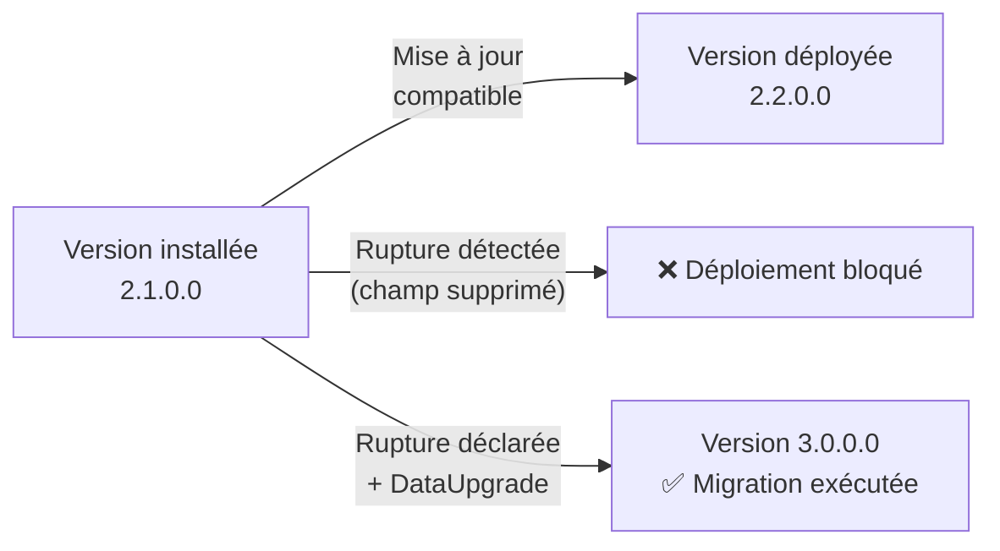
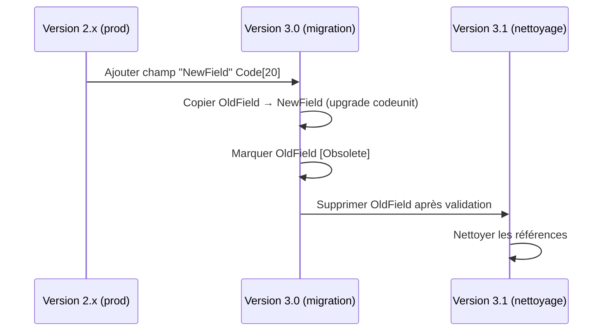

# Maintenance corrective et évolutive des extensions AL

## Objectifs pédagogiques

- Distinguer une correction urgente d'une évolution planifiée et appliquer la stratégie de livraison adaptée à l'aide d'une matrice de décision explicite
- Appliquer les règles de versioning AL pour garantir la compatibilité lors des mises à jour
- Concevoir et exécuter des migrations de données intégrées à l'extension sans perte ni régression, y compris les changements de type en deux phases
- Diagnostiquer et corriger les régressions introduites par une mise à jour d'une dépendance ou de BC lui-même, avec un pipeline CI contre les previews
- Structurer un processus de maintenance durable sur un parc multi-tenants ou multi-extensions

---

## Mise en situation

Une ETI française utilise Business Central SaaS depuis deux ans. Votre équipe maintient trois extensions : une extension de gestion des commandes spécifiques clients, un connecteur vers un ERP logistique tiers, et un module de reporting sur mesure. Total : environ 12 000 lignes AL, sept tables custom, une vingtaine de pages modifiées.

Trois événements arrivent en même temps ce lundi matin :

1. Microsoft a publié la mise à jour mensuelle de BC. Deux interfaces que vous utilisez ont été modifiées.
2. Un utilisateur signale que les numéros de série ne s'incrémentent plus correctement depuis vendredi — probablement un bug introduit lors du déploiement de la semaine dernière.
3. Le client veut une nouvelle fonctionnalité : envoyer automatiquement un PDF de confirmation par e-mail à la validation d'une commande.

Trois problèmes, trois niveaux d'urgence, trois stratégies différentes. Si vous traitez tout de la même façon, vous allez soit bloquer la production en déployant précipitamment la nouvelle feature, soit ralentir le correctif critique en attendant une validation complète. La maintenance AL demande exactement cette capacité : distinguer, prioriser, et livrer sans casser ce qui marche.

---

## Contexte et problématique

Une extension AL n'est pas un fichier qu'on modifie et qu'on pousse. C'est un artefact versionné, déployé dans un ou plusieurs tenants, potentiellement publié sur AppSource, qui coexiste avec d'autres extensions et avec Business Central lui-même. La moindre erreur de compatibilité peut bloquer l'installation ou — pire — corrompre silencieusement des données.

La maintenance recouvre deux réalités très différentes :

**La maintenance corrective** : quelque chose ne fonctionne plus comme prévu. La cause peut être un bug dans votre code, un changement de comportement dans BC, ou une interaction non anticipée avec une autre extension. L'enjeu : corriger vite sans introduire de nouvelle régression.

**La maintenance évolutive** : on ajoute ou on modifie une fonctionnalité. L'enjeu ici n'est pas la rapidité, c'est la non-régression et la compatibilité ascendante. Une évolution mal planifiée peut exiger une migration de données, un changement de schéma de table, ou une rupture de dépendance.

Les deux partagent une contrainte commune : le versioning AL est strict, et BC ne vous laisse pas "juste remplacer" une extension comme on écraserait un fichier. Toute mise à jour doit être compatible avec la version précédemment installée — ou déclarer explicitement une rupture, avec ce que ça implique.

---

## Versioning AL : ce qui pilote tout

Avant même de parler de correction ou d'évolution, il faut comprendre comment BC décide si une mise à jour est acceptable.

Chaque extension possède un numéro de version dans son `app.json`, sous la forme `major.minor.build.revision`. BC l'utilise pour autoriser ou bloquer l'installation.

```json
{
  "id": "a1b2c3d4-...",
  "name": "MonExtension",
  "publisher": "MonEditeur",
  "version": "2.3.1.0"
}
```

🧠 **Concept clé — Compatibilité ascendante** : BC autorise le passage d'une version inférieure à une version supérieure si les objets existants n'ont pas été supprimés ou renommés. Supprimer un champ de table, renommer une procédure publique, changer le type d'un champ : tout cela crée une rupture de compatibilité. BC le détectera à l'installation et refusera le déploiement.

La règle pratique : incrémenter `major` signale une rupture potentielle, et vous oblige à fournir une migration explicite si des données sont concernées. `minor` et `build` sont pour les évolutions et corrections compatibles.



---

## Décider avant d'agir : la matrice urgence / planification

Avant d'écrire la moindre ligne, la première question n'est pas technique : c'est "dans quelle case est ce problème ?" Appliquer la même procédure à un bug bloquant et à une demande d'évolution est l'erreur la plus fréquente des équipes qui débutent en maintenance ERP.

Voici la matrice de décision à utiliser systématiquement :

| | **Impact élevé** (utilisateurs bloqués, données incorrectes) | **Impact faible** (gêne, ergonomie, manque) |
|---|---|---|
| **Urgence élevée** (signalé aujourd'hui, production affectée) | 🔴 **Hotfix immédiat** — branche hotfix depuis tag prod, déploiement dès validation sandbox | 🟠 **Correctif rapide** — fix en sprint courant, pas de procédure hotfix complète |
| **Urgence faible** (découvert en test, signalé par un seul utilisateur) | 🟡 **Correctif planifié** — intégré à la prochaine release, avec tests de non-régression | 🟢 **Backlog évolution** — estimé, priorisé, traité dans un sprint futur |

**Application au lundi matin de la mise en situation :**

- Numéros de série incorrects depuis vendredi → impact élevé, signalé aujourd'hui → **🔴 Hotfix immédiat**
- Interfaces BC modifiées → impact potentiellement élevé, mais BC SaaS donne généralement quelques jours avant blocage → **🟠 Correctif rapide**, vérifier d'abord si ça bloque réellement la prod
- Envoi PDF par e-mail → nouvelle feature, zéro urgence → **🟢 Backlog évolution**, estimée et planifiée

**En contexte ISV multi-tenants**, la matrice doit tenir compte d'une dimension supplémentaire : combien de tenants sont impactés ? Un bug qui bloque un seul client sur vingt n'a pas le même traitement qu'un bug qui touche tout le parc. La règle pratique : si plus de 20 % des tenants sont affectés et que le bug bloque un flux métier critique, le hotfix est automatiquement prioritaire sur tout.

---

## Gestion des corrections urgentes (hotfix)

### Identifier et isoler le problème

Avant d'écrire la moindre ligne de code, la première étape est de reproduire le bug dans un sandbox — pas directement en production. C'est évident en théorie, rarement respecté sous pression. Pourtant, un fix déployé sans test préalable en prod est statistiquement la première cause de double-incident.

La démarche :

1. Identifier la version exacte déployée en production (`Extensions → Installed Extensions → version`)
2. Dupliquer l'environnement production (ou utiliser un sandbox calibré sur la même version BC)
3. Reproduire le bug
4. Corriger, tester, valider

### Le problème du cherry-pick

Si votre main branch contient déjà des développements en cours pour la prochaine feature, vous ne pouvez pas déployer main. Vous avez besoin d'une branche dédiée au hotfix, créée depuis le tag de la version actuellement en production.

```bash
# Créer une branche hotfix depuis le tag de la version en prod
git checkout -b hotfix/2.3.1 v2.3.0

# Corriger le bug, committer
git commit -m "fix: correction incrémentation numéro de série (#412)"

# Merger dans main ET dans la branche de feature en cours
git checkout main && git merge hotfix/2.3.1
git checkout feature/email-confirmation && git cherry-pick <commit-sha>
```

Le merge dans main est important : si vous corrigez uniquement sur la branche hotfix, le bug reviendra à la prochaine release majeure.

### Versioning du hotfix

Un hotfix incrémente `build` ou `revision`. Ne jamais incrémenter `major` pour un correctif — vous déclencheriez le processus de migration pour rien.

```json
// Avant
"version": "2.3.0.0"

// Après hotfix
"version": "2.3.1.0"
```

⚠️ **Erreur fréquente** : modifier une table dans un hotfix. Même pour "juste ajouter un champ", cela implique un changement de schéma qui peut bloquer des tenants qui n'ont pas encore reçu la mise à jour. Règle stricte : un hotfix ne touche pas au schéma de données.

---

## Maintenance évolutive : planifier pour ne pas casser

### Compatibilité des modifications d'objets

Toutes les modifications ne se valent pas. Voici ce qui est safe et ce qui ne l'est pas :

| Modification | Compatibilité | Remarque |
|---|---|---|
| Ajouter un champ à une table | ✅ Safe | N'affecte pas les données existantes |
| Modifier le type d'un champ | ❌ Rupture | Nécessite migration explicite |
| Supprimer un champ | ❌ Rupture | BC bloque si des données sont présentes |
| Renommer un champ | ❌ Rupture | Équivalent à supprimer + recréer |
| Ajouter une page/codeunit | ✅ Safe | Nouvel objet, pas d'impact |
| Modifier une signature de procédure publique | ❌ Rupture | Extensions dépendantes cassées |
| Ajouter un paramètre optionnel | ✅ Généralement safe | Tester avec les appelants |
| Supprimer une permission set | ❌ Rupture | Utilisateurs potentiellement bloqués |

La question à se poser avant chaque modification : *est-ce qu'une extension ou un tenant qui utilise la version précédente continuera de fonctionner sans modification de sa part ?* Si non, c'est une rupture.

### Dépréciation progressive

Pour les changements inévitables qui cassent la compatibilité, la dépréciation progressive permet de migrer sans couper brutalement. L'idée : marquer l'ancienne procédure comme obsolète dans une version intermédiaire, supprimer dans la suivante.

```al
// Version 2.x — Procédure marquée obsolète
[Obsolete('Utiliser CreateOrderWithEmail à la place', '3.0')]
procedure CreateOrder(CustomerNo: Code[20])
begin
    // ancienne implémentation
end;

// Nouvelle procédure avec signature enrichie
procedure CreateOrderWithEmail(CustomerNo: Code[20]; SendEmail: Boolean)
begin
    // nouvelle implémentation
end;
```

Le compilateur AL générera des warnings pour tout appelant de la procédure obsolète, sans bloquer la compilation. Les appelants ont une fenêtre de transition.

💡 **En SaaS multi-tenant**, si vous êtes éditeur ISV, la dépréciation progressive est quasi-obligatoire. Vous ne maîtrisez pas le calendrier de mise à jour de vos clients. Supprimer directement une interface publique peut bloquer des dizaines de tenants simultanément.

---

## Migrations de données : le vrai risque de l'évolution

Ajouter ou modifier des champs implique souvent d'initialiser ou convertir des données existantes. BC fournit pour cela le mécanisme `OnUpgradePerDatabase` et `OnUpgradePerCompany` via des codeunits de type `Upgrade`.

### Structure d'un codeunit d'upgrade

```al
codeunit 50200 "Mon Extension Upgrade"
{
    Subtype = Upgrade;

    trigger OnUpgradePerCompany()
    var
        MyRecord: Record "Ma Table Custom";
        UpgradeTag: Codeunit "Upgrade Tag";
    begin
        // Vérifier si cet upgrade a déjà été exécuté
        if UpgradeTag.HasUpgradeTag(GetInitEmailUpgradeTag()) then
            exit;

        // Initialiser le nouveau champ pour les enregistrements existants
        if MyRecord.FindSet(true) then
            repeat
                MyRecord."Send Confirmation Email" := true; // valeur par défaut métier
                MyRecord.Modify(false);
            until MyRecord.Next() = 0;

        // Marquer l'upgrade comme exécuté
        UpgradeTag.SetUpgradeTag(GetInitEmailUpgradeTag());
    end;

    local procedure GetInitEmailUpgradeTag(): Code[250]
    begin
        exit('MON-EXTENSION-INIT-EMAIL-20240115');
    end;
}
```

🧠 **Concept clé — UpgradeTag** : le mécanisme `UpgradeTag` garantit l'idempotence de la migration. BC peut appeler les triggers d'upgrade plusieurs fois dans certains scénarios (déploiement multi-tenants, retry). Sans cette vérification, vous risquez d'écraser des données modifiées depuis l'upgrade initial.

### Migration en deux phases pour les ruptures de type

Quand vous devez changer le type d'un champ (par exemple passer d'un `Code[10]` à un `Code[20]`), BC ne permet pas la modification directe. La stratégie est la suivante :



Cette approche en deux phases évite la perte de données et permet un rollback propre si la migration échoue à mi-chemin.

**Ce que ça donne concrètement en AL** — voici la codeunit d'upgrade pour la phase 1 du passage `Code[10]` → `Code[20]` sur le champ `Reference No.` d'une table de commandes custom :

```al
codeunit 50201 "Upgrade ReferenceNo Code20"
{
    Subtype = Upgrade;

    trigger OnUpgradePerCompany()
    var
        OrderLine: Record "Custom Order Line";
        UpgradeTag: Codeunit "Upgrade Tag";
    begin
        if UpgradeTag.HasUpgradeTag(GetReferenceNoMigrationTag()) then
            exit;

        // Phase 1 : copier Code[10] → Code[20]
        // Avant : "Reference No." Code[10] (OldField, marqué Obsolete dans cette version)
        // Après : "Reference No. v2" Code[20] (NewField, nouvelle référence dans tout le code)
        if OrderLine.FindSet(true) then
            repeat
                // Le nouveau champ accepte les valeurs tronquées de l'ancien sans perte
                // car Code[10] ⊂ Code[20] — copie directe safe
                OrderLine."Reference No. v2" := OrderLine."Reference No.";
                OrderLine.Modify(false);
            until OrderLine.Next() = 0;

        UpgradeTag.SetUpgradeTag(GetReferenceNoMigrationTag());
    end;

    local procedure GetReferenceNoMigrationTag(): Code[250]
    begin
        exit('CUSTOM-ORDER-REFERENCENO-CODE20-20240201');
    end;
}
```

En phase 2 (release suivante), `"Reference No."` est supprimé et toutes les références au champ Obsolete sont nettoyées. Les données sont dans `"Reference No. v2"` depuis la phase 1 — aucune perte.

---

## Réagir à une mise à jour de BC

C'est le scénario le plus délicat en maintenance : Microsoft met à jour BC, et quelque chose dans votre extension se casse — sans que vous ayez touché une seule ligne de code.

### Types de changements BC impactants

**Breaking changes annoncés** : Microsoft publie les [Removed and deprecated features](https://learn.microsoft.com/en-us/dynamics365/business-central/dev-itpro/upgrade/deprecated-features-w1) à chaque release. Les marquer dans votre backlog de maintenance dès leur annonce, pas le jour où BC vous bloque.

**Changements de comportement** : une procédure existe toujours mais se comporte différemment. Par exemple, un champ qui acceptait une chaîne vide et qui maintenant lève une erreur de validation. Ces changements sont plus difficiles à détecter car le compilateur ne signale rien — seuls les tests le révèlent.

**Changements d'interface** : BC réorganise parfois ses interfaces publiques entre releases. Les `interface` AL que vous implémentez peuvent voir de nouvelles méthodes obligatoires apparaître.

### Pipeline CI contre les previews BC : exemple concret

La vraie protection contre les régressions BC-induced, c'est d'avoir un pipeline CI qui teste vos extensions contre la prochaine version de BC avant qu'elle n'arrive en production. Microsoft propose des artefacts de preview via `bccontainerhelper` dès 4 à 6 semaines avant le déploiement production.

Voici un exemple complet intégrant la récupération du preview, la compilation de l'extension et l'exécution des tests AL — pensé pour GitHub Actions mais adaptable à Azure Pipelines :

```yaml
# .github/workflows/bc-preview-test.yml
name: BC Preview Compatibility Check

on:
  schedule:
    # Déclenché chaque lundi matin — vérifie les nouveaux artefacts preview
    - cron: '0 6 * * 1'
  workflow_dispatch:

jobs:
  test-against-preview:
    runs-on: windows-latest
    steps:
      - uses: actions/checkout@v4

      - name: Install BcContainerHelper
        shell: powershell
        run: |
          Install-Module BcContainerHelper -Force -AllowClobber

      - name: Resolve latest BC preview artifact
        id: artifact
        shell: powershell
        run: |
          $artifactUrl = Get-BCArtifactUrl `
            -type Sandbox `
            -country fr `
            -version "26.0" `
            -select Latest
          Write-Output "url=$artifactUrl" >> $env:GITHUB_OUTPUT
          Write-Host "Artifact preview sélectionné : $artifactUrl"

      - name: Create BC preview container
        shell: powershell
        run: |
          $credential = New-Object PSCredential("admin", `
            (ConvertTo-SecureString "Password123!" -AsPlainText -Force))
          New-BcContainer `
            -accept_eula `
            -artifactUrl "${{ steps.artifact.outputs.url }}" `
            -containerName "bc-preview-test" `
            -auth NavUserPassword `
            -credential $credential `
            -includeTestToolkit `
            -includeTestLibrariesOnly

      - name: Compile extension against preview
        shell: powershell
        run: |
          Compile-AppInBcContainer `
            -containerName "bc-preview-test" `
            -appProjectFolder "$env:GITHUB_WORKSPACE" `
            -appOutputFolder "$env:GITHUB_WORKSPACE\output" `
            -credential $credential

      - name: Run AL test codeunits
        shell: powershell
        run: |
          $result = Run-TestsInBcContainer `
            -containerName "bc-preview-test" `
            -credential $credential `
            -extensionId (Get-Content "$env:GITHUB_WORKSPACE\app.json" | ConvertFrom-Json).id `
            -detailed
          if ($result.Failed -gt 0) {
            Write-Error "$($result.Failed) test(s) échoué(s) contre le preview BC"
            exit 1
          }
          Write-Host "✅ $($result.Passed) test(s) passés — extension compatible avec le preview"

      - name: Cleanup container
        if: always()
        shell: powershell
        run: Remove-BcContainer -containerName "bc-preview-test"
```

💡 Le workflow tourne automatiquement chaque lundi. Dès que Microsoft publie un nouvel artefact preview, votre pipeline le détecte et vous donne 4 à 6 semaines pour corriger les incompatibilités avant qu'elles n'arrivent en production.

---

## Construction progressive : de l'extension fragile à l'extension maintenable

Il n'existe pas de rupture franche entre les trois stades — c'est une progression continue. Mais il y a des signaux clairs qui indiquent qu'il est temps de passer à l'étape suivante.

### V1 — Extension fonctionnelle mais fragile

L'état classique d'une extension développée sous pression. Signaux caractéristiques :

- Pas de codeunit d'upgrade → les migrations de données se font manuellement ou pas du tout
- Dépendances implicites sur des comportements non documentés de BC
- Pas de tests AL → les régressions sont découvertes en prod
- Versioning approximatif → impossible de savoir quelle version tourne où

**Quand passer à V2 ?** Dès que l'un de ces événements se produit : premier incident en production causé par une mise à jour BC non anticipée, premier hotfix déployé sans branche dédiée, premier client qui demande "quelle version tourne chez moi ?". Ce ne sont pas des seuils arbitraires — ce sont des coûts réels qui signalent que l'absence de structure commence à vous coûter plus cher que sa mise en place.

### V2 — Extension avec filets de sécurité

Les ajouts qui changent la donne :

```al
// Tests AL systématiques pour les fonctions critiques
codeunit 50300 "Test Numéro Série"
{
    Subtype = Test;

    [Test]
    procedure TestIncrementationNumerique()
    var
        NoSeries: Codeunit "No. Series";
        NextNo: Code[20];
    begin
        // Arrange
        CreateTestNoSeries('TEST', '00001', '99999');

        // Act
        NextNo := NoSeries.GetNextNo('TEST', Today(), true);

        // Assert
        Assert.AreEqual('00001', NextNo, 'Premier numéro incorrect');
    end;
}
```

Et côté versioning, un `CHANGELOG.md` maintenu rigoureusement :

```markdown
## [2.4.0] - 2024-01-15
### Ajouté
- Envoi automatique d'e-mail à la validation de commande (#89)
### Corrigé
- Incrémentation numéro de série sur commandes multi-lignes (#412)

## [2.3.1] - 2024-01-08
### Corrigé
- Hotfix : correction du calcul de remise sur avoirs (#408)
```

**Quand passer à V3 ?** Dès que vous gérez plus de trois tenants simultanément, ou que vous commencez à avoir des demandes d'évolution concurrentes (feature A en dev, correctif B en prod, mise à jour BC annoncée). La V2 suffit pour un projet monoclient stable — elle devient insuffisante dès que la complexité organisationnelle dépasse la complexité technique.

### V3 — Extension production-grade

Ce qui distingue une extension maintenue sérieusement en production :

- **Feature flags** : les nouvelles fonctionnalités peuvent être désactivées sans redéploiement si elles posent problème
- **UpgradeTag systématique** sur toutes les migrations
- **Dépréciation explicite** plutôt que suppression immédiate
- **Tests couvrant les scénarios d'upgrade** : tester que la migration V2→V3 produit le résultat attendu sur des données synthétiques représentatives
- **Pipeline CI contre les previews BC** : les incompatibilités sont détectées 4 semaines avant, pas le jour J
- **Inventaire tenants/versions** tenu à jour : savoir en 30 secondes quelle version tourne chez quel client

---

## Gestion multi-tenants : l'impact d'un hotfix sur un parc

En contexte ISV ou intégrateur multi-clients, un hotfix n'est jamais une opération isolée. Voici la réalité : vous avez potentiellement vingt tenants sur des versions différentes de votre extension, avec des calendriers de mise à jour que vous ne contrôlez pas tous.

**Cartographie type d'un parc multi-tenants :**

| Client | Version extension | Version BC | Statut hotfix |
|---|---|---|---|
| Client A | 2.3.0 | BC 25 | 🔴 Impacté — hotfix prioritaire |
| Client B | 2.3.1 | BC 25 | ✅ Déjà corrigé |
| Client C | 2.2.0 | BC 24 | 🟡 Version ancienne — backport nécessaire ? |
| Client D | 2.4.0 | BC 25 | ✅ Version future — patch inclus |
| Client E | 2.3.0 | BC 26 preview | 🟠 Version preview — surveiller la compatibilité |

**Questions à trancher systématiquement pour chaque hotfix :**

1. **Quels tenants sont sur la version affectée ?** — La réponse détermine l'urgence réelle.
2. **Le correctif est-il rétro-compatible avec les versions BC antérieures ?** — Si Client C est sur BC 24 et que le fix utilise une API BC 25, il faut un backport ou une version conditionnelle.
3. **Comment notifier les clients affectés ?** — En SaaS, BC se met à jour automatiquement, mais votre extension ne s'installe pas seule. Prévoir une communication proactive.
4. **Le déploiement doit-il être coordonné ?** — Si le hotfix corrige une incohérence de données, certains clients pourraient avoir besoin d'une correction manuelle des données existantes avant ou après le déploiement.

La règle de base : tenir le tableau des tenants/versions à jour en temps réel (un simple Notion ou Confluence suffit, tant que c'est fait). Sans ça, évaluer l'impact d'un hotfix devient une opération de détective.

---

## Cas réel en entreprise

**Contexte** : un intégrateur maintient une extension de gestion des temps de production pour une PME industrielle. L'extension stocke les temps dans une table custom liée aux ordres de fabrication BC. BC 23 → BC 24 : Microsoft modifie la table `Production Order` et deux champs utilisés en FlowField dans l'extension changent de clé de calcul.

**Symptôme découvert** : deux jours après la mise à jour automatique du tenant SaaS, le reporting des temps affiche des totaux incohérents. Pas d'erreur explicite, juste des chiffres faux.

**Diagnostic complet :**
1. Comparaison du comportement entre BC 23 (sandbox figé) et BC 24 (prod) : les FlowFields retournent des valeurs différentes pour les mêmes ordres
2. Consultation du changelog BC 24 : modification du scope de calcul des FlowFields `Remaining Qty.` sur les production orders
3. Évaluation de l'impact : toutes les données affichées depuis 48h sont potentiellement incorrectes — les données en base sont intactes, seul le calcul à la volée est faux
4. Application de la matrice : impact élevé (reporting financier faux), urgence élevée → **🔴 Hotfix immédiat**

**Procédure de réponse :**
- Gel immédiat des exports de reporting côté utilisateur (communication client)
- Création branche hotfix depuis le tag de la version BC 23 encore disponible en sandbox
- Remplacement des FlowFields BC par un calcul explicite dans un codeunit custom (moins dépendant des internals BC)
- Ajout d'un test AL qui vérifie le résultat du calcul sur des données fixture
- Déploiement en sandbox BC 24 → validation → déploiement prod en moins de 48h
- Ajout de ce test dans le pipeline CI contre les previews BC 25

**Résultat** : correctif déployé en 48h, tests en place pour les releases suivantes. Le prochain changement similaire dans BC 25 a été détecté trois semaines avant la mise en production — et corrigé sans incident utilisateur.

**Ce qui aurait permis de l'éviter** : le pipeline CI contre les previews BC. L'artefact BC 24 était disponible six semaines avant le déploiement. Ce type de régression FlowField — modification de clé de calcul — aurait échoué dans les tests AL dès la première exécution du pipeline.

---

## Bonnes pratiques

**1. Ne jamais corriger directement en prod,
