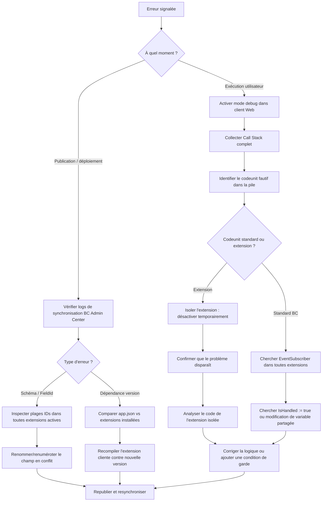

# Conflits entre extensions et compatibilité AL

## Objectifs pédagogiques

- Identifier les quatre familles de conflits entre extensions AL et comprendre leur mécanisme de déclenchement
- Lire et interpréter les erreurs de publication et d'exécution liées à des incompatibilités entre extensions
- Analyser une situation de conflit sur un tenant multi-extension et proposer une stratégie de résolution adaptée à chaque famille
- Utiliser les outils de diagnostic BC (mode debug, Application Insights, AL Profiler) pour localiser la source d'un conflit
- Décider quand résoudre un conflit, quand accepter l'incompatibilité, et comment anticiper les conflits avant le déploiement

---

## Mise en situation

Une PME industrielle utilise Business Central SaaS avec trois extensions actives : une extension maison qui étend la table **Item** pour gérer des références internes, une solution ISV de gestion de qualité achetée sur AppSource, et une extension de facturation électronique développée par l'intégrateur. Tout fonctionne correctement depuis six mois.

L'éditeur ISV publie une mise à jour majeure de sa solution qualité. L'intégrateur la déploie en production un vendredi après-midi. Le lundi matin, les utilisateurs ne peuvent plus valider de commandes de vente : une erreur cryptique apparaît, sans message explicite. En parallèle, l'extension maison semble avoir perdu certains champs sur la fiche article.

Deux extensions touchent aux mêmes zones fonctionnelles, avec des dépendances implicites sur des événements et des champs étendus. Personne n'a vérifié la compatibilité avant le déploiement. La situation est classique — et entièrement évitable.

C'est exactement ce que ce module cherche à démystifier.

---

## Pourquoi les conflits entre extensions sont un problème spécifique à BC

Dans un environnement traditionnel (C/AL, NAV), les modifications étaient directement dans la base de code. Les conflits étaient visibles à la compilation. Avec le modèle d'extension AL, chaque ISV ou intégrateur travaille de son côté, sur des objets qu'il ne contrôle pas entièrement. La plateforme assemble tout au runtime — et c'est là que les surprises arrivent.

Le modèle d'extension est conçu pour l'isolation, mais cette isolation est partielle. Plusieurs extensions peuvent étendre le même objet de base, s'abonner au même événement publisher, ou modifier la même logique métier depuis des angles différents. Aucune de ces situations n'est bloquée par défaut. BC laisse coexister des extensions qui se marchent dessus — jusqu'au moment où elles s'exécutent ensemble.

🧠 **Concept clé** — Le moteur d'extension BC applique les modifications dans un ordre déterministe basé sur les dépendances déclarées et l'ordre de publication, mais cet ordre n'est pas toujours celui que le développeur imagine. Une extension qui "fonctionne seule" peut totalement changer de comportement quand une autre est active.

Il y a deux moments bien distincts où un conflit peut éclater : **au déploiement** (synchronisation de schéma, publication) et **à l'exécution** (runtime, sessions utilisateur). Ces deux cas ne se diagnostiquent pas de la même façon et ne se résolvent pas avec les mêmes outils.

---

## Les quatre grandes familles de conflits

Avant de savoir comment diagnostiquer, il faut savoir *quoi* chercher. Le tableau ci-dessous est le premier outil à garder en tête face à un incident.

| Famille | Signature d'erreur BC | Moment de détection | Outil diagnostic principal | Temps résolution estimé | Impact si ignoré |
|---|---|---|---|---|---|
| **Schéma** (FieldId) | `The field with ID 'X' already exists in table 'Y'` | Publication / synchronisation | AL Object Explorer, requête sur table `Field` | 1–4h | Bloquant — la synchronisation échoue |
| **Événements partagés** | Aucune erreur, comportement incorrect | Exécution utilisateur | Application Insights KQL, AL Profiler | 4–16h | Silencieux — correction et validation nécessitent des tests fonctionnels |
| **Interface utilisateur** | Actions dupliquées, mise en page cassée | Exécution / recette | Client BC Web en mode debug | 2–8h | Dégradation UX, parfois blocage |
| **Dépendances transitives** | `Extension X version A.B required but C.D installed` | Publication ou runtime | Comparer `app.json` et extensions installées | 4–24h | Bloquant ou silencieux selon le changement |

### 1. Conflits de schéma (au niveau table)

Deux extensions tentent d'ajouter un champ avec le même ID de champ dans la même table. C'est le conflit le plus visible — il bloque la synchronisation au déploiement.

```al
// Extension A — FieldId 50100 dans tableextension sur Item
tableextension 50100 "Item Ext A" extends Item
{
    fields
    {
        field(50100; "Internal Ref"; Code[20]) { DataClassification = CustomerContent; }
    }
}

// Extension B — même FieldId 50100 dans la même table
tableextension 50200 "Item Ext B" extends Item
{
    fields
    {
        field(50100; "Quality Code"; Code[10]) { DataClassification = CustomerContent; } // CONFLIT
    }
}
```

BC refuse de synchroniser le schéma si deux extensions revendiquent le même `FieldId` sur la même table. L'erreur apparaît à la publication ou à la synchronisation, jamais silencieusement.

⚠️ **Erreur fréquente** — Certains développeurs pensent que les plages d'IDs sont réservées par application et donc protégées automatiquement. Ce n'est pas le cas en SaaS : si deux éditeurs choisissent la même plage (50000–99999 est vaste mais non partitionnée par défaut), le conflit arrive. Sur AppSource, Microsoft impose des plages d'IDs certifiées pour éviter exactement ça.

### 2. Conflits de logique sur événements partagés

C'est le plus pernicieux. Deux extensions s'abonnent au même événement et modifient la même donnée de façon contradictoire — sans qu'aucune erreur ne soit levée.

```al
// Extension A — abonné à OnBeforePostSalesDoc, contrôle le statut qualité
[EventSubscriber(ObjectType::Codeunit, Codeunit::"Sales-Post", 'OnBeforePostSalesDoc', '', false, false)]
local procedure CheckQualityStatus(var SalesHeader: Record "Sales Header"; var IsHandled: Boolean)
begin
    if SalesHeader."Quality Status" <> SalesHeader."Quality Status"::Approved then
        Error('Commande non approuvée qualité.');
end;

// Extension B — abonné au même événement, court-circuite tous les autres abonnés
[EventSubscriber(ObjectType::Codeunit, Codeunit::"Sales-Post", 'OnBeforePostSalesDoc', '', false, false)]
local procedure ForcePostingAllowed(var SalesHeader: Record "Sales Header"; var IsHandled: Boolean)
begin
    IsHandled := true;  // Neutralise silencieusement tous les autres abonnés
end;
```

L'Extension B, en positionnant `IsHandled := true`, neutralise silencieusement le contrôle qualité de l'Extension A. Aucune erreur n'est levée. La commande passe. Le problème n'est visible que côté métier — et seulement si quelqu'un fait le lien.

### 3. Conflits d'interface utilisateur

Deux pageextensions modifient la même zone d'une page — même action, même groupe de champs, même position. BC peut accepter les deux à la publication mais le résultat visuel est imprévisible.

```al
// Extension A
pageextension 50100 "Sales Order Ext A" extends "Sales Order"
{
    actions
    {
        addafter(Post)
        {
            action("Quality Check") { ... }
        }
    }
}

// Extension B
pageextension 50200 "Sales Order Ext B" extends "Sales Order"
{
    actions
    {
        addafter(Post)
        {
            action("Quality Check") { ... }  // même nom, même position
        }
    }
}
```

Dans ce cas, BC peut publier les deux, mais l'action apparaît deux fois dans l'interface — ou l'une écrase l'autre selon l'ordre de chargement. Ce conflit se détecte à la recette visuelle, pas à la compilation.

### 4. Conflits de dépendances transitives

Une extension dépend d'une autre. La version déployée ne correspond pas à la version attendue. C'est typiquement ce qui arrive lors d'une mise à jour ISV partielle.

```json
// app.json de l'extension intégrateur — compilée contre la v2.0
"dependencies": [
    {
        "id": "...",
        "name": "Quality Management",
        "publisher": "ISV Corp",
        "version": "2.0.0.0"
    }
]
```

Si l'ISV publie une v3.0 en changeant des interfaces (renommage de codeunit, suppression d'événements publics), l'extension intégrateur compilée contre la v2.0 échoue au runtime. La compilation isolée ne détecte rien — le problème n'apparaît qu'au moment où les deux extensions s'exécutent ensemble sur le même tenant.

---

## Lire les erreurs : ce que BC vous dit (et ce qu'il cache)

La grande difficulté avec les conflits d'extensions, c'est que les messages d'erreur BC sont souvent indirects. Voici comment les interpréter selon le moment de détection.

**Erreurs à la publication / synchronisation :**

```
The field with ID '50100' already exists in table 'Item'.
```
→ Conflit de schéma direct. Chercher quelle extension détient déjà cet ID via l'AL Object Explorer.

```
The extension 'Quality Management' version '2.0.0.0' is required but version '3.0.0.0' is installed.
```
→ Dépendance de version non satisfaite. L'extension cliente doit être recompilée contre la nouvelle version.

```
Cannot synchronize schema because the following breaking changes were detected: Field 'Quality Code' was removed from table 'Item'.
```
→ Une mise à jour d'extension a supprimé un champ qui contenait des données. BC refuse la synchro pour protéger l'intégrité. Il faut migrer les données via une upgrade codeunit avant de supprimer le champ.

**Erreurs à l'exécution :**

Celles-ci sont plus difficiles à attribuer. Un CallStack complet est indispensable.

```
An error occurred in codeunit Sales-Post, procedure OnBeforePostSalesDoc.
The error was: 'Quality Status' is not a valid option.
```

Le message pointe vers `Sales-Post` (code standard), mais la vraie cause est dans un abonné d'extension qui accède à un champ dont l'énumération a changé. Sans la pile d'appel complète, on cherche dans la mauvaise direction.

💡 **Astuce** — Dans le client BC Web, activer le mode développeur (`?debug=true` en fin d'URL) pour obtenir des stack traces plus détaillées. En production SaaS, Application Insights est la vraie mine d'information. Note importante : Application Insights introduit une latence de 5 à 10 minutes sur les traces, et son activation nécessite des droits sur la ressource Azure — il n'est pas disponible nativement sans configuration préalable. Pour les tenants sans Application Insights, les alternatives sont l'Event Viewer BC Admin Center (pour les erreurs de publication) et les logs de session accessibles via le client Web en mode debug.

---

## Diagnostic outillé : où chercher concrètement



### Application Insights

Si le tenant BC est connecté à Application Insights, les traces d'extension sont disponibles dans la table `traces` avec le signal `AL Method Execution`.

```kusto
traces
| where timestamp > ago(24h)
| where message contains "EventSubscriber"
| where severityLevel >= 3
| project timestamp, message, customDimensions
| order by timestamp desc
```

Cette requête remonte les abonnés qui ont levé des erreurs dans les dernières 24 heures. Le champ `customDimensions` contient le nom de l'extension et du codeunit concerné. Remplacer `ago(24h)` par la fenêtre temporelle correspondant à l'incident.

### AL Profiler (VS Code)

Pour les conflits de performance ou de logique difficiles à tracer, le AL Profiler intégré à VS Code permet de capturer une exécution et de visualiser la pile d'appel réelle, extension par extension.

Procédure : connecter VS Code en mode debug sur le tenant sandbox → reproduire l'opération problématique → récupérer le snapshot d'exécution → filtrer par `AppId` pour isoler la contribution de chaque extension.

💡 **Astuce** — Le profiler révèle aussi des conflits subtils : deux extensions qui appellent `Modify` sur le même enregistrement dans la même transaction, sans coordination. Aucune erreur n'est levée, mais la dernière écriture écrase la première silencieusement.

---

## Stratégies de résolution selon le type de conflit

Chaque famille de conflit a ses solutions propres. Voici ce qui fonctionne en pratique.

### Résoudre un conflit de schéma

La solution directe est de renommer l'un des champs en conflit et de lui attribuer un ID libre. Mais si le champ contient déjà des données en production, il faut d'abord une procédure de migration via upgrade codeunit.

```al
codeunit 50100 "Item Field Migration"
{
    Subtype = Upgrade;

    trigger OnUpgradePerCompany()
    begin
        MigrateInternalRef();
    end;

    local procedure MigrateInternalRef()
    var
        Item: Record Item;
        UpgradeTag: Codeunit "Upgrade Tag";
        UpgradeTagDef: Codeunit "Upgrade Tag Definitions";
    begin
        if UpgradeTag.HasUpgradeTag(UpgradeTagDef.GetItemInternalRefMigrationTag()) then
            exit;

        if Item.FindSet(true) then
            repeat
                Item."New Internal Ref" := Item."Old Internal Ref";
                Item.Modify();
            until Item.Next() = 0;

        UpgradeTag.SetUpgradeTag(UpgradeTagDef.GetItemInternalRefMigrationTag());
    end;
}
```

🧠 **Concept clé** — Toute suppression de champ doit être précédée d'une déclaration `ObsoleteState = Pending` avec au moins une version de transition. Ce mécanisme donne aux autres extensions le temps de s'adapter avant que le champ disparaisse du schéma. Supprimer directement est un breaking change immédiat.

### Résoudre un conflit d'événements

Quand deux abonnés se marchent dessus, la solution propre est de coordonner via des événements dédiés plutôt que de concourir directement sur l'événement standard.

```al
// Pattern recommandé : exposer un événement intermédiaire
codeunit 50101 "Quality Posting Controller"
{
    [BusinessEvent(false)]
    procedure OnBeforeQualityCheck(var SalesHeader: Record "Sales Header"; var CanPost: Boolean)
    begin
    end;

    procedure ValidateQualityStatus(var SalesHeader: Record "Sales Header")
    var
        CanPost: Boolean;
    begin
        CanPost := true;
        OnBeforeQualityCheck(SalesHeader, CanPost);
        if not CanPost then
            Error('Validation qualité bloquée par une extension tierce.');
    end;
}
```

Ce pattern transforme un conflit implicite en protocole explicite : les autres extensions savent exactement où injecter leur logique, et le résultat est prévisible.

### Résoudre un conflit de dépendances

La résolution passe par la recompilation de l'extension cliente contre la nouvelle version de la dépendance. Pratiquement : récupérer le nouveau `.app` de l'ISV, extraire ses symboles dans VS Code, et observer les erreurs de compilation. Chaque erreur correspond à une interface cassée — renommage, suppression, changement de signature.

⚠️ **Erreur fréquente** — Penser que les événements publics d'une extension sont stables par nature. Un ISV peut supprimer ou renommer un `BusinessEvent` entre deux versions majeures. Il n'y a aucune garantie de compatibilité ascendante sur les événements custom — contrairement aux événements publiés par Microsoft dans la base BC.

---

## Quand accepter l'incompatibilité plutôt que de la résoudre

Tous les conflits ne se résolvent pas. Parfois, deux extensions sont fondamentalement incompatibles — non pas à cause d'une erreur technique, mais parce qu'elles implémentent des logiques métier contradictoires sur les mêmes données.

**Critères pour accepter l'incompatibilité :**

- Le coût de résolution (coordination avec l'ISV, refactoring, tests) dépasse le coût de remplacement d'une des extensions
- Les deux extensions modifient le même flux de posting avec des règles métier mutuellement exclusives (ex. deux moteurs de calcul de prix concurrents)
- L'une des extensions n'est plus maintenue activement, rendant toute coordination impossible

**Dans ce cas, la décision est architecturale :** choisir laquelle des deux extensions remplit mieux le besoin métier prioritaire, désinstaller l'autre, et éventuellement réimplémenter la fonctionnalité perdue dans l'extension conservée ou via une nouvelle extension.

Ce n'est pas un échec — c'est une décision d'architecture. L'important est de la prendre consciemment, documentée, avec les parties prenantes métier.

---

## Cas réels

### Cas 1 : conflit sémantique silencieux sur un flux de posting

**Contexte** : client BC SaaS, 4 extensions actives. Après mise à jour de l'extension qualité (v2 → v3), les commandes de vente passent sans déclencher le contrôle qualité. Aucune erreur, comportement silencieusement incorrect.

**Diagnostic** :
1. Mode debug activé → pas d'erreur explicite dans les logs client
2. Requête KQL dans Application Insights → traces de l'abonné `OnBeforePostSalesDoc` montrent que l'abonné qualité s'exécute mais retourne immédiatement
3. Lecture du code v3 de l'ISV → l'abonné lit désormais un champ `"QC Bypass"` pour décider d'exécuter le contrôle
4. L'extension maison définit ce champ à `true` sur toutes les commandes créées depuis son interface → le contrôle qualité est systématiquement bypassé

**Résolution** : réunion entre les deux équipes, alignement sur la sémantique du champ `"QC Bypass"`, ajout d'une condition métier précise dans l'extension maison pour ne positionner le bypass que dans les cas légitimes.

**Leçon** : le conflit n'était pas technique — aucune erreur de schéma, aucune collision d'ID. C'était un conflit sémantique entre deux extensions qui utilisaient le même champ avec des interprétations différentes. Ce type de conflit ne se détecte pas à la compilation. Il faut des tests d'intégration fonctionnels ou une coordination explicite entre équipes.

---

### Cas 2 : conflit de schéma avec migration de données lors d'un upgrade

**Contexte** : extension ISV v2 ajoute un champ `"Quality Score"` (FieldId 50150, Decimal) sur la table `Sales Line`. En v3, l'ISV renomme ce champ en `"QC Score"` et change son type en `Integer` pour harmoniser avec un nouveau modèle de données.

BC refuse de synchroniser la v3 :

```
Cannot synchronize schema: Field 'Quality Score' (50150) type mismatch — Decimal vs Integer.
Breaking change detected on table 'Sales Line'.
```

**Résolution** :

L'ISV ne peut pas modifier directement le type d'un champ existant en production. La stratégie correcte en plusieurs releases :

- **Release v2.1** : ajouter le nouveau champ `"QC Score"` (FieldId 50151, Integer) en parallèle. Marquer `"Quality Score"` avec `ObsoleteState = Pending`, `ObsoleteTag = '2.1'`.
- **Upgrade codeunit v2.1** : migrer les données de `"Quality Score"` vers `"QC Score"` avec conversion de type, protégée par un Upgrade Tag.
- **Release v3.0** : passer `"Quality Score"` à `ObsoleteState = Removed`. Le champ disparaît du schéma.

```al
codeunit 50200 "Quality Score Migration"
{
    Subtype = Upgrade;

    trigger OnUpgradePerCompany()
    begin
        MigrateQualityScore();
    end;

    local procedure MigrateQualityScore()
    var
        SalesLine: Record "Sales Line";
        UpgradeTag: Codeunit "Upgrade Tag";
    begin
        if UpgradeTag.HasUpgradeTag('QC-SCORE-MIGRATION-2.1') then
            exit;

        if SalesLine.FindSet(true) then
            repeat
                // Conversion Decimal → Integer avec arrondi
                SalesLine."QC Score" := Round(SalesLine."Quality Score", 1);
                SalesLine.Modify();
            until SalesLine.Next() = 0;

        UpgradeTag.SetUpgradeTag('QC-SCORE-MIGRATION-2.1');
    end;
}
```

**Leçon** : un changement de type de champ n'est jamais anodin en BC. La migration en plusieurs releases avec `ObsoleteState` permet de ne jamais casser les tenants existants d'un coup — c'est exactement le pattern que Microsoft utilise dans les mises à jour BC standard.

---

## Bonnes pratiques : checklist opérationnelle

Chaque pratique ci-dessous est accompagnée de sa conséquence si ignorée, d'un exemple concret et de qui ou quoi permet de vérifier son application.

| Pratique | Conséquence si ignorée | Exemple concret | Vérificateur |
|---|---|---|---|
| Documenter les interfaces publiques (events, procédures) | Autre extension s'abonne à un event supprimé → erreur runtime silencieuse | ISV supprime `OnBeforeQualityCheck` en v3 sans changelog → extension intégrateur casse | Changelog ISV + revue `app.json` avant déploiement |
| Utiliser `ObsoleteState = Pending` avant suppression | Suppression directe casse toutes les extensions référençant le champ | Champ `"Quality Score"` supprimé sans transition → sync BC bloquée | AppSourceCop analyzer (warning AA0072) |
| Préférer des événements custom aux abonnements directs | Concurrence implicite sur `IsHandled` → comportements silencieux | Deux extensions sur `OnBeforePostSalesDoc` avec `IsHandled := true` → l'une neutralise l'autre | AL Profiler, revue code manuelle |
| Maintenir un sandbox "intégration" fidèle à la production | Conflit détecté en production au lieu du sandbox | Extension ISV testée seule → passe. Testée avec extension maison → bloque le posting | Procédure de déploiement obligeant un test sandbox complet |
| Ne jamais déployer une mise à jour majeure en fin de semaine | Incident non traité pendant 48h avec impact utilisateurs maximal | Déploiement le vendredi 17h → panique le lundi 8h | Règle de governance déploiement |
| Lire les `app.json` des extensions tierces avant mise à jour | Dépendance de version cassée non détectée avant runtime | Extension intégrateur compilée contre v2.0 d'ISV, v3.0 déployée → erreur de version | Comparer manuellement `app.json` + extensions BC Admin Center |
| Configurer Application Insights en production | Diagnostic post-incident impossible, erreurs non attribuables à une extension | Incident posting → impossible de savoir quelle extension cause l'erreur sans AI | BC Admin Center → Application Insights configuration |
| Maintenir un registre interne des plages d'IDs | FieldId identique entre deux extensions → sync bloquée | Deux extensions choisissent FieldId 50100 sur `Item` → erreur de schéma | Registre partagé dans le repo Git du projet |

---

## Résumé

Les conflits entre extensions AL émergent d'une tension fondamentale : le modèle d'extension permet à plusieurs équipes de travailler en parallèle sur les mêmes objets BC, mais sans mécanisme natif de coordination entre elles. Les quatre grandes familles — conflits de schéma, conflits d'événements, conflits d'interface et incompatibilités de dépendances — ont chacune leurs signatures d'erreur et leurs stratégies de résolution. Les conflits au déploiement sont généralement bloquants et visibles ; les conflits à l'exécution sont souvent silencieux et bien plus dangereux.

Le diagnostic efficace combine la lecture précise des messages d'erreur, l'exploitation d'Application Insights pour remonter aux abonnés fautifs, et l'isolation systématique des extensions pour confirmer la source. Quand Application Insights n'est pas disponible, le mode debug du client BC Web et l'Event Viewer du BC Admin Center restent des alternatives opérationnelles. La plupart des conflits graves sont évitables avec un environnement sandbox multi-extension représentatif de la production, une revue des breaking changes ISV, et une discipline sur les plages d'IDs.

Parfois, la bonne décision n'est pas de résoudre le conflit mais d'accepter l'incompatibilité et de retirer l'une des extensions — c'est un choix architectural légitime. La suite logique de ce travail est la certification AppSource, qui formalise une partie de ces pratiques en exigences techniques vérifiables.

---

<!-- snippet
id: al_conflict_fieldid_schema
type: error
tech: AL
level: advanced
importance: high
format: knowledge
tags: al,tableextension,fieldid,schema,conflit
title: Conflit de FieldId entre deux tableextensions
content: Symptôme — erreur "The field with ID 'XXXX' already exists in table 'YYY'" à la publication. Cause — deux extensions revendiquent le même FieldId sur la même table. Correction — identifier l'extension en conflit via AL Object Explorer ou requête sur la table Field, renommer l'un des champs et lui attribuer un ID libre dans sa plage réservée. Ce conflit est bloquant à la synchronisation, jamais silencieux.
description: Les FieldIds doivent être uniques par table sur le tenant — deux extensions qui choisissent le même ID bloquent la synchronisation de schéma au déploiement.
-->

<!-- snippet
id: al_conflict_ishandled_bypass
type: warning
tech: AL
level: advanced
importance: high
format: knowledge
tags: al,eventsubscriber,ishandled,conflit,posting
title: IsHandled := true neutralise silencieusement les autres abonnés
content: Piège — un abonné positionne IsHandled := true dans un événement partagé. Conséquence — tous les autres EventSubscribers abonnés au même événement sont court-circuités sans erreur, sans log. La commande passe, le contrôle qualité est bypassé, rien n'indique le problème. Correction — ne jamais positionner IsHandled := true sans avoir évalué l'impact sur toutes les autres extensions actives. Documenter ce comportement si intentionnel. Vérifier via AL Profiler qu'aucun abonné attendu n'est court-circuité.
description: IsHandled := true dans un EventSubscriber stoppe la chaîne d'abonnés — comportement silencieux qui invalide les contrôles des autres extensions sans lever d'erreur.
-->

<!-- snippet
id: al_conflict_obsoletestate_removal
type: concept
tech: AL
level: advanced
