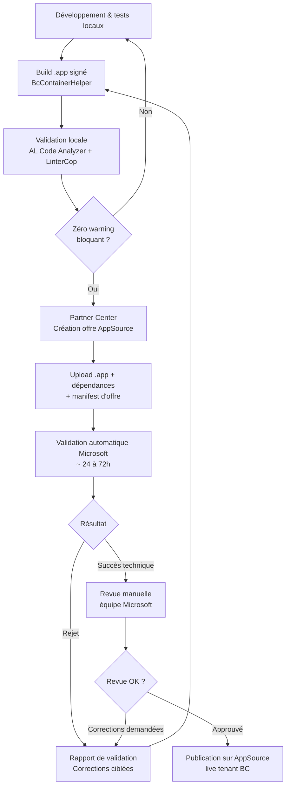

# AppSource Certification & validation technique

## Objectifs pédagogiques

À l'issue de ce module, vous serez capable de :

1. **Décrire** le processus complet de soumission AppSource et ses étapes de validation automatique
2. **Anticiper** les blocages les plus fréquents avant même de soumettre votre extension
3. **Corriger** une extension rejetée en lisant et en exploitant le rapport de validation Copilot/LCS
4. **Configurer** un pipeline CI/CD qui reproduit localement les contrôles AppSource
5. **Distinguer** les exigences techniques des exigences éditoriales pour prioriser vos efforts

---

## Mise en situation

Vous travaillez pour un ISV qui a développé une extension de gestion des abonnements récurrents sur Business Central. L'extension fonctionne parfaitement en sandbox interne, tous vos tests AL passent au vert, et votre responsable technique vous demande de soumettre sur AppSource.

Vous soumettez. Trois jours plus tard, vous recevez un e-mail de rejet avec un PDF de 47 pages généré par la validation automatique Microsoft.

C'est exactement ce qui arrive à la majorité des ISV lors de leur première soumission — pas parce que l'extension est mauvaise, mais parce que la validation AppSource applique une grille de critères bien plus stricte que "ça tourne en sandbox". Microsoft valide votre extension comme si elle allait être installée sur 10 000 tenants simultanément, avec des données réelles, par des administrateurs qui ne vous connaissent pas.

Ce module vous prépare à passer cette validation au premier essai — ou au moins à comprendre exactement pourquoi vous échouez et comment y remédier.

---

## Contexte et problématique

### Pourquoi AppSource n'est pas juste un "Store"

AppSource joue un rôle fondamentalement différent d'un simple dépôt d'applications. Quand Microsoft certifie votre extension, il appose implicitement son label de qualité dessus et garantit que votre code ne va pas casser des tenants SaaS partagés, exposer des données, ou bloquer les mises à jour de Business Central.

Cela implique trois niveaux de contrôle :

| Niveau | Qui contrôle | Ce qui est vérifié |
|--------|-------------|-------------------|
| **Technique automatisé** | Plateforme Microsoft (BcContainerHelper + outils internes) | Compilation, erreurs AL, warnings bloquants, accès données, permissions |
| **Fonctionnel manuel** | Équipe de certification Microsoft | Installation/désinstallation propre, scénarios de base documentés |
| **Éditorial** | Équipe Partner Center | Descriptions, screenshots, politique de confidentialité, tarification |

Ce module traite principalement du niveau technique — le plus complexe et le plus souvent source de rejet.

### La vraie différence entre PTEet AppSource

Une Per-Tenant Extension (PTE) est déployée pour un seul tenant. Vous pouvez vous permettre quelques approximations parce que vous connaissez l'environnement cible. Une extension AppSource, elle, doit fonctionner sur n'importe quel tenant BC SaaS, dans n'importe quelle région, avec n'importe quelle combinaison d'autres extensions déjà installées.

Cette différence de contexte explique l'essentiel des exigences de certification.

---

## Le processus de soumission de bout en bout

Avant de plonger dans les critères techniques, il faut avoir une vision claire de la séquence complète. Beaucoup d'ISV perdent du temps parce qu'ils corrigent les mauvais problèmes dans le mauvais ordre.



Le cycle de correction peut se répéter plusieurs fois. Chaque soumission prend 24 à 72 heures. C'est pour cette raison que passer la validation au premier essai représente un gain de temps considérable — parfois plusieurs semaines sur un planning projet.

---

## Les critères techniques de validation

### Ce que le validateur automatique vérifie réellement

La validation automatique de Microsoft exécute votre extension dans un conteneur Docker BC isolé et analyse le résultat. Voici les grandes catégories de contrôle, classées par fréquence de rejet :

**1. Erreurs de compilation et warnings AL**

Ce n'est pas suffisant que votre code compile en local. La validation utilise une version spécifique du compilateur AL avec des règles plus strictes. Les warnings `AL0432`, `AL0468`, `AL0603` qui passent en local peuvent être traités comme des erreurs bloquantes dans le contexte AppSource.

```json
// app.json — configuration à vérifier impérativement
{
  "features": ["NoImplicitWith"],
  "suppressWarnings": []  // ← ne JAMAIS supprimer des warnings ici pour AppSource
}
```

⚠️ **Erreur fréquente** — Supprimer des warnings via `suppressWarnings` dans `app.json` est interprété par la validation comme un contournement délibéré. Microsoft rejette systématiquement les apps avec cette configuration non vide.

**2. Accès aux données et permissions**

C'est la catégorie la plus structurante. Chaque table accédée dans votre code doit être déclarée dans un `PermissionSet` publié avec votre extension. Le validateur simule l'exécution avec un utilisateur qui n'a que les permissions explicitement déclarées — si votre code fait `Record.FindFirst()` sur une table sans que cette table soit dans un PermissionSet, c'est un rejet immédiat.

```al
permissionset 50100 "MyApp - Objects"
{
    Assignable = true;
    Caption = 'MyApp - Full Access', MaxLength = 30;

    Permissions =
        tabledata "My Custom Table" = RIMD,
        tabledata Customer = R,  // accès lecture client
        codeunit "My Business Logic" = X;
}
```

🧠 **Concept clé** — La déclaration `tabledata Customer = R` dans un PermissionSet de votre extension ne vous donne pas accès à la table Customer sur tous les tenants. Elle indique simplement que votre extension a *besoin* de cet accès pour fonctionner. L'administrateur tenant accorde ou non ce PermissionSet à ses utilisateurs.

**3. Telemetry et observabilité**

Microsoft exige que les extensions AppSource instrumentent leurs erreurs critiques. Cela se fait via `Session.LogMessage()` avec un `Verbosity` approprié. Ce n'est pas optionnel — le validateur vérifie la présence de telemetry dans les chemins de code critiques.

```al
procedure ProcessSubscription(var SubscriptionHeader: Record "Subscription Header")
var
    TelemetryDimensions: Dictionary of [Text, Text];
begin
    TelemetryDimensions.Add('SubscriptionNo', SubscriptionHeader."No.");
    TelemetryDimensions.Add('CustomerNo', SubscriptionHeader."Customer No.");

    if not TryExecuteProcessing(SubscriptionHeader) then begin
        Session.LogMessage(
            '0000SUB-001',               // ← ID unique, documenter dans votre registre
            'Subscription processing failed',
            Verbosity::Error,
            DataClassification::SystemMetadata,
            TelemetryScope::ExtensionPublisher,
            TelemetryDimensions
        );
        Error(ProcessingFailedErr);
    end;
end;
```

💡 **Astuce** — L'ID de telemetry (`'0000SUB-001'`) doit être unique dans votre codebase. Tenez un registre de ces IDs dans votre README d'extension — ça servira aussi au support client pour retrouver les erreurs dans les logs Microsoft.

**4. DataClassification sur toutes les tables**

Chaque champ de chaque table que vous créez doit avoir une `DataClassification` explicite. La valeur par défaut `ToBeClassified` est bloquante pour AppSource — Microsoft considère que vous avez délibérément ignoré la classification RGPD.

```al
table 50100 "Subscription Header"
{
    DataClassification = CustomerContent; // ← classification au niveau table

    fields
    {
        field(1; "No."; Code[20])
        {
            DataClassification = CustomerContent;
        }
        field(2; "Customer No."; Code[20])
        {
            DataClassification = EndUserIdentifiableInformation; // ← RGPD sensible
        }
        field(3; "Internal Status Code"; Code[10])
        {
            DataClassification = SystemMetadata; // ← donnée système, non personnelle
        }
    }
}
```

**5. Upgrade Codeunits**

Si votre extension modifie la structure de données entre versions (renommage de table, ajout de champs obligatoires, migration de données), vous devez fournir une `Upgrade Codeunit`. Sans elle, la mise à jour automatique sur les tenants SaaS peut échouer silencieusement — ce que Microsoft refuse catégoriquement.

```al
codeunit 50199 "Subscription Upgrade"
{
    Subtype = Upgrade;

    trigger OnUpgradePerDatabase()
    begin
        // migrations globales une seule fois
    end;

    trigger OnUpgradePerCompany()
    var
        UpgradeTag: Codeunit "Upgrade Tag";
    begin
        if UpgradeTag.HasUpgradeTag(GetV2MigrationTag()) then
            exit;

        MigrateSubscriptionStatus();

        UpgradeTag.SetUpgradeTag(GetV2MigrationTag());
    end;

    local procedure GetV2MigrationTag(): Code[250]
    begin
        exit('MYAPP-SUBSCRIPTION-V2-MIGRATION-20240101');
    end;
}
```

🧠 **Concept clé** — Le système `UpgradeTag` est votre protection contre l'idempotence. Sans lui, si l'upgrade codeunit s'exécute deux fois (ce qui peut arriver en cas de retry), vous risquez de migrer des données déjà migrées, provoquant des doublons ou des corruptions. Le tag agit comme un verrou : "cette migration a déjà été faite, on passe".

---

## Configurer un pipeline de pré-validation local

Attendre 48h le feedback de Microsoft pour découvrir une erreur triviale est contre-productif. La bonne pratique est de reproduire localement un maximum des contrôles de la certification avant de soumettre.

### AL Code Analyzers à activer

Dans votre `settings.json` VS Code ou dans votre configuration CI, activez **tous** les analyzers :

```json
{
  "al.codeAnalyzers": [
    "${AppSourceCop}",
    "${CodeCop}",
    "${PerTenantExtensionCop}",
    "${UICop}"
  ],
  "al.enableCodeAnalysis": true,
  "al.treatWarningsAsErrors": true
}
```

`AppSourceCop` est le plus important — c'est lui qui applique les règles spécifiques à la certification. `PerTenantExtensionCop` peut sembler redondant, mais il détecte des patterns dangereux en contexte multi-tenant.

⚠️ **Erreur fréquente** — Beaucoup d'équipes activent les analyzers uniquement en CI et les gardent désactivés en local pour "ne pas être ralentis". Résultat : des centaines de warnings découverts seulement au moment de la soumission. Activez `treatWarningsAsErrors` dès le début du projet.

### AppSourceCop.json — la configuration à fournir

La validation AppSource attend un fichier `AppSourceCop.json` à la racine de votre extension. Sans lui, certains contrôles ne s'appliquent pas et vous aurez de fausses sécurités.

```json
{
  "mandatoryAffixes": ["MyApp", "MYAPP"],
  "supportedCountries": ["W1", "FR", "BE"],
  "targetVersion": "24.0",
  "enablePerTenantExtensionCop": false
}
```

Le champ `mandatoryAffixes` est crucial : il force le préfixe/suffixe sur tous vos objets AL pour éviter les conflits de nommage avec d'autres extensions (sujet traité dans le module précédent sur la compatibilité). La validation AppSource vérifie que *tous* vos objets respectent ces affixes.

### Pipeline BcContainerHelper pour la validation en CI

```powershell
# Script de validation pré-soumission
# Nécessite BcContainerHelper installé

$containerName = "appsource-validation"
$appFile = ".\output\MyApp.app"

# Création d'un conteneur de validation propre
New-BcContainer `
    -containerName $containerName `
    -artifactUrl (Get-BCArtifactUrl -type Sandbox -country W1 -select Latest) `
    -auth NavUserPassword `
    -updateHosts

# Compilation avec tous les analyzers
Compile-AppInBcContainer `
    -containerName $containerName `
    -appProjectFolder (Get-Location) `
    -AzureDevOps "warning" `
    -EnableCodeCop `
    -EnableAppSourceCop `
    -EnableUICop `
    -FailOn "error"

# Exécution des tests
Run-TestsInBcContainer `
    -containerName $containerName `
    -extensionId "<VOTRE_EXTENSION_ID>" `
    -detailed

# Nettoyage
Remove-BcContainer -containerName $containerName
```

💡 **Astuce** — Ajoutez `$env:bcContainerHelperConfig = '{"usePsNativeCommandsForDocker":true}'` avant le script si vous exécutez en contexte GitHub Actions ou Azure DevOps — certaines configurations Docker y sont incompatibles avec le mode par défaut.

---

## Cas réel en entreprise

### Contexte

ISV spécialisé ERP retail, 12 développeurs AL, première soumission AppSource après 8 mois de développement. Extension de gestion des programmes de fidélité clients pour BC.

### Les trois vagues de rejet

**Première soumission — 23 erreurs bloquantes**

Le rapport de validation révèle essentiellement deux catégories de problèmes : des champs sans `DataClassification` (ils avaient utilisé la valeur par défaut `ToBeClassified` sur l'ensemble de leur modèle de données — 47 champs concernés) et des tables BC standard accédées sans être déclarées dans un PermissionSet.

**Correction et deuxième soumission — 7 erreurs bloquantes**

DataClassification corrigée, PermissionSets ajoutés. Mais la validation révèle maintenant des warnings `AppSourceCop` qui passaient en local parce que `AppSourceCop.json` était absent. Notamment : objets sans affixe obligatoire, et un `OnInstall` codeunit qui accédait à la configuration système sans garde-fou pour les tenants qui n'ont pas encore configuré l'extension.

**Troisième soumission — succès technique**

L'équipe avait finalement intégré `AppSourceCop.json`, activé `treatWarningsAsErrors` en CI, et revu la logique d'installation. La revue manuelle Microsoft a ensuite demandé des corrections mineures sur la documentation de l'offre (screenshots non conformes aux résolutions attendues), réglées en 48h.

**Résultat** : 6 semaines de cycle au lieu des 2 semaines planifiées. L'équipe a ensuite investi 3 jours pour mettre en place le pipeline BcContainerHelper de validation locale — les deux extensions suivantes ont été certifiées au premier essai.

---

## Diagnostic des rejets les plus fréquents

Quand vous recevez un rapport de rejet, la structure du PDF peut être déroutante. Voici une grille de lecture rapide :

| Symptôme dans le rapport | Cause probable | Correction |
|--------------------------|---------------|------------|
| `AS0011` — Object without mandatory affixes | Objet AL nommé sans le préfixe déclaré dans `AppSourceCop.json` | Renommer l'objet + mettre à jour toutes les références |
| `AS0026` — DataClassification ToBeClassified | Champs avec valeur par défaut | Classifier tous les champs explicitement |
| `AS0036` — Missing PermissionSet | Table accédée sans être dans un PermissionSet publié | Ajouter les entrées `tabledata` manquantes |
| `AS0058` — SuppressWarnings used | `suppressWarnings` non vide dans `app.json` | Vider le tableau et corriger les warnings à la source |
| `AA0139` — Possible overflow | Concaténation de chaînes sans vérification de longueur | Utiliser `StrLen()` + truncation explicite |
| `Upgrade failed during install test` | Upgrade Codeunit absente ou défectueuse | Vérifier l'idempotence avec `UpgradeTag` |

⚠️ **Erreur fréquente** — Les codes d'erreur `AS` viennent d'AppSourceCop, les codes `AA` viennent de CodeCop. Ne les confondez pas dans votre recherche de documentation — les pages Microsoft Docs sont séparées et les règles de blocage diffèrent.

---

## Bonnes pratiques

**1. Intégrer AppSourceCop dès le jour 1**
Pas à la fin du projet. Chaque objet créé sans affixe coûte une refactorisation de nommage plus tard — et les renommages d'objets AL ne sont pas transparents en production.

**2. Tenir un registre de DataClassification**
Documenter la classification RGPD de chaque table dans un fichier Markdown dans votre dépôt. Ça accélère les audits internes et force une réflexion consciente à chaque ajout de champ.

**3. Versionner séparément votre `AppSourceCop.json`**
Ce fichier définit le contrat de nommage de votre extension. Le faire évoluer sans contrôle peut invalider rétroactivement des objets déjà publiés.

**4. Tester l'install/uninstall dans un conteneur propre**
Pas dans votre sandbox de développement où l'extension est déjà présente depuis des semaines. Le validateur Microsoft installe votre extension sur un tenant vierge — reproduced localement avec `New-BcContainer` fresh.

**5. Documenter chaque ID de telemetry**
Créez un fichier `TELEMETRY.md` dans votre dépôt avec tous les `0000XXX-YYY` utilisés, leur signification, et le contexte d'émission. Indispensable pour le support niveau 2.

**6. Lire le rapport de validation de bas en haut**
Les erreurs les plus critiques (bloquantes) sont souvent listées en dernier dans le PDF. Microsoft les trie par catégorie, pas par sévérité. Filtrez d'abord les `Error` avant de traiter les `Warning`.

**7. Ne jamais supprimer un warning sans le comprendre**
`suppressWarnings` dans `app.json` est un rejet automatique AppSource. Si un warning semble faux positif, documentez-le dans votre code avec un commentaire — mais corrigez-le.

---

## Résumé

La certification AppSource n'est pas un simple processus administratif — c'est une grille d'exigences techniques conçue pour garantir qu'une extension peut fonctionner de façon fiable et sécurisée sur des milliers de tenants Business Central SaaS simultanément. Les trois sources principales de rejet sont la `DataClassification`, les `PermissionSets` incomplets et les warnings AppSourceCop non traités. La bonne stratégie est d'anticiper : activer AppSourceCop dès le début du projet, configurer `AppSourceCop.json`, et reproduire localement la validation avec BcContainerHelper avant chaque soumission. Un pipeline CI qui applique `treatWarningsAsErrors` avec tous les analyzers actifs est la différence entre une certification en 2 semaines et un cycle de corrections de 2 mois. Le module suivant abordera comment intégrer cette extension certifiée dans une architecture enterprise plus large, avec des dépendances entre systèmes et des flux d'intégration complexes.

---

<!-- snippet
id: al_appsource_suppress_warnings_forbidden
type: warning
tech: AL
level: advanced
importance: high
format: knowledge
tags: appsource,certification,app-json,warnings,blocage
title: suppressWarnings dans app.json = rejet AppSource automatique
content: Mettre des entrées dans `suppressWarnings` dans app.json est interprété par la validation Microsoft comme un contournement délibéré des règles de qualité. Résultat : rejet immédiat, code AS0058. La correction est de vider le tableau et corriger chaque warning à la source.
description: Piège critique ISV : cette config passe en local mais bloque systématiquement en certification AppSource (AS0058).
-->

<!-- snippet
id: al_appsource_dataclassification_required
type: concept
tech: AL
level: advanced
importance: high
format: knowledge
tags: appsource,dataclassification,rgpd,table,champ
title: DataClassification obligatoire sur chaque champ pour AppSource
content: La valeur par défaut `ToBeClassified` est bloquante pour AppSource (AS0026). Chaque champ de chaque table créée doit avoir une DataClassification explicite : `CustomerContent` (données métier), `EndUserIdentifiableInformation` (données personnelles RGPD), ou `SystemMetadata` (données techniques non personnelles). Le validateur vérifie champ par champ.
description: Laisser ToBeClassified sur un seul champ bloque la certification. Classifier au moment de la création du champ, pas après.
-->

<!-- snippet
id: al_appsource_permissionset_tabledata
type: concept
tech: AL
level: advanced
importance: high
format: knowledge
tags: appsource,permissionset,tabledata,certification,securite
title: Toute table accédée doit figurer dans un PermissionSet publié
content: Le validateur AppSource simule l'exécution avec un utilisateur qui n'a que les permissions déclarées dans les PermissionSets de l'extension. Si votre code fait FindFirst() sur une table sans entrée `tabledata` correspondante dans un PermissionSet → erreur AS0036 et rejet. Inclut les tables BC standard (Customer, Vendor, etc.).
description: AS0036 : accès table sans PermissionSet déclaré = rejet. Déclarer chaque table avec le niveau RIMD minimal nécessaire.
-->

<!-- snippet
id: al_appsource_upgrade_tag_idempotence
type: concept
tech: AL
level: advanced
importance: high
format: knowledge
tags: appsource,upgrade,migration,idempotence,upgrade-tag
title: UpgradeTag garantit l'idempotence des migrations de données
content: Sans UpgradeTag, une Upgrade Codeunit peut s'exécuter plusieurs fois sur le même tenant (retry automatique BC SaaS). Le pattern correct : vérifier `UpgradeTag.HasUpgradeTag(tag)` en début de migration → exécuter → appeler `UpgradeTag.SetUpgradeTag(tag)`. Le tag est une Code[250] unique par migration. Son absence dans une extension multi-versions est bloquante pour AppSource.
description: Chaque bloc de migration de données doit être protégé par un UpgradeTag unique pour éviter la double exécution sur SaaS.
-->

<!-- snippet
id: al_appsource_cop_config_mandatory
type: tip
tech: AL
level: advanced
importance: high
format: knowledge
tags: appsource,appsourcecop,affixes,configuration,certification
title: Configurer AppSourceCop.json dès le début du projet
content: Sans `AppSourceCop.json` à la racine, AppSourceCop s'exécute sans les règles d'affixe et laisse passer des objets mal nommés. Le fichier minimal doit contenir `mandatoryAffixes` (ex: ["MyApp"]), `supportedCountries` et `targetVersion`. Renommer des objets déjà publiés en production est une opération destructive — impossible de le faire proprement après coup.
description: Créer AppSourceCop.json au premier commit du projet, pas à la soumission. Renommer des objets publiés casse les données en production.
-->

<!-- snippet
id: al_appsource_telemetry_logsession
type: concept
tech: AL
level: advanced
importance: medium
format: knowledge
tags: appsource,telemetry,session-logmessage,observabilite,certification
title: Session.LogMessage obligatoire sur les chemins d'erreur critiques
content: Microsoft vérifie la présence d'instrumentation telemetry dans les extensions AppSource. La méthode `Session.LogMessage(id, message, verbosity, dataClassification, scope, dimensions)` émet vers le flux de télémétrie Azure. L'ID (ex: '0000SUB-001') doit être unique dans la codebase et documenté. `TelemetryScope::ExtensionPublisher` dirige les logs vers votre propre Application Insights si configuré.
description: Instruments obligatoires pour certification : au moins un Session.LogMessage sur chaque chemin d'erreur critique, avec un ID unique documenté.
-->

<!-- snippet
id: al_appsource_local_pipeline_bccontainerhelper
type: tip
tech: AL
level: advanced
importance: medium
format: knowledge
tags: appsource,bccontainerhelper,ci-cd,validation,pipeline
title: Reproduire la validation AppSource localement avec BcContainerHelper
content: Utiliser `Compile-AppInBcContainer` avec les flags `-EnableAppSourceCop -EnableCodeCop -EnableUICop -FailOn "error"` + `Run-TestsInBcContainer` sur un conteneur BC Sandbox fresh. Tester impérativement sur un tenant vierge (pas le sandbox de dev) pour détecter les problèmes d'install propre. Ajouter `treatWarningsAsErrors: true` dans settings.json VS Code.
description: Un conteneur BC fresh + AppSourceCop activé + treatWarningsAsErrors détecte en local ~80% des rejets avant soumission.
-->

<!-- snippet
id: al_appsource_analyzer_codes_distinction
type: tip
tech: AL
level: advanced
importance: medium
format: knowledge
tags: appsource,appsourcecop,codecop,erreur-codes,diagnostic
title: Distinguer les codes AS (AppSourceCop) des codes AA (CodeCop)
content: Les codes `AS****` viennent d'AppSourceCop (règles spécifiques à la publication AppSource) et les codes `AA****` viennent de CodeCop (règles de qualité AL générales). La documentation Microsoft Docs est séparée pour chaque analyzer. Dans un rapport de rejet, filtrer d'abord les `AS` : ce sont les bloquants spécifiques à la certification.
description: Dans un rapport de rejet, les codes AS bloquent la certification, les codes AA indiquent des problèmes de qualité — ne pas chercher un code AA dans la doc AppSourceCop.
-->
