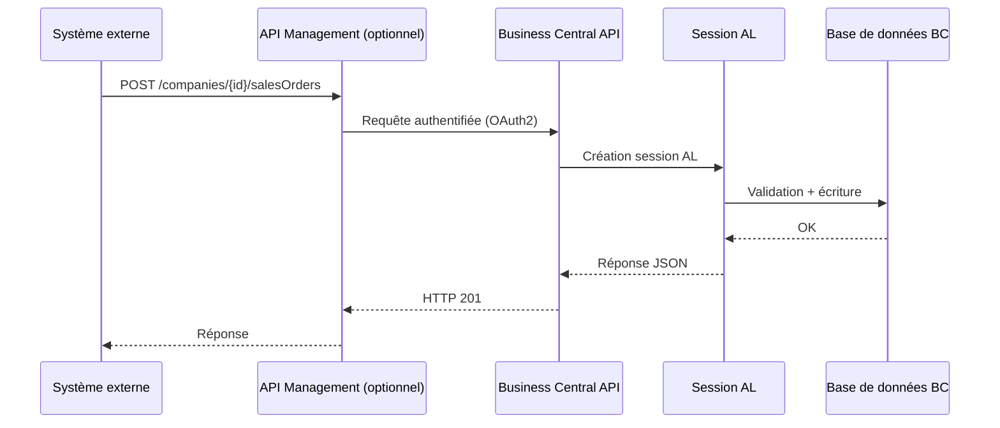
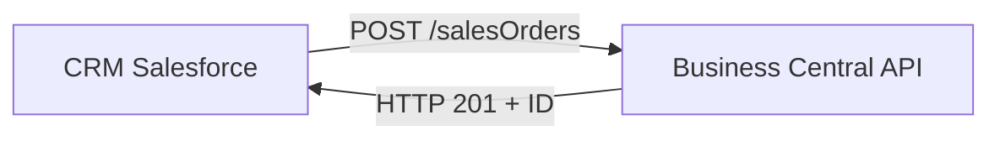
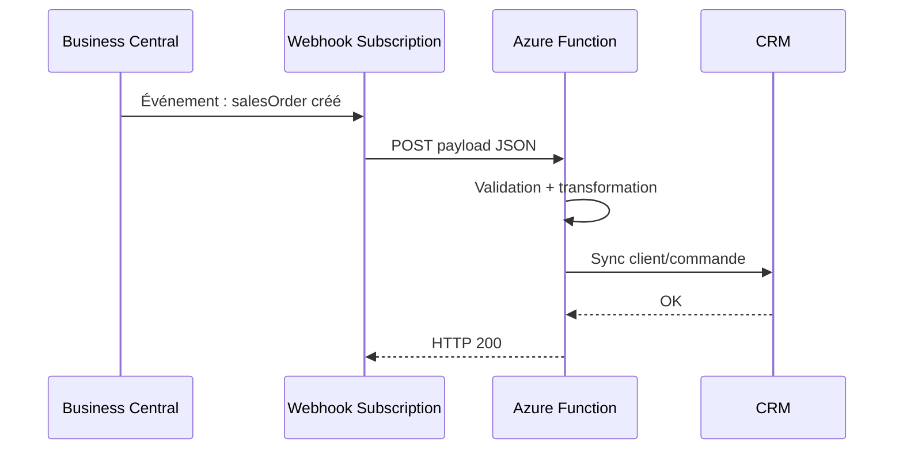
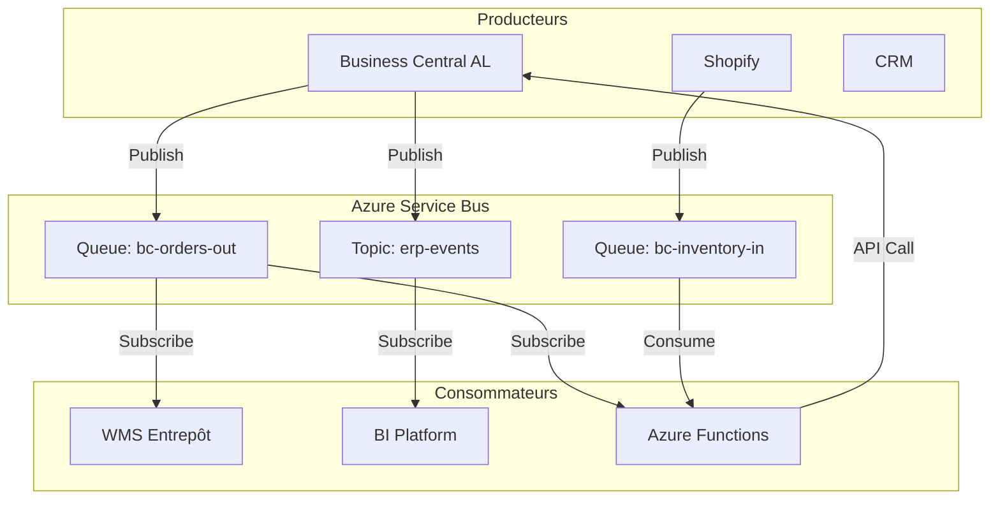
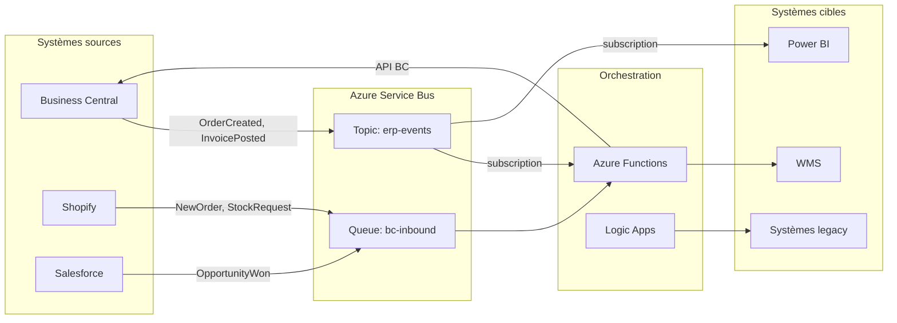

# Architecture intégration entreprise

## Objectifs pédagogiques

- Concevoir une architecture d'intégration entre Business Central et des systèmes tiers en choisissant le bon pattern selon le contexte
- Distinguer les mécanismes d'intégration natifs de BC (API pages, webhooks, codeunits exposés) et leur rôle respectif dans une topologie d'entreprise
- Comprendre le rôle d'Azure Service Bus comme broker asynchrone et savoir pourquoi il change fondamentalement la façon d'aborder les intégrations
- Identifier les pièges architecturaux classiques : couplage fort, polling excessif, gestion des erreurs silencieuses
- Arbitrer entre intégration directe, middleware iPaaS et broker de messages selon les contraintes de volumétrie, de fiabilité et de maintenabilité

---

## Mise en situation

Imaginez une PME de 200 personnes. Business Central gère la finance et les stocks. Un CRM Salesforce suit les opportunités commerciales. Un WMS externe pilote l'entrepôt. Une plateforme e-commerce Shopify déclenche des commandes en continu. Et un outil de BI récupère des données chaque nuit pour alimenter les tableaux de bord.

Au départ, l'équipe technique a tout câblé directement. Des scripts PowerShell qui appellent BC via OData, des webhooks qui poussent vers des Azure Functions, un job nocturne qui tire 50 000 lignes en REST. Ça a fonctionné six mois. Puis un mois de décembre chargé a tout fait craquer : un timeout BC a cassé la synchro CRM, les commandes Shopify sont arrivées en double, et le WMS a perdu des mouvements de stock.

Le problème n'était pas le code. C'était l'absence d'architecture. Chaque intégration avait été pensée isolément, sans anticiper les pannes, les reprises, la montée en charge. Comprendre comment construire une architecture d'intégration solide autour de Business Central, c'est exactement ce que ce module va aborder.

---

## Contexte et problématique

Business Central n'est jamais seul en production. Dans n'importe quelle entreprise de taille réelle, il coexiste avec d'autres systèmes — parfois une dizaine. Chaque flux entre ces systèmes est une intégration qui peut échouer, se désynchroniser ou créer des doublons.

La difficulté n'est pas technique au sens strict. Elle est architecturale : comment organiser ces flux pour qu'ils restent fiables quand le volume augmente, quand un système tombe, quand les équipes changent ?

Business Central propose plusieurs surfaces d'intégration natives :

- **Les API Pages** exposent des entités BC en REST standard (OData v4)
- **Les Webhooks** notifient des systèmes externes lors d'événements métier
- **Les Codeunits exposés** permettent d'appeler de la logique AL depuis l'extérieur via SOAP ou des API personnalisées
- **Les Background Sessions** et **Job Queues** orchestrent des traitements asynchrones internes

Ces primitives sont solides. Mais elles ne font pas une architecture. Ce sont des briques — et c'est le choix de leur assemblage qui détermine si le système tiendra en production.

---

## Comment BC s'organise sous le capot pour l'intégration

Avant de choisir un pattern, il faut comprendre les contraintes techniques réelles de BC côté intégration.

### Le modèle d'exécution BC

Business Central SaaS tourne dans un environnement multi-tenant managé. Chaque requête API est exécutée dans une session AL isolée, avec des timeouts stricts. En SaaS, une requête API standard est limitée à **quelques minutes maximum**. Les opérations longues ne sont pas supportées côté entrant — on ne peut pas pousser 100 000 lignes en une seule transaction.



Ce modèle synchrone fonctionne bien pour les opérations unitaires : créer une commande, lire un client, mettre à jour un stock. Il devient problématique dès qu'on veut traiter des lots, gérer des erreurs partielles ou orchestrer des séquences multi-systèmes.

### Les surfaces d'intégration en détail

| Surface | Protocole | Direction | Cas d'usage typique | Limite principale |
|---|---|---|---|---|
| API Pages standard | OData v4 / REST | Entrant + Sortant | CRUD entités BC, lectures BI | Volumétrie, pas de logique métier custom |
| API Pages custom | REST (AL) | Entrant + Sortant | Endpoints métier sur mesure | Développement nécessaire |
| Webhooks BC | HTTP push | Sortant | Notification événement en temps réel | Pas de retry natif fiable, ordre non garanti |
| Job Queue | Interne BC | Asynchrone interne | Traitements batch, synchros différées | Pas accessible directement depuis l'extérieur |
| Azure Service Bus (via AL) | AMQP / REST | Bidirectionnel | Découplage asynchrone fiable | Setup infrastructure supplémentaire |
| Dataverse / Power Platform | Connector | Bidirectionnel | Intégration écosystème Microsoft | Couplage fort, moins flexible |

🧠 **Concept clé** — Une API Page custom AL n'est pas simplement un endpoint REST de plus. C'est une surface d'intégration où vous contrôlez la logique métier, les validations, et la forme exacte des données exposées. C'est fondamentalement différent d'une API Page standard qui mappe mécaniquement les champs d'une table.

---

## Les patterns d'intégration fondamentaux

Il existe en réalité quatre grandes familles de patterns pour intégrer BC avec le monde extérieur. Chacune répond à des contraintes différentes.

### Pattern 1 — Intégration directe synchrone

Le plus simple : un système appelle BC directement via REST, attend la réponse, continue.



**Quand ça tient :** faibles volumes, transactions critiques où la confirmation immédiate est nécessaire (ex : validation de crédit avant prise de commande), équipe technique limitée.

**Quand ça casse :** BC est momentanément indisponible (déploiement, maintenance), la latence s'accumule sous charge, une erreur BC bloque le système appelant, les retries non gérés créent des doublons.

⚠️ **Erreur fréquente** — Implémenter une intégration directe sans idempotence. Si Salesforce envoie une commande, reçoit un timeout (pas une erreur 4xx), et retry, BC peut créer deux commandes identiques. La solution : systématiquement passer une clé d'idempotence (`Idempotency-Key` header ou un champ externe ID) et la tester côté AL avant insertion.

### Pattern 2 — Webhook sortant + traitement asynchrone

BC notifie les systèmes externes quand quelque chose change. Pas de polling, pas de charge inutile.



Le webhook BC est configuré via API (`/api/v2.0/subscriptions`). Il envoie une notification vers un endpoint externe à chaque création, modification ou suppression d'une entité.

**Ce qu'il faut absolument savoir sur les webhooks BC :**

1. BC n'offre pas de retry sophistiqué natif. Si votre endpoint est down, les notifications peuvent être perdues.
2. L'ordre de livraison n'est pas garanti. Deux modifications rapides sur la même entité peuvent arriver dans le mauvais ordre.
3. Le payload webhook est minimal — il contient l'ID et le type d'événement, pas les données complètes. Votre Azure Function doit rappeler BC pour récupérer les données.

💡 **Astuce** — Devant un webhook BC, toujours construire votre Azure Function en mode "pull on notify" : le webhook déclenche, mais la Function rappelle BC en GET pour obtenir l'état courant de l'entité. Vous évitez ainsi les problèmes de race condition et de payload incomplet.

### Pattern 3 — Broker de messages asynchrone (Azure Service Bus)

C'est le pattern qui change tout à l'échelle. Au lieu que les systèmes se parlent directement, ils déposent des messages dans un broker. Chaque système consomme à son rythme, les messages sont persistés, les erreurs sont gérées.



En AL, l'envoi d'un message vers Service Bus se fait via `HttpClient` ou via des classes d'intégration dédiées. Voici la logique générale d'un codeunit d'envoi :

```al
codeunit 50100 "Service Bus Publisher"
{
    procedure PublishOrderCreated(SalesHeader: Record "Sales Header")
    var
        HttpClient: HttpClient;
        HttpContent: HttpContent;
        HttpHeaders: HttpHeaders;
        HttpResponseMessage: HttpResponseMessage;
        Payload: Text;
        SASToken: Text;
    begin
        Payload := BuildOrderPayload(SalesHeader);
        SASToken := GetSASToken(); // depuis Azure Key Vault via Isolated Storage

        HttpContent.WriteFrom(Payload);
        HttpContent.GetHeaders(HttpHeaders);
        HttpHeaders.Remove('Content-Type');
        HttpHeaders.Add('Content-Type', 'application/json');
        HttpHeaders.Add('Authorization', SASToken);
        HttpHeaders.Add('BrokerProperties', '{"Label":"OrderCreated"}');

        HttpClient.Post(
            'https://<NAMESPACE>.servicebus.windows.net/<QUEUE>/messages',
            HttpContent,
            HttpResponseMessage
        );

        if not HttpResponseMessage.IsSuccessStatusCode() then
            Error('Échec publication Service Bus : %1', HttpResponseMessage.HttpStatusCode());
    end;

    local procedure BuildOrderPayload(SalesHeader: Record "Sales Header"): Text
    var
        JsonObj: JsonObject;
        JsonTxt: Text;
    begin
        JsonObj.Add('orderId', SalesHeader."No.");
        JsonObj.Add('customerId', SalesHeader."Sell-to Customer No.");
        JsonObj.Add('orderDate', Format(SalesHeader."Order Date", 0, 9));
        JsonObj.Add('amount', SalesHeader."Amount Including VAT");
        JsonObj.Add('tenantId', GetCurrentTenantId());
        JsonObj.WriteToText(JsonTxt);
        exit(JsonTxt);
    end;
}
```

⚠️ **Erreur fréquente** — Stocker les SAS tokens ou les connection strings Service Bus directement dans le code AL ou dans des tables BC non sécurisées. Utilisez toujours `IsolatedStorage` avec `DataScope::Module` pour stocker les secrets, et idéalement coupler ça à Azure Key Vault via une App Registration.

### Pattern 4 — iPaaS / Middleware (Logic Apps, Power Automate, MuleSoft)

Entre l'intégration directe et le broker de messages, il y a une catégorie de solutions qui orchestrent des flux sans code : les plateformes iPaaS (Integration Platform as a Service).

Azure Logic Apps et Power Automate disposent toutes deux de connecteurs natifs Business Central. Ils permettent de construire des flux visuels : "quand une facture est validée dans BC → créer une entrée dans SharePoint → envoyer un email → notifier Teams".

**Ce que cette approche résout bien :**
- Flux simples à modéliser rapidement sans développement AL
- Intégrations avec l'écosystème Microsoft 365 (Teams, SharePoint, Outlook)
- Scénarios d'approbation ou de notification

**Ce qu'elle ne résout pas bien :**
- Transformations de données complexes avec logique métier
- Volumétrie élevée (Logic Apps facture à l'exécution, ça chiffre vite)
- Gestion fine des erreurs et des reprises
- Contrôle complet du comportement en cas de panne

🧠 **Concept clé** — Logic Apps et Power Automate consomment les mêmes API Pages BC qu'un appel REST classique. La différence est l'abstraction visuelle et les connecteurs pré-built. Sous le capot, c'est du OData. Ça signifie que leurs limites sont les mêmes : timeout BC, throttling, volumétrie.

---

## Construction progressive d'une architecture d'intégration

Voici comment une architecture réaliste évolue dans le temps, et pourquoi chaque saut est justifié.

### V1 — Intégration directe minimale

Une startup ou une PME qui démarre. BC est nouveau, les volumes sont faibles, une seule intégration existe (typiquement e-commerce → BC).

```
Shopify ──── REST API ──── Business Central
```

**Ce qui suffit ici :** appels directs avec gestion basique des erreurs, idempotence via External Document No., logs dans une table custom BC.

**Le signal qui indique qu'on doit passer à V2 :** les timeouts apparaissent, deux systèmes appellent BC en même temps et se bloquent, une panne BC provoque des pertes de commandes côté e-commerce.

### V2 — Découplage avec Azure Functions comme couche tampon

On introduit une couche intermédiaire légère. Les systèmes externes n'appellent plus BC directement — ils passent par des Azure Functions qui gèrent la retry logic, la validation, et le mapping de données.

```
Shopify ──── Azure Function ──── Business Central API
                    │
              (retry, mapping,
               idempotence,
                 logging)
```

**Ce que ça change :** BC n'est plus exposé directement. Si BC est lent, la Function peut queuer les requêtes. Les erreurs sont loguées et alertées plutôt que silencieuses.

**Le signal pour passer à V3 :** plusieurs systèmes sources, des flux bidirectionnels complexes, des exigences de fiabilité élevées, des pics de charge prévisibles.

### V3 — Architecture event-driven avec Service Bus

On introduit Azure Service Bus comme backbone d'intégration. Chaque système publie des événements dans des queues ou des topics. Les consommateurs lisent à leur rythme.



**Ce que cette architecture garantit :**
- Si BC est down, les messages s'accumulent dans Service Bus et sont traités à la reprise
- Si le WMS est lent, la queue absorbe la charge sans impact sur BC
- Les erreurs de traitement partent dans une Dead Letter Queue (DLQ) analysable
- Chaque flux est observable indépendamment

---

## Prise de décision architecturale

Choisir une architecture d'intégration n'est pas une question de préférence technique. C'est une réponse à des contraintes réelles.

| Critère | Intégration directe | Azure Functions | Service Bus | iPaaS (Logic Apps) |
|---|---|---|---|---|
| Complexité setup | Faible | Moyenne | Élevée | Faible |
| Fiabilité sous charge | Faible | Moyenne | Élevée | Moyenne |
| Gestion des pannes | Manuelle | Semi-automatique | Native (DLQ, retry) | Limitée |
| Observabilité | Faible | Bonne (App Insights) | Excellente | Bonne |
| Coût infrastructure | Minimal | Faible | Moyen | Variable (à l'exécution) |
| Volumétrie supportée | Faible | Moyenne | Très élevée | Faible à moyenne |
| Temps de mise en œuvre | Rapide | Moyen | Long | Rapide |
| Compétences requises | Dev BC | Dev BC + Azure | Archi + Dev | No-code / low-code |

**La règle pragmatique :** commencer simple, mesurer, évoluer quand les limites sont atteintes. Mais anticiper l'évolution dans la conception initiale — une intégration directe non idempotente ne peut pas être rendue fiable sans refonte.

Quelques situations concrètes :

- **Vous avez 2 flux, <1000 transactions/jour, équipe petite** → Intégration directe avec Azure Functions légères, focus sur l'idempotence et les logs.
- **Vous avez un WMS temps réel, des pics de commandes e-commerce, SLA métier fort** → Service Bus obligatoire. La panne du WMS ne doit pas bloquer BC.
- **Vous intégrez des outils Microsoft 365 sans logique métier complexe** → Logic Apps ou Power Automate, c'est exactement leur domaine.
- **Vous avez une intégration bidirectionnelle BC ↔ Salesforce avec logique de déduplication** → Azure Functions avec Service Bus. La logique est trop complexe pour du no-code.

---

## Gestion des erreurs et observabilité

C'est probablement la partie la plus sous-estimée dans les projets d'intégration. Une architecture qui ne permet pas de diagnostiquer une erreur en production est une architecture qui génère des nuits blanches.

### Dead Letter Queue — le filet de sécurité

Avec Azure Service Bus, tout message qui échoue après N tentatives part automatiquement en Dead Letter Queue. C'est une queue d'inspection, pas une perte définitive.

Votre processus opérationnel doit inclure :
1. **Alertes** sur la DLQ dès qu'elle contient des messages (Azure Monitor)
2. **Tooling de réinjection** pour relancer les messages corrigés
3. **Enrichissement des messages** avec context (tenant, timestamp, version AL)

### Logs structurés côté AL

Dans BC, loguez dans une table custom tout message entrant/sortant avec son statut :

```al
table 50101 "Integration Log"
{
    fields
    {
        field(1; "Entry No."; Integer) { AutoIncrement = true; }
        field(2; "Direction"; Enum "Integration Direction") { }
        field(3; "Entity Type"; Text[50]) { }
        field(4; "Entity Id"; Text[50]) { }
        field(5; "Status"; Enum "Integration Status") { }
        field(6; "Error Message"; Text[2048]) { }
        field(7; "Payload"; Blob) { }
        field(8; "Created At"; DateTime) { }
        field(9; "Correlation Id"; Text[100]) { }
    }
}
```

💡 **Astuce** — Le `Correlation Id` est critique. Générez-le côté système source, propagez-le dans tous les systèmes traversés, incluez-le dans les logs BC. Quand une commande Shopify disparaît, le Correlation Id vous permet de retracer exactement à quelle étape elle a échoué — sans fouiller dans 4 systèmes différents.

### Idempotence côté AL

Toute API Page custom ou Codeunit exposé qui reçoit des données doit être idempotent. La règle :

```al
// Avant d'insérer, toujours vérifier l'External ID
if SalesHeader.Get(DocType, ExternalId) then begin
    // Message déjà reçu → retourner l'existant sans erreur
    exit(SalesHeader."No.");
end;
// Sinon créer
```

Ce n'est pas une optimisation. C'est une exigence fondamentale dès qu'un retry est possible côté appelant — et en intégration, il y a toujours un retry quelque part.

---

## Cas réel en entreprise

**Contexte :** Distributeur industriel, 300 utilisateurs BC, intégration avec un WMS Reflex, un CRM Salesforce, et une plateforme EDI pour les commandes B2B.

**Problème initial :** Intégration directe via scripts PowerShell et OData. 3 fois par semaine, des commandes EDI se perdaient pendant les sauvegardes nocturnes BC. Le WMS se désynchronisait des stocks BC sans que personne ne s'en aperçoive avant le lendemain matin.

**Architecture mise en place :**

1. **Azure Service Bus Standard** avec 3 queues principales :
   - `edi-inbound` : commandes EDI entrantes
   - `bc-orders-out` : commandes BC à envoyer au WMS
   - `wms-receipts` : réceptions WMS à confirmer dans BC

2. **AL** : un Codeunit `Integration Event Publisher` abonné aux événements `OnAfterInsertEvent` des Sales Headers et Item Ledger Entries. Il publie sur Service Bus sans bloquer la transaction BC.

3. **Azure Functions** (3 fonctions distinctes) : une par queue, chacune avec sa logique de transformation et retry policy (3 tentatives, backoff exponentiel).

4. **Azure Monitor** : alertes sur les DLQ, dashboard de volumétrie par queue, latence P95 tracée.

**Résultats après 3 mois :**
- Zéro perte de commande EDI, même pendant les maintenances BC
- Latence WMS → BC réduite de 2h (batch) à 8 minutes (temps réel)
- MTTR (temps moyen de résolution) d'une erreur d'intégration : de "découverte le lendemain" à "alerte en moins de 5 minutes"
- L'équipe technique peut identifier et corriger 95% des erreurs d'intégration sans impliquer les utilisateurs métier

---

## Bonnes pratiques

**1. Concevoir pour la panne, pas pour le cas nominal**
Chaque intégration doit avoir une réponse documentée à deux questions : "Que se passe-t-il si BC est indisponible ?" et "Que se passe-t-il si le système cible est indisponible ?" Si la réponse est "ça plante", l'architecture n'est pas prête.

**2. Idempotence systématique**
Toute opération d'écriture dans BC depuis l'extérieur doit pouvoir être rejouée sans créer de doublon. Utilisez des External IDs, des clés de déduplication, des checks avant insert.

**3. Ne jamais stocker de secrets en AL inline**
SAS tokens, connection strings, API keys : tout passe par `IsolatedStorage` ou Azure Key Vault. Un secret dans le code source ou dans une table BC non chiffrée est une fuite de sécurité potentielle.

**4. Versionner les contrats d'intégration**
Une API Page custom est un contrat. Quand vous la modifiez, les consommateurs peuvent casser. Introduisez une version dans l'URL (`/api/v1/`, `/api/v2/`) et maintenez l'ancienne version pendant une période de migration.

**5. Tracer avec un Correlation ID**
Propagez un identifiant de corrélation unique depuis la source jusqu'à BC. Incluez-le dans les logs AL. C'est ce qui rend le débogage possible en production sans fouiller dans 5 systèmes en parallèle.

**6. Calibrer la granularité des événements**
Publier un événement "tout a changé dans BC" est inutile. Publier "OrderCreated", "OrderShipped", "InvoicePosted" avec des payloads ciblés, c'est ce qui permet aux consommateurs de réagir précisément.

**7. Mesurer avant d'optimiser**
Avant d'introduire Service Bus dans une architecture, mesurez votre volumétrie réelle et vos taux d'erreur actuels. Le broker de messages résout des problèmes réels — mais il ajoute de la complexité. Ne l'introduire que quand les limites de la solution plus simple sont documentées.

**8. Tester la résilience, pas seulement le happy path**
Dans vos tests d'intégration, simuler des pannes : BC qui répond 503, timeout Service Bus, message malformé. Si votre Azure Function ne sait pas quoi faire face à un HTTP 503 BC, vous le découvrirez en production le pire moment possible.

---

## Résumé

Intégrer Business Central dans un SI d'entreprise, c'est avant tout un problème d'architecture avant d'être un problème de code. Les primitives natives de BC — API Pages, webhooks, Job Queues — sont solides mais insuffisantes seules pour des intégrations fiables à l'échelle.

L'évolution naturelle va de l'intégration directe (simple mais fragile) vers des architectures découplées basées sur des brokers de messages comme Azure Service Bus. Ce n'est pas une question de taille d'entreprise mais de contraintes : volumétrie, SLA, tolérance aux pannes. Entre les deux, les Azure Functions jouent le rôle de couche d'orchestration légère.

Trois principes traversent tous les patterns : l'idempotence pour éviter les doublons, la traçabilité pour diagnostiquer les pannes, et la conception pour la défaillance plutôt que pour le cas nominal. Ces principes ne sont pas des optimisations — ce sont des exigences de production.

La suite logique de ce parcours plonge dans les aspects finance technique, où la précision des flux de données prend une dimension encore plus critique : une erreur d'intégration sur une écriture comptable n'a pas les mêmes conséquences qu'une erreur sur une notification Slack.

---

<!-- snippet
id: al_servicebus_publish
type: command
tech: AL
level: advanced
importance: high
format: knowledge
tags: al, service-bus, integration, async, http
title: Publier un message vers Azure Service Bus depuis AL
context: Codeunit AL s'exécutant dans Business Central SaaS ou OnPrem
command: HttpClient.Post('https://<NAMESPACE>.servicebus.windows.net/<QUEUE>/messages', HttpContent, HttpResponseMessage)
example: HttpClient.Post('https://monentreprise-sb.servicebus.windows.net/bc-orders-out/messages', HttpContent, HttpResponseMessage)
description: Envoi via HttpClient REST. Requiert header Authorization (SAS token) et BrokerProperties. Stocker le SAS token dans IsolatedStorage, jamais en dur.
-->

<!-- snippet
id: al_integration_idempotence
type: concept
tech: AL
level: advanced
importance: high
format: knowledge
tags: al, idempotence, integration, api, doublons
title: Idempotence obligatoire sur toute API d'écriture BC
content: Avant d'insérer un enregistrement reçu via API, vérifier si un enregistrement avec le même External ID existe déjà. Si oui, retourner l'existant sans erreur ni insertion. Si Non, créer. Ce pattern garantit qu'un retry HTTP (timeout, panne réseau) ne génère pas de doublon. Implémenter via un champ "External Document No." ou un champ ID externe custom.
description: Sans idempotence, tout retry externe peut créer des doublons dans BC. Pattern : chercher par External ID avant insert, retourner l'existant si trouvé.
-->

<!-- snippet
id: al_isolated_storage_secret
type: warning
tech: AL
level: advanced
importance: high
format: knowledge
tags: al, securite, isolated-storage, secrets, integration
title: Ne jamais stocker un secret d'intégration en AL inline
content: Piège : coller un SAS token ou une connection string Service Bus directement dans le code AL ou dans une table BC non chiffrée. Conséquence : secret exposé dans le code source, les exports, les sauvegardes. Correction : utiliser IsolatedStorage.
