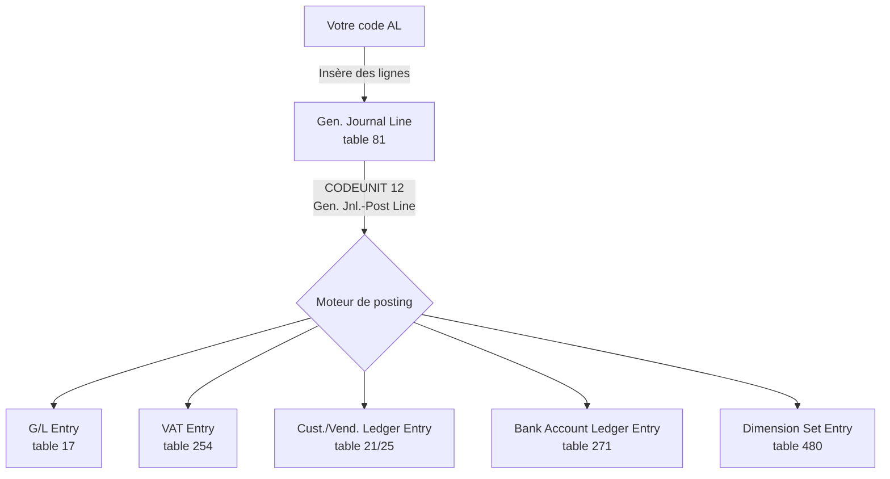
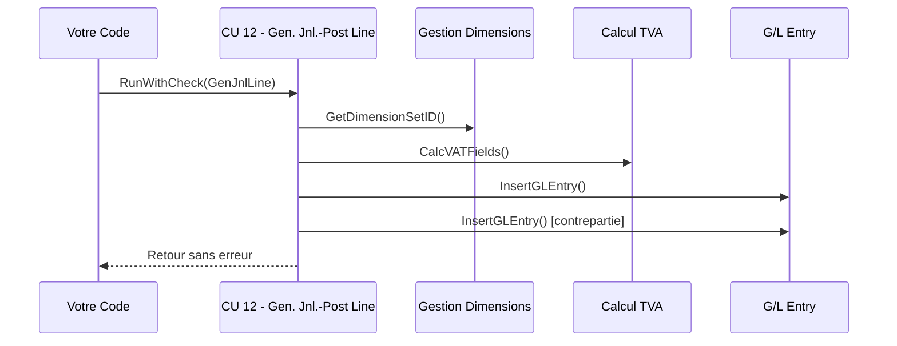
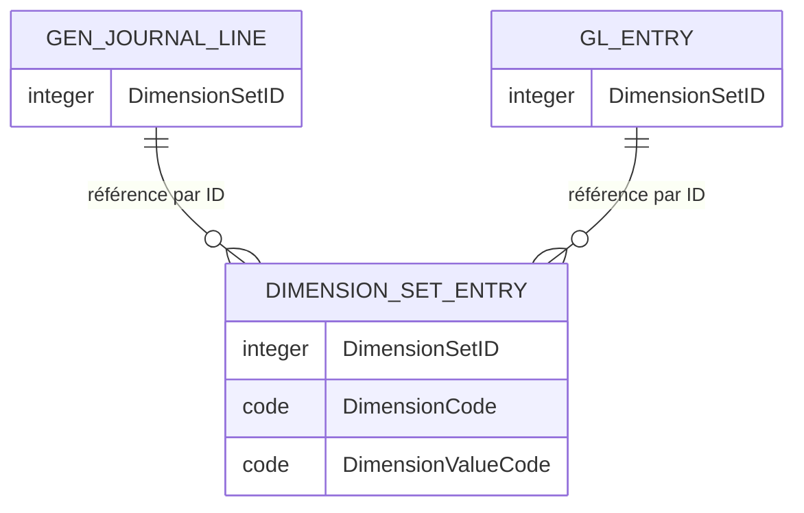
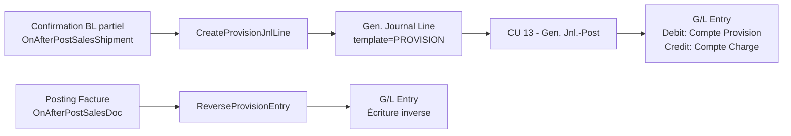

# Finance technique pour développeur AL

## Objectifs pédagogiques

À l'issue de ce module, vous serez capable de :

- Comprendre la structure du plan comptable BC et le mécanisme de posting pour écrire du code qui interagit correctement avec la comptabilité
- Implémenter des extensions qui lisent, enrichissent ou déclenchent des écritures comptables sans casser l'intégrité du grand-livre
- Maîtriser les dimensions et leur impact sur le code AL (validation, accès, écriture via DimMgt)
- Personnaliser les flux de posting en étendant les codeunits de validation sans les modifier directement
- Diagnostiquer et corriger les erreurs comptables fréquentes issues d'une mauvaise compréhension du modèle de données finance

---

## Mise en situation

Vous développez une extension pour une PME industrielle. Le métier veut qu'à la confirmation d'un bon de livraison partiel, une provision comptable soit automatiquement passée — sans passer par une facture. Simple en apparence. Sauf que votre premier essai crée des G/L Entries orphelines, les dimensions sont absentes, et le lettrage automatique explose trois jours plus tard lors de la clôture mensuelle.

Ce n'est pas un problème de logique AL. C'est un problème de compréhension du modèle finance de BC. Le code AL qui touche à la finance ne peut pas être écrit correctement sans comprendre ce qui se passe sous le capot lors d'un posting — quelles tables sont alimentées, dans quel ordre, par quel mécanisme, et pourquoi BC est aussi strict sur l'intégrité.

Ce module vous donne ce socle.

---

## Ce que vous devez savoir avant de commencer

Ce module suppose que vous savez écrire des extensions AL, travailler avec des tables et des codeunits, et que vous avez une notion fonctionnelle basique de ce qu'est un journal comptable. On ne réexplique pas l'architecture d'intégration — on se concentre ici sur les mécanismes internes de la finance BC et leur traduction concrète en code.

---

## Le modèle de données finance : ce qui compte vraiment

### La table G/L Entry est sacrée

Tout développeur AL qui touche à la finance doit intégrer une règle absolue : **on n'écrit jamais directement dans `G/L Entry` (table 17)**. Cette table est en lecture seule pour votre code. Elle est exclusivement alimentée par le moteur de posting interne de BC.

Pourquoi ? Parce que BC garantit l'équilibre débit/crédit, la cohérence des numéros de transaction (`Entry No.`), le lettrage et la traçabilité des sources. Si vous pouviez insérer directement dans cette table, vous casseriez des invariants que BC ne peut pas vérifier a posteriori.

Ce qui vous est donné à la place, c'est un système de **journaux** (`Gen. Journal Line`, table 81) qui agit comme une zone de staging : vous préparez vos lignes, vous appelez le moteur de posting, et c'est lui qui produit les G/L Entries.



### La structure du plan comptable

Le plan comptable vit dans `G/L Account` (table 15). Chaque compte a un `Account Type` : `Posting`, `Heading`, `Total`, `Begin-Total`, `End-Total`. Seuls les comptes de type `Posting` acceptent des écritures. Votre code doit le vérifier avant toute tentative d'écriture.

```al
procedure CheckGLAccount(GLAccountNo: Code[20])
var
    GLAccount: Record "G/L Account";
begin
    GLAccount.Get(GLAccountNo);
    GLAccount.TestField(Blocked, false);
    GLAccount.TestField("Account Type", GLAccount."Account Type"::Posting);
    GLAccount.TestField("Direct Posting", true);
end;
```

⚠️ **Erreur fréquente** : utiliser un compte de type `Total` pour une écriture manuelle. BC ne lève pas toujours une erreur immédiate — mais le journal ne postera jamais. Vous obtiendrez un message cryptique sur la validation du compte.

Le champ `Direct Posting` mérite une attention particulière : il indique si un compte peut être utilisé directement dans un journal général. Certains comptes sont intentionnellement verrouillés (`Direct Posting = false`) parce qu'ils ne doivent être alimentés qu'indirectement, via des sous-modules (achats, ventes, immobilisations). Forcer l'écriture dessus via un journal contourne les contrôles métier.

### Les General Ledger Setup : le contrat de base

Avant tout posting, BC consulte `General Ledger Setup` (table 98). C'est là que sont définis les périodes autorisées (`Allow Posting From` / `Allow Posting To`), le nombre de décimales, la devise locale, et les règles de reporting. Votre code doit respecter ces contraintes plutôt que les contourner.

```al
procedure ValidatePostingDate(PostingDate: Date)
var
    GLSetup: Record "General Ledger Setup";
begin
    GLSetup.Get();
    if (PostingDate < GLSetup."Allow Posting From") or
       (PostingDate > GLSetup."Allow Posting To") then
        Error('La date de comptabilisation %1 est hors de la période autorisée (%2 - %3).',
              PostingDate,
              GLSetup."Allow Posting From",
              GLSetup."Allow Posting To");
end;
```

💡 **À noter** : il existe aussi des restrictions par utilisateur dans `User Setup` (table 91), avec les champs `Allow Posting From` / `Allow Posting To` au niveau utilisateur. Si vous bypassez le moteur de posting, vous bypassez aussi ces contrôles — et c'est souvent là que les audits comptables trouvent des anomalies.

---

## Le mécanisme de posting en détail

### Codeunit 12 — le cœur du réacteur

Le codeunit `Gen. Jnl.-Post Line` (CU 12) est l'un des plus complexes de BC. Il prend en entrée une `Gen. Journal Line` et produit l'ensemble des écritures ledger correspondantes. Son fonctionnement suit un pipeline :



Vous n'appelez jamais CU12 directement depuis votre code métier. Vous passez par `Gen. Jnl.-Post` (CU 13) ou `Gen. Jnl.-Post Batch` (CU 900), qui orchestrent la validation complète avant d'appeler CU12 ligne par ligne.

**Ce que fait CU12 que vous ne devez pas reproduire manuellement :**
- Génération du `Entry No.` séquentiel et garanti unique
- Calcul et rattachement des `VAT Entry`
- Rattachement des `Dimension Set Entry` via le `Dimension Set ID`
- Mise à jour des soldes sur `G/L Account` (`Net Change`, `Balance at Date`)
- Gestion du lettrage automatique si configuré

### Préparer une Gen. Journal Line correctement

C'est votre vrai travail quand vous voulez créer une écriture comptable. La qualité de la `Gen. Journal Line` détermine la qualité de l'entrée G/L qui en résulte.

La procédure ci-dessous est une implémentation complète et exécutable. Chaque point critique est expliqué dans les commentaires et la section qui suit.

```al
procedure PrepareProvisionJnlLine(
    var GenJnlLine: Record "Gen. Journal Line";
    AccountNo: Code[20];
    BalAccountNo: Code[20];
    Amount: Decimal;
    Description: Text[100];
    PostingDate: Date)
var
    GenJnlTemplate: Record "Gen. Journal Template";
    GenJnlBatch: Record "Gen. Journal Batch";
    NoSeriesMgt: Codeunit NoSeriesManagement;
    MaxLineNo: Integer;
    ExistingLine: Record "Gen. Journal Line";
begin
    // Récupérer le template PROVISION dédié (créé manuellement en UI)
    GenJnlTemplate.Get('PROVISION');

    // Récupérer le premier batch disponible sur ce template
    GenJnlBatch.SetRange("Journal Template Name", GenJnlTemplate.Name);
    GenJnlBatch.FindFirst();

    // Calculer le prochain numéro de ligne
    ExistingLine.SetRange("Journal Template Name", GenJnlTemplate.Name);
    ExistingLine.SetRange("Journal Batch Name", GenJnlBatch.Name);
    if ExistingLine.FindLast() then
        MaxLineNo := ExistingLine."Line No."
    else
        MaxLineNo := 0;

    // Construire la ligne
    GenJnlLine.Init();
    GenJnlLine."Journal Template Name" := GenJnlTemplate.Name;
    GenJnlLine."Journal Batch Name" := GenJnlBatch.Name;
    GenJnlLine."Line No." := MaxLineNo + 10000;
    GenJnlLine."Account Type" := GenJnlLine."Account Type"::"G/L Account";
    GenJnlLine."Account No." := AccountNo;
    GenJnlLine."Posting Date" := PostingDate;
    GenJnlLine."Document Type" := GenJnlLine."Document Type"::" ";
    GenJnlLine."Document No." :=
        NoSeriesMgt.GetNextNo(GenJnlBatch."No. Series", PostingDate, true);
    GenJnlLine.Description := Description;
    // Validate() recalcule Debit Amount, Credit Amount et TVA — ne jamais affecter directement
    GenJnlLine.Validate(Amount, Amount);
    GenJnlLine."Bal. Account Type" :=
        GenJnlLine."Bal. Account Type"::"G/L Account";
    GenJnlLine."Bal. Account No." := BalAccountNo;
    GenJnlLine.Insert(true);
end;
```

Plusieurs points critiques :

**`Validate(Amount, Amount)` et non `Amount := Amount`** — Le trigger `OnValidate` du champ `Amount` recalcule `Debit Amount` et `Credit Amount` en fonction du signe, et met à jour les champs TVA si applicable. L'affecter directement crée une incohérence interne dans la ligne.

**Le `Document No.`** doit suivre les numéros de série du batch. Ne jamais générer un numéro manuellement (timestamp, GUID tronqué…). Le moteur de posting vérifie la cohérence des numéros de document.

**La contrepartie (`Bal. Account No.`)** doit être renseignée sauf si vous postez des lignes par paires. Si vous oubliez la contrepartie avec une seule ligne, BC rejettera le batch avec une erreur d'équilibre.

---

## Les dimensions — la couche analytique

### Comprendre le modèle de stockage

BC ne stocke pas les dimensions directement sur les écritures. Il utilise un mécanisme de **Dimension Set** : un ensemble de paires (code dimension, valeur) est stocké une seule fois dans `Dimension Set Entry` (table 480) et référencé par un identifiant entier (`Dimension Set ID`). Chaque G/L Entry, chaque ligne de journal, chaque ligne de commande porte simplement cet ID.



Avantage de ce modèle : BC partage les sets identiques entre millions d'entrées. Si 10 000 G/L Entries ont les mêmes dimensions, elles partagent le même `Dimension Set ID` — une seule fois en base. Pensez-y comme à une clé de cache pour groupes de dimensions : si la combinaison existe déjà, BC réutilise l'ID existant au lieu d'en créer un nouveau.

### Créer ou modifier un Dimension Set

⚠️ **Vous ne créez jamais de `Dimension Set Entry` directement.** C'est le rôle exclusif du codeunit `DimMgt` (`Dimension Management`, CU 408). Il gère la déduplication, la recherche d'un set existant, et la création si nécessaire.

L'exemple suivant montre un appel complet à `DimMgt` avec gestion des cas limites : dimensions manquantes, set ID déjà existant, synchronisation des shortcut dimensions.

```al
procedure PropagateShipmentDimensions(
    var GenJnlLine: Record "Gen. Journal Line";
    SalesShipmentHeader: Record "Sales Shipment Header")
var
    DimMgt: Codeunit DimensionManagement;
    TempDimSetEntry: Record "Dimension Set Entry" temporary;
    NewDimSetID: Integer;
    ErrorMsg: Text;
begin
    // Partir du Dimension Set existant sur la ligne de journal
    // (peut être 0 si aucune dimension n'a encore été rattachée)
    DimMgt.GetDimensionSet(TempDimSetEntry, GenJnlLine."Dimension Set ID");

    // Ajouter les dimensions issues de l'en-tête de livraison
    // GetDimensionSet a déjà chargé le set existant dans TempDimSetEntry
    // On ajoute ou remplace les dimensions souhaitées
    if SalesShipmentHeader."Shortcut Dimension 1 Code" <> '' then begin
        TempDimSetEntry.Init();
        TempDimSetEntry."Dimension Set ID" := 0; // temporaire, sera recalculé
        TempDimSetEntry."Dimension Code" :=
            GetGlobalDimCode(1); // Récupère le code de la dimension globale 1
        TempDimSetEntry."Dimension Value Code" :=
            SalesShipmentHeader."Shortcut Dimension 1 Code";
        if not TempDimSetEntry.Insert() then
            TempDimSetEntry.Modify();
    end;

    if SalesShipmentHeader."Shortcut Dimension 2 Code" <> '' then begin
        TempDimSetEntry.Init();
        TempDimSetEntry."Dimension Code" :=
            GetGlobalDimCode(2);
        TempDimSetEntry."Dimension Value Code" :=
            SalesShipmentHeader."Shortcut Dimension 2 Code";
        if not TempDimSetEntry.Insert() then
            TempDimSetEntry.Modify();
    end;

    // Calculer le nouvel ID (réutilise un set existant ou en crée un nouveau)
    NewDimSetID := DimMgt.GetDimensionSetID(TempDimSetEntry);

    // Vérifier que le set est valide (combinaisons autorisées)
    if not DimMgt.CheckDimIDComb(NewDimSetID) then
        Error('Combinaison de dimensions invalide : %1', DimMgt.GetDimCombErr());

    GenJnlLine."Dimension Set ID" := NewDimSetID;

    // Synchroniser les shortcut dimensions (champs dénormalisés de commodité)
    DimMgt.UpdateGlobalDimFromDimSetID(
        NewDimSetID,
        GenJnlLine."Shortcut Dimension 1 Code",
        GenJnlLine."Shortcut Dimension 2 Code");
end;

local procedure GetGlobalDimCode(DimNo: Integer): Code[20]
var
    GLSetup: Record "General Ledger Setup";
begin
    GLSetup.Get();
    case DimNo of
        1: exit(GLSetup."Global Dimension 1 Code");
        2: exit(GLSetup."Global Dimension 2 Code");
        else
            Error('Dimension globale %1 non supportée.', DimNo);
    end;
end;
```

🧠 **Concept clé** : Les champs `Shortcut Dimension 1 Code` et `Shortcut Dimension 2 Code` sur la ligne sont des copies dénormalisées pour faciliter les filtres. Le `Dimension Set ID` reste la source de vérité. Si vous mettez à jour les shortcuts sans recalculer le `Dimension Set ID`, vous avez une incohérence silencieuse qui corrompra les rapports analytiques.

### Lire les dimensions d'une écriture existante

```al
procedure GetDimensionValues(DimensionSetID: Integer): Text
var
    DimSetEntry: Record "Dimension Set Entry";
    Result: Text;
begin
    if DimensionSetID = 0 then
        exit('Aucune dimension rattachée');
    DimSetEntry.SetRange("Dimension Set ID", DimensionSetID);
    if DimSetEntry.FindSet() then
        repeat
            Result += DimSetEntry."Dimension Code" + '=' +
                      DimSetEntry."Dimension Value Code" + '; ';
        until DimSetEntry.Next() = 0;
    exit(Result);
end;
```

### Validation des dimensions

BC peut être configuré pour rendre certaines dimensions obligatoires, interdites, ou à valider sur certains comptes. Ces règles vivent dans `Default Dimension` (table 352) et `Dimension Combination` (table 480). Ne jamais bypasser ces règles — elles existent pour garantir la qualité des données analytiques. Le point d'extension standard pour la validation avant posting est l'événement `OnAfterCheckGenJnlLine` sur CU `Gen. Jnl.-Check Line`.

---

## Étendre le posting sans le réécrire

### L'approche événementielle — la seule bonne

Le moteur de posting de BC est parsemé d'événements publiés. C'est votre porte d'entrée légitime pour toute personnalisation. Modifier CU12 ou CU13 directement est une erreur architecturale grave qui rend les mises à jour BC impossibles.

Les événements les plus utiles dans le contexte finance :

| Codeunit | Événement | Moment | Usage typique |
|----------|-----------|--------|---------------|
| CU 12 | `OnBeforeInsertGLEntry` | Avant insertion G/L Entry | Enrichir une G/L Entry avec des champs custom |
| CU 12 | `OnAfterInsertGLEntry` | Après insertion | Déclencher une action post-écriture |
| CU 80 (Sales-Post) | `OnBeforePostSalesDoc` | Avant posting vente | Validation métier custom |
| CU 80 | `OnAfterPostSalesDoc` | Après posting vente | Comptabilisation complémentaire |
| CU 90 (Purch.-Post) | `OnBeforePostPurchDoc` | Avant posting achat | Idem côté achat |
| CU 12 | `OnAfterSetDimensions` | Après calcul dimensions | Surcharger les dimensions calculées |

### Exemple concret : enrichir une G/L Entry avec un champ custom

Imaginons que vous avez ajouté un champ `Custom Reference` sur `G/L Entry` via une table extension, et vous voulez le peupler à partir d'un champ sur `Gen. Journal Line`.

```al
// Extension de table sur Gen. Journal Line
tableextension 50100 "Gen. Jnl. Line Ext." extends "Gen. Journal Line"
{
    fields
    {
        field(50100; "Custom Reference"; Code[20])
        {
            DataClassification = CustomerContent;
            Caption = 'Custom Reference';
        }
    }
}

// Extension de table sur G/L Entry
tableextension 50101 "G/L Entry Ext." extends "G/L Entry"
{
    fields
    {
        field(50100; "Custom Reference"; Code[20])
        {
            DataClassification = CustomerContent;
            Caption = 'Custom Reference';
        }
    }
}

// Codeunit abonné à l'événement de posting
codeunit 50100 "Finance Posting Subscriber"
{
    [EventSubscriber(ObjectType::Codeunit, Codeunit::"Gen. Jnl.-Post Line",
        'OnBeforeInsertGLEntry', '', false, false)]
    procedure OnBeforeInsertGLEntry(
        var GLEntry: Record "G/L Entry";
        var GenJournalLine: Record "Gen. Journal Line";
        var IsHandled: Boolean)
    begin
        // Propager le champ custom depuis la ligne de journal vers l'écriture GL
        GLEntry."Custom Reference" := GenJournalLine."Custom Reference";
    end;
}
```

💡 **Astuce** : Toujours vérifier le paramètre `IsHandled` dans les événements qui le proposent. Si un autre subscriber l'a mis à `true`, cela signifie qu'il a pris en charge le traitement. Respectez ce signal pour éviter les conflits entre extensions.

---

## Cas réel : écriture d'une provision automatique

### Architecture de la solution



### Configuration préalable en UI

Avant d'écrire une ligne de code, il faut créer les templates de journal dans BC. Cette configuration appartient au paramétrage, pas au code — c'est délibéré.

**Créer le template PROVISION :**
1. Rechercher "Modèles journal comptabilité" (ou *General Journal Templates*)
2. Créer une ligne : Nom = `PROVISION`, Type = `General`, Récurrent = désactivé
3. Dans le template, créer un batch : Nom = `DÉFAUT`, renseigner une No. Series

Procéder de même pour `INTERCO` et `AJUSTEMENT` si nécessaire. Chaque template produit un compartiment auditable distinct dans le grand-livre — jamais tout dans `GENERAL`.

### Implémentation complète

```al
codeunit 50200 "Sales Provision Manager"
{
    procedure CreateShipmentProvision(SalesShipmentHeader: Record "Sales Shipment Header")
    var
        GenJnlLine: Record "Gen. Journal Line";
        GenJnlPost: Codeunit "Gen. Jnl.-Post";
        ProvisionAmount: Decimal;
        ProvisionAccountNo: Code[20];
        ChargeAccountNo: Code[20];
    begin
        // Calculer le montant de provision depuis les lignes livrées
        ProvisionAmount := CalculateProvisionAmount(SalesShipmentHeader);
        if ProvisionAmount = 0 then
            exit;

        // Récupérer les comptes depuis le paramétrage (jamais hardcodé)
        ProvisionAccountNo := GetProvisionAccount(SalesShipmentHeader);
        ChargeAccountNo := GetChargeAccount(SalesShipmentHeader);

        // Construire la ligne via la procédure partagée
        PrepareProvisionJnlLine(
            GenJnlLine,
            ProvisionAccountNo,
            ChargeAccountNo,
            ProvisionAmount,
            StrSubstNo('Provision BL %1', SalesShipmentHeader."No."),
            SalesShipmentHeader."Posting Date");

        // Rattacher les dimensions depuis l'en-tête de livraison
        PropagateShipmentDimensions(GenJnlLine, SalesShipmentHeader);

        // Poster — CU13 fait toutes les validations avant d'appeler CU12
        if not Codeunit.Run(Codeunit::"Gen. Jnl.-Post", GenJnlLine) then
            Error('Erreur lors du posting de la provision : %1', GetLastErrorText());

        // Enregistrer la référence pour la réversion future
        StoreProvisionReference(SalesShipmentHeader."No.", GenJnlLine."Document No.");
    end;

    local procedure CalculateProvisionAmount(
        SalesShipmentHeader: Record "Sales Shipment Header"): Decimal
    var
        SalesShipmentLine: Record "Sales Shipment Line";
        TotalAmount: Decimal;
    begin
        SalesShipmentLine.SetRange("Document No.", SalesShipmentHeader."No.");
        SalesShipmentLine.SetRange(Type, SalesShipmentLine.Type::Item);
        if SalesShipmentLine.FindSet() then
            repeat
                // Montant HT : quantité × prix unitaire
                TotalAmount +=
                    SalesShipmentLine.Quantity * SalesShipmentLine."Unit Price";
            until SalesShipmentLine.Next() = 0;
        exit(TotalAmount);
    end;

    local procedure GetProvisionAccount(
        SalesShipmentHeader: Record "Sales Shipment Header"): Code[20]
    var
        ProvisionSetup: Record "Provision Setup"; // Table de paramétrage custom
    begin
        // Récupérer le compte depuis le paramétrage — jamais en dur
        if ProvisionSetup.Get() then
            exit(ProvisionSetup."Provision Account No.")
        else
            Error('Paramétrage provision manquant. Veuillez configurer la table Provision Setup.');
    end;

    local procedure GetChargeAccount(
        SalesShipmentHeader: Record "Sales Shipment Header"): Code[20]
    var
        ProvisionSetup: Record "Provision Setup";
    begin
        if ProvisionSetup.Get() then
            exit(ProvisionSetup."Charge Account No.")
        else
            Error('Paramétrage provision manquant. Veuillez configurer la table Provision Setup.');
    end;

    local procedure StoreProvisionReference(ShipmentNo: Code[20]; DocumentNo: Code[20])
    var
        ProvisionRef: Record "Provision Reference"; // Table de suivi custom
    begin
        ProvisionRef.Init();
        ProvisionRef."Shipment No." := ShipmentNo;
        ProvisionRef."Provision Document No." := DocumentNo;
        ProvisionRef."Created At" := CurrentDateTime();
        ProvisionRef.Insert(true);
    end;

    procedure ReverseProvision(SalesInvoiceNo: Code[20])
    var
        ReversalEntry: Codeunit "Reversal Entry";
        ProvisionRef: Record "Provision Reference";
        GLEntry: Record "G/L Entry";
    begin
        // Retrouver la référence de provision liée à cette facture
        ProvisionRef.SetRange("Invoice No.", SalesInvoiceNo);
        if not ProvisionRef.FindFirst() then
            exit; // Aucune provision à reverser

        // Retrouver le Entry No. de la G/L Entry à reverser
        GLEntry.SetRange("Document No.", ProvisionRef."Provision Document No.");
        GLEntry.SetRange("Entry Type", GLEntry."Entry Type"::"Initial Entry");
        if not GLEntry.FindFirst() then
            Error('G/L Entry introuvable pour le document %1.',
                  ProvisionRef."Provision Document No.");

        // BC fournit un mécanisme natif de réversion — l'utiliser systématiquement
        ReversalEntry.SetHideDialog(true);
        ReversalEntry.ReverseTransaction(GLEntry."Transaction No.");
    end;
}
```

**Pourquoi `ReversalEntry.ReverseTransaction()` plutôt qu'une écriture inverse manuelle ?** La réversion native de BC crée des G/L Entries avec `Reversed = true` et `Reversed by Entry No.` — ce qui permet aux rapports d'exclure les provisions reversées du calcul de solde réel, tout en les gardant visibles dans l'historique pour audit. Une écriture inverse manuelle passe juste un débit/crédit symétrique : mathématiquement équivalent, mais sans la traçabilité de réversion. Voici le tableau comparatif des trois approches possibles :

| Approche | Traçabilité audit | Rapports BC natifs | Risque |
|---|---|---|---|
| `ReversalEntry.ReverseTransaction()` | ✅ `Reversed = true`, lien bilatéral | ✅ Exclus automatiquement | Aucun |
| Écriture inverse manuelle (montant négatif) | ⚠️ Deux lignes
