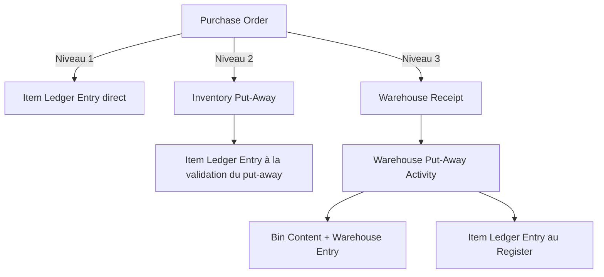
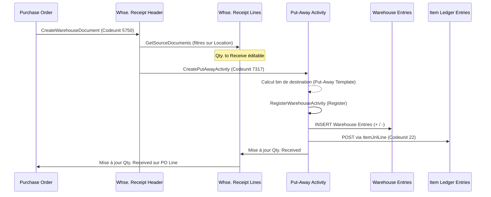
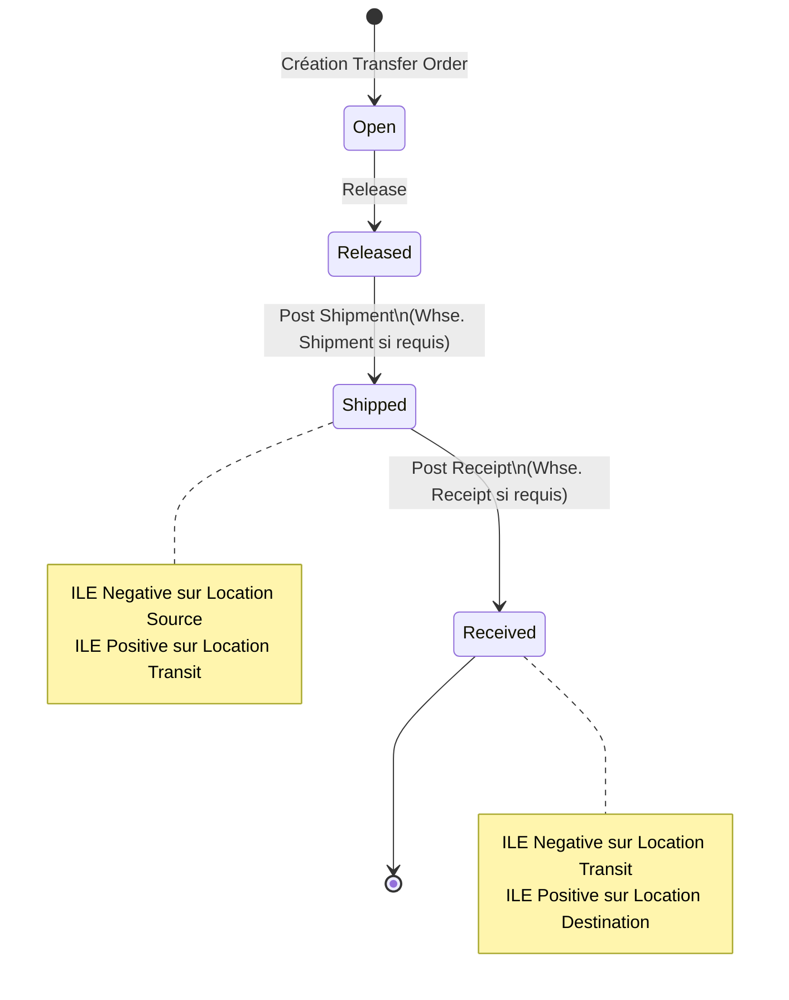

# Warehouse, WMS et Supply Chain dans Business Central

## Objectifs pédagogiques

À l'issue de ce module, vous serez capable de :

1. **Distinguer** les trois niveaux de complexité warehouse dans BC (basique, avancé, WMS complet) et choisir le bon niveau selon le contexte client
2. **Implémenter** en AL les flux de réception, rangement, picking et expédition avec les tables et codeunits concernés
3. **Étendre** les processus warehouse (Warehouse Activity, Bin Content, Item Tracking) sans casser les validations standard
4. **Orchestrer** les flux supply chain inter-documents (Purchase → Receipt → Put-away → Transfer → Sales Shipment) par le code
5. **Diagnostiquer** les blocages courants : quantités engagées, Bin Contents incohérents, Item Ledger Entries manquantes et transferts bloqués en transit

---

## Mise en situation

Un client distributeur de pièces industrielles. Entrepôt avec 4 zones, 300 emplacements, articles en lot avec dates de péremption, 12 préparateurs sur tablettes. BC est en place — mais les préparateurs passent 40 % de leur temps à corriger des erreurs de stock : mauvais emplacements, quantités engagées jamais libérées, livraisons partielles mal réconciliées.

La cause identifiée après investigation : BC a été configuré en mode "warehouse basique" alors que la complexité opérationnelle exige un WMS complet. Et un développeur a contourné les validations standard en postant directement dans les Item Ledger Entries, créant des incohérences que personne ne sait résoudre.

Ce module vous donne les outils pour ne pas reproduire ces erreurs — et pour comprendre profondément comment le moteur warehouse de BC fonctionne, afin de l'étendre proprement.

---

## Ce qu'est le moteur Warehouse dans BC — et pourquoi il est à plusieurs vitesses

Business Central ne propose pas un seul système de gestion d'entrepôt. Il propose **trois niveaux de sophistication**, et le niveau activé change radicalement quelles tables sont utilisées, quels codeunits sont appelés, et ce que votre code AL doit gérer.

C'est probablement la source de confusion numéro un chez les développeurs qui arrivent sur BC avec une logique "stock simple".

### Les trois niveaux warehouse

**Niveau 1 — Basique** : Aucune configuration warehouse. Les mouvements de stock se font directement à la validation des documents d'achat, vente ou transfert. Une `Sales Order` postée génère immédiatement des `Item Ledger Entries`. Pas de picking intermédiaire, pas de bin, pas de document warehouse séparé.

**Niveau 2 — Inventory Pick/Put-Away (warehouse "light")** : Niveau intermédiaire très courant en PME. On active les Inventory Pick et Inventory Put-Away — documents de travail liés à un document source (Sales Order, Purchase Order, Transfer). Le mouvement de stock est posté au moment où l'opérateur valide le pick, pas à la commande. Les bins peuvent être utilisés, mais ils sont facultatifs.

**Niveau 3 — WMS complet** : Les `Warehouse Shipment`, `Warehouse Receipt`, `Warehouse Activity` (Put-Away, Pick, Movement) sont des entités indépendantes. Le stock "BC normal" (Item Ledger Entries) n'est mis à jour qu'en toute fin de chaîne — c'est le *Post Warehouse Receipt* ou le *Register Warehouse Activity* qui déclenche le mouvement réel. Les bins ont un contenu tracké dans `Bin Content` et `Warehouse Entry`.



> 🧠 **Concept clé** — La dichotomie fondamentale du WMS complet : il existe **deux univers de stock en parallèle**. L'univers "item" (Item Ledger Entries, quantité disponible à la vente) et l'univers "warehouse" (Bin Content, Warehouse Entries, quantité physiquement localisée dans un bin). Ces deux univers se synchronisent uniquement aux points de "posting" warehouse. Si vous écrivez du code qui touche l'un sans l'autre, vous créez des incohérences.

La table `Location` porte les six flags qui déterminent le niveau actif. Voici comment les combiner concrètement :

| Flag Location | Rôle | Niveau cible |
|---|---|---|
| `Require Receive` | Oblige un Warehouse Receipt avant réception achat | Niveau 3 |
| `Require Shipment` | Oblige un Warehouse Shipment avant expédition | Niveau 3 |
| `Require Put-away` | Génère des activités de rangement | Niveaux 2 et 3 |
| `Require Pick` | Génère des activités de picking | Niveaux 2 et 3 |
| `Bin Mandatory` | Tous les mouvements référencent un bin | Niveaux 2 et 3 |
| `Directed Put-away and Pick` | Active le WMS complet avec algorithmes de placement | Niveau 3 uniquement |

**Règle de lecture** : `Directed Put-away and Pick` = TRUE implique obligatoirement tous les autres flags. Sans ce flag, vous êtes au mieux en niveau 2 même si vous activez `Bin Mandatory`. Un développeur AL qui ignore ces flags et code une logique de mouvement "universelle" va invariablement planter sur l'un des niveaux.

**Tableau de décision rapide :**

| Contexte client | Combinaison recommandée | Codeunits actifs principaux |
|---|---|---|
| PME, stock simple, pas de bin | Aucun flag | Codeunit 22 (Item Jnl.-Post Line) |
| PME avec suivi bin manuel | Require Pick + Bin Mandatory | Codeunit 7324 (Whse.-Activity-Post) |
| Entrepôt structuré, multi-zones | Require Receive + Require Shipment + Require Pick + Bin Mandatory | Codeunits 5750, 7317, 7314 |
| WMS full, FEFO, multi-opérateurs | Tous les flags + Directed | Codeunits 7312, 7326, 99000845 |

---

## Les tables fondamentales — savoir qui fait quoi

Avant d'écrire une ligne de code qui touche le stock, il faut avoir une carte mentale claire des tables impliquées.

### Les tables "résultat"

**`Item Ledger Entry` (table 32)** — La table de référence absolue pour le stock article. Chaque entrée représente un mouvement de quantité (positif = entrée, négatif = sortie). Ne jamais écrire directement dans cette table depuis AL — passer toujours par les codeunits de posting.

**`Warehouse Entry` (table 7312)** — L'équivalent warehouse de l'Item Ledger Entry. Trace tous les mouvements dans les bins. La cohérence entre les sommes de Warehouse Entries et les Item Ledger Entries est un invariant que BC maintient — et que votre code doit respecter.

**`Bin Content` (table 7302)** — Vue agrégée de ce qui se trouve dans chaque bin. Maintenue automatiquement par le moteur warehouse. Ne pas confondre avec `Warehouse Entry` : Bin Content est un résumé, Warehouse Entry est l'historique et la source de vérité.

### Les tables "document"

**`Warehouse Receipt Header/Line` (7316/7317)** — Document créé à partir d'une ou plusieurs Purchase Orders. Représente une réception physique à venir. Ce document n'impacte pas encore le stock.

**`Warehouse Shipment Header/Line` (7320/7321)** — Document créé à partir de Sales Orders ou Transfer Orders. Représente une expédition à préparer.

**`Warehouse Activity Header/Line` (5765/5766)** — Les activités de travail : Put-Away, Pick, Movement. C'est ce que voit le préparateur sur sa tablette. La `Register` d'une activité est le moment qui génère les Warehouse Entries.

**`Warehouse Worksheet Line` (7326)** — Le tableau de bord de planification du picking. Les responsables créent des lignes de picking worksheet avant de les transformer en activités Pick.

### Les tables "engagement"

**`Reservation Entry` (table 337)** — Gère les engagements de lot/série sur les documents non encore postés. Quand un Warehouse Pick est créé, des Reservation Entries bloquent la quantité dans le bin source jusqu'à ce que le pick soit enregistré.

⚠️ **Erreur fréquente** — Beaucoup de développeurs lisent `Reservation Entry` uniquement pour la réservation commerciale et ignorent les entrées warehouse. Résultat : leurs calculs de disponibilité sont faux, et ils ne comprennent pas pourquoi BC refuse de créer un nouveau pick alors qu'il y a du stock visible dans le bin.

**`Item Tracking Line` (336)** — Gestion des numéros de lot et de série. Cette table temporaire (utilisée via `TempItemTrackingLine` dans les codeunits de posting) est synchronisée avec les Reservation Entries pour les lots/séries.

---

## Flux complet d'une réception en WMS — du bon de commande au stock

Comprendre ce flux est indispensable pour savoir où injecter du code AL sans casser la chaîne.



Le point d'injection le plus propre pour du code custom est **entre la création de l'activité et son enregistrement**. C'est là qu'on peut modifier les bins suggérés, ajouter des validations métier, ou calculer des quantités selon des règles spécifiques.

### Créer programmatiquement un Warehouse Receipt depuis une Purchase Order

```al
procedure CreateWarehouseReceiptFromPO(PurchaseHeader: Record "Purchase Header")
var
    WhseReceiptHeader: Record "Warehouse Receipt Header";
    WhseReceiptLine: Record "Warehouse Receipt Line";
    WhseReceiptCreate: Codeunit "Whse.-Create Receipt";
begin
    PurchaseHeader.TestField("Location Code");

    // Le codeunit standard orchestre la création
    // Il gère la déduplication : si un Receipt ouvert existe déjà
    // pour cette location, il y ajoute les lignes sans créer de doublon
    WhseReceiptCreate.SetPurchHeader(PurchaseHeader);
    WhseReceiptCreate.Run(WhseReceiptLine);

    if WhseReceiptLine.FindFirst() then begin
        WhseReceiptHeader.Get(WhseReceiptLine."No.");
        // Traitements custom ici : assignation de dock,
        // notification équipe, mise à jour champs custom...
    end;
end;
```

💡 **Astuce** — Ne réinventez pas la déduplication. Le codeunit `Whse.-Create Receipt` gère lui-même le cas où un Receipt ouvert existe déjà pour cette location et ce fournisseur. Il y ajoute les lignes plutôt que de créer un doublon.

### Enregistrer une activité Put-Away par code

```al
procedure RegisterPutAwayActivity(WarehouseActivityHeader: Record "Warehouse Activity Header")
var
    WhseActivityRegister: Codeunit "Whse.-Activity-Register";
begin
    // Validation préalable : toutes les lignes Place ont un bin de destination
    ValidateActivityBins(WarehouseActivityHeader);

    // L'enregistrement génère Warehouse Entries ET Item Ledger Entries
    // C'est le point de non-retour : après Register, le stock est mis à jour
    WhseActivityRegister.Run(WarehouseActivityHeader);
end;

local procedure ValidateActivityBins(WarehouseActivityHeader: Record "Warehouse Activity Header")
var
    WhseActivityLine: Record "Warehouse Activity Line";
begin
    WhseActivityLine.SetRange("Activity Type", WarehouseActivityHeader.Type);
    WhseActivityLine.SetRange("No.", WarehouseActivityHeader."No.");
    WhseActivityLine.SetRange("Action Type", WhseActivityLine."Action Type"::Place);
    if WhseActivityLine.FindSet() then
        repeat
            if WhseActivityLine."Bin Code" = '' then
                Error('La ligne %1 n''a pas de bin de destination.', WhseActivityLine."Line No.");
        until WhseActivityLine.Next() = 0;
end;
```

---

## Étendre le processus de picking — le cas le plus courant en projet

Le picking est l'opération que les clients veulent le plus souvent personnaliser. Réassignation automatique de bins, priorité FEFO sur les lots, regroupement par zone, suggestion d'itinéraire — les demandes sont variées.

### Comment BC génère les suggestions de picking

Quand vous créez un Warehouse Pick depuis un Shipment, BC appelle `Codeunit 7314 – Whse. Source – Create Document`. Ce codeunit lit les lignes de shipment à picker, cherche du stock disponible dans les bins de la location via `Bin Content`, applique les règles de ranking (FEFO si activé, Fixed Bin priority, etc.), puis crée des lignes Pick avec `Action Type = Take` (prélèvement du bin source) et `Action Type = Place` (dépôt dans le bin de staging/expédition).

Pour influencer cette logique, vous pouvez :
- **Modifier après génération** : Événement `OnAfterCreateWhseActivLine` sur le codeunit 7314
- **Remplacer la suggestion de bin** : En subscriber sur `OnBeforeCreateWhseActivLine`
- **Ajouter des lignes** : Via les Warehouse Worksheet Lines avant de déclencher la création

### Exemple : forcer le picking FEFO sur une location qui ne l'a pas activé nativement

```al
[EventSubscriber(ObjectType::Codeunit, Codeunit::"Whse. Source - Create Document",
    'OnAfterCreateWhseActivLine', '', false, false)]
local procedure EnforceFEFOOnPick(
    var WarehouseActivityLine: Record "Warehouse Activity Line";
    WhseShipmentLine: Record "Warehouse Shipment Line")
var
    EarliestExpDate: Date;
    BestLotNo: Code[50];
begin
    if WarehouseActivityLine."Action Type" <> WarehouseActivityLine."Action Type"::Take then
        exit;

    if not ItemHasExpirationTracking(WarehouseActivityLine."Item No.") then
        exit;

    FindEarliestLotInBin(
        WarehouseActivityLine."Location Code",
        WarehouseActivityLine."Bin Code",
        WarehouseActivityLine."Item No.",
        EarliestExpDate,
        BestLotNo);

    if BestLotNo <> '' then begin
        WarehouseActivityLine."Lot No." := BestLotNo;
        WarehouseActivityLine.Modify();
    end;
end;

local procedure FindEarliestLotInBin(
    LocationCode: Code[10];
    BinCode: Code[20];
    ItemNo: Code[20];
    var EarliestDate: Date;
    var LotNo: Code[50])
var
    WhseEntry: Record "Warehouse Entry";
    LotInfo: Record "Lot No. Information";
begin
    EarliestDate := DMY2Date(31, 12, 9999);
    LotNo := '';

    WhseEntry.SetRange("Location Code", LocationCode);
    WhseEntry.SetRange("Bin Code", BinCode);
    WhseEntry.SetRange("Item No.", ItemNo);
    WhseEntry.SetFilter("Lot No.", '<>%1', '');

    if WhseEntry.FindSet() then
        repeat
            // Ne traiter que les lots avec un Item Tracking Code actif
            // et une date d'expiration renseignée
            if LotInfo.Get('', WhseEntry."Item No.", WhseEntry."Lot No.") then
                if (LotInfo."Expiration Date" <> 0D) and
                   (LotInfo."Expiration Date" < EarliestDate) then begin
                    EarliestDate := LotInfo."Expiration Date";
                    LotNo := WhseEntry."Lot No.";
                end;
        until WhseEntry.Next() = 0;
end;
```

⚠️ **Erreur fréquente** — Lire le stock d'un bin depuis `Item Ledger Entry` filtrée sur `Location Code` et `Bin Code` ne donne pas les mêmes résultats que lire `Warehouse Entry`. En WMS complet, toujours utiliser `Warehouse Entry` ou `Bin Content` pour les quantités par bin.

---

## Item Tracking en contexte warehouse — lots, séries et contraintes

L'Item Tracking en WMS est un sujet où les erreurs sont silencieuses mais fatales. BC utilise une architecture à deux couches pour le tracking.

**`Reservation Entry` (table 337)** — Contient les engagements de lot/série sur les documents non encore postés. Quand vous créez une ligne de pick avec un lot assigné, une Reservation Entry lie ce lot à cette ligne de pick.

**`Item Tracking Code` + `Lot No. Information` / `Serial No. Information`** — Les fiches de lot/série qui portent les métadonnées (date expiration, certificat qualité, champs custom).

La règle d'or : **ne jamais assigner un lot manuellement dans une Warehouse Activity Line sans créer la Reservation Entry correspondante**. Si vous le faites, BC acceptera le code, mais le posting échouera avec une erreur cryptique sur les "tracking lines" ou les quantités réservées.

### Assigner un lot sur une ligne de pick avec validation de l'unicité

```al
procedure SafeAssignLotToPickLine(
    var WhseActivityLine: Record "Warehouse Activity Line";
    LotNo: Code[50];
    QtyToAssign: Decimal)
var
    TempWhseItemTrkgLine: Record "Whse. Item Tracking Line" temporary;
    ItemTrackingManagement: Codeunit "Item Tracking Management";
begin
    // Vérifier que ce lot n'est pas déjà réservé sur une autre ligne active de ce pick
    // ou sur un autre picking actif pour la même location
    if IsLotAlreadyReservedElsewhere(WhseActivityLine, LotNo, QtyToAssign) then
        Error('Le lot %1 est déjà réservé sur une autre activité active. Assignation impossible.', LotNo);

    TempWhseItemTrkgLine.Init();
    TempWhseItemTrkgLine."Source Type" := Database::"Warehouse Activity Line";
    TempWhseItemTrkgLine."Source ID" := WhseActivityLine."No.";
    TempWhseItemTrkgLine."Source Line No." := WhseActivityLine."Line No.";
    TempWhseItemTrkgLine."Item No." := WhseActivityLine."Item No.";
    TempWhseItemTrkgLine."Lot No." := LotNo;
    TempWhseItemTrkgLine."Quantity (Base)" := QtyToAssign;
    TempWhseItemTrkgLine.Insert();

    // Synchronisation avec les Reservation Entries (table 337)
    // Ce codeunit crée les entrées de réservation correspondantes
    ItemTrackingManagement.SynchronizeWhseItemTrkgLines(
        TempWhseItemTrkgLine,
        WhseActivityLine);

    WhseActivityLine."Lot No." := LotNo;
    WhseActivityLine."Qty. to Handle" := QtyToAssign;
    WhseActivityLine.Modify(true);
end;

local procedure IsLotAlreadyReservedElsewhere(
    WhseActivityLine: Record "Warehouse Activity Line";
    LotNo: Code[50];
    QtyToAssign: Decimal): Boolean
var
    ReservEntry: Record "Reservation Entry";
begin
    // Vérifier les Reservation Entries actives sur ce lot pour cette location
    // (hors la ligne courante)
    ReservEntry.SetRange("Item No.", WhseActivityLine."Item No.");
    ReservEntry.SetRange("Lot No.", LotNo);
    ReservEntry.SetRange("Location Code", WhseActivityLine."Location Code");
    ReservEntry.SetRange("Source Type", Database::"Warehouse Activity Line");
    ReservEntry.SetFilter("Source ID", '<>%1', WhseActivityLine."No.");
    ReservEntry.SetFilter("Quantity (Base)", '<0'); // Entrées négatives = pick actif
    exit(not ReservEntry.IsEmpty());
end;
```

🧠 **Concept clé** — `Whse. Item Tracking FEFO` (Codeunit 7326) est le codeunit que BC appelle nativement pour appliquer le FEFO. Si vous implémentez votre propre logique de sélection de lot, réutilisez ses méthodes plutôt que de recalculer vous-même les dates d'expiration.

---

## Les Transfer Orders — le flux inter-entrepôts

Les Transfer Orders représentent en production un flux critique et fragile, car ils impliquent **deux locations** et un **transit intermédiaire**.

Un Transfer Order passe par : `Open` → `Released` → `Shipped` (ILEs négatives sur location source, positives sur transit) → `Received` (ILEs négatives sur transit, positives sur destination).



Le point de friction courant : si l'expédition est postée sans que la réception suive, vous vous retrouvez avec du stock "fantôme" en transit — visible nulle part dans l'interface standard.

### Détecter les transferts bloqués en transit

```al
procedure FindTransfersStuckInTransit(DaysInTransitThreshold: Integer): Text
var
    TransferHeader: Record "Transfer Header";
    TransferLine: Record "Transfer Line";
    DiagnosticMsg: TextBuilder;
    CutoffDate: Date;
begin
    CutoffDate := CalcDate(StrSubstNo('<-%1D>', DaysInTransitThreshold), Today());
    DiagnosticMsg.AppendLine(StrSubstNo(
        'Transferts expédiés non reçus depuis plus de %1 jours :', DaysInTransitThreshold));

    // Statut 2 = Shipped (expédié mais pas encore reçu)
    TransferHeader.SetRange(Status, TransferHeader.Status::Shipped);
    TransferHeader.SetFilter("Shipment Date", '..%1', CutoffDate);
    if TransferHeader.FindSet() then
        repeat
            // Calculer la quantité encore en transit
            TransferLine.SetRange("Document No.", TransferHeader."No.");
            TransferLine.SetFilter("Quantity Shipped", '>0');
            TransferLine.CalcSums("Quantity Shipped", "Quantity Received");
            if TransferLine."Quantity Shipped" > TransferLine."Quantity Received" then
                DiagnosticMsg.AppendLine(StrSubstNo(
                    '  - Transfer %1 | Expédié : %2 | Reçu : %3 | Source : %4 → %5 | Date exp. : %6',
                    TransferHeader."No.",
                    TransferLine."Quantity Shipped",
                    TransferLine."Quantity Received",
                    TransferHeader."Transfer-from Code",
                    TransferHeader."Transfer-to Code",
                    TransferHeader."Shipment Date"));
        until TransferHeader.Next() = 0
    else
        DiagnosticMsg.AppendLine('  Aucun transfert bloqué détecté.');

    exit(DiagnosticMsg.ToText());
end;
```

💡 **Astuce** — La vue la plus fiable pour les quantités en transit est `Item Availability by Location`, qui utilise `Codeunit 99000845 – Item Availability Forms Mgt`. Ce codeunit centralise tous les calculs de disponibilité en tenant compte du transit, des réservations et des documents ouverts. Réutilisez-le plutôt que de recalculer manuellement.

---

## Bin Content — lire, maintenir et réparer

`Bin Content` (table 7302) est la vue résumée du contenu des emplacements. En WMS, elle est maintenue automatiquement. Mais en développement, on la lit souvent et il faut savoir comment.

### Diagnostiquer un refus de picking

Quand BC refuse de créer ou de compléter un pick, plusieurs causes sont possibles. Ce snippet aide à les identifier systématiquement :

```al
procedure DiagnosePickRefusal(
    LocationCode: Code[10];
    BinCode: Code[20];
    ItemNo: Code[20];
    LotNo: Code[50]): Text
var
    BinContent: Record "Bin Content";
    ReservEntry: Record "Reservation Entry";
    Bin: Record "Bin";
    DiagMsg: TextBuilder;
begin
    DiagMsg.AppendLine(StrSubstNo('Diagnostic pick refusé — Item: %1 | Bin: %2', ItemNo, BinCode));

    // 1. Le bin est-il marqué comme non-pickable ?
    if Bin.Get(LocationCode, BinCode) then
        if not Bin."Pick" then
            DiagMsg.AppendLine('  ⚠️ Bin marqué comme non-pickable (flag Pick = false)');

    // 2. Quelle quantité est disponible dans le bin ?
    if BinContent.Get(LocationCode, BinCode, ItemNo, '', '') then begin
        BinContent.CalcFields("Quantity (Base)", "Pick Quantity (Base)");
        DiagMsg.AppendLine(StrSubstNo(
            '  Stock bin : %1 | Engagé pick : %2 | Disponible : %3',
            BinContent."Quantity (Base)",
            BinContent."Pick Quantity (Base)",
            BinContent."Quantity (Base)" - BinContent."Pick Quantity (Base)"));
    end else
        DiagMsg.AppendLine('  ⚠️ Aucun Bin Content trouvé pour cet article dans ce bin');

    // 3. Y a-t-il des Reservation Entries qui bloquent ce lot ?
    if LotNo <> '' then begin
        ReservEntry.SetRange("Item No.", ItemNo);
        ReservEntry.SetRange("Lot No.", LotNo);
        ReservEntry.SetRange("Location Code", LocationCode);
        ReservEntry.SetFilter("Quantity (Base)", '<0');
        if not ReservEntry.IsEmpty() then
            DiagMsg.AppendLine(StrSubstNo(
                '  ⚠️ Le lot %1 a des Reservation Entries actives qui le bloquent', LotNo));
    end;

    // 4. Item Tracking configuré mais non assigné ?
    // (à enrichir selon la configuration de l'Item Tracking Code)
    DiagMsg.AppendLine('  → Vérifier également : Item Tracking Code, Lot No. Information existante');

    exit(DiagMsg.ToText());
end;
```

### Lire la disponibilité réelle dans un bin

```al
procedure GetAvailableQtyInBin(
    LocationCode: Code[10];
    BinCode: Code[20];
    ItemNo: Code[20];
    VariantCode: Code[10];
    UoMCode: Code[10]): Decimal
var
    BinContent: Record "Bin Content";
begin
    if not BinContent.Get(LocationCode, BinCode, ItemNo, VariantCode, UoMCode) then
        exit(0);

    // CalcFields est indispensable — les champs de quantité sont des FlowFields
    BinContent.CalcFields(
        "Quantity (Base)",
        "Pick Quantity (Base)",
        "Put-away Quantity (Base)");

    // Quantité réellement disponible pour un nouveau pick
    // (stock brut moins ce qui est déjà engagé dans des picks actifs)
    exit(BinContent."Quantity (Base)" - BinContent."Pick Quantity (Base)");
end;
```

⚠️ **Erreur fréquente** — Utiliser `BinContent.Quantity` sans `CalcFields` préalable. Ce champ
