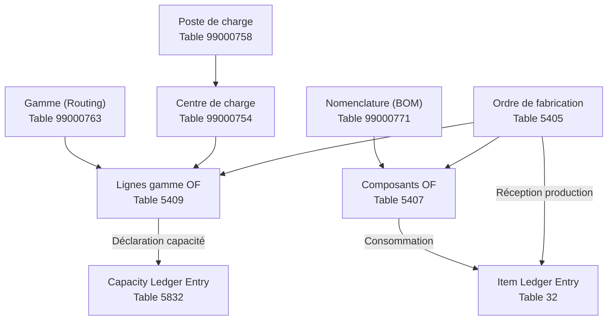
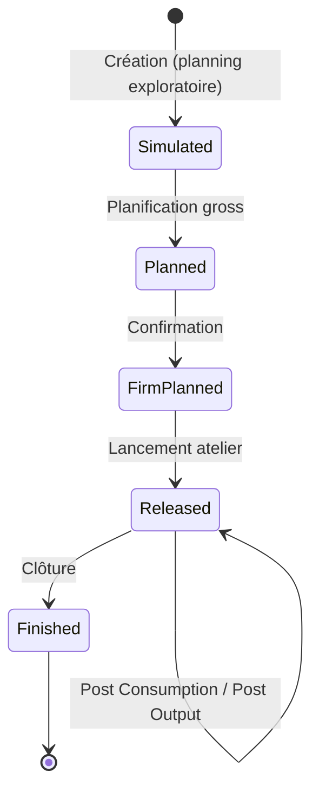
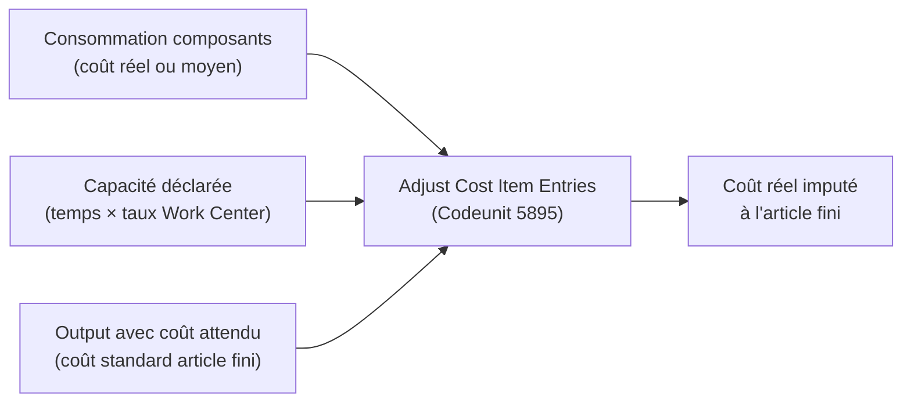

# Manufacturing et production ERP en AL

## Objectifs pédagogiques

À l'issue de ce module, vous serez capable de :

1. **Expliquer** la structure de données Manufacturing de Business Central (nomenclatures, gammes, centres de charge) et les raisons des choix architecturaux qui ont conduit à ce modèle
2. **Naviguer et manipuler** les ordres de fabrication par code AL, du statut Simulated jusqu'à Finished, en comprenant les invariants à respecter à chaque transition
3. **Choisir** entre les patterns d'intégration MES disponibles selon le volume de flux, la latence acceptable et le coût de maintenance
4. **Étendre** les tables et pages Manufacturing avec des champs et logiques métier sans casser les flux standard de posting ou de calcul de coût
5. **Diagnostiquer** les problèmes de cohérence entre nomenclatures, gammes et mouvements de stock en remontant aux causes profondes plutôt qu'aux symptômes

---

## Mise en situation

Vous rejoignez un projet pour un fabricant de composants électroniques. L'ERP tourne sur Business Central — Finance et WMS sont déjà en production depuis six mois. L'équipe doit maintenant activer le module Manufacturing.

Le problème n'est pas technique au départ. C'est que le chef de projet vous dit : *"On a juste besoin de créer des ordres de fab et de déclarer les sorties production — ça devrait être rapide."*

Ce qu'il ne voit pas, c'est qu'un ordre de fabrication dans BC déclenche une cascade : réservation de composants, mouvements de stock, consommation matière, déclaration de production, mise à jour des coûts. Si votre extension interfère mal avec cette chaîne — un `Modify` direct sur la mauvaise table, un COMMIT au mauvais moment, un posting sans les bons champs — vous obtenez des stocks négatifs, des coûts incorrects, ou des ordres bloqués dans un statut intermédiaire impossible à clôturer sans intervention SQL directe.

L'objectif de ce module est de comprendre cette mécanique de l'intérieur, suffisamment pour coder dessus sans la casser — et suffisamment pour choisir la bonne architecture quand les exigences dépassent le standard.

---

## Ce que couvre le module Manufacturing dans BC

Le module Manufacturing repose sur quatre blocs fondamentaux qui travaillent ensemble. Avant d'écrire la moindre ligne d'AL, il faut comprendre pourquoi BC les a conçus ainsi.

**La nomenclature (Bill of Materials — BOM)** définit *quoi* fabriquer : quels composants, en quelle quantité, avec quels variants. Elle est versionnée — une même référence peut avoir plusieurs versions actives à des dates différentes. Cette versioning n'est pas du luxe : dans un environnement industriel réel, la composition d'un produit évolue (changement fournisseur, amélioration conception), mais les ordres en cours ne doivent pas être affectés rétroactivement.

**La gamme (Routing)** définit *comment* fabriquer : la séquence d'opérations, les centres de charge impliqués, les temps de réglage et d'exécution. Elle est aussi versionnée, pour les mêmes raisons.

**Les centres de charge (Work Centers) et postes de charge (Machine Centers)** représentent les ressources physiques ou humaines. Un Work Center peut contenir plusieurs Machine Centers. La capacité, le calendrier et les taux de coût sont attachés à ces entités — ce sont eux qui alimentent le calcul des coûts de capacité lors du posting des outputs.

**L'ordre de fabrication (Production Order)** est le document de pilotage. Il reprend nomenclature et gamme au moment de sa création, les "fige" dans ses propres lignes, puis orchestre les mouvements de stock et les déclarations au fil de l'exécution.



---

## Les tables clés — ce que vous manipulez vraiment

| Table | No. | Rôle | Point d'attention |
|---|---|---|---|
| Production Order | 5405 | Document principal | Status = champ clé (Simulated/Planned/Firm Planned/Released/Finished) |
| Prod. Order Line | 5406 | Ligne article à produire | Quantité, variant, date de fin attendue |
| Prod. Order Component | 5407 | Composants à consommer | Expected Quantity vs Remaining Quantity |
| Prod. Order Routing Line | 5409 | Opérations de la gamme | Run Time, Setup Time, Flushing Method |
| Work Center | 99000754 | Ressource principale | Calendrier, coût unitaire, capacité |
| Machine Center | 99000758 | Sous-ressource | Rattaché à un Work Center |
| Production BOM Header/Line | 99000771/72 | Nomenclature | Version active, type composant (Item / Production BOM) |
| Routing Header/Line | 99000763/64 | Gamme | Version active, type (Serial/Parallel) |
| Item Ledger Entry | 32 | Mouvements de stock | Entry Type = Consumption ou Output |
| Capacity Ledger Entry | 5832 | Mouvements de capacité | Temps réels vs prévus |

### Pourquoi les composants d'un ordre sont une copie, pas une référence

La table `Prod. Order Component` (5407) contient une copie figée de la nomenclature au moment de la création ou du rafraîchissement de l'ordre. Ce n'est pas une référence vers la BOM source.

La raison est contractuelle : une fois qu'un ordre de fabrication est lancé en atelier, les opérateurs travaillent sur la base d'un document figé. Si un ingénieur modifie la BOM source pendant l'exécution (changement de composant, ajustement de quantité), cela ne doit pas affecter les ordres en cours — sinon les quantités réservées, les coûts calculés et les instructions atelier deviennent incohérents.

Conséquence pratique : **modifier la BOM source après la création d'un ordre n'a aucun effet sur cet ordre**. Pour appliquer une correction, il faut soit rafraîchir l'ordre (ce qui recalcule tout depuis la BOM active), soit modifier directement les lignes composant de l'ordre. La deuxième option est parfois la seule viable si l'ordre est déjà partiellement exécuté.

Autre conséquence souvent ignorée : si vous modifiez une BOM pendant qu'un ordre est en cours, **l'écart entre la BOM modifiée et la copie figée dans l'ordre génère un écart de coût**. Sur un composant coûteux, cet écart peut être significatif et apparaître comme une anomalie comptable lors de la clôture de période.

---

## Le cycle de vie d'un ordre de fabrication

Un Production Order passe par cinq statuts. Chaque transition a des effets précis — comprendre ces invariants vous permet de diagnostiquer des erreurs qui sinon restent cryptiques.



**Simulated** : ordre fantôme, aucun impact sur le stock ni la planification. Utile pour simuler des besoins avant engagement, typiquement dans les outils de devis ou de capacité.

**Planned** : intégré dans le plan de production MRP. Génère des ordres planifiés en cascade pour les sous-nomenclatures. À ce stade, MRP peut encore déplacer ou supprimer l'ordre automatiquement.

**Firm Planned** : l'ordre est figé dans le planning. MRP ne peut plus le déplacer. C'est la confirmation que l'atelier va produire — les réservations de composants deviennent actives.

**Released** : les mouvements de consommation et de production peuvent être enregistrés. C'est le seul statut où les postings sont autorisés. Les invariants à respecter avant de passer en Released : la nomenclature doit être certifiée, la gamme doit exister si des temps capacité sont attendus, et les composants doivent pouvoir être réservés.

**Finished** : toutes les quantités sont soldées, les coûts sont calculés et imputés. On ne peut plus poster sur un ordre Finished. L'invariant critique avant cette transition : `Remaining Quantity` sur tous les composants doit être à zéro (ou accepté explicitement comme écart). Un ordre clôturé avec des consommations manquantes génère des coûts incomplets que l'ajustement coût ultérieur aura du mal à corriger proprement.

---

## Créer et manipuler un ordre de fabrication par code

Voici comment créer un ordre de fabrication Released programmatiquement. La logique n'est pas triviale.

```al
procedure CreateProductionOrder(ItemNo: Code[20]; Quantity: Decimal; DueDate: Date)
var
    ProductionOrder: Record "Production Order";
    CreateProdOrder: Codeunit "Create Production Order";
begin
    // Un ordre doit être créé avec un statut valide avant Insert
    // Simulated et Planned sont aussi acceptés — Released est le plus courant pour un lancement direct
    ProductionOrder.Init();
    ProductionOrder.Validate(Status, ProductionOrder.Status::Released);
    ProductionOrder.Validate("Source Type", ProductionOrder."Source Type"::Item);
    ProductionOrder.Validate("Source No.", ItemNo);
    ProductionOrder.Validate(Quantity, Quantity);
    ProductionOrder.Validate("Due Date", DueDate);
    ProductionOrder.Insert(true);

    // Rafraîchissement critique : génère les composants et la gamme depuis la BOM active
    // Sans ce codeunit, l'ordre est créé vide — aucune ligne composant, aucune ligne gamme
    CreateProdOrder.Run(ProductionOrder);
end;
```

Le `Codeunit "Create Production Order"` (99000792) fait bien plus qu'insérer des lignes. Il explose la nomenclature récursivement, calcule les quantités en tenant compte des pertes (Scrap %), applique les variantes, calcule les dates en forward ou backward scheduling selon le routing, et initialise les quantités résiduelles sur les composants.

Recréer cette logique manuellement — en insérant directement dans `Prod. Order Component` et `Prod. Order Routing Line` — est techniquement possible mais aboutit systématiquement à des incohérences : quantités résiduelles incorrectes, dates de besoin fausses, coûts mal calculés. C'est l'anti-pattern le plus fréquent sur ce module.

Si `CreateProdOrder.Run()` échoue (BOM non certifiée, variante inexistante, article bloqué), BC lève une erreur et l'ordre reste vide. Toujours encapsuler cet appel dans un bloc de gestion d'erreur en production :

```al
if not CreateProdOrder.Run(ProductionOrder) then begin
    ProductionOrder.Delete(true);
    Error('Failed to initialize production order for item %1: %2', ItemNo, GetLastErrorText());
end;
```

---

## Poster des consommations et de la production

Deux journaux distincts gèrent ces opérations : le **Consumption Journal** et le **Output Journal**. Par code, on passe par des lignes de journal typées dans `Item Journal Line`.

### Poster une consommation

```al
procedure PostConsumption(
    ProdOrderNo: Code[20];
    ProdOrderLineNo: Integer;
    ItemNo: Code[20];
    Qty: Decimal;
    LocationCode: Code[10];
    BinCode: Code[20])
var
    ItemJournalLine: Record "Item Journal Line";
    ItemJournalTemplate: Record "Item Journal Template";
    ItemJournalBatch: Record "Item Journal Batch";
    ItemJnlPostLine: Codeunit "Item Jnl.-Post Line";
begin
    ItemJournalTemplate.Get('CONSUMP');
    ItemJournalBatch.Get('CONSUMP', 'DEFAULT');

    ItemJournalLine.Init();
    ItemJournalLine."Journal Template Name" := ItemJournalTemplate.Name;
    ItemJournalLine."Journal Batch Name" := ItemJournalBatch.Name;
    ItemJournalLine."Line No." := GetNextLineNo(ItemJournalTemplate.Name, ItemJournalBatch.Name);

    // Ces deux Validate sont indissociables — manquer l'un des deux casse le rattachement à l'ordre
    ItemJournalLine.Validate("Entry Type", ItemJournalLine."Entry Type"::Consumption);
    ItemJournalLine.Validate("Order Type", ItemJournalLine."Order Type"::Production);
    ItemJournalLine.Validate("Order No.", ProdOrderNo);
    ItemJournalLine.Validate("Order Line No.", ProdOrderLineNo);
    ItemJournalLine.Validate("Item No.", ItemNo);
    ItemJournalLine.Validate(Quantity, Qty);
    ItemJournalLine.Validate("Location Code", LocationCode);
    if BinCode <> '' then
        ItemJournalLine.Validate("Bin Code", BinCode);

    ItemJnlPostLine.RunWithCheck(ItemJournalLine);
end;
```

### Poster une sortie de production (Output)

```al
procedure PostOutput(
    ProdOrderNo: Code[20];
    ProdOrderLineNo: Integer;
    OutputQty: Decimal;
    RunTime: Decimal;
    RoutingLineNo: Integer)
var
    ItemJournalLine: Record "Item Journal Line";
    ItemJnlPostLine: Codeunit "Item Jnl.-Post Line";
begin
    ItemJournalLine.Init();
    ItemJournalLine."Journal Template Name" := 'OUTPUT';
    ItemJournalLine."Journal Batch Name" := 'DEFAULT';
    ItemJournalLine."Line No." := 10000;
    ItemJournalLine.Validate("Entry Type", ItemJournalLine."Entry Type"::Output);
    ItemJournalLine.Validate("Order Type", ItemJournalLine."Order Type"::Production);
    ItemJournalLine.Validate("Order No.", ProdOrderNo);
    ItemJournalLine.Validate("Order Line No.", ProdOrderLineNo);

    // Operation No. est obligatoire si la gamme a plusieurs opérations
    // Sans lui, BC ne sait pas à quelle opération rattacher le temps capacité
    ItemJournalLine.Validate("Operation No.", Format(RoutingLineNo));
    ItemJournalLine.Validate("Output Quantity", OutputQty);
    ItemJournalLine.Validate("Run Time", RunTime);
    ItemJournalLine.Validate("Posting Date", WorkDate());

    ItemJnlPostLine.RunWithCheck(ItemJournalLine);
end;
```

---

## Les Flushing Methods — pourquoi elles existent et quand elles posent problème

La Flushing Method sur une ligne gamme ou composant détermine quand la consommation est postée automatiquement. C'est une décision métier avec des implications techniques directes.

**Forward** : la consommation est postée automatiquement au passage en Released. C'est adapté aux composants peu coûteux ou toujours disponibles — on consomme dès le lancement sans attendre la déclaration atelier.

**Backward** : la consommation est postée automatiquement lors du posting de l'output ou lors de la clôture de l'ordre. C'est adapté aux composants dont la consommation réelle n'est connue qu'à la fin (ex : matière première avec pertes variables).

**Manual** : aucune consommation automatique — l'opérateur ou un code AL doit poster explicitement. C'est le mode le plus contrôlé, indispensable pour les composants tracés (lot, série) ou coûteux.

Le piège pour un développeur : **si votre EventSubscriber intercepte les postings de consommation via `OnBeforePostItemJnlLine`, il sera déclenché aussi bien pour les consommations manuelles que pour les flush Forward et Backward automatiques**. Si votre logique suppose un contexte utilisateur (affichage d'un dialog, appel HTTP synchrone), elle cassera silencieusement lors d'un flush automatique déclenché depuis un batch ou un job queue.

La règle : dans un subscriber sur les postings Manufacturing, toujours vérifier d'où vient l'appel avant d'exécuter de la logique dépendante du contexte.

---

## Valider une nomenclature par code

Avant de créer un ordre de fabrication ou de lancer un refresh, il est souvent nécessaire de vérifier que la BOM est dans un état valide. Voici comment accéder à la version active et effectuer des contrôles de base :

```al
procedure ValidateActiveBOM(ItemNo: Code[20]; VariantCode: Code[10]): Boolean
var
    ProductionBOMHeader: Record "Production BOM Header";
    ProductionBOMLine: Record "Production BOM Line";
    BOMVersionCode: Code[20];
begin
    // Récupérer la version certifiée active
    BOMVersionCode := GetActiveBOMVersion(ItemNo, VariantCode);

    if not ProductionBOMHeader.Get(ItemNo) then
        exit(false);

    if ProductionBOMHeader.Status <> ProductionBOMHeader.Status::Certified then
        exit(false);

    // Vérifier qu'au moins une ligne composant existe
    ProductionBOMLine.SetRange("Production BOM No.", ItemNo);
    ProductionBOMLine.SetRange("Version Code", BOMVersionCode);
    if ProductionBOMLine.IsEmpty() then
        exit(false);

    // Vérifier l'absence de référence circulaire (composant = article fini lui-même)
    ProductionBOMLine.SetRange("No.", ItemNo);
    if not ProductionBOMLine.IsEmpty() then
        Error('Circular BOM reference detected: item %1 references itself as a component.', ItemNo);

    exit(true);
end;

local procedure GetActiveBOMVersion(ItemNo: Code[20]; VariantCode: Code[10]): Code[20]
var
    BOMVersion: Record "Production BOM Version";
begin
    BOMVersion.SetRange("Production BOM No.", ItemNo);
    BOMVersion.SetRange(Status, BOMVersion.Status::Certified);
    BOMVersion.SetFilter("Starting Date", '<=%1', WorkDate());
    BOMVersion.SetFilter("Ending Date", '>=%1|%2', WorkDate(), 0D);
    if BOMVersion.FindLast() then
        exit(BOMVersion."Version Code");
    exit('');
end;
```

---

## Calculer la capacité restante sur un Work Center

Un besoin fréquent dans les intégrations MES : savoir si un Work Center peut absorber une nouvelle charge avant de créer un ordre. BC stocke la charge planifiée dans `Prod. Order Capacity Need` (table 99000887) et la capacité disponible dérive du calendrier du Work Center.

```al
procedure GetWorkCenterRemainingCapacity(
    WorkCenterNo: Code[20];
    CheckDate: Date): Decimal
var
    WorkCenter: Record "Work Center";
    CalendarEntry: Record "Calendar Entry";
    CapacityNeed: Record "Prod. Order Capacity Need";
    AvailableCapacity: Decimal;
    PlannedLoad: Decimal;
begin
    if not WorkCenter.Get(WorkCenterNo) then
        exit(0);

    // Capacité disponible selon calendrier
    CalendarEntry.SetRange("Capacity Type", CalendarEntry."Capacity Type"::"Work Center");
    CalendarEntry.SetRange("No.", WorkCenterNo);
    CalendarEntry.SetRange(Date, CheckDate);
    if CalendarEntry.FindFirst() then
        AvailableCapacity := CalendarEntry.Capacity
    else
        exit(0); // Pas de calendrier pour cette date = non travaillé

    // Charge déjà planifiée sur la journée
    CapacityNeed.SetRange("Work Center No.", WorkCenterNo);
    CapacityNeed.SetRange(Date, CheckDate);
    CapacityNeed.SetFilter(Status, '%1|%2',
        CapacityNeed.Status::"Firm Planned",
        CapacityNeed.Status::Released);
    CapacityNeed.CalcSums("Allocated Time");
    PlannedLoad := CapacityNeed."Allocated Time";

    exit(AvailableCapacity - PlannedLoad);
end;
```

---

## Étendre le module Manufacturing

### Ajouter des champs sur un ordre de fabrication

La table `Production Order` (5405) est extensible normalement. Attention aux flux de copie : quand un ordre Planned est promu en Firm Planned, puis en Released, BC recopie certains champs via `Codeunit "Change Production Order Status"` (99000813). Vos champs custom ne seront **pas** recopiés automatiquement — vous devez gérer explicitement la propagation.

```al
tableextension 50100 "EXT Production Order" extends "Production Order"
{
    fields
    {
        field(50100; "Customer Ref."; Code[30])
        {
            Caption = 'Customer Reference';
            DataClassification = CustomerContent;
        }
        field(50101; "Priority Level"; Option)
        {
            Caption = 'Priority Level';
            OptionMembers = Normal,High,Critical;
            OptionCaption = 'Normal,High,Critical';
            DataClassification = CustomerContent;
        }
    }
}
```

Pour propager ces champs lors des changements de statut :

```al
[EventSubscriber(ObjectType::Codeunit, Codeunit::"Change Production Order Status",
    'OnAfterChangeStatus', '', false, false)]
procedure OnAfterChangeStatus(
    var ProductionOrder: Record "Production Order";
    var NewProductionOrder: Record "Production Order";
    NewStatus: Enum "Production Order Status")
begin
    // Propager uniquement les champs qui ont du sens sur le nouvel ordre
    // "Customer Ref." doit suivre l'ordre à travers tous les statuts
    NewProductionOrder."Customer Ref." := ProductionOrder."Customer Ref.";
    NewProductionOrder."Priority Level" := ProductionOrder."Priority Level";
    NewProductionOrder.Modify(false);
end;
```

L'événement `OnAfterChangeStatus` est déclenché pour chaque transition de statut, y compris vers Finished. Testez `NewStatus` si vous ne voulez réagir qu'à certaines transitions.

### Quand bypasser un codeunit standard est acceptable

La règle générale est de ne jamais contourner les codeunits de posting (`Item Jnl.-Post Line`, `Prod. Order Status Management`). Mais il existe des cas légitimes :

**Acceptable** : ajouter des logs métier custom après un posting, en s'abonnant à `OnAfterItemValuePosting`. Vous observez le résultat sans modifier le flux.

**Acceptable** : modifier un champ d'extension sur `Prod. Order Line` via `Modify(false)` dans un subscriber `OnAfter*`, à condition que ce champ n'affecte pas les calculs standard (coût, quantité, réservation).

**Non acceptable** : recalculer vous-même les quantités résiduelles (`Remaining Quantity`) au lieu de laisser le codeunit le faire — les calculs internes dépendent de l'état transactionnel complet de la session.

**Non acceptable** : modifier la logique de coût dans un subscriber de posting. Le calcul des coûts Manufacturing implique des chaînes d'ajustement différé (batch `Adjust Cost`) qui dépendent de l'intégrité des Value Entries. Une interférence crée des écarts comptables silencieux qui ne se révèlent qu'au closing.

---

## Le calcul des coûts de production

Les coûts de production dans BC suivent une logique précise. Comprendre cette mécanique vous évite d'introduire des anomalies comptables invisibles.

Quand vous postez une **consommation**, BC valorise les composants au coût moyen (AVCO) ou au coût standard selon la méthode de coût de l'article. Ces valeurs alimentent les `Value Entries` (table 5802) liées aux `Item Ledger Entries`.

Quand vous postez un **output**, BC crée d'abord une valeur attendue (Expected Cost) basée sur le coût standard de l'article fini. La différence entre coût attendu et coût réel (composants + capacité déclarée) est résolue lors de l'ajustement coût (`Adjust Cost – Item Entries`, Codeunit 5895).



### Coût standard vs coût réel — quelle différence en pratique

BC supporte deux approches principales :

**Coût standard** : l'article fini a un coût prédéfini figé. Les écarts entre coût standard et coût réel apparaissent comme des écarts de production dans la comptabilité analytique. C'est l'approche recommandée pour les industries avec des processus stables et des BOM matures — elle simplifie le closing mensuel.

**Coût moyen (AVCO)** : le coût de l'article fini est recalculé dynamiquement à chaque ajustement. C'est plus précis mais plus complexe à réconcilier. Si un composant coûteux est modifié en cours de mois, l'impact se propage rétroactivement sur tous les ordres de la période via `Adjust Cost`.

Le choix impacte directement votre stratégie de closing : avec le coût standard, le closing est rapide (les écarts sont isolés) ; avec AVCO, il faut attendre que tous les ajustements soient propagés avant de clôturer la période.

---

## Décisions architecturales — intégrer un MES

C'est le cas réel le plus fréquent sur ce module : un MES (Manufacturing Execution System) ou SCADA collecte temps réels et quantités produites, et doit les pousser dans BC. Deux patterns s'opposent, et le choix n'est pas neutre.

### Matrice de décision

| Critère | API REST directe | Staging + Job Queue |
|---|---|---|
| Volume de messages | < 100/jour | > 200/jour |
| Latence acceptable | < 5 secondes | Minutes à heures |
| Gestion des erreurs | Côté MES | Côté BC (retry natif) |
| Complexité d'implémentation | Faible | Moyenne |
| Résilience aux pannes BC | Faible (timeout MES) | Haute (staging persiste) |
| Idempotence | À gérer côté MES | Naturelle (statut par ligne) |

**API REST directe** est suffisante si le volume est faible et si le MES peut gérer ses propres retries. C'est la solution la plus simple à maintenir à long terme — moins de code AL, moins de tables custom.

**Staging + Job Queue** devient nécessaire dès que le volume dépasse quelques centaines de messages par jour, ou que les pannes BC (maintenance, rollout) ne doivent pas bloquer le MES. La table de staging absorbe les messages en continu, le job queue traite en différé.

### Pattern API directe

```al
page 50110 "MES Production API"
{
    PageType = API;
    APIPublisher = 'mycompany';
    APIGroup = 'manufacturing';
    APIVersion = 'v1.0';
    EntityName = 'productionOutput';
    EntitySetName = 'productionOutputs';
    SourceTable = "Item Journal Line";
    InsertAllowed = true;
    ModifyAllowed = false;
    DeleteAllowed = false;
    ODataKeyFields = SystemId;

    layout
    {
        area(Content)
        {
            field(id; Rec.SystemId) { }
            field(orderNo; Rec."Order No.") { }
            field(outputQuantity; Rec."Output Quantity") { }
            field(runTime; Rec."Run Time") { }
            field(postingDate; Rec."Posting Date") { }
            field(itemNo; Rec."Item No.") { }
        }
    }

    trigger OnInsertRecord(BelongsToSet: Boolean): Boolean
    var
        ItemJnlPostLine: Codeunit "Item Jnl.-Post Line";
    begin
        Rec.Validate("Entry Type", Rec."Entry Type"::Output);
        Rec.Validate("Order Type", Rec."Order Type"::Production);
        ItemJnlPostLine.RunWithCheck(Rec);
        exit
