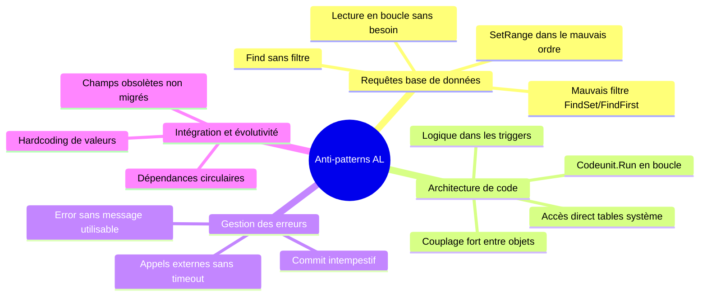
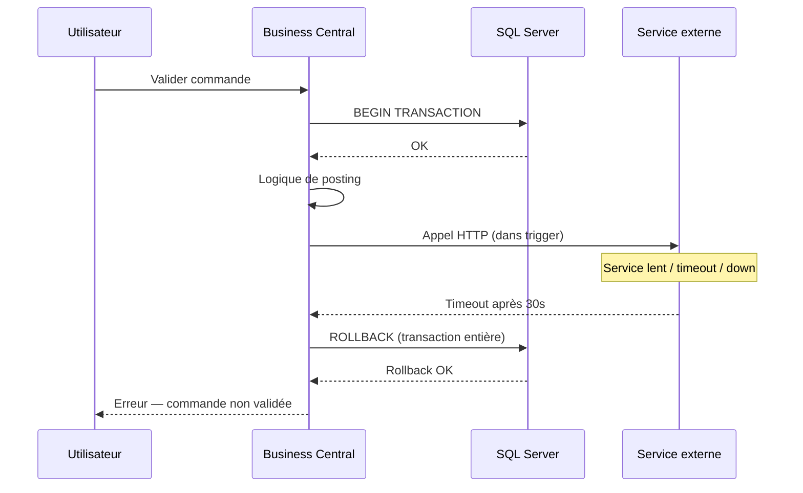

# Anti-patterns AL

## Objectifs pédagogiques

À l'issue de ce module, tu seras capable de :

1. **Identifier** les anti-patterns AL les plus fréquents dans une base de code existante
2. **Expliquer** pourquoi ces patterns dégradent les performances, la maintenabilité ou la stabilité en production
3. **Corriger** un code AL défaillant en appliquant les alternatives adaptées
4. **Prioriser** les corrections selon leur impact sur un environnement Business Central SaaS multi-tenant
5. **Lire** une trace d'erreur ou un profil de performance BC pour localiser la source d'un anti-pattern

---

## Mise en situation

L'équipe technique d'un intégrateur reprend en maintenance une extension développée il y a 18 mois par un prestataire externe. L'extension gère la validation des commandes ventes et quelques automatisations logistiques — rien de très ambitieux sur le papier.

En production, ça se passe autrement. Les utilisateurs signalent des lenteurs inexpliquées lors du traitement de lots de commandes. Le support remonte des erreurs aléatoires sur des validations qui fonctionnaient la veille. L'équipe ouvre la base de code et tombe sur un classique : du code AL qui "fonctionne" — au sens où il passe les tests — mais qui transpire les mauvaises habitudes à chaque page.

Des `FindSet` utilisés pour récupérer une seule ligne. Des boucles qui appellent `Codeunit.Run` à chaque itération. Des `SetRange` empilés dans le mauvais ordre. Un trigger `OnAfterPostDocument` qui appelle un service externe en synchrone, sans gestion d'erreur. Et cerise sur le gâteau : des modifications directes sur des tables système pour "corriger" un comportement natif.

Ce module te donne les outils pour reconnaître ces patterns, comprendre précisément pourquoi ils posent problème, et les corriger.

---

## Pourquoi les anti-patterns AL sont différents des anti-patterns classiques

Dans beaucoup de langages, un mauvais pattern ralentit ton application. En AL sur Business Central, il peut bloquer **tous les autres tenants** sur la même infrastructure SaaS, déclencher des timeouts qui annulent des transactions entières, ou encore rendre une extension incompatible avec la prochaine mise à jour majeure de BC.

La raison structurelle : AL s'exécute dans un environnement fortement contraint. Le NST (Nav Service Tier) impose des limites strictes sur la durée des requêtes, la mémoire par session, et les locks base de données. En SaaS, Microsoft surveille en plus le comportement des extensions et peut les bloquer si elles dégradent la stabilité globale. Un code qui "tient" en sandbox peut s'effondrer en production avec de vrais volumes.

Il y a donc deux niveaux de gravité à distinguer :

- **Gravité performance** : le code est lent, consomme trop de ressources, mais l'opération aboutit
- **Gravité stabilité** : le code génère des locks, des timeouts, des rollbacks, ou plante d'autres utilisateurs

Les anti-patterns présentés ici couvrent les deux.

---

## Les grandes familles d'anti-patterns AL



---

## Requêtes base de données mal construites

C'est la source numéro un de dégradation de performance en AL. Le compilateur ne te protège pas ici — le code compile très bien, s'exécute correctement sur de petits volumes, et explose à 50 000 enregistrements.

### `FindFirst` vs `FindSet` : le mauvais choix au mauvais endroit

La règle est simple mais souvent ignorée :

| Objectif | Méthode correcte | Méthode incorrecte |
|---|---|---|
| Récupérer **un seul** enregistrement | `FindFirst` ou `Get` | `FindSet` + accès immédiat |
| Itérer sur **plusieurs** enregistrements | `FindSet` + `repeat/until` | `FindFirst` en boucle |
| Vérifier l'**existence** uniquement | `IsEmpty` ou `FindFirst` (sans lire les champs) | `FindSet` + comptage |
| Récupérer la **quantité** | `Count` | `FindSet` + compteur manuel |

Le problème avec `FindSet` pour un seul enregistrement n'est pas seulement sémantique : `FindSet` charge potentiellement un curseur et prépare l'itération côté serveur. Sur une table volumineuse, ça implique un plan d'exécution différent côté SQL Server.

```al
// ❌ Anti-pattern : FindSet pour lire une seule ligne
SalesHeader.SetRange("No.", OrderNo);
if SalesHeader.FindSet() then
    ProcessOrder(SalesHeader);

// ✅ Correct : Get par clé primaire
if SalesHeader.Get(SalesHeader."Document Type"::Order, OrderNo) then
    ProcessOrder(SalesHeader);
```

`IsEmpty` remplace avantageusement `FindFirst` quand on veut juste tester l'existence sans lire les données. Il génère une requête SQL `COUNT(*)` côté moteur, sans ramener aucun enregistrement :

```al
// ❌ Récupère des données pour rien
Item.SetRange("Item Category Code", CategoryCode);
if not Item.FindFirst() then
    Error('Aucun article dans cette catégorie.');

// ✅ Ne charge aucune donnée
Item.SetRange("Item Category Code", CategoryCode);
if Item.IsEmpty() then
    Error('Aucun article dans cette catégorie.');
```

### L'ordre des `SetRange` : un détail qui coûte cher

SQL Server utilise les index pour répondre à tes requêtes. L'ordre dans lequel tu poses tes filtres en AL doit correspondre à l'ordre des champs dans l'index utilisé — sinon le moteur fait un scan complet de table.

Sur la table `Item Ledger Entry`, l'index clé `Item No., Posting Date` est courant. Si tu filtres d'abord sur `Posting Date` puis sur `Item No.`, SQL Server ne peut pas utiliser cet index efficacement.

```al
// ❌ Mauvais ordre : Posting Date avant Item No.
ItemLedgerEntry.SetRange("Posting Date", StartDate, EndDate);
ItemLedgerEntry.SetRange("Item No.", ItemNo);
ItemLedgerEntry.FindSet();

// ✅ Ordre correspondant à l'index déclaré sur la table
ItemLedgerEntry.SetRange("Item No.", ItemNo);
ItemLedgerEntry.SetRange("Posting Date", StartDate, EndDate);
ItemLedgerEntry.FindSet();
```

Quand aucune clé déclarée ne correspond exactement à tes filtres, tu peux forcer l'utilisation d'une clé secondaire avec `SetCurrentKey`. C'est un outil légitime — à condition de savoir pourquoi tu l'utilises :

```al
// Forcer l'utilisation d'une clé secondaire sur Customer Ledger Entry
CustLedgerEntry.SetCurrentKey("Customer No.", "Posting Date", "Entry No.");
CustLedgerEntry.SetRange("Customer No.", CustomerNo);
CustLedgerEntry.SetRange("Posting Date", WorkDate() - 30, WorkDate());
CustLedgerEntry.FindSet();
```

⚠️ **Erreur fréquente** : utiliser `SetCurrentKey` avec des champs qui ne correspondent à aucune clé définie sur la table. BC ignorera silencieusement la demande et fera un scan — sans lever d'erreur.

### Lire un rapport AL Profiler pour détecter un problème SQL

L'outil `AL Profiler` (disponible dans VS Code avec l'extension AL) enregistre une session complète et produit un rapport détaillant chaque appel SQL. Voici comment interpréter les signaux critiques :

```
// Exemple de lecture d'un rapport AL Profiler

// 🔴 Signe d'alerte : Table Scan
// SQL Operation : SELECT * FROM "Item Ledger Entry$xxx" WITH (READUNCOMMITTED)
// Rows Read : 2 847 193
// Duration : 4 230 ms
// → Aucun index utilisé. Filtres AL non alignés sur une clé.

// 🟢 Comportement attendu : Index Seek
// SQL Operation : SELECT * FROM "Item Ledger Entry$xxx" WITH (READUNCOMMITTED)
//                 WHERE "Item No_" = 'ART-001' AND "Posting Date" BETWEEN ...
// Rows Read : 143
// Duration : 12 ms
// → Index utilisé, lecture sélective.
```

**Règle de lecture** : si "Rows Read" est très supérieur au nombre d'enregistrements réellement traités, tu as un scan. Si "Duration" d'une requête dépasse 200ms isolément, c'est le premier candidat à investiguer.

---

## Les triggers comme fourre-tout applicatif

Les triggers d'enregistrement AL (`OnBeforeInsert`, `OnAfterPost`, `OnValidate`...) sont des points d'extension puissants. Ce sont aussi des pièges redoutables quand on leur confie trop de responsabilités.

### Logique métier lourde dans `OnValidate`

`OnValidate` se déclenche à chaque modification de champ. Sur une page avec 20 champs, ça peut représenter 20 appels pendant une saisie normale. Si chaque appel fait une requête SQL, tu multiplies la charge par 20 sans t'en rendre compte.

```al
// ❌ Requête complète dans OnValidate — se déclenche à chaque frappe
trigger OnValidate()
var
    Customer: Record Customer;
begin
    Customer.SetRange("Country/Region Code", Rec."Ship-to Country/Region Code");
    Customer.SetRange(Blocked, Customer.Blocked::" ");
    if Customer.FindSet() then
        repeat
            // traitement lourd...
        until Customer.Next() = 0;
end;

// ✅ OnValidate léger : validation simple, logique complexe déléguée
trigger OnValidate()
begin
    if Rec."Ship-to Country/Region Code" = '' then
        Error('Le code pays de livraison est obligatoire.');
    // La logique de mise à jour déclenchée par un bouton ou une action explicite
end;
```

La règle d'or : **un `OnValidate` doit valider, pas calculer**. Si tu as besoin d'une logique complexe, déplace-la dans un codeunit dédié, déclenché explicitement (bouton utilisateur, action de page, job queue).

### Appels externes dans les triggers de posting

Un trigger `OnAfterPost` qui appelle un web service externe, c'est l'anti-pattern le plus dangereux en production. Voici pourquoi :



La transaction SQL reste ouverte pendant tout l'appel externe. Si le service externe est lent (ou down), la transaction maintient ses locks pendant toute la durée — bloquant potentiellement d'autres utilisateurs sur les mêmes enregistrements.

La correction : déléguer l'appel externe à une **Job Queue Entry** créée dans le trigger, qui s'exécutera après la fin de la transaction.

```al
// ❌ Anti-pattern : appel HTTP direct dans le trigger de posting
trigger OnAfterPost(var SalesHeader: Record "Sales Header")
var
    HttpClient: HttpClient;
    Response: HttpResponseMessage;
begin
    HttpClient.Get('https://portail-client.com/api/order/' + SalesHeader."No.", Response);
    // Transaction SQL toujours ouverte pendant cet appel
end;

// ✅ Correct : déléguer à la Job Queue
trigger OnAfterPost(var SalesHeader: Record "Sales Header")
var
    JobQueueEntry: Record "Job Queue Entry";
begin
    // Insertion rapide dans une table tampon — pas d'appel réseau
    JobQueueEntry.ScheduleJobQueueEntry(
        Codeunit::"Send Order to External System",
        SalesHeader.RecordId()
    );
    // Transaction se termine immédiatement après cette insertion
end;
```

### `Commit` intempestif

Appeler `Commit` en milieu de traitement est l'un des anti-patterns les plus insidieux, parce qu'il semble "résoudre" des problèmes de performance ou de lock à court terme — tout en cassant la cohérence transactionnelle.

🧠 **Concept clé** : en AL, toute opération s'exécute dans une transaction implicite. Un `Commit` valide **tout ce qui a été écrit jusqu'ici** de façon permanente, rendant un rollback ultérieur impossible sur ces données. Si une erreur survient après le `Commit`, tu te retrouves avec une base partiellement mise à jour.

```al
// ❌ Commit en cours de boucle — les 14 premiers orders sont committés
//    si le 15ème plante, rollback impossible sur les 14 précédents
foreach OrderNo in OrderList do begin
    ProcessOrder(OrderNo);
    Commit(); // "Pour libérer les locks" — idée dangereuse
end;

// ✅ Laisser BC gérer la transaction implicite
// Chaque document est une unité de travail atomique
foreach OrderNo in OrderList do
    ProcessOrder(OrderNo);
// BC committera proprement à la fin du flux
```

La seule exception légitime au `Commit` explicite : avant un appel à `Codeunit.Run` avec `CommitOnSuccess`, ou avant un `StartSession`. Dans les autres cas, laisse BC gérer la transaction.

---

## Architecture de code : couplage et responsabilités

### `Codeunit.Run` en boucle

Appeler `Codeunit.Run` dans une boucle est coûteux. Chaque appel initialise un contexte d'exécution, gère une transaction, et potentiellement ouvre/ferme une connexion. Sur 1 000 enregistrements, ça devient rapidement le goulot d'étranglement.

```al
// ❌ Codeunit.Run à chaque itération — overhead × nombre de lignes
if SalesLine.FindSet() then
    repeat
        Codeunit.Run(Codeunit::"Validate Sales Line", SalesLine);
    until SalesLine.Next() = 0;

// ✅ Appel direct à une procédure — pas d'overhead transactionnel inutile
if SalesLine.FindSet() then
    repeat
        ValidateSalesLineMgt.ValidateLine(SalesLine);
    until SalesLine.Next() = 0;
```

Réserver `Codeunit.Run` aux cas où l'isolation transactionnelle est réellement nécessaire — par exemple quand tu veux que l'échec d'un enregistrement n'annule pas les autres.

### Accès direct aux tables système

Modifier directement des enregistrements dans des tables système (`G/L Entry`, `Value Entry`, `Item Ledger Entry`) est interdit pour de bonnes raisons. Ces tables sont gérées par le moteur de posting BC, qui maintient des invariants de cohérence complexes (équilibre comptable, traçabilité des mouvements, etc.).

```al
// ❌ Modification directe d'une G/L Entry — NE PAS FAIRE
GLEntry.Get(EntryNo);
GLEntry.Amount := NewAmount;
GLEntry.Modify();
// En SaaS : les permissions AppSource l'interdisent et la tentative lève une erreur
// En OnPrem : le code passe mais peut corrompre le grand livre

// ✅ Passer par les codeunits de posting standards
// ou créer une écriture d'ajustement via General Journal
```

Ce type de code passe parfois en OnPrem, plante en SaaS, et peut corrompre le grand livre de façon non détectable immédiatement.

### Hardcoding de valeurs de configuration

```al
// ❌ Valeur en dur — cassera si le setup client utilise un code différent
if Customer."Payment Terms Code" = 'NET30' then
    ApplyEarlyPaymentDiscount(Customer);

// ❌ Autre exemple fréquent : Posting Group en dur
SalesLine."Gen. Prod. Posting Group" := 'NATIONAL';

// ✅ Valeur lue depuis une table de configuration dédiée
if Customer."Payment Terms Code" = SetupMgt.GetDefaultPaymentTerms() then
    ApplyEarlyPaymentDiscount(Customer);
```

Le hardcoding est particulièrement dangereux sur les codes de configuration (Payment Terms, Posting Groups, Dimensions, No. Series) qui varient d'un client à l'autre. Une extension ISV qui encode ces valeurs en dur est inutilisable pour la majorité des clients potentiels — et devient une dette de maintenance à chaque nouveau déploiement.

---

## Gestion des erreurs : ce qui passe en dev, explose en prod

### `Error` sans message actionnable

```al
// ❌ Message d'erreur inutile pour l'utilisateur et le support
Error('Erreur lors du traitement.');

// ✅ Message qui permet d'agir immédiatement
Error('Impossible de valider la commande %1 : le client %2 est bloqué (statut : %3).',
    SalesHeader."No.", SalesHeader."Sell-to Customer Name", Customer.Blocked);
```

Un bon message d'erreur AL doit permettre à l'utilisateur (ou au support) de comprendre **ce qui a échoué**, **sur quel enregistrement**, et **comment le corriger**. C'est aussi simple que ça — et aussi souvent ignoré.

### Attraper toutes les erreurs sans discrimination

```al
// ❌ Avaler l'erreur — l'opération échoue silencieusement
if not Codeunit.Run(Codeunit::"Process Order", SalesHeader) then begin
    // On ignore — bombe à retardement
end;

// ✅ Logger et remonter l'erreur avec contexte
if not Codeunit.Run(Codeunit::"Process Order", SalesHeader) then begin
    ErrorInfo := GetLastErrorCallStack();
    Session.LogMessage(
        '0000XYZ',
        StrSubstNo('ProcessOrder failed for %1: %2', SalesHeader."No.", GetLastErrorText()),
        Verbosity::Error,
        DataClassification::SystemMetadata,
        TelemetryScope::ExtensionPublisher,
        'Category', 'OrderProcessing'
    );
    Error(GetLastErrorText());
end;
```

---

## Diagnostic : reconnaître un anti-pattern sans lire tout le code

En situation réelle, tu n'as pas le temps de lire 10 000 lignes d'AL. Voici les signaux d'alerte rapides :

| Symptôme observé | Anti-pattern probable | Où chercher |
|---|---|---|
| Lenteur sur traitement de lot | `FindSet` ou boucle SQL en O(n²) | Triggers `OnAfterPost`, Codeunits de batch |
| Timeout aléatoires multi-utilisateurs | Locks longs + `Commit` intempestif | Transactions longues, appels externes |
| Erreur après validation qui n'affecte qu'une partie des données | `Commit` en milieu de boucle | Codeunits de traitement batch |
| Extension fonctionnelle en dev, bloquée en SaaS | Accès tables système ou permissions manquantes | Tables modifiées directement |
| Web service externe souvent en cause dans des rollbacks | Appel HTTP dans trigger de posting | Triggers `OnAfterPost` / `OnAfterRelease` |
| Données incohérentes sans trace d'erreur | Erreurs avalées silencieusement | `if Codeunit.Run(...)` sans gestion du retour |

Pour aller plus loin que ce tableau, l'outil `AL Profiler` permet d'enregistrer une session et d'identifier les appels SQL les plus coûteux. La lecture d'un rapport se concentre sur deux métriques : le ratio "Rows Read / Rows Used" (un ratio > 100 signale un scan inutile) et la durée des requêtes isolées. Un `Table Scan` sur une table de plusieurs millions de lignes, c'est immédiatement visible dans le rapport — c'est souvent le moyen le plus rapide de trouver la source d'un anti-pattern sans parcourir tout le code.

---

## Cas réel en entreprise

**Contexte** : ETI industrielle, 80 utilisateurs BC, extension de gestion des expéditions développée en interne. Après une migration de NAV 2018 vers BC SaaS, les utilisateurs signalent des blocages de 30 à 90 secondes lors des confirmations d'expédition.

**Code original problématique** :

```al
// ❌ Trigger original — OnAfterPost sur Posted Warehouse Shipment
// Chaque ligne expédiée déclenche un appel HTTP synchrone
trigger OnAfterPost(var PostedWhseShipmentHeader: Record "Posted Whse. Shipment Header")
var
    PostedWhseShipmentLine: Record "Posted Whse. Shipment Line";
    HttpClient: HttpClient;
    Response: HttpResponseMessage;
    Payload: Text;
begin
    PostedWhseShipmentLine.SetRange("No.", PostedWhseShipmentHeader."No.");
    if PostedWhseShipmentLine.FindSet() then
        repeat
            // Construction du payload JSON et appel HTTP à chaque ligne
            Payload := BuildLinePayload(PostedWhseShipmentLine);
            HttpClient.Post('https://portail-stock.client.com/api/update', Payload, Response);
            // Pas de gestion d'erreur, pas de timeout configuré
            // Transaction SQL reste ouverte pendant chaque appel
        until PostedWhseShipmentLine.Next() = 0;
end;
```

**Résultat mesuré** : une expédition de 50 lignes = 50 appels HTTP × ~350ms = **17 secondes minimum**, transaction SQL ouverte pendant tout ce temps, locks maintenus sur les tables warehouse.

**Correction appliquée** :

```al
// ✅ Étape 1 : table tampon pour stocker les lignes à envoyer
// Table "Stock Portal Queue" avec champs : Entry No., Shipment No., Line No., Status, Payload

// ✅ Étape 2 : trigger allégé — insertion rapide, zéro appel réseau
trigger OnAfterPost(var PostedWhseShipmentHeader: Record "Posted Whse. Shipment Header")
var
    PostedWhseShipmentLine: Record "Posted Whse. Shipment Line";
    StockPortalQueue: Record "Stock Portal Queue";
begin
    PostedWhseShipmentLine.SetRange("No.", PostedWhseShipmentHeader."No.");
    if PostedWhseShipmentLine.FindSet() then
        repeat
            StockPortalQueue.Init();
            StockPortalQueue."Shipment No." := PostedWhseShipmentLine."No.";
            StockPortalQueue."Line No." := PostedWhseShipmentLine."Line No.";
            StockPortalQueue.Payload := BuildLinePayload(PostedWhseShipmentLine);
            StockPortalQueue.Status := StockPortalQueue.Status::New;
            StockPortalQueue.Insert(true);
            // Insertion < 1ms par ligne — transaction se termine immédiatement
        until PostedWhseShipmentLine.Next() = 0;
end;

// ✅ Étape 3 : Job Queue Entry toutes les 2 minutes
// Codeunit "Process Stock Portal Queue" — s'exécute hors transaction de posting
procedure ProcessQueue()
var
    StockPortalQueue: Record "Stock Portal Queue";
    HttpClient: HttpClient;
    Response: HttpResponseMessage;
begin
    StockPortalQueue.SetRange(Status, StockPortalQueue.Status::New);
    if StockPortalQueue.FindSet(true) then
        repeat
            if HttpClient.Post('https://portail-stock.client.com/api/update',
                               StockPortalQueue.Payload, Response) then begin
                StockPortalQueue.Status := StockPortalQueue.Status::Processed;
                StockPortalQueue.Modify();
            end else begin
                StockPortalQueue.Status := StockPortalQueue.Status::Error;
                StockPortalQueue."Error Message" := GetLastErrorText();
                StockPortalQueue.Modify();
            end;
        until StockPortalQueue.Next() = 0;
end;
```

**Résultat mesuré** : temps de confirmation d'expédition réduit de 17s à **0,3s**. Zéro timeout depuis la mise en production. Les erreurs d'appel HTTP sont désormais visibles dans la table queue et peuvent être rejouées sans re-valider l'expédition.

---

## Bonnes pratiques

**1. Toujours choisir la bonne méthode de lecture**
`Get` pour un enregistrement par clé primaire, `FindFirst` pour le premier filtre, `FindSet` uniquement si tu itères avec `Next()`. `IsEmpty` dès que tu testes juste l'existence.

**2. Aligner les filtres sur les index existants**
Avant d'écrire un `SetRange`, vérifie les clés déclarées sur la table. L'ordre des `SetRange` doit correspondre à l'ordre des champs dans la clé utilisée.

**3. Ne jamais faire d'appel réseau dans un trigger de posting**
Utilise une table de queue + Job Queue Entry. La transaction SQL doit se terminer le plus vite possible.

**4. Éviter `Commit` sauf cas explicitement nécessaire**
Si tu te retrouves à écrire un `Commit` pour "libérer les locks", c'est le signal que ton architecture transactionnelle est mal conçue.

**5. Traiter chaque retour d'erreur de `Codeunit.Run`**
Un retour `false` ignoré est une bombe à retardement. Logger, remonter, ou décider explicitement d'ignorer — mais ne jamais laisser ce cas dans un angle mort.

**6. Externaliser les valeurs de configuration**
Pas de code, montant, ou identifiant en dur dans le code AL. Utilise des tables de setup dédiées ou des paramètres de configuration.

**7. Garder les triggers légers**
Un trigger doit faire une chose simple et rapide. Toute logique complexe appartient à un codeunit, appelé explicitement là où c'est justifié.

**8. Tester avec des volumes représentatifs**
Un test avec 10 enregistrements ne détecte pas les problèmes de performance. Reproduire les volumes de production (ou au moins 10% de ceux-ci) avant toute mise en production d'un lot de traitement.

---

## Résumé

Les anti-patterns AL ne sont pas de simples mauvaises habitudes de code — ils ont des conséquences directes et mesurables sur la performance, la stabilité et la maintenabilité des environnements Business Central. Les plus critiques se regroupent en trois familles : les requêtes SQL mal construites (mauvais choix de méthode, mauvais ordre de filtres), les triggers surchargés (appels externes, logique lourde, `Commit` intempestif), et les erreurs d'architecture (couplage fort, accès directs aux tables système, hardcoding).

La particularité du contexte SaaS BC renforce la gravité de ces problèmes : les timeouts et locks longs ne pénalisent pas seulement l'utilisateur concerné, ils impactent potentiellement tout le tenant. Le diagnostic passe par la lecture des symptômes (lenteurs, rollbacks partiels, erreurs silencieuses) et l'utilisation d'outils comme AL Profiler pour localiser rapidement la source sans lire l'ensemble du code. Le module suivant — Support applicatif ERP avancé — s'appuiera sur cette capacité de diagnostic pour traiter les cas complexes en environnement production.

---

<!-- snippet
id: al_findset_vs_findFirst_get
type: concept
tech: AL
level: advanced
importance: high
format: knowledge
tags: al, sql, performance, findset, findFirst, get, isEmpty
title: Choisir entre Get / FindFirst / FindSet / IsEmpty
content: Get() = lecture par clé primaire exacte, 1 requête SQL garantie. FindFirst() = premier enregistrement correspondant aux filtres actifs. FindSet() = prépare un curseur pour itération via Next() — ne jamais utiliser pour lire un seul enregistrement. IsEmpty() = vérifie l'existence sans ramener aucune donnée (COUNT côté SQL), plus léger que FindFirst quand on teste juste l'existence.
description: FindSet pour un seul enregistrement génère un curseur inutile. IsEmpty remplace avantageusement FindFirst quand on teste juste l'existence sans lire les champs.
-->

<!-- snippet
id: al_find
