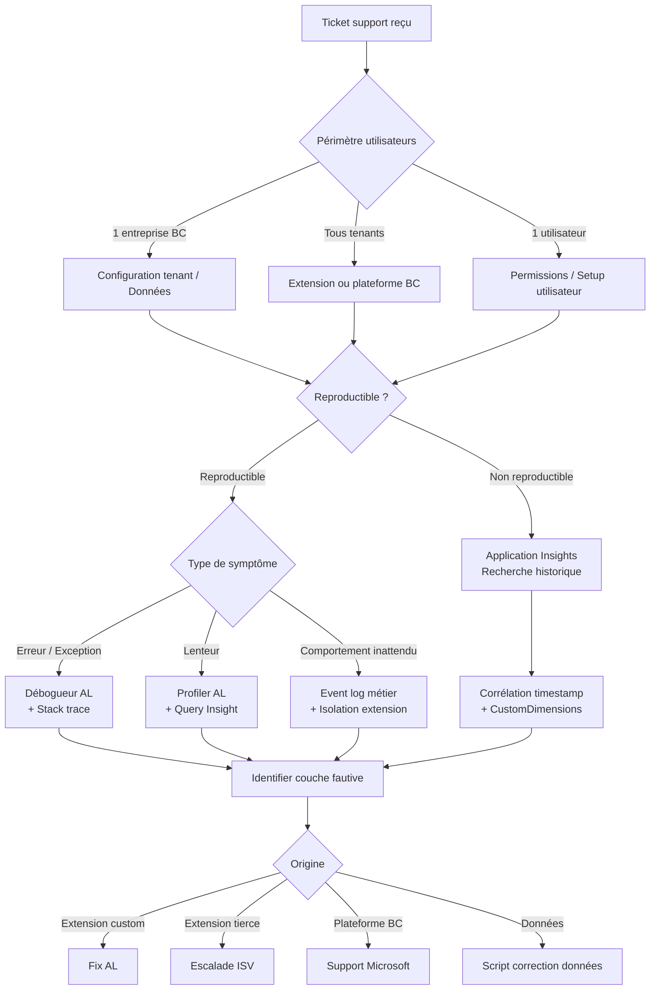

# Support applicatif ERP avancé

## Objectifs pédagogiques

- **Identifier** rapidement la couche responsable d'un comportement inattendu : extension, plateforme BC, données ou infrastructure
- **Lire et exploiter** la télémétrie Application Insights pour corréler erreurs, lenteurs et déclencheurs métier
- **Diagnostiquer** les problèmes de performance AL (boucles N+1, locks, appels HTTP synchrones) avec les outils natifs
- **Reproduire et isoler** un bug en environnement de support sans toucher la production
- **Prioriser et communiquer** un incident ERP vers les bonnes équipes selon l'origine identifiée

---

## Mise en situation

Une entreprise de distribution de 300 utilisateurs vient de migrer de NAV 2018 vers Business Central SaaS. Depuis le basculement, l'équipe support reçoit en moyenne 15 tickets par semaine : ralentissements inexpliqués à la validation de commande, erreurs intermittentes sur le journal général, une extension tierce qui "plante parfois" lors de la clôture mensuelle.

L'équipe technique est composée de deux développeurs AL et d'un consultant fonctionnel. Personne ne touche à la plateforme Microsoft directement — c'est SaaS. Les outils disponibles sont ceux de la plateforme : AL, le débogueur VS Code, Application Insights, et les API d'administration BC.

La tentation immédiate, c'est de mettre du code de trace partout et d'espérer que le problème se reproduit. C'est rarement efficace. Ce module explique comment faire autrement : lire les signaux avant de coder, isoler avant de corriger, comprendre la chaîne de cause avant de toucher quoi que ce soit.

---

## Cartographier le problème avant de déboguer

Le piège le plus courant en support ERP avancé, c'est de commencer par ouvrir VS Code. Avant d'écrire la moindre ligne, il faut répondre à trois questions :

1. **Qui** est affecté ? Un utilisateur, un rôle, tous les tenants ?
2. **Quand** ? Toujours, sous condition, pendant un batch, après une mise à jour d'extension ?
3. **Où** dans la chaîne de traitement ? UI, codeunit business logic, intégration externe, base de données ?

Ces trois dimensions définissent le périmètre de diagnostic. Une erreur qui touche un seul utilisateur n'a pas la même origine qu'une erreur qui touche tous les tenants d'un même environnement. Une lenteur qui apparaît uniquement en fin de mois pointe vers un volume de données ou un traitement batch, pas vers un bug de code.



Ce diagramme n'est pas un process rigide — c'est une carte mentale. En pratique, vous sautez d'une branche à l'autre au fil des informations collectées.

---

## Lire la télémétrie Application Insights comme un outil de diagnostic

Business Central SaaS génère une quantité importante de signaux vers Application Insights dès que vous configurez la connexion dans le centre d'administration. Ce n'est pas un outil de monitoring — c'est votre première ligne de diagnostic.

### Configurer et accéder

La connexion se fait depuis le portail d'administration BC :

```
Admin Center → Environments → [Votre environnement] → Application Insights → Connection String
```

Une fois configurée, les événements arrivent avec un délai de quelques minutes. Les données sont conservées 90 jours par défaut dans Application Insights.

### Les tables qui comptent en diagnostic

Trois tables Kusto sont essentielles :

| Table | Ce qu'elle contient | Usage diagnostic |
|-------|---------------------|-----------------|
| `traces` | Tous les événements BC custom (login, erreurs AL, appels HTTP) | Point d'entrée principal |
| `exceptions` | Exceptions levées dans la plateforme ET dans vos extensions | Diagnostic erreurs |
| `requests` | Requêtes web vers le service BC (API, web client) | Diagnostic lenteurs UI |
| `dependencies` | Appels sortants HTTP depuis AL | Diagnostic intégrations |
| `customEvents` | Événements métier BC (posting, workflow, job queue) | Corrélation métier |

### Requêtes Kusto utiles

Voici les requêtes que vous utiliserez le plus souvent.

**Identifier les erreurs des dernières 24h sur une extension spécifique :**

```kusto
traces
| where timestamp > ago(24h)
| where customDimensions.extensionId == "<EXTENSION_ID>"
| where severityLevel >= 3
| project timestamp, message, customDimensions.alObjectName, customDimensions.alStackTrace
| order by timestamp desc
```

**Corréler une lenteur avec son contexte métier :**

```kusto
requests
| where timestamp > ago(7d)
| where duration > 5000
| extend objectName = tostring(customDimensions.alObjectName)
| summarize avg(duration), count() by objectName, bin(timestamp, 1h)
| order by avg_duration desc
```

**Trouver les appels HTTP lents depuis vos extensions :**

```kusto
dependencies
| where timestamp > ago(24h)
| where type == "HTTP"
| where duration > 3000
| project timestamp, name, duration, success, customDimensions.extensionName
| order by duration desc
```

💡 **Le champ `customDimensions` est votre meilleur ami.** BC y stocke des dizaines d'informations contextuelles : l'ID de l'extension, le nom de l'objet AL, la stack trace, l'utilisateur, le job queue entry ID, etc. Systématiquement, commencez par `| extend` sur les champs qui vous intéressent avant de filtrer.

⚠️ **Erreur fréquente** : chercher une erreur par son message exact en `where message == "..."`. Les messages d'erreur BC contiennent souvent des valeurs dynamiques. Utilisez `| where message contains "..."` ou mieux, filtrez sur `customDimensions.alObjectName` qui est stable.

### Corrélation par session et par operation

Chaque interaction utilisateur génère un `session_Id` et un `operation_Id` dans Application Insights. Si un utilisateur vous dit "ça a planté hier vers 14h30", vous pouvez reconstituer toute sa session :

```kusto
traces
| where timestamp between(datetime(2024-01-15 14:25:00) .. datetime(2024-01-15 14:40:00))
| where customDimensions.aadTenantId == "<TENANT_ID>"
| project timestamp, operation_Id, session_Id, message, customDimensions.alObjectName
| order by timestamp asc
```

---

## Diagnostiquer les problèmes de performance AL

La performance est la catégorie de problème la plus fréquente en support ERP avancé, et la plus difficile à diagnostiquer sans méthode. Trois patterns causent 80% des cas.

### Pattern 1 : La boucle N+1 cachée

Le code AL suivant semble innocent :

```al
SalesLine.SetRange("Document No.", SalesHeader."No.");
if SalesLine.FindSet() then
    repeat
        Item.Get(SalesLine."No.");  // ← requête par itération
        if Item."Unit Cost" > 0 then
            DoSomething(Item);
    until SalesLine.Next() = 0;
```

Sur 5 lignes de commande, ce code génère 6 requêtes SQL. Sur une commande avec 200 lignes — ce qui est courant en distribution — c'est 201 requêtes. Sur un batch de 500 commandes, c'est potentiellement 100 000+ requêtes.

La correction : charger `Item` en dehors de la boucle avec un dictionnaire temporaire, ou retravailler la requête pour joindre les données nécessaires dès le départ.

🧠 **Comment le détecter dans Application Insights ?** Cherchez des `operation_Id` avec un nombre de traces anormalement élevé sur une courte période. Un `operation_Id` qui génère 500+ lignes sur 2 secondes est un signal fort de boucle N+1.

```kusto
traces
| where timestamp > ago(24h)
| summarize traceCount = count() by operation_Id, bin(timestamp, 10s)
| where traceCount > 100
| order by traceCount desc
```

### Pattern 2 : Les locks de base de données

BC utilise SQL Server (ou Azure SQL) en dessous. Les transactions AL peuvent générer des locks qui bloquent d'autres sessions — et les utilisateurs voient "l'écran qui tourne" sans message d'erreur clair.

Les signaux dans Application Insights :

```kusto
traces
| where timestamp > ago(1h)
| where message contains "lock"
    or message contains "deadlock"
    or customDimensions.alObjectName contains "Lock"
| project timestamp, message, customDimensions
```

Les causes fréquentes en AL :
- `LockTable()` appelé trop tôt dans une transaction longue
- Transactions ouvertes qui durent plusieurs secondes pendant un appel HTTP
- `Commit()` manquant ou mal positionné dans un traitement batch

⚠️ **Le piège classique** : appeler un service web externe au milieu d'une transaction SQL ouverte. La transaction reste ouverte pendant tout le temps de l'appel HTTP (parfois plusieurs secondes), bloquant les autres sessions sur les tables touchées.

```al
// ❌ À ne pas faire
SalesHeader.LockTable();
SalesHeader.Find();
SalesHeader.Status := SalesHeader.Status::Released;
SalesHeader.Modify();

Response := HttpClient.Send(Request);  // transaction ouverte pendant l'appel !

Commit();
```

```al
// ✅ Séparer les deux phases
SalesHeader.LockTable();
SalesHeader.Find();
SalesHeader.Status := SalesHeader.Status::Released;
SalesHeader.Modify();
Commit();  // fermer la transaction SQL avant l'appel HTTP

Response := HttpClient.Send(Request);
```

### Pattern 3 : Les SetFilter trop larges

`SetFilter` avec des wildcards en préfixe (`SetFilter("No.", '*SUFFIX')`) empêche SQL Server d'utiliser les index. Sur une table Items avec 50 000 enregistrements, la différence de temps peut aller de 20ms à 8 secondes.

Le diagnostic se fait dans les `dependencies` d'Application Insights, où BC logue les durées des requêtes SQL sous certaines conditions, ou via le **Query Insight** disponible dans Azure SQL pour les environnements de production.

```kusto
dependencies
| where timestamp > ago(24h)
| where type == "SQL"
| where duration > 1000
| project timestamp, name, duration, customDimensions
| order by duration desc
| take 50
```

---

## Utiliser le débogueur AL en contexte de support

Le débogueur AL dans VS Code n'est pas réservé au développement initial — il est souvent le seul moyen de comprendre un comportement inattendu qui ne génère pas d'exception visible.

### Attacher le débogueur à un environnement sandbox

La configuration `launch.json` pour un attach en sandbox :

```json
{
    "name": "Attach - Sandbox Support",
    "type": "al",
    "request": "attach",
    "environmentType": "Sandbox",
    "environmentName": "<NOM_SANDBOX>",
    "tenant": "<TENANT_ID>",
    "breakOnError": "All",
    "breakOnRecordWrite": "None",
    "enableSqlInformationDebugger": true,
    "enableLongRunningSqlStatements": true,
    "longRunningSqlStatementsThreshold": 500,
    "numberOfSqlStatements": 50
}
```

Les deux options `enableSqlInformationDebugger` et `enableLongRunningSqlStatements` sont précieuses en diagnostic : elles affichent dans le panneau débogueur le nombre de requêtes SQL générées à chaque step, et alertent sur les requêtes dépassant le seuil configuré (ici 500ms).

💡 **`breakOnError: "All"`** arrête l'exécution sur toutes les erreurs, même celles qui sont catchées par un `if Codeunit.Run(...)`. C'est souvent là que se cachent les "erreurs silencieuses" qui corrompent l'état sans générer de message visible.

### Reproduire sans toucher la production

La règle de base : **ne jamais attacher le débogueur en production**. Au-delà du risque de bloquer une session utilisateur réelle, le débogueur sur un environnement SaaS production peut ralentir le tenant.

La séquence recommandée :

1. Exporter les données problématiques via les API BC ou les rapports XML
2. Importer dans un sandbox dédié au support
3. Reproduire le scénario
4. Déboguer dans ce sandbox isolé

Si le bug n'est pas reproductible avec des données exportées (ce qui arrive — des états de données très spécifiques sont difficiles à transporter), utilisez Application Insights pour reconstituer l'état au moment de l'erreur via les `customDimensions`.

### Lire une stack trace AL

Une stack trace AL typique dans Application Insights ressemble à ceci :

```
"alStackTrace": "AppName(18.0.0.0) codeunit SalesPostingManager.CheckVATSetup line 142\n
AppName(18.0.0.0) codeunit SalesPostingManager.PostDocument line 89\n
Microsoft.Dynamics.Nav.Runtime codeunit Sales-Post line 2341"
```

La lecture se fait **de bas en haut** : le point d'entrée est en bas (ici, `Sales-Post` natif BC), et la ligne fautive est en haut. Dans cet exemple, c'est `CheckVATSetup` dans votre extension qui a levé l'erreur, appelé depuis votre `PostDocument`, lui-même appelé depuis l'objet natif BC.

🧠 **L'information critique** : si la ligne du haut appartient à votre extension, c'est votre code. Si toute la stack est dans `Microsoft.Dynamics.Nav.Runtime`, c'est la plateforme — et ça devrait être escaladé à Microsoft Support.

---

## Isoler une extension tierce

Quand plusieurs extensions coexistent (ce qui est la norme en entreprise), identifier laquelle cause un problème demande une méthode.

### Le test d'isolation

L'approche est binaire : désactiver les extensions une par une dans un sandbox en commençant par celles modifiées le plus récemment, et tester après chaque désactivation.

```
Admin Center → Environments → [Sandbox] → Extensions → [Extension] → Disable
```

L'ordre recommandé :
1. Extensions custom développées en interne (les plus récemment modifiées d'abord)
2. Extensions tierces AppSource déployées récemment
3. Extensions tierces présentes depuis longtemps

⚠️ **Désactiver une extension peut casser des données** si elle a modifié des tables. Toujours faire un snapshot du sandbox avant de commencer.

### Utiliser les `eventSubscriber` pour tracer sans modifier le code source

Quand vous n'avez pas accès au code source d'une extension tierce, vous pouvez créer une extension de diagnostic qui s'abonne aux mêmes events pour observer ce qui se passe avant/après :

```al
[EventSubscriber(ObjectType::Codeunit, Codeunit::"Sales-Post", 'OnBeforePostSalesDoc', '', false, false)]
local procedure TraceSalesPost(var SalesHeader: Record "Sales Header")
begin
    Session.LogMessage(
        '0001',
        StrSubstNo('BeforePost: DocNo=%1 Status=%2 Amount=%3',
            SalesHeader."No.",
            SalesHeader.Status,
            SalesHeader.Amount),
        Verbosity::Normal,
        DataClassification::SystemMetadata,
        TelemetryScope::ExtensionPublisher,
        'Category', 'SupportDiag'
    );
end;
```

Cette extension de diagnostic s'installe sur le sandbox, génère des traces dans Application Insights avec votre catégorie personnalisée, et vous permet d'observer l'état des données aux points clés du flux sans toucher au code de l'extension tierce.

---

## Diagnostiquer les erreurs d'intégration

Les intégrations (APIs sortantes, webhooks, connecteurs Power Automate) sont une source fréquente d'incidents ERP. La difficulté : l'erreur peut venir de n'importe quel côté de la connexion.

### Lire les erreurs HTTP depuis Application Insights

```kusto
dependencies
| where timestamp > ago(48h)
| where type == "HTTP"
| where success == false
| extend statusCode = tostring(customDimensions.httpStatusCode)
| summarize count() by statusCode, name
| order by count_ desc
```

| Code HTTP | Interprétation côté support ERP |
|-----------|--------------------------------|
| 401 | Token expiré ou secret rotation — vérifier la gestion OAuth de votre HttpClient |
| 429 | Rate limiting API externe — implémenter exponential backoff |
| 503 | Service cible indisponible — vérifier si le retry est géré côté AL |
| Timeout | Appel HTTP synchrone trop long — envisager une Job Queue Entry |

### Le pattern Job Queue pour les intégrations fragiles

Une intégration qui échoue en plein milieu d'une transaction utilisateur est toujours pénible. La bonne pratique : déporter les appels HTTP dans une Job Queue Entry qui peut être relancée indépendamment.

```al
// Stocker ce qui doit être envoyé dans une table tampon
IntegrationBuffer.Init();
IntegrationBuffer."Document Type" := IntegrationBuffer."Document Type"::Invoice;
IntegrationBuffer."Document No." := SalesHeader."No.";
IntegrationBuffer.Status := IntegrationBuffer.Status::Pending;
IntegrationBuffer.Insert(true);

// La Job Queue prend en charge l'envoi de manière asynchrone
// L'utilisateur n'est pas bloqué si l'API externe est lente ou en erreur
```

Cela transforme une erreur bloquante en erreur récupérable — le ticket support devient "relancer le job" plutôt que "recréer la commande".

---

## Cas réel en entreprise

**Contexte** : éditeur logistique, 8 clients BC SaaS, extension de picking mobile (~45 000 lignes AL). Depuis une mise à jour mineure de l'extension, un client sur huit signale des ralentissements à la validation de picking — 8 à 12 secondes au lieu de 1 à 2 secondes habituellement.

**Phase 1 — Télémétrie** : requête Application Insights sur les `requests` de ce tenant sur les 7 derniers jours, filtrée sur les pages de picking. Résultat : durée médiane passée de 1,2s à 9,4s exactement depuis le déploiement 2.3.1 le mardi précédent.

**Phase 2 — Isolation** : le même scénario sur les 7 autres clients (en 2.3.0) montre des temps normaux. La régression est clairement dans la 2.3.1.

**Phase 3 — Diff de code** : comparaison des commits entre 2.3.0 et 2.3.1. Un seul codeunit modifié : `PickingValidation`. La modification ajoutait un appel à `Item.Get()` pour vérifier un champ de traçabilité — à l'intérieur d'une boucle sur les `Warehouse Activity Lines`.

**Phase 4 — Quantification** : dans ce tenant, les ordres de picking ont en moyenne 47 lignes. L'`Item.Get()` était déjà appelé dans la boucle via un autre chemin, mais la nouvelle vérification le doublait. 47 × 2 = 94 requêtes SQL au lieu de 47. Multiplié par le nombre de validations simultanées en heure de pointe (6 à 8 terminaux), le serveur traitait 750+ requêtes SQL là où 350 suffisaient.

**Correction** : cache `Item` dans un `Dictionary` local avant la boucle. Temps de validation retombé à 1,1s. Déployé en 2.3.2 le lendemain.

**Ce qui a changé dans le process** : ajout d'une règle de code review vérifiée automatiquement — tout `FindSet/Next` contenant un `Get()` d'une autre table déclenche un warning CI.

---

## Bonnes pratiques de support ERP avancé

**1. Instrumenter avant d'avoir un problème**
`Session.LogMessage()` avec `TelemetryScope::ExtensionPublisher` envoie vos traces vers Application Insights du client. Instrumenter les points critiques (début/fin de posting, appels HTTP, traitements batch) dès le développement, pas lors du diagnostic.

**2. Versionner les environnements de support**
Maintenir un sandbox figé à la version N-1 de chaque extension. Quand un bug est signalé, la comparaison entre N-1 et N se fait en minutes, pas en heures.

**3. Ne jamais corriger les données directement**
En SaaS, vous n'avez pas accès à la base. En OnPrem, vous avez techniquement accès — mais corriger des données SQL hors AL casse l'intégrité référentielle BC. Toujours passer par un codeunit de correction.

**4. Qualifier "intermittent" avant de chercher**
"Ça arrive parfois" cache souvent un pattern : sous charge, avec certaines données, après une opération spécifique. Demander systématiquement : heure, utilisateur, données impliquées, actions précédentes. 80% des bugs "intermittents" ont un déclencheur précis.

**5. Documenter le diagnostic, pas seulement la correction**
Un fix sans trace du raisonnement sera impossible à comprendre dans six mois. Stocker : symptôme initial, piste éliminées, cause racine identifiée, requête Kusto utilisée.

**6. Séparer les problèmes de données des problèmes de code**
Une moitié des tickets "bug" en ERP sont des problèmes de setup ou de données corrompues. Avant de chercher un bug AL, vérifier les tables de configuration et les entrées suspectes dans les tables de journalisation BC.

**7. Communiquer l'incertitude clairement**
"Je pense que c'est X mais je n'ai pas encore isolé" est une position professionnelle légitime. Annoncer un diagnostic avant de l'avoir vérifié génère de la pression pour livrer un fix sans avoir compris le problème — ce qui crée le prochain ticket.

---

## Résumé

Le support ERP avancé n'est pas du débogage ad hoc — c'est une démarche structurée qui commence par qualifier le périmètre du problème avant d'ouvrir un outil. Application Insights est le centre de gravité du diagnostic BC SaaS : telemetry de session, durées SQL, appels HTTP, stack traces, tout y est à condition de savoir interroger. Le débogueur AL complète l'image pour les comportements qui ne génèrent pas d'exception visible. Les patterns de performance récurrents — boucle N+1, locks pendant les appels HTTP, filtres sans index — se retrouvent dans quasiment tous les projets BC complexes et se diagnostiquent rapidement une fois la méthode acquise. L'isolation des extensions tierces et la reproduction en sandbox sont les garde-fous qui protègent la production. Le module suivant abordera la conception architecturale des solutions BC modernes en SaaS, où ces compétences de diagnostic nourriront des décisions de design préventives.

---

<!-- snippet
id: al_appinsights_erreurs_extension
type: command
tech: al
level: advanced
importance: high
format: knowledge
tags: application-insights, kusto, telemetry, diagnostic, business-central
title: Requête Kusto — erreurs d'une extension BC sur 24h
context: Application Insights connecté à l'environnement BC via Admin Center
command: traces | where timestamp > ago(24h) | where customDimensions.extensionId == "<EXTENSION_ID>" | where severityLevel >= 3 | project timestamp, message, customDimensions.alObjectName, customDimensions.alStackTrace | order by timestamp desc
example: traces | where timestamp > ago(24h) | where customDimensions.extensionId == "5b2b5c7a-1234-4b8e-a1f0-abcdef123456" | where severityLevel >= 3 | project timestamp, message, customDimensions.alObjectName, customDimensions.alStackTrace | order by timestamp desc
description: Point d'entrée diagnostic erreurs : filtre sur extensionId (stable) plutôt que sur message (dynamique), severityLevel >= 3 = Warning+Error
-->

<!-- snippet
id: al_appinsights_session_reconstruct
type: command
tech: al
level: advanced
importance: high
format: knowledge
tags: application-insights, kusto, session, diagnostic, telemetry
title: Reconstituer une session utilisateur BC par timestamp
context: Quand un utilisateur donne une heure approximative d'incident
command: traces | where timestamp between(datetime(<DATE_DEBUT>) .. datetime(<DATE_FIN>)) | where customDimensions.aadTenantId == "<TENANT_ID>" | project timestamp, operation_Id, session_Id, message, customDimensions.alObjectName | order by timestamp asc
example: traces | where timestamp between(datetime(2024-01-15 14:25:00) .. datetime(2024-01-15 14:40:00)) | where customDimensions.aadTenantId == "contoso.onmicrosoft.com" | project timestamp, operation_Id, session_Id, message, customDimensions.alObjectName | order by timestamp asc
description: Reconstitue la chronologie complète d'une session. Chaque interaction utilisateur partage un même operation_Id exploitable pour filtrer ensuite
-->

<!-- snippet
id: al_appinsights_n1_detection
type: command
tech: al
level: advanced
importance: high
format: knowledge
tags: application-insights, kusto, performance, n-plus-un, diagnostic
title: Détecter une boucle N+1 via le volume de traces par operation
context: Recherche dans Application Insights BC
command: traces | where timestamp > ago(24h) | summarize traceCount = count() by operation_Id, bin(timestamp, 10s) | where traceCount > 100 | order by traceCount desc
description: Un operation_Id générant 100+ traces sur 10 secondes est un signal fort de boucle N+1 ou d'itération non optimisée — à croiser avec alObjectName
-->

<!-- snippet
id: al_lock_http_transaction
type: warning
tech: al
level: advanced
importance: high
format: knowledge
tags: lock, transaction, http, performance, al
title: Ne jamais appeler HttpClient au milieu d'une transaction SQL ouverte
content: Piège : appeler HttpClient.Send() après LockTable()/Modify() sans Commit() préalable. Conséquence : la transaction SQL reste ouverte pendant toute la durée de l'appel HTTP (potentiellement plusieurs secondes), bloquant les autres sessions sur les tables touchées. Correction : appeler Commit() pour clore la transaction SQL avant tout appel HTTP.
description: Pattern deadlock fréquent en AL — séparer explicitement la phase SQL (LockTable→Modify→Commit) de la phase HTTP dans deux blocs distincts
-->

<!-- snippet
id: al_debugger_sql_attach
type: tip
tech: al
level: advanced
importance: high
format: knowledge
tags: debugger, vscode, sql, performance, diagnostic
title: Activer l'inspection SQL dans le débogueur AL (launch.json)
content: Dans launch.json, ajouter "enableSqlInformationDebugger": true, "enableLongRunningSqlStatements": true, "longRunningSqlStatementsThreshold": 500. Le débogueur affiche alors le nombre de requêtes SQL générées à chaque step et alerte sur celles dépassant 500ms — sans modifier le code source.
description: Option la plus rapide pour quantifier les requêtes SQL en debug — détecte les N+1 et les requêtes lentes directement dans le panneau VS Code
-->

<!-- snippet
id: al_stack_trace_lecture
type: concept
tech: al
level: advanced
importance: medium
format: knowledge
tags: stack-trace, diagnostic, application-insights, al, debug
title: Lire une stack trace AL dans Application Insights
content: La stack trace AL se lit de bas en haut : la ligne du bas est le point d'entrée (souvent un objet natif BC), la ligne du haut est la ligne fautive. Si le haut pointe vers votre extension → votre code. Si toute la stack est dans Microsoft.Dynamics.Nav.Runtime
