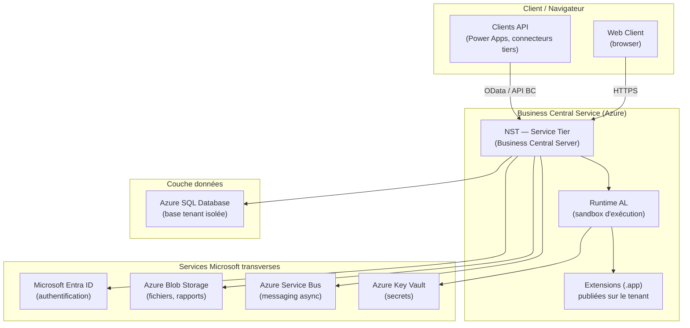
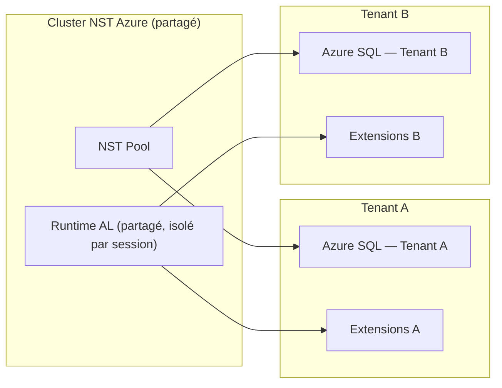
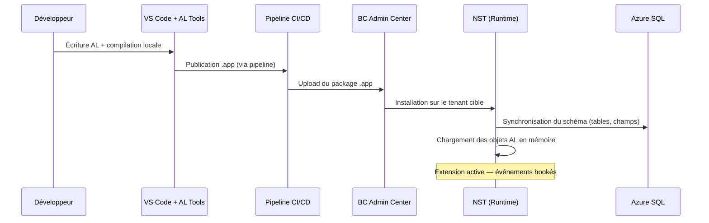
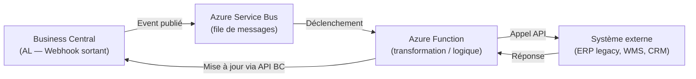

# Architecture SaaS Business Central moderne

## Objectifs pédagogiques

À l'issue de ce module, vous serez capable de :

1. **Décrire** les couches architecturales de Business Central SaaS et le rôle de chaque composant
2. **Expliquer** le modèle multi-tenant de BC et ses implications concrètes pour le développement d'extensions
3. **Distinguer** les limites imposées par la plateforme SaaS des contraintes contournables par conception
4. **Anticiper** les impacts de l'architecture sur les décisions techniques : extensibilité, intégrations, performance
5. **Identifier** les points de couplage entre AL, Azure et les services Microsoft sur lesquels repose BC SaaS

---

## Mise en situation

Vous intégrez l'équipe technique d'un éditeur ISV qui publie une extension sur AppSource. L'extension fonctionne correctement en sandbox, mais en production chez un client, les performances se dégradent lors des imports de masse et certains appels API vers un service externe échouent de façon intermittente.

Le réflexe initial est de chercher un bug dans le code AL. Mais après investigation, il s'avère que le problème vient de la plateforme elle-même : les limites d'exécution SaaS ont été atteintes, et l'API externe n'est pas accessible depuis les serveurs Azure où tourne BC.

Ce type de situation — fréquent en production — est impossible à anticiper sans comprendre l'architecture réelle de Business Central SaaS. Ce n'est pas juste une question de savoir "où tourne le code". C'est comprendre *pourquoi* la plateforme se comporte ainsi, *quelles contraintes elle impose structurellement*, et *comment concevoir des solutions qui fonctionnent avec elle, pas contre elle*.

---

## Contexte : pourquoi l'architecture SaaS de BC est un sujet à part entière

Business Central n'est pas un ERP classique hébergé dans le cloud. C'est une plateforme SaaS native Azure, repensée de fond en comble depuis l'ère NAV/Dynamics NAV. Cette transition a des conséquences profondes sur la façon dont on développe, déploie et intègre des extensions.

En NAV, tout était possible : accès direct à la base SQL, DLL custom, hooks bas niveau, exécution de scripts système. Le développeur avait une liberté totale — et une surface d'erreur en proportion. BC SaaS inverse ce paradigme : la plateforme prend en charge l'infrastructure, la résilience, les mises à jour, la sécurité. En échange, elle impose un cadre strict que tout développeur AL avancé doit connaître précisément.

Un pattern NAV qui paraissait innocent devient une source d'incidents en BC SaaS. Exemple concret : en NAV, un singleton global C/AL pouvait tenir un état applicatif entre deux appels utilisateur. En BC SaaS, la même approche échoue silencieusement — la session suivante n'a aucune mémoire de l'état précédent, parce que le runtime est stateless par construction. Le code "fonctionne" en sandbox à faible charge, et explose en production sous sessions concurrentes.

> **Ce n'est pas une restriction arbitraire.** C'est le contrat implicite du SaaS : Microsoft garantit la disponibilité et les mises à jour automatiques parce que personne ne peut modifier ce qu'il ne contrôle pas.

---

## Architecture générale : les couches de Business Central SaaS

### Vue d'ensemble

Business Central SaaS s'appuie sur une architecture en couches hébergée intégralement sur Azure. Voici comment ces couches s'organisent :



### Les composants en détail

| Composant | Rôle | Ce que ça implique pour le développeur |
|-----------|------|----------------------------------------|
| **NST (Service Tier)** | Cœur applicatif BC — gère les sessions, le routage, la sécurité, l'exécution AL | On n'y a pas accès direct ; tout passe par lui |
| **Runtime AL** | Sandbox d'exécution des extensions — isolation par design | Pas d'appels système, pas de DLL externe, pas d'écriture disque |
| **Azure SQL Database** | Base de données par tenant, gérée par Microsoft | Pas d'accès SQL direct depuis AL ; uniquement via la couche objet BC |
| **Microsoft Entra ID** | Authentification OAuth2 / OIDC pour tous les accès | Toute intégration externe doit passer par Entra ID |
| **Azure Blob Storage** | Stockage fichiers (exports, pièces jointes, rapports) | En AL, on accède via `TempBlob` ou les API BC, jamais directement |
| **Azure Service Bus** | Messagerie asynchrone pour les événements sortants | Accessible depuis AL via les connecteurs BC (Webhooks, API) |
| **Azure Key Vault** | Stockage des secrets (clés API, credentials) | En AL, on utilise `IsolatedStorage` ou les secrets d'environnement BC |

---

## Le modèle multi-tenant : au cœur de tout

### Ce que "multi-tenant" signifie vraiment ici

Le mot "multi-tenant" est souvent utilisé vaguement. Dans le contexte BC SaaS, il a une signification précise et des conséquences très concrètes.

Microsoft exploite des **clusters NST partagés** sur Azure. Plusieurs tenants (plusieurs clients BC) s'exécutent sur la même infrastructure physique, mais avec une **isolation stricte** au niveau des données et de la session. Chaque tenant dispose de sa propre base Azure SQL, de ses propres extensions installées, de ses propres utilisateurs.

Imaginez un immeuble de bureaux : le bâtiment est partagé (infrastructure Azure), mais chaque étage (tenant) est verrouillé, et personne ne peut accéder aux affaires d'un autre occupant.



### Conséquences directes pour le développeur AL

**1. Les extensions ne peuvent pas accéder aux données d'un autre tenant.**
C'est physiquement impossible par architecture. Pas besoin de le coder — c'est garanti par la plateforme.

**2. Les extensions sont chargées par tenant.**
Une extension publiée sur AppSource est téléchargée et installée *par tenant*. Si deux tenants ont la même extension, chaque instance est indépendante. Les données de configuration (comme celles dans une `Setup Table`) ne sont jamais partagées entre tenants.

**3. L'état en mémoire entre sessions n'existe pas.**
En NAV, on pouvait s'appuyer sur des variables globales persistantes côté serveur entre deux appels. En BC SaaS, chaque session AL est isolée. Si vous avez besoin de persister un état, écrivez-le en base.

🧠 **Concept clé** — Le runtime AL est *stateless par design*. Une session = un contexte d'exécution isolé. L'unique mémoire partagée entre sessions, c'est la base de données.

---

## Les limites de la plateforme SaaS : contraintes ou garde-fous ?

C'est ici que beaucoup de développeurs se heurtent à la réalité de BC SaaS. La plateforme impose des limites d'exécution strictes. Elles ne sont pas là pour embêter le développeur — elles protègent l'ensemble des tenants du cluster.

### Tableau des limites et implications concrètes

| Limite | Valeur indicative | Symptôme observable en production | Mitigation recommandée |
|--------|-------------------|------------------------------------|------------------------|
| **Timeout session UI** | 30 min | Transaction coupée, données partielles | Déléguer à la Job Queue |
| **Timeout session Job Queue** | Configurable (défaut : 12h) | Job bloqué, statut "In Process" figé | Découper en lots, surveiller le statut |
| **Timeout appel HTTP** | ~2 min par défaut | Erreur intermittente sur API externe lente | Retry + pattern async via Service Bus |
| **Mémoire par session** | ~500 Mo selon configuration | OutOfMemory sur imports massifs | `SetLoadFields`, traitement par lots |
| **Taille payload API** | ~30 Mo par requête | Erreur 413 sur uploads volumineux | Chunking, import asynchrone via Job Queue |
| **Accès réseau sortant** | IPs Azure région tenant | API externe injoignable (firewall bloque) | Autoriser plages IP Azure ou passer par APIM |
| **Écriture fichier local** | Interdite | Exception à l'exécution | `TempBlob`, `InStream`/`OutStream` |
| **Sessions concurrentes** | Limité par licence et plan | Dégradation perceptible au-delà de ~50 sessions actives simultanées | Background sessions, Job Queue distribuée |

> **Comment tester ces limites avant la mise en production ?** La méthode pragmatique : créer un sandbox dédié aux tests de charge avec un jeu de données représentatif du volume réel (au minimum 80 % du volume production). Instrumenter avec Application Insights pour mesurer la durée des sessions et détecter les timeouts avant qu'ils atteignent la production.

⚠️ **Erreur fréquente** — Déclencher un traitement long depuis un événement synchrone (bouton UI ou appel API). La session expire, le traitement est coupé, et les données se retrouvent dans un état partiel. La bonne approche : créer une entrée en **Job Queue** depuis le code AL, et laisser le moteur BC exécuter le traitement en background.

### Les appels HTTP sortants : un point de vigilance spécifique

BC SaaS peut appeler des APIs externes depuis AL avec `HttpClient`. Mais ces appels sortent des datacenters Azure de Microsoft. Deux implications :

1. **L'URL de destination doit être accessible depuis Azure** — un serveur interne d'entreprise derrière un firewall sans exposition externe est injoignable.
2. **Les IPs sources sont celles de Microsoft Azure** — si le service externe filtre par IP, il faut autoriser les plages Azure correspondant à la région du tenant BC.

💡 **Astuce** — Pour les intégrations avec des services internes entreprise, la bonne architecture passe par un **API Gateway exposé sur Internet** (Azure API Management, par exemple) ou par un **Azure Service Bus** en mode hybride. On ne force jamais une connexion directe non supportée.

---

## Fonctionnement interne : le cycle de vie d'une extension

Comprendre comment une extension AL existe dans ce modèle SaaS, c'est éviter des dizaines d'erreurs de conception.

### De la compilation au runtime



Quelques points à retenir dans ce cycle :

- **La synchronisation du schéma** est l'étape qui migre la base SQL (ajout de colonnes, de tables). C'est elle qui peut bloquer une mise à jour si le schéma n'est pas compatible avec la version précédente de l'extension.
- **Les objets AL sont compilés en bytecode** — le source AL n'est pas embarqué dans le `.app` déployé en production. Le runtime BC exécute ce bytecode dans son sandbox.
- **Les dépendances entre extensions** sont résolues à l'installation — si l'extension A dépend de B, B doit être installée avant A. Une dépendance manquante bloque l'installation.

🧠 **Concept clé** — Une extension AL n'est pas un exécutable indépendant. C'est un ensemble d'objets et d'événements *greffés* sur le moteur BC. Elle n'a pas de process propre, pas de thread propre. Elle s'exécute dans le contexte du NST, sous ses règles.

### Isolation des extensions entre elles

Plusieurs extensions peuvent coexister sur un tenant. Elles interagissent uniquement via des mécanismes contrôlés :

- **Events / Subscribers** — une extension publie un événement, une autre s'y abonne
- **Dependency** déclarée dans `app.json` — accès aux objets publics d'une extension source
- **API Pages / OData** — échange de données via des endpoints standards

Il n'y a pas d'accès mémoire direct entre extensions, pas de référence partagée, pas de singleton global inter-extension. C'est voulu : deux extensions d'éditeurs différents ne doivent pas pouvoir se perturber.

---

## Environnements BC : production, sandbox, et la logique de promotion

Un point souvent mal compris : les **environnements BC ne sont pas des branches Git**. Ce sont des instances de tenant indépendantes, avec leurs propres bases de données, leurs propres extensions installées, leurs propres données.


La promotion d'une extension suit le `.app` compilé — c'est le même artefact qui traverse les environnements. Ce qui change, c'est la base de données et les données de configuration.

⚠️ **Erreur fréquente** — Tester en sandbox avec des données fictives, puis découvrir en production que la performance s'effondre avec un volume réel. Un sandbox BC n'est pas limité en performances de la même façon qu'un tenant production soumis à un vrai usage concurrent. Les tests de charge ne peuvent pas se faire sur sandbox standard.

---

## L'écosystème de services autour de BC SaaS

BC ne vit pas seul. En production, une architecture réelle implique plusieurs services satellites qui gravitent autour.

### Les intégrations natives Microsoft

| Service | Rôle dans l'écosystème BC | Point d'attention |
|---------|--------------------------|-------------------|
| **Power Automate** | Automatisation de flux métier, déclencheurs BC | Latence : ce n'est pas du temps réel |
| **Power Apps** | Applications légères consommant les API BC | Bien distinguer des extensions AL (pas le même canal) |
| **Microsoft Teams** | Collaboration avec intégration BC (fiches, notifications) | Configurable sans développement AL dans la plupart des cas |
| **Azure API Management** | Proxy et gouvernance des appels API vers/depuis BC | Recommandé dès qu'un partenaire externe consomme l'API |
| **Azure Service Bus** | File de messages asynchrones pour les intégrations découplées | Le pattern idéal pour les intégrations à fort volume |
| **Azure Functions** | Logique de transformation côté Azure, non AL | Permet d'externaliser ce que AL ne peut pas faire |

### Le pattern d'intégration recommandé en production

Pour une intégration robuste entre BC et un système externe (WMS, CRM, portail e-commerce), le pattern qui résiste en production ressemble à ceci :



Ce pattern découple BC du système externe : si l'API externe est lente ou indisponible, la file absorbe le pic, et BC n'est jamais bloqué. C'est la raison pour laquelle les appels HTTP synchrones depuis AL sont déconseillés pour les intégrations critiques.

---

## Cas réel en entreprise

**Contexte** : un distributeur logistique utilise BC SaaS pour la gestion des commandes. Son WMS interne tourne sur un serveur on-premise. L'équipe avait développé une intégration directe en AL — à chaque création de commande BC, un appel HTTP synchrone partait vers le WMS depuis le trigger `OnAfterInsertEvent` de la table `Sales Header`.

**Le problème initial — le code AL problématique** :

```al
// ❌ Pattern dangereux : appel HTTP synchrone dans un trigger d'insertion
[EventSubscriber(ObjectType::Table, Database::"Sales Header", 'OnAfterInsertEvent', '', false, false)]
local procedure OnSalesHeaderInserted(var Rec: Record "Sales Header")
var
    HttpClient: HttpClient;
    HttpResponse: HttpResponseMessage;
    JsonPayload: Text;
begin
    // Construction du payload JSON
    JsonPayload := BuildWMSPayload(Rec);

    // Appel synchrone direct — bloquant, sans retry, sans timeout contrôlé
    HttpClient.Post('https://wms-internal.company.local/api/orders', 
                    HttpContent, HttpResponse);
    // Si le WMS est lent → timeout session BC → données partielles
end;
```

En période de pic (fin de mois, promotions), le WMS ralentissait. Les appels HTTP depuis BC dépassaient le timeout de session. Les commandes BC étaient créées mais les données n'atteignaient pas le WMS, créant des incohérences de stock.

**La solution architecturale — remplacement par le pattern asynchrone** :

```al
// ✅ Pattern correct : écriture en staging + Job Queue Entry
[EventSubscriber(ObjectType::Table, Database::"Sales Header", 'OnAfterInsertEvent', '', false, false)]
local procedure OnSalesHeaderInserted(var Rec: Record "Sales Header")
var
    WMSSyncQueue: Record "WMS Sync Queue";  // Table staging custom
begin
    // On ne fait qu'enregistrer la demande — pas d'appel HTTP ici
    WMSSyncQueue.Init();
    WMSSyncQueue."Document Type" := WMSSyncQueue."Document Type"::Order;
    WMSSyncQueue."Document No." := Rec."No.";
    WMSSyncQueue.Status := WMSSyncQueue.Status::New;
    WMSSyncQueue."Created At" := CurrentDateTime();
    WMSSyncQueue.Insert(true);
    
    // Optionnel : enqueue immédiatement une Job Queue Entry si traitement urgent
    EnqueueWMSSyncJob(WMSSyncQueue);
end;

local procedure EnqueueWMSSyncJob(var WMSSyncQueue: Record "WMS Sync Queue")
var
    JobQueueEntry: Record "Job Queue Entry";
    JobQueueMgt: Codeunit "Job Queue Management";
begin
    JobQueueEntry.Init();
    JobQueueEntry."Object Type to Run" := JobQueueEntry."Object Type to Run"::Codeunit;
    JobQueueEntry."Object ID to Run" := Codeunit::"WMS Sync Processor";
    JobQueueEntry."Parameter String" := Format(WMSSyncQueue.SystemId);
    JobQueueEntry."Earliest Start Date/Time" := CurrentDateTime();
    JobQueueEntry."Maximum No. of Attempts to Run" := 3;
    JobQueueMgt.CreateJobQueueEntry(JobQueueEntry);
end;
```

La codeunit `WMS Sync Processor` prend en charge l'appel HTTP avec retry, timeout contrôlé, et mise à jour du statut dans la staging table.

**Résultat** : zéro timeout BC, zéro perte de données, et la staging table sert de journal d'audit des échanges — bonus non anticipé mais valorisé par le client. En cas d'échec WMS, les lignes restent en statut `Error` et peuvent être rejouées manuellement depuis une page de monitoring custom.

---

## Checklist de conception avant mise en production

Avant de déployer une extension en production, vérifier systématiquement ces points :

**Runtime et sessions**
- [ ] Aucun traitement dépassant 30 secondes ne s'exécute dans une session UI
- [ ] Les imports et calculs lourds passent par la Job Queue
- [ ] Aucun état applicatif ne repose sur une variable globale inter-session
- [ ] Les `SingleInstance` codeunits sont utilisées uniquement pour du cache intra-session légitime

**Appels HTTP et intégrations**
- [ ] Tous les appels `HttpClient` ont un timeout explicite configuré
- [ ] Un mécanisme de retry est implémenté (via `TryFunction` ou compteur)
- [ ] Les intégrations critiques passent par Service Bus, pas par appel synchrone direct
- [ ] Les plages IP Azure sont autorisées sur les firewalls des services cibles

**Sécurité et secrets**
- [ ] Aucune clé API ni credential n'est écrit en dur dans le code AL ou une table Setup
- [ ] Les secrets sont stockés via `IsolatedStorage` ou les secrets d'environnement BC Admin Center
- [ ] Les Permission Sets de l'extension suivent le principe du moindre privilège

**Schéma et migration**
- [ ] Toute modification de structure (ajout/suppression de champ) est accompagnée d'un codeunit d'upgrade
- [ ] Les `UpgradeTag` sont utilisés pour garantir l'idempotence de la migration
- [ ] L'upgrade a été testé sur une copie de base de données réelle, pas seulement en sandbox vide

**Monitoring**
- [ ] Application Insights est configuré sur le tenant de production
- [ ] Les Job Queue Entries critiques ont un monitoring de statut actif
- [ ] Les erreurs AL publient des signaux de télémétrie custom (`LogMessage`)

---

## Bonnes pratiques

**1. Concevoir pour le stateless.** Toute logique qui suppose un état persistant entre deux sessions doit être écrite en base. Ne jamais faire confiance à une variable "globale" en AL pour survivre à une nouvelle session.

**2. Déléguer les traitements longs à la Job Queue.** Dès qu'un traitement dépasse quelques secondes ou porte sur un volume important, il ne doit pas s'exécuter dans la session utilisateur. Créer une entrée Job Queue depuis AL et laisser le moteur BC scheduler gérer l'exécution.

**3. Externaliser ce que AL ne peut pas faire.** Appels longs, transformations complexes, connexions à des systèmes internes : ces responsabilités appartiennent à Azure Functions ou à des services externes, pas au code AL.

**4. Versionner le schéma de données avec discipline.** Chaque montée de version d'extension peut déclencher une migration de schéma SQL. Si la migration est destructive ou incompatible, elle bloque l'installation en production. Anticiper dès la conception avec les procédures `OnUpgradePerDatabase` et `OnUpgradePerCompany`.

**5. Ne jamais stocker de secrets dans le code AL.** Les clés API, credentials et tokens doivent être dans `IsolatedStorage` (pour des données par tenant) ou dans les secrets d'environnement BC Admin Center — jamais en dur dans une table de configuration ou dans le source.

**6. Tester les limites de la plateforme avant la mise en production.** Simuler les volumes réels en sandbox de performance dédiée si possible, ou au moins valider les chemins critiques avec des jeux de données représentatifs. Utiliser la checklist ci-dessus comme point de départ.

**7. Documenter les dépendances inter-extensions.** Dans les projets multi-extensions, la chaîne de dépendances peut devenir complexe. Maintenir un graphe de dépendances à jour évite les blocages lors des mises à jour.

---

## Résumé

Business Central SaaS repose sur une architecture Azure multi-tenant où le NST, le runtime AL isolé et Azure SQL forment le cœur d'exécution. Chaque tenant est strictement isolé — en données comme en exécution — et les extensions AL s'exécutent dans un sandbox sans accès système direct. La plateforme impose des limites d'exécution (timeout, mémoire, réseau) qui ne sont pas des bugs mais des contraintes structurelles du modèle SaaS, avec des symptômes bien identifiables en production (sessions coupées, imports partiels, erreurs HTTP intermittentes). Les conséquences pour le développeur sont concrètes : traitement long → Job Queue avec retry, intégration externe robuste → Service Bus + Azure Functions, secrets → IsolatedStorage ou secrets d'environnement. Comprendre cette architecture, c'est comprendre pourquoi certaines solutions "évidentes" issues de l'ère NAV sont inopérantes en BC SaaS, et comment concevoir des extensions qui fonctionnent *avec* la plateforme plutôt que contre elle. La checklist de conception fournie dans ce module sert de garde-fou avant chaque mise en production. Le module suivant explorera comment Power BI s'intègre dans cet écosystème du point de vue du développeur AL.

---

<!-- snippet
id: bc_saas_stateless_runtime
type: concept
tech: business-central
level: advanced
importance: high
format: knowledge
tags: business-central, al, runtime, session, architecture
title: Le runtime AL est stateless par design
content: Chaque session AL est un contexte d'exécution isolé : aucune variable en mémoire ne survit entre deux sessions distinctes. Si un état doit persister entre appels (configuration, verrou, résultat intermédiaire), il doit être écrit en base de données. Un singleton global inter-session n'existe pas en BC SaaS. Conséquence directe : le pattern NAV de "variable globale codeunit" comme cache applicatif partagé échoue silencieusement en multi-sessions concurrentes.
description: Pas de mémoire partagée entre sessions BC — tout état durable passe obligatoirement par la base de données du tenant.
-->

<!-- snippet
id: bc_saas_job_queue_create_from_al
type: concept
tech: business-central
level: advanced
importance: high
format: knowledge
tags: business-central, job-queue, async, al, codeunit
title: Créer une Job Queue Entry depuis AL pour déléguer un traitement lourd
content: Pour déléguer un traitement long depuis un bouton UI ou un événement, créer programmatiquement une Job Queue Entry depuis AL. Exemple : JobQueueEntry.Init(); JobQueueEntry."Object Type to Run" := JobQueueEntry."Object Type to Run"::Codeunit; JobQueueEntry."Object ID to Run" := Codeunit::"Mon Traitement"; JobQueueEntry."Parameter String" := MonParametre; JobQueueEntry."Maximum No. of Attempts to Run" := 3; JobQueueEntry."Earliest Start Date/Time" := CurrentDateTime(); JobQueueMgt.CreateJobQueueEntry(JobQueueEntry); — La codeunit cible reçoit le paramètre via GetCurrentJobQueueEntry().
description: Créer une Job Queue Entry depuis AL : initialiser, configurer l'objet cible, définir le paramètre et le nombre de retry, puis appeler JobQueueMgt.CreateJobQueueEntry.
-->

<!-- snippet
id: bc_saas_http_client_retry_pattern
type: concept
tech: business-central
level: advanced
importance: high
format: knowledge
tags: business-central, http, httpclient, retry, al, integration
title: Appel HttpClient avec retry et gestion timeout depuis AL
content: Pattern robuste pour appel HTTP sortant depuis AL avec retry : déclarer HttpClient, HttpRequestMessage, HttpResponseMessage. Dans une boucle (max 3 tentatives), appeler HttpClient.Send(Request, Response). Si succès (Response.IsSuccessStatusCode()), sortir. Sinon, attendre (Sleep) et retenter. Gérer explicitement le cas TryFunction sur l'appel Send
